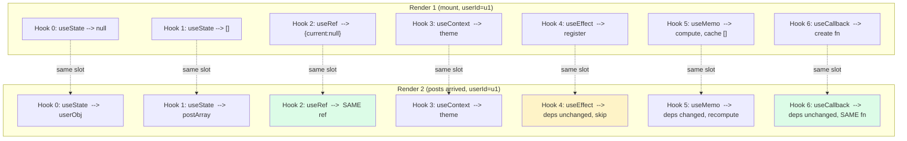
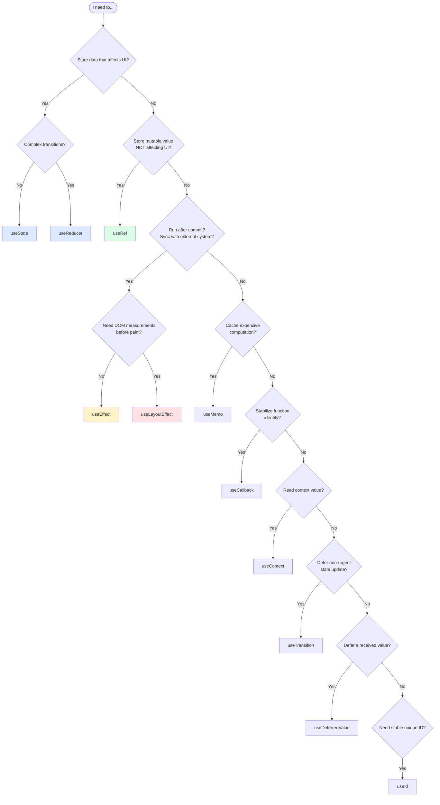
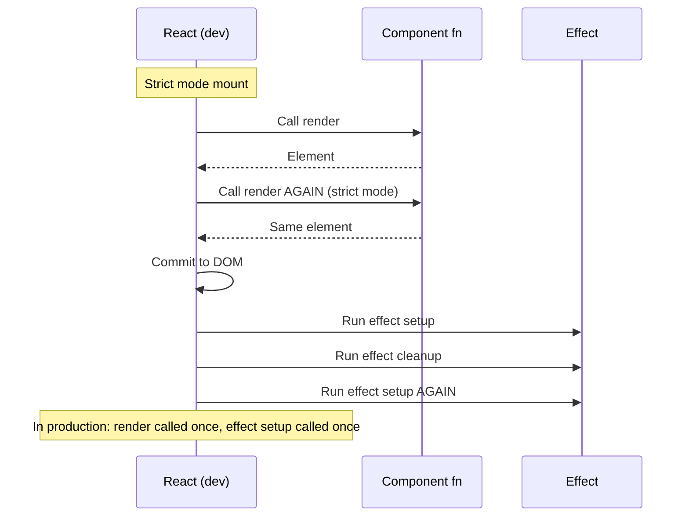

# 3.6 Hooks (Built-In)

> Hooks are functions that let function components "hook into" React features: state, side effects, context, refs, memoization, and more. They replaced class lifecycle methods and unlocked a composability model that classes never had. This note covers every built-in hook, the rules that govern them, and the mental model that separates correct hook usage from cargo-cult copy-paste.

## 3.6.1 Objective

By the end of this note you should be able to:

1. Explain why hooks were introduced and what they replaced.
2. Recite and apply the rules of hooks.
3. Use `useState` (deep), `useEffect` (preview), `useContext` (preview), `useReducer` (preview), `useRef`, `useMemo`, `useCallback`, `useTransition`, `useDeferredValue`, `useId`, `useLayoutEffect`, `useImperativeHandle`, and `useDebugValue`.
4. Explain why mutating a ref does not trigger re-render and how to use that.
5. Use the "latest value pattern" with refs.
6. Recognize strict mode double-invocation in development and why it's not a bug.
7. Choose the right hook for the job.

## 3.6.2 Background Knowledge

Before reading further, make sure you are comfortable with:

- **Function components** from [[3.2 Components and Props]].
- **State and events** from [[3.3 State and Events]] — `useState`, the updater function form, batching.
- **Closures and stale closures** — every render creates new closures; this is the source of many hook bugs.
- **Class component lifecycle methods** (`componentDidMount`, `componentDidUpdate`, `componentWillUnmount`) — hooks replaced these.
- **`Symbol.iterator` and how JavaScript tracks function identity** — relevant for `useCallback`/`useMemo`.

## 3.6.3 Core Concepts

### 3.6.3.1 What Hooks Are and Why They Were Introduced

Before hooks (React 16.7 and earlier), function components were "stateless" — they could only render based on props. To use state, side effects, or any React feature beyond rendering, you needed a class component. Classes had problems:

- **No clean way to share stateful logic.** You'd use higher-order components, render props, or inheritance — all awkward.
- **`this` binding headaches.** Event handlers needed `.bind(this)` in the constructor or arrow-function class properties.
- **Lifecycle methods split related logic.** Setting up and tearing down a subscription meant writing code in both `componentDidMount` and `componentWillUnmount`, with the setup logic far from the teardown.
- **Classes are harder to optimize.** Tree-shaking, hot reload, and TypeScript inference all work better with functions.

Hooks (introduced in React 16.8, February 2019) solved all of these:

- **Stateful logic is composable.** Custom hooks (see [[3.7 Custom Hooks]]) let you extract and reuse stateful logic without component trees.
- **No `this`.** Function components don't have a `this`.
- **Related logic lives together.** Setup and teardown for a single effect are in the same `useEffect` call.
- **Functions are easier to optimize.** The React Compiler (see [[3.1 JSX and Rendering]]) can statically analyze functions in ways it cannot with classes.

> [!note] Hooks are not a replacement for everything class
> Class components still work and are still supported. You'll see them in older codebases. New code should use function components with hooks. Error boundaries (see [[3.13 Error Boundaries and Debugging]]) were class-only until React 19 added `useEffect`-based error handling — and even today, the `ErrorBoundary` pattern is most often implemented as a class.

### 3.6.3.2 The Rules of Hooks

Two non-negotiable rules:

**Rule 1 — Call hooks at the top level only.** Never inside loops, conditions, or nested functions. Hooks must be called in the same order on every render of a given component.

```jsx
// BAD — conditional hook call
function Comp({ enabled }) {
  if (enabled) {
    const [state, setState] = useState(0);  // Violation!
  }
}

// GOOD — always call, then use conditionally
function Comp({ enabled }) {
  const [state, setState] = useState(0);
  const value = enabled ? state : null;
}
```

Why? React identifies hooks by their call order. Internally, React maintains a list of hooks per component instance. On each render, it walks the list: "hook 0 is `useState`, hook 1 is `useEffect`, ...". If you skip a hook on some renders, the order shifts and React mismatches the wrong hooks to the wrong state, causing bugs.

**Rule 2 — Call hooks from React functions only.** Either a function component or a custom hook (a function whose name starts with `use`). Don't call hooks from regular JavaScript functions, event handlers, or class methods.

```jsx
// BAD — calling a hook in an event handler
function Comp() {
  const handleClick = () => {
    const [x, setX] = useState(0);  // Violation!
  };
}

// GOOD — call the hook in the component body, use the value in the handler
function Comp() {
  const [x, setX] = useState(0);
  const handleClick = () => setX(x + 1);
}
```

The `eslint-plugin-react-hooks` plugin enforces both rules statically. Enable it in every React project.

> [!danger] Breaking the rules of hooks
> The symptoms of violating the rules are subtle and nasty: state from one hook bleeding into another, effects firing on the wrong deps, "Rendered fewer hooks than expected" errors. The errors are confusing because the bug isn't where the error appears. Always run the ESLint plugin.

### 3.6.3.3 `useState` (Recap with Deep Dive)

```jsx
const [state, setState] = useState(initialValue);
```

Covered in [[3.3 State and Events]]. Key points:
- `initialValue` can be a value or a lazy-init function `() => value`.
- `setState` accepts a value or an updater function `(prev) => next`.
- Always use the updater form when the new state depends on the previous.
- Batching: multiple `setState` calls in the same tick coalesce into one re-render (automatic in React 18+).
- State updates are async; you can't read the new value synchronously.

A subtlety: if the new state is identical to the current state (by `Object.is`), React skips the re-render. This is called "bail-out":

```jsx
const [count, setCount] = useState(0);
setCount(0);  // No re-render — same value
```

But beware: bail-out is by reference for objects. `setState({ ...prev })` creates a new object with the same values; React re-renders even though the values are unchanged. If you want to bail out, return the previous state from the updater:

```jsx
setState(prev => prev.someFlag ? prev : { ...prev, someFlag: true });
```

This returns the same `prev` reference if no change is needed, and React bails out.

### 3.6.3.4 `useEffect` (Preview of 3.8)

```jsx
useEffect(() => {
  // Side effect: subscribe, fetch, mutate DOM, etc.
  return () => {
    // Cleanup: unsubscribe, abort fetch, etc.
  };
}, [dependencies]);
```

`useEffect` runs after the commit phase (after the DOM is updated). The deps array controls when the effect re-runs:
- `[]`  -->  runs once on mount, cleanup on unmount.
- `[a, b]`  -->  runs on mount, then whenever `a` or `b` changes (by `Object.is`).
- No array  -->  runs after every render. Almost never what you want.

The cleanup function runs before the next effect (if deps changed) and on unmount.

The full treatment is in [[3.8 Effects and Side Effects]]. The crucial mental model: `useEffect` is for synchronizing your component with something external (DOM API, subscription, network). It is not for transforming data — derive data in the render instead.

### 3.6.3.5 `useContext` (Preview of 3.9)

```jsx
const value = useContext(MyContext);
```

Reads a value from a React Context. The component re-renders when the context value changes. Covered in [[3.9 Context and Reducers]].

```jsx
const ThemeContext = createContext("light");

function App() {
  return (
    <ThemeContext.Provider value="dark">
      <Page />
    </ThemeContext.Provider>
  );
}

function Page() {
  const theme = useContext(ThemeContext);  // "dark"
  return <div className={theme}>...</div>;
}
```

### 3.6.3.6 `useReducer` (Preview of 3.9)

```jsx
const [state, dispatch] = useReducer(reducer, initialState);

function reducer(state, action) {
  switch (action.type) {
    case "increment": return { count: state.count + 1 };
    case "decrement": return { count: state.count - 1 };
    default: return state;
  }
}

function Counter() {
  const [state, dispatch] = useReducer(reducer, { count: 0 });
  return <button onClick={() => dispatch({ type: "increment" })}>{state.count}</button>;
}
```

`useReducer` is the alternative to `useState` for complex state logic. Instead of "set state to X", you "dispatch an action" and a pure `reducer` function decides the next state. Best when:
- State transitions follow clear rules.
- Multiple state values update together.
- You want testable state logic (the reducer is a pure function).
- You're sharing state via Context (the dispatch identity is stable, unlike setState callbacks).

Covered in [[3.9 Context and Reducers]].

### 3.6.3.7 `useRef`

```jsx
const ref = useRef(initialValue);
// ref.current is the value. Mutate it directly.
```

`useRef` returns a stable object with a `.current` property. Mutating `ref.current` does NOT trigger a re-render. This is the key difference from `useState`.

Three main uses:

**1. DOM access.** Pass the ref to a DOM element; React populates `ref.current` with the actual DOM node.

```jsx
function InputWithFocus() {
  const inputRef = useRef(null);
  const focus = () => inputRef.current?.focus();
  return <input ref={inputRef} />;
}
```

**2. Storing mutable values that don't affect rendering.** Timers, subscriptions, "has this been initialized" flags.

```jsx
function Timer() {
  const intervalRef = useRef(null);
  useEffect(() => {
    intervalRef.current = setInterval(() => console.log("tick"), 1000);
    return () => clearInterval(intervalRef.current);
  }, []);
}
```

**3. The "latest value" pattern.** When an effect or callback needs to read a current value without re-running on every change.

```jsx
function useLatest(value) {
  const ref = useRef(value);
  useEffect(() => { ref.current = value; });
  return ref;
}

function Logger({ count }) {
  const latestCount = useLatest(count);
  useEffect(() => {
    const id = setInterval(() => console.log("count is", latestCount.current), 1000);
    return () => clearInterval(id);
  }, []);  // Note: empty deps — interval set up once
}
```

The interval callback reads `latestCount.current` each tick, getting the latest value without restarting the interval. Without this pattern, the closure would capture the initial `count` forever (stale closure, see [[3.3 State and Events]]).

> [!warning] Don't use refs as state
> If you find yourself mutating `ref.current` and then expecting a re-render, you want `useState`. Refs are for values React doesn't need to track. Mutating a ref during render is also forbidden — it must happen in event handlers or effects.

### 3.6.3.8 `useMemo` — Memoize a Computed Value

```jsx
const value = useMemo(() => computeExpensiveThing(a, b), [a, b]);
```

`useMemo` caches the result of `computeExpensiveThing` and only recomputes when `a` or `b` changes. Useful when:
- The computation is expensive (sorting a large list, parsing JSON, deep-cloning).
- You need referential stability (passing an object/array as a prop to a memoized child).

```jsx
function FilteredList({ items, query }) {
  // Recompute only when items or query changes, not on every render
  const filtered = useMemo(() => items.filter(i => i.includes(query)), [items, query]);
  return <ul>{filtered.map(i => <li key={i}>{i}</li>)}</ul>;
}
```

> [!tip] Don't over-use `useMemo`
> Calling `useMemo` has a cost (creating the deps array, comparing deps, storing the cache). For trivial computations (simple arithmetic, short arrays), the overhead exceeds the savings. Senior engineers profile first, then memoize hot paths. The React Compiler (see [[3.1 JSX and Rendering]]) automates this — with the compiler on, you can usually remove most `useMemo` calls.

### 3.6.3.9 `useCallback` — Memoize a Function

```jsx
const handleClick = useCallback(() => doSomething(id), [id]);
```

`useCallback(fn, deps)` is equivalent to `useMemo(() => fn, deps)`. It returns the same function instance across renders as long as deps don't change. Useful when:
- Passing a callback to a memoized child (`React.memo`) — without `useCallback`, the child re-renders every time because the function identity changes.
- Using a function as a dependency of `useEffect` — without `useCallback`, the effect re-runs every render.

```jsx
function Parent() {
  const [count, setCount] = useState(0);
  const handleClick = useCallback(() => setCount(c => c + 1), []);
  return <MemoizedChild onClick={handleClick} />;
}
const MemoizedChild = React.memo(function Child({ onClick }) {
  return <button onClick={onClick}>Click</button>;
});
```

Without `useCallback`, `handleClick` would be a new function every render, defeating `React.memo`.

> [!warning] `useCallback` everywhere is a smell
> Many tutorials recommend `useCallback` for every callback. This is cargo-cult. Use it only when:
> - The callback is a dependency of another hook.
> - The callback is passed to a memoized child.
> Otherwise, you're adding overhead for no benefit. The React Compiler handles this automatically.

### 3.6.3.10 `useTransition` — Mark Updates as Non-Urgent

```jsx
const [isPending, startTransition] = useTransition();

function handleClick() {
  startTransition(() => {
    setLargeList(newList);  // Non-urgent update
  });
}
```

`useTransition` lets you mark a state update as "non-urgent". React can interrupt the update to handle higher-priority work (like user input). The `isPending` flag tells you when the transition is in progress.

Use cases:
- Rendering a large list after a search — the search input stays responsive while the list re-renders.
- Switching tabs — the old tab stays visible (with a spinner) while the new tab's content prepares.
- Filtering thousands of rows.

```jsx
function Search() {
  const [query, setQuery] = useState("");
  const [results, setResults] = useState(allItems);
  const [isPending, startTransition] = useTransition();

  const handleChange = (e) => {
    setQuery(e.target.value);  // Urgent — input updates immediately
    startTransition(() => {
      setResults(allItems.filter(i => i.includes(e.target.value)));  // Non-urgent
    });
  };

  return (
    <>
      <input value={query} onChange={handleChange} />
      {isPending && <Spinner />}
      <ul>{results.map(r => <li key={r}>{r}</li>)}</ul>
    </>
  );
}
```

The input updates instantly (urgent). The list re-render is deferred; if the user types another character, React interrupts the in-progress list render and starts over with the new query.

### 3.6.3.11 `useDeferredValue` — Defer a Value

```jsx
const deferredQuery = useDeferredValue(query);
const filtered = useMemo(() => items.filter(i => i.includes(deferredQuery)), [items, deferredQuery]);
```

`useDeferredValue` returns a deferred copy of a value. The deferred value lags behind the real value, letting React prioritize the urgent update first. Similar in spirit to `useTransition` but for values you receive as props (you can't wrap their setter in `startTransition`).

Use `useTransition` when you control the state setter. Use `useDeferredValue` when you receive a value you can't control (e.g., a prop from a parent, or a value from a hook you can't modify).

### 3.6.3.12 `useId` — Stable Unique IDs for Accessibility

```jsx
const id = useId();
return (
  <>
    <label htmlFor={id}>Name</label>
    <input id={id} />
  </>
);
```

`useId` generates a stable unique ID for the lifetime of the component. Useful for linking `<label>` to `<input>` via `htmlFor`/`id`. The ID is stable across re-renders and unique across the app (and across server/client renders — important for hydration in Next.js, see [[4.3 Server and Client Components]]).

> [!warning] Don't use `useId` for list keys
> `useId` is for accessibility IDs, not for `key` props. It's not generated from your data; it's a React-internal counter. Use your data's stable ID for keys (see [[3.5 Lists and Keys]]).

### 3.6.3.13 `useLayoutEffect` — Synchronous After DOM Mutations

```jsx
useLayoutEffect(() => {
  // Runs synchronously after DOM mutations, before browser paint
  const rect = ref.current.getBoundingClientRect();
  setPosition(computeTooltipPosition(rect));
}, [deps]);
```

`useLayoutEffect` is identical to `useEffect` except it runs synchronously after the DOM is updated but before the browser paints. This lets you measure the DOM and adjust layout without the user seeing a flash of un-styled content.

> [!danger] Avoid `useLayoutEffect` for non-layout work
> `useLayoutEffect` blocks paint. If your effect does anything non-trivial (network, computation, async), you'll cause jank. Use `useEffect` unless you specifically need to read DOM layout and write it back before paint. Common cases: tooltips, popovers, scroll restoration, animations that depend on measured sizes.

On the server, `useLayoutEffect` warns and does nothing. Use `useIsomorphicLayoutEffect` (a one-line wrapper that picks `useEffect` on the server) if you SSR.

### 3.6.3.14 `useImperativeHandle` — Expose Methods to Parent via `ref`

```jsx
const MyInput = forwardRef(function MyInput(props, ref) {
  const inputRef = useRef(null);
  useImperativeHandle(ref, () => ({
    focus: () => inputRef.current?.focus(),
    clear: () => { inputRef.current.value = ""; },
  }));
  return <input ref={inputRef} />;
});

// Parent
const ref = useRef(null);
<MyInput ref={ref} />;
ref.current?.focus();  // Calls the exposed method
```

By default, `forwardRef` exposes the underlying DOM node. `useImperativeHandle` lets you customize what the parent sees — exposing a custom API instead of the raw node. Useful for components that should hide their internal DOM but expose specific actions (focus, clear, scroll to top, etc.).

> [!tip] Use sparingly
> `useImperativeHandle` breaks the declarative model — instead of "render based on props", the parent is "calling methods on the child". Reach for it only when you genuinely need imperative control (focus management, scroll position, media playback). Most state belongs in props.

### 3.6.3.15 `useDebugValue` — DevTools Display

```jsx
function useOnlineStatus() {
  const isOnline = useSyncExternalStore(...);
  useDebugValue(isOnline ? "online" : "offline");
  return isOnline;
}
```

`useDebugValue` lets you display a custom label for a custom hook in the React DevTools. Without it, the hook just shows as a generic name. With it, you can see "online" or "offline" next to the hook in the DevTools panel. Use it only in custom hooks; it's a no-op in regular components.

### 3.6.3.16 Strict Mode Double-Render in Development

`<React.StrictMode>` (used in development only) intentionally double-invokes:

- Component render functions.
- The updater function passed to `useState`/`useReducer`.
- The function passed to `useMemo`/`useCallback` (but the cached value is reused, so this is invisible).
- `useEffect` setup and cleanup (mount  -->  unmount  -->  mount sequence).
- `useLayoutEffect` setup and cleanup.

Why? To surface bugs that would otherwise hide:
- Impure renders — if your render has side effects, double-invoking it makes them visible.
- Effect cleanup bugs — if your cleanup doesn't properly undo the setup, the remount exposes it.
- Stale state from updaters — if your updater depends on external mutable state, double-invoking catches it.

> [!note] Strict mode does NOT affect production
> The double-invocation is dev-only. Production builds skip it entirely. Don't write code that depends on the double-invoke (e.g., don't increment a counter in render expecting it to happen twice). Treat it as a bug-finder, not a feature.

## 3.6.4 Detailed Walkthrough

Let's trace the call order of hooks across two renders of a component.

```jsx
function Profile({ userId }) {
  const [user, setUser] = useState(null);                       // Hook 1
  const [posts, setPosts] = useState([]);                       // Hook 2
  const ref = useRef(null);                                     // Hook 3
  const theme = useContext(ThemeContext);                       // Hook 4

  useEffect(() => {                                              // Hook 5
    fetchUser(userId).then(setUser);
    return () => abortController.abort();
  }, [userId]);

  const sortedPosts = useMemo(                                  // Hook 6
    () => [...posts].sort((a, b) => b.createdAt - a.createdAt),
    [posts]
  );

  const handleRefresh = useCallback(() => {                     // Hook 7
    fetchPosts(userId).then(setPosts);
  }, [userId]);

  // ... render
}
```

**Render 1 (mount, userId = "u1"):**
1. `useState(null)`  -->  returns `[null, setUser]`. Hook slot 0 stores `null`.
2. `useState([])`  -->  returns `[[], setPosts]`. Hook slot 1 stores `[]`.
3. `useRef(null)`  -->  returns `{ current: null }`. Hook slot 2 stores the ref object.
4. `useContext(ThemeContext)`  -->  returns current theme. Hook slot 3 stores context subscription.
5. `useEffect(...)`  -->  registers effect with deps `["u1"]`. Hook slot 4 stores the effect.
6. `useMemo(...)`  -->  runs the compute, returns `[]` (sorted empty). Hook slot 5 stores `[]`.
7. `useCallback(...)`  -->  creates the function. Hook slot 6 stores the function.

After commit, React runs the effect: fetches user, fetches posts.

**Render 2 (posts arrived, userId = "u1"):**
1. `useState(null)`  -->  returns `[userObject, setUser]`. Hook slot 0 now stores `userObject`.
2. `useState([])`  -->  returns `[postArray, setPosts]`. Hook slot 1 now stores `postArray`.
3. `useRef(null)`  -->  returns the **same** ref object as before. Hook slot 2 still has the same ref. (refs are stable.)
4. `useContext(ThemeContext)`  -->  returns the current theme (same value, no re-render triggered by this).
5. `useEffect(...)`  -->  deps `[userId]` unchanged. Effect does NOT re-run. Hook slot 4 keeps the stored effect.
6. `useMemo(...)`  -->  deps `[posts]` changed. Recomputes: returns the sorted posts array. Hook slot 5 stores the new array.
7. `useCallback(...)`  -->  deps `[userId]` unchanged. Returns the **same** function as before. Hook slot 6 keeps the same function reference.

The key insight: React identifies hooks by **position in the call order**, not by name. If you conditionally skipped hook 5 (`useMemo`), hook 6 (`useCallback`) would be in slot 5's position, and React would mismatch — interpreting the `useCallback`'s stored function as a `useMemo` cache, with weird results. This is why the rules of hooks are non-negotiable.

## 3.6.5 Practical Examples

### 3.6.5.1 Combining `useState` and `useEffect` for data fetching

```jsx
function UserCard({ userId }) {
  const [user, setUser] = useState(null);
  const [error, setError] = useState(null);
  const [loading, setLoading] = useState(true);

  useEffect(() => {
    const controller = new AbortController();
    setLoading(true);
    fetch(`/api/users/${userId}`, { signal: controller.signal })
      .then(r => r.json())
      .then(data => { setUser(data); setError(null); })
      .catch(e => { if (e.name !== "AbortError") setError(e); })
      .finally(() => setLoading(false));
    return () => controller.abort();
  }, [userId]);

  if (loading) return <Spinner />;
  if (error) return <ErrorView error={error} />;
  return <div>{user.name}</div>;
}
```

Note: this is the manual pattern. In production, prefer a data-fetching library (React Query, SWR, or Next.js's built-in fetching). See [[3.16 API Integration and Data Fetching]].

### 3.6.5.2 `useRef` for a "previous value" hook

```jsx
function usePrevious(value) {
  const ref = useRef();
  useEffect(() => { ref.current = value; });
  return ref.current;
}

function LogChanges({ count }) {
  const prev = usePrevious(count);
  useEffect(() => {
    if (prev !== count) console.log("count changed from", prev, "to", count);
  }, [prev, count]);
}
```

### 3.6.5.3 `useTransition` for snappy search

```jsx
function Search() {
  const [query, setQuery] = useState("");
  const [results, setResults] = useState(allItems);
  const [isPending, startTransition] = useTransition();

  const handleChange = (e) => {
    const value = e.target.value;
    setQuery(value);  // Urgent — input feels instant
    startTransition(() => {
      setResults(allItems.filter(i => i.toLowerCase().includes(value.toLowerCase())));
    });
  };

  return (
    <>
      <input value={query} onChange={handleChange} />
      <ul style={{ opacity: isPending ? 0.5 : 1 }}>
        {results.map(r => <li key={r}>{r}</li>)}
      </ul>
    </>
  );
}
```

### 3.6.5.4 `useId` for accessible label linking

```jsx
function Field({ label, ...rest }) {
  const id = useId();
  return (
    <div>
      <label htmlFor={id}>{label}</label>
      <input id={id} {...rest} />
    </div>
  );
}

<Field label="Email" type="email" />
<Field label="Password" type="password" />
// Each gets a unique, stable id. No collisions, no hydration mismatches.
```

### 3.6.5.5 `useReducer` for a complex form

```jsx
const initial = { values: { name: "", email: "" }, errors: {}, touched: {} };

function formReducer(state, action) {
  switch (action.type) {
    case "change":
      return { ...state, values: { ...state.values, [action.field]: action.value } };
    case "blur":
      return { ...state, touched: { ...state.touched, [action.field]: true } };
    case "setErrors":
      return { ...state, errors: action.errors };
    case "reset":
      return initial;
    default:
      return state;
  }
}

function Form() {
  const [state, dispatch] = useReducer(formReducer, initial);
  // ... event handlers dispatch actions
}
```

For non-trivial state machines, `useReducer` is more readable than multiple `useState` calls.

## 3.6.6 Mermaid Diagrams

### 3.6.6.1 Hook Call Order Across Renders



### 3.6.6.2 Hook Selection Decision Tree



### 3.6.6.3 Strict Mode Double-Invoke (Dev Only)



## 3.6.7 Common Mistakes

1. **Calling hooks conditionally.** `if (cond) useState(...)` violates the rules. Always call at the top level.

2. **Calling hooks in event handlers or callbacks.** Hooks must be called from the component body (or another hook). Not from `onClick`, not from `setTimeout`, not from a `Promise.then`.

3. **Lying in the deps array.** `useEffect(() => {...}, [])` when the effect uses `props.id` — the effect captures the initial `id` forever (stale closure). Always include every value from the component scope that the effect uses. ESLint enforces this.

4. **Using `useEffect` to derive data.** `useEffect(() => setName(`${first} ${last}`), [first, last])` is the derived-state anti-pattern. Just compute `const fullName = `${first} ${last}`` in the render body.

5. **Using `useRef` as state.** Mutating `ref.current` doesn't trigger re-render. If you need the UI to update, use `useState`.

6. **Mutating `ref.current` during render.** Refs must be mutated in event handlers or effects, not during render. Render must be pure.

7. **Over-using `useMemo`/`useCallback`.** Wrapping every value and function. The overhead exceeds the savings for trivial cases. Profile first; the React Compiler handles this automatically.

8. **Using `useLayoutEffect` for non-layout work.** Blocks paint, causes jank. Use `useEffect` unless you specifically need pre-paint DOM measurement.

9. **Using `useId` for list keys.** `useId` is for accessibility IDs, not data keys. Use your data's stable ID for keys.

10. **Forgetting to clean up effects.** Subscriptions, intervals, abort controllers — if you set them up in `useEffect`, return a cleanup function. Otherwise they leak across mounts/unmounts.

11. **Expecting strict-mode double-invoke in production.** Dev-only. Don't write code that depends on it.

12. **Putting effects in the wrong place.** Side effects belong in `useEffect`, not in the render body. Render must be pure.

## 3.6.8 Best Practices

1. **Enable `eslint-plugin-react-hooks`** with `recommended` config. It catches rules-of-hooks violations and missing deps statically. Non-negotiable.

2. **Name custom hooks with `use` prefix.** `useUser`, `useDebounce`, `useLocalStorage`. The linter uses the prefix to apply rules.

3. **Keep components small and use custom hooks to extract logic.** A 200-line component usually has 2-3 hooks that could be extracted. See [[3.7 Custom Hooks]].

4. **Prefer `useReducer` over multiple `useState`s when state updates interact.** A single reducer is easier to reason about than five `useState` calls trying to stay in sync.

5. **Always include every reactive value in the deps array.** Don't disable the exhaustive-deps ESLint rule. If you must skip a dep, add a comment explaining why.

6. **Return cleanup functions from effects.** Every subscription, interval, listener, or abort controller should have a corresponding cleanup.

7. **Use `useRef` for "mutable but not reactive" values.** Timers, "has been initialized" flags, "latest value" for stable callbacks.

8. **Use `useTransition` for non-urgent updates that touch large subtrees.** Keeps the UI responsive during heavy re-renders.

9. **Avoid `useLayoutEffect` unless you need pre-paint DOM measurement.** For SSR, use an isomorphic wrapper.

10. **With the React Compiler on, remove most manual `useMemo`/`useCallback`.** They become noise. Profile to confirm.

11. **Use `useId` for accessibility, `useSyncExternalStore` for external stores** (browser APIs, third-party state). The latter avoids tearing in concurrent rendering.

12. **In strict mode, write effects that are resilient to double-invocation.** Setup  -->  cleanup  -->  setup should leave you in the same state as setup alone. This is also correct for production (effects can re-run on fast refresh, on remounts, on concurrent updates).

## 3.6.9 Mini Exercises

### Exercise 1 — Fix the rules-of-hooks violation

This component violates the rules of hooks. Identify and fix the violation.

```jsx
function UserList({ users, showEmails }) {
  if (users.length > 0) {
    const [selected, setSelected] = useState(null);
  }
  const [search, setSearch] = useState("");
  return (
    <div>
      <input value={search} onChange={(e) => setSearch(e.target.value)} />
      {/* ... */}
    </div>
  );
}
```

**Solution.**

```jsx
function UserList({ users, showEmails }) {
  const [selected, setSelected] = useState(null);  // Always called
  const [search, setSearch] = useState("");
  return (
    <div>
      <input value={search} onChange={(e) => setSearch(e.target.value)} />
      {/* ... */}
    </div>
  );
}
```

**Reasoning.** The original wraps `useState` in `if (users.length > 0)`, which conditionally calls the hook. If `users` is empty on first render and non-empty later, the hook order shifts between renders, causing "Rendered more hooks than during the previous render" errors. The fix is to always call the hook at the top level, then use the value conditionally. If you only need `selected` when `users` is non-empty, that's fine — `null` is a perfectly valid state value, and your render can early-return when `users` is empty.

**Common wrong approach.** Moving the hook into a separate component (`UserListInner`) and only rendering it when `users.length > 0`. This works but is unnecessary; the rule is about call order, not about what you do with the value.

### Exercise 2 — Build a `usePrevious` hook

Implement a `usePrevious(value)` hook that returns the value from the previous render.

**Solution.**

```jsx
import { useRef, useEffect } from "react";

function usePrevious(value) {
  const ref = useRef();
  useEffect(() => {
    ref.current = value;
  });
  return ref.current;
}
```

**Reasoning.** On every render, `usePrevious` is called with the new `value`. The `useRef` creates (once) a ref object whose `current` is initially `undefined`. After each render commits, the `useEffect` runs (no deps array, so it runs after every render) and updates `ref.current` to the new value. The return value `ref.current` is the value from before this effect ran — i.e., the value from the previous render.

Why does this work? Because:
- During render N, `ref.current` still holds the value from after render N-1's effect ran — which is render N-1's `value`.
- The return statement reads `ref.current` (render N-1's value).
- After render N commits, the effect runs and sets `ref.current` to render N's `value`.

So `usePrevious` returns render N-1's value during render N. Correct.

**Common wrong approach.** Using `useState` to store the previous value. The update would have to happen during render (forbidden — render must be pure) or in an effect (which runs after commit, so the new value isn't visible until the next render anyway). Refs are the right tool for "remember something between renders without triggering re-renders".

### Exercise 3 — Diagnose the stale closure

This effect is supposed to log `count` every second. It logs `0` forever. Diagnose and fix.

```jsx
function Counter() {
  const [count, setCount] = useState(0);
  useEffect(() => {
    const id = setInterval(() => console.log(count), 1000);
    return () => clearInterval(id);
  }, []);
  return <button onClick={() => setCount(c => c + 1)}>{count}</button>;
}
```

**Solution (updater form, but for an interval that just logs — we need a ref).**

```jsx
function Counter() {
  const [count, setCount] = useState(0);
  const countRef = useRef(count);
  useEffect(() => { countRef.current = count; });

  useEffect(() => {
    const id = setInterval(() => console.log(countRef.current), 1000);
    return () => clearInterval(id);
  }, []);

  return <button onClick={() => setCount(c => c + 1)}>{count}</button>;
}
```

**Alternative (deps array):**

```jsx
useEffect(() => {
  const id = setInterval(() => console.log(count), 1000);
  return () => clearInterval(id);
}, [count]);
```

**Reasoning.** The original effect captures `count = 0` in its closure because `[]` deps means "run once on mount". The interval's callback forever references that closure, logging `0`. Two fixes:

1. **Add `count` to deps.** The effect re-runs whenever `count` changes, recreating the interval with the fresh `count`. Works but recreates the interval every tick — wasteful.

2. **Use a ref to read the latest value.** The `countRef` is updated after every render via the second `useEffect`. The interval callback reads `countRef.current`, which always points to the latest value. The interval is set up once and never recreated.

The ref pattern is preferred when the effect setup is expensive or when you want to avoid re-running setup. For trivial effects like this, the deps-array approach is fine.

**Common wrong approach.** Trying to "force" the closure to update by depending on `count` inside `setInterval`'s callback but not in the deps. ESLint would warn. The ref pattern is the canonical escape hatch.

### Exercise 4 — Build a debounced value hook

Implement `useDebouncedValue(value, delay)` that returns a debounced copy of `value`. The returned value updates only after `delay` ms have passed without `value` changing.

**Solution.**

```jsx
import { useState, useEffect } from "react";

function useDebouncedValue(value, delay = 300) {
  const [debounced, setDebounced] = useState(value);
  useEffect(() => {
    const id = setTimeout(() => setDebounced(value), delay);
    return () => clearTimeout(id);
  }, [value, delay]);
  return debounced;
}

// Usage
function Search() {
  const [query, setQuery] = useState("");
  const debouncedQuery = useDebouncedValue(query, 300);
  useEffect(() => {
    if (debouncedQuery) fetch(`/api/search?q=${debouncedQuery}`).then(...);
  }, [debouncedQuery]);
}
```

**Reasoning.** The hook stores the latest `value` in `debounced` state. The effect runs whenever `value` (or `delay`) changes, setting a timeout. The cleanup clears the previous timeout. So if `value` changes rapidly, each new change cancels the previous timeout and starts a new one — only the last one survives and fires `setDebounced`. After `delay` ms of no changes, `debounced` updates.

**Common wrong approach.** Storing the timeout ID in state. It's mutable bookkeeping, not UI state — use a ref. Or trying to debounce with `useMemo` (doesn't work — `useMemo` is synchronous). The pattern is `useState` + `useEffect` + `setTimeout`.

### Exercise 5 — Choose the right hook for each scenario

For each scenario, name the hook and explain why.

a) You want to focus an input when a modal opens.
b) You have a search input and a list of 10,000 items. The list should re-filter on input, but the input should stay responsive.
c) You need a unique ID to link a `<label>` to an `<input>`.
d) You're building a form with 8 fields whose updates interact (e.g., changing "country" should reset "state").
e) You want to subscribe to a `WebSocket` and clean up on unmount.
f) You receive a `query` prop and want to defer the expensive filtering of a large list until the browser is idle.
g) You want to expose a `focus()` method on a child input to its parent.

**Answers.**

a) **`useRef`** + `useEffect`. Create a ref, pass it to the input, and in the effect (with `[isOpen]` deps) call `inputRef.current?.focus()`. Refs are for DOM access; effects are for "do something after commit".

b) **`useTransition`**. Wrap the list-filtering `setResults` in `startTransition`. The input updates urgently (feels instant); the list re-render is deferred and interruptible. `isPending` lets you show a spinner.

c) **`useId`**. Stable, unique, hydration-safe IDs for accessibility. Don't use `Math.random()` or `Date.now()` — they break SSR and are unstable across renders.

d) **`useReducer`**. Multiple interacting state updates are clearer as a single reducer: `dispatch({ type: "setCountry", country })` can also reset `state` in the same transition. Reducers centralize the logic and make it testable.

e) **`useEffect`** with a cleanup function. `useEffect(() => { const ws = new WebSocket(...); return () => ws.close(); }, [])`. The cleanup runs on unmount, closing the socket. Without it, sockets leak across mounts.

f) **`useDeferredValue`**. You don't control the `query` prop's setter (it's from the parent), so you can't wrap it in `startTransition`. `useDeferredValue(query)` gives you a deferred copy that React updates at lower priority.

g) **`useImperativeHandle`** + `forwardRef`. The child uses `forwardRef` to accept a ref, then `useImperativeHandle(ref, () => ({ focus: () => inputRef.current?.focus() }))` to expose a custom API. The parent calls `childRef.current?.focus()`.

**Reasoning.** Each hook has a specific purpose. Misuse — e.g., `useLayoutEffect` for a network fetch, or `useMemo` to store state — leads to bugs and jank. The decision tree in section 3.6.6.2 is a quick reference.

## 3.6.10 Summary

- Hooks are functions that let function components use React features (state, effects, context, refs, memoization).
- Two rules: top-level only, and from React functions only.
- `useState` — basic state with lazy init and updater function form.
- `useEffect` — synchronize with external systems; cleanup function for teardown.
- `useContext` — read context values; re-renders when context changes.
- `useReducer` — complex state via dispatch + pure reducer.
- `useRef` — mutable value that doesn't trigger re-render; DOM access; latest-value pattern.
- `useMemo` — memoize a computed value.
- `useCallback` — memoize a function (equivalent to `useMemo(() => fn, deps)`).
- `useTransition` — mark state updates as non-urgent.
- `useDeferredValue` — defer a value you receive.
- `useId` — stable unique IDs for accessibility.
- `useLayoutEffect` — synchronous, pre-paint; avoid except for DOM measurement.
- `useImperativeHandle` — expose custom API via ref.
- `useDebugValue` — DevTools label for custom hooks.
- Strict mode double-invokes in dev to surface bugs.

## 3.6.11 Related Notes

- [[3.1 JSX and Rendering]] — the render pipeline hooks fit into; the React Compiler.
- [[3.2 Components and Props]] — function components are the home of hooks.
- [[3.3 State and Events]] — `useState` deep dive; events that trigger hook-driven updates.
- [[3.4 Forms and Conditional Rendering]] — `useState` in forms; `useId` for accessible labels.
- [[3.5 Lists and Keys]] — `useState`/`useReducer` for list state.
- [[3.7 Custom Hooks]] — extracting hook-based logic into reusable units.
- [[3.8 Effects and Side Effects]] — `useEffect` in depth.
- [[3.9 Context and Reducers]] — `useContext` and `useReducer` in depth.
- [[3.11 Performance Optimization]] — `useMemo`, `useCallback`, `useTransition`, `useDeferredValue` for performance.
- [[3.13 Error Boundaries and Debugging]] — DevTools, strict mode, and the `useDebugValue` story.
