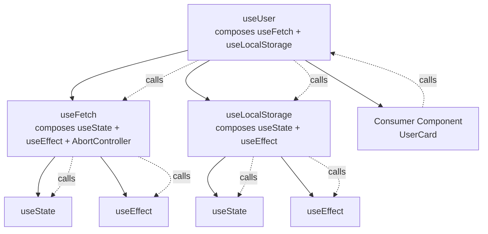
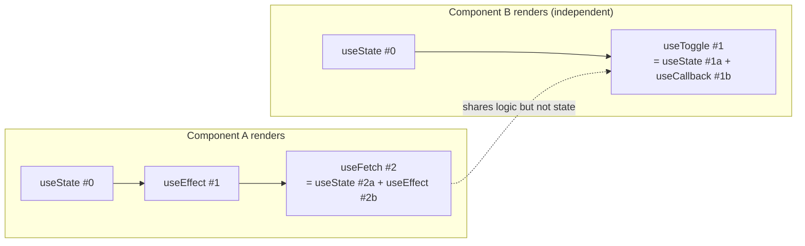

# 3.7 Custom Hooks

> A custom hook is a JavaScript function whose name starts with `use` and that may call other hooks. Custom hooks are the primary mechanism in React for extracting and reusing stateful logic across components — without resorting to render props, higher-order components, or class inheritance. This note covers why custom hooks exist, how to write the canonical ones (`useFetch`, `useToggle`, `usePrevious`, `useDebounce`, `useLocalStorage`, `useMediaQuery`, `useEventListener`), the rules that govern them, when to extract one, how to test them, and how the React 19 `use()` hook reshapes these patterns.

## 3.7.1 Objective

By the end of this note you should be able to:

1. Explain why custom hooks exist and what problem they solve that components and HOCs do not.
2. Apply the `useSomething` naming convention and explain why it is mandatory (not stylistic).
3. Implement `useFetch`, `useToggle`, `usePrevious`, `useDebounce`, `useLocalStorage`, `useMediaQuery`, and `useEventListener` from scratch and reason about each design choice.
4. State and apply the rules that govern custom hooks (they are the same two rules from [[3.6 Hooks (Built-In)]]).
5. Apply the "rule of three" to decide when to extract a custom hook.
6. Test a custom hook with `@testing-library/react-hooks` (or `renderHook` from `@testing-library/react` in React 18+).
7. Articulate the difference between a custom hook and a regular utility function.
8. Describe how the React 19 `use()` hook changes data-fetching and promise-handling patterns.

## 3.7.2 Background Knowledge

Before reading further, make sure you are comfortable with:

- **The built-in hooks** from [[3.6 Hooks (Built-In)]] — `useState`, `useEffect`, `useRef`, `useMemo`, `useCallback`, `useContext`, `useReducer`.
- **The two rules of hooks** — call at the top level only, call from React functions only.
- **Closures and stale closures** from [[3.3 State and Events]] — every render creates new closures; this is the source of subtle hook bugs.
- **`useEffect` cleanup** — we lean on it heavily for `useEventListener`, `useFetch`, and `useMediaQuery`.
- **SSR/hydration concerns** — `useLocalStorage` and `useMediaQuery` need a browser check before touching `window`.

## 3.7.3 Core Concepts

### 3.7.3.1 What Custom Hooks Are and Why They Exist

A custom hook is a function that:

1. Starts with the prefix `use` (e.g., `useFetch`, `useToggle`).
2. May call other hooks (`useState`, `useEffect`, other custom hooks).
3. Returns whatever is useful — a value, a tuple, an object, or nothing.

The problem custom hooks solve is **reusing stateful logic**. Consider a component that tracks the mouse position:

```jsx
function MouseTracker() {
  const [pos, setPos] = useState({ x: 0, y: 0 });
  useEffect(() => {
    const handler = (e) => setPos({ x: e.clientX, y: e.clientY });
    window.addEventListener("mousemove", handler);
    return () => window.removeEventListener("mousemove", handler);
  }, []);
  return <p>Mouse at {pos.x}, {pos.y}</p>;
}
```

If another component needs the same logic, what are the options?

- **Copy-paste the code.** DRY violation; bugs multiply.
- **Render props.** Wrap children in a `<MouseTracker render={({x, y}) => ...} />`. Works, but the JSX becomes deeply nested ("callback hell"), and every consumer has to learn the prop API.
- **Higher-order component (HOC).** `withMouse(Comp)` returns a new component that injects `mouse` as a prop. Works, but HOCs collide on prop names, are hard to type, and obscure the component tree in DevTools.
- **Custom hook.** Extract the logic into `useMousePosition()` and call it from any component.

```jsx
function useMousePosition() {
  const [pos, setPos] = useState({ x: 0, y: 0 });
  useEffect(() => {
    const handler = (e) => setPos({ x: e.clientX, y: e.clientY });
    window.addEventListener("mousemove", handler);
    return () => window.removeEventListener("mousemove", handler);
  }, []);
  return pos;
}

function MouseTracker() {
  const pos = useMousePosition();
  return <p>Mouse at {pos.x}, {pos.y}</p>;
}

function FancyCursor() {
  const pos = useMousePosition();
  return <div style={{ transform: `translate(${pos.x}px, ${pos.y}px)` }} />;
}
```

The hook composes cleanly: no extra tree depth, no prop collisions, no wrapper components. DevTools shows the consumer component directly.

> [!note] Custom hooks do not share state
> A common confusion: calling `useMousePosition()` from two components does NOT share `pos` between them. Each component gets its own state. Hooks are about reusing logic, not sharing data. For shared data, use [[3.9 Context and Reducers]] or an external store like Zustand.

### 3.7.3.2 The `use` Naming Convention Is Mandatory

The `use` prefix is not stylistic. The `eslint-plugin-react-hooks` plugin uses it to:

- Decide whether the rules of hooks apply (functions not starting with `use` are allowed to call hooks conditionally — but then they're not hooks, and you cannot call them as such).
- Decide whether a function is a "known hook" for the exhaustive-deps lint rule.

If you name a hook `fetchData` instead of `useFetch`, the linter will not enforce the rules, and worse, React itself cannot enforce that the function is being called correctly. Always name hooks `useSomething`.

### 3.7.3.3 Custom Hook vs Regular Function

| Aspect | Regular function | Custom hook |
| --- | --- | --- |
| Naming | Any valid identifier | Must start with `use` |
| Can call hooks? | No | Yes |
| Can be called conditionally? | Yes | No (same rules as hooks) |
| Can be called outside a component? | Yes | Only inside a component or another hook |
| Returns | Any value | Any value, often `[state, setter]` tuple |
| Has React-aware behavior? | No | Yes (re-renders, cleanups, refs) |

The crucial distinction: a custom hook can call other hooks. A regular function cannot. This is what makes a hook "stateful" — it owns React state and effects, and React tracks it in the same hook list as the caller.

### 3.7.3.4 The Rule of Three

When do you extract a custom hook? A common heuristic is the **rule of three**: if you find yourself writing the same stateful logic in three places, extract it. Earlier is premature; later is technical debt.

Other good reasons to extract even before three uses:

- The logic is non-trivial (an effect with cleanup, complex state transitions).
- The logic is testable in isolation and you want unit tests.
- The component is getting long and the logic obscures the render.

### 3.7.3.5 Rules for Custom Hooks

Custom hooks are bound by the same two rules as built-in hooks:

1. **Top level only.** Don't call a custom hook inside loops, conditions, or nested functions. (Equivalently: don't conditionally call the hooks inside the hook.)
2. **From React functions only.** Either a function component or another custom hook.

Additionally:

- **A custom hook can call other custom hooks.** This is how composition works. `useUser()` might call `useFetch()`, which calls `useState` and `useEffect`.
- **Two components calling the same hook get independent state.** State is per-call-site, not per-hook-definition.
- **Custom hooks must run the same hooks in the same order on every call.** Conditional hook calls inside a custom hook violate the rules.

## 3.7.4 Detailed Walkthrough

### 3.7.4.1 `useFetch` — Loading, Error, Data

```jsx
function useFetch(url, options) {
  const [data, setData] = useState(null);
  const [error, setError] = useState(null);
  const [loading, setLoading] = useState(true);

  useEffect(() => {
    let cancelled = false;
    const controller = new AbortController();

    setLoading(true);
    setError(null);

    fetch(url, { ...options, signal: controller.signal })
      .then((res) => {
        if (!res.ok) throw new Error(`HTTP ${res.status}`);
        return res.json();
      })
      .then((json) => {
        if (!cancelled) {
          setData(json);
          setLoading(false);
        }
      })
      .catch((err) => {
        if (err.name !== "AbortError" && !cancelled) {
          setError(err);
          setLoading(false);
        }
      });

    return () => {
      cancelled = true;
      controller.abort();
    };
  }, [url, JSON.stringify(options)]);

  return { data, error, loading };
}
```

Key design decisions:

- **`cancelled` flag.** If the component unmounts or `url` changes before the fetch resolves, we discard the result. Without this, you get the classic "setState on unmounted component" warning (and in some cases, real bugs like a slow request overwriting a fast one).
- **`AbortController`.** Actually cancels the network request. The `cancelled` flag alone only prevents the `setState`; the request still consumes bandwidth.
- **`JSON.stringify(options)` in deps.** `options` is an object literal at the call site, so its identity changes every render. We stringify it to compare by value. (A cleaner approach is to require callers to memoize `options` themselves, or to accept individual primitive arguments.)
- **Returns an object, not a tuple.** Tuples (`[data, loading, error]`) are nice for `useState` because there are only two items and the order is memorable. For three or more values, an object is clearer and lets you destructure selectively.

> [!warning] Don't use `useFetch` for new production code
> This implementation is fine for learning. For real apps, use a data-fetching library like TanStack Query, SWR, or your framework's data-loading primitives (Next.js Server Actions, Remix loaders, etc.). They handle caching, deduplication, retries, optimistic updates, and race conditions correctly — your hand-rolled `useFetch` does not. See [[3.8 Effects and Side Effects]] for why `useEffect`-based fetching is discouraged.

### 3.7.4.2 `useToggle` — Boolean State with Helpers

```jsx
function useToggle(initialValue = false) {
  const [value, setValue] = useState(initialValue);
  const toggle = useCallback(() => setValue((v) => !v), []);
  const setTrue = useCallback(() => setValue(true), []);
  const setFalse = useCallback(() => setValue(false), []);
  return [value, { toggle, setTrue, setFalse, setValue }];
}
```

Usage:

```jsx
function Drawer() {
  const [open, { toggle, setTrue, setFalse }] = useToggle(false);
  return (
    <>
      <button onClick={toggle}>{open ? "Close" : "Open"}</button>
      {open && <div>Drawer content</div>}
    </>
  );
}
```

The helpers are memoized with `useCallback` so consumers that pass them as props to memoized children don't cause re-renders. The return shape — `[value, helpers]` — mirrors `useState`'s `[value, setter]` so it feels idiomatic.

### 3.7.4.3 `usePrevious` — Storing the Prior Value in a Ref

```jsx
function usePrevious(value) {
  const ref = useRef(value);
  useEffect(() => {
    ref.current = value;
  }, [value]);
  return ref.current;
}
```

This hook returns the value from the *previous* render. The trick:

1. On render N, `ref.current` still holds the value from render N-1 (because the effect from render N-1 set it, and the effect from render N hasn't run yet).
2. We return `ref.current`, which is the old value.
3. After commit, the effect runs and sets `ref.current = value` (the new value), preparing for render N+1.

This is the canonical example of using a ref for "information from a previous render that should not trigger re-render".

> [!tip] Compare to derived state
> If you need the previous value *to compute the next state*, use the updater function form of `setState` instead: `setState((prev) => prev + 1)`. `usePrevious` is for *displaying* the previous value or computing derived UI.

### 3.7.4.4 `useDebounce` — Delay a Value

```jsx
function useDebounce(value, delay = 300) {
  const [debounced, setDebounced] = useState(value);
  useEffect(() => {
    const id = setTimeout(() => setDebounced(value), delay);
    return () => clearTimeout(id);
  }, [value, delay]);
  return debounced;
}
```

Usage:

```jsx
function Search() {
  const [query, setQuery] = useState("");
  const debouncedQuery = useDebounce(query, 300);
  const { data } = useFetch(`/api/search?q=${debouncedQuery}`);
  return <input value={query} onChange={(e) => setQuery(e.target.value)} />;
}
```

The cleanup is critical: every change to `value` schedules a new timeout and clears the previous one. Only the last change within `delay` ms actually fires `setDebounced`.

### 3.7.4.5 `useLocalStorage` — Persistent State

```jsx
function useLocalStorage(key, initialValue) {
  const [value, setValue] = useState(() => {
    if (typeof window === "undefined") return initialValue;
    try {
      const item = window.localStorage.getItem(key);
      return item ? JSON.parse(item) : initialValue;
    } catch {
      return initialValue;
    }
  });

  useEffect(() => {
    try {
      window.localStorage.setItem(key, JSON.stringify(value));
    } catch {
      // ignore quota errors
    }
  }, [key, value]);

  return [value, setValue];
}
```

Key points:

- **Lazy initial state** reads from `localStorage` once, on mount. (Avoid `localStorage.getItem` on every render — it's synchronous and slow.)
- **SSR guard** `typeof window === "undefined"`. On the server, `window` doesn't exist; the hook returns `initialValue`.
- **`try/catch`** around `JSON.parse` and `setItem` — `localStorage` can be disabled (private mode), full, or contain corrupt data from older code.
- **Cross-tab sync** is *not* included here. For that, listen to the `storage` event in an effect and update state accordingly.

### 3.7.4.6 `useMediaQuery` — Responsive Hooks

```jsx
function useMediaQuery(query) {
  const [matches, setMatches] = useState(() => {
    if (typeof window === "undefined") return false;
    return window.matchMedia(query).matches;
  });

  useEffect(() => {
    if (typeof window === "undefined") return;
    const mql = window.matchMedia(query);
    const handler = (e) => setMatches(e.matches);
    setMatches(mql.matches);
    mql.addEventListener("change", handler);
    return () => mql.removeEventListener("change", handler);
  }, [query]);

  return matches;
}
```

Usage:

```jsx
function Nav() {
  const isMobile = useMediaQuery("(max-width: 768px)");
  return isMobile ? <HamburgerMenu /> : <FullNav />;
}
```

The `setMatches(mql.matches)` call inside the effect handles the case where the initial `useState` value (computed at mount) is stale by the time the effect runs — for example, if the user rotates the device between mount and effect.

> [!warning] Prefer CSS for layout
> If you're only switching styles, prefer CSS media queries (or container queries — see [[1.7 Responsive Design and Container Queries]]). `useMediaQuery` is for cases where you need to render *different* components, not just apply different styles.

### 3.7.4.7 `useEventListener` — Typed, Safe Event Subscription

```jsx
function useEventListener(eventName, handler, element = window) {
  const savedHandler = useRef(handler);

  useEffect(() => {
    savedHandler.current = handler;
  }, [handler]);

  useEffect(() => {
    if (element == null) return;
    const eventListener = (event) => savedHandler.current(event);
    element.addEventListener(eventName, eventListener);
    return () => element.removeEventListener(eventName, eventListener);
  }, [eventName, element]);
}
```

The `savedHandler` ref is the elegant part: the handler can change every render (so you always read fresh state in it), but we don't re-subscribe on every render — only when `eventName` or `element` changes. This avoids the noisy pattern of re-running the subscription effect on every render.

### 3.7.4.8 React 19 `use()` — A New Hook That Changes Patterns

React 19 introduced `use()`, which reads a thenable (a Promise or a context) and "unwraps" it. Unlike other hooks, `use()` can be called inside loops and conditionals — it's the one hook that breaks the top-level rule (in a controlled way).

```jsx
import { use } from "react";

async function fetchUser(id) {
  const res = await fetch(`/api/users/${id}`);
  return res.json();
}

function UserProfile({ userPromise }) {
  // userPromise is created by the parent (or a server component) and passed down
  const user = use(userPromise);
  return <h1>{user.name}</h1>;
}
```

Why this matters:

- **No more `useEffect`-based fetching.** The parent (often a Server Component in Next.js) creates the promise; the child calls `use()` on it. React suspends the child until the promise resolves, then renders it with the unwrapped value. This is the foundation of Suspense-based data fetching (see [[3.12 Suspense, Lazy Loading, and Code Splitting]]).
- **`use()` can be conditional.** You can write `if (condition) { const x = use(promise); }` — something no other hook allows.
- **`use(context)` replaces `useContext(context)`** — and can be called conditionally, which `useContext` cannot.

`use()` does not replace all custom hooks. It does, however, replace the entire `useFetch`-style pattern in apps that have a framework providing the promise. For client-only apps, TanStack Query or SWR remain the right answer.

## 3.7.5 Practical Examples

### 3.7.5.1 Composing Hooks — `useUser`

```jsx
function useUser(userId) {
  const { data, error, loading } = useFetch(`/api/users/${userId}`);
  return { user: data, error, loading };
}

function UserCard({ userId }) {
  const { user, loading, error } = useUser(userId);
  if (loading) return <Skeleton />;
  if (error) return <ErrorMessage error={error} />;
  return <Card name={user.name} email={user.email} />;
}
```

`useUser` composes `useFetch`. Consumers don't need to know about `useFetch`'s shape; they get a domain-specific API. This is how custom hook composition scales: each layer adds domain meaning.

### 3.7.5.2 A Combined Example — Persistent Dark Mode

```jsx
function useDarkMode() {
  const [enabled, setEnabled] = useLocalStorage("dark-mode", false);
  const prefersDark = useMediaQuery("(prefers-color-scheme: dark)");

  // If user has never set a preference, follow the system.
  const effective = enabled ?? prefersDark;

  useEffect(() => {
    document.body.classList.toggle("dark", effective);
  }, [effective]);

  return [effective, setEnabled];
}
```

Notice how three custom hooks compose: `useLocalStorage`, `useMediaQuery`, `useEffect` (built-in). The component calling `useDarkMode` sees one simple API.

### 3.7.5.3 Testing a Custom Hook with `renderHook`

```jsx
import { renderHook, act } from "@testing-library/react";
import { useToggle } from "./useToggle";

test("useToggle starts false and toggles to true", () => {
  const { result } = renderHook(() => useToggle(false));
  expect(result.current[0]).toBe(false);
  act(() => result.current[1].toggle());
  expect(result.current[0]).toBe(true);
});
```

Notes:

- `renderHook` returns `result.current` — read state from it.
- Wrap state updates in `act` so React flushes them synchronously.
- For effects that depend on `window` or DOM APIs, use `@testing-library/jest-dom` and a jsdom environment.
- For async hooks, use `waitFor` from `@testing-library/react`.

## 3.7.6 Mermaid Diagrams

### 3.7.6.1 Custom Hook Composition



### 3.7.6.2 Hook Call Order Across Two Components



Each component has its own hook list. Calling the same custom hook from two components does not share state — it shares logic.

## 3.7.7 Common Mistakes

1. **Naming the hook without `use`.** A function `fetchUser()` that calls `useState` will pass linting (the linter thinks it's a regular function) but breaks at runtime — React's hook order tracking depends on the call site being recognized as a hook. Always use the `use` prefix.

2. **Calling a hook conditionally inside the custom hook.** Example: `if (enabled) useEffect(...)`. This violates rule 1. The fix is to always call the hook and use the condition *inside* the hook body.

3. **Treating the custom hook as a singleton.** Two components calling `useUser()` get independent state. If you need shared state, use Context (see [[3.9 Context and Reducers]]) or an external store.

4. **Forgetting the cleanup function in effect-based hooks.** `useFetch`, `useEventListener`, `useMediaQuery`, `useDebounce` all rely on cleanup. Missing it causes memory leaks, "setState on unmounted component" warnings, and stale-handler bugs.

5. **Returning a new object/array every render without memoization.** If your hook returns `{ data, loading, error }` and consumers use `React.memo`, the new object identity breaks memoization. Either accept it (most consumers don't memo), document it, or memoize the return with `useMemo`.

6. **Putting `options`/`body` objects in the deps array by reference.** `useEffect(() => fetch(url, options), [url, options])` re-fires every render because `options` is a new object literal. Use `JSON.stringify(options)`, individual primitives, or require the caller to memoize.

7. **Reading `window`/`document`/`localStorage` at the top level of the hook.** This breaks SSR. Wrap in `useState(() => ...)` lazy initializer with a `typeof window === "undefined"` guard, or in `useEffect`.

8. **Using `usePrevious` for derived state.** If you find yourself writing `const prev = usePrevious(count); if (prev !== count) setState(...)`, you almost certainly want the updater form `setState((prev) => ...)` or `useReducer` instead.

9. **Disabling the `react-hooks/exhaustive-deps` lint rule "to fix" a hook.** The rule is right ~95% of the time. If it complains, the bug is in your hook, not the rule. See [[3.8 Effects and Side Effects]] for the rare legitimate exceptions.

10. **Testing a hook by rendering a dummy component and inspecting the DOM.** Use `renderHook` — it's faster, cleaner, and tests the hook directly.

## 3.7.8 Best Practices

1. **Single responsibility.** A hook should do one thing. `useFetch` should fetch, not also format the response. Compose hooks rather than bloat them.

2. **Return stable identities.** If your hook returns functions, wrap them in `useCallback` so memoized consumers don't re-render. If it returns a complex object, consider `useMemo` for the return value (but measure first — see [[3.11 Performance Optimization]]).

3. **Type your hooks.** In TypeScript, define the return type explicitly for non-trivial hooks. A `useToggle` returning `[boolean, { toggle: () => void; setTrue: () => void; setFalse: () => void; setValue: (v: boolean) => void }]` is much clearer than the inferred type.

4. **Document with `useDebugValue`.** For hooks meant for team consumption, `useDebugValue(value)` shows the value in React DevTools, making debugging easier.

5. **Handle SSR by default.** Even if your app doesn't SSR today, future-you (or the framework switch) will thank you. Guard `window`/`document` access.

6. **Co-locate tests.** Put `useToggle.test.ts` next to `useToggle.ts`. Custom hooks are the easiest thing in React to unit-test — exploit that.

7. **Apply the rule of three.** Don't extract every 5-line effect into a hook. Wait until the logic is non-trivial or duplicated.

8. **Prefer composition over configuration.** A hook with 8 boolean flags is a smell. Instead, have several small hooks that compose.

9. **Name hooks descriptively.** `useUserData` is better than `useData`. `useIsMobile` is better than `useMedia` (when it's specifically for mobile detection).

10. **Don't reach for `useEffect` to compute derived values.** If your hook computes something from props/state without side effects, just compute it during render (possibly with `useMemo`).

## 3.7.9 Mini Exercises

### 3.7.9.1 Implement `useCounter`

**Problem.** Write a `useCounter(initialValue, step = 1)` hook returning `[count, { increment, decrement, reset, set }]`. All helpers must be stable across renders.

**Solution.**

```jsx
function useCounter(initialValue, step = 1) {
  const [count, setCount] = useState(initialValue);
  const increment = useCallback(() => setCount((c) => c + step), [step]);
  const decrement = useCallback(() => setCount((c) => c - step), [step]);
  const reset = useCallback(() => setCount(initialValue), [initialValue]);
  const set = useCallback((v) => setCount(v), []);
  return [count, { increment, decrement, reset, set }];
}
```

**Reasoning.** `useCallback` with the right deps keeps helpers stable. `increment`/`decrement` depend on `step` (if step changes, new function); `reset` depends on `initialValue`; `set` has no deps because `setCount` is stable. The updater form `(c) => c + step` avoids stale closures over `count`.

**Common wrong approach.** `const increment = () => setCount(count + step)` — this re-creates the function every render and is stale if called in a batch. Both bugs avoided by `useCallback` + updater form.

### 3.7.9.2 Diagnose a Broken `useWindowSize`

**Problem.** The following hook re-renders constantly, even when the window isn't resized. Why?

```jsx
function useWindowSize() {
  const [size, setSize] = useState({ w: window.innerWidth, h: window.innerHeight });
  useEffect(() => {
    const handler = () => setSize({ w: window.innerWidth, h: window.innerHeight });
    window.addEventListener("resize", handler);
    return () => window.removeEventListener("resize", handler);
  });
  return size;
}
```

**Solution.** The `useEffect` has no dependency array, so it re-runs after every render. Each run adds a listener, the cleanup removes it, but the act of running the effect triggers another render cycle if anything stateful happens. More importantly, missing the deps array means every render re-subscribes, which is wasteful. Also, `window` access in `useState` initializer breaks SSR.

**Fix.**

```jsx
function useWindowSize() {
  const [size, setSize] = useState(() =>
    typeof window === "undefined"
      ? { w: 0, h: 0 }
      : { w: window.innerWidth, h: window.innerHeight }
  );
  useEffect(() => {
    const handler = () => setSize({ w: window.innerWidth, h: window.innerHeight });
    window.addEventListener("resize", handler);
    return () => window.removeEventListener("resize", handler);
  }, []);
  return size;
}
```

**Reasoning.** Empty deps array subscribes once on mount. Lazy initializer guards SSR. `setSize` with a fresh object is fine — `useState` always triggers re-render when the new value isn't `Object.is`-equal to the old.

### 3.7.9.3 Build `useOnClickOutside`

**Problem.** Implement `useOnClickOutside(ref, handler)` that calls `handler` when the user clicks outside the element referenced by `ref`.

**Solution.**

```jsx
function useOnClickOutside(ref, handler) {
  useEffect(() => {
    const listener = (event) => {
      if (ref.current == null || ref.current.contains(event.target)) return;
      handler(event);
    };
    document.addEventListener("mousedown", listener);
    document.addEventListener("touchstart", listener);
    return () => {
      document.removeEventListener("mousedown", listener);
      document.removeEventListener("touchstart", listener);
    };
  }, [ref, handler]);
}
```

**Reasoning.** We subscribe on `mousedown` and `touchstart` (not `click`) so the handler fires before the click completes, letting you close a dropdown before the click reaches the underlying element. We use the `ref` pattern because the consumer already has a ref to the element; passing the element directly would require it to exist at hook-call time, which it doesn't.

**Common wrong approach.** Putting `handler` in deps without memoizing it — every render of the consumer re-subscribes. The fix is either: (a) ask consumers to wrap `handler` in `useCallback`, or (b) use the `savedHandler` ref pattern from `useEventListener`. For an API that wants to "just work", option (b) is friendlier:

```jsx
function useOnClickOutside(ref, handler) {
  const saved = useRef(handler);
  useEffect(() => { saved.current = handler; });
  useEffect(() => {
    const listener = (e) => {
      if (ref.current == null || ref.current.contains(e.target)) return;
      saved.current(e);
    };
    document.addEventListener("mousedown", listener);
    document.addEventListener("touchstart", listener);
    return () => {
      document.removeEventListener("mousedown", listener);
      document.removeEventListener("touchstart", listener);
    };
  }, [ref]);
}
```

### 3.7.9.4 Convert `useFetch` to Use `use()` in React 19

**Problem.** Refactor the following consumer to use the React 19 `use()` hook instead of `useFetch`:

```jsx
function UserCard({ userId }) {
  const { data: user, loading, error } = useFetch(`/api/users/${userId}`);
  if (loading) return <Skeleton />;
  if (error) return <ErrorMessage error={error} />;
  return <Card name={user.name} />;
}
```

**Solution.**

```jsx
// In a parent (often a Server Component):
async function UserCard({ userId }) {
  const userPromise = fetch(`/api/users/${userId}`).then((r) => r.json());
  return (
    <Suspense fallback={<Skeleton />}>
      <UserCardInner userPromise={userPromise} />
    </Suspense>
  );
}

function UserCardInner({ userPromise }) {
  const user = use(userPromise);
  return <Card name={user.name} />;
}
```

**Reasoning.** The promise is created in the parent (or on the server) and passed down. The child calls `use(userPromise)`, which suspends. React shows the nearest `<Suspense fallback>` while the promise is pending, then renders the child with the unwrapped value. Errors are caught by an error boundary (see [[3.13 Error Boundaries and Debugging]]). This is the canonical React 19 data-fetching pattern — no more `loading` state in every component.

**Common wrong approach.** Calling `use(fetch(...))` directly inside the component. This creates a new promise every render, which never resolves from React's perspective. The promise must be stable across renders — create it once (in the parent, or memoized with `useState`).

### 3.7.9.5 Implement `useInterval` That Handles Changing Delays

**Problem.** Build `useInterval(callback, delay)` that calls `callback` every `delay` ms. If `delay` is `null`, the interval is paused. If `callback` changes between intervals, the latest `callback` must be used without resetting the interval timer.

**Solution.**

```jsx
function useInterval(callback, delay) {
  const savedCallback = useRef(callback);
  useEffect(() => { savedCallback.current = callback; });

  useEffect(() => {
    if (delay == null) return;
    const id = setInterval(() => savedCallback.current(), delay);
    return () => clearInterval(id);
  }, [delay]);
}
```

**Reasoning.** Two effects: the first keeps `savedCallback` up to date on every render; the second subscribes the interval only when `delay` changes. Inside the interval, we call `savedCallback.current()`, which is always the latest callback. This is Dan Abramov's classic `useInterval` — it solves the "pause/resume without resetting the timer" problem and the "always-fresh-callback" problem simultaneously.

**Common wrong approach.** `useEffect(() => { const id = setInterval(callback, delay); return () => clearInterval(id); }, [callback, delay])` — this resets the timer every time `callback` changes (i.e., every render of the consumer unless the consumer memoizes it). The saved-ref pattern avoids that.

## 3.7.10 Summary

- Custom hooks exist to reuse stateful logic without HOCs or render props.
- The `use` prefix is mandatory — it's how the linter and React identify hooks.
- Custom hooks follow the same two rules: top-level only, from React functions only.
- Canonical hooks: `useFetch` (loading/error/data), `useToggle` (booleans), `usePrevious` (ref-based), `useDebounce` (timer + cleanup), `useLocalStorage` (lazy initializer + persistence), `useMediaQuery` (matchMedia + change event), `useEventListener` (saved-ref pattern).
- Extract when the logic is non-trivial, duplicated, or testable in isolation (rule of three).
- Test with `renderHook` from `@testing-library/react`; wrap updates in `act`.
- The React 19 `use()` hook lets you read promises and contexts (and can be called conditionally), reshaping data fetching toward Suspense.
- A custom hook is not a singleton — each consumer gets independent state. For shared state, use Context (see [[3.9 Context and Reducers]]).

## 3.7.11 Related Notes

- [[3.1 JSX and Rendering]] — the render pipeline that hooks live inside; the React Compiler.
- [[3.2 Components and Props]] — components are the home of hooks.
- [[3.3 State and Events]] — `useState` deep dive, closures, batching.
- [[3.6 Hooks (Built-In)]] — every built-in hook that custom hooks compose from.
- [[3.8 Effects and Side Effects]] — `useEffect` deep dive; why `useEffect`-based fetching is discouraged in favor of frameworks.
- [[3.9 Context and Reducers]] — sharing state across the tree (when a custom hook is not enough).
- [[3.11 Performance Optimization]] — when to memoize the return values of custom hooks.
- [[3.12 Suspense, Lazy Loading, and Code Splitting]] — the Suspense model that `use()` integrates with.
- [[3.13 Error Boundaries and Debugging]] — `useDebugValue`, testing, and DevTools.
- [[4.7 Server Actions and Forms]] — promise-based data loading in Next.js, which composes naturally with `use()`.
