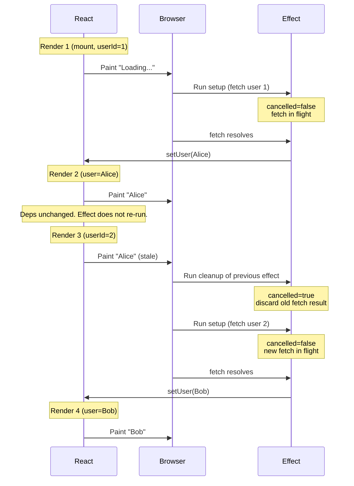
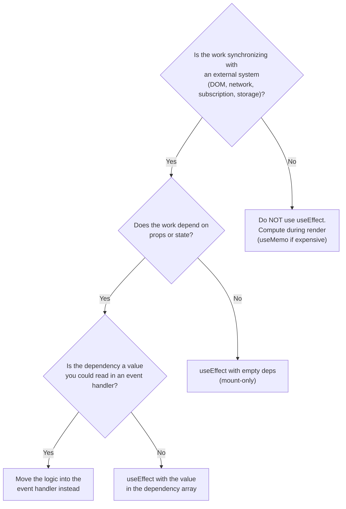

# 3.8 Effects and Side Effects

> A side effect is anything a component does that reaches outside itself: fetching data, writing to `localStorage`, subscribing to a WebSocket, manipulating the DOM, setting a timer. React's pure rendering model has no place for side effects, so the team gave us `useEffect` — an escape hatch that runs after the browser has painted. This note covers what a side effect is, the `useEffect` signature and dependency array, the cleanup function and subscribe/unsubscribe pattern, the `exhaustive-deps` lint rule, the stale closure problem, when *not* to use `useEffect`, and the React 19 changes that push effects toward purity. We also contrast `useEffect` with `useLayoutEffect`.

## 3.8.1 Objective

By the end of this note you should be able to:

1. Define "side effect" precisely and list five categories.
2. Explain why effects exist and why React itself does not track side effects.
3. Write the `useEffect` signature from memory: setup function, optional cleanup, optional dependency array.
4. State the three forms of the dependency array and what each does.
5. Explain why you should never disable `react-hooks/exhaustive-deps`.
6. Diagnose and fix the stale closure problem in effects.
7. Use the cleanup function correctly, including the subscribe/unsubscribe pattern.
8. List at least four situations where `useEffect` is the wrong tool.
9. Describe the React 19 effect purity changes and the `useEffectEvent` proposal.
10. Choose between `useEffect` and `useLayoutEffect`.

## 3.8.2 Background Knowledge

Before reading further, make sure you are comfortable with:

- **The render pipeline** from [[3.1 JSX and Rendering]] — trigger, render phase, reconcile, commit, paint.
- **`useState` and closures** from [[3.3 State and Events]] — every render creates new closures; effects close over the render's variables.
- **The built-in `useEffect` API** from [[3.6 Hooks (Built-In)]] — we expand on it here.
- **Custom hooks** from [[3.7 Custom Hooks]] — most effects should live in custom hooks.
- **Strict mode double-invocation** from [[3.6 Hooks (Built-In)]] — strict mode runs setup --> cleanup --> setup in development to surface missing cleanups.

## 3.8.3 Core Concepts

### 3.8.3.1 What Is a Side Effect?

A **pure function** is one that, given the same inputs, returns the same output and has no observable interaction with the outside world. React components are *supposed* to be pure: `props + state  -->  JSX`. Anything that breaks that purity is a side effect.

Categories of side effects in a React app:

1. **Network** — `fetch`, `XMLHttpRequest`, WebSocket sends, Server-Sent Events.
2. **DOM mutation** — `document.title = ...`, `element.focus()`, `window.scrollTo(...)`, third-party widgets that touch the DOM directly.
3. **Timers** — `setTimeout`, `setInterval`, `requestAnimationFrame`, `requestIdleCallback`.
4. **Subscriptions** — `addEventListener`, `ResizeObserver`, `IntersectionObserver`, store subscriptions.
5. **Storage** — `localStorage`, `sessionStorage`, `IndexedDB`, cookies.
6. **External systems** — interacting with non-React libraries (charts, maps, editors), WebRTC, IndexedDB cursors.

React's purity rule exists because purity enables:

- **Predictable rendering.** A pure component renders the same output for the same props/state.
- **Safe re-rendering.** React can re-render a pure component as many times as needed (for example, during reconciliation or strict mode) without side effects firing multiple times.
- **Concurrency.** With concurrent rendering (React 18+), React may render a component, throw the result away, and render it again. If the render itself has side effects, this causes bugs.

### 3.8.3.2 Why Effects Are Needed

React's render phase is synchronous and pure. It must not touch the outside world. But components *do* need to interact with the outside world — fetch data, subscribe to events, etc. `useEffect` is the escape hatch:

```jsx
useEffect(() => {
  document.title = `You have ${unreadCount} unread messages`;
}, [unreadCount]);
```

This effect:

- Runs *after* the browser paints (it's deferred, not synchronous).
- Re-runs whenever `unreadCount` changes.
- Can return a cleanup function that runs before the next effect run, and on unmount.

> [!note] Effects run after paint
> The browser paints, then the effect runs. This means the user sees the new UI *before* the effect fires. If your effect must run before paint (e.g., measuring the DOM to position a tooltip), use `useLayoutEffect` instead (see 3.8.3.10).

### 3.8.3.3 The `useEffect` Signature

```jsx
useEffect(setup, dependencies?)
```

- **`setup`**: a function that runs the side effect. May return a **cleanup function**.
- **`dependencies`** (optional): an array of values the effect depends on. If any change, the cleanup (if any) runs and then `setup` runs again.

Three forms of the dependency array:

| Form | Behavior |
| --- | --- |
| Omitted | Effect runs after *every* render. Almost always wrong. |
| `[]` (empty) | Effect runs once after mount, cleanup runs on unmount. |
| `[a, b, c]` | Effect runs on mount and whenever any of `a`, `b`, `c` change. Cleanup runs before re-running and on unmount. |

### 3.8.3.4 The Cleanup Function

```jsx
useEffect(() => {
  const subscription = createSubscription();
  subscription.subscribe();
  return () => subscription.unsubscribe();
}, []);
```

The cleanup runs:

1. **Before the next effect run** (when deps changed).
2. **On unmount** (the component is being removed from the tree).

The order on a deps-change is:

1. Render with new values.
2. Browser paints.
3. **Previous effect's cleanup runs.**
4. **New effect's setup runs.**

This guarantees no two subscriptions are active simultaneously for the same effect.

### 3.8.3.5 The `exhaustive-deps` ESLint Rule

The `react-hooks/exhaustive-deps` rule warns when:

- An effect uses a value (variable, function, prop, state) not listed in deps.
- An effect lists a value in deps that it doesn't use.
- A dep is missing or extra.

> [!danger] Never disable `exhaustive-deps`
> The rule is right ~95% of the time. When it complains, the bug is almost always in your effect, not the rule. Disabling it with `// eslint-disable-next-line react-hooks/exhaustive-deps` is one of the most common sources of subtle production bugs in React codebases. If you genuinely need to skip a dep, you usually need `useEffectEvent` (see 3.8.3.9) or to refactor.

The legitimate exceptions are rare:

- A ref whose identity is stable (`ref.current` changes don't need to be in deps because the ref object itself is stable).
- A function you've intentionally memoized with `useCallback` whose identity is stable.

Even then, the rule is *correct* to complain — it just so happens that the value's identity is stable. Listing it in deps is harmless and documents intent.

### 3.8.3.6 The Stale Closure Problem

Because every render creates new closures, an effect captures the values *from the render it was created in*. If the effect doesn't re-run when those values change, it sees stale data:

```jsx
function Counter() {
  const [count, setCount] = useState(0);

  useEffect(() => {
    const id = setInterval(() => {
      setCount(count + 1); // BUG: count is always 0
    }, 1000);
    return () => clearInterval(id);
  }, []); // empty deps — effect never re-runs

  return <p>{count}</p>;
}
```

The effect runs once on mount. At that point, `count` is `0`. The interval calls `setCount(0 + 1)`  -->  `setCount(1)`  -->  `setCount(1)`  -->  forever. The counter gets stuck at 1.

Three fixes:

1. **Add `count` to deps.** The interval is cleared and re-created every second. Works but wasteful.
2. **Use the updater form.** `setCount((c) => c + 1)` — doesn't read `count` from the closure, so no stale value.
3. **Use a ref.** Keep `countRef.current = count` in an effect, and read `countRef.current` in the interval.

Fix 2 is best for counters. Fix 3 is best when the value is *not* the state you're updating (e.g., a callback prop).

### 3.8.3.7 The Subscribe/Unsubscribe Pattern

The canonical pattern for "subscribe to an external source" is:

```jsx
useEffect(() => {
  const handler = (event) => setSomething(event.value);
  source.subscribe(handler);
  return () => source.unsubscribe(handler);
}, [source]);
```

Why this works:

- If `source` changes (e.g., a new socket URL), the cleanup unsubscribes from the old source, then the setup subscribes to the new one. No leak.
- If the component unmounts, the cleanup runs and the subscription is torn down. No leak.
- Strict mode (development only) double-invokes: setup  -->  cleanup  -->  setup. This *deliberately* breaks code that assumes the effect runs once — the canonical source of "my subscription count keeps growing in dev". The fix is always a proper cleanup.

### 3.8.3.8 When NOT to Use `useEffect`

`useEffect` is the most overused hook. The React team has spent years clarifying when it's the wrong tool. Common misuses:

1. **Deriving state from props or state.**
   ```jsx
   // BAD
   function ProductList({ products, filter }) {
     const [filtered, setFiltered] = useState(products);
     useEffect(() => {
       setFiltered(products.filter(p => p.category === filter));
     }, [products, filter]);
     return <ul>{filtered.map(...)}</ul>;
   }
   ```
   Why bad? The component renders twice on every `filter` change (once with the stale `filtered`, then again after the effect updates it). The fix is to compute during render:
   ```jsx
   // GOOD
   function ProductList({ products, filter }) {
     const filtered = useMemo(
       () => products.filter(p => p.category === filter),
       [products, filter]
     );
     return <ul>{filtered.map(...)}</ul>;
   }
   ```

2. **Responding to user events.** If something should happen when the user clicks a button, put the logic in the click handler — not in an effect that watches a state value the click handler sets. Effects are for *synchronization*, not for chaining events.

3. **Fetching data when you have a framework.** Next.js, Remix, TanStack Router, etc., provide data-loading primitives that handle caching, deduplication, and race conditions correctly. `useEffect`-based fetching is a known anti-pattern in those apps.

4. **Transforming props.** If you need `props.items` sorted, sort it during render (with `useMemo` for expensive sorts). Don't `useEffect` to "store the sorted version in state".

5. **Resetting state on prop change.**
   ```jsx
   // BAD
   function UserEditor({ userId }) {
     const [draft, setDraft] = useState("");
     useEffect(() => { setDraft(""); }, [userId]);
     ...
   }
   ```
   The fix is to remount the component with a `key`:
   ```jsx
   <UserEditor key={userId} userId={userId} />
   ```
   The `key` change unmounts the old instance and mounts a fresh one, naturally resetting state. No effect needed. See [[3.5 Lists and Keys]] for the key-reset pattern.

6. **Connecting effects in a chain.** If effect A sets state that triggers effect B, you have a waterfall. Restructure so a single event handler does both updates atomically, or use a reducer.

### 3.8.3.9 React 19 Effect Purity and `useEffectEvent`

React 19 and the React docs team have pushed effects toward purity. Two specific changes:

1. **Strict mode is stricter.** Setup --> cleanup --> setup runs more aggressively, and the team has clarified that effects must be idempotent: running setup twice in a row must produce the same result as running it once. This is why "subscribe without unsubscribe" is now a hard error in many projects.

2. **`useEffectEvent` (experimental in 19, stable soon).** When you need to read a non-reactive value (a fresh callback, a changing prop) inside an effect without re-running the effect, you wrap it in `useEffectEvent`:

   ```jsx
   function Chat({ roomId, onMessage }) {
     const onMessageEvent = useEffectEvent(onMessage);
     useEffect(() => {
       const connection = createConnection(roomId);
       connection.on("message", (msg) => onMessageEvent(msg));
       connection.connect();
       return () => connection.disconnect();
     }, [roomId]);
   }
   ```

   `onMessageEvent` is *not* a dependency — it always reads the latest `onMessage`. This solves the "fresh callback but stable subscription" problem that previously required the `savedHandler` ref pattern from [[3.7 Custom Hooks]].

> [!note] Until `useEffectEvent` is stable
> Use the saved-ref pattern (`useRef` + a sync `useEffect` to update the ref) from [[3.7 Custom Hooks]]'s `useEventListener`. It's the same idea, just manual.

### 3.8.3.10 `useLayoutEffect` vs `useEffect`

| Aspect | `useEffect` | `useLayoutEffect` |
| --- | --- | --- |
| When it runs | After paint (deferred, async) | After DOM mutation, before paint (synchronous) |
| Blocks paint? | No | Yes |
| Use cases | Subscriptions, fetching, timers | DOM measurement, layout-critical updates (tooltips, scroll positions) |
| Server-side rendering | No-op (warns) | No-op (warns) |

`useLayoutEffect` is for the case where you must measure the DOM and apply a change *before* the user sees the unmodified layout — otherwise you get a flash. Example: positioning a tooltip relative to a button after measuring the button's bounding box.

```jsx
function Tooltip({ targetRef, children }) {
  const tooltipRef = useRef();
  const [pos, setPos] = useState({ x: 0, y: 0 });

  useLayoutEffect(() => {
    if (!targetRef.current || !tooltipRef.current) return;
    const rect = targetRef.current.getBoundingClientRect();
    setPos({ x: rect.left, y: rect.bottom + 8 });
  }, [targetRef]);

  return <div ref={tooltipRef} style={{ position: "absolute", left: pos.x, top: pos.y }}>{children}</div>;
}
```

> [!warning] Avoid `useLayoutEffect` by default
> It blocks paint. Use it only when you can see a visible flicker with `useEffect`. Most effects should be `useEffect`. In SSR, `useLayoutEffect` warns — use `useIsomorphicLayoutEffect` (a wrapper that picks `useEffect` on the server) if you must.

## 3.8.4 Detailed Walkthrough

### 3.8.4.1 The Effect Lifecycle Across Renders

Consider:

```jsx
function UserProfile({ userId }) {
  const [user, setUser] = useState(null);
  useEffect(() => {
    let cancelled = false;
    fetch(`/api/users/${userId}`)
      .then((r) => r.json())
      .then((u) => { if (!cancelled) setUser(u); });
    return () => { cancelled = true; };
  }, [userId]);

  return <div>{user ? user.name : "Loading..."}</div>;
}
```

What happens across renders:

**Render 1 (mount, `userId = 1`).**
1. Component renders with `user = null`. Output: "Loading...".
2. Browser paints.
3. Effect setup runs. `fetch` starts. `cancelled = false`.
4. (Later) fetch resolves. `setUser({ name: "Alice" })`. Triggers render 2.

**Render 2 (`user = { name: "Alice" }`, `userId` still 1).**
1. Component renders with `user = { name: "Alice" }`. Output: "Alice".
2. Browser paints.
3. Deps `[userId]` unchanged — effect does *not* re-run. No cleanup, no setup.

**Render 3 (`userId` changes to 2 — parent prop change).**
1. Component renders with `user = { name: "Alice" }` (stale!) and `userId = 2`. Output: "Alice" (briefly).
2. Browser paints.
3. **Previous effect's cleanup runs**: `cancelled = true`. The in-flight fetch from render 1 will be discarded when it resolves.
4. **New effect setup runs**: `fetch` starts for `userId = 2`. `cancelled = false`.

**Unmount.**
1. Cleanup runs: `cancelled = true`. The latest fetch is discarded.

The `cancelled` flag prevents a slow request for user 1 from overwriting the result of a fast request for user 2. This is the race-condition fix. (An `AbortController` is better — it actually cancels the network request, not just the result handling.)

### 3.8.4.2 Stale Closures — A Full Diagnosis

```jsx
function Search({ initialValue }) {
  const [query, setQuery] = useState(initialValue);
  useEffect(() => {
    const id = setTimeout(() => {
      console.log("Searching for:", query);
    }, 500);
    return () => clearTimeout(id);
  }, []); // BUG: empty deps
  return <input value={query} onChange={(e) => setQuery(e.target.value)} />;
}
```

Symptom: typing in the input always logs the initial value. Why?

- The effect runs once on mount, capturing `query = initialValue`.
- The `setTimeout` callback closes over that `query`.
- Typing updates state, re-renders, but the effect does *not* re-run (empty deps), so the timeout's closure still has the old `query`.

Fix: add `query` to deps. Now the effect re-runs on every `query` change, clearing the old timeout and scheduling a new one. This is exactly the `useDebounce` pattern from [[3.7 Custom Hooks]].

### 3.8.4.3 Cleanup — Memory Leak Without It

```jsx
function BadChart({ data }) {
  useEffect(() => {
    const chart = new HeavyChartLib(document.getElementById("chart"), data);
    // Missing: return () => chart.destroy();
  }, [data]);
  return <div id="chart" />;
}
```

Symptom: every `data` change leaks a chart instance. After 100 renders, the page has 100 charts attached to the same DOM node, all listening to the same events, draining CPU.

Fix:

```jsx
useEffect(() => {
  const chart = new HeavyChartLib(document.getElementById("chart"), data);
  return () => chart.destroy();
}, [data]);
```

The cleanup destroys the previous chart before the new effect creates a replacement. Exactly one chart exists at a time.

### 3.8.4.4 When NOT to Use `useEffect` — Worked Example

**Bad.**

```jsx
function FilteredList({ items, query }) {
  const [filtered, setFiltered] = useState(items);
  useEffect(() => {
    setFiltered(items.filter(i => i.includes(query)));
  }, [items, query]);
  return <ul>{filtered.map(i => <li key={i}>{i}</li>)}</ul>;
}
```

Problems:

1. **Double render** on every `query` change: once to set `filtered` (after the effect), once to actually display.
2. **Stale UI**: between the prop change and the effect, the user briefly sees the old `filtered`.
3. **State that mirrors props** is a classic anti-pattern (see the React docs on "You Might Not Need an Effect").

**Good.**

```jsx
function FilteredList({ items, query }) {
  const filtered = useMemo(
    () => items.filter(i => i.includes(query)),
    [items, query]
  );
  return <ul>{filtered.map(i => <li key={i}>{i}</li>)}</ul>;
}
```

Single render, no stale UI, no extra state.

## 3.8.5 Practical Examples

### 3.8.5.1 Subscribe to a WebSocket

```jsx
function useWebSocket(url, onMessage) {
  const [status, setStatus] = useState("connecting");
  const savedHandler = useRef(onMessage);
  useEffect(() => { savedHandler.current = onMessage; });

  useEffect(() => {
    const ws = new WebSocket(url);
    ws.onopen = () => setStatus("open");
    ws.onclose = () => setStatus("closed");
    ws.onmessage = (e) => savedHandler.current(JSON.parse(e.data));
    return () => ws.close();
  }, [url]);

  return status;
}
```

Notice the saved-handler ref: `onMessage` may change every render, but the WebSocket connection is only re-created when `url` changes.

### 3.8.5.2 Sync `document.title`

```jsx
useEffect(() => {
  document.title = `${unreadCount} unread — My App`;
}, [unreadCount]);
```

A pure side effect (no cleanup needed — setting `document.title` is idempotent). The deps array ensures it runs only when `unreadCount` changes.

### 3.8.5.3 Intersection Observer

```jsx
function useInView(ref, options) {
  const [inView, setInView] = useState(false);
  useEffect(() => {
    if (!ref.current) return;
    const observer = new IntersectionObserver(([entry]) => {
      setInView(entry.isIntersecting);
    }, options);
    observer.observe(ref.current);
    return () => observer.disconnect();
  }, [ref, options]);
  return inView;
}
```

Classic subscribe/unsubscribe. The cleanup disconnects the observer, preventing leaks.

## 3.8.6 Mermaid Diagrams

### 3.8.6.1 Effect Lifecycle Sequence (with cleanup, across renders)



### 3.8.6.2 When to Use `useEffect` vs Not



## 3.8.7 Common Mistakes

1. **Using `useEffect` to derive state from props.** Results in double renders and stale UI. Compute during render instead.

2. **Using `useEffect` to respond to user events.** If a click should do X, do X in the click handler. Effects are for synchronization, not for chaining events.

3. **Missing cleanup.** Subscriptions, timers, observers, and third-party instances all need teardown. Strict mode double-invoke surfaces this in dev — fix it, don't suppress strict mode.

4. **Disabling `exhaustive-deps`.** The rule is right ~95% of the time. If it complains, your effect is buggy. Use `useEffectEvent` or refactor; don't suppress.

5. **Empty-deps fetching.** `useEffect(() => fetch(...), [])` is the classic anti-pattern in frameworks with proper data loading. It also breaks on prop changes (the fetch never re-fires).

6. **Using `useEffect` for `setState` chains.** Effect A sets state  -->  effect B sees new state  -->  effect B sets state. Waterfall. Restructure into a single handler or a reducer.

7. **Race conditions in fetches.** Two concurrent fetches can resolve out of order; the late one overwrites the early one. Use `cancelled` flags or `AbortController`.

8. **Calling `setState` in cleanup.** Cleanup should be pure teardown (clear timer, unsubscribe, abort). Calling `setState` in cleanup runs on unmount, where it's pointless (the component is going away) and triggers a "setState on unmounted component" warning.

9. **Reading refs in deps.** `ref.current` is *not* a reactive value — listing it in deps does nothing useful (the ref object's identity is stable). Read `ref.current` inside the effect, or use state if you need reactivity.

10. **Using `useLayoutEffect` for everything.** It blocks paint. Use it only when you can see a visible flicker with `useEffect`.

11. **Forgetting that effects run after paint.** If your effect changes UI the user can see (e.g., `setOpen(true)` on mount), there will be a one-frame flash of the old UI. Use `useLayoutEffect` or initialize state correctly.

## 3.8.8 Best Practices

1. **Default to `useEffect`.** Reach for `useLayoutEffect` only when you can demonstrate a flicker.

2. **Always include a cleanup when you subscribe to anything.** Timers, observers, event listeners, WebSocket connections, third-party instances.

3. **Use `AbortController` for fetches.** It actually cancels the network request, not just the result handling.

4. **Keep the `exhaustive-deps` rule enabled everywhere.** Never disable it. If a specific line genuinely needs an exception, use `useEffectEvent` or the saved-ref pattern.

5. **Prefer event handlers over effects for user-driven updates.** If the trigger is "user clicked", the logic belongs in the handler.

6. **Prefer `useMemo` over `useEffect` + `useState` for derived data.**

7. **Prefer the `key` prop over `useEffect` for resetting state on prop change.** `<Comp key={id} />` resets cleanly.

8. **Move effect logic into custom hooks.** A component with three effects is harder to read than one that calls `useUser()`, `useSubscription()`, `useTitle()`.

9. **Make effects idempotent.** Running setup twice in a row should be equivalent to running it once. This is what strict mode tests for.

10. **For data fetching in real apps, use a framework or TanStack Query / SWR.** Hand-rolled `useEffect` fetching misses caching, deduplication, retries, and race handling.

11. **Don't read or mutate external state during render.** Defer all such work to an effect.

## 3.8.9 Mini Exercises

### 3.8.9.1 Diagnose the Stale Counter

**Problem.** Why does this counter get stuck at 1?

```jsx
function Counter() {
  const [count, setCount] = useState(0);
  useEffect(() => {
    const id = setInterval(() => setCount(count + 1), 1000);
    return () => clearInterval(id);
  }, []);
  return <p>{count}</p>;
}
```

**Solution.** Empty deps mean the effect runs once on mount, capturing `count = 0`. The interval forever calls `setCount(0 + 1)`. After the first tick, `count` is 1, but the interval still closes over the original `count = 0`, so it sets `1` again.

**Fix 1 (updater form, best).**

```jsx
useEffect(() => {
  const id = setInterval(() => setCount(c => c + 1), 1000);
  return () => clearInterval(id);
}, []);
```

The updater function receives the latest state — no closure over `count`.

**Fix 2 (deps array, works but wasteful).**

```jsx
useEffect(() => {
  const id = setInterval(() => setCount(count + 1), 1000);
  return () => clearInterval(id);
}, [count]);
```

The interval is cleared and re-created every second. Works, but it's noisier than fix 1.

### 3.8.9.2 Add Cleanup to a Subscription

**Problem.** The following hook leaks subscriptions. Add cleanup.

```jsx
function useTheme() {
  const [theme, setTheme] = useState("light");
  useEffect(() => {
    const mq = window.matchMedia("(prefers-color-scheme: dark)");
    const handler = (e) => setTheme(e.matches ? "dark" : "light");
    handler(mq); // initialize
    mq.addEventListener("change", handler);
  }, []);
  return theme;
}
```

**Solution.**

```jsx
function useTheme() {
  const [theme, setTheme] = useState("light");
  useEffect(() => {
    const mq = window.matchMedia("(prefers-color-scheme: dark)");
    const handler = (e) => setTheme(e.matches ? "dark" : "light");
    handler(mq);
    mq.addEventListener("change", handler);
    return () => mq.removeEventListener("change", handler);
  }, []);
  return theme;
}
```

**Reasoning.** Without the cleanup, every mount of `useTheme` adds a new listener and never removes it. Strict mode double-invokes setup in dev, doubling the listeners — a strong signal that cleanup is missing. The fix returns a function that removes the exact same `handler` reference (important: `removeEventListener` needs the same function reference that was passed to `addEventListener`).

### 3.8.9.3 Replace Effect with `useMemo`

**Problem.** Refactor to remove the unnecessary effect.

```jsx
function SortedList({ items, sortKey }) {
  const [sorted, setSorted] = useState(items);
  useEffect(() => {
    setSorted([...items].sort((a, b) => a[sortKey] - b[sortKey]));
  }, [items, sortKey]);
  return <ul>{sorted.map(i => <li key={i.id}>{i.name}</li>)}</ul>;
}
```

**Solution.**

```jsx
function SortedList({ items, sortKey }) {
  const sorted = useMemo(
    () => [...items].sort((a, b) => a[sortKey] - b[sortKey]),
    [items, sortKey]
  );
  return <ul>{sorted.map(i => <li key={i.id}>{i.name}</li>)}</ul>;
}
```

**Reasoning.** The original has two issues: double render (effect runs after paint, sets state, triggers another render) and stale UI (the brief frame between prop change and effect). `useMemo` computes during render — single render, no stale UI. The `[...items]` copy is important because `.sort()` mutates in place.

**Common wrong approach.** Plain `const sorted = items.sort(...)` — this mutates `items` (a prop!), violating the "props are read-only" rule and causing subtle bugs in the parent.

### 3.8.9.4 Fix a Race Condition

**Problem.** When `userId` changes rapidly, the wrong user's data sometimes appears. Why, and how do you fix it?

```jsx
useEffect(() => {
  fetch(`/api/users/${userId}`)
    .then(r => r.json())
    .then(setUser);
}, [userId]);
```

**Solution.** Two rapid changes: `userId = 1` triggers fetch A; `userId = 2` triggers fetch B. If B resolves before A (network is not ordered), `setUser(B)` then `setUser(A)` — the UI now shows user A while `userId = 2`.

**Fix 1 (cancelled flag).**

```jsx
useEffect(() => {
  let cancelled = false;
  fetch(`/api/users/${userId}`)
    .then(r => r.json())
    .then(u => { if (!cancelled) setUser(u); });
  return () => { cancelled = true; };
}, [userId]);
```

**Fix 2 (AbortController, better).**

```jsx
useEffect(() => {
  const controller = new AbortController();
  fetch(`/api/users/${userId}`, { signal: controller.signal })
    .then(r => r.json())
    .then(setUser)
    .catch(err => { if (err.name !== "AbortError") throw err; });
  return () => controller.abort();
}, [userId]);
```

**Reasoning.** Fix 1 prevents the stale result from being applied, but the network request still completes (wasting bandwidth). Fix 2 actually cancels the network request. The catch ignores `AbortError` (which fires when the request is aborted) but re-throws real errors.

### 3.8.9.5 Choose `useEffect` vs `useLayoutEffect`

**Problem.** You're building a tooltip that positions itself above a button. With `useEffect`, you see a one-frame flicker where the tooltip is at (0,0) before snapping to the correct position. Should you switch to `useLayoutEffect`?

**Solution.** Yes. The flicker happens because `useEffect` runs after paint: the browser paints the tooltip at (0,0), then the effect measures the button and updates the position, then paints again. `useLayoutEffect` runs synchronously after DOM mutation but *before* paint — the measurement and position update happen in the same frame, so the user never sees the (0,0) state.

```jsx
useLayoutEffect(() => {
  if (!buttonRef.current || !tooltipRef.current) return;
  const rect = buttonRef.current.getBoundingClientRect();
  setPos({ x: rect.left + rect.width / 2, y: rect.top - tooltipRef.current.offsetHeight - 8 });
}, [/* visible state */]);
```

**Reasoning.** `useLayoutEffect` is appropriate here because the work is DOM measurement that must inform a visual update. The cost is that it blocks paint — but for a single small measurement, that's acceptable. The rule of thumb: if you can *see* a flicker with `useEffect`, switch; otherwise don't.

## 3.8.10 Summary

- A side effect is anything a component does outside itself (network, DOM, timers, subscriptions, storage).
- `useEffect(setup, deps)` runs after paint; cleanup runs before the next setup and on unmount.
- Three deps forms: omitted (every render, almost always wrong), `[]` (mount only), `[a, b]` (mount + when deps change).
- The `exhaustive-deps` lint rule is correct ~95% of the time — never disable it.
- Stale closures happen when an effect captures a value but doesn't include it in deps; fix with the updater form, with the dep, or with a ref.
- Cleanups are mandatory for subscriptions, timers, observers, and third-party instances.
- Use `useEffect` for synchronization with external systems — not for deriving state, not for responding to user events, not for fetching when you have a framework.
- React 19 pushes effects toward purity and introduces `useEffectEvent` for non-reactive values inside effects.
- `useLayoutEffect` is the synchronous, pre-paint variant — use only when you can see a flicker with `useEffect`.

## 3.8.11 Related Notes

- [[3.1 JSX and Rendering]] — the render pipeline that effects slot into.
- [[3.3 State and Events]] — `useState` and closures, the source of stale-closure bugs.
- [[3.6 Hooks (Built-In)]] — `useEffect` and `useLayoutEffect` API summary.
- [[3.7 Custom Hooks]] — most effects should live in custom hooks (`useFetch`, `useEventListener`, etc.).
- [[3.9 Context and Reducers]] — alternatives to effect-based state management.
- [[3.11 Performance Optimization]] — `useMemo` vs `useEffect` for derived state; the React Compiler.
- [[3.12 Suspense, Lazy Loading, and Code Splitting]] — Suspense-based data fetching replaces `useEffect` fetching.
- [[3.13 Error Boundaries and Debugging]] — strict mode double-invocation and what it surfaces.
- [[4.7 Server Actions and Forms]] — framework-level data loading that replaces `useEffect` fetching in Next.js.
