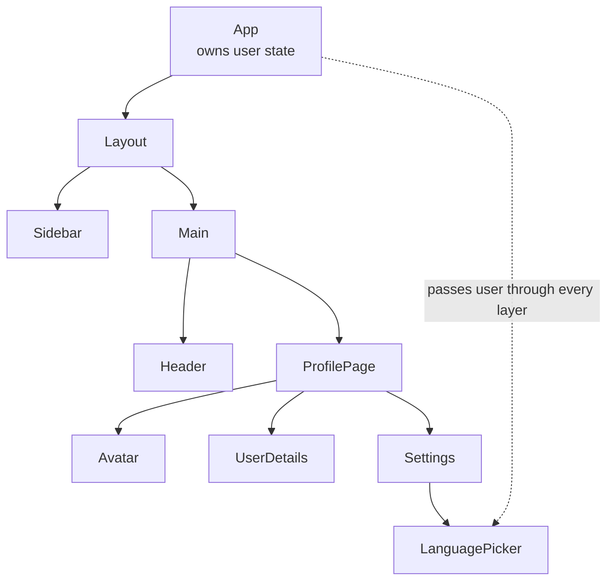
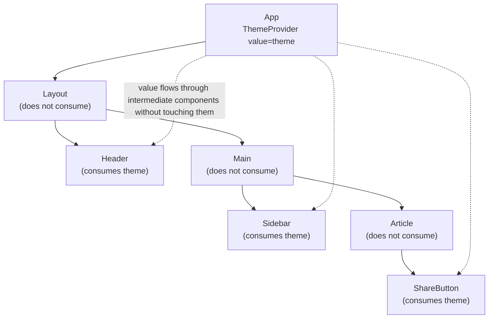
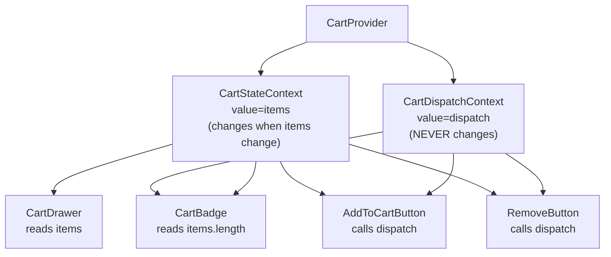

# 3.9 Context and Reducers

> React's component tree is a one-way data flow: state lives in a parent, props carry it down. When the parent at the top of the tree owns state that a deeply-nested child needs, you have to pass it through every intermediate component — the famous "prop drilling" problem. Context is React's built-in answer: a tunnel through the tree that bypasses intermediate components. Reducers (`useReducer`) are the natural companion for complex state, and combining the two gives you a lightweight global store. This note covers the prop drilling problem, Context API, performance implications, `useReducer`, the combined global store pattern, and when to reach for an external store like Zustand, Jotai, or Redux Toolkit.

## 3.9.1 Objective

By the end of this note you should be able to:

1. Explain the prop drilling problem and why it doesn't scale.
2. Create a Context with `createContext`, provide it with `Provider`, and consume it with `useContext`.
3. Explain why context re-renders all consumers on value change, and how to mitigate this with context splitting.
4. Split a context into "state" and "dispatch" slices to minimize re-renders.
5. Use `useReducer` for complex state transitions with action types and a `switch`-based reducer.
6. Combine Context + `useReducer` to build a lightweight global store.
7. Decide when NOT to use Context (frequently changing values, fine-grained subscriptions).
8. Choose between Context, Zustand, Jotai, Redux Toolkit, and how server components interact with context.

## 3.9.2 Background Knowledge

Before reading further, make sure you are comfortable with:

- **Props and component trees** from [[3.2 Components and Props]].
- **State and the updater function form** from [[3.3 State and Events]].
- **The built-in hooks** from [[3.6 Hooks (Built-In)]] — `useState`, `useContext`, `useReducer`.
- **Re-renders** from [[3.11 Performance Optimization]] — what triggers them and why memoization matters.
- **Custom hooks** from [[3.7 Custom Hooks]] — `useContext` is often wrapped in a custom hook for ergonomics.

## 3.9.3 Core Concepts

### 3.9.3.1 The Prop Drilling Problem Revisited



If `App` owns `user` and `LanguagePicker` needs it, you write `user={user}` on `Layout`, `Sidebar`, `Main`, `Header`, `ProfilePage`, `Avatar`, `UserDetails`, `Settings`, and `LanguagePicker`. Eight components receive a prop they don't use, just to forward it.

Problems:

1. **Verbose.** Every intermediate component has a `user` prop in its type signature.
2. **Brittle.** Adding a new prop (e.g., `setUser`) means threading it through the same path.
3. **Coupling.** `Layout` now "knows" about user state — it can't be reused in a context where there's no user.
4. **Refactoring pain.** Move `LanguagePicker` to a different branch and you rewrite the prop chain.

### 3.9.3.2 What Context Is

Context is a *tunnel* through the component tree. You create a context, wrap part of the tree in its `Provider`, and any descendant — no matter how deeply nested — can read the value with `useContext`.

```jsx
const UserContext = createContext(null);

function App() {
  const [user, setUser] = useState(null);
  return (
    <UserContext.Provider value={{ user, setUser }}>
      <Layout />
    </UserContext.Provider>
  );
}

function LanguagePicker() {
  const { user } = useContext(UserContext);
  return <select defaultValue={user?.preferredLanguage}>{/* ... */}</select>;
}
```

`Layout`, `Sidebar`, `Main`, `Header`, etc., don't see `user` at all. `LanguagePicker` reads it directly.

### 3.9.3.3 `createContext` and Its Default Value

```jsx
const UserContext = createContext(null);
```

The argument to `createContext` is the **default value** — used when a consumer calls `useContext(UserContext)` *without* a `Provider` ancestor. In most apps, you'll always have a `Provider`, so the default is `null` (or `undefined`) and consumers must handle the null case.

A common pattern is to throw if a consumer is used outside a provider:

```jsx
function useUser() {
  const ctx = useContext(UserContext);
  if (ctx === null) throw new Error("useUser must be used inside <UserProvider>");
  return ctx;
}
```

This catches wiring mistakes early. (Don't use the default value for this — a default value of `null` quietly propagates, and TypeScript can't distinguish "no provider" from "provider with null value".)

### 3.9.3.4 The Provider Pattern

```jsx
<UserContext.Provider value={{ user, setUser }}>
  {children}
</UserContext.Provider>
```

The `Provider` takes a `value` prop. Whenever `value` changes (by `Object.is`), every consumer re-renders. **Critical:** the value is compared by identity. If you pass a new object literal every render, every consumer re-renders every render — defeating the purpose.

```jsx
// BAD — new object every render
<UserContext.Provider value={{ user, setUser }}>

// GOOD — memoized value
const value = useMemo(() => ({ user, setUser }), [user, setUser]);
<UserContext.Provider value={value}>
```

`setUser` is stable (returned from `useState`), so the value only changes when `user` changes — exactly what you want.

### 3.9.3.5 `useContext` to Consume

```jsx
const { user, setUser } = useContext(UserContext);
```

`useContext` subscribes to the nearest provider above. When the provider's value changes (by identity), this component re-renders. There is no selector API built in — you get the whole value.

### 3.9.3.6 Why Context Re-renders All Consumers on Value Change

React's context is intentionally simple: when the value changes, *every* consumer re-renders, regardless of which part of the value they use. There's no built-in way to say "only re-render me if `user.name` changes".

This means:

```jsx
// Both Avatar and LanguagePicker re-render when user.name changes,
// even though LanguagePicker only reads user.preferredLanguage.
<Avatar />         // reads user.name
<LanguagePicker /> // reads user.preferredLanguage
```

For small contexts (auth, theme, locale) this is fine. For large or frequently changing contexts (a shopping cart with hundreds of items, a real-time feed), it becomes a performance problem.

### 3.9.3.7 Splitting Contexts — State vs Dispatch

The classic mitigation: split your context into two — one for state, one for dispatch. Most components either read state OR dispatch actions, rarely both.

```jsx
const CartStateContext = createContext(null);
const CartDispatchContext = createContext(null);

function CartProvider({ children }) {
  const [items, dispatch] = useReducer(cartReducer, []);
  return (
    <CartStateContext.Provider value={items}>
      <CartDispatchContext.Provider value={dispatch}>
        {children}
      </CartDispatchContext.Provider>
    </CartStateContext.Provider>
  );
}

function useCartState() {
  const ctx = useContext(CartStateContext);
  if (ctx === null) throw new Error("useCartState must be inside CartProvider");
  return ctx;
}

function useCartDispatch() {
  const ctx = useContext(CartDispatchContext);
  if (ctx === null) throw new Error("useCartDispatch must be inside CartProvider");
  return ctx;
}
```

`dispatch` from `useReducer` is stable — it never changes identity. So `CartDispatchContext`'s value never changes, and components that only dispatch (e.g., an "Add to cart" button) never re-render when the cart contents change. Only components that read state (the cart page) re-render.

> [!tip] Always split state and dispatch when using `useReducer` + Context
> It's almost free (a few lines of code) and saves you from a whole class of unnecessary re-renders. The dispatch context never changes; only the state context does.

### 3.9.3.8 Other Performance Mitigations

1. **Keep context values small.** A context with 5 primitive values re-renders less work than one with a 500-item array.
2. **Split into multiple contexts by domain.** `AuthContext`, `ThemeContext`, `CartContext` — each changes independently.
3. **Memoize consumers.** If a consumer's render is expensive, wrap it in `React.memo`. Combined with a memoized context value, you can skip re-renders.
4. **Use external stores for high-frequency updates.** Zustand and Jotai have selector APIs that subscribe to slices — only the consumer of the changed slice re-renders.
5. **The `use-context-selector` library** patches context to support selectors, but it's a third-party dependency with caveats.

### 3.9.3.9 `useReducer` — When to Use Instead of `useState`

Use `useReducer` when:

- State has multiple related fields that update together (e.g., a form with 8 fields, where changing "country" resets "state").
- The next state depends on the current state in non-trivial ways.
- You want a single, testable place for state transition logic.
- Multiple components need to trigger state changes via well-defined actions.

`useState` is fine for independent primitive values: `const [open, setOpen] = useState(false)`.

### 3.9.3.10 The Reducer Pattern

```jsx
const initialState = { count: 0 };

function reducer(state, action) {
  switch (action.type) {
    case "increment":
      return { count: state.count + 1 };
    case "decrement":
      return { count: state.count - 1 };
    case "reset":
      return initialState;
    case "set":
      return { count: action.payload };
    default:
      return state;
  }
}

function Counter() {
  const [state, dispatch] = useReducer(reducer, initialState);
  return (
    <>
      <p>{state.count}</p>
      <button onClick={() => dispatch({ type: "increment" })}>+</button>
      <button onClick={() => dispatch({ type: "decrement" })}>-</button>
      <button onClick={() => dispatch({ type: "reset" })}>Reset</button>
    </>
  );
}
```

The reducer is a **pure function**: `(state, action)  -->  state`. It must not mutate the existing state (return a new object). It must not have side effects (no `fetch`, no `console.log`, no `setTimeout`).

Discriminated unions in TypeScript make actions type-safe:

```ts
type Action =
  | { type: "increment" }
  | { type: "decrement" }
  | { type: "set"; payload: number }
  | { type: "reset" };
```

### 3.9.3.11 Combining Context with `useReducer` — A Global Store

```jsx
const CartStateContext = createContext(null);
const CartDispatchContext = createContext(null);

function cartReducer(state, action) {
  switch (action.type) {
    case "add":
      return [...state, action.item];
    case "remove":
      return state.filter(i => i.id !== action.id);
    case "clear":
      return [];
    default:
      return state;
  }
}

export function CartProvider({ children }) {
  const [state, dispatch] = useReducer(cartReducer, []);
  return (
    <CartStateContext.Provider value={state}>
      <CartDispatchContext.Provider value={dispatch}>
        {children}
      </CartDispatchContext.Provider>
    </CartStateContext.Provider>
  );
}

export function useCart() {
  const state = useContext(CartStateContext);
  const dispatch = useContext(CartDispatchContext);
  if (state === null || dispatch === null) {
    throw new Error("useCart must be used within CartProvider");
  }
  return { state, dispatch };
}
```

Usage:

```jsx
function App() {
  return (
    <CartProvider>
      <Header />
      <ProductList />
      <CartDrawer />
    </CartProvider>
  );
}

function AddToCartButton({ product }) {
  const { dispatch } = useCart();
  return <button onClick={() => dispatch({ type: "add", item: product })}>Add</button>;
}

function CartBadge() {
  const { state } = useCart();
  return <span>{state.length}</span>;
}
```

This is a complete, lightweight global store in ~30 lines. For many apps, this is enough.

### 3.9.3.12 When NOT to Use Context

1. **Frequently changing high-frequency values.** A real-time stock ticker firing 10 updates/sec — context re-renders all consumers on every tick. Use an external store.
2. **Fine-grained subscriptions.** If a 500-item list has each item subscribing to its own slice, context doesn't support selectors — every consumer re-renders on any change.
3. **Derived data that needs caching.** Context doesn't cache. Use a memoized external store.
4. **Server/client data with caching, retries, deduplication.** Use TanStack Query, SWR, or your framework's loaders.

### 3.9.3.13 Alternatives — Zustand, Jotai, Redux Toolkit

| Tool | Mental model | When to use |
| --- | --- | --- |
| **Context + useReducer** | Provider wraps tree; consumers read state and dispatch | Small-to-medium state, low-frequency updates, no need for selectors |
| **Zustand** | A single store hook; subscribe with selectors | Most apps. Simple API, selectors, no Provider boilerplate. |
| **Jotai** | Atomic state; each atom is independent | Fine-grained subscriptions, derived state, large apps with many small pieces. |
| **Redux Toolkit (RTK)** | Single store, actions, reducers, middleware | Large teams, time-travel debugging, lots of middleware (thunks, sagas). Heavier. |
| **TanStack Query** | Server state cache with invalidation | Anything that comes from an API. Don't put server state in Redux/Zustand. |

> [!tip] The 2025 default recommendation
> For UI/client state: **Zustand** unless you have a specific reason for something else. For server state: **TanStack Query** or your framework's loaders. Reach for Context + useReducer only for genuinely small, low-frequency state — auth, theme, locale.

### 3.9.3.14 Server Components and Context

Context is a *client* concept. Server components can read context, but context does not cross the server/client boundary cleanly:

- A server component cannot read context from a client provider above it (because the provider is client-side JavaScript, which the server doesn't run).
- A client component can provide context that its client children read.
- A server component that needs "shared state" must receive it as props from a client parent, or fetch its own data.

In practice, in Next.js App Router, you often see:
- Server components fetch data and pass it as props.
- Client providers wrap `<ClientSide>` subtrees.
- Client state (theme, auth) lives in client providers; server components read the same data from cookies/headers directly.

## 3.9.4 Detailed Walkthrough

### 3.9.4.1 Building a Theme Provider

```jsx
import { createContext, useContext, useState, useMemo, useEffect } from "react";

const ThemeContext = createContext(null);

function ThemeProvider({ children }) {
  const [theme, setTheme] = useState(() => {
    if (typeof window === "undefined") return "light";
    return localStorage.getItem("theme") || "light";
  });

  useEffect(() => {
    document.documentElement.dataset.theme = theme;
    localStorage.setItem("theme", theme);
  }, [theme]);

  const value = useMemo(() => ({ theme, setTheme }), [theme]);
  // setTheme is stable, so value only changes when theme changes.

  return <ThemeContext.Provider value={value}>{children}</ThemeContext.Provider>;
}

function useTheme() {
  const ctx = useContext(ThemeContext);
  if (!ctx) throw new Error("useTheme must be used within ThemeProvider");
  return ctx;
}

export { ThemeProvider, useTheme };
```

Usage:

```jsx
function App() {
  return (
    <ThemeProvider>
      <Page />
    </ThemeProvider>
  );
}

function Page() {
  const { theme, setTheme } = useTheme();
  return (
    <button onClick={() => setTheme(theme === "light" ? "dark" : "light")}>
      Toggle theme (current: {theme})
    </button>
  );
}
```

`ThemeProvider` is the only component that knows about `localStorage` or `document.documentElement`. Every consumer just reads `theme` and calls `setTheme`.

### 3.9.4.2 A Larger Example — Auth Context

```jsx
const AuthContext = createContext(null);

function AuthProvider({ children }) {
  const [user, setUser] = useState(null);
  const [status, setStatus] = useState("loading"); // "loading" | "authenticated" | "unauthenticated"

  useEffect(() => {
    fetch("/api/me")
      .then(r => r.ok ? r.json() : null)
      .then(u => {
        setUser(u);
        setStatus(u ? "authenticated" : "unauthenticated");
      })
      .catch(() => setStatus("unauthenticated"));
  }, []);

  const login = useCallback(async (email, password) => {
    const res = await fetch("/api/login", { method: "POST", body: JSON.stringify({ email, password }) });
    if (!res.ok) throw new Error("Login failed");
    const u = await res.json();
    setUser(u);
    setStatus("authenticated");
  }, []);

  const logout = useCallback(async () => {
    await fetch("/api/logout", { method: "POST" });
    setUser(null);
    setStatus("unauthenticated");
  }, []);

  const value = useMemo(
    () => ({ user, status, login, logout }),
    [user, status, login, logout]
  );

  return <AuthContext.Provider value={value}>{children}</AuthContext.Provider>;
}

function useAuth() {
  const ctx = useContext(AuthContext);
  if (!ctx) throw new Error("useAuth must be used within AuthProvider");
  return ctx;
}
```

Notice `login` and `logout` are wrapped in `useCallback` so their identities are stable, which keeps `value` stable across renders where `user`/`status` don't change.

> [!warning] Don't put `useEffect`-fetched data in Context for new apps
> This auth example uses `useEffect` to fetch `/api/me`, which is the classic pattern but a known anti-pattern in frameworks with proper data loading. In Next.js, you'd read the session from cookies in a server component or via a Server Action. Context is fine for the *client-side* state that results; the fetching itself should happen elsewhere.

### 3.9.4.3 Splitting Auth Context

If many components only need `login`/`logout` (e.g., the navbar buttons) and don't care about `user`, split:

```jsx
const AuthStateContext = createContext(null);
const AuthActionsContext = createContext(null);

function AuthProvider({ children }) {
  const [user, setUser] = useState(null);
  const [status, setStatus] = useState("loading");

  const login = useCallback(async (email, password) => { /* ... */ }, []);
  const logout = useCallback(async () => { /* ... */ }, []);

  return (
    <AuthStateContext.Provider value={{ user, status }}>
      <AuthActionsContext.Provider value={{ login, logout }}>
        {children}
      </AuthActionsContext.Provider>
    </AuthStateContext.Provider>
  );
}
```

`AuthActionsContext`'s value (a memoized object of stable callbacks) never changes identity. Components using `useAuthActions()` never re-render on auth state changes — only on actions they themselves trigger. Components using `useAuthState()` re-render on `user`/`status` changes.

### 3.9.4.4 A Full Reducer Example — Multi-Step Form

```jsx
const initialState = {
  step: 1,
  data: { name: "", email: "", plan: "free" },
  error: null,
};

function formReducer(state, action) {
  switch (action.type) {
    case "next":
      return { ...state, step: state.step + 1, error: null };
    case "back":
      return { ...state, step: Math.max(1, state.step - 1), error: null };
    case "update":
      return { ...state, data: { ...state.data, ...action.payload } };
    case "error":
      return { ...state, error: action.message };
    case "reset":
      return initialState;
    default:
      return state;
  }
}

function MultiStepForm() {
  const [state, dispatch] = useReducer(formReducer, initialState);

  return (
    <form onSubmit={e => { e.preventDefault(); /* submit state.data */ }}>
      {state.step === 1 && <Step1 data={state.data} dispatch={dispatch} />}
      {state.step === 2 && <Step2 data={state.data} dispatch={dispatch} />}
      {state.step === 3 && <Step3 data={state.data} dispatch={dispatch} />}
      {state.error && <ErrorMessage>{state.error}</ErrorMessage>}
      <button type="button" onClick={() => dispatch({ type: "back" })}>Back</button>
      <button type="button" onClick={() => dispatch({ type: "next" })}>Next</button>
    </form>
  );
}
```

The reducer centralizes all state logic. Each step component dispatches actions; it doesn't need to know about the others.

## 3.9.5 Practical Examples

### 3.9.5.1 Toast Notification System

```jsx
const ToastContext = createContext(null);

function ToastProvider({ children }) {
  const [toasts, setToasts] = useState([]);

  const add = useCallback((message, type = "info") => {
    const id = crypto.randomUUID();
    setToasts(t => [...t, { id, message, type }]);
    setTimeout(() => setToasts(t => t.filter(x => x.id !== id)), 5000);
  }, []);

  const value = useMemo(() => ({ toasts, add }), [toasts, add]);

  return (
    <ToastContext.Provider value={value}>
      {children}
      <ToastContainer toasts={toasts} />
    </ToastContext.Provider>
  );
}

function useToast() {
  const ctx = useContext(ToastContext);
  if (!ctx) throw new Error("useToast must be used within ToastProvider");
  return ctx;
}

// Usage anywhere in the tree:
function SubmitButton() {
  const { add } = useToast();
  return <button onClick={() => add("Saved!", "success")}>Save</button>;
}
```

### 3.9.5.2 Modal Manager

```jsx
const ModalContext = createContext(null);

function ModalProvider({ children }) {
  const [modal, setModal] = useState(null); // { component: ReactNode, props: any } | null
  const open = useCallback((component, props) => setModal({ component, props }), []);
  const close = useCallback(() => setModal(null), []);

  const value = useMemo(() => ({ open, close }), [open, close]);

  return (
    <ModalContext.Provider value={value}>
      {children}
      {modal && <modal.component {...modal.props} onClose={close} />}
    </ModalContext.Provider>
  );
}
```

### 3.9.5.3 Server Component Reading from Cookies (Next.js)

```jsx
// Server Component — no Context needed
import { cookies } from "next/headers";

export default async function Layout({ children }) {
  const theme = (await cookies()).get("theme")?.value || "light";
  return (
    <div data-theme={theme}>
      {children}
    </div>
  );
}
```

Server components can't use Context for cross-tree state, but they can read cookies/headers directly — which is often the right answer for theme, locale, and auth.

## 3.9.6 Mermaid Diagrams

### 3.9.6.1 Context Propagation



When `theme` changes, only `Header`, `Sidebar`, and `ShareButton` re-render. `Layout`, `Main`, and `Article` are untouched.

### 3.9.6.2 Split Context — State vs Dispatch



`AddToCartButton`, `RemoveButton`, and `CartBadge` all consume dispatch (some also consume state). But `AddToCartButton` and `RemoveButton` don't read state — when items change, they don't re-render (their dispatch-context value is stable).

## 3.9.7 Common Mistakes

1. **Passing a new object literal as the Provider value every render.** `value={{ user, setUser }}` causes every consumer to re-render every render of the provider. Memoize with `useMemo`.

2. **Using a single context for both state and dispatch.** Every dispatch-only consumer (e.g., "Add to cart" button) re-renders on every state change. Split into two contexts.

3. **Throwing on `null` default value but using it anyway.** `createContext(null)` means consumers outside a provider get `null`. If you don't handle that, you get `Cannot read property 'x' of null`. Throw in your custom hook instead.

4. **Putting server-fetched data in Context.** For server state, use TanStack Query / SWR / framework loaders. Context is for *client* state.

5. **Mutating state in a reducer.** Reducers must return *new* objects. `state.items.push(action.item); return state;` is a bug — React won't see the change because the reference is the same.

6. **Forgetting to handle the `default` case in a reducer switch.** Always return `state` for unknown action types — silent bugs otherwise.

7. **Using Context for high-frequency updates.** Mouse position, scroll position, real-time data — these re-render every consumer on every tick. Use an external store with selectors.

8. **Nesting providers excessively.** A deeply-nested tree of providers makes the app hard to reason about. Group related contexts in a single "AppProviders" component.

9. **Assuming Context works in server components.** Context does not cross the server/client boundary. Server components can't read client-provided context.

10. **Creating the Context inside a component.** `function App() { const Ctx = createContext(null); ... }` creates a new context every render — consumers read from different contexts. Always create the context at module scope.

## 3.9.8 Best Practices

1. **Create context at module scope.** Never inside a component.
2. **Wrap `useContext` in a custom hook** that throws if no provider — this catches wiring mistakes.
3. **Memoize the Provider value.** Always. Even if you "only have a few consumers".
4. **Split state and dispatch** when using `useReducer` + Context.
5. **Keep contexts small and domain-specific.** `AuthContext`, `ThemeContext`, `CartContext` — not one mega `AppContext`.
6. **Type your context** in TypeScript — define the shape and use a discriminated union for actions.
7. **Test reducers in isolation.** They're pure functions — easy to unit test.
8. **Use external stores for high-frequency or fine-grained state.** Zustand is the default recommendation for most client state.
9. **Don't use Context for server state.** TanStack Query / SWR / framework loaders handle caching, retries, and invalidation.
10. **In server components, read from cookies/headers directly** rather than relying on context.

## 3.9.9 Mini Exercises

### 3.9.9.1 Build a `useTheme` Hook with Context

**Problem.** Create a `ThemeProvider` and `useTheme` hook. The theme should be `"light" | "dark"`, persisted to `localStorage`, and applied to `document.documentElement.dataset.theme`. The hook should throw if used outside the provider.

**Solution.**

```jsx
import { createContext, useContext, useState, useEffect, useMemo, useCallback } from "react";

const ThemeContext = createContext(null);

function ThemeProvider({ children }) {
  const [theme, setTheme] = useState(() => {
    if (typeof window === "undefined") return "light";
    return localStorage.getItem("theme") || "light";
  });

  useEffect(() => {
    document.documentElement.dataset.theme = theme;
    localStorage.setItem("theme", theme);
  }, [theme]);

  const toggle = useCallback(() => {
    setTheme(t => t === "light" ? "dark" : "light");
  }, []);

  const value = useMemo(() => ({ theme, setTheme, toggle }), [theme, toggle]);

  return <ThemeContext.Provider value={value}>{children}</ThemeContext.Provider>;
}

function useTheme() {
  const ctx = useContext(ThemeContext);
  if (ctx === null) throw new Error("useTheme must be used within ThemeProvider");
  return ctx;
}

export { ThemeProvider, useTheme };
```

**Reasoning.** Lazy initializer avoids SSR errors. `useEffect` syncs to DOM and storage. `toggle` is memoized. `value` is memoized so consumers only re-render when `theme` changes. The custom hook throws on missing provider.

### 3.9.9.2 Diagnose the Re-render Storm

**Problem.** Every keystroke in a search box causes the entire app to re-render, even components that don't use the search query. Why?

```jsx
const AppContext = createContext(null);

function AppProvider({ children }) {
  const [query, setQuery] = useState("");
  const [user, setUser] = useState(null);
  const [theme, setTheme] = useState("light");
  return (
    <AppContext.Provider value={{ query, setQuery, user, setUser, theme, setTheme }}>
      {children}
    </AppContext.Provider>
  );
}
```

**Solution.** The provider value is a new object literal every render. Every consumer re-renders on every keystroke because the value's identity changes.

**Fix 1 (memoize).**

```jsx
const value = useMemo(
  () => ({ query, setQuery, user, setUser, theme, setTheme }),
  [query, user, theme]
);
```

`setQuery`, `setUser`, `setTheme` are stable. `value` now only changes when one of the three state values changes.

**Fix 2 (split).** Even with memoization, a change to `query` re-renders consumers that only use `theme`. Split into three contexts:

```jsx
<SearchContext.Provider value={{ query, setQuery }}>
  <UserContext.Provider value={{ user, setUser }}>
    <ThemeContext.Provider value={{ theme, setTheme }}>
      {children}
    </ThemeContext.Provider>
  </UserContext.Provider>
</SearchContext.Provider>
```

Now a `query` change re-renders only `SearchContext` consumers.

### 3.9.9.3 Implement a Cart with `useReducer` + Split Context

**Problem.** Build a cart with `add`, `remove`, and `clear` actions. The "Add to cart" buttons should NOT re-render when the cart contents change.

**Solution.**

```jsx
const CartStateContext = createContext(null);
const CartDispatchContext = createContext(null);

function cartReducer(state, action) {
  switch (action.type) {
    case "add":
      return [...state, action.item];
    case "remove":
      return state.filter(i => i.id !== action.id);
    case "clear":
      return [];
    default:
      return state;
  }
}

function CartProvider({ children }) {
  const [state, dispatch] = useReducer(cartReducer, []);
  return (
    <CartStateContext.Provider value={state}>
      <CartDispatchContext.Provider value={dispatch}>
        {children}
      </CartDispatchContext.Provider>
    </CartStateContext.Provider>
  );
}

function useCartState() {
  const ctx = useContext(CartStateContext);
  if (ctx === null) throw new Error("useCartState must be inside CartProvider");
  return ctx;
}

function useCartDispatch() {
  const ctx = useContext(CartDispatchContext);
  if (ctx === null) throw new Error("useCartDispatch must be inside CartProvider");
  return ctx;
}

function AddToCartButton({ product }) {
  const dispatch = useCartDispatch();
  return <button onClick={() => dispatch({ type: "add", item: product })}>Add</button>;
}

function CartBadge() {
  const items = useCartState();
  return <span>{items.length}</span>;
}
```

**Reasoning.** `dispatch` from `useReducer` is stable — it never changes identity. So `CartDispatchContext`'s value never changes, and `AddToCartButton` never re-renders when the cart contents change (only when its own `product` prop changes). `CartBadge` re-renders on every cart change (it reads state) — that's what you want.

### 3.9.9.4 Convert a Mutating Reducer to a Pure One

**Problem.** This reducer has a bug. Find and fix it.

```jsx
function todosReducer(state, action) {
  switch (action.type) {
    case "add":
      state.push(action.todo);
      return state;
    case "toggle":
      const todo = state.find(t => t.id === action.id);
      todo.done = !todo.done;
      return state;
    default:
      return state;
  }
}
```

**Solution.** The reducer mutates state and returns the same reference. React's `useReducer` checks reference equality; if the reference is the same, React skips the re-render. So `add` and `toggle` don't trigger UI updates.

**Fix.**

```jsx
function todosReducer(state, action) {
  switch (action.type) {
    case "add":
      return [...state, action.todo];
    case "toggle":
      return state.map(t => t.id === action.id ? { ...t, done: !t.done } : t);
    case "remove":
      return state.filter(t => t.id !== action.id);
    default:
      return state;
  }
}
```

**Reasoning.** Reducers must be pure and return new references for changed state. The spread operator (`[...state, ...]`) and `.map`/`.filter` create new arrays, triggering React's re-render. The `toggle` case also creates a *new* todo object (not just a new array) so that consumers of that specific todo re-render.

### 3.9.9.5 Choose Between Context, Zustand, and TanStack Query

**Problem.** For each of the following, choose the right tool and justify.

a) Authenticated user (changes rarely, read everywhere).
b) A real-time stock ticker with 200 symbols, each rendered in its own row.
c) A list of products fetched from `/api/products`.
d) Theme (light/dark).
e) A multi-step form's state, with derived validation.

**Answers.**

a) **Context + useReducer**, or Zustand. Auth changes rarely; Context's lack of selectors is fine. Zustand is also fine if you're already using it.

b) **Zustand or Jotai.** High-frequency updates + fine-grained subscriptions. Context would re-render all 200 rows on every tick. Zustand's selector API lets each row subscribe only to its symbol.

c) **TanStack Query (or framework loaders).** Server state. Don't put it in Context or Zustand — TanStack Query handles caching, deduplication, retries, and invalidation.

d) **Context.** Two values (light/dark), low frequency, read in many places. Context is perfect.

e) **`useReducer` (local), or Zustand if the form is shared across many components.** For a single component, `useReducer` is enough. For a complex form with multiple sections in different components, Zustand's selectors work well. Context + useReducer is also fine if the form is moderate-sized.

**Reasoning.** The decision tree is: server state  -->  TanStack Query. Client state, low frequency, small  -->  Context. Client state, high frequency or fine-grained  -->  Zustand or Jotai. Complex local state  -->  `useReducer`.

## 3.9.10 Summary

- Context tunnels data through the tree without prop drilling.
- `createContext` at module scope; `Provider` supplies the value; `useContext` reads it.
- Context re-renders all consumers on value change — memoize the value, split state and dispatch, and keep contexts small.
- `useReducer` is for complex state with related fields and well-defined transitions.
- Combined Context + `useReducer` makes a lightweight global store; split into state and dispatch contexts.
- Don't use Context for high-frequency updates, fine-grained subscriptions, or server state.
- For most client state in 2025, default to Zustand; for server state, TanStack Query.
- Server components can't read client-provided context — use cookies/headers directly.

## 3.9.11 Related Notes

- [[3.2 Components and Props]] — the prop drilling problem Context solves.
- [[3.3 State and Events]] — `useState` and the updater form, foundational to reducers.
- [[3.6 Hooks (Built-In)]] — `useContext` and `useReducer` API summaries.
- [[3.7 Custom Hooks]] — wrapping `useContext` in a custom hook for ergonomics and validation.
- [[3.8 Effects and Side Effects]] — why `useEffect`-based fetching shouldn't drive Context.
- [[3.10 Composition and Patterns]] — the Provider pattern as a composition pattern.
- [[3.11 Performance Optimization]] — memoization of context values and consumer components.
- [[3.13 Error Boundaries and Debugging]] — debugging context re-renders with the Profiler.
- [[4.7 Server Actions and Forms]] — server-side data loading that replaces Context for server state.
