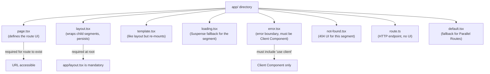
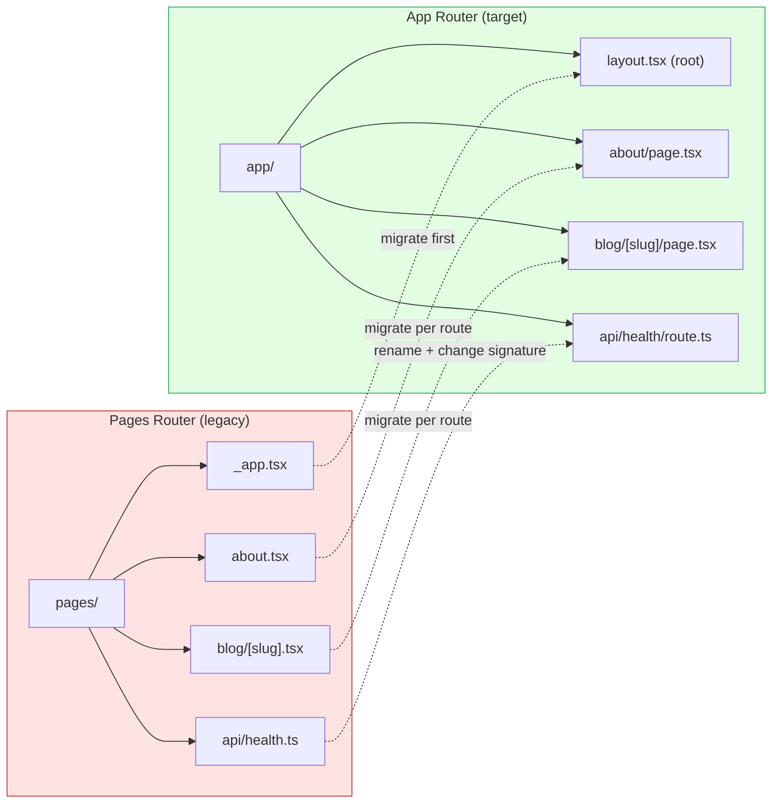
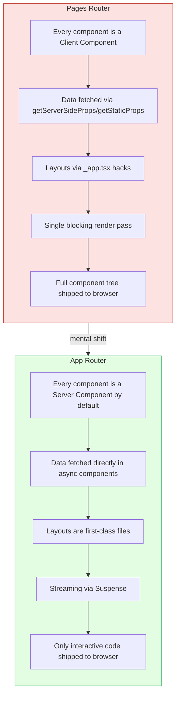

# 4.1 App Router Foundations

> The App Router is the modern routing and rendering model for Next.js, introduced in Next.js 13 and stabilized in Next.js 14. It is built on React Server Components, supports nested layouts, streaming, and per-route rendering strategies. This note explains where it came from, what it actually is, and the file conventions that make it work.

## 4.1.1 Objective

By the end of this note you should be able to:

1. Explain, in your own words, why Next.js introduced the App Router despite already having the Pages Router.
2. Describe every file convention inside the `app/` directory (`page.tsx`, `layout.tsx`, `loading.tsx`, `error.tsx`, `not-found.tsx`, `route.ts`, `template.tsx`, `default.tsx`) and what each is responsible for.
3. Distinguish React Server Components from React Client Components at the architectural level, and explain why Server Components are the default in the App Router.
4. Migrate an existing Pages Router route to the App Router using the official incremental adoption path.
5. Decide, with reasoning, whether a brand-new project should use the App Router or Pages Router.

## 4.1.2 Background Knowledge

Before reading further you should already be comfortable with the following from earlier chapters:

- React components, props, and JSX — see [[3.2 Components and Props]] and [[3.1 JSX and Rendering]].
- React hooks (`useState`, `useEffect`, `useContext`) — see [[3.6 Hooks (Built-In)]].
- React Suspense and lazy loading — see [[3.12 Suspense, Lazy Loading, and Code Splitting]].
- Client-side routing concepts — see [[3.17 Client-Side Routing]].
- The basic shape of an HTTP request lifecycle (request, response, status codes, headers).

You do not need any prior Next.js experience. This note assumes you have never used the Pages Router either; we will cover enough of its history to explain the motivation for the App Router.

## 4.1.3 Core Concepts

### 4.1.3.1 A Brief History of Next.js Routing

Next.js shipped in 2016 as a thin layer over React that added file-based routing. You created a file at `pages/about.tsx`, and Next.js exposed it at the URL `/about`. This was the **Pages Router**, and for roughly six years it was the only router Next.js had.

The Pages Router was a tremendous productivity boost over hand-rolling React Router, but it had three structural problems:

1. **No first-class layouts.** You could hack layouts with a custom `App` component, but every layout pattern was an ad-hoc convention. Common UI like a persistent sidebar, a settings nav, or a dashboard shell required third-party libraries or custom HOCs.
2. **No Server Components.** Every component in the Pages Router was a Client Component by default. The entire component tree — including code that only fetched data and never needed interactivity — was shipped to the browser as JavaScript.
3. **No streaming by default.** Pages were rendered in a single blocking pass on the server. A page with three slow data sources could not send the HTML shell and progressively fill in the slow parts; the entire page waited for the slowest data source.

In October 2022, Next.js 13 introduced the App Router to address all three problems at once. The App Router became the recommended default in Next.js 13.4 (May 2023) and reached production stability in Next.js 14 (October 2023). Next.js 15 (October 2024) added further refinements — async request APIs, tighter React 19 integration, and Partial Prerendering as an experimental feature.

### 4.1.3.2 The `app/` Directory

The App Router lives in a top-level directory called `app/`. This directory sits alongside the legacy `pages/` directory, and Next.js treats them as two separate routers that can coexist during migration. The router that handles a given URL depends on which directory contains the matching file — but conflicts should be avoided, and in new projects you only have `app/`.

```text
my-app/
  - app/
      - layout.tsx        <--  root layout (required)
      - page.tsx          <--  home page (/)
      - about/
          - page.tsx      <--  /about
      - blog/
      - page.tsx      <--  /blog
      - [slug]/
      - page.tsx  <--  /blog/:slug
  - pages/                <--  legacy, optional, only for incremental migration
      - old-route.tsx
  - next.config.ts
```

Every folder inside `app/` maps to a URL segment. Every file inside a folder is a **route convention** — Next.js looks for files with specific names and uses them for specific purposes.

### 4.1.3.3 The File Conventions

There are eight core file conventions inside `app/`. Each has a fixed filename and a specific role.

#### `page.tsx`

Defines the UI for a route. A folder is only considered a route if it contains a `page.tsx` (or `page.js`, `page.ts`). The presence of `page.tsx` is what makes a URL accessible; without it, the folder is just an organizational container.

```tsx
// app/blog/page.tsx
export default function BlogPage() {
  return <h1>Blog</h1>;
}
```

#### `layout.tsx`

Wraps the page (and any nested children) in shared UI. Layouts persist across navigations between sibling routes — the layout's React state is preserved, and the layout component itself does not re-render its body when the URL changes. A root layout (`app/layout.tsx`) is required and must render `<html>` and `<body>`.

```tsx
// app/layout.tsx
export default function RootLayout({ children }: { children: React.ReactNode }) {
  return (
    <html lang="en">
      <body>{children}</body>
    </html>
  );
}
```

#### `template.tsx`

Like `layout.tsx` but re-mounts on every navigation. State is *not* preserved when you navigate between routes that share a template. Use it for things like enter/exit animations that must replay on every navigation.

#### `loading.tsx`

Wraps the page (and nested children) in a React Suspense boundary. The contents of `loading.tsx` are streamed while the page itself is being rendered or while its data is loading.

```tsx
// app/blog/loading.tsx
export default function Loading() {
  return <p>Loading blog...</p>;
}
```

#### `error.tsx`

A React error boundary for the route segment. It catches uncaught errors thrown by the page or its nested children, including errors thrown during server rendering that bubble up to the client. Must be a Client Component (must include `"use client"`).

```tsx
// app/blog/error.tsx
"use client";

export default function Error({ error, reset }: { error: Error; reset: () => void }) {
  return (
    <div>
      <h2>Something went wrong!</h2>
      <button onClick={reset}>Try again</button>
    </div>
  );
}
```

#### `not-found.tsx`

Renders when the route's `page.tsx` calls `notFound()` from `next/navigation`, or when no matching route is found for a URL that falls under this segment. The root `app/not-found.tsx` is the global 404 page.

#### `route.ts`

Defines a Route Handler — an HTTP endpoint at the URL of the enclosing folder. Route Handlers replace Pages Router API routes (`pages/api/`). See [[4.8 Route Handlers]] for the full treatment.

```ts
// app/api/health/route.ts
export function GET() {
  return Response.json({ ok: true });
}
```

#### `default.tsx`

Used as the fallback for Parallel Routes when no matching slot is provided. Covered in depth in [[4.2 Routing, Layouts, and Templates]].

### 4.1.3.4 React Server Components as the Foundation

The App Router is not just a new router. It is a new *rendering model* built on top of React Server Components (RSC). The full RSC story is the subject of [[4.3 Server and Client Components]], but the short version is:

- A **Server Component** renders only on the server. It never ships its own code to the browser, can access databases and the filesystem directly, and cannot use `useState`, `useEffect`, or any browser-only API.
- A **Client Component** renders on both the server (for the initial HTML) and the client (for interactivity). It is the classic React component you already know. It must opt in with the `"use client"` directive at the top of the file.

In the Pages Router, every component was a Client Component by default. In the App Router, **every component is a Server Component by default**. This is the single biggest mental shift when migrating, and it is the reason so many other App Router features (data fetching directly in components, smaller bundles, streaming) exist.

### 4.1.3.5 Partial Prerendering

Partial Prerendering (PPR) is an experimental feature, stabilizing across Next.js 14 and 15, that combines static and dynamic rendering in a *single* route. Before PPR, a route was either fully static (rendered at build time) or fully dynamic (rendered at request time). With PPR, Next.js can prerender the static parts of a route at build time and stream in the dynamic parts at request time, using Suspense boundaries as the split points.

PPR is still behind a flag in Next.js 15 (`experimental.ppr = true`) and is expected to become the default in a future major version. You should know it exists, but you should not build a production app around it yet. We will revisit the implications in [[4.4 Rendering Strategies]] and [[4.9 Loading UI, Error Pages, and Streaming]].

## 4.1.4 Detailed Walkthrough

### 4.1.4.1 Why the App Router Was Introduced

To understand the App Router, you have to understand the three pain points the Pages Router could not solve cleanly.

**Pain point 1 — Layouts.** A typical product page in a SaaS dashboard has a global shell (sidebar, top bar, theme), a settings sub-shell (settings tabs), and the actual settings content. In the Pages Router, you typically wrote something like:

```tsx
// pages/_app.tsx (Pages Router)
import type { AppProps } from "next/app";
import { Shell } from "../components/Shell";
import { SettingsShell } from "../components/SettingsShell";
import { useRouter } from "next/router";

export default function App({ Component, pageProps }: AppProps) {
  const router = useRouter();
  const isSettings = router.pathname.startsWith("/settings");

  return (
    <Shell>
      {isSettings ? <SettingsShell><Component {...pageProps} /></SettingsShell> : <Component {...pageProps} />}
    </Shell>
  );
}
```

This works, but it is a hack: the routing logic and the layout composition are coupled, the layout re-renders on every navigation, and there is no first-class way to nest layouts arbitrarily deep. The App Router solves this by making layouts files (`layout.tsx`) that naturally compose:

```tsx
// app/settings/layout.tsx
export default function SettingsLayout({ children }: { children: React.ReactNode }) {
  return (
    <div className="flex gap-4">
      <SettingsTabs />
      <main>{children}</main>
    </div>
  );
}
```

That single file wraps every page under `/settings/*`. No router logic, no HOCs, no conditionals.

**Pain point 2 — JavaScript bundle size.** In the Pages Router, a "dumb" component that just rendered a static heading was still shipped to the browser as JavaScript. The App Router's default of Server Components means that component's HTML is sent over the wire, but its source code is not. For a content-heavy site, this can shrink the client bundle by an order of magnitude.

**Pain point 3 — Streaming.** A typical dashboard page has fast parts (header, nav) and slow parts (a query that takes 800 ms). The Pages Router blocked the entire response until everything was ready. The App Router streams HTML as it becomes available, so the user sees the shell in 50 ms and the slow part fills in 800 ms later — perceived performance improves dramatically.

### 4.1.4.2 The Mental Model: Server by Default, Client on Demand

The single most important habit to internalize is: **a file in the App Router is a Server Component unless you opt out.** You opt out by adding `"use client"` at the top of the file. There is no `"use server"` directive that promotes a component to a Server Component — that directive is reserved for Server Actions (see [[4.7 Server Actions and Forms]]).

Concretely:

- A file with no directive is a Server Component.
- A file with `"use client"` at the top is a Client Component. Everything in that file (and everything it imports, unless those imports are themselves Server Components passed in as `children`) is in the client bundle.
- The boundary is *per file*, not per function. You cannot have one function in a file be a Server Component and another be a Client Component.

### 4.1.4.3 Composing Server and Client Components

The composition rules are subtle but important:

1. A Server Component can import and render a Client Component.
2. A Server Component can render another Server Component.
3. A Client Component can render another Client Component.
4. A Client Component *cannot* import a Server Component directly — but it *can* receive a Server Component as a prop (typically the `children` prop) from a Server Component that wraps it.

The fourth rule is the key to building interactive shells that wrap server-rendered content. Example:

```tsx
// app/page.tsx (Server Component)
import { InteractiveSidebar } from "./InteractiveSidebar";
import { ServerContent } from "./ServerContent";

export default function Page() {
  return (
    <InteractiveSidebar>
      <ServerContent />  {/* passed as children — this is allowed */}
    </InteractiveSidebar>
  );
}
```

```tsx
// app/InteractiveSidebar.tsx (Client Component)
"use client";
import { useState } from "react";

export function InteractiveSidebar({ children }: { children: React.ReactNode }) {
  const [open, setOpen] = useState(true);
  return (
    <div>
      <button onClick={() => setOpen(!open)}>Toggle</button>
      {open && <nav>...</nav>}
      {children}  {/* server-rendered content rendered inside a client shell */}
    </div>
  );
}
```

This pattern is so common it has a name: the **children-as-server-component** pattern. It is the canonical way to build interactive shells (sidebars, modals, drawers) that wrap server-rendered content.

### 4.1.4.4 The Required Root Layout

Every App Router project must have exactly one `app/layout.tsx` (the **root layout**) at the top of the `app/` directory. It must:

- Render `<html>` and `<body>` tags (no other file is allowed to).
- Accept a `children` prop and render it inside `<body>`.
- Not throw during render (it wraps the entire app; an uncaught error in the root layout cannot be caught by any `error.tsx`).

```tsx
// app/layout.tsx
import "./globals.css";
import type { Metadata } from "next";

export const metadata: Metadata = {
  title: "My App",
  description: "Built with the App Router",
};

export default function RootLayout({ children }: { children: React.ReactNode }) {
  return (
    <html lang="en">
      <body>{children}</body>
    </html>
  );
}
```

The root layout is also the conventional place to import global stylesheets, configure fonts via `next/font`, and render top-level providers (context, theme, etc.). Providers must be Client Components — see [[4.3 Server and Client Components]] for the pattern of putting providers in a Client Component that wraps `children`.

### 4.1.4.5 Migrating from Pages Router to App Router

Next.js supports incremental migration. The two routers can coexist in the same project. The high-level steps are:

1. Keep your `pages/` directory as-is.
2. Create an `app/` directory alongside it.
3. Add a root layout at `app/layout.tsx`.
4. Migrate routes one at a time, from the leaves inward.
5. Once a route is fully migrated, delete the corresponding file from `pages/`.

> [!warning] URL conflicts
> If both `pages/about.tsx` and `app/about/page.tsx` exist, Next.js will refuse to build and will print a conflict error. You must delete the Pages Router version before adding the App Router version for the same path.

The migration of data fetching is the largest single change. The Pages Router used `getServerSideProps`, `getStaticProps`, and `getStaticPaths` — special functions Next.js called for you. In the App Router, you just `await fetch(...)` (or any async operation) directly inside the component. The mental shift is from "framework-provided data functions" to "plain async server code."

```tsx
// BEFORE — Pages Router
export async function getServerSideProps() {
  const res = await fetch("https://api.example.com/users");
  const users = await res.json();
  return { props: { users } };
}

export default function Users({ users }: { users: User[] }) {
  return <ul>{users.map((u) => <li key={u.id}>{u.name}</li>)}</ul>;
}
```

```tsx
// AFTER — App Router
export default async function Users() {
  const res = await fetch("https://api.example.com/users");
  const users = await res.json();
  return <ul>{users.map((u) => <li key={u.id}>{u.name}</li>)}</ul>;
}
```

Same result, half the boilerplate, and the component is now free to compose with layouts, Suspense, and the caching layer.

### 4.1.4.6 When to Use the App Router vs. the Pages Router

For any new project starting on Next.js 14 or 15, **use the App Router.** There are no scenarios where a new project benefits from the Pages Router. Vercel's own `create-next-app` defaults to the App Router.

You should only encounter the Pages Router in two situations:

1. **Maintaining an existing app.** A large production app may not have the bandwidth to migrate. In that case, the App Router and Pages Router can coexist, and you can migrate opportunistically.
2. **Reading old tutorials and Stack Overflow answers.** Most Next.js content written before mid-2023 uses the Pages Router. Recognize the patterns (`getServerSideProps`, `next/router`, `next/link` with `href` only) and translate them to App Router equivalents.

## 4.1.5 Practical Examples

### 4.1.5.1 A Minimal App Router Project

The smallest possible App Router project has two files:

```tsx
// app/layout.tsx
export default function RootLayout({ children }: { children: React.ReactNode }) {
  return (
    <html lang="en">
      <body>{children}</body>
    </html>
  );
}
```

```tsx
// app/page.tsx
export default function Home() {
  return <h1>Hello, App Router</h1>;
}
```

Run `next dev` and visit `http://localhost:3000`. That is it. No `pages/` directory, no `next.config.js` required (Next.js 15 ships sensible defaults), no providers.

### 4.1.5.2 Nested Layouts in Practice

A documentation site might have a global shell, a docs-specific shell, and a per-section shell:

```text
app/
  - layout.tsx             <--  global shell (header, footer)
  - page.tsx               <--  /
  - docs/
      - layout.tsx         <--  docs shell (sidebar with sections)
      - page.tsx           <--  /docs
      - [slug]/
      - layout.tsx     <--  per-doc shell (table of contents)
      - page.tsx       <--  /docs/:slug
```

Each `layout.tsx` wraps everything below it. The final rendered tree for `/docs/getting-started` is:

```text
<RootLayout>
  <DocsLayout>
    <DocLayout>
      <DocPage />
    </DocLayout>
  </DocsLayout>
</RootLayout>
```

The state in each layout (e.g., a collapsed sidebar) is preserved when navigating between sibling routes. Navigating from `/docs/getting-started` to `/docs/advanced` does not remount `RootLayout` or `DocsLayout` — only `DocLayout` and `DocPage`.

### 4.1.5.3 Mixing Server and Client Components in a Page

A real product page typically has server-rendered content (product info, reviews) and client-only interactive elements (image carousel, add-to-cart button). The idiomatic structure:

```tsx
// app/products/[id]/page.tsx (Server Component)
import { db } from "@/lib/db";
import { AddToCartButton } from "./AddToCartButton";
import { ImageCarousel } from "./ImageCarousel";

export default async function ProductPage({ params }: { params: { id: string } }) {
  const product = await db.product.findUnique({ where: { id: params.id } });

  if (!product) notFound();

  return (
    <main>
      <ImageCarousel images={product.images} />
      <h1>{product.name}</h1>
      <p>{product.description}</p>
      <AddToCartButton productId={product.id} />
    </main>
  );
}
```

```tsx
// app/products/[id]/AddToCartButton.tsx (Client Component)
"use client";
import { useState } from "react";

export function AddToCartButton({ productId }: { productId: string }) {
  const [added, setAdded] = useState(false);
  return (
    <button onClick={() => setAdded(true)} disabled={added}>
      {added ? "Added!" : "Add to cart"}
    </button>
  );
}
```

The Server Component fetches data and renders the page structure. The Client Component encapsulates the only part of the page that actually needs interactivity. Everything else stays on the server.

## 4.1.6 Mermaid Diagrams

### 4.1.6.1 File Conventions in the App Directory



### 4.1.6.2 Migration Path from Pages Router to App Router



### 4.1.6.3 Pages Router vs App Router Mental Model



## 4.1.7 Common Mistakes

1. **Forgetting the root layout.** If `app/layout.tsx` is missing or does not render `<html>` and `<body>`, Next.js will refuse to build with a confusing error. The root layout is the only mandatory file in the entire App Router.

2. **Adding `"use client"` to every file.** Some developers, scared by the new Server Component default, add `"use client"` to every file. This completely defeats the purpose of the App Router — you end up with the Pages Router's bundle size plus the App Router's stricter conventions. Reach for `"use client"` only when you need interactivity (`useState`, `onClick`, browser APIs).

3. **Trying to use `useState` in a Server Component.** A file without `"use client"` cannot use `useState`, `useEffect`, `useRef`, or any hook. The error message is "useState is not a function" or "You're calling a Client Component hook from a Server Component," depending on the version. The fix is to split the interactive piece into its own Client Component file.

4. **Importing a Server Component into a Client Component.** This will silently turn the imported component into a Client Component (because the `"use client"` boundary propagates downward through imports). If you want to render server-rendered content inside a Client Component, pass it as the `children` prop, not via direct import.

5. **Co-locating Pages Router and App Router routes for the same URL.** Having both `pages/about.tsx` and `app/about/page.tsx` will produce a build-time conflict error. Pick one router per URL.

6. **Putting global styles in the wrong place.** Global CSS can only be imported in `app/layout.tsx` (or a Client Component imported by it). Importing global CSS in a page or other component produces a build error.

7. **Assuming `loading.tsx` only shows during the initial server render.** `loading.tsx` is a Suspense boundary — it shows during *any* transition that requires the page to be re-rendered, including client-side navigation. This can surprise you: a navigation that was instant under the Pages Router may now show a brief loading state because the new route is being streamed.

## 4.1.8 Best Practices

1. **Default to Server Components.** Write every component as a Server Component until you have a concrete reason to opt in to the client. The most common legitimate reasons: you need `useState`/`useEffect`, you need a browser API (`window`, `IntersectionObserver`), or you need an event handler.

2. **Push `"use client"` to the leaves.** When a page has both server-rendered content and interactive elements, isolate the interactive elements into their own small Client Component files. The page itself and the layout remain Server Components. This minimizes the client bundle.

3. **Use the `children` prop to wrap Server Components in Client shells.** This is the only correct pattern for an interactive wrapper that contains server-rendered content. See [[4.3 Server and Client Components]] for the full pattern.

4. **Keep the root layout minimal.** The root layout wraps the entire application. Any error here breaks everything. Put providers in their own Client Component file imported by the root layout — never inline them.

5. **Adopt TypeScript from day one.** Next.js's TypeScript support is now first-class. The types for `params`, `searchParams`, `metadata`, and layout/page props are all enforced. Skipping TypeScript in the App Router costs you the safety net that catches most layout/page signature bugs.

6. **Read the build output.** Next.js's build output prints which routes are static (○), dynamic (ƒ), and which use streaming. This is the single most valuable diagnostic signal the framework gives you. Read it on every build.

7. **Migrate incrementally, never big-bang.** If you are moving an existing app from the Pages Router, do it route by route over weeks. Each migration should be its own PR with its own review. Big-bang migrations are where the subtle bugs hide.

## 4.1.9 Mini Exercises

### Exercise 1 — Identify the File Convention

You open a Next.js project and see the following files in `app/blog/`:

```text
app/blog/
  - page.tsx
  - layout.tsx
  - loading.tsx
  - error.tsx
```

For each file, write a one-sentence description of when Next.js renders it, and what would happen if the file were deleted.

**Worked solution:**

- `page.tsx` — Rendered when the URL `/blog` is requested. If deleted, `/blog` returns a 404 (no route).
- `layout.tsx` — Rendered as a wrapper around `page.tsx` (and any nested child layouts). If deleted, the page renders without the blog-specific shell, falling back to the next layout up the tree (typically the root layout).
- `loading.tsx` — Rendered as the Suspense fallback while `page.tsx` (or its data) is being prepared. If deleted, Next.js still waits for the page to be ready, but no fallback UI is shown; the user sees the previous page or a blank state until the new page is ready.
- `error.tsx` — Rendered if `page.tsx` (or any nested child) throws during render. If deleted, the error bubbles up to the nearest ancestor `error.tsx`, or to the root `app/error.tsx`, or to Next's default error page if none exists.

### Exercise 2 — Spot the Client/Server Boundary Bug

The following code fails to compile or behaves incorrectly. Find the bug and fix it.

```tsx
// app/page.tsx
import { Counter } from "./Counter";

export default function Page() {
  return (
    <main>
      <h1>Home</h1>
      <Counter initial={0} />
    </main>
  );
}
```

```tsx
// app/Counter.tsx
import { useState } from "react";

export function Counter({ initial }: { initial: number }) {
  const [count, setCount] = useState(initial);
  return <button onClick={() => setCount((c) => c + 1)}>{count}</button>;
}
```

**Worked solution:**

The bug: `Counter.tsx` uses `useState` and `onClick`, both of which require a Client Component, but the file is missing the `"use client"` directive at the top. The component is treated as a Server Component by default, and `useState` cannot be used in a Server Component.

The fix:

```tsx
// app/Counter.tsx
"use client";
import { useState } from "react";

export function Counter({ initial }: { initial: number }) {
  const [count, setCount] = useState(initial);
  return <button onClick={() => setCount((c) => c + 1)}>{count}</button>;
}
```

Adding `"use client"` to the top of `Counter.tsx` opts the file (and everything it imports) into the client bundle. `app/page.tsx` remains a Server Component — it imports a Client Component and renders it, which is allowed.

### Exercise 3 — Wrap Server Content in a Client Shell

You have a server-rendered `Article` component (fetches from a CMS) and a `ShareButton` Client Component. Write the page so that the `ShareButton` appears next to the article body, but the article content stays server-rendered.

**Worked solution:**

```tsx
// app/articles/[slug]/page.tsx (Server Component)
import { Article } from "./Article";
import { ShareButton } from "./ShareButton";

export default async function Page({ params }: { params: { slug: string } }) {
  return (
    <main>
      <Article slug={params.slug} />
      <ShareButton slug={params.slug} />
    </main>
  );
}
```

```tsx
// app/articles/[slug]/Article.tsx (Server Component — no directive)
import { getCmsArticle } from "@/lib/cms";

export async function Article({ slug }: { slug: string }) {
  const article = await getCmsArticle(slug);
  return (
    <article>
      <h1>{article.title}</h1>
      <div dangerouslySetInnerHTML={{ __html: article.body }} />
    </article>
  );
}
```

```tsx
// app/articles/[slug]/ShareButton.tsx (Client Component)
"use client";
import { useState } from "react";

export function ShareButton({ slug }: { slug: string }) {
  const [copied, setCopied] = useState(false);
  return (
    <button
      onClick={() => {
        navigator.clipboard.writeText(`https://example.com/articles/${slug}`);
        setCopied(true);
      }}
    >
      {copied ? "Copied!" : "Share"}
    </button>
  );
}
```

The page is a Server Component that orchestrates the layout. `Article` stays on the server (CMS data, no JS shipped). `ShareButton` is a small Client Component that handles the clipboard interaction. The boundary is at `ShareButton` and nothing else.

### Exercise 4 — Migrate a Pages Router Page

Convert the following Pages Router page to an App Router page.

```tsx
// pages/users.tsx
export async function getServerSideProps() {
  const res = await fetch("https://api.example.com/users", { cache: "no-store" });
  const users = await res.json();
  return { props: { users } };
}

export default function Users({ users }: { users: { id: string; name: string }[] }) {
  return (
    <ul>
      {users.map((u) => <li key={u.id}>{u.name}</li>)}
    </ul>
  );
}
```

**Worked solution:**

```tsx
// app/users/page.tsx
export default async function Users() {
  const res = await fetch("https://api.example.com/users", { cache: "no-store" });
  const users: { id: string; name: string }[] = await res.json();
  return (
    <ul>
      {users.map((u) => <li key={u.id}>{u.name}</li>)}
    </ul>
  );
}
```

The changes:

1. The file moves from `pages/users.tsx` to `app/users/page.tsx`.
2. `getServerSideProps` is removed entirely. The fetch happens directly in the component.
3. The component becomes `async` and receives no `users` prop — it fetches its own data.
4. The `cache: "no-store"` option preserves the original "always fetch fresh" behavior. (Without it, Next.js would cache the response — see [[4.6 Caching and Revalidation]] for why this matters.)
5. Delete `pages/users.tsx` to avoid a URL conflict.

### Exercise 5 — Describe What Ships to the Browser

Given the following three files, list exactly which code reaches the browser as JavaScript.

```tsx
// app/page.tsx
import { Header } from "./Header";
import { Counter } from "./Counter";

export default function Page() {
  return (
    <main>
      <Header title="Home" />
      <Counter initial={0} />
    </main>
  );
}
```

```tsx
// app/Header.tsx
export function Header({ title }: { title: string }) {
  return <header><h1>{title}</h1></header>;
}
```

```tsx
// app/Counter.tsx
"use client";
import { useState } from "react";
export function Counter({ initial }: { initial: number }) {
  const [count, setCount] = useState(initial);
  return <button onClick={() => setCount((c) => c + 1)}>{count}</button>;
}
```

**Worked solution:**

- `app/page.tsx` — Server Component. Renders to HTML on the server. Its source code does **not** ship to the browser.
- `app/Header.tsx` — Server Component (no `"use client"`). Renders to HTML on the server. Its source code does **not** ship to the browser.
- `app/Counter.tsx` — Client Component (`"use client"`). Source code **does** ship to the browser, because the browser must execute it to handle `useState` and the `onClick` handler.

Only `Counter.tsx` (and its imports, which here is just `react` itself — bundled separately by React) ships to the browser. The HTML for `Page` and `Header` is sent over the wire, but the JavaScript for those two files is not. That is the App Router bundle-size win in one sentence.

## 4.1.10 Summary

The App Router is the modern routing and rendering model for Next.js, built on React Server Components. It replaces the Pages Router's per-page data functions with direct `async/await` in components, makes layouts first-class files, and streams HTML to the browser as it becomes available. Every component is a Server Component by default; you opt a file into the client bundle with `"use client"` when it needs interactivity. The `app/` directory contains eight file conventions — `page.tsx`, `layout.tsx`, `template.tsx`, `loading.tsx`, `error.tsx`, `not-found.tsx`, `route.ts`, and `default.tsx` — each with a single responsibility. For new projects, always use the App Router. For existing projects, migrate incrementally, route by route, with the two routers coexisting during the transition.

## 4.1.11 Related Notes

- [[4.2 Routing, Layouts, and Templates]] — deep dive into dynamic segments, route groups, parallel routes, intercepted routes, and the difference between `layout.tsx` and `template.tsx`.
- [[4.3 Server and Client Components]] — the full Server/Client Component model, composition rules, and the `"use client"` directive.
- [[4.4 Rendering Strategies]] — static, dynamic, ISR, and streaming, and how Next.js picks between them.
- [[4.5 Data Fetching]] — how to fetch data in Server Components, parallel fetching, and the `fetch()` extensions Next.js adds.
- [[4.6 Caching and Revalidation]] — the four Next.js caches and how to invalidate each.
- [[4.7 Server Actions and Forms]] — mutations without API routes.
- [[3.12 Suspense, Lazy Loading, and Code Splitting]] — the React Suspense primitive that powers `loading.tsx` and streaming.
- [[3.17 Client-Side Routing]] — the conceptual foundation for understanding what the App Router does on top of routing.
