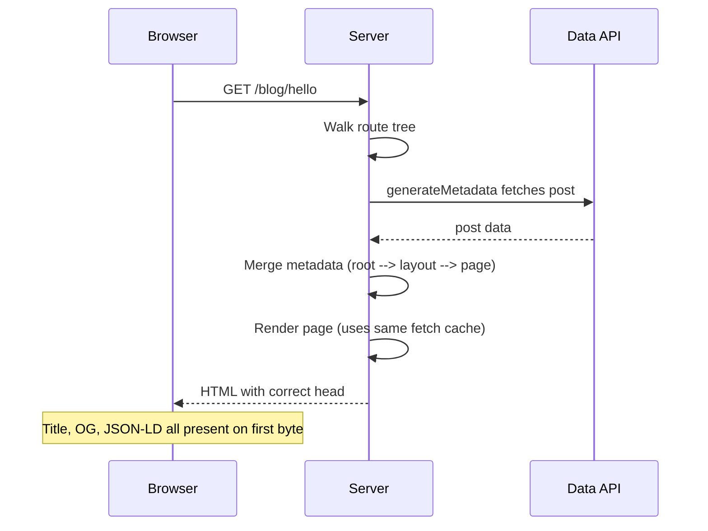

# 4.10 Metadata and SEO

> Next.js ships a typed Metadata API that replaces the `<Head>` component from the Pages Router. You declare metadata either as a static `export const metadata` object or as a dynamic `generateMetadata` async function in any `layout.tsx` or `page.tsx`. Next.js merges metadata up the route tree, fills in the right `<meta>` tags, manages the `<title>` template, generates Open Graph and Twitter cards, produces a `sitemap.xml` and `robots.txt` from TypeScript files, generates dynamic OG images with `ImageResponse`, and (since Next.js 14) separates the `viewport` export from `metadata`. This note covers every piece of the Metadata API, why it matters for SEO and social sharing, and how metadata composes across your route tree.

## 4.10.1 Objective

By the end of this note you should be able to:

1. Define static metadata with `export const metadata` and dynamic metadata with `generateMetadata`.
2. Use the `title.template` pattern to keep page titles consistent without repeating the site name.
3. Configure Open Graph and Twitter card metadata for rich social sharing.
4. Configure `icons`, `manifest`, and `metadataBase`.
5. Generate `sitemap.xml` and `robots.txt` from `sitemap.ts` and `robots.ts`.
6. Embed JSON-LD structured data for richer search results.
7. Generate dynamic OG images using `ImageResponse` and the `opengraph-image.tsx` convention.
8. Explain how metadata merges from parent layouts down to leaf pages, and how `viewport` is separate from `metadata` since Next.js 14.

## 4.10.2 Background Knowledge

This note assumes you have read [[4.1 App Router Foundations]] (the segment model), [[4.2 Routing, Layouts, and Templates]] (how layouts wrap pages and nest), [[4.3 Server and Client Components]] (metadata is set in Server Components), and [[4.5 Data Fetching]] (dynamic metadata is just async data fetching). You should also be familiar with the basics of SEO: the `<title>` tag, `<meta name="description">`, Open Graph (`og:title`, `og:image`, etc.), Twitter cards, canonical URLs, sitemaps, and `robots.txt`. If you have used libraries like `react-helmet` or `next-seo`, unlearn them — the App Router's Metadata API replaces all of them with built-in types.

## 4.10.3 Core Concepts

### 4.10.3.1 Why Metadata Matters

Search engines and social platforms read specific HTML tags to decide what to display. A correctly configured `<title>` improves click-through rate. A correct `og:image` makes links preview nicely in Slack, Twitter, LinkedIn, and iMessage. A `sitemap.xml` helps Google discover pages. A `robots.txt` tells crawlers what to skip. JSON-LD structured data can produce rich results (recipes, FAQ accordions, product ratings). Getting all of this right with hand-written `<head>` markup is tedious and error-prone; the Metadata API does it for you with TypeScript types.

### 4.10.3.2 Static Metadata

Any `layout.tsx` or `page.tsx` can export a `metadata` object:

```tsx
// app/layout.tsx
import type { Metadata } from 'next';

export const metadata: Metadata = {
  title: 'Acme',
  description: 'We build things.',
};

export default function RootLayout({ children }: { children: React.ReactNode }) {
  return (
    <html lang="en">
      <body>{children}</body>
    </html>
  );
}
```

This produces:

```html
<title>Acme</title>
<meta name="description" content="We build things." />
```

### 4.10.3.3 Dynamic Metadata

For metadata that depends on data (a product name, a blog post title), export an async `generateMetadata` function instead:

```tsx
// app/products/[id]/page.tsx
import type { Metadata, ResolvingMetadata } from 'next';

type Props = { params: Promise<{ id: string }> };

export async function generateMetadata(
  { params }: Props,
  parent: ResolvingMetadata,
): Promise<Metadata> {
  const { id } = await params;
  const product = await fetch(`https://api.example.com/products/${id}`).then((r) => r.json());
  return {
    title: product.name,
    description: product.summary,
    openGraph: { images: [product.image] },
  };
}

export default async function Page({ params }: Props) {
  const { id } = await params;
  // ...
}
```

`generateMetadata` runs on the server, can `await` anything (DB, fetch, filesystem), and is deduplicated against the page's own data fetches when you use the same `fetch` URL with the same options. The `parent` argument lets you read the parent segment's already-resolved metadata (e.g. to extend the title template).

> [!note] `generateMetadata` Runs Before the Page Renders
> Next.js awaits `generateMetadata` before streaming the page's HTML so the `<head>` is correct on first byte. This means a slow `generateMetadata` delays the entire response. Keep it fast — ideally hitting the same cached data the page will use.

### 4.10.3.4 The `title.template` Pattern

The root layout usually defines a title template:

```tsx
export const metadata: Metadata = {
  title: {
    default: 'Acme',
    template: '%s | Acme',
  },
};
```

Now a child page that sets `title: 'Pricing'` produces `Pricing | Acme`. A child page that sets no title gets `Acme` (the default). The `%s` placeholder is replaced with the child's title.

A child can opt out of the template with `title.absolute`:

```tsx
export const metadata: Metadata = {
  title: { absolute: 'Login - Acme' }, // not "Login - Acme | Acme"
};
```

### 4.10.3.5 Open Graph and Twitter Cards

Open Graph (used by Facebook, LinkedIn, Slack, iMessage) and Twitter cards (used by Twitter/X) are configured under `openGraph` and `twitter`:

```tsx
export const metadata: Metadata = {
  openGraph: {
    title: 'Acme',
    description: 'We build things.',
    url: 'https://acme.com',
    siteName: 'Acme',
    images: [
      {
        url: 'https://acme.com/og.png',
        width: 1200,
        height: 630,
        alt: 'Acme',
      },
    ],
    locale: 'en_US',
    type: 'website',
  },
  twitter: {
    card: 'summary_large_image',
    title: 'Acme',
    description: 'We build things.',
    images: ['https://acme.com/og.png'],
    creator: '@acme',
  },
};
```

This generates the corresponding `og:*` and `twitter:*` meta tags.

### 4.10.3.6 The `metadataBase` Configuration

`metadataBase` is a single URL set on the root layout that Next.js uses to resolve *relative* image URLs in metadata. Without it, OG image URLs like `/og.png` would render without a host and be ignored by social scrapers.

```tsx
export const metadata: Metadata = {
  metadataBase: new URL('https://acme.com'),
  // ...
};
```

> [!danger] Forgetting `metadataBase` Breaks Social Cards
> If you set `openGraph.images: ['/og.png']` without `metadataBase`, social platforms cannot resolve the URL. They try to fetch `og.png` from their own domain, get a 404, and show no image preview. Always set `metadataBase` in production.

### 4.10.3.7 Icons

The `icons` field configures favicons, apple-touch-icons, etc. Next.js also auto-detects files in `app/`:

- `favicon.ico`
- `icon.png` / `icon.svg` / `icon.tsx` (dynamic)
- `apple-icon.png` / `apple-icon.tsx`

```tsx
export const metadata: Metadata = {
  icons: {
    icon: '/icon.png',
    apple: '/apple-icon.png',
  },
};
```

A `icon.tsx` file can generate an icon dynamically using `ImageResponse`:

```tsx
// app/icon.tsx
import { ImageResponse } from 'next/og';

export const size = { width: 32, height: 32 };
export const contentType = 'image/png';

export default function Icon() {
  return new ImageResponse(
    (
      <div style={{ background: 'black', color: 'white', fontSize: 24, width: '100%', height: '100%', display: 'flex', alignItems: 'center', justifyContent: 'center' }}>
        A
      </div>
    ),
    { ...size },
  );
}
```

### 4.10.3.8 The `manifest.json` for PWA

For installable Progressive Web Apps, point at a manifest:

```tsx
export const metadata: Metadata = {
  manifest: '/manifest.json',
};
```

```json
// public/manifest.json
{
  "name": "Acme",
  "short_name": "Acme",
  "start_url": "/",
  "display": "standalone",
  "background_color": "#ffffff",
  "theme_color": "#000000",
  "icons": [
    { "src": "/icon-192.png", "sizes": "192x192", "type": "image/png" },
    { "src": "/icon-512.png", "sizes": "512x512", "type": "image/png" }
  ]
}
```

### 4.10.3.9 Canonical URLs

Set the canonical URL via the `alternates.canonical` field:

```tsx
export const metadata: Metadata = {
  alternates: {
    canonical: '/products/123',
  },
};
```

Combined with `metadataBase`, this resolves to `https://acme.com/products/123` and emits `<link rel="canonical" href="...">`. Useful when the same content is reachable from multiple URLs.

### 4.10.3.10 The `sitemap.ts` File Convention

A `sitemap.ts` at the root of `app/` generates `/sitemap.xml`:

```ts
// app/sitemap.ts
import type { MetadataRoute } from 'next';

export default async function sitemap(): Promise<MetadataRoute.Sitemap> {
  const posts = await fetch('https://api.example.com/posts').then((r) => r.json());
  const postUrls = posts.map((p: { slug: string; updatedAt: string }) => ({
    url: `https://acme.com/blog/${p.slug}`,
    lastModified: new Date(p.updatedAt),
    changeFrequency: 'weekly' as const,
    priority: 0.7,
  }));

  return [
    { url: 'https://acme.com', lastModified: new Date(), changeFrequency: 'daily', priority: 1 },
    { url: 'https://acme.com/blog', lastModified: new Date(), changeFrequency: 'daily', priority: 0.8 },
    ...postUrls,
  ];
}
```

### 4.10.3.11 The `robots.ts` File Convention

Similarly, `robots.ts` generates `/robots.txt`:

```ts
// app/robots.ts
import type { MetadataRoute } from 'next';

export default function robots(): MetadataRoute.Robots {
  return {
    rules: [
      { userAgent: '*', allow: '/', disallow: '/admin' },
      { userAgent: 'Googlebot', allow: '/' },
    ],
    sitemap: 'https://acme.com/sitemap.xml',
  };
}
```

### 4.10.3.12 Structured Data with JSON-LD

JSON-LD is a JSON format that describes your content to search engines. Embed it as a `<script type="application/ld+json">`:

```tsx
// app/products/[id]/page.tsx
export default async function Page({ params }: { params: Promise<{ id: string }> }) {
  const { id } = await params;
  const product = await getProduct(id);

  const jsonLd = {
    '@context': 'https://schema.org',
    '@type': 'Product',
    name: product.name,
    image: product.image,
    description: product.summary,
    offers: {
      '@type': 'Offer',
      price: product.price,
      priceCurrency: 'USD',
    },
  };

  return (
    <section>
      <script type="application/ld+json" dangerouslySetInnerHTML={{ __html: JSON.stringify(jsonLd) }} />
      <h1>{product.name}</h1>
      <p>{product.summary}</p>
    </section>
  );
}
```

This enables Google to display price and availability directly in search results.

### 4.10.3.13 Dynamic OG Images with `ImageResponse`

A static OG image is fine for a homepage. For dynamic content (a blog post with its title, a product with its name and price), generate the image on the fly with `ImageResponse`:

```tsx
// app/blog/[slug]/opengraph-image.tsx
import { ImageResponse } from 'next/og';

export const size = { width: 1200, height: 630 };
export const contentType = 'image/png';

export default async function Image({ params }: { params: Promise<{ slug: string }> }) {
  const { slug } = await params;
  const post = await getPost(slug);
  return new ImageResponse(
    (
      <div style={{
        background: 'linear-gradient(135deg, #000, #333)',
        color: 'white',
        width: '100%',
        height: '100%',
        display: 'flex',
        flexDirection: 'column',
        justifyContent: 'space-between',
        padding: 60,
      }}>
        <div style={{ fontSize: 32, opacity: 0.7 }}>Acme Blog</div>
        <div style={{ fontSize: 64, fontWeight: 700 }}>{post.title}</div>
        <div style={{ fontSize: 24, opacity: 0.7 }}>{post.author}</div>
      </div>
    ),
    { ...size },
  );
}
```

Next.js automatically wires this up as the `og:image` for the route. No manual metadata wiring needed.

### 4.10.3.14 The `viewport` Export (Next.js 14+)

Browser-level viewport, theme color, and color scheme are now exported as `viewport`, not `metadata`:

```tsx
// app/layout.tsx
import type { Viewport } from 'next';

export const viewport: Viewport = {
  width: 'device-width',
  initialScale: 1,
  themeColor: [
    { media: '(prefers-color-scheme: light)', color: '#ffffff' },
    { media: '(prefers-color-scheme: dark)', color: '#0a0a0a' },
  ],
};
```

This generates `<meta name="viewport">` and `<meta name="theme-color">`. Putting these in `metadata` was deprecated in Next.js 14 and removed in later versions.

### 4.10.3.15 How Metadata Merges

Next.js walks the route tree from the root layout down to the leaf page, merging metadata at each level:

- Later fields override earlier fields (page wins over layout).
- Some fields merge: `title.template` applies to children unless overridden; `openGraph.images` arrays concatenate; `icons` merge.
- `metadataBase` is inherited from the root.

```mermaid
flowchart TD
    Root[Root layout<br/>title.template = '%s | Acme'<br/>metadataBase = acme.com] --> Layout1[Section layout<br/>title: 'Blog'] --> Page[Page<br/>title: 'Hello World']
    Page --> Merged[Merged title = 'Hello World | Acme'<br/>OG image inherited from root]
```

## 4.10.4 Detailed Walkthrough

### 4.10.4.1 A Full Root Layout Metadata

```tsx
// app/layout.tsx
import type { Metadata, Viewport } from 'next';

export const metadata: Metadata = {
  metadataBase: new URL('https://acme.com'),
  title: {
    default: 'Acme - We build things',
    template: '%s | Acme',
  },
  description: 'Acme builds software for the modern web.',
  applicationName: 'Acme',
  authors: [{ name: 'Acme Team' }],
  keywords: ['acme', 'software', 'web'],
  alternates: { canonical: '/' },
  openGraph: {
    type: 'website',
    url: 'https://acme.com',
    siteName: 'Acme',
    title: 'Acme',
    description: 'We build things.',
    images: [{ url: '/og.png', width: 1200, height: 630, alt: 'Acme' }],
  },
  twitter: {
    card: 'summary_large_image',
    title: 'Acme',
    description: 'We build things.',
    images: ['/og.png'],
    creator: '@acme',
  },
  robots: {
    index: true,
    follow: true,
    googleBot: { index: true, follow: true, 'max-image-preview': 'large' },
  },
  icons: {
    icon: '/icon.png',
    apple: '/apple-icon.png',
  },
  manifest: '/manifest.json',
};

export const viewport: Viewport = {
  width: 'device-width',
  initialScale: 1,
  themeColor: '#000000',
};

export default function RootLayout({ children }: { children: React.ReactNode }) {
  return (
    <html lang="en">
      <body>{children}</body>
    </html>
  );
}
```

### 4.10.4.2 A Blog Post Page with Dynamic Metadata

```tsx
// app/blog/[slug]/page.tsx
import type { Metadata } from 'next';
import { notFound } from 'next/navigation';

type Props = { params: Promise<{ slug: string }> };

export async function generateMetadata({ params }: Props): Promise<Metadata> {
  const { slug } = await params;
  const post = await getPost(slug);
  if (!post) return { title: 'Not found' };
  return {
    title: post.title,
    description: post.excerpt,
    alternates: { canonical: `/blog/${slug}` },
    openGraph: {
      type: 'article',
      title: post.title,
      description: post.excerpt,
      publishedTime: post.publishedAt,
      authors: [post.author.name],
    },
  };
}

export default async function Page({ params }: Props) {
  const { slug } = await params;
  const post = await getPost(slug);
  if (!post) notFound();
  const jsonLd = {
    '@context': 'https://schema.org',
    '@type': 'BlogPosting',
    headline: post.title,
    datePublished: post.publishedAt,
    author: { '@type': 'Person', name: post.author.name },
  };
  return (
    <article>
      <script type="application/ld+json" dangerouslySetInnerHTML={{ __html: JSON.stringify(jsonLd) }} />
      <h1>{post.title}</h1>
      <p>{post.body}</p>
    </article>
  );
}
```

### 4.10.4.3 A Dynamic Sitemap

```ts
// app/sitemap.ts
import type { MetadataRoute } from 'next';

export default async function sitemap(): Promise<MetadataRoute.Sitemap> {
  const baseUrl = 'https://acme.com';
  const [posts, products] = await Promise.all([
    fetch('https://api.example.com/posts').then((r) => r.json()),
    fetch('https://api.example.com/products').then((r) => r.json()),
  ]);

  const postUrls: MetadataRoute.Sitemap = posts.map((p: { slug: string; updatedAt: string }) => ({
    url: `${baseUrl}/blog/${p.slug}`,
    lastModified: new Date(p.updatedAt),
    changeFrequency: 'weekly',
    priority: 0.6,
  }));

  const productUrls: MetadataRoute.Sitemap = products.map((p: { id: string; updatedAt: string }) => ({
    url: `${baseUrl}/products/${p.id}`,
    lastModified: new Date(p.updatedAt),
    changeFrequency: 'daily',
    priority: 0.8,
  }));

  return [
    { url: baseUrl, lastModified: new Date(), changeFrequency: 'daily', priority: 1 },
    { url: `${baseUrl}/blog`, lastModified: new Date(), changeFrequency: 'daily', priority: 0.9 },
    { url: `${baseUrl}/products`, lastModified: new Date(), changeFrequency: 'daily', priority: 0.9 },
    ...postUrls,
    ...productUrls,
  ];
}
```

### 4.10.4.4 A Dynamic OG Image with Branding

```tsx
// app/blog/[slug]/opengraph-image.tsx
import { ImageResponse } from 'next/og';

export const alt = 'Blog post preview';
export const size = { width: 1200, height: 630 };
export const contentType = 'image/png';

export default async function Image({ params }: { params: Promise<{ slug: string }> }) {
  const { slug } = await params;
  const post = await getPost(slug);
  return new ImageResponse(
    (
      <div style={{
        background: '#0a0a0a',
        color: 'white',
        width: '100%',
        height: '100%',
        display: 'flex',
        flexDirection: 'column',
        justifyContent: 'space-between',
        padding: 80,
        fontFamily: 'sans-serif',
      }}>
        <div style={{ display: 'flex', alignItems: 'center', gap: 16 }}>
          <div style={{ width: 12, height: 12, background: '#f97316', borderRadius: 999 }} />
          <div style={{ fontSize: 28, opacity: 0.8 }}>acme.com/blog</div>
        </div>
        <div style={{ fontSize: 56, fontWeight: 700, lineHeight: 1.2 }}>{post.title}</div>
        <div style={{ display: 'flex', justifyContent: 'space-between', fontSize: 24, opacity: 0.7 }}>
          <span>{post.author.name}</span>
          <span>{new Date(post.publishedAt).toLocaleDateString()}</span>
        </div>
      </div>
    ),
    { ...size },
  );
}
```

### 4.10.4.5 Robots with Sitemap Reference

```ts
// app/robots.ts
import type { MetadataRoute } from 'next';

export default function robots(): MetadataRoute.Robots {
  return {
    rules: {
      userAgent: '*',
      allow: '/',
      disallow: ['/admin', '/api', '/settings'],
    },
    sitemap: 'https://acme.com/sitemap.xml',
    host: 'https://acme.com',
  };
}
```

## 4.10.5 Practical Examples

### 4.10.5.1 Per-Section Title Templates

```tsx
// app/blog/layout.tsx
export const metadata = {
  title: { default: 'Blog', template: '%s - Acme Blog' },
};
```

A page at `/blog/hello` with `title: 'Hello'` produces `Hello - Acme Blog`. A page at `/blog` with no title produces `Blog`. A page at `/pricing` (outside the blog section) still uses the root template, producing `Pricing | Acme`.

### 4.10.5.2 Conditional Robots for Staging

```tsx
// app/layout.tsx
export const metadata: Metadata = {
  robots: process.env.NODE_ENV === 'production'
    ? { index: true, follow: true }
    : { index: false, follow: false },
};
```

This prevents staging URLs from being indexed.

### 4.10.5.3 Reading the Parent's Metadata

```tsx
export async function generateMetadata(_props, parent) {
  const previous = (await parent) as Metadata;
  const previousTitle = previous.title?.toString();
  return { description: `More about ${previousTitle}` };
}
```

### 4.10.5.4 Multi-Language Alternates

```tsx
export const metadata: Metadata = {
  alternates: {
    canonical: '/en/about',
    languages: {
      'en-US': '/en/about',
      'es-ES': '/es/about',
      'fr-FR': '/fr/about',
    },
  },
};
```

Emits `<link rel="alternate" hreflang="en-US" href="...">` etc.

### 4.10.5.5 Article Author for Open Graph

```tsx
export const metadata: Metadata = {
  openGraph: {
    type: 'article',
    publishedTime: '2024-01-15T00:00:00Z',
    modifiedTime: '2024-01-20T00:00:00Z',
    authors: ['Jane Doe', 'John Smith'],
    section: 'Technology',
    tags: ['nextjs', 'react'],
  },
};
```

## 4.10.6 Mermaid Diagrams

### 4.10.6.1 Metadata Merging Across the Route Tree

```mermaid
flowchart TD
    Root[Root layout<br/>metadataBase<br/>title.template = '%s | Acme'<br/>openGraph.images = og.png] --> Section[Section layout<br/>title.default = 'Blog'] --> Leaf[Page<br/>title = 'Hello'<br/>description = '...']
    Leaf --> Merge[Merge step]
    Section --> Merge
    Root --> Merge
    Merge --> Output[Final head:<br/>title = 'Hello | Acme'<br/>description from page<br/>og:image inherited from root<br/>metadataBase applied]
```

### 4.10.6.2 Metadata Generation Lifecycle



### 4.10.6.3 OG Image Generation

```mermaid
flowchart LR
    URL[/blog/hello] --> Page[page.tsx]
    URL --> OG[opengraph-image.tsx]
    Page --> Metadata[generateMetadata]
    OG --> ImageResponse[ImageResponse]
    ImageResponse --> PNG[PNG bytes]
    Metadata --> Auto[Auto-detected by Next.js]
    PNG --> Auto
    Auto --> Head[og:image meta tag]
```

## 4.10.7 Common Mistakes

1. **Forgetting `metadataBase`.** Relative OG image URLs (`/og.png`) produce broken previews on social platforms because the scraper has no host to resolve against.

2. **Putting viewport config in `metadata`.** Since Next.js 14, `viewport` is a separate export. The old form is deprecated and emits warnings.

3. **Setting `title` instead of `title.template` on the root.** Without a template, every child page must repeat the site name manually, leading to inconsistent titles.

4. **A slow `generateMetadata` blocking the whole page.** Since Next.js awaits it before streaming, a 2-second metadata fetch delays the entire response. Cache aggressively and share fetches with the page.

5. **Forgetting `robots: index: false` on staging.** Staging URLs leak into Google's index and dilute your SEO. Always set this in non-production environments.

6. **Setting OG images that are too small.** Social platforms recommend 1200×630. Smaller images get cropped or ignored.

7. **Returning a Promise from `generateMetadata` that returns `undefined`.** This silently drops metadata. Always return a `Metadata` object (even an empty one).

8. **Not setting `description`.** Search engines fall back to scraping page text, which is often ugly and not what you want shown in the SERP.

9. **Forgetting `lang` on `<html>`.** The `<html lang="en">` attribute is set in the root layout's JSX, not in metadata. Omitting it hurts accessibility and SEO.

10. **Hand-writing JSON-LD and forgetting to escape HTML.** If your title contains `</script>`, the JSON-LD block breaks. Use `JSON.stringify` and consider a sanitisation step.

## 4.10.8 Best Practices

1. **Set `metadataBase` once in the root layout.** Use an environment variable so it differs between staging and production.

2. **Use `title.template` everywhere.** Pick one template for the root and let pages fill in the `%s`.

3. **Keep `generateMetadata` fast.** Aim for under 100ms. Cache the underlying fetch; reuse the same fetch in the page.

4. **Generate dynamic OG images with `opengraph-image.tsx`.** They dramatically improve social engagement.

5. **Always include a `description`.** Even a short one is better than letting the search engine guess.

6. **Use `sitemap.ts` and `robots.ts`.** Do not hand-write `sitemap.xml` and `robots.txt` — they drift out of date.

7. **Add JSON-LD for content types that benefit from it.** Articles, products, recipes, FAQ, breadcrumbs. Validate with Google's Rich Results Test.

8. **Set `viewport` and `themeColor` correctly.** Mobile UX depends on them.

9. **Test with the Open Graph Debugger.** Use Facebook's Sharing Debugger and Twitter's Card Validator before launch. They reveal missing tags and image problems.

10. **Make metadata branch on environment.** `NODE_ENV === 'production'` should drive `robots.index` and `metadataBase`.

## 4.10.9 Mini Exercises

### Exercise 1: Build Static Metadata with Title Template

**Goal:** A root layout that uses `Acme` as the site name, with template `%s | Acme`, and a default description.

**Worked solution:**

```tsx
// app/layout.tsx
import type { Metadata } from 'next';

export const metadata: Metadata = {
  metadataBase: new URL('https://acme.com'),
  title: { default: 'Acme', template: '%s | Acme' },
  description: 'We build things.',
};

export default function RootLayout({ children }: { children: React.ReactNode }) {
  return (
    <html lang="en">
      <body>{children}</body>
    </html>
  );
}
```

### Exercise 2: Build a Dynamic `generateMetadata` for a Product Page

**Goal:** `/products/[id]` that fetches product data and sets `title`, `description`, and `openGraph.images`.

**Worked solution:**

```tsx
// app/products/[id]/page.tsx
import type { Metadata } from 'next';

type Props = { params: Promise<{ id: string }> };

export async function generateMetadata({ params }: Props): Promise<Metadata> {
  const { id } = await params;
  const product = await fetch(`https://api.example.com/products/${id}`).then((r) => r.json());
  return {
    title: product.name,
    description: product.summary,
    openGraph: {
      title: product.name,
      description: product.summary,
      images: [{ url: product.image, width: 1200, height: 630, alt: product.name }],
    },
  };
}

export default async function Page({ params }: Props) {
  const { id } = await params;
  const product = await fetch(`https://api.example.com/products/${id}`).then((r) => r.json());
  return <div>{product.name}</div>;
}
```

### Exercise 3: Generate a Dynamic Sitemap

**Goal:** A `sitemap.ts` that lists the homepage, /blog index, and 50 blog posts.

**Worked solution:**

```ts
// app/sitemap.ts
import type { MetadataRoute } from 'next';

export default async function sitemap(): Promise<MetadataRoute.Sitemap> {
  const base = 'https://acme.com';
  const posts = await fetch('https://api.example.com/posts').then((r) => r.json());
  return [
    { url: base, lastModified: new Date(), changeFrequency: 'daily', priority: 1 },
    { url: `${base}/blog`, lastModified: new Date(), changeFrequency: 'daily', priority: 0.9 },
    ...posts.map((p: { slug: string; updatedAt: string }) => ({
      url: `${base}/blog/${p.slug}`,
      lastModified: new Date(p.updatedAt),
      changeFrequency: 'weekly' as const,
      priority: 0.6,
    })),
  ];
}
```

### Exercise 4: Build a Dynamic OG Image

**Goal:** `app/blog/[slug]/opengraph-image.tsx` that renders the post title, author, and date.

**Worked solution:**

```tsx
// app/blog/[slug]/opengraph-image.tsx
import { ImageResponse } from 'next/og';

export const size = { width: 1200, height: 630 };
export const contentType = 'image/png';

export default async function Image({ params }: { params: Promise<{ slug: string }> }) {
  const { slug } = await params;
  const post = await fetch(`https://api.example.com/posts/${slug}`).then((r) => r.json());
  return new ImageResponse(
    (
      <div style={{
        background: 'black', color: 'white',
        width: '100%', height: '100%',
        display: 'flex', flexDirection: 'column',
        justifyContent: 'space-between', padding: 80,
      }}>
        <div style={{ fontSize: 28, opacity: 0.7 }}>Acme Blog</div>
        <div style={{ fontSize: 56, fontWeight: 700 }}>{post.title}</div>
        <div style={{ fontSize: 24, opacity: 0.7 }}>
          {post.author} · {new Date(post.publishedAt).toLocaleDateString()}
        </div>
      </div>
    ),
    { ...size },
  );
}
```

### Exercise 5: Add JSON-LD to a Blog Post

**Goal:** Embed `BlogPosting` JSON-LD on `/blog/[slug]`.

**Worked solution:**

```tsx
// Inside the Page component, before returning JSX:
const jsonLd = {
  '@context': 'https://schema.org',
  '@type': 'BlogPosting',
  headline: post.title,
  description: post.excerpt,
  datePublished: post.publishedAt,
  dateModified: post.updatedAt,
  author: { '@type': 'Person', name: post.author.name },
  mainEntityOfPage: { '@type': 'WebPage', '@id': `https://acme.com/blog/${slug}` },
};

return (
  <article>
    <script
      type="application/ld+json"
      dangerouslySetInnerHTML={{ __html: JSON.stringify(jsonLd) }}
    />
    <h1>{post.title}</h1>
    <p>{post.body}</p>
  </article>
);
```

Validate by pasting the rendered HTML into Google's Rich Results Test.

## 4.10.10 Summary

The Metadata API is the App Router's replacement for `next-seo`, `react-helmet`, and manual `<head>` management. You declare static metadata via `export const metadata`, dynamic metadata via `generateMetadata`, and browser-level viewport config via `export const viewport`. Metadata merges down the route tree from root layout to leaf page, with `title.template` and `metadataBase` providing the cross-cutting defaults. `sitemap.ts` and `robots.ts` generate crawl files from TypeScript; `opengraph-image.tsx` generates dynamic OG images with `ImageResponse`; JSON-LD embedded in JSX adds structured data. Together these tools give you full control over how your pages appear in search results, social previews, and the browser chrome.

## 4.10.11 Related Notes

- [[4.1 App Router Foundations]] — the segment model metadata attaches to.
- [[4.2 Routing, Layouts, and Templates]] — layouts are where root metadata lives.
- [[4.3 Server and Client Components]] — metadata is set only in Server Components.
- [[4.5 Data Fetching]] — `generateMetadata` is just async data fetching.
- [[4.6 Caching and Revalidation]] — metadata fetches participate in the Data Cache.
- [[4.11 Images, Fonts, and Optimization]] — `ImageResponse` builds on the same image pipeline.
- [[4.13 Project Organization and Performance]] — `sitemap.ts` and `robots.ts` belong at the root.
