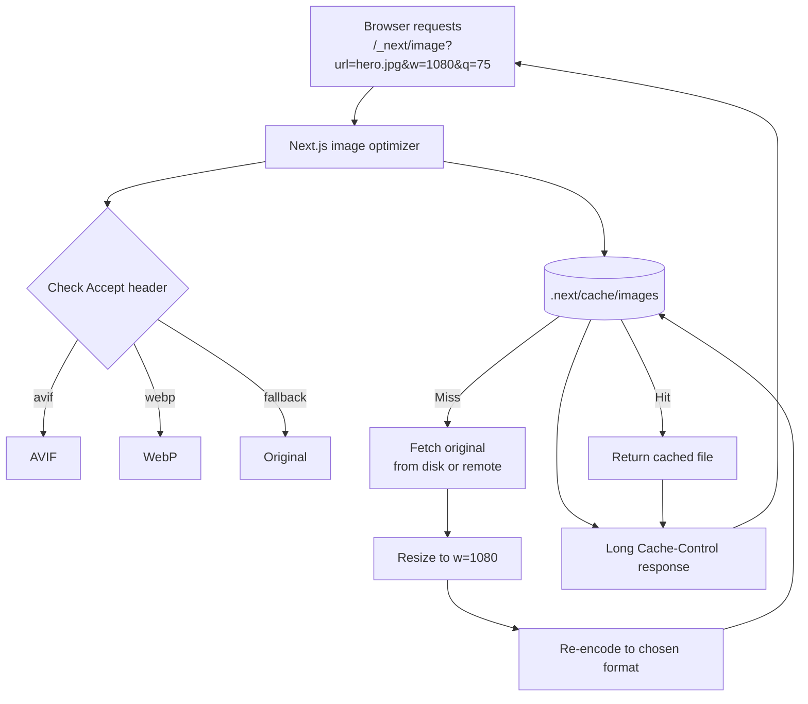
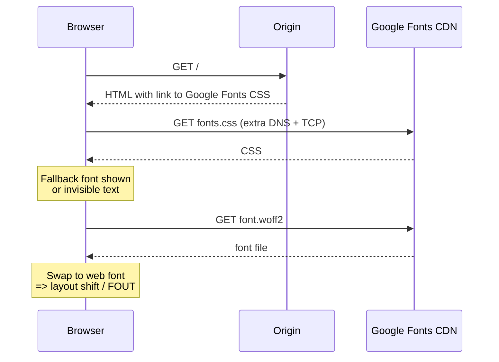
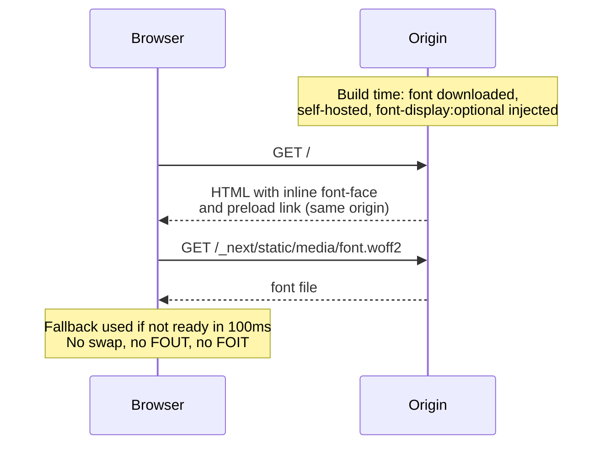
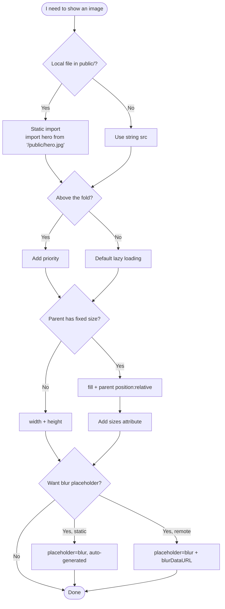

# 4.11 Images, Fonts, and Optimization

> Next.js ships two first-class optimisation primitives: `next/image` for responsive, lazy-loaded, format-negotiated images with built-in blur placeholders; and `next/font` for self-hosted, zero-layout-shift fonts that eliminate the FOUT and FOIT. Together they address the two biggest sources of poor Core Web Vitals (LCP and CLS) on the modern web. This note covers the `Image` component's required props, the `priority` flag for above-the-fold images, the `sizes` attribute, placeholder strategies, the static import pattern, configuring `remotePatterns` for external domains, the `next/font` module (Google fonts, local fonts, variable fonts), the `font-display: optional` choice that makes self-hosting safe, and the tradeoffs of self-hosting versus Google Fonts CDN.

## 4.11.1 Objective

By the end of this note you should be able to:

1. Explain why the `` tag is inadequate for modern responsive web design and why `next/image` exists.
2. Use the `Image` component with the required props (`src`, `alt`, `width`/`height` *or* `fill`).
3. Decide when to use `priority` (above-the-fold) versus default lazy loading (below-the-fold).
4. Write a correct `sizes` attribute for responsive layouts.
5. Use `placeholder="blur"` with `blurDataURL` for custom blur placeholders, and explain the static-import auto-blur shortcut.
6. Configure `remotePatterns` in `next.config.js` to allow images from external domains.
7. Use `next/font/google` (Inter, Roboto, etc.) and `next/font/local` for local font files.
8. Apply a CSS variable to a font for use across the app.
9. Explain why `next/font` eliminates FOUT and FOIT, and the role of `font-display: optional`.
10. Reason about the tradeoffs of self-hosted fonts versus Google Fonts CDN.

## 4.11.2 Background Knowledge

This note assumes you have read [[4.1 App Router Foundations]], [[4.3 Server and Client Components]] (`next/image` and `next/font` are usable from both, but the import is server-evaluated), and [[1.13 CSS Performance]] (the cost of layout shifts, paint, and the importance of Core Web Vitals). You should be familiar with the HTML `` tag, the `srcset` and `sizes` attributes, the picture element, the difference between raster formats (JPEG, PNG, WebP, AVIF), the `font-display` CSS property, and the FOUT (Flash of Unstyled Text) and FOIT (Flash of Invisible Text) problems. If you have never heard of LCP (Largest Contentful Paint) or CLS (Cumulative Layout Shift), pause and read [[3.11 Performance Optimization]] first.

## 4.11.3 Core Concepts

### 4.11.3.1 Why `next/image` Exists

The native `` tag has four problems in production:

1. **No responsive sizing.** You ship one file. Phones download the same 4K JPEG as desktops.
2. **No format negotiation.** You serve JPEG even to browsers that support WebP or AVIF (which are 30–50% smaller).
3. **No lazy loading by default** (modern browsers add `loading="lazy"` but the heuristic is conservative).
4. **No placeholder.** While the image loads, the area collapses or shows nothing, causing layout shift when it finally loads.

`next/image` solves all four:

- It generates multiple sizes at build/runtime and emits `srcset` so the browser picks the right one.
- It serves WebP or AVIF based on the `Accept` header.
- It defaults to `loading="lazy"` (unless you set `priority`).
- It can hold a placeholder box of the correct dimensions and even show a blurred preview while the real image loads.

```tsx
import Image from 'next/image';

export function Hero() {
  return (
    <Image
      src="/hero.jpg"
      alt="Mountain landscape"
      width={1600}
      height={900}
      priority
    />
  );
}
```

### 4.11.3.2 The Required Props

You must provide either:

- **`src`, `alt`, `width`, `height`** — for images with known dimensions (the image keeps its aspect ratio, the parent is whatever size you give it), OR
- **`src`, `alt`, `fill`** — the image fills its parent (parent must be `position: relative` or similar). You typically also pass `sizes`.

The `alt` prop is mandatory and must be a string. An empty string is allowed for decorative images, but omitting it is a TypeScript error.

### 4.11.3.3 The `priority` Prop

By default, `Image` adds `loading="lazy"`. For above-the-fold images (the LCP candidate), this is wrong — the browser would wait to even start loading them. Set `priority` to:

- Add `loading="eager"`.
- Add `fetchpriority="high"`.
- Preload the image in the document `<head>`.

```tsx
<Image src="/hero.jpg" alt="Hero" width={1600} height={900} priority />
```

> [!danger] Forgetting `priority` on the LCP Image
> A hero image without `priority` may load 2–3 seconds later than it should, blowing your LCP budget. Audit your LCP element with Chrome DevTools' Performance panel and ensure it has `priority`.

### 4.11.3.4 The `sizes` Attribute

When you use `fill`, or when you serve responsive images whose display size varies by viewport, you must tell the browser how wide the image will actually be displayed, so it can pick the right source from `srcset`. This is the `sizes` attribute — a CSS-style media-query list:

```tsx
<Image
  src="/hero.jpg"
  alt="Hero"
  fill
  sizes="(max-width: 768px) 100vw, 50vw"
/>
```

This says: "On viewports narrower than 768px, this image is full-width. Otherwise, it's half-width." The browser then picks the right source.

> [!warning] Without `sizes`, the Browser Guesses `100vw`
> If you omit `sizes`, the browser assumes the image is full viewport width and downloads a much larger file than necessary on desktop. Always provide `sizes` for `fill` images.

### 4.11.3.5 The `placeholder` Prop

`placeholder` accepts `'empty'` (default) or `'blur'`. With `'blur'`:

- For **static imports**, Next.js auto-generates a tiny blurred preview (`blurDataURL`) at build time.
- For **string `src`** (local or remote), you must provide `blurDataURL` yourself — a base64-encoded image (typically a tiny, blurred version of the image).

```tsx
import Image from 'next/image';
import hero from '@/public/hero.jpg';

export function Hero() {
  return <Image src={hero} alt="Hero" placeholder="blur" />;
}
```

For remote images, generate a blur placeholder with a library like `plaiceholder` or `blurhash`:

```tsx
<Image
  src={user.avatar}
  alt={user.name}
  width={64}
  height={64}
  placeholder="blur"
  blurDataURL="data:image/svg+xml;base64,PHN2ZyB4bWxucz0iaHR0cDovL3d3dy53My5vcmcvMjAwMC9zdmciIHdpZHRoPSI4IiBoZWlnaHQ9IjgiPjxyZWN0IHdpZHRoPSI4IiBoZWlnaHQ9IjgiIGZpbGw9IiNjY2MiLz48L3N2Zz4="
/>
```

### 4.11.3.6 The Static Import Pattern

For local images in the `public/` folder, you have two options:

1. **String `src`:** `<Image src="/hero.jpg" ... />` — you must provide `width`/`height` yourself.
2. **Static import:** `import hero from '@/public/hero.jpg'` then `<Image src={hero} ... />` — Next.js infers width, height, and (if `placeholder="blur"`) the blur placeholder automatically.

Static imports are the recommended pattern for local images because the dimensions and blur placeholder are guaranteed correct.

```tsx
import Image from 'next/image';
import hero from '@/public/hero.jpg';

export function Hero() {
  return (
    <Image
      src={hero}
      alt="Mountain landscape"
      priority
      placeholder="blur"
      sizes="(max-width: 768px) 100vw, 1200px"
    />
  );
}
```

### 4.11.3.7 Configuring `remotePatterns` for External Domains

To use `next/image` with images from external domains (a CDN, S3, an CMS), you must declare the allowed domains in `next.config.js`:

```js
// next.config.js
module.exports = {
  images: {
    remotePatterns: [
      { protocol: 'https', hostname: 'images.unsplash.com' },
      { protocol: 'https', hostname: '**.amazonaws.com' },
      { protocol: 'https', hostname: 'cdn.acme.com', pathname: '/**' },
    ],
    formats: ['image/avif', 'image/webp'],
  },
};
```

> [!warning] `domains` is Deprecated
> The old `images.domains` array is deprecated in favour of `images.remotePatterns`, which supports wildcards and pathname restrictions. Migrate before your next major version upgrade.

If the hostname is not on the list, `next/image` refuses to optimise the image and returns a 400 error.

### 4.11.3.8 The Image Optimization Pipeline

When the browser requests an optimised image, Next.js:

1. Receives the request at `/_next/image?url=...&w=...&q=...`.
2. Checks the `Accept` header for supported formats (AVIF first, then WebP, then original).
3. Fetches the original image (from disk or remote URL).
4. Resizes to the requested width.
5. Re-encodes in the best supported format.
6. Caches the result in the `.next/cache/images` directory (or on Vercel's Edge).
7. Serves with a long `Cache-Control` header.

Subsequent requests for the same image + size + format hit the cache and are instant.

### 4.11.3.9 Why `next/font` Exists

Loading fonts the traditional way (via Google Fonts CDN or `@font-face` with a font file) causes two well-known problems:

- **FOUT (Flash of Unstyled Text):** the browser shows a fallback font, then swaps to the web font when it arrives, causing a visible "jump".
- **FOIT (Flash of Invisible Text):** the browser shows nothing (invisible text) for up to 3 seconds while waiting for the font, hurting perceived performance.

Both produce layout shift (CLS) because the fallback font and the web font have different metrics.

`next/font` solves this by:

1. **Self-hosting the font at build time.** The font files are downloaded during `next build` and served from your own domain. No third-party request, no privacy issues, no DNS lookup.
2. **Injecting `font-display: optional`.** The browser uses the fallback font for a brief window; if the web font is not ready in time, it does not swap. There is *no* flash.
3. **Pre-loading and pre-connecting automatically.** The font is in the document `<head>` with the right `preload` and `font-display` rules.
4. **Zero layout shift.** Because the fallback font metrics are matched to the web font (via `size-adjust`), there is no visible jump.

### 4.11.3.10 Using `next/font/google`

```tsx
// app/layout.tsx
import { Inter } from 'next/font/google';

const inter = Inter({
  subsets: ['latin'],
  display: 'optional',
  variable: '--font-inter',
});

export default function RootLayout({ children }: { children: React.ReactNode }) {
  return (
    <html lang="en" className={inter.variable}>
      <body className={inter.className}>{children}</body>
    </html>
  );
}
```

Notes:

- `subsets` is required; pick only what you actually need to keep the font file small.
- `display: 'optional'` is the recommended default for production (no FOUT/FOIT).
- `variable` exposes the font as a CSS custom property so you can reference it from any stylesheet.

### 4.11.3.11 Using `next/font/local`

For font files you already have (a paid font, a brand font, a variable font):

```tsx
// app/layout.tsx
import localFont from 'next/font/local';

const myFont = localFont({
  src: './fonts/MyBrand.woff2',
  display: 'optional',
  variable: '--font-brand',
});

export default function RootLayout({ children }: { children: React.ReactNode }) {
  return (
    <html lang="en" className={myFont.variable}>
      <body>{children}</body>
    </html>
  );
}
```

For variable fonts, provide a single `src` and Next.js handles the axis ranges automatically.

For multi-weight non-variable fonts:

```tsx
const myFont = localFont({
  src: [
    { path: './fonts/MyBrand-Regular.woff2', weight: '400', style: 'normal' },
    { path: './fonts/MyBrand-Bold.woff2', weight: '700', style: 'normal' },
  ],
  display: 'optional',
});
```

### 4.11.3.12 The `font-display` Strategy

| Value | Behaviour | When to use |
|-------|-----------|-------------|
| `auto` | Browser default (usually `block`) | Avoid |
| `block` | FOIT — invisible text for up to 3s | Avoid |
| `swap` | FOUT — fallback then swap immediately | When the web font is essential for branding (e.g. logos) |
| `fallback` | Very short FOIT, then fallback, then swap if available soon | Compromise |
| `optional` | Very short FOIT, then fallback, swap *only* if already cached | Best for body text; no flash ever |

`next/font` defaults to `optional` for body text, which is what you almost always want.

### 4.11.3.13 Self-Hosting vs Google Fonts CDN

| Aspect | Google Fonts CDN | Self-hosted (`next/font`) |
|--------|------------------|----------------------------|
| Privacy | Sends user IP to Google | No third-party request |
| Performance | Extra DNS lookup, TCP connection | Same origin, no extra round-trip |
| Cookie consent | Often required (GDPR) | Not needed |
| Availability | Depends on Google's CDN | Under your control |
| File size | Same | Same (only subsets you need) |
| Build complexity | None | One import in layout |

Self-hosting with `next/font` is almost always the right choice for production apps. The only exception is when you need a font that is not in the Google Fonts catalogue and you don't have a license to host it yourself.

## 4.11.4 Detailed Walkthrough

### 4.11.4.1 A Full Hero Image with Priority and Sizes

```tsx
// app/components/hero.tsx
import Image from 'next/image';
import hero from '@/public/hero.jpg';

export function Hero() {
  return (
    <section className="relative h-[60vh] min-h-[400px] w-full">
      <Image
        src={hero}
        alt="Mountain landscape at sunrise"
        fill
        priority
        sizes="100vw"
        className="object-cover"
        placeholder="blur"
      />
      <div className="absolute inset-0 flex items-center justify-center">
        <h1 className="text-4xl md:text-6xl font-bold text-white">Acme</h1>
      </div>
    </section>
  );
}
```

Notes:
- `fill` requires the parent to have `position: relative` (here via `relative` Tailwind class).
- `sizes="100vw"` because the hero is full viewport width.
- `priority` because it is above the fold (LCP candidate).
- `placeholder="blur"` works automatically because the `src` is a static import.

### 4.11.4.2 A Responsive Card Grid

```tsx
// app/components/product-card.tsx
import Image from 'next/image';

export function ProductCard({ product }: { product: { image: string; name: string } }) {
  return (
    <div className="rounded-lg border overflow-hidden">
      <div className="relative aspect-[4/3]">
        <Image
          src={product.image}
          alt={product.name}
          fill
          sizes="(max-width: 768px) 100vw, (max-width: 1200px) 50vw, 33vw"
          className="object-cover"
        />
      </div>
      <div className="p-4">
        <h3 className="font-bold">{product.name}</h3>
      </div>
    </div>
  );
}
```

The `sizes` value reflects the actual layout: 1 column at mobile, 2 columns at tablet, 3 columns at desktop. The browser downloads the smallest file that fits.

### 4.11.4.3 Configuring Remote Patterns

```js
// next.config.js
/** @type {import('next').NextConfig} */
const nextConfig = {
  images: {
    formats: ['image/avif', 'image/webp'],
    remotePatterns: [
      { protocol: 'https', hostname: 'images.unsplash.com' },
      { protocol: 'https', hostname: 'cdn.acme.com', pathname: '/images/**' },
      { protocol: 'https', hostname: '**.s3.amazonaws.com' },
    ],
    deviceSizes: [640, 750, 828, 1080, 1200, 1920, 2048, 3840],
    imageSizes: [16, 32, 48, 64, 96, 128, 256, 384],
  },
};

module.exports = nextConfig;
```

### 4.11.4.4 A Complete Font Setup

```tsx
// app/layout.tsx
import { Inter, Roboto_Mono } from 'next/font/google';

const inter = Inter({
  subsets: ['latin'],
  display: 'optional',
  variable: '--font-sans',
});

const mono = Roboto_Mono({
  subsets: ['latin'],
  display: 'swap', // monospace fallback metrics differ less; swap is fine
  variable: '--font-mono',
});

export default function RootLayout({ children }: { children: React.ReactNode }) {
  return (
    <html lang="en" className={`${inter.variable} ${mono.variable}`}>
      <body className="font-sans">
        {children}
      </body>
    </html>
  );
}
```

```css
/* app/globals.css */
@theme {
  --font-sans: var(--font-sans), system-ui, sans-serif;
  --font-mono: var(--font-mono), ui-monospace, monospace;
}

code, pre {
  font-family: var(--font-mono);
}
```

### 4.11.4.5 A Local Font Setup

```tsx
// app/layout.tsx
import localFont from 'next/font/local';

const brand = localFont({
  src: './fonts/BrandVariable.woff2',
  display: 'optional',
  variable: '--font-brand',
  weight: '100 900', // variable font weight range
});

export default function RootLayout({ children }: { children: React.ReactNode }) {
  return (
    <html lang="en" className={brand.variable}>
      <body>{children}</body>
    </html>
  );
}
```

### 4.11.4.6 Avatar with Blur Placeholder

```tsx
// app/components/avatar.tsx
import Image from 'next/image';

export function Avatar({ user }: { user: { image: string; name: string } }) {
  return (
    <Image
      src={user.image}
      alt={user.name}
      width={48}
      height={48}
      className="rounded-full object-cover"
      placeholder="blur"
      blurDataURL="data:image/svg+xml;base64,..." // tiny blurred SVG
    />
  );
}
```

For dynamic remote images, generate `blurDataURL` server-side with `plaiceholder` or use a constant SVG placeholder for all avatars.

## 4.11.5 Practical Examples

### 4.11.5.1 Background Image Replacement

Instead of CSS `background-image: url(...)` (which the browser cannot optimise), use a `fill` image:

```tsx
export function CtaBanner() {
  return (
    <section className="relative h-96 flex items-center justify-center">
      <Image
        src="/cta-bg.jpg"
        alt=""
        fill
        sizes="100vw"
        className="object-cover"
        priority
      />
      <div className="relative z-10 text-white text-center">
        <h2 className="text-4xl font-bold">Get started</h2>
        <button className="mt-4 px-6 py-3 bg-white text-black rounded">Sign up</button>
      </div>
    </section>
  );
}
```

Note `alt=""` for decorative images — they are part of the design, not content.

### 4.11.5.2 A Multi-Source Logo Strip

```tsx
const logos = [
  { src: 'https://cdn.acme.com/logos/google.svg', alt: 'Google' },
  { src: 'https://cdn.acme.com/logos/microsoft.svg', alt: 'Microsoft' },
];

export function LogoStrip() {
  return (
    <div className="flex gap-8">
      {logos.map((logo) => (
        <Image key={logo.src} src={logo.src} alt={logo.alt} width={120} height={40} />
      ))}
    </div>
  );
}
```

### 4.11.5.3 A Gallery with Aspect Ratio

```tsx
export function Gallery({ images }: { images: string[] }) {
  return (
    <div className="grid grid-cols-2 md:grid-cols-3 gap-4">
      {images.map((src, i) => (
        <div key={src} className="relative aspect-square">
          <Image
            src={src}
            alt={`Photo ${i + 1}`}
            fill
            sizes="(max-width: 768px) 50vw, 33vw"
            className="object-cover rounded"
          />
        </div>
      ))}
    </div>
  );
}
```

### 4.11.5.4 Font with Conditional Subset

```tsx
import { Inter } from 'next/font/google';

const inter = Inter({
  subsets: ['latin', 'latin-ext'], // latin-ext for European accents
  display: 'optional',
  variable: '--font-inter',
});
```

## 4.11.6 Mermaid Diagrams

### 4.11.6.1 The Image Optimization Pipeline



### 4.11.6.2 Font Loading Without `next/font`



### 4.11.6.3 Font Loading With `next/font`



### 4.11.6.4 Image Component Decision Tree



## 4.11.7 Common Mistakes

1. **Forgetting `priority` on the LCP image.** The hero image lazy-loads, doubling your LCP time. Always mark above-the-fold images as `priority`.

2. **Using `fill` without `position: relative` on the parent.** The image escapes its container and overlays the page. Always style the parent with `position: relative` (or `absolute`).

3. **Omitting `sizes` on `fill` images.** The browser downloads a full-viewport-size image even when the image is rendered at 200px wide. Always provide `sizes` matching the actual layout.

4. **Adding a hostname to `remotePatterns` that does not match.** `next/image` returns a 400 error. Double-check the protocol and the exact hostname (wildcards supported only via `**`).

5. **Setting `placeholder="blur"` on a remote image without `blurDataURL`.** Next.js cannot auto-generate a blur for a string URL — it throws or renders nothing.

6. **Loading fonts via `<link href="https://fonts.googleapis.com/...">`.** This bypasses `next/font` entirely, introduces a third-party request, and produces FOUT/FOIT. Always use `next/font/google`.

7. **Forgetting to apply the font's CSS variable to `<html>` or `<body>`.** The font is imported but never used because the className is missing.

8. **Importing a Google font that is not in the catalogue.** `next/font/google` only supports fonts listed in Google Fonts. For others, use `next/font/local`.

9. **Forgetting `subsets`.** Next.js requires you to opt into specific subsets; without them, the build errors out.

10. **Using `` for decorative images with empty `alt`.** Use `next/image` with `alt=""` instead — same accessibility semantics, but you get optimisation for free.

## 4.11.8 Best Practices

1. **Always use `next/image`.** Even for tiny icons; the optimisation overhead is minimal and the format negotiation helps.

2. **Static-import local images.** You get correct dimensions and free blur placeholders.

3. **Audit your LCP image.** Open Chrome DevTools  -->  Performance  -->  record a page load. The LCP element should be an image with `priority` set.

4. **Provide `sizes` for every responsive image.** It is the single biggest lever for image payload size.

5. **Configure `formats: ['image/avif', 'image/webp']`** in `next.config.js`. AVIF is 20% smaller than WebP on photographic content.

6. **Use `next/font` for every font.** Self-hosting eliminates privacy issues, layout shift, and third-party DNS lookups.

7. **Default to `display: 'optional'` for body text.** It guarantees no flash. Use `'swap'` only for branding/display fonts where the font is the brand.

8. **Expose fonts as CSS variables.** Apply the `variable` to `<html>` and reference it from Tailwind theme. This keeps your font choice out of JSX.

9. **Limit `subsets` to what you need.** Every extra subset adds bytes. `latin` is enough for most English-language apps; add `latin-ext` only if you have accented characters.

10. **Pre-warm remote image domains.** If you know you will request images from a specific host, add it to `remotePatterns` even before you ship the code, so it is not forgotten at deploy time.

## 4.11.9 Mini Exercises

### Exercise 1: A Hero Image with Priority and Blur

**Goal:** A hero image, full viewport width, priority-loaded, with a blur placeholder.

**Worked solution:**

```tsx
// app/components/hero.tsx
import Image from 'next/image';
import hero from '@/public/hero.jpg';

export function Hero() {
  return (
    <section className="relative h-[70vh]">
      <Image
        src={hero}
        alt="Hero"
        fill
        priority
        sizes="100vw"
        placeholder="blur"
        className="object-cover"
      />
    </section>
  );
}
```

Add a `hero.jpg` to `/public/hero.jpg` or `app/public/hero.jpg` so the static import resolves.

### Exercise 2: A Responsive Card Grid with Correct `sizes`

**Goal:** A grid of 1 column on mobile, 2 on tablet, 3 on desktop, each cell a remote image.

**Worked solution:**

```js
// next.config.js
module.exports = {
  images: {
    remotePatterns: [
      { protocol: 'https', hostname: 'images.unsplash.com' },
    ],
  },
};
```

```tsx
// app/components/gallery.tsx
import Image from 'next/image';

const items = [
  { id: 1, src: 'https://images.unsplash.com/photo-1', alt: 'One' },
  { id: 2, src: 'https://images.unsplash.com/photo-2', alt: 'Two' },
  { id: 3, src: 'https://images.unsplash.com/photo-3', alt: 'Three' },
  { id: 4, src: 'https://images.unsplash.com/photo-4', alt: 'Four' },
  { id: 5, src: 'https://images.unsplash.com/photo-5', alt: 'Five' },
  { id: 6, src: 'https://images.unsplash.com/photo-6', alt: 'Six' },
];

export function Gallery() {
  return (
    <div className="grid grid-cols-1 md:grid-cols-2 lg:grid-cols-3 gap-4">
      {items.map((item) => (
        <div key={item.id} className="relative aspect-square">
          <Image
            src={item.src}
            alt={item.alt}
            fill
            sizes="(max-width: 768px) 100vw, (max-width: 1024px) 50vw, 33vw"
            className="object-cover rounded"
          />
        </div>
      ))}
    </div>
  );
}
```

### Exercise 3: A Complete Font Setup with CSS Variables

**Goal:** Use Inter as the body font and Roboto Mono as the code font, exposing both as CSS variables.

**Worked solution:**

```tsx
// app/layout.tsx
import { Inter, Roboto_Mono } from 'next/font/google';

const inter = Inter({
  subsets: ['latin'],
  display: 'optional',
  variable: '--font-inter',
});

const mono = Roboto_Mono({
  subsets: ['latin'],
  display: 'swap',
  variable: '--font-mono',
});

export default function RootLayout({ children }: { children: React.ReactNode }) {
  return (
    <html lang="en" className={`${inter.variable} ${mono.variable}`}>
      <body className="font-sans">{children}</body>
    </html>
  );
}
```

```css
/* app/globals.css */
@theme {
  --font-sans: var(--font-inter), system-ui, sans-serif;
  --font-mono: var(--font-mono), ui-monospace, monospace;
}

body { font-family: var(--font-sans); }
code, pre { font-family: var(--font-mono); }
```

### Exercise 4: A Local Brand Font

**Goal:** Use a local `.woff2` file as the brand font, exposed as `--font-brand`, applied to the `<h1>` elements only.

**Worked solution:**

```tsx
// app/layout.tsx
import localFont from 'next/font/local';

const brand = localFont({
  src: './fonts/BrandDisplay.woff2',
  display: 'swap',
  variable: '--font-brand',
});

export default function RootLayout({ children }: { children: React.ReactNode }) {
  return (
    <html lang="en" className={brand.variable}>
      <body>{children}</body>
    </html>
  );
}
```

```css
/* app/globals.css */
@theme {
  --font-brand: var(--font-brand), Georgia, serif;
}
h1 { font-family: var(--font-brand); }
```

### Exercise 5: Diagnose a LCP Issue

**Goal:** A page has LCP of 4 seconds. The hero image is the LCP element. Identify the likely cause and fix it.

**Diagnosis questions:**

1. Is the hero image using `next/image`?
2. Is `priority` set?
3. Is `sizes` correct?
4. Is the original file massive (4K+ JPEG)?

**Likely cause:** `priority` is missing, so the browser defers loading until after first paint.

**Fix:**

```tsx
<Image src={hero} alt="Hero" fill priority sizes="100vw" />
```

After the fix, LCP should drop to ~1 second (assuming the image is reasonably sized).

## 4.11.10 Summary

`next/image` and `next/font` are the two biggest Core Web Vitals levers in a Next.js app. `next/image` solves the responsive, format, lazy-loading, and placeholder problems that plague native `` tags; the key is to use static imports, set `priority` for above-the-fold images, and always provide `sizes`. `next/font` self-hosts fonts at build time with `font-display: optional`, eliminating FOUT and FOIT entirely; expose fonts as CSS variables and apply them at the `<html>` level for a clean, global setup. Self-hosting beats Google Fonts CDN on every axis (privacy, performance, control). Get these two primitives right and your Lighthouse score will reflect it.

## 4.11.11 Related Notes

- [[4.1 App Router Foundations]] — where images and fonts are wired into the layout.
- [[4.3 Server and Client Components]] — `next/image` and `next/font` work in both.
- [[4.10 Metadata and SEO]] — `ImageResponse` (OG images) builds on the same image pipeline.
- [[4.13 Project Organization and Performance]] — performance is a chapter-wide concern.
- [[3.11 Performance Optimization]] — React-level performance primitives.
- [[1.13 CSS Performance]] — layout shift and paint costs.
- [[2.7 Tailwind with React and Next.js]] — using CSS variables for fonts in a Tailwind theme.
