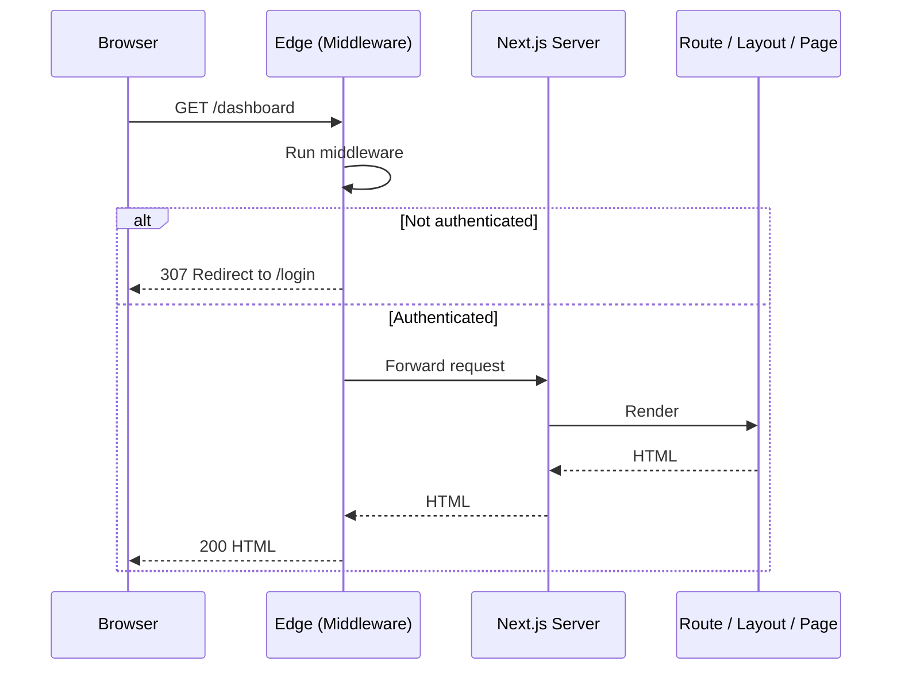
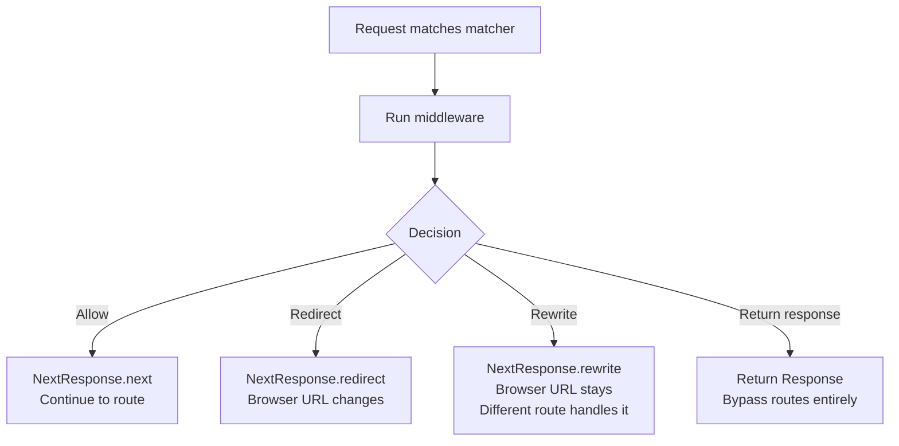
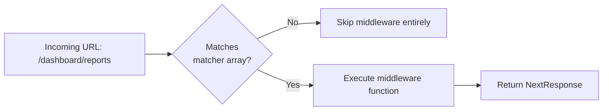

# 4.12 Middleware (Practical Usage Only)

> Middleware is code that runs on the Edge runtime *before* a request reaches your route. It is the first thing executed after the request hits your domain, and it can decide to let the request through (`NextResponse.next()`), redirect (`NextResponse.redirect()`), or rewrite (`NextResponse.rewrite()`). It is defined in a `middleware.ts` file at the root of the project (or inside `src/`) and is constrained to the Edge runtime, which means no Node.js APIs. This note takes a deliberately *practical* angle: what middleware is good for, what it is bad for, the Matcher config, the `NextRequest` and `NextResponse` objects, the five most common use cases (auth, redirects, A/B testing, locale detection, logging), and what to do instead when middleware is the wrong tool.

## 4.12.1 Objective

By the end of this note you should be able to:

1. Create a `middleware.ts` file in the right location and explain what triggers it.
2. Configure the `matcher` to control which routes middleware runs on.
3. Use `NextResponse.next()`, `NextResponse.redirect()`, and `NextResponse.rewrite()` correctly.
4. Read and write cookies on the request via the `NextRequest` API.
5. Implement five practical patterns: auth gating, conditional redirects, A/B testing, locale detection, and request logging.
6. Explain what middleware *cannot* do (no `fs`, no Node APIs, no DB) and what to do instead.
7. Articulate why middleware must be lightweight (it runs on every matching request).
8. Decide when an alternative (layouts, server components, route handlers) is better than middleware.

## 4.12.2 Background Knowledge

This note assumes you have read [[4.1 App Router Foundations]] (route segments), [[4.3 Server and Client Components]] (the server boundary), [[4.8 Route Handlers]] (the Edge vs Node runtime distinction), and [[4.2 Routing, Layouts, and Templates]] (where you might instead put the same logic). You should be comfortable with HTTP redirects (301, 302, 307, 308), cookies, the `Set-Cookie` header, and the difference between a *redirect* (the browser URL changes) and a *rewrite* (the browser URL stays the same but a different route handles it). Familiarity with the Edge runtime concept (a lightweight V8 isolate with Web APIs only) helps but is not required — the constraints are spelled out below.

## 4.12.3 Core Concepts

### 4.12.3.1 What Middleware Is

Middleware is a function exported from `middleware.ts` that runs before any route, layout, or page. It runs on the Edge runtime, geographically close to the user, on every request whose URL matches the `matcher` config. It receives a `NextRequest` and must return either a `NextResponse` or a regular `Response`. Based on what it returns, the framework either continues processing the request, redirects the user, or transparently rewrites the request to a different URL.

```ts
// middleware.ts
import { NextResponse } from 'next/server';
import type { NextRequest } from 'next/server';

export function middleware(request: NextRequest) {
  // runs on every request that matches the matcher
  console.log('Visited:', request.nextUrl.pathname);
  return NextResponse.next();
}

export const config = {
  matcher: ['/((?!_next/static|_next/image|favicon.ico).*)'],
};
```

### 4.12.3.2 Where `middleware.ts` Lives

The file must be named `middleware.ts` (or `middleware.js`) and placed:

- At the root of the project (next to `package.json`), OR
- Inside the `src/` directory if you use one (next to `app/`).

It cannot live inside a route segment. There is exactly one middleware file per app.

### 4.12.3.3 The `matcher` Config

By default, middleware runs on *every* request — including static assets, images, and Next internals. That is almost never what you want. The `matcher` config restricts it to specific paths.

```ts
export const config = {
  matcher: ['/dashboard/:path*', '/admin/:path*'],
};
```

Path patterns follow `path-to-regexp` syntax:

- `:path*` matches zero or more segments.
- `:path+` matches one or more segments.
- `:path` matches exactly one segment.

You can also use a function-based matcher (since Next.js 13.5+) for more complex logic, but the array form is simpler and almost always sufficient.

A common negative-lookahead pattern excludes static assets and image optimisation:

```ts
export const config = {
  matcher: ['/((?!api|_next/static|_next/image|favicon.ico).*)'],
};
```

This runs middleware on every URL except those starting with `api`, `_next/static`, `_next/image`, or `favicon.ico`.

> [!danger] Forgetting the Matcher
> Without a `matcher`, middleware runs on every request, including asset requests. Each image request now goes through your middleware. On a media-heavy page this can add hundreds of milliseconds of latency and cost (on Edge-billed platforms).

### 4.12.3.4 The `NextRequest` Object

`NextRequest` extends the standard Web `Request` with Next.js-specific helpers:

- `request.nextUrl` — a `URL` with the parsed pathname and search params.
- `request.cookies` — a `RequestCookies` object; `get`, `getAll`, `has`, `delete`.
- `request.headers` — standard `Headers`.
- `request.geo` — geolocation info (Vercel-specific; may be undefined elsewhere).
- `request.ip` — the client IP (Vercel-specific).
- `request.ua` — the parsed user agent (deprecated in favour of `headers.get('user-agent')`).

### 4.12.3.5 The `NextResponse` Helpers in Middleware

| Method | Effect |
|--------|--------|
| `NextResponse.next()` | Continue to the next handler (the route). |
| `NextResponse.next({ headers, request })` | Continue but modify headers or the request (e.g. add a header visible downstream). |
| `NextResponse.redirect(url, status?)` | Issue an HTTP redirect. Default 307 (preserves method). |
| `NextResponse.rewrite(url)` | Internally route to a different URL without changing the browser URL. |
| `NextResponse.json(...)` | Return JSON directly (rarely used in middleware). |

```ts
export function middleware(request: NextRequest) {
  if (request.nextUrl.pathname === '/old') {
    return NextResponse.redirect(new URL('/new', request.url));
  }
  if (request.nextUrl.pathname === '/secret') {
    return NextResponse.rewrite(new URL('/login', request.url));
  }
  const response = NextResponse.next();
  response.headers.set('x-request-id', crypto.randomUUID());
  return response;
}
```

### 4.12.3.6 Setting Cookies on the Response

To set a cookie in middleware, you set it on the *response* you return:

```ts
const response = NextResponse.next();
response.cookies.set('ab-variant', 'B', { httpOnly: true, sameSite: 'lax' });
return response;
```

To *modify* the request's cookie before it reaches the route (rare), use `request.cookies.set(...)` and then pass the modified request to `NextResponse.next({ request })`.

### 4.12.3.7 The Edge Runtime Constraint

Middleware runs on the Edge runtime. You cannot:

- Import `fs`, `crypto` (the Node version), `child_process`, `path`, etc.
- Use most npm packages that depend on Node built-ins (e.g. `jsonwebtoken`, `mongoose`, `bcrypt`, `prisma`'s binary engine).
- Open raw TCP sockets.
- Run long computations (CPU time is limited, typically 30s on Vercel but lower on other platforms).

You *can*:

- Use the Web Crypto API (`crypto.subtle`).
- Use `fetch`.
- Use `jose` for JWT (Edge-compatible).
- Use `@upstash/redis` (HTTP-based, Edge-compatible).
- Use `Request`, `Response`, `Headers`, `URL`, `TextEncoder`, `TextDecoder`, `ReadableStream`, etc.

If you find yourself needing a Node API, the work probably belongs in a Route Handler with `runtime = 'nodejs'`, in a Server Component, or in a Server Action — not in middleware.

### 4.12.3.8 Why Middleware Must Be Lightweight

Middleware runs on *every* matching request, including first-party navigations, asset requests (if not excluded), and API calls. A 50ms middleware adds 50ms to every page load. Worse, on platforms that bill by invocation, it adds cost. Aim for under 5ms of work in middleware: parse a cookie, check a header, branch, return. Anything heavier (DB queries, JWT verification with RSA, image processing) should happen later in the request lifecycle.

### 4.12.3.9 The Five Practical Use Cases

1. **Auth gating** — check a session cookie; redirect to `/login` if absent.
2. **Conditional redirects** — old URLs to new URLs, marketing paths, vanity URLs.
3. **A/B testing** — assign a variant cookie and rewrite the route to a different segment.
4. **Locale detection** — read the `Accept-Language` header or a cookie, redirect to `/en/...` or `/fr/...`.
5. **Request logging** — emit a structured log per request (often combined with setting a request ID).

### 4.12.3.10 What You Cannot Do (and What to Do Instead)

| You want to… | Don't put it in middleware; use… |
|--------------|----------------------------------|
| Query the database | A Server Component or Route Handler with `runtime = 'nodejs'` |
| Verify an RSA-signed JWT | A Route Handler (Node runtime) or use `jose` (Edge-compatible) |
| Read a file from disk | A Server Component with `fs/promises` |
| Send an email | A Route Handler or Server Action |
| Run a long computation | A Route Handler (Node) or a background job |
| Access request body for a POST | A Route Handler (middleware cannot read the body cleanly) |

### 4.12.3.11 The Alternative: Doing the Same Work in Layouts or Server Components

Many things people reach for middleware to do are better placed in a Server Component. For example, an auth check could be:

```tsx
// app/dashboard/layout.tsx
import { redirect } from 'next/navigation';
import { cookies } from 'next/headers';

export default async function DashboardLayout({ children }: { children: React.ReactNode }) {
  const session = (await cookies()).get('session')?.value;
  if (!session) redirect('/login');
  return <div>{children}</div>;
}
```

This works, has access to the database, and runs only on the dashboard route. The tradeoff: it runs *after* middleware, so it cannot redirect asset requests, and it does not run for non-HTML responses. Use middleware when you need to gate *all* URLs (including APIs) or when you need to redirect before any layout executes; use a Server Component check when the gate is for a specific subtree.

## 4.12.4 Detailed Walkthrough

### 4.12.4.1 Auth Gating with a Session Cookie

```ts
// middleware.ts
import { NextResponse } from 'next/server';
import type { NextRequest } from 'next/server';
import { jwtVerify } from 'jose';

const SECRET = new TextEncoder().encode(process.env.JWT_SECRET!);

export async function middleware(request: NextRequest) {
  const token = request.cookies.get('session')?.value;
  if (!token) {
    const url = new URL('/login', request.url);
    url.searchParams.set('from', request.nextUrl.pathname);
    return NextResponse.redirect(url);
  }

  try {
    await jwtVerify(token, SECRET);
    return NextResponse.next();
  } catch {
    const url = new URL('/login', request.url);
    url.searchParams.set('from', request.nextUrl.pathname);
    const res = NextResponse.redirect(url);
    res.cookies.delete('session');
    return res;
  }
}

export const config = {
  matcher: ['/dashboard/:path*', '/admin/:path*', '/settings/:path*'],
};
```

### 4.12.4.2 Conditional Redirects (Vanity URLs)

```ts
// middleware.ts
import { NextResponse } from 'next/server';
import type { NextRequest } from 'next/server';

const redirects: Record<string, string> = {
  '/twitter': 'https://twitter.com/acme',
  '/github': 'https://github.com/acme',
  '/docs/v1': '/docs',
};

export function middleware(request: NextRequest) {
  const target = redirects[request.nextUrl.pathname];
  if (target) {
    return NextResponse.redirect(new URL(target, request.url), 308); // permanent
  }
  return NextResponse.next();
}

export const config = {
  matcher: ['/twitter', '/github', '/docs/v1'],
};
```

Using `308` (permanent redirect) tells the browser to cache the redirect — subsequent visits skip the round-trip.

### 4.12.4.3 A/B Testing with a Variant Cookie and Rewrite

```ts
// middleware.ts
import { NextResponse } from 'next/server';
import type { NextRequest } from 'next/server';

const EXPERIMENTS = ['/pricing']; // paths under experiment

export function middleware(request: NextRequest) {
  if (!EXPERIMENTS.includes(request.nextUrl.pathname)) {
    return NextResponse.next();
  }

  let variant = request.cookies.get('pricing-variant')?.value;
  if (!variant) {
    variant = Math.random() < 0.5 ? 'A' : 'B';
    const res = NextResponse.rewrite(
      new URL(`/pricing-${variant.toLowerCase()}`, request.url),
    );
    res.cookies.set('pricing-variant', variant, { httpOnly: true, maxAge: 60 * 60 * 24 * 30 });
    return res;
  }

  return NextResponse.rewrite(
    new URL(`/pricing-${variant.toLowerCase()}`, request.url),
  );
}

export const config = {
  matcher: ['/pricing'],
};
```

Now `/pricing` serves the page at `app/pricing-a/page.tsx` or `app/pricing-b/page.tsx` depending on the cookie. The browser URL stays `/pricing`.

### 4.12.4.4 Locale Detection

```ts
// middleware.ts
import { NextResponse } from 'next/server';
import type { NextRequest } from 'next/server';

const locales = ['en', 'fr', 'es'];

export function middleware(request: NextRequest) {
  const { pathname } = request.nextUrl;

  // Already prefixed with a locale?
  if (locales.some((l) => pathname.startsWith(`/${l}/`) || pathname === `/${l}`)) {
    return NextResponse.next();
  }

  // Prefer cookie, then Accept-Language, then default
  const cookieLocale = request.cookies.get('locale')?.value;
  const acceptLang = request.headers.get('accept-language')?.split(',')[0]?.split('-')[0];
  const locale = cookieLocale && locales.includes(cookieLocale)
    ? cookieLocale
    : acceptLang && locales.includes(acceptLang)
      ? acceptLang
      : 'en';

  const url = request.nextUrl.clone();
  url.pathname = `/${locale}${pathname}`;
  return NextResponse.redirect(url);
}

export const config = {
  matcher: ['/((?!api|_next/static|_next/image|favicon.ico).*)'],
};
```

### 4.12.4.5 Request Logging with a Request ID

```ts
// middleware.ts
import { NextResponse } from 'next/server';
import type { NextRequest } from 'next/server';

export function middleware(request: NextRequest) {
  const requestId = crypto.randomUUID();
  const start = Date.now();

  const response = NextResponse.next({
    request: {
      headers: new Headers(request.headers),
    },
  });
  response.headers.set('x-request-id', requestId);

  response.headers.set('Server-Timing', `middleware;dur=${Date.now() - start}`);
  console.log(JSON.stringify({
    requestId,
    method: request.method,
    path: request.nextUrl.pathname,
    ua: request.headers.get('user-agent'),
    country: request.geo?.country,
  }));
  return response;
}

export const config = {
  matcher: ['/((?!_next/static|_next/image|favicon.ico).*)'],
};
```

### 4.12.4.6 Bot Detection

```ts
// middleware.ts
import { NextResponse } from 'next/server';
import type { NextRequest } from 'next/server';

const BOT_RE = /Googlebot|Bingbot|Slurp|DuckDuckBot|Baiduspider|YandexBot/i;

export function middleware(request: NextRequest) {
  const ua = request.headers.get('user-agent') ?? '';
  if (BOT_RE.test(ua)) {
    // e.g. serve a stripped-down version for crawlers, or just tag the request
    const response = NextResponse.next();
    response.headers.set('x-is-bot', 'true');
    return response;
  }
  return NextResponse.next();
}

export const config = {
  matcher: ['/((?!_next/static|_next/image|favicon.ico).*)'],
};
```

## 4.12.5 Practical Examples

### 4.12.5.1 Combined Auth + Locale Middleware

```ts
// middleware.ts
import { NextResponse } from 'next/server';
import type { NextRequest } from 'next/server';

const locales = ['en', 'fr'];
const protectedPaths = ['/dashboard', '/admin', '/settings'];

export function middleware(request: NextRequest) {
  const { pathname } = request.nextUrl;

  // 1. Locale handling
  const hasLocale = locales.some((l) => pathname === `/${l}` || pathname.startsWith(`/${l}/`));
  if (!hasLocale) {
    const url = request.nextUrl.clone();
    url.pathname = `/en${pathname}`;
    return NextResponse.redirect(url);
  }

  // 2. Auth handling
  const isProtected = protectedPaths.some((p) => pathname.includes(p));
  if (isProtected) {
    const token = request.cookies.get('session')?.value;
    if (!token) {
      const url = new URL('/en/login', request.url);
      url.searchParams.set('from', pathname);
      return NextResponse.redirect(url);
    }
  }

  return NextResponse.next();
}

export const config = {
  matcher: ['/((?!api|_next/static|_next/image|favicon.ico|.*\\..*).*)'],
};
```

### 4.12.5.2 Maintenance Mode Switch

```ts
// middleware.ts
import { NextResponse } from 'next/server';
import type { NextRequest } from 'next/server';

export function middleware(request: NextRequest) {
  if (process.env.MAINTENANCE_MODE !== 'true') {
    return NextResponse.next();
  }
  if (request.nextUrl.pathname === '/maintenance') {
    return NextResponse.next();
  }
  return NextResponse.rewrite(new URL('/maintenance', request.url));
}

export const config = {
  matcher: ['/((?!_next/static|_next/image|favicon.ico).*)'],
};
```

### 4.12.5.3 Adding a Custom Header to All Responses

```ts
export function middleware() {
  const response = NextResponse.next();
  response.headers.set('X-Frame-Options', 'DENY');
  response.headers.set('X-Content-Type-Options', 'nosniff');
  response.headers.set('Referrer-Policy', 'strict-origin-when-cross-origin');
  return response;
}

export const config = {
  matcher: ['/((?!_next/static|_next/image|favicon.ico).*)'],
};
```

> [!tip] For Production Security Headers, Use `next.config.js` Instead
> The `headers()` function in `next.config.js` is a better fit for static security headers — it does not run code per request. Middleware is for *dynamic* per-request logic.

## 4.12.6 Mermaid Diagrams

### 4.12.6.1 Middleware in the Request Flow



### 4.12.6.2 The Three Middleware Outcomes



### 4.12.6.3 Matcher Evaluation



## 4.12.7 Common Mistakes

1. **Forgetting the `matcher`.** Middleware runs on every request, including images and static files. Page loads balloon in latency.

2. **Putting heavy DB work in middleware.** The Edge runtime cannot reach most databases, and even Edge-compatible DBs add latency to every request. Move it to a layout or Route Handler.

3. **Using Node-only libraries.** `jsonwebtoken`, `mongoose`, `bcrypt` all import Node built-ins. Either swap to Edge-compatible alternatives (`jose`, `bcryptjs`, Prisma's Edge driver) or move the logic out of middleware.

4. **Redirecting to an absolute URL without checking the host.** `NextResponse.redirect('https://attacker.com')` is a textbook open-redirect vulnerability. Always validate the redirect target or build it from `request.url`.

5. **Returning `undefined` from middleware.** The function must return a `NextResponse` or `Response`. Returning `undefined` (e.g. forgetting the `return` in an `if` branch) produces a runtime error.

6. **Setting a cookie on `request.cookies` and expecting the route to see it.** The route sees the original cookie jar unless you also pass the modified request to `NextResponse.next({ request })`.

7. **Trying to read the request body.** Middleware is designed for header/cookie/path inspection. Reading `request.json()` or `request.text()` consumes the stream and breaks downstream handlers. Move body-reading to a Route Handler.

8. **Confusing `redirect` with `rewrite`.** `redirect` changes the URL bar; `rewrite` does not. Mixing them up produces very confusing UX.

9. **Adding CORS headers in middleware for static assets.** Static assets bypass middleware (via the matcher); use `next.config.js` `headers()` instead.

10. **Using `302` for permanent redirects.** `302` is "found" and is treated as temporary; search engines do not propagate link equity. Use `308` for permanent redirects that preserve method.

## 4.12.8 Best Practices

1. **Always define a `matcher`.** Default to the negative-lookahead pattern that excludes `_next/static`, `_next/image`, and `favicon.ico`.

2. **Keep middleware under 5ms.** Parse cookies, branch, return. Anything heavier belongs downstream.

3. **Use Edge-compatible libraries.** `jose` for JWT, `@upstash/redis` for KV, `@upstash/ratelimit` for rate limiting. The Next.js docs maintain a list.

4. **Validate redirect targets.** If a redirect target comes from user input (query string, cookie), validate it against an allowlist or build it from `request.url` to prevent open-redirect attacks.

5. **Use 308 for permanent redirects.** It preserves the method (so POST stays POST) and is cached by the browser.

6. **Use cookies for sticky experiments.** Once you assign a variant, set a cookie so the user sees the same variant on every visit.

7. **Move static security headers to `next.config.js`.** They do not need per-request logic.

8. **Move auth checks to layouts when possible.** Layouts run only for HTML routes, can access the DB, and compose with Suspense naturally. Reserve middleware for when you need to gate *everything* (APIs, static routes) or redirect before any layout runs.

9. **Log middleware execution.** A simple `console.log` with the path, status, and duration is invaluable during incidents.

10. **Test middleware in isolation.** A bug in middleware takes the whole site down. Run it against a staging environment with realistic traffic before deploying to production.

## 4.12.9 Mini Exercises

### Exercise 1: Build a Simple Auth Gate

**Goal:** Redirect any unauthenticated request to `/dashboard/*` to `/login?from=<original-path>`.

**Worked solution:**

```ts
// middleware.ts
import { NextResponse } from 'next/server';
import type { NextRequest } from 'next/server';

export function middleware(request: NextRequest) {
  const session = request.cookies.get('session')?.value;
  if (!session) {
    const url = new URL('/login', request.url);
    url.searchParams.set('from', request.nextUrl.pathname);
    return NextResponse.redirect(url);
  }
  return NextResponse.next();
}

export const config = {
  matcher: ['/dashboard/:path*'],
};
```

### Exercise 2: Build a Vanity URL Redirect Map

**Goal:** Map `/twitter`  -->  `https://twitter.com/acme`, `/github`  -->  `https://github.com/acme`, with `308` (permanent).

**Worked solution:**

```ts
// middleware.ts
import { NextResponse } from 'next/server';
import type { NextRequest } from 'next/server';

const MAP: Record<string, string> = {
  '/twitter': 'https://twitter.com/acme',
  '/github': 'https://github.com/acme',
};

export function middleware(request: NextRequest) {
  const target = MAP[request.nextUrl.pathname];
  if (target) return NextResponse.redirect(target, 308);
  return NextResponse.next();
}

export const config = {
  matcher: ['/twitter', '/github'],
};
```

### Exercise 3: Build an A/B Test

**Goal:** Send 50% of `/pricing` visitors to `/pricing-a` and 50% to `/pricing-b`, sticky via cookie.

**Worked solution:**

```ts
// middleware.ts
import { NextResponse } from 'next/server';
import type { NextRequest } from 'next/server';

export function middleware(request: NextRequest) {
  let variant = request.cookies.get('pricing-variant')?.value;
  if (!variant) {
    variant = Math.random() < 0.5 ? 'a' : 'b';
    const res = NextResponse.rewrite(new URL(`/pricing-${variant}`, request.url));
    res.cookies.set('pricing-variant', variant, { httpOnly: true, maxAge: 60 * 60 * 24 * 30 });
    return res;
  }
  return NextResponse.rewrite(new URL(`/pricing-${variant}`, request.url));
}

export const config = {
  matcher: ['/pricing'],
};
```

Create `app/pricing-a/page.tsx` and `app/pricing-b/page.tsx` with different copy.

### Exercise 4: Build Locale Detection

**Goal:** Redirect `/` and any non-localised path to `/en/...` (or `/fr/...` based on `Accept-Language`).

**Worked solution:**

```ts
// middleware.ts
import { NextResponse } from 'next/server';
import type { NextRequest } from 'next/server';

const locales = ['en', 'fr'];

export function middleware(request: NextRequest) {
  const { pathname } = request.nextUrl;
  const hasLocale = locales.some((l) => pathname === `/${l}` || pathname.startsWith(`/${l}/`));
  if (hasLocale) return NextResponse.next();

  const accept = request.headers.get('accept-language')?.split(',')[0]?.split('-')[0] ?? 'en';
  const locale = locales.includes(accept) ? accept : 'en';

  const url = request.nextUrl.clone();
  url.pathname = `/${locale}${pathname}`;
  return NextResponse.redirect(url);
}

export const config = {
  matcher: ['/((?!api|_next/static|_next/image|favicon.ico|.*\\..*).*)'],
};
```

### Exercise 5: Add a Request ID Header

**Goal:** Set `x-request-id` to a UUID on every response, and make it visible to downstream code (Server Components) via request headers.

**Worked solution:**

```ts
// middleware.ts
import { NextResponse } from 'next/server';
import type { NextRequest } from 'next/server';

export function middleware(request: NextRequest) {
  const requestId = crypto.randomUUID();
  const requestHeaders = new Headers(request.headers);
  requestHeaders.set('x-request-id', requestId);

  const response = NextResponse.next({ request: { headers: requestHeaders } });
  response.headers.set('x-request-id', requestId);
  return response;
}

export const config = {
  matcher: ['/((?!_next/static|_next/image|favicon.ico).*)'],
};
```

In a Server Component:

```tsx
import { headers } from 'next/headers';

export default async function Page() {
  const h = await headers();
  const requestId = h.get('x-request-id');
  return <div>Request ID: {requestId}</div>;
}
```

## 4.12.10 Summary

Middleware is a powerful, narrow tool: it runs on every matching request, on the Edge runtime, before any route. Its sweet spot is *cheap, header-and-cookie-driven logic* — auth gating, redirects, rewrites, A/B tests, locale detection, and request logging. Its constraints are equally narrow: no Node APIs, no DB access, no body reading, and a strict performance budget. When middleware is the wrong tool, move the logic into a layout (for subtree-scoped auth or feature gating) or a Route Handler (for body-driven logic or Node-dependent work). Get the matcher right, keep the work small, and middleware becomes a reliable piece of your request pipeline.

## 4.12.11 Related Notes

- [[4.1 App Router Foundations]] — where middleware sits in the request lifecycle.
- [[4.3 Server and Client Components]] — the alternative home for auth/feature gating.
- [[4.8 Route Handlers]] — for body-driven or Node-runtime logic.
- [[4.2 Routing, Layouts, and Templates]] — layouts as an alternative to middleware.
- [[4.13 Project Organization and Performance]] — middleware's performance budget fits into overall app performance.
- [[4.10 Metadata and SEO]] — middleware can set headers that affect crawling.
