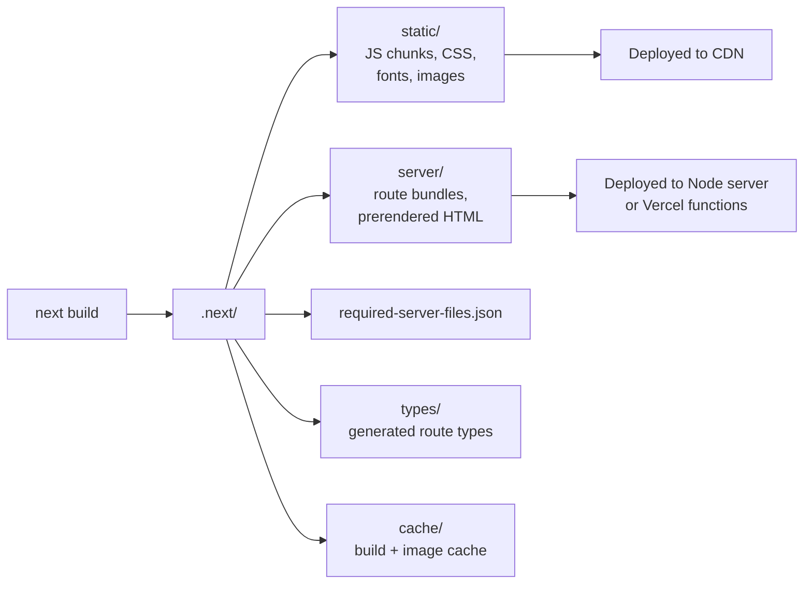
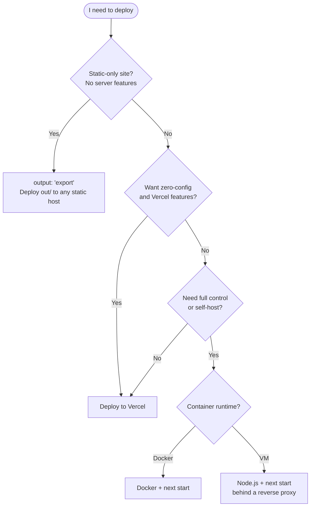
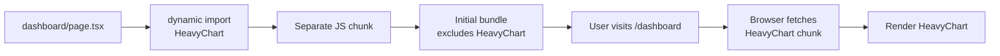

# 4.13 Project Organization and Performance

> The App Router introduces several new file-based conventions (route groups, private folders, parallel routes, intercepted routes) that change how you organise a Next.js project. Combined with a deliberate choice about `src/` vs no `src/`, where shared code lives (`lib/`, `components/`), and how `next.config.js` is configured, you can build a project that scales to dozens of routes without becoming spaghetti. This note also covers the performance toolkit: `next/dynamic` for code splitting, the bundle analyzer, `next/image` and `next/font` for asset optimization, Tailwind for CSS, the React 19 compiler, Turbopack for dev and build, the production `.next/` output, deployment to Vercel versus self-hosting, and the `NEXT_PUBLIC_` env-var convention.

## 4.13.1 Objective

By the end of this note you should be able to:

1. Lay out an App Router project using the conventions: `app/` segments, route groups `(name)`, private folders `_name`, parallel routes `@name`, intercepted routes `(..)` segments, the optional `src/` directory, `lib/` or `utils/` for shared code, `components/` for shared components, and `public/` for static assets.
2. Configure `next.config.js` for images, redirects, rewrites, headers, and experimental features.
3. Use `next/dynamic` for component-level code splitting and explain when to use it over `React.lazy`.
4. Run the bundle analyzer and identify large dependencies.
5. Reason about Turbopack vs Webpack for dev and build.
6. Explain the production `.next/` output structure and what each folder contains.
7. Deploy to Vercel and articulate the self-hosting alternatives (Node server, Docker, static export).
8. Use the `NEXT_PUBLIC_` prefix correctly for client-exposed environment variables.
9. List at least eight concrete performance wins for a Next.js app.

## 4.13.2 Background Knowledge

This note assumes you have read all of chapter 4 (especially [[4.1 App Router Foundations]], [[4.2 Routing, Layouts, and Templates]], [[4.4 Rendering Strategies]], [[4.11 Images, Fonts, and Optimization]]) and [[3.15 Project Architecture and Folder Organization]] (general React project structure). You should be familiar with the concepts of tree-shaking, code splitting, lazy loading, bundle analysis, and the difference between dev and production builds. Familiarity with Vercel as a hosting platform and the basic idea of a Docker container helps but is not required.

## 4.13.3 Core Concepts

### 4.13.3.1 The `app/` Directory Layout

Every file in `app/` is either a route segment convention (`page.tsx`, `layout.tsx`, `loading.tsx`, `error.tsx`, `not-found.tsx`, `route.ts`, `template.tsx`, `default.tsx`) or a colocated utility (anything else). Subdirectories create nested route segments.

```text
app/
  - layout.tsx          # root layout (required)
  - page.tsx            # / route
  - globals.css         # global CSS, imported in layout
  - not-found.tsx       # root 404
  - dashboard/
      - layout.tsx      # /dashboard layout
      - page.tsx        # /dashboard
      - loading.tsx     # /dashboard loading
      - error.tsx       # /dashboard error
      - users/
      - [id]/
      - page.tsx # /dashboard/users/:id
  - blog/
      - page.tsx
      - [slug]/
      - page.tsx
  - api/
      - webhooks/
          - stripe/
              - route.ts # /api/webhooks/stripe
```

### 4.13.3.2 Route Groups: `(name)`

A folder whose name is in parentheses, like `(marketing)`, is a *route group*: it organises files without affecting the URL. The path `/about` is served from `app/(marketing)/about/page.tsx`.

Use cases:
- Group related routes for organisational clarity (marketing pages vs app pages).
- Apply different layouts to different groups without changing the URL.
- Group private admin routes separately from public ones.

```text
app/
  - (marketing)/
      - layout.tsx       # marketing nav
      - page.tsx         # /
      - about/page.tsx   # /about
      - pricing/page.tsx # /pricing
  - (app)/
      - layout.tsx       # app nav (sidebar)
      - dashboard/page.tsx # /dashboard
      - settings/page.tsx  # /settings
```

### 4.13.3.3 Private Folders: `_name`

A folder prefixed with `_` is *private*: it and everything under it is excluded from routing. Use it to colocate utilities, components, tests, or any non-route files inside `app/`:

```text
app/
  - _components/         # not routed
      - button.tsx
  - _lib/
      - api.ts
  - dashboard/
      - page.tsx
```

This is the modern alternative to putting all components in a top-level `components/` folder. Both work; pick a convention and stick to it.

### 4.13.3.4 Parallel Routes: `@name`

A folder prefixed with `@` is a *parallel route*. It lets a layout render multiple children simultaneously:

```text
app/
  - layout.tsx
  - @analytics/
      - page.tsx
  - @team/
      - page.tsx
  - page.tsx
```

```tsx
// app/layout.tsx
export default function Layout({
  children,
  analytics,
  team,
}: {
  children: React.ReactNode;
  analytics: React.ReactNode;
  team: React.ReactNode;
}) {
  return (
    <div className="grid grid-cols-3">
      <div>{children}</div>
      <div>{analytics}</div>
      <div>{team}</div>
    </div>
  );
}
```

Use cases: dashboards with multiple independent panels, modals rendered alongside a page, conditional rendering based on auth.

### 4.13.3.5 Intercepted Routes: `(..)`

A folder with `(..)` prefixes intercepts a route from a different segment. The classic use case is a modal that opens when you click a photo in a gallery: the URL changes to `/photo/123`, but instead of a full page navigation, the photo renders in a modal *over* the gallery.

```text
app/
  - feed/
      - page.tsx
      - (..)photo/[id]/
      - page.tsx    # intercepts /photo/:id when navigated from /feed
  - photo/
      - [id]/
          - page.tsx    # full page when navigated directly
```

### 4.13.3.6 The `src/` Directory Option

By default, `app/` lives at the project root. You can move it (and `middleware.ts`) into `src/`:

```text
my-project/
  - src/
      - app/
      - middleware.ts
  - public/
  - next.config.js
```

This keeps the root clean and is the recommended setup for projects with many top-level config files. Either choice is fine; pick one and be consistent.

### 4.13.3.7 Where Shared Code Lives

There are two conventions:

1. **Top-level folders** (older convention): `components/`, `lib/`, `utils/`, `hooks/`, `types/`.
2. **Private folders inside `app/`** (newer convention): `app/_components/`, `app/_lib/`, etc.

Both are valid. The newer convention has the advantage that all app code lives in one tree, but the older convention is more familiar. A common hybrid: top-level `components/` for shared UI primitives (Button, Input) and `lib/` for non-React utilities (API client, auth helpers), while route-specific components live colocated in `app/<route>/_components/`.

### 4.13.3.8 The `public/` Folder

Files in `public/` are served at the root URL as-is. Use it for `favicon.ico`, `robots.txt` (if you don't use `robots.ts`), static images, PDFs, downloadable files. Files here are *not* processed by the bundler — they are copied verbatim.

### 4.13.3.9 `next.config.js` Essentials

```js
/** @type {import('next').NextConfig} */
const nextConfig = {
  images: {
    formats: ['image/avif', 'image/webp'],
    remotePatterns: [
      { protocol: 'https', hostname: 'images.unsplash.com' },
    ],
  },
  experimental: {
    typedRoutes: true,
    serverActions: { allowedOrigins: ['acme.com'] },
  },
  redirects: async () => [
    { source: '/old', destination: '/new', permanent: true },
  ],
  rewrites: async () => [
    { source: '/api/old', destination: 'https://api.example.com/v1' },
  ],
  headers: async () => [
    {
      source: '/(.*)',
      headers: [
        { key: 'X-Frame-Options', value: 'DENY' },
        { key: 'X-Content-Type-Options', value: 'nosniff' },
        { key: 'Referrer-Policy', value: 'strict-origin-when-cross-origin' },
      ],
    },
  ],
};

module.exports = nextConfig;
```

`redirects` issues real HTTP redirects at the server level (cheaper than middleware for static maps). `rewrites` proxies requests transparently. `headers` sets response headers without running code per request (cheaper than middleware).

### 4.13.3.10 Component-Level Code Splitting with `next/dynamic`

`next/dynamic` is Next.js's wrapper around `React.lazy` that works on both server and client. It dynamically imports a component, splitting it into a separate chunk that loads on demand.

```tsx
import dynamic from 'next/dynamic';

const HeavyChart = dynamic(() => import('@/components/HeavyChart'), {
  loading: () => <div>Loading chart...</div>,
  ssr: false, // only when the component uses browser APIs
});

export function Page() {
  return <HeavyChart data={...} />;
}
```

Use cases:
- A heavy chart library only used on one page.
- A markdown editor only loaded when the user clicks "Edit".
- A client-only widget (e.g. a map) on an otherwise server-rendered page.

> [!tip] Prefer `next/dynamic` over `React.lazy` in Next.js
> `React.lazy` does not work with Server Components and does not handle SSR. `next/dynamic` is the universal choice.

### 4.13.3.11 The Bundle Analyzer

Install `@next/bundle-analyzer` and run `next build`:

```bash
npm install --save-dev @next/bundle-analyzer
ANALYZE=true next build
```

It produces two treemap visualisations: one for the client bundle, one for the server bundle. Look for:
- Large dependencies you could replace with lighter alternatives.
- Code you import but never use (tree-shaking failures).
- Multiple versions of the same library (often React).

```js
// next.config.js
const withBundleAnalyzer = require('@next/bundle-analyzer')({
  enabled: process.env.ANALYZE === 'true',
});

module.exports = withBundleAnalyzer({
  // your config
});
```

### 4.13.3.12 Turbopack vs Webpack

Next.js 15 defaults to Turbopack for `next dev` (faster incremental builds, written in Rust). `next build` still uses Webpack by default; Turbopack for build is in beta. Turbopack is significantly faster on large codebases and supports the same plugin conventions in most cases.

```bash
next dev --turbo      # default in Next 15+
next build --turbo    # opt-in for production builds (beta)
```

If a third-party Webpack plugin is critical, you may need to stick with Webpack. Otherwise, prefer Turbopack.

### 4.13.3.13 The Production `.next/` Folder

After `next build`, the `.next/` folder contains:

- `.next/static/` — JS chunks, CSS, fonts, optimised images. Served from a CDN in production.
- `.next/server/` — server bundles (one per route), static HTML, the prerender manifests.
- `.next/required-server-files.json` — metadata needed by the Node server.
- `.next/types/` — generated TypeScript types for routes.
- `.next/cache/` — build-time and image cache (gitignore this).

For self-hosting, you run `next start` against this folder; for Vercel, the platform handles it.

### 4.13.3.14 Deployment: Vercel (The Simplest Path)

Vercel is Next.js's creator's hosting platform. Push to a Git repo, connect it, and Vercel:

- Detects Next.js automatically.
- Builds with `next build`.
- Deploys static assets to its CDN and server code to its serverless/Edge functions.
- Provides image optimization, OG image generation, ISR, analytics, and speed insights out of the box.

For most projects, this is the right choice. The main tradeoffs are cost at scale (serverless invocations are billed) and vendor lock-in (Vercel-specific features like Edge Config).

### 4.13.3.15 Self-Hosting: Node.js Server, Docker, Static Export

For self-hosting:

1. **Node.js server:** Run `next build` then `next start`. The app runs as a long-lived Node process. Easiest to deploy to a VM or any container runtime.
2. **Docker:** Build a Docker image with multi-stage build. The final image runs `next start`. Works on Kubernetes, ECS, Fly.io, etc.
3. **Static export:** Set `output: 'export'` in `next.config.js`. The build emits a fully static site to `out/`. No server features (no ISR, no Route Handlers, no Server Actions). Use only for purely static sites.

```dockerfile
# Multi-stage Dockerfile
FROM node:20-alpine AS deps
WORKDIR /app
COPY package*.json ./
RUN npm ci

FROM node:20-alpine AS builder
WORKDIR /app
COPY --from=deps /app/node_modules ./node_modules
COPY . .
RUN npm run build

FROM node:20-alpine AS runner
WORKDIR /app
ENV NODE_ENV=production
COPY --from=builder /app/.next ./.next
COPY --from=builder /app/public ./public
COPY --from=builder /app/package.json ./
COPY --from=builder /app/node_modules ./node_modules
EXPOSE 3000
CMD ["npm", "start"]
```

### 4.13.3.16 Environment Variables

- Variables set in `.env`, `.env.local`, `.env.production`, `.env.development` are loaded automatically.
- Variables prefixed with `NEXT_PUBLIC_` are inlined into the client bundle at build time.
- All other variables are available only on the server (Server Components, Route Handlers, Server Actions, middleware).

```env
# .env.local
DATABASE_URL=postgresql://...           # server only
STRIPE_SECRET_KEY=sk_live_...           # server only
NEXT_PUBLIC_GA_ID=G-XXXXXXX             # client + server
NEXT_PUBLIC_APP_URL=https://acme.com    # client + server
```

> [!danger] Putting Secrets in `NEXT_PUBLIC_`
> Anything prefixed with `NEXT_PUBLIC_` is visible to anyone who opens the browser DevTools. Never put API secrets, database passwords, or auth tokens there. If a client needs an API key, proxy through a Route Handler instead.

### 4.13.3.17 The React 19 Compiler

React 19 includes the React Compiler (opt-in in Next.js 15). It automatically memoises components and hooks, eliminating the need for manual `useMemo`, `useCallback`, and `React.memo` in most cases. Enable it via `next.config.js`:

```js
const nextConfig = {
  experimental: {
    reactCompiler: true,
  },
};
```

The compiler analyses your components at build time and inserts memoisation where it is safe. This usually improves performance without code changes, but you should profile before and after to confirm.

### 4.13.3.18 Performance Optimisation Checklist

A concrete list of wins, roughly in order of impact:

1. Use `next/image` everywhere with correct `sizes` and `priority`.
2. Use `next/font` for self-hosted fonts with `font-display: optional`.
3. Stream slow pages with `loading.tsx` and per-section `<Suspense>`.
4. Use `next/dynamic` for heavy client-only components.
5. Run the bundle analyzer and remove or replace large dependencies.
6. Enable the React Compiler.
7. Use Turbopack for dev (default) and try it for builds.
8. Move static headers and redirects from middleware to `next.config.js`.
9. Set `Cache-Control` headers on dynamic Route Handlers.
10. Preload critical fonts and the LCP image via `priority`.
11. Keep middleware under 5ms.
12. Use Tailwind's JIT to ship only the CSS you use.
13. Prefer Server Components (zero client JS) by default.
14. Audit third-party scripts (analytics, chat widgets); load them with `next/script`'s `strategy="lazyOnload"`.

## 4.13.4 Detailed Walkthrough

### 4.13.4.1 A Recommended Project Structure

```text
my-project/
  - src/
      - app/
          - (marketing)/
              - layout.tsx
              - page.tsx
              - about/page.tsx
              - pricing/page.tsx
          - (app)/
              - layout.tsx
              - dashboard/
                  - page.tsx
                  - loading.tsx
                  - _components/stats-card.tsx
              - settings/page.tsx
          - blog/
              - [slug]/
                  - page.tsx
                  - opengraph-image.tsx
              - page.tsx
          - api/
              - webhooks/stripe/route.ts
          - layout.tsx
          - globals.css
          - not-found.tsx
          - error.tsx
          - loading.tsx
          - sitemap.ts
          - robots.ts
      - components/             # shared UI primitives
          - ui/
              - button.tsx
              - input.tsx
              - card.tsx
          - providers/
          - theme-provider.tsx
      - lib/                    # non-React utilities
          - api.ts
          - auth.ts
          - db.ts
          - utils.ts
      - hooks/
          - use-debounce.ts
      - types/
          - index.ts
      - middleware.ts
  - public/
      - favicon.ico
      - og.png
      - manifest.json
  - .env.local
  - .env.production
  - next.config.js
  - tailwind.config.ts
  - tsconfig.json
  - package.json
```

### 4.13.4.2 A Realistic `next.config.js`

```js
/** @type {import('next').NextConfig} */
const nextConfig = {
  reactStrictMode: true,
  poweredByHeader: false,
  images: {
    formats: ['image/avif', 'image/webp'],
    remotePatterns: [
      { protocol: 'https', hostname: 'images.unsplash.com' },
      { protocol: 'https', hostname: '**.amazonaws.com' },
    ],
  },
  experimental: {
    typedRoutes: true,
    reactCompiler: true,
    serverActions: { allowedOrigins: ['acme.com', 'www.acme.com'] },
  },
  async redirects() {
    return [
      { source: '/old-blog/:slug', destination: '/blog/:slug', permanent: true },
    ];
  },
  async rewrites() {
    return [
      { source: '/api/v1/:path*', destination: 'https://api.example.com/v1/:path*' },
    ];
  },
  async headers() {
    return [
      {
        source: '/(.*)',
        headers: [
          { key: 'X-Frame-Options', value: 'DENY' },
          { key: 'X-Content-Type-Options', value: 'nosniff' },
          { key: 'Referrer-Policy', value: 'strict-origin-when-cross-origin' },
          { key: 'Permissions-Policy', value: 'camera=(), microphone=(), geolocation=()' },
        ],
      },
    ];
  },
};

module.exports = nextConfig;
```

### 4.13.4.3 Code Splitting with `next/dynamic`

```tsx
// app/dashboard/page.tsx
import dynamic from 'next/dynamic';

const AnalyticsChart = dynamic(() => import('./_components/analytics-chart'), {
  loading: () => <div className="h-64 bg-slate-100 animate-pulse rounded" />,
});

export default function Page() {
  return (
    <div>
      <h1>Dashboard</h1>
      <AnalyticsChart />
    </div>
  );
}
```

```tsx
// app/dashboard/_components/analytics-chart.tsx
'use client';

import { useEffect, useRef } from 'react';
import { Chart } from 'chart.js'; // heavy library

export default function AnalyticsChart() {
  const ref = useRef<HTMLCanvasElement>(null);
  useEffect(() => {
    if (!ref.current) return;
    const chart = new Chart(ref.current, { /* ... */ });
    return () => chart.destroy();
  }, []);
  return <canvas ref={ref} />;
}
```

The `chart.js` library (~200KB) is only downloaded when the dashboard page is visited, not on the homepage.

### 4.13.4.4 Using `next/script` for Third-Party Scripts

```tsx
import Script from 'next/script';

export function Analytics() {
  return (
    <Script
      src="https://www.googletagmanager.com/gtag/js?id=G-XXXXXXX"
      strategy="lazyOnload"
    />
  );
}
```

Strategies:
- `beforeInteractive` — load before the page is interactive (rare; only for critical scripts).
- `afterInteractive` (default) — load immediately after hydration.
- `lazyOnload` — load during idle time. Best for analytics.
- `worker` — load in a Web Worker (experimental).

## 4.13.5 Practical Examples

### 4.13.5.1 Route Groups for Marketing vs App Layouts

```tsx
// src/app/(marketing)/layout.tsx
export default function MarketingLayout({ children }: { children: React.ReactNode }) {
  return (
    <html lang="en">
      <body>
        <nav>Marketing nav</nav>
        <main>{children}</main>
        <footer>Marketing footer</footer>
      </body>
    </html>
  );
}
```

```tsx
// src/app/(app)/layout.tsx
export default function AppLayout({ children }: { children: React.ReactNode }) {
  return (
    <div className="flex">
      <aside>App sidebar</aside>
      <main>{children}</main>
    </div>
  );
}
```

Both share the root `app/layout.tsx` if it exists, or each acts as the root for its group if the root layout is removed.

### 4.13.5.2 Lazy-Loading a Heavy Markdown Editor

```tsx
// app/blog/[slug]/edit/page.tsx
'use client';

import dynamic from 'next/dynamic';

const MarkdownEditor = dynamic(() => import('@/components/markdown-editor'), {
  ssr: false,
  loading: () => <p>Loading editor…</p>,
});

export default function EditPage() {
  return <MarkdownEditor />;
}
```

### 4.13.5.3 Bundle Analyzer Setup

```js
// next.config.js
const withBundleAnalyzer = require('@next/bundle-analyzer')({
  enabled: process.env.ANALYZE === 'true',
});

module.exports = withBundleAnalyzer({
  // your config
});
```

```json
// package.json
{
  "scripts": {
    "analyze": "ANALYZE=true next build"
  }
}
```

Run `npm run analyze` and open the generated HTML reports.

### 4.13.5.4 Environment Variable Usage

```tsx
// Server Component - can see everything
export default async function Page() {
  const dbUrl = process.env.DATABASE_URL;          // OK
  const stripe = process.env.STRIPE_SECRET_KEY;    // OK
  const apiUrl = process.env.NEXT_PUBLIC_API_URL;  // OK (also visible on client)
  return <div>...</div>;
}
```

```tsx
// Client Component - only NEXT_PUBLIC_ vars
'use client';

export function Footer() {
  const apiUrl = process.env.NEXT_PUBLIC_API_URL;  // OK
  // const dbUrl = process.env.DATABASE_URL;       // undefined at build time
  return <footer>API: {apiUrl}</footer>;
}
```

## 4.13.6 Mermaid Diagrams

### 4.13.6.1 Recommended Project Structure

```mermaid
flowchart TD
    Root[my-project/] --> Src[src/]
    Root --> Public[public/]
    Root --> Config[config files:<br/>next.config.js, tsconfig.json,<br/>tailwind.config.ts, .env]
    Src --> App[app/]
    Src --> Components[components/]
    Src --> Lib[lib/]
    Src --> Hooks[hooks/]
    Src --> Types[types/]
    Src --> MW[middleware.ts]
    App --> Marketing[(marketing)/]
    App --> AppGroup[(app)/]
    App --> Blog[blog/]
    App --> Api[api/]
    App --> RootFiles[layout.tsx<br/>page.tsx<br/>globals.css<br/>sitemap.ts<br/>robots.ts]
```

### 4.13.6.2 Production Build Output (`.next/`)



### 4.13.6.3 Deployment Decision Tree



### 4.13.6.4 Code Splitting with `next/dynamic`



## 4.13.7 Common Mistakes

1. **Putting all components in a top-level `components/` folder for a small app.** For 3 routes, colocate them in `app/_components/` instead. Top-level `components/` is fine for large apps with shared primitives.

2. **Forgetting to use route groups for different layouts.** Trying to conditionally render nav inside the root layout based on pathname is fragile. Use route groups instead.

3. **Mixing `src/` and non-`src/` conventions.** Pick one. Mixing produces broken imports and confusing structure.

4. **Running middleware on every request without a matcher.** See [[4.12 Middleware (Practical Usage Only)]].

5. **Importing heavy client-only libraries unconditionally.** A 200KB chart library imported at the top of a Server Component ships to every client. Use `next/dynamic` with `ssr: false`.

6. **Putting secrets in `NEXT_PUBLIC_` env vars.** They end up in the client bundle, visible to anyone. Use Route Handlers to proxy.

7. **Forgetting to set security headers.** Either in `next.config.js` or via a hosting platform's configuration. X-Frame-Options, Content-Security-Policy, etc., are essential.

8. **Running `next build` without checking bundle size.** Bundle creep is gradual. Run the analyzer regularly (e.g. in CI on every PR).

9. **Using `output: 'export'` for a site that needs ISR or Route Handlers.** Static export only works for fully static sites. Mixed sites need a Node server.

10. **Not setting `reactStrictMode: true`.** It catches bugs in development (double-invoked effects, deprecated lifecycles) at the cost of slightly slower dev renders.

## 4.13.8 Best Practices

1. **Pick a project structure convention and document it.** Route groups vs flat, `src/` vs no `src/`, colocated vs top-level components. Consistency beats either choice.

2. **Default to Server Components.** Reach for `'use client'` only when you need state, effects, or browser APIs.

3. **Colocate route-specific code.** A component only used by `/dashboard` lives in `app/dashboard/_components/`. Shared components live in `components/`.

4. **Use `next/dynamic` for heavy client-only code.** Especially editors, charts, and map libraries.

5. **Run the bundle analyzer in CI.** Fail the build if the client bundle grows by more than X%.

6. **Set security headers in `next.config.js`.** Cheap, static, and effective.

7. **Use Vercel for the first deploy.** It removes every infrastructure decision. Migrate to self-hosting only when cost or control demands it.

8. **Treat env vars as code.** `.env.example` documents the required vars; `.env.local` holds your dev secrets (gitignored); `.env.production` is set in the hosting platform's UI.

9. **Enable the React Compiler.** It removes a whole class of manual memoisation mistakes.

10. **Profile before optimising.** Lighthouse, Chrome DevTools Performance, and the bundle analyzer should drive your work, not gut feeling.

## 4.13.9 Mini Exercises

### Exercise 1: Lay Out a New Project

**Goal:** Create a Next.js project structure with: marketing pages under `(marketing)`, app pages under `(app)`, a shared `components/ui/` folder, a `lib/` folder for utilities, and a `middleware.ts`.

**Worked solution:**

```bash
mkdir -p src/app/(marketing)/about src/app/(app)/dashboard
mkdir -p src/components/ui src/lib src/hooks
touch src/app/layout.tsx src/app/(marketing)/layout.tsx
touch src/app/(marketing)/page.tsx src/app/(marketing)/about/page.tsx
touch src/app/(app)/layout.tsx src/app/(app)/dashboard/page.tsx
touch src/middleware.ts src/lib/utils.ts src/components/ui/button.tsx
```

Fill in the root layout, then add a distinct nav to each group's layout. Visiting `/about` shows the marketing nav; visiting `/dashboard` shows the app nav.

### Exercise 2: Lazy-Load a Heavy Component

**Goal:** A `/dashboard` page that lazy-loads a chart component (mock it as a `setTimeout`-returning component) with a loading fallback.

**Worked solution:**

```tsx
// src/app/(app)/dashboard/_components/heavy-chart.tsx
'use client';

export default function HeavyChart() {
  return <div className="h-64 bg-blue-100 rounded">Chart renders here</div>;
}
```

```tsx
// src/app/(app)/dashboard/page.tsx
import dynamic from 'next/dynamic';

const HeavyChart = dynamic(() => import('./_components/heavy-chart'), {
  loading: () => <div className="h-64 bg-slate-100 animate-pulse rounded" />,
});

export default function Page() {
  return (
    <div className="p-8">
      <h1 className="text-2xl font-bold">Dashboard</h1>
      <div className="mt-4">
        <HeavyChart />
      </div>
    </div>
  );
}
```

### Exercise 3: Add Security Headers and Redirects

**Goal:** Configure `next.config.js` to add security headers to all routes and redirect `/old` to `/new` permanently.

**Worked solution:**

```js
// next.config.js
/** @type {import('next').NextConfig} */
const nextConfig = {
  async redirects() {
    return [
      { source: '/old', destination: '/new', permanent: true },
    ];
  },
  async headers() {
    return [
      {
        source: '/(.*)',
        headers: [
          { key: 'X-Frame-Options', value: 'DENY' },
          { key: 'X-Content-Type-Options', value: 'nosniff' },
          { key: 'Referrer-Policy', value: 'strict-origin-when-cross-origin' },
          { key: 'Permissions-Policy', value: 'camera=(), microphone=(), geolocation=()' },
        ],
      },
    ];
  },
};

module.exports = nextConfig;
```

### Exercise 4: Set Up the Bundle Analyzer

**Goal:** Install the bundle analyzer, add an `analyze` script, and run it.

**Worked solution:**

```bash
npm install --save-dev @next/bundle-analyzer
```

```js
// next.config.js
const withBundleAnalyzer = require('@next/bundle-analyzer')({
  enabled: process.env.ANALYZE === 'true',
});

module.exports = withBundleAnalyzer({
  // your existing config
});
```

```json
// package.json
{
  "scripts": {
    "analyze": "ANALYZE=true next build"
  }
}
```

```bash
npm run analyze
```

Open the generated `.next/analyze/client.html` and `.next/analyze/server.html` in a browser.

### Exercise 5: Use `NEXT_PUBLIC_` Correctly

**Goal:** Build a Server Component that reads a server-only env var (`DATABASE_URL`) and a Client Component that reads `NEXT_PUBLIC_APP_URL`. Demonstrate that the client component cannot see `DATABASE_URL`.

**Worked solution:**

```env
# .env.local
DATABASE_URL=postgresql://localhost:5432/acme
NEXT_PUBLIC_APP_URL=https://acme.com
```

```tsx
// src/app/page.tsx (Server Component)
import { Footer } from '@/components/footer';

export default function Page() {
  const dbUrl = process.env.DATABASE_URL;
  console.log('Server sees DB:', dbUrl); // prints on the server
  return (
    <div>
      <h1>Home</h1>
      <Footer />
    </div>
  );
}
```

```tsx
// src/components/footer.tsx
'use client';

export function Footer() {
  const url = process.env.NEXT_PUBLIC_APP_URL;
  // const db = process.env.DATABASE_URL; // would be undefined
  return <footer>App URL: {url}</footer>;
}
```

Open the browser DevTools  -->  Sources  -->  search for the client bundle. You will find `https://acme.com` (the public var) but not the database URL.

## 4.13.10 Summary

A well-organised Next.js project uses the App Router's conventions deliberately: route groups for layout variation, private folders for colocated code, parallel routes for multi-panel layouts, intercepted routes for modals. Shared code lives in `components/` and `lib/` (or `app/_components/` and `app/_lib/`). `next.config.js` configures images, redirects, rewrites, headers, and experimental flags. Performance wins come from `next/image`, `next/font`, `next/dynamic`, the bundle analyzer, the React Compiler, Turbopack, and a strict Server-Component-by-default discipline. Deployment to Vercel is the simplest path; self-hosting via Node or Docker works when you need control. Always prefix client-exposed env vars with `NEXT_PUBLIC_` and never put secrets there. Run the bundle analyzer regularly and let Lighthouse drive your optimisation work.

## 4.13.11 Related Notes

- [[4.1 App Router Foundations]] — the segment model the structure is built on.
- [[4.2 Routing, Layouts, and Templates]] — route groups, parallel routes, intercepted routes in detail.
- [[4.3 Server and Client Components]] — the boundary that drives the "Server by default" rule.
- [[4.11 Images, Fonts, and Optimization]] — the biggest performance levers.
- [[4.12 Middleware (Practical Usage Only)]] — where middleware sits and its performance budget.
- [[4.9 Loading UI, Error Pages, and Streaming]] — streaming for perceived performance.
- [[3.15 Project Architecture and Folder Organization]] — the React-level patterns this builds on.
- [[3.12 Suspense, Lazy Loading, and Code Splitting]] — the React primitives behind `next/dynamic`.
- [[3.11 Performance Optimization]] — general React performance.
