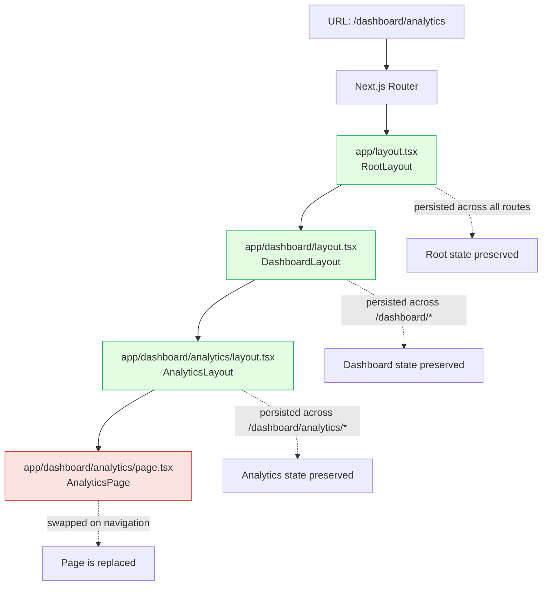
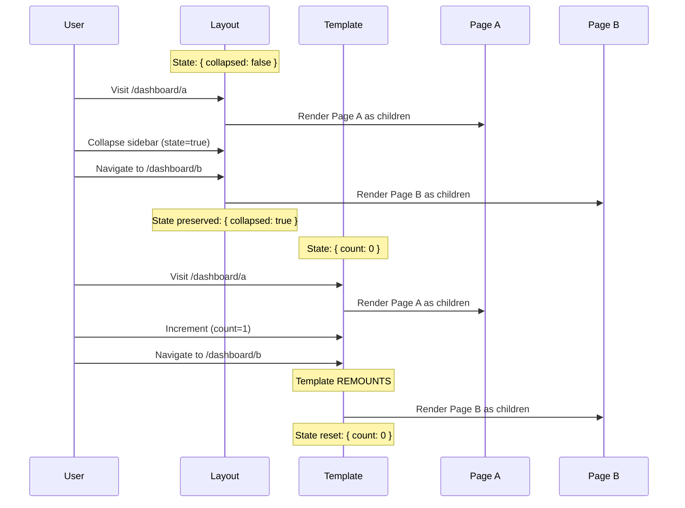
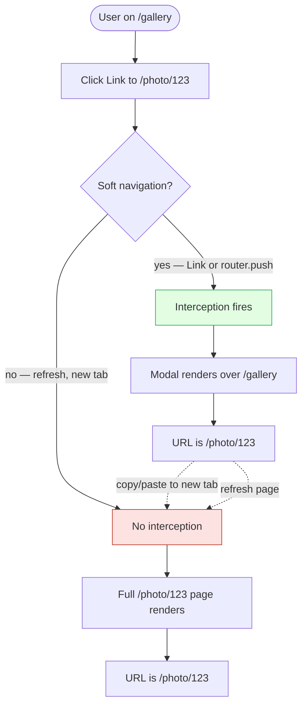

# 4.2 Routing, Layouts, and Templates

> The App Router's file-based routing system supports dynamic segments, catch-all routes, route groups, private folders, parallel routes, and intercepted routes — plus four client-side hooks for navigation. This note covers every routing primitive in detail and explains how layouts and templates differ in state persistence.

## 4.2.1 Objective

By the end of this note you should be able to:

1. Define routes for any URL shape, including dynamic, catch-all, and optional catch-all segments.
2. Decide between `layout.tsx` and `template.tsx` for any shared UI based on whether state should persist across navigation.
3. Use route groups, private folders, parallel routes, and intercepted routes correctly and explain what each is for.
4. Use `next/link`, `useRouter`, `usePathname`, `useSearchParams`, and `useParams` in the App Router idioms.
5. Build a modal-with-route pattern (e.g., a photo lightbox that lives at `/photo/[id]` but appears as a modal over the gallery) using intercepted routes.

## 4.2.2 Background Knowledge

This note assumes you have read [[4.1 App Router Foundations]] and understand the basic `app/` directory structure, the file conventions (`page.tsx`, `layout.tsx`, etc.), and the Server/Client Component default. You should also be comfortable with React state persistence concepts from [[3.3 State and Events]] and React Router's URL-based state model from [[3.17 Client-Side Routing]].

## 4.2.3 Core Concepts

### 4.2.3.1 The File-Based Routing System

Every folder under `app/` corresponds to a URL segment. A folder becomes a route when it contains a `page.tsx`. Folder names follow conventions that determine whether the segment is static, dynamic, or special:

| Folder pattern | Meaning | Example URL |
|----------------|---------|-------------|
| `about` | Static segment | `/about` |
| `[slug]` | Dynamic segment | `/blog/hello-world` |
| `[...slug]` | Catch-all segment | `/docs/a/b/c` |
| `[[...slug]]` | Optional catch-all | `/docs` or `/docs/a/b/c` |
| `(group)` | Route group (no URL impact) | folder only |
| `_private` | Private folder (excluded from routing) | folder only |
| `@slot` | Parallel route slot | folder only |

### 4.2.3.2 Dynamic Segments

A dynamic segment is a folder named `[param]`. The value of the segment is passed to the page, layout, route handler, and metadata generation functions as `params.param`.

```tsx
// app/blog/[slug]/page.tsx
export default async function Page({ params }: { params: { slug: string } }) {
  const post = await getPost(params.slug);
  return <article><h1>{post.title}</h1></article>;
}
```

In Next.js 15+, `params` is a Promise (it became async to support Partial Prerendering). The async form is:

```tsx
// app/blog/[slug]/page.tsx (Next.js 15+)
export default async function Page({ params }: { params: Promise<{ slug: string }> }) {
  const { slug } = await params;
  const post = await getPost(slug);
  return <article><h1>{post.title}</h1></article>;
}
```

Multiple dynamic segments are allowed in a single path: `app/blog/[category]/[slug]/page.tsx` matches `/blog/tech/hello-world`, and `params` becomes `{ category: "tech", slug: "hello-world" }`.

### 4.2.3.3 Catch-All Segments

A catch-all segment is a folder named `[...slug]`. It matches the segment and any number of additional segments. The value of `params.slug` is an array.

```text
app/docs/[...slug]/page.tsx
```

| URL | `params.slug` |
|-----|---------------|
| `/docs/a` | `["a"]` |
| `/docs/a/b` | `["a", "b"]` |
| `/docs/a/b/c` | `["a", "b", "c"]` |
| `/docs` | 404 (no match — catch-all requires at least one segment) |

### 4.2.3.4 Optional Catch-All Segments

An optional catch-all segment is a folder named `[[...slug]]`. It behaves like catch-all but also matches the URL with no segment.

```text
app/docs/[[...slug]]/page.tsx
```

| URL | `params.slug` |
|-----|---------------|
| `/docs` | `undefined` |
| `/docs/a` | `["a"]` |
| `/docs/a/b/c` | `["a", "b", "c"]` |

Use optional catch-all when the root of the segment should also be a valid route (e.g., a docs index that lives at `/docs` itself).

### 4.2.3.5 The `layout.tsx` File

A layout wraps the page and any nested children in shared UI. Layouts persist across navigation between sibling routes — their React state is preserved, and the layout component does not re-render its body when the URL changes (only its `children` prop changes).

```tsx
// app/dashboard/layout.tsx
import { Sidebar } from "./Sidebar";

export default function DashboardLayout({ children }: { children: React.ReactNode }) {
  return (
    <div className="flex">
      <Sidebar />
      <main className="flex-1">{children}</main>
    </div>
  );
}
```

The root layout at `app/layout.tsx` is required and must render `<html>` and `<body>`. All other layouts are optional and compose naturally.

### 4.2.3.6 The `template.tsx` File

`template.tsx` is structurally identical to `layout.tsx` — it wraps the page and nested children — but with one critical difference: **a template re-mounts on every navigation.** State is *not* preserved when you navigate between sibling routes.

The mechanism is that Next.js wraps the page in a `<Template>` component that uses a `key` derived from the URL. When the URL changes, the key changes, React unmounts the old tree and mounts a new one — losing state, replaying effects, and re-running animations.

```tsx
// app/template.tsx
export default function Template({ children }: { children: React.ReactNode }) {
  return <div className="animate-fade-in">{children}</div>;
}
```

Use `template.tsx` when:

- You want a CSS animation to replay on every navigation.
- You want to reset client-side state (e.g., a multi-step form should not preserve step state across page changes).
- You want effects (`useEffect`) to re-run on navigation.

Use `layout.tsx` when:

- You want state to persist (sidebar collapse, dark mode toggle in the layout).
- You want to avoid the cost of re-mounting a heavy component tree.

### 4.2.3.7 Route Groups — `(folder)`

A route group is a folder whose name is wrapped in parentheses: `(group)`. Route groups are organizational only — they do **not** affect the URL. They are useful for:

- Grouping routes that share a layout, without the layout affecting the URL.
- Splitting a route into multiple "sections" for code organization.

```text
app/
  - (marketing)/
      - layout.tsx        <--  marketing shell (header, footer)
      - page.tsx          <--  / (yes, the root URL)
      - about/page.tsx    <--  /about
      - pricing/page.tsx  <--  /pricing
  - (dashboard)/
      - layout.tsx        <--  dashboard shell (sidebar)
      - dashboard/page.tsx   <--  /dashboard
      - settings/page.tsx    <--  /settings
```

The URLs are `/`, `/about`, `/pricing`, `/dashboard`, `/settings` — the `(marketing)` and `(dashboard)` parts are stripped. Each group can have its own layout without polluting the URL.

### 4.2.3.8 Private Folders — `_folder`

A private folder is a folder whose name starts with an underscore: `_components`, `_lib`, `_utils`. Private folders are excluded from routing entirely. They are the convention for co-locating non-route files (components, helpers, tests) inside `app/` without Next.js trying to turn them into routes.

```text
app/
  - blog/
      - _components/
          - PostCard.tsx    <--  not a route
      - _lib/
          - getPost.ts      <--  not a route
      - page.tsx            <--  route: /blog
```

> [!note] Underscore prefix is reserved
> Next.js treats any folder whose name begins with `_` as private. You cannot accidentally create a route named `_foo`. If you really want a URL that starts with an underscore (extremely unusual), you cannot do it with the App Router's folder convention.

### 4.2.3.9 Parallel Routes — `@folder`

A parallel route is a folder whose name starts with `@`: `@analytics`, `@modal`. Parallel routes let you render multiple route trees simultaneously in a single layout, with each tree mapped to a "slot" in the layout.

The layout receives the slots as props:

```tsx
// app/dashboard/layout.tsx
export default function DashboardLayout({
  children,
  analytics,
  team,
}: {
  children: React.ReactNode;
  analytics: React.ReactNode;
  team: React.ReactNode;
}) {
  return (
    <div className="grid grid-cols-3">
      <section className="col-span-2">{children}</section>
      <aside>{analytics}</aside>
      <section>{team}</section>
    </div>
  );
}
```

```text
app/dashboard/
  - layout.tsx
  - page.tsx               <--  default for the children slot
  - @analytics/
      - page.tsx           <--  default for @analytics slot
      - [range]/page.tsx   <--  /dashboard/[range] updates only @analytics
  - @team/
      - default.tsx        <--  fallback when no @team match
      - page.tsx
```

Parallel routes are commonly used for dashboards where independent panels update independently, and for modal patterns where the modal is one slot and the page is another.

### 4.2.3.10 Intercepted Routes — `(..)folder`

An intercepted route lets one route "capture" navigation to another route and render it in a different context — typically as a modal. The interception syntax mirrors relative paths:

| Syntax | Meaning |
|--------|---------|
| `(.)segment` | Intercept a sibling segment (same level) |
| `(..)segment` | Intercept one level up |
| `(..)(..)segment` | Intercept two levels up |
| `(...)`segment` | Intercept from the root `app/` directory |

The canonical example is a photo gallery with a lightbox. The URL `/photo/[id]` is a full page route (direct visit shows the photo on its own page), but clicking a photo from the gallery opens it as a modal over the gallery instead.

```text
app/
  - gallery/
      - page.tsx               <--  /gallery
      - (..)photo/[id]/page.tsx   <--  intercepts /photo/[id] when navigated from /gallery
  - photo/
      - [id]/page.tsx          <--  /photo/:id (direct visit or refresh)
```

When you click a link from `/gallery` to `/photo/123`, the interception fires and the photo is rendered as a modal. If you copy the URL and paste it into a new tab, the interception does not fire (it only fires on client-side navigation), and you get the full `/photo/123` page. This is the modal-with-route pattern — modals that are also bookmarkable, refreshable URLs.

### 4.2.3.11 The `Link` Component

`next/link` is the App Router's client-side navigation component. It prefetches the linked route in the background, then performs a client-side transition on click.

```tsx
import Link from "next/link";

<Link href="/blog/hello-world">Read the post</Link>
<Link href={{ pathname: "/blog/[slug]", query: { slug: "hello-world" } }}>Read</Link>
```

In Next.js 13+, `Link` no longer requires a nested `<a>` element — it renders an `<a>` itself. The legacy `<Link legacyBehavior><a>...</a></Link>` form is still supported for backwards compatibility but should not be used in new code.

Prefetching behavior:

- In production, `Link` prefetches the linked route's static shell when it enters the viewport.
- Dynamic routes are prefetched as `loading.tsx` shells, not the full page.
- You can disable prefetching with `prefetch={false}` for routes you don't want to warm up.

### 4.2.3.12 The `useRouter` Hook (App Router)

`useRouter` from `next/navigation` (not `next/router`, which is the Pages Router version) gives you programmatic navigation.

```tsx
"use client";
import { useRouter } from "next/navigation";

export function GoHomeButton() {
  const router = useRouter();
  return <button onClick={() => router.push("/")}>Go home</button>;
}
```

Key methods:

- `router.push(href)` — client-side navigation.
- `router.replace(href)` — replace the current history entry.
- `router.back()` — go back in history.
- `router.forward()` — go forward in history.
- `router.refresh()` — re-fetch the current route's server components without losing client state.
- `router.prefetch(href)` — manually prefetch a route.

`useRouter` is a Client Component hook. It cannot be used in a Server Component.

### 4.2.3.13 The `usePathname` Hook

`usePathname` returns the current URL's pathname (e.g., `/blog/hello-world`). It is a Client Component hook.

```tsx
"use client";
import { usePathname } from "next/navigation";
import Link from "next/link";

export function Nav() {
  const pathname = usePathname();
  return (
    <nav>
      <Link href="/" data-active={pathname === "/"}>Home</Link>
      <Link href="/blog" data-active={pathname.startsWith("/blog")}>Blog</Link>
    </nav>
  );
}
```

### 4.2.3.14 The `useSearchParams` Hook

`useSearchParams` returns a `URLSearchParams` object for the current URL's query string. It is a Client Component hook and, because it requires reading the URL on the client, it triggers client-side rendering for the segment that uses it (see [[4.4 Rendering Strategies]]).

```tsx
"use client";
import { useSearchParams } from "next/navigation";

export function FilterBadge() {
  const searchParams = useSearchParams();
  const filter = searchParams.get("filter") ?? "all";
  return <span>Filter: {filter}</span>;
}
```

> [!warning] Suspense required
> Components using `useSearchParams` must be wrapped in a `<Suspense>` boundary, or the entire page opts out of static rendering. Next.js will print a build warning if you forget this.

### 4.2.3.15 The `useParams` Hook

`useParams` returns the dynamic route params for the current URL. It is a Client Component hook. In Next.js 15+ it returns a Promise-like object that can be unwrapped with React 19's `use()` hook.

```tsx
"use client";
import { useParams } from "next/navigation";

export function Breadcrumb() {
  const params = useParams<{ slug: string }>();
  return <span>{params.slug}</span>;
}
```

## 4.2.4 Detailed Walkthrough

### 4.2.4.1 Why Layouts Persist State

When you navigate between two routes that share a layout — say, `/dashboard/analytics` and `/dashboard/settings` — Next.js does not unmount the layout. React keeps the layout mounted and only swaps the `children` prop. This is the same React reconciliation behavior that preserves state when a parent stays mounted and a child changes.

Concretely, the rendered tree before and after navigation looks like:

```text
Before:
<RootLayout>
  <DashboardLayout>      <--  stays mounted
    <AnalyticsPage />    <--  replaced
  </DashboardLayout>
</RootLayout>

After:
<RootLayout>
  <DashboardLayout>      <--  stays mounted, state preserved
    <SettingsPage />     <--  new page
  </DashboardLayout>
</RootLayout>
```

Because `DashboardLayout` is the same React element type at the same position, React preserves its state (e.g., a collapsed sidebar). If `DashboardLayout` were to re-render its own body, that state would be lost — but it does not; only the `children` prop changes.

This is the *only* reason layouts exist as a separate file type from pages. Without that persistence guarantee, layouts would just be components you import into pages.

### 4.2.4.2 Layout vs Template: A Worked Comparison

Consider a layout with a counter:

```tsx
// app/dashboard/layout.tsx
"use client";
import { useState } from "react";

export default function DashboardLayout({ children }: { children: React.ReactNode }) {
  const [collapsed, setCollapsed] = useState(false);
  return (
    <div>
      <button onClick={() => setCollapsed((c) => !c)}>
        {collapsed ? "Expand" : "Collapse"}
      </button>
      <div style={{ display: collapsed ? "none" : "block" }}>
        {children}
      </div>
    </div>
  );
}
```

If you collapse the sidebar, navigate from `/dashboard/analytics` to `/dashboard/settings`, the sidebar stays collapsed. The state in `DashboardLayout` is preserved.

Now consider the same component as a template:

```tsx
// app/dashboard/template.tsx   <--  same code, different file
"use client";
import { useState } from "react";

export default function DashboardTemplate({ children }: { children: React.ReactNode }) {
  const [collapsed, setCollapsed] = useState(false);
  // ... same body
}
```

Now navigation from `/dashboard/analytics` to `/dashboard/settings` resets `collapsed` to `false`. The template re-mounts, losing state. This is the only practical difference between the two file conventions, and it is the deciding factor for which to use.

### 4.2.4.3 The URL Contract of Route Groups

Route groups are purely organizational, but they affect how layouts compose. The key insight: a layout inside a route group applies to all the routes in that group, but the group itself does not appear in the URL.

A common use case is having two different layouts for the root URL `/`:

```text
app/
  - (marketing)/
      - layout.tsx        <--  marketing shell
      - page.tsx          <--  /
  - (app)/
      - layout.tsx        <--  app shell
      - dashboard/page.tsx   <--  /dashboard
```

Visiting `/` uses the marketing layout. Visiting `/dashboard` uses the app layout. Both layouts are siblings of the root layout at `app/layout.tsx`, which still wraps everything.

> [!warning] Two pages for the same URL
> You cannot have both `app/(marketing)/page.tsx` and `app/(app)/page.tsx` (both would be `/`). Next.js will refuse to build. Route groups let you organize, but they do not let you have two routes for the same URL.

### 4.2.4.4 Parallel Routes and the Default Slot

When you use parallel routes, every slot must have something to render for every URL the layout serves. If a URL does not match a slot's route tree, Next.js falls back to:

1. The slot's `default.tsx` file, if present.
2. `null` (renders nothing) if no `default.tsx` exists.

`default.tsx` is the "empty state" for a parallel slot. It is essential when a slot is conditionally populated — e.g., a `@modal` slot that is only filled when a modal URL is active:

```text
app/
  - layout.tsx
  - page.tsx                <--  /
  - @modal/
      - default.tsx         <--  returns null (no modal)
      - (.)photo/[id]/page.tsx   <--  modal interception for /photo/[id]
      - ...
  - photo/[id]/page.tsx     <--  /photo/:id (direct visit)
```

The root layout receives `@modal` as a prop and renders it. When the URL is `/`, `@modal/default.tsx` returns `null`, and no modal is shown. When the user clicks a photo and the URL becomes `/photo/123` (intercepted by `(.)photo/[id]`), the modal slot is filled with the modal content.

### 4.2.4.5 Intercepted Routes and Soft vs Hard Navigation

The interception only fires on **soft navigation** — client-side navigation via `Link` or `router.push`. It does not fire on **hard navigation** — a fresh page load, a refresh, or a direct URL entry. This is by design: the intercepted route is a "preview" of the underlying route, and the underlying route must always render its full page when accessed directly.

Concretely, in the photo gallery example:

- Click a photo on `/gallery`: client-side navigation to `/photo/123`. Interception fires. Modal opens over `/gallery`.
- Refresh the page on `/photo/123`: hard navigation. The full `/photo/123` page renders.
- Copy the URL `/photo/123` and open in a new tab: hard navigation. The full page renders.

This dual behavior is what makes the modal pattern bookmarkable. The URL is the source of truth, but the rendering depends on how you got there.

### 4.2.4.6 Link Prefetching in Detail

When a `<Link>` enters the viewport in production, Next.js prefetches the linked route. The prefetch behavior depends on the route type:

- **Static route** — the full HTML and RSC payload are prefetched.
- **Dynamic route** — only the loading shell (the `loading.tsx` content, if any) is prefetched. The full route is fetched on click.
- **Route with `loading.tsx`** — the loading shell is prefetched and shown immediately on click; the rest streams in.

You can control prefetching per link:

```tsx
<Link href="/slow-page" prefetch={false}>Don't prefetch</Link>
<Link href="/important" prefetch>Force prefetch (default in production)</Link>
```

Disabling prefetch makes sense for routes that are unlikely to be visited (e.g., a "delete account" link in a settings menu) — you save bandwidth.

### 4.2.4.7 The `router.refresh()` Method

`router.refresh()` is a special method that re-fetches the current route's server components without losing client state. It does not perform a full page reload — it asks the server to re-render the current route and swap in the new server-rendered output, while keeping the client tree mounted.

Use cases:

- After a server action that mutates data, you want the page to reflect the new data without a full reload.
- After a manual cache invalidation, you want to pull the fresh data into the current view.

```tsx
"use client";
import { useRouter } from "next/navigation";
import { refreshData } from "./actions";

export function RefreshButton() {
  const router = useRouter();
  return (
    <button onClick={async () => {
      await refreshData();
      router.refresh();
    }}>
      Refresh
    </button>
  );
}
```

## 4.2.5 Practical Examples

### 4.2.5.1 A Blog with Dynamic Routes and Nested Layouts

```text
app/
  - layout.tsx                     <--  root: html, body, fonts
  - page.tsx                       <--  / (home)
  - blog/
      - layout.tsx                 <--  blog shell: tags, recent posts
      - page.tsx                   <--  /blog (post list)
      - [slug]/
      - page.tsx               <--  /blog/:slug
      - loading.tsx            <--  per-post loading skeleton
```

```tsx
// app/blog/[slug]/page.tsx
import { notFound } from "next/navigation";
import { getPost, getSlugs } from "@/lib/blog";

export async function generateStaticParams() {
  const slugs = await getSlugs();
  return slugs.map((slug) => ({ slug }));
}

export default async function PostPage({ params }: { params: { slug: string } }) {
  const post = await getPost(params.slug);
  if (!post) notFound();
  return (
    <article>
      <h1>{post.title}</h1>
      <div dangerouslySetInnerHTML={{ __html: post.html }} />
    </article>
  );
}
```

### 4.2.5.2 A Modal Photo Lightbox with Intercepted Routes

```text
app/
  - layout.tsx
  - @modal/
      - default.tsx            <--  returns null
      - (.)photo/[id]/page.tsx    <--  modal content for /photo/:id
  - photo/
      - [id]/page.tsx          <--  full page for /photo/:id
  - gallery/
      - page.tsx               <--  gallery with <Link href="/photo/123">
```

```tsx
// app/layout.tsx
export default function RootLayout({ children, modal }: { children: React.ReactNode; modal: React.ReactNode }) {
  return (
    <html>
      <body>
        {children}
        {modal}
      </body>
    </html>
  );
}
```

```tsx
// app/@modal/(.)photo/[id]/page.tsx
"use client";
import { useRouter } from "next/navigation";
import { Modal } from "@/components/Modal";

export default function PhotoModal({ params }: { params: { id: string } }) {
  const router = useRouter();
  return (
    <Modal onClose={() => router.back()}>
      
    </Modal>
  );
}
```

```tsx
// app/gallery/page.tsx
import Link from "next/link";
import { getPhotos } from "@/lib/photos";

export default async function Gallery() {
  const photos = await getPhotos();
  return (
    <div className="grid">
      {photos.map((p) => (
        <Link key={p.id} href={`/photo/${p.id}`}>
          
        </Link>
      ))}
    </div>
  );
}
```

Clicking a photo client-side navigates to `/photo/123`, the interception fires, and the modal opens over the gallery. Refreshing the page on `/photo/123` renders the full `app/photo/[id]/page.tsx` instead.

### 4.2.5.3 A Dashboard with Parallel Routes

```text
app/dashboard/
  - layout.tsx           <--  receives children, @analytics, @team
  - page.tsx             <--  default children slot
  - @analytics/
      - default.tsx
      - page.tsx         <--  default analytics
      - [range]/page.tsx   <--  /dashboard/[range] updates analytics
  - @team/
      - default.tsx
      - page.tsx
```

```tsx
// app/dashboard/layout.tsx
export default function DashboardLayout({
  children,
  analytics,
  team,
}: {
  children: React.ReactNode;
  analytics: React.ReactNode;
  team: React.ReactNode;
}) {
  return (
    <div className="grid grid-cols-12">
      <main className="col-span-8">{children}</main>
      <aside className="col-span-2">{analytics}</aside>
      <aside className="col-span-2">{team}</aside>
    </div>
  );
}
```

Navigating to `/dashboard/last-7-days` updates only the `@analytics` slot — the page itself and the `@team` slot keep their current state and content.

## 4.2.6 Mermaid Diagrams

### 4.2.6.1 Nested Layouts Compose Around the Page



### 4.2.6.2 Layout vs Template State Behavior



### 4.2.6.3 Intercepted Routes: Soft vs Hard Navigation



## 4.2.7 Common Mistakes

1. **Confusing `layout.tsx` and `template.tsx`.** They look identical, but their state behavior is opposite. If your sidebar collapses on every navigation, you probably used `template.tsx` by mistake. If your enter-animation never replays, you probably used `layout.tsx`.

2. **Using `useRouter` from `next/router` in the App Router.** The Pages Router's `next/router` does not work in the App Router. The correct import is `next/navigation`. Using the wrong one produces cryptic "router is not defined" errors.

3. **Forgetting `default.tsx` in parallel routes.** If a parallel slot has no matching route for the current URL and no `default.tsx`, Next.js renders nothing for that slot — but it will also throw a build warning. Always provide a `default.tsx` for slots that are conditionally populated.

4. **Expecting intercepted routes to work on hard navigation.** Intercepted routes only fire on client-side navigation. If your QA process involves refreshing the page on the modal URL, the modal will not appear — the full page will. This is correct behavior, but it confuses teams that don't know the rule.

5. **Using `useSearchParams` without a Suspense boundary.** A component that calls `useSearchParams` opts the whole route out of static rendering unless it is wrapped in `<Suspense>`. The build warning tells you this; ignoring it ships a fully dynamic page when you wanted static.

6. **Putting a `page.tsx` inside a private folder.** A folder named `_components/page.tsx` does not create a route. If you intended `/components`, rename the folder to remove the underscore.

7. **Using catch-all when you mean optional catch-all.** `app/docs/[...slug]/page.tsx` returns a 404 for `/docs` itself. If you want `/docs` to be a valid route, use `[[...slug]]` and check for `slug === undefined` in the page.

8. **Assuming `params` is a plain object.** In Next.js 15+, `params` is a Promise. Code that accesses `params.slug` synchronously will throw. Always `await params` first.

## 4.2.8 Best Practices

1. **Default to `layout.tsx`.** Use `template.tsx` only when you have a specific reason to reset state on navigation. The state-preservation behavior of layouts is the right default for almost all UI.

2. **Use route groups to organize, not to overload.** Route groups are perfect for separating unrelated sections (marketing, dashboard, admin) that share no UI. They are not a tool for having two layouts at the same URL.

3. **Co-locate components in `_components` or `_lib`.** Private folders keep route-adjacent files where you can find them, without Next.js treating them as routes. This is preferable to scattering components in a top-level `components/` directory when they are only used by one route.

4. **Always wrap `useSearchParams` in `Suspense`.** This is not optional in production. Without it, your route becomes fully dynamic and you lose static rendering benefits.

5. **Use the `Link` component, not `<a>` tags, for internal navigation.** `<a>` tags trigger hard navigation — full page reload, no prefetching, no streaming. The only exception is a link to an external URL.

6. **Disable prefetching for rarely-used links.** A settings page with 30 links does not need to prefetch all 30. Use `prefetch={false}` for unlikely destinations to save bandwidth.

7. **Use intercepted routes for modals that should be bookmarkable.** If a modal represents a piece of content the user might want to share (a photo, a tweet, a product detail), use the intercepted route pattern so the URL works on hard navigation too.

8. **Validate `params` and `searchParams` at the boundary.** Treat them as untrusted user input. Use Zod or a similar library to validate types before passing them to data-fetching functions.

## 4.2.9 Mini Exercises

### Exercise 1 — Route Shape Match

Match each URL pattern to the correct folder structure:

URLs: `/blog`, `/blog/hello`, `/blog/tech/hello`, `/docs`, `/docs/a/b/c`

Folder structures:
1. `app/blog/[slug]/page.tsx`
2. `app/blog/[category]/[slug]/page.tsx`
3. `app/blog/[[...slug]]/page.tsx`
4. `app/docs/[...slug]/page.tsx`
5. `app/docs/[[...slug]]/page.tsx`

**Worked solution:**

- `/blog`  -->  matches #3 (`[[...slug]]` is optional, so `/blog` itself is valid). Or it could be `app/blog/page.tsx` (separate static file). If you want a single page file to handle both `/blog` and `/blog/hello`, use #3.
- `/blog/hello`  -->  matches #1 (`[slug]`), #3 (`[[...slug]]` with `slug = ["hello"]`).
- `/blog/tech/hello`  -->  matches #2 (`[category]/[slug]`). Also matches #3 (`slug = ["tech", "hello"]`) if you don't need to distinguish category.
- `/docs`  -->  matches #5 (`[[...slug]]` with `slug = undefined`).
- `/docs/a/b/c`  -->  matches #4 (`[...slug]` with `slug = ["a", "b", "c"]`) and #5 (`slug = ["a", "b", "c"]`).

The choice between catch-all and optional catch-all is whether the root URL (`/docs` itself) should be a valid route.

### Exercise 2 — Convert a Sidebar Bug

A user reports that their dashboard sidebar collapses on every navigation. The current file:

```tsx
// app/dashboard/template.tsx
"use client";
import { useState } from "react";

export default function DashboardTemplate({ children }: { children: React.ReactNode }) {
  const [collapsed, setCollapsed] = useState(false);
  return (
    <div>
      <button onClick={() => setCollapsed((c) => !c)}>Toggle</button>
      <div style={{ display: collapsed ? "none" : "block" }}>{children}</div>
    </div>
  );
}
```

Diagnose and fix.

**Worked solution:**

Diagnosis: The file is named `template.tsx`, which means Next.js re-mounts it on every navigation. The `useState(false)` initial value is reset on every navigation, so the sidebar always starts expanded.

Fix: Rename the file to `layout.tsx` (or move its content to a new `layout.tsx`). Layouts persist across navigation, so the `collapsed` state survives.

```tsx
// app/dashboard/layout.tsx  (was template.tsx)
"use client";
import { useState } from "react";

export default function DashboardLayout({ children }: { children: React.ReactNode }) {
  const [collapsed, setCollapsed] = useState(false);
  return (
    <div>
      <button onClick={() => setCollapsed((c) => !c)}>Toggle</button>
      <div style={{ display: collapsed ? "none" : "block" }}>{children}</div>
    </div>
  );
}
```

The rule: any UI whose state must survive navigation belongs in `layout.tsx`. Any UI that must re-mount on navigation belongs in `template.tsx`.

### Exercise 3 — Build a Modal with Intercepted Route

You have a tweets page at `/tweets` and individual tweets at `/tweets/[id]`. Build the routing so that clicking a tweet from the list opens it as a modal, but visiting `/tweets/[id]` directly renders a full page.

**Worked solution:**

Folder structure:

```text
app/
  - layout.tsx
  - @modal/
      - default.tsx                     <--  returns null
      - (.)tweets/[id]/page.tsx         <--  modal content (intercepts /tweets/:id)
  - tweets/
      - page.tsx                        <--  /tweets (list)
      - [id]/page.tsx                   <--  /tweets/:id (full page)
```

```tsx
// app/layout.tsx
export default function RootLayout({ children, modal }: { children: React.ReactNode; modal: React.ReactNode }) {
  return (
    <html lang="en">
      <body>
        {children}
        {modal}
      </body>
    </html>
  );
}
```

```tsx
// app/@modal/default.tsx
export default function Default() {
  return null;
}
```

```tsx
// app/@modal/(.)tweets/[id]/page.tsx
"use client";
import { useRouter } from "next/navigation";
import { Modal } from "@/components/Modal";
import { getTweet } from "@/lib/tweets";

// Note: this must be a Client Component to call useRouter for onClose.
// Data fetching is typically done by a child Server Component.
export default function TweetModal({ params }: { params: { id: string } }) {
  const router = useRouter();
  return (
    <Modal onClose={() => router.back()}>
      <TweetContent id={params.id} />
    </Modal>
  );
}
```

```tsx
// app/tweets/page.tsx
import Link from "next/link";
import { getTweets } from "@/lib/tweets";

export default async function TweetsPage() {
  const tweets = await getTweets();
  return (
    <ul>
      {tweets.map((t) => (
        <li key={t.id}>
          <Link href={`/tweets/${t.id}`}>{t.text}</Link>
        </li>
      ))}
    </ul>
  );
}
```

The `(.)` interception means "intercept a sibling segment" — `tweets/[id]` is a sibling of the `(.)tweets/[id]` folder within `@modal`. Clicking the link client-side opens the modal; refreshing or pasting the URL renders the full page.

### Exercise 4 — Validate `useSearchParams` Usage

This component causes a build warning. Diagnose and fix.

```tsx
// app/search/page.tsx
"use client";
import { useSearchParams } from "next/navigation";

export default function SearchPage() {
  const params = useSearchParams();
  const q = params.get("q");
  return <p>You searched for: {q}</p>;
}
```

**Worked solution:**

Diagnosis: A component using `useSearchParams` opts the entire route out of static rendering unless the component is wrapped in a `<Suspense>` boundary. Without `Suspense`, the build emits a warning and the route becomes dynamic.

Fix: Extract the search-params-reading part into its own component and wrap it in `Suspense`:

```tsx
// app/search/page.tsx  (Server Component now)
import { Suspense } from "react";
import { SearchResults } from "./SearchResults";

export default function SearchPage() {
  return (
    <Suspense fallback={<p>Loading...</p>}>
      <SearchResults />
    </Suspense>
  );
}
```

```tsx
// app/search/SearchResults.tsx
"use client";
import { useSearchParams } from "next/navigation";

export function SearchResults() {
  const params = useSearchParams();
  const q = params.get("q");
  return <p>You searched for: {q}</p>;
}
```

Now the page itself can be statically rendered (the page shell is static), and only the `SearchResults` subtree is dynamic. This is the canonical pattern for any client-side URL-param reading.

### Exercise 5 — Build a Settings Layout with Tabs

Build a settings section at `/settings/profile` and `/settings/account` that shares a tab navigation. The tab the user is currently on should be highlighted. State in the tab nav (e.g., a hover state) does not need to persist.

**Worked solution:**

```text
app/settings/
  - layout.tsx           <--  settings shell with tabs
  - profile/page.tsx     <--  /settings/profile
  - account/page.tsx     <--  /settings/account
```

```tsx
// app/settings/layout.tsx
import Link from "next/link";
import { Tabs } from "@/components/Tabs";

export default function SettingsLayout({ children }: { children: React.ReactNode }) {
  return (
    <div>
      <h1>Settings</h1>
      <Tabs>
        <Link href="/settings/profile">Profile</Link>
        <Link href="/settings/account">Account</Link>
      </Tabs>
      <main>{children}</main>
    </div>
  );
}
```

```tsx
// app/settings/profile/page.tsx
export default function ProfilePage() {
  return <form>...profile fields...</form>;
}
```

```tsx
// app/settings/account/page.tsx
export default function AccountPage() {
  return <form>...account fields...</form>;
}
```

The `Tabs` component (a Client Component that uses `usePathname` to highlight the active tab):

```tsx
// components/Tabs.tsx
"use client";
import { usePathname } from "next/navigation";

export function Tabs({ children }: { children: React.ReactNode }) {
  const pathname = usePathname();
  // (Render children with data-active based on which href matches pathname)
  // ... simplified for brevity
  return <nav className="flex gap-4">{children}</nav>;
}
```

We use `layout.tsx` (not `template.tsx`) because the settings shell should not re-mount on navigation between tabs — that would lose any client-side form state if the user accidentally navigates and comes back. The tab highlighting is driven by `usePathname` (which updates on navigation regardless of layout), so highlighting works correctly even with layout persistence.

## 4.2.10 Summary

The App Router's file-based routing system uses folder names to encode URL semantics: `[param]` for dynamic, `[...slug]` for catch-all, `[[...slug]]` for optional catch-all, `(group)` for URL-stripped organization, `_private` for non-route folders, and `@slot` for parallel routes. Layouts persist their state across navigation; templates do not — choose between them based on whether state should survive. Intercepted routes (`(.)`, `(..)`, `(...)` patterns) let one route capture navigation from another, enabling the modal-with-route pattern. The `Link` component, `useRouter`, `usePathname`, `useSearchParams`, and `useParams` hooks provide client-side navigation and URL-reading primitives, all from `next/navigation` (not `next/router`).

## 4.2.11 Related Notes

- [[4.1 App Router Foundations]] — the file conventions and the App/Pages Router distinction.
- [[4.3 Server and Client Components]] — why the navigation hooks are Client Components only.
- [[4.4 Rendering Strategies]] — why `useSearchParams` and `cookies()` opt routes out of static rendering.
- [[4.9 Loading UI, Error Pages, and Streaming]] — how `loading.tsx` and `error.tsx` integrate with routing.
- [[3.17 Client-Side Routing]] — the conceptual foundation for client-side navigation.
- [[3.12 Suspense, Lazy Loading, and Code Splitting]] — the Suspense primitive that underlies `loading.tsx`.
