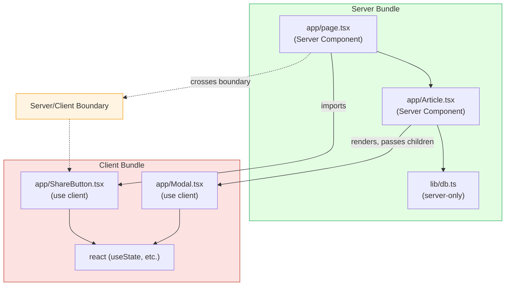
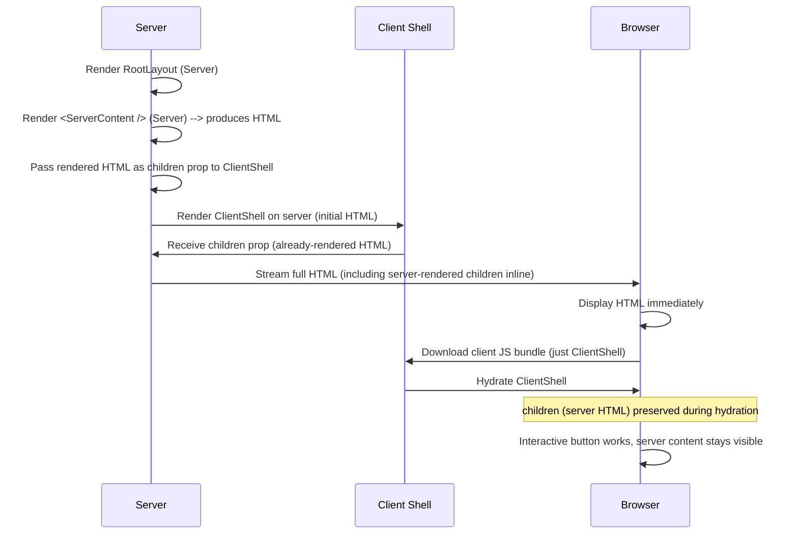
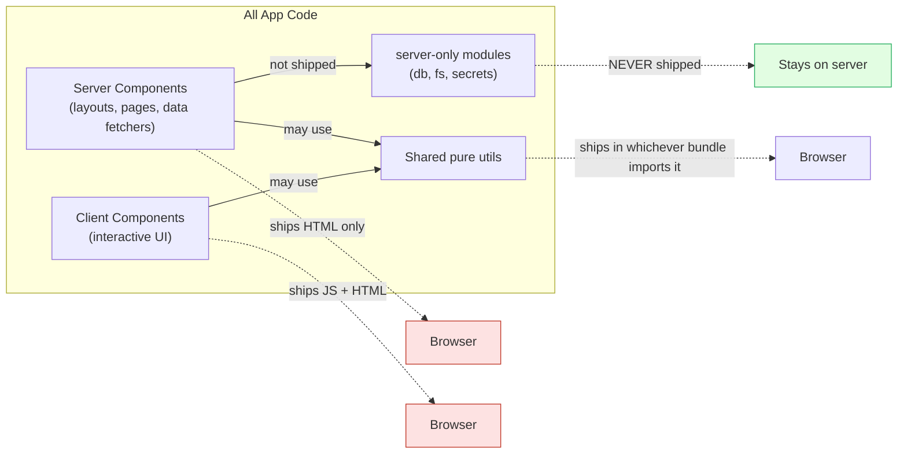

# 4.3 Server and Client Components

> Server Components render only on the server and never ship their source code to the browser. Client Components are the classic React components you already know, opted into the client bundle with `"use client"`. This note covers the model, the composition rules, the boundary, and the patterns that make the split work in practice.

## 4.3.1 Objective

By the end of this note you should be able to:

1. Explain what a Server Component is, what a Client Component is, and why Next.js defaults to Server Components.
2. Describe the `"use client"` directive — where to put it, what it does, and what it does *not* do.
3. Articulate the composition rules between Server and Client Components, including the critical "pass Server Components as `children`" pattern.
4. Identify what code is allowed in each kind of component (hooks, browser APIs, database access, filesystem access).
5. Use the `server-only` package to prevent server-only code from accidentally being imported into Client Components.

## 4.3.2 Background Knowledge

This note assumes you have read [[4.1 App Router Foundations]] (the App Router file conventions, the Server Component default) and [[3.6 Hooks (Built-In)]] (React hooks and why they require a client runtime). You should also be comfortable with the difference between rendering and hydration from [[3.1 JSX and Rendering]] and with the React reconciler's preservation of state across renders from [[3.3 State and Events]].

## 4.3.3 Core Concepts

### 4.3.3.1 What Is a Server Component?

A Server Component is a React component that renders **only on the server**. It produces HTML (or, more precisely, a serialized React Server Component payload) that is sent to the browser, but its source code is **never** included in the client JavaScript bundle. The browser never executes the component function.

Concretely, a Server Component:

- Can be `async` and can `await` data fetching, database queries, filesystem reads, or any server-side operation.
- Cannot use React hooks (`useState`, `useEffect`, `useRef`, etc.) — those require a client runtime.
- Cannot use browser APIs (`window`, `document`, `localStorage`, `IntersectionObserver`).
- Cannot attach event handlers (`onClick`, `onChange`) directly to JSX — those require client-side JavaScript.
- Can import and render Client Components.
- Can import and use npm packages that depend on Node APIs (e.g., a Postgres driver) without bloating the client bundle.

```tsx
// app/blog/[slug]/page.tsx — a Server Component (no directive)
import { db } from "@/lib/db";
import { ShareButton } from "./ShareButton";

export default async function Page({ params }: { params: { slug: string } }) {
  const post = await db.post.findUnique({ where: { slug: params.slug } });
  return (
    <article>
      <h1>{post.title}</h1>
      <div dangerouslySetInnerHTML={{ __html: post.body }} />
      <ShareButton slug={params.slug} />
    </article>
  );
}
```

This component fetches from a database, renders HTML, and includes a Client Component (`ShareButton`) for interactivity. The component's own source code — including the `db.post.findUnique` call and the entire `db` module — never reaches the browser.

### 4.3.3.2 What Is a Client Component?

A Client Component is the classic React component. It renders on the server (for the initial HTML) and then hydrates on the client to become interactive. Its source code is included in the client JavaScript bundle.

A Client Component:

- Is opted in with the `"use client"` directive at the top of the file.
- Can use React hooks, browser APIs, and event handlers.
- Cannot directly access server-only resources (databases, filesystem, environment variables not prefixed with `NEXT_PUBLIC_`).
- Can be hydrated into an interactive element on the client.
- Can import and render other Client Components.

```tsx
// app/Counter.tsx — a Client Component
"use client";
import { useState } from "react";

export function Counter() {
  const [count, setCount] = useState(0);
  return <button onClick={() => setCount((c) => c + 1)}>{count}</button>;
}
```

### 4.3.3.3 Why Server Components Exist

Server Components solve three problems that pure Client Components create:

1. **Client bundle bloat.** In a pure-Client-Component world, every component's source code is shipped to the browser, even components that just render static text. Server Components let you keep dumb, presentational, data-only components on the server — only the interactive parts ship to the browser.

2. **Direct server access.** In the Pages Router, accessing a database from a component required a separate API route (`pages/api/...`) and a `fetch` call from the client. With Server Components, the component itself runs on the server and can query the database directly. The API route boilerplate disappears.

3. **SEO and initial load.** Server Components render their HTML on the server, so the initial response is fully formed HTML that search engines can crawl and that users see immediately. No "blank page then content pops in" flash.

### 4.3.4.4 The Mental Model: Server by Default, Client on Demand

The single most important shift from the Pages Router to the App Router is this: **in the App Router, every component is a Server Component by default.** You opt into the client bundle with `"use client"`. You do not opt into Server Components — they are the baseline.

This is the opposite of the Pages Router, where every component was a Client Component by default. The flip is intentional: the App Router wants you to think "does this *need* to be on the client?" rather than "does this *need* to be on the server?" The default should be the cheapest option (server), and you should opt into the expensive option (client) only when justified.

### 4.3.3.5 The `"use client"` Directive

The `"use client"` directive is a string literal that must appear at the very top of a file, before any imports. It marks the file as a Client Component and everything in the file (and everything the file imports, transitively) as part of the client bundle.

```tsx
"use client";
import { useState } from "react";
// everything below is client code
```

Rules:

- It must be the first thing in the file (only comments and whitespace can precede it).
- It applies to the entire file. You cannot mark only some functions as Client Components.
- It does *not* prevent the component from rendering on the server. Client Components render on the server for the initial HTML and then hydrate. The directive means "this code is allowed to run on the client too," not "this code only runs on the client."
- The boundary propagates downward through imports. A Client Component that imports another file makes that file a Client Component too (unless the imported file is explicitly a Server Component passed via the `children` pattern).

### 4.3.3.6 The Boundary Propagation

The `"use client"` directive creates a boundary. Everything *inside* the boundary (the file with the directive, plus everything it imports) is in the client bundle. Everything *outside* the boundary stays on the server.

```text
Server Component
  - imports Client Component A
      - imports Client Component B   <--  client (propagated from A)
      - imports npm 'lodash'         <--  client (propagated from A)
  - imports Server Component C       <--  server (no directive)
```

A Server Component can import a Client Component. The boundary is crossed at the import. The Client Component (and its subtree of imports) is in the client bundle.

A Client Component cannot import a Server Component directly. If it tries, the imported file is silently treated as a Client Component — which means server-only code in that file (database access, etc.) will break the build or, worse, leak into the client bundle.

To render Server Component content inside a Client Component, you must pass it as a prop — typically the `children` prop. This is the canonical pattern, covered in detail below.

### 4.3.3.7 What Goes Where

| Capability | Server Component | Client Component |
|------------|------------------|------------------|
| `useState`, `useReducer`, `useEffect`, `useRef` |  No |  Yes |
| `useCallback`, `useMemo` |  No |  Yes |
| `use()` (React 19 promise unwrapping) |  No (without Suspense) |  Yes |
| `onClick`, `onChange`, event handlers |  No |  Yes |
| Browser APIs (`window`, `document`, `localStorage`) |  No |  Yes (after mount) |
| `fetch()` directly |  Yes (with cache control) |  Yes (no caching) |
| Database access (Prisma, Drizzle, raw SQL) |  Yes |  No |
| Filesystem access (`fs`, `path`) |  Yes |  No |
| Environment variables (without `NEXT_PUBLIC_` prefix) |  Yes |  No |
| `next/headers` (cookies, headers) |  Yes |  No |
| `next/navigation` `useRouter`, `usePathname` |  No |  Yes |
| `redirect()` from `next/navigation` |  Yes |  Yes |
| `cookies()`, `headers()` from `next/headers` |  Yes |  No |
| Render `<html>`, `<body>` |  Yes (root layout only) |  No |
| Be `async` |  Yes |  No (hooks can't be async) |
| Import npm packages that depend on Node APIs |  Yes |  No (bundle error) |
| Use `className`, `style`, any HTML attributes |  Yes |  Yes |

### 4.3.3.8 The Composition Rules

The four composition rules:

1. **Server Component  -->  Server Component**: allowed, both stay on the server.
2. **Server Component  -->  Client Component**: allowed, the Client Component renders on the server for initial HTML and hydrates on the client.
3. **Client Component  -->  Client Component**: allowed, both are in the client bundle.
4. **Client Component  -->  Server Component (via import)**: **not allowed** — the imported file silently becomes a Client Component. If it contains server-only code (database access), the build will fail or leak server secrets into the client bundle.

Rule 4 is the gotcha. To render Server Component content inside a Client Component, you use the **children-as-server-component pattern**:

```tsx
// app/page.tsx — Server Component
import { ClientShell } from "./ClientShell";
import { ServerContent } from "./ServerContent";

export default function Page() {
  return (
    <ClientShell>
      <ServerContent />  {/* Server Component passed as children */}
    </ClientShell>
  );
}
```

```tsx
// app/ClientShell.tsx — Client Component
"use client";
import { useState } from "react";

export function ClientShell({ children }: { children: React.ReactNode }) {
  const [open, setOpen] = useState(false);
  return (
    <div>
      <button onClick={() => setOpen(!open)}>Menu</button>
      {open && <nav>...</nav>}
      {children}  {/* This is the Server Component's rendered output */}
    </div>
  );
}
```

Why does this work? Because the Server Component (`ServerContent`) is rendered by its parent (`Page`, also a Server Component), which produces the rendered output (HTML/RSC payload). The output is then *passed* as the `children` prop to `ClientShell`. The Client Component receives already-rendered output, not the source component. It never imports the Server Component — it just renders the slot.

This is the single most important pattern in the App Router. Memorize it.

### 4.3.3.9 Why Hooks Don't Work in Server Components

React hooks (`useState`, `useEffect`, etc.) work by maintaining per-component-instance state in a runtime that lives in the browser. A Server Component runs once on the server, produces output, and is then thrown away — there is no persistent runtime, no re-render loop, no concept of "state" that persists between renders.

Concretely, `useState(0)` on the server would have nowhere to store the state, no way to receive updates, and no way to trigger a re-render. The function would just return `0` on every call, never updating. Worse, `useEffect` would have no DOM to attach to and no scheduling loop to defer to.

The React team therefore made hooks simply illegal in Server Components. Calling a hook in a Server Component throws at runtime: "hooks can only be called inside Client Components."

### 4.3.3.10 The `server-only` Package

Sometimes you have a module that should never end up in the client bundle — a module with database credentials, a module that reads environment variables you don't want exposed, a module that uses `fs` to read server-side config. To enforce that such a module is only ever imported from Server Components, use the `server-only` package.

```bash
npm install server-only
```

```ts
// lib/db.ts
import "server-only";
import { PrismaClient } from "@prisma/client";

const prisma = new PrismaClient();
export { prisma };
```

The `server-only` package exports a single value that throws a build error if it ends up in the client bundle. If a Client Component tries to import `lib/db.ts`, the build fails with a clear message. If only Server Components import it, the build succeeds.

The companion package `client-only` does the reverse — it throws if a module is imported from a Server Component. Use it for client-side utility libraries that should never run on the server.

## 4.3.4 Detailed Walkthrough

### 4.3.4.1 The Rendering Waterfall

When a request comes in for an App Router page, Next.js renders the route's component tree on the server. The render proceeds top-down:

1. The root layout renders. (Server Component by default.)
2. Nested layouts render in order. (Server Components by default.)
3. The page renders. (Server Component by default.)
4. Any Client Components in the tree render on the server for their initial HTML.
5. The server streams the HTML (and RSC payload) to the browser.
6. The browser parses the HTML and displays it. The user sees content immediately.
7. The browser downloads the client JavaScript bundle (which includes only Client Components and their imports).
8. React hydrates the Client Components, attaching event handlers and replacing any server-rendered placeholders with interactive elements.

The waterfall is important: a slow data fetch in a Server Component delays the initial HTML, but only the part of the tree below the slow fetch (if you use Suspense to wrap it). The shell can be streamed first, with the slow part filled in later.

### 4.3.4.2 What "use client" Actually Does

When the Next.js compiler encounters `"use client"` at the top of a file:

1. It marks the file as a Client Module.
2. It includes the file (and all its imports, transitively, except for Server Components passed via the children pattern) in the client bundle.
3. It generates a "client reference" for the component — a placeholder that the Server Component renders as if it were a normal component, but which resolves to a client-side component on hydration.

The directive does *not*:

- Prevent the component from rendering on the server. Client Components render on the server for the initial HTML.
- Force the component to skip server rendering. There is no way to "skip SSR" for a Client Component in the App Router — they always render on the server first.
- Make the component "client-only." If you truly need client-only rendering (e.g., for a charting library that crashes during SSR), you must dynamically import it with `ssr: false`:

```tsx
"use client";
import dynamic from "next/dynamic";

const Chart = dynamic(() => import("./Chart"), { ssr: false });
```

Note that `dynamic` with `ssr: false` is itself only usable in Client Components in the App Router.

### 4.3.4.3 The Children Pattern in Depth

The "children pattern" is so important it deserves a worked example. Consider a sidebar that can collapse (client-side state) and contains server-rendered navigation (database-driven):

```tsx
// app/layout.tsx — Server Component
import { Sidebar } from "./Sidebar";
import { NavItems } from "./NavItems";

export default function RootLayout({ children }: { children: React.ReactNode }) {
  return (
    <html lang="en">
      <body>
        <div className="flex">
          <Sidebar>
            <NavItems />  {/* Server Component passed as children */}
          </Sidebar>
          <main>{children}</main>
        </div>
      </body>
    </html>
  );
}
```

```tsx
// app/Sidebar.tsx — Client Component
"use client";
import { useState } from "react";

export function Sidebar({ children }: { children: React.ReactNode }) {
  const [collapsed, setCollapsed] = useState(false);
  return (
    <aside className={collapsed ? "w-12" : "w-64"}>
      <button onClick={() => setCollapsed((c) => !c)}>
        {collapsed ? "Expand" : "Collapse"}
      </button>
      {!collapsed && children}
    </aside>
  );
}
```

```tsx
// app/NavItems.tsx — Server Component
import { db } from "@/lib/db";

export async function NavItems() {
  const sections = await db.section.findMany();
  return (
    <nav>
      {sections.map((s) => (
        <a key={s.id} href={`/section/${s.id}`}>{s.name}</a>
      ))}
    </nav>
  );
}
```

What happens at render time:

1. `RootLayout` (Server) starts rendering.
2. It encounters `<Sidebar>`. `Sidebar` is a Client Component, but the Server renders it for the initial HTML. The Server passes `<NavItems />` as the `children` prop.
3. The Server renders `NavItems` (Server Component), producing the HTML for the nav. This involves a database query.
4. The Server takes that rendered HTML and passes it as `children` to `Sidebar`.
5. `Sidebar` (Client Component) renders its initial HTML on the server, including the children HTML inline.
6. The full HTML is sent to the browser.
7. The browser shows the sidebar with the nav items visible.
8. The client bundle (just `Sidebar`, plus its `useState` import from React) is downloaded.
9. React hydrates `Sidebar`, attaching the `onClick` handler. The `children` (already-rendered HTML from `NavItems`) is preserved during hydration — React knows it was already server-rendered and does not re-render it.

The key insight: the database query happens on the server, the rendered HTML is sent over the wire, and only the `Sidebar`'s interactivity code is in the client bundle. The `NavItems` source code (including the `db` import) never reaches the browser.

### 4.3.4.4 Why Server Components Cannot Be Passed as Regular Props

You might wonder: why can't you just `<Sidebar nav={<NavItems />} />` and pass the Server Component as a regular prop named `nav`? Actually, you *can*:

```tsx
<Sidebar nav={<NavItems />}>
  <main>{children}</main>
</Sidebar>
```

```tsx
"use client";
export function Sidebar({ nav, children }: { nav: React.ReactNode; children: React.ReactNode }) {
  // ...
}
```

The `nav` prop receives already-rendered Server Component output, just like `children`. The pattern works for any prop whose value is a React element (i.e., JSX wrapped in `< />`). What does *not* work is passing a component *function*:

```tsx
//  This does NOT work — you cannot pass a Server Component function to a Client Component.
<Sidebar renderNav={() => <NavItems />} />
```

The reason: the Client Component would have to call `renderNav()` to get the rendered output, but the function body closes over the Server Component `NavItems`, which would force `NavItems` to be in the client bundle. That defeats the point.

The rule, then: Server Components can be passed to Client Components only as React *elements* (already-evaluated JSX), not as *functions* that produce elements.

### 4.3.4.5 Event Handlers and the Client Boundary

Event handlers (`onClick`, `onChange`, `onSubmit`, etc.) are functions that must execute in the browser. They can only be attached to JSX in Client Components. A Server Component that tries to attach an event handler will throw a build error.

```tsx
//  Build error in a Server Component
export default function Page() {
  return <button onClick={() => alert("hi")}>Click</button>;
}
```

```tsx
//  Extract to a Client Component
// app/ClickButton.tsx
"use client";
export function ClickButton() {
  return <button onClick={() => alert("hi")}>Click</button>;
}
```

```tsx
// app/page.tsx
import { ClickButton } from "./ClickButton";
export default function Page() {
  return (
    <main>
      <ClickButton />
    </main>
  );
}
```

The boundary between "no event handlers" and "event handlers" is the `"use client"` line. Every interactive element forces a boundary somewhere above it.

### 4.3.4.6 Where to Put the Boundary

The general principle: **put the `"use client"` boundary as low as possible in the tree.** The lower the boundary, the more code stays on the server, and the smaller the client bundle.

Consider a product page with a non-interactive product description (server-rendered) and an interactive "Add to cart" button. Two options:

**Option A — page is a Client Component:**

```tsx
// app/products/[id]/page.tsx
"use client";
// entire page is in client bundle, including the product description JSX
```

**Option B — page is a Server Component, only the button is a Client Component:**

```tsx
// app/products/[id]/page.tsx — Server Component
import { AddToCartButton } from "./AddToCartButton";
// only AddToCartButton is in client bundle
```

Option B is correct. The product description is dumb HTML; only the button needs interactivity. Push the boundary down to the button.

### 4.3.4.7 The Shared Module Pattern

Sometimes you have a utility function that's used by both Server and Client Components. The function itself doesn't depend on the server or the client — it's pure logic. Where does it go?

A plain `.ts` file with no `"use client"` directive can be imported by both Server and Client Components. The file becomes part of whichever bundle imports it. If imported by a Server Component, it's server-side. If imported by a Client Component, it's client-side. If imported by both, it's in both bundles.

This is fine for pure logic. It is *not* fine for code that uses server-only APIs (database, `fs`) — that code must be in a file marked with `import "server-only"` to prevent accidental client import.

## 4.3.5 Practical Examples

### 4.3.5.1 A Server Component That Fetches Data

```tsx
// app/products/page.tsx — Server Component
import Link from "next/link";
import { getProducts } from "@/lib/products";

export default async function ProductsPage() {
  const products = await getProducts();
  return (
    <ul>
      {products.map((p) => (
        <li key={p.id}>
          <Link href={`/products/${p.id}`}>{p.name}</Link>
          <span> — ${p.price}</span>
        </li>
      ))}
    </ul>
  );
}
```

```ts
// lib/products.ts
import "server-only";
import { db } from "./db";

export async function getProducts() {
  return db.product.findMany();
}
```

No `"use client"` directive. No hooks. No event handlers. The component is async, fetches from the database, and renders HTML. The `server-only` import prevents `lib/products.ts` from accidentally being imported into a Client Component.

### 4.3.5.2 A Client Component with State and Effects

```tsx
// app/ThemeToggle.tsx — Client Component
"use client";
import { useEffect, useState } from "react";

export function ThemeToggle() {
  const [theme, setTheme] = useState<"light" | "dark">("light");

  useEffect(() => {
    const saved = localStorage.getItem("theme") as "light" | "dark" | null;
    if (saved) setTheme(saved);
  }, []);

  useEffect(() => {
    document.documentElement.dataset.theme = theme;
    localStorage.setItem("theme", theme);
  }, [theme]);

  return (
    <button onClick={() => setTheme((t) => (t === "light" ? "dark" : "light"))}>
      Switch to {theme === "light" ? "dark" : "light"} mode
    </button>
  );
}
```

This component uses `useState`, `useEffect`, `localStorage`, `document`, and `onClick`. All require the client. The `"use client"` directive opts the entire file into the client bundle.

### 4.3.5.3 The Children Pattern in a Real Layout

```tsx
// app/dashboard/layout.tsx — Server Component
import { InteractiveSidebar } from "./InteractiveSidebar";
import { db } from "@/lib/db";

export default async function DashboardLayout({ children }: { children: React.ReactNode }) {
  const user = await db.user.findFirst();
  return (
    <div className="flex">
      <InteractiveSidebar user={user}>
        {/* children is the page; it stays server-rendered */}
        {children}
      </InteractiveSidebar>
    </div>
  );
}
```

```tsx
// app/dashboard/InteractiveSidebar.tsx — Client Component
"use client";
import { useState } from "react";

export function InteractiveSidebar({ user, children }: { user: { name: string }; children: React.ReactNode }) {
  const [open, setOpen] = useState(true);
  return (
    <>
      <button onClick={() => setOpen((o) => !o)}>
        {open ? "Hide" : "Show"} menu ({user.name})
      </button>
      {open && <aside>{children}</aside>}
    </>
  );
}
```

The `user` data is fetched on the server and passed as a serializable prop (the user object must be JSON-serializable to cross the server/client boundary). The `children` prop is the server-rendered page content.

### 4.3.5.4 Using `next/dynamic` for Client-Only Components

```tsx
// app/dashboard/page.tsx — Server Component
import dynamic from "next/dynamic";

const HeavyChart = dynamic(() => import("./HeavyChart"));
// HeavyChart can be a Client Component; it's loaded on demand

export default function Page() {
  return (
    <main>
      <h1>Dashboard</h1>
      <HeavyChart />
    </main>
  );
}
```

If `HeavyChart` is a Client Component, the import works fine — Server Components can import Client Components. The `dynamic` wrapper splits it into a separate chunk that loads on demand, reducing the initial bundle size.

For a true client-only component (no SSR), the call must be inside a Client Component:

```tsx
// app/ChartWrapper.tsx — Client Component
"use client";
import dynamic from "next/dynamic";

const Chart = dynamic(() => import("./Chart"), { ssr: false });

export function ChartWrapper() {
  return <Chart />;
}
```

## 4.3.6 Mermaid Diagrams

### 4.3.6.1 The Server/Client Boundary



### 4.3.6.2 The Children Pattern — How Server Content Crosses the Boundary



### 4.3.6.3 What Ships to the Browser



## 4.3.7 Common Mistakes

1. **Adding `"use client"` to every file.** This defeats the entire purpose of the App Router. You end up with the Pages Router's bundle size plus the App Router's stricter conventions. Only add `"use client"` when you need interactivity or browser APIs.

2. **Trying to use `useState` in a Server Component.** The error is "useState is not a function" or similar. The fix is to either add `"use client"` to the file (if the whole component needs to be interactive) or extract the interactive piece into a separate Client Component.

3. **Importing a Server Component into a Client Component.** This silently promotes the imported file to a Client Component. If the file uses server-only code (database, `fs`), the build will fail with a confusing error about `fs` not being available in the browser. The fix is to use the `children` pattern — pass the Server Component as a JSX element, not via import.

4. **Forgetting that Client Components also render on the server.** Many developers assume `"use client"` means "client-only." It does not — Client Components render on the server for the initial HTML. If your Client Component crashes during SSR (e.g., it accesses `window` at the top level), you need to guard with `typeof window !== "undefined"` or use `useEffect` to defer browser-API access.

5. **Passing non-serializable props across the boundary.** When a Server Component renders a Client Component, the props must be JSON-serializable. You cannot pass a function, a class instance, or a Symbol. The error is usually "passed a function as a prop" — the fix is to either pass plain data or move the function into the Client Component.

6. **Treating `"use client"` as "use server".** There is a separate `"use server"` directive, but it is for Server Actions (functions callable from the client), not for marking components as Server Components. See [[4.7 Server Actions and Forms]]. Marking a component file with `"use server"` will produce an error.

7. **Calling hooks conditionally.** Even in a Client Component, hooks must be called unconditionally at the top of the component. The App Router does not change this React rule, but the boundary confusion leads some developers to try wrapping `useState` in `if (typeof window !== "undefined")`, which violates the rules of hooks.

8. **Putting `next/headers` (cookies, headers) in a Client Component.** These are server-only APIs. They throw if called in a Client Component. If you need cookie/header data on the client, read it on the server and pass as a prop.

## 4.3.8 Best Practices

1. **Default to Server Components.** Write every component as a Server Component until you have a concrete reason to opt into the client. The most common reasons: event handlers, hooks, browser APIs.

2. **Push the `"use client"` boundary to the leaves.** When a page has both server-rendered content and interactive elements, isolate the interactive elements into their own small Client Component files. The page and layout remain Server Components.

3. **Use the `children` pattern for interactive shells around server content.** This is the only correct way to wrap server-rendered content in an interactive Client Component. Memorize the pattern.

4. **Mark server-only modules with `import "server-only"`.** Any module that uses `fs`, database drivers, or environment variables without `NEXT_PUBLIC_` prefix should have this guard. It prevents accidental client imports.

5. **Keep props crossing the boundary serializable.** Plain objects, arrays, strings, numbers, booleans, null. No functions, no class instances, no Symbols. If you need to pass complex data, serialize it to JSON first.

6. **Don't fight the boundary — embrace it.** If you find yourself wanting to pass functions across the boundary or import Server Components into Client Components, you are probably modeling the problem wrong. Reconsider the split: where does the state actually live?

7. **Use `next/dynamic` for heavy client-only components.** If a Client Component is large (e.g., a charting library, a rich text editor), dynamically import it so it loads on demand rather than blocking the initial bundle.

8. **Read the React Server Components RFC.** The original RFC (github.com/reactjs/rfcs/blob/main/text/0188-server-components.md) is the canonical reference for the model. Reading it once will clarify more than any number of tutorials.

## 4.3.9 Mini Exercises

### Exercise 1 — Classify Each File

For each of the following files, identify whether it is a Server Component, Client Component, or invalid. Justify each answer.

```tsx
// File A: app/page.tsx
import { useState } from "react";
export default function Page() {
  const [n, setN] = useState(0);
  return <button onClick={() => setN(n + 1)}>{n}</button>;
}
```

```tsx
// File B: app/about/page.tsx
export default function About() {
  return <div>About us</div>;
}
```

```tsx
// File C: app/products/[id]/page.tsx
import { db } from "@/lib/db";
export default async function Product({ params }: { params: { id: string } }) {
  const product = await db.product.findUnique({ where: { id: params.id } });
  return <h1>{product.name}</h1>;
}
```

```tsx
// File D: app/Widget.tsx
"use client";
import { readFile } from "fs";
export function Widget() {
  const content = readFile("/etc/passwd", "utf-8");
  return <pre>{content}</pre>;
}
```

**Worked solution:**

- **File A** — Invalid. It uses `useState` and `onClick` but has no `"use client"` directive. Server Components cannot use hooks. Fix: add `"use client"` at the top.
- **File B** — Server Component. No directive, no hooks, no event handlers, no async. It is the App Router default.
- **File C** — Server Component. Async, fetches from the database, no hooks or event handlers. The `db` import is server-side and stays on the server.
- **File D** — Invalid. It has `"use client"` (so it's a Client Component), but it imports `fs`, a Node-only module. The build will fail because `fs` cannot be bundled for the browser. Fix: remove the `fs` import; if file reading is needed, do it in a Server Component and pass the data as a prop.

### Exercise 2 — Fix the Boundary Violation

This code fails to build. Find the bug and fix it using the children pattern.

```tsx
// app/page.tsx
import { ClientLayout } from "./ClientLayout";
import { ServerContent } from "./ServerContent";

export default function Page() {
  return (
    <ClientLayout content={ServerContent} />
  );
}
```

```tsx
// app/ClientLayout.tsx
"use client";
import { useState } from "react";

export function ClientLayout({ content }: { content: () => JSX.Element }) {
  const [open, setOpen] = useState(true);
  return (
    <div>
      <button onClick={() => setOpen(!open)}>Toggle</button>
      {open && content()}
    </div>
  );
}
```

```tsx
// app/ServerContent.tsx
import { db } from "@/lib/db";
export async function ServerContent() {
  const items = await db.item.findMany();
  return <ul>{items.map((i) => <li key={i.id}>{i.name}</li>)}</ul>;
}
```

**Worked solution:**

The bug: `Page` passes `ServerContent` (the component function itself) as the `content` prop, not a rendered element. `ClientLayout` then calls `content()` to render it. This forces `ServerContent` to be in the client bundle, but `ServerContent` imports `db` (server-only), so the build fails.

The fix uses the `children` pattern — pass the rendered element, not the component function:

```tsx
// app/page.tsx
import { ClientLayout } from "./ClientLayout";
import { ServerContent } from "./ServerContent";

export default function Page() {
  return (
    <ClientLayout>
      <ServerContent />
    </ClientLayout>
  );
}
```

```tsx
// app/ClientLayout.tsx
"use client";
import { useState } from "react";

export function ClientLayout({ children }: { children: React.ReactNode }) {
  const [open, setOpen] = useState(true);
  return (
    <div>
      <button onClick={() => setOpen(!open)}>Toggle</button>
      {open && children}
    </div>
  );
}
```

`ServerContent` is now rendered by `Page` (a Server Component), producing HTML that is passed as the `children` prop. The `db` import stays on the server. `ClientLayout` only ships its own source code (plus React's `useState`) to the browser.

### Exercise 3 — Guard a Browser API

The following Client Component crashes during SSR. Diagnose and fix.

```tsx
// app/WindowSize.tsx
"use client";
import { useState } from "react";

export function WindowSize() {
  const [size, setSize] = useState({ w: window.innerWidth, h: window.innerHeight });
  // ...
  return <span>{size.w} x {size.h}</span>;
}
```

**Worked solution:**

Diagnosis: Client Components render on the server for the initial HTML. On the server, `window` is undefined, so `window.innerWidth` throws `ReferenceError: window is not defined`.

Fix: Initialize state with a safe default, then update it in `useEffect` (which only runs on the client):

```tsx
// app/WindowSize.tsx
"use client";
import { useEffect, useState } from "react";

export function WindowSize() {
  const [size, setSize] = useState({ w: 0, h: 0 });

  useEffect(() => {
    setSize({ w: window.innerWidth, h: window.innerHeight });
    const onResize = () => setSize({ w: window.innerWidth, h: window.innerHeight });
    window.addEventListener("resize", onResize);
    return () => window.removeEventListener("resize", onResize);
  }, []);

  return <span>{size.w} x {size.h}</span>;
}
```

The pattern: never access browser globals at the top level of a Client Component. Always do it inside `useEffect`, which runs only on the client after hydration.

### Exercise 4 — Split a Page into Server and Client Components

Refactor this monolithic Client Component page into a Server Component page that wraps a small Client Component for interactivity.

```tsx
// app/page.tsx
"use client";
import { useState } from "react";
import { getProducts } from "@/lib/products";

export default function Page() {
  const [filter, setFilter] = useState("");
  const products = getProducts(); // assume this is now sync somehow
  const filtered = products.filter((p) => p.name.includes(filter));
  return (
    <main>
      <input value={filter} onChange={(e) => setFilter(e.target.value)} placeholder="Filter" />
      <ul>
        {filtered.map((p) => <li key={p.id}>{p.name}</li>)}
      </ul>
    </main>
  );
}
```

**Worked solution:**

The page mixes data fetching (server-appropriate) with interactivity (client-appropriate). Split into:

```tsx
// app/page.tsx — Server Component
import { getProducts } from "@/lib/products";
import { FilterInput } from "./FilterInput";

export default async function Page() {
  const products = await getProducts();
  return (
    <main>
      <FilterInput products={products} />
    </main>
  );
}
```

```tsx
// app/FilterInput.tsx — Client Component
"use client";
import { useState } from "react";

type Product = { id: string; name: string };

export function FilterInput({ products }: { products: Product[] }) {
  const [filter, setFilter] = useState("");
  const filtered = products.filter((p) => p.name.includes(filter));
  return (
    <>
      <input value={filter} onChange={(e) => setFilter(e.target.value)} placeholder="Filter" />
      <ul>
        {filtered.map((p) => <li key={p.id}>{p.name}</li>)}
      </ul>
    </>
  );
}
```

The Server Component fetches the products on the server. The Client Component receives them as a serializable prop and handles the filter input. The data never ships as a fetch — it's passed as a prop. The filter logic runs in the browser.

Trade-off: if the product list is huge, sending it all to the client is wasteful. In that case, the filter would be done server-side (using `searchParams`). For small lists, the client-side filter is fine.

### Exercise 5 — Add a `server-only` Guard

You have a module that reads an environment variable with a secret API key. Add a guard so it can never accidentally end up in the client bundle.

```ts
// lib/secrets.ts
export const apiKey = process.env.SECRET_API_KEY;
```

**Worked solution:**

```bash
npm install server-only
```

```ts
// lib/secrets.ts
import "server-only";

export const apiKey = process.env.SECRET_API_KEY;
```

Now any attempt to import `lib/secrets.ts` from a Client Component will fail the build with a clear error message. The guard is the `import "server-only"` line at the top — the package exports a value that throws if it ends up in a client bundle.

If you also need a `NEXT_PUBLIC_`-prefixed variable for client use, expose it separately:

```ts
// lib/secrets.ts
import "server-only";
export const apiKey = process.env.SECRET_API_KEY;
export const publicSiteName = process.env.NEXT_PUBLIC_SITE_NAME;
```

The `publicSiteName` is fine to use from the client (it's `NEXT_PUBLIC_`-prefixed, so Next.js exposes it). The `apiKey` is server-only. The `server-only` import prevents the entire module from being imported from Client Components — which is the right behavior, since you don't want to expose the module at all from the client.

## 4.3.10 Summary

Server Components render only on the server and never ship their source code to the browser. They can be `async`, can access databases and the filesystem directly, and cannot use hooks or browser APIs. Client Components are the classic React components, opted into the client bundle with `"use client"`. They can use hooks, browser APIs, and event handlers. In the App Router, every component is a Server Component by default. The `"use client"` directive creates a boundary that propagates downward through imports. Server Components can be passed to Client Components only as React elements (typically via the `children` prop), never as component functions. The `server-only` package enforces that server-only modules never end up in the client bundle.

## 4.3.11 Related Notes

- [[4.1 App Router Foundations]] — the App Router and the file conventions.
- [[4.2 Routing, Layouts, and Templates]] — where layouts and templates fit in the Server/Client model.
- [[4.4 Rendering Strategies]] — how Server/Client Components interact with static, dynamic, and streaming rendering.
- [[4.5 Data Fetching]] — how to fetch data in Server Components (and the rules for fetching in Client Components).
- [[4.7 Server Actions and Forms]] — the `"use server"` directive and how it differs from `"use client"`.
- [[3.6 Hooks (Built-In)]] — why hooks require a client runtime.
- [[3.12 Suspense, Lazy Loading, and Code Splitting]] — Suspense, which is the basis for streaming Server Components.
