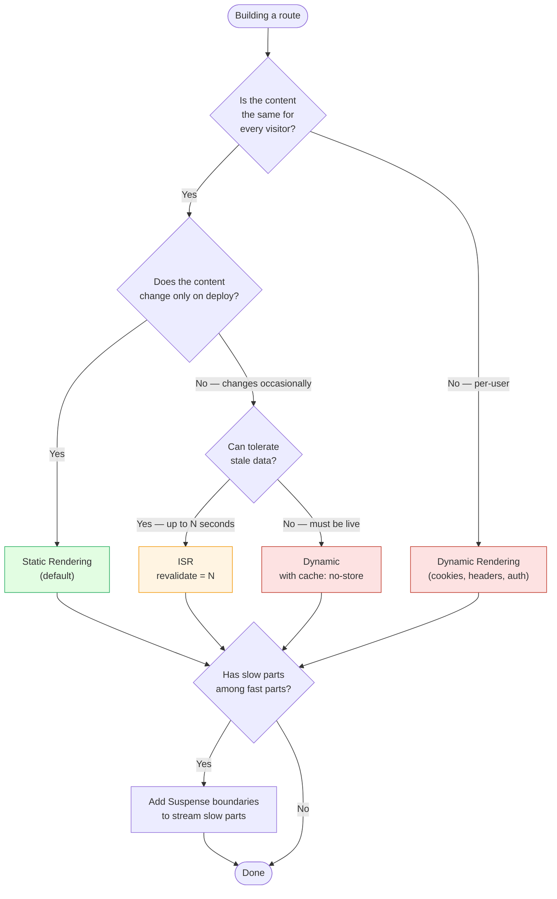
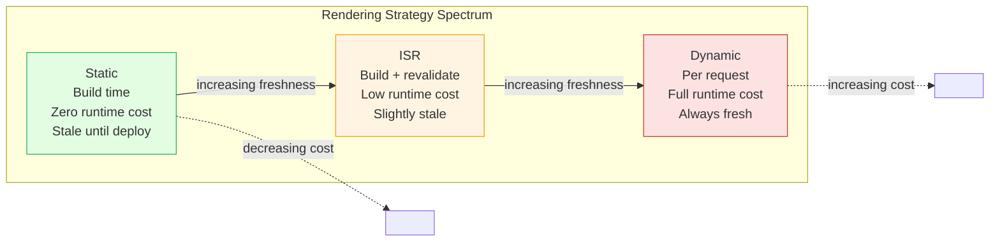
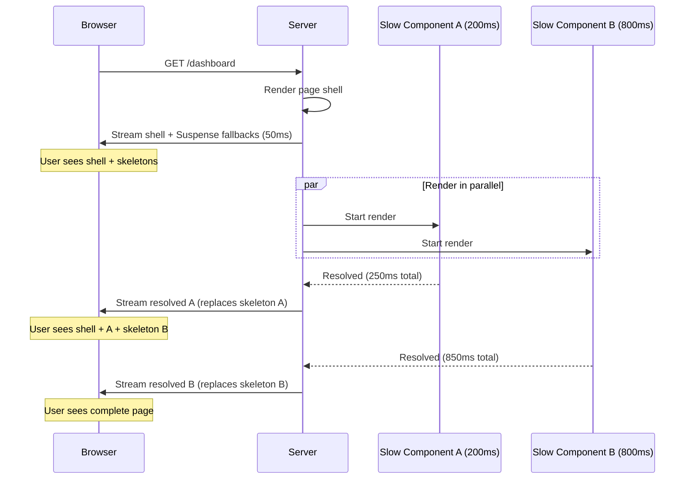

# 4.4 Rendering Strategies

> Next.js supports four main rendering strategies: Static Rendering (build time), Dynamic Rendering (request time), Incremental Static Regeneration (static with periodic refresh), and Streaming (progressive HTML via Suspense). This note covers how Next.js chooses between them, how to force a specific strategy per route, and the tradeoffs you must reason about for every route you build.

## 4.4.1 Objective

By the end of this note you should be able to:

1. Explain the four rendering strategies and when to use each.
2. Describe how Next.js decides between static and dynamic rendering by default, and which APIs force dynamic rendering.
3. Use the `dynamic` route segment config (`'auto' | 'force-static' | 'force-dynamic' | 'error'`) and the `revalidate` option to control rendering per route.
4. Use `generateStaticParams` to prerender dynamic routes at build time.
5. Reason about the tradeoffs of build time, runtime cost, freshness, and SEO when choosing a strategy.

## 4.4.2 Background Knowledge

This note assumes you have read [[4.1 App Router Foundations]] (file conventions, the App Router model), [[4.2 Routing, Layouts, and Templates]] (dynamic segments), and [[4.3 Server and Client Components]] (the Server/Client boundary). You should also be comfortable with HTTP caching concepts (cache headers, ETags, conditional requests) and with React Suspense from [[3.12 Suspense, Lazy Loading, and Code Splitting]].

## 4.4.3 Core Concepts

### 4.4.3.1 The Four Strategies

The App Router supports four rendering strategies. Each is a different point on the spectrum of "when does the HTML get produced, and how fresh is it."

| Strategy | When HTML is produced | Freshness | Cost | SEO |
|----------|----------------------|-----------|------|-----|
| **Static Rendering** | Build time | Stale until next deploy | One-time build cost | Excellent |
| **Dynamic Rendering** | Every request | Always fresh | Per-request server cost | Excellent |
| **ISR** | Build time + revalidation interval | Stale-while-revalidate | Build + occasional revalidation | Excellent |
| **Streaming** | Per-request, progressively | Fresh (or per-segment strategy) | Per-request server cost | Excellent (with caveats) |

Note that streaming is *orthogonal* to static vs dynamic — a static page can stream (rare), and a dynamic page can stream (common). Streaming is a delivery mechanism, not a freshness strategy. We list it as a fourth strategy because it changes how you build pages.

### 4.4.3.2 Static Rendering (Default)

By default, Next.js renders every route **statically** at build time. The HTML and the React Server Component payload are produced once, cached, and served to every visitor. There is no per-request server cost.

Static rendering is appropriate when:

- The page content is the same for every visitor (a marketing page, a blog post, documentation).
- The content changes only when you deploy a new build.
- You want the fastest possible first byte and the lowest possible server cost.

A static route shows up with a `○` (Static) marker in the build output:

```text
Route (app)                              Size     First Load JS
┌ ○ /                                    1.2 kB         88 kB
  - ○ /about                               500 B          88 kB
  - ○ /blog/[slug]                         2.1 kB         90 kB
```

### 4.4.3.3 Dynamic Rendering

A route is rendered **dynamically** when Next.js detects that the route uses a dynamic API (one that can only be answered at request time). The HTML is produced on every request, with per-request data (cookies, search params, headers) available.

Dynamic APIs that force dynamic rendering:

- `cookies()` and `headers()` from `next/headers`
- `searchParams` prop in a page
- `fetch(url, { cache: 'no-store' })` — opt out of caching for a specific fetch
- `fetch(url, { next: { revalidate: 0 } })` — opt out of caching via revalidate
- The `noStore()` function from `next/server`

When any of these is called during render, Next.js switches the entire route to dynamic rendering. A dynamic route shows up with a `ƒ` (Dynamic) marker in the build output.

Dynamic rendering is appropriate when:

- The page content depends on the request (user-specific data, A/B test variant, geolocation).
- The page reads cookies or headers.
- The data is always fresh and caching is unacceptable (e.g., a real-time stock ticker).

### 4.4.3.4 Incremental Static Regeneration (ISR)

ISR is a hybrid: the page is rendered statically at build time, then re-rendered in the background at a configurable interval. Visitors see the cached static page; the first visitor after the revalidation interval triggers a background regeneration; subsequent visitors see the new static page.

ISR is configured per route with the `revalidate` segment config:

```tsx
// app/blog/[slug]/page.tsx
export const revalidate = 60; // revalidate at most every 60 seconds

export default async function Page({ params }: { params: { slug: string } }) {
  const post = await fetch(`https://api.example.com/posts/${params.slug}`);
  // ...
}
```

The `revalidate = 60` means: serve the cached version, but if the cache is older than 60 seconds, trigger a background regeneration on the next request. The visitor who triggered the regeneration still sees the old cache; the next visitor sees the new one.

ISR is appropriate when:

- The data changes occasionally but not on every request (a blog, a product catalog, a news site).
- You want the performance of static rendering with the freshness of dynamic.
- You can tolerate up to `revalidate` seconds of staleness.

### 4.4.3.5 Streaming

Streaming is the progressive delivery of HTML as it becomes ready. Next.js uses React Suspense boundaries to delineate the parts of a page that can be streamed independently. The server sends the page shell (the parts that resolve quickly) immediately, then streams in the slower parts as they complete.

A page with three data sources, each taking 200 ms, 800 ms, and 300 ms respectively:

- Without streaming: total time to first byte ~800 ms (the slowest), no content visible until then.
- With streaming: page shell visible in ~50 ms, then the 200 ms part, then the 300 ms part, then the 800 ms part. Total time to fully loaded is still ~800 ms, but the user sees content much earlier.

Streaming is enabled by wrapping slow parts in `<Suspense>`:

```tsx
// app/dashboard/page.tsx
import { Suspense } from "react";

export default function Page() {
  return (
    <main>
      <h1>Dashboard</h1>
      <Suspense fallback={<p>Loading metrics...</p>}>
        <Metrics />  {/* slow */}
      </Suspense>
      <Suspense fallback={<p>Loading activity...</p>}>
        <Activity />  {/* slow */}
      </Suspense>
    </main>
  );
}
```

The `Metrics` and `Activity` components (Server Components) can be `async` and `await` their data. Next.js streams the page shell first, then each Suspense boundary as it resolves.

### 4.4.3.6 How Next.js Decides

The decision tree is:

1. If the route segment config has `dynamic = 'force-static'`, render statically (and ignore dynamic APIs, with caveats).
2. If the route segment config has `dynamic = 'force-dynamic'`, render dynamically.
3. If the route segment config has `dynamic = 'error'`, render statically and throw a build error if any dynamic API is used.
4. Otherwise (default `'auto'`), Next.js inspects the route's render. If it uses any dynamic API (`cookies`, `headers`, `searchParams`, `fetch` with `no-store`), the route is dynamic. Otherwise, it's static.

This is called **opting out via dynamic APIs**. The presence of a dynamic API anywhere in the route's render (including in layouts and async components it calls) makes the entire route dynamic.

### 4.4.3.7 The `dynamic` Route Segment Config

The `dynamic` export lets you override Next.js's automatic decision:

```tsx
// Force static, even if dynamic APIs are used.
// (Dynamic APIs will return empty values; cookies() returns empty, searchParams is empty.)
export const dynamic = 'force-static';

// Force dynamic, even if no dynamic API is used.
export const dynamic = 'force-dynamic';

// Throw at build time if a dynamic API is used.
// Use this to enforce that a route stays static.
export const dynamic = 'error';

// Default — let Next.js decide.
export const dynamic = 'auto';
```

Use `force-static` when you want to opt out of dynamic rendering even though your code uses dynamic APIs (e.g., you read `searchParams` for a default value but the page is otherwise static). Use `force-dynamic` when you want to force dynamic rendering (e.g., for a route that should never be cached, like a webhook receiver). Use `error` to enforce that a route stays static during refactoring.

### 4.4.3.8 The `revalidate` Segment Config

The `revalidate` export sets the ISR interval for the route:

```tsx
export const revalidate = 3600; // revalidate at most every hour
```

`revalidate = 0` is equivalent to opting out of caching — the route becomes dynamic. `revalidate = false` (or `Infinity`) means the route is cached forever (the default for static routes). Any positive number is the ISR interval in seconds.

`revalidate` is overridden by individual `fetch` calls' `next.revalidate` options — each fetch can have its own revalidation interval. See [[4.5 Data Fetching]] for the full pattern.

### 4.4.3.9 `generateStaticParams` for Dynamic Routes

By default, a dynamic route like `app/blog/[slug]/page.tsx` is rendered dynamically — there is no way to know at build time which slugs exist. To prerender specific slugs at build time, export `generateStaticParams`:

```tsx
// app/blog/[slug]/page.tsx
export async function generateStaticParams() {
  const posts = await fetch("https://api.example.com/posts").then((r) => r.json());
  return posts.map((post: { slug: string }) => ({ slug: post.slug }));
}

export default async function Page({ params }: { params: { slug: string } }) {
  const post = await fetch(`https://api.example.com/posts/${params.slug}`);
  // ...
}
```

At build time, Next.js calls `generateStaticParams`, gets the list of slugs, and prerenders each `/blog/:slug` page. Slugs not in the list are rendered on demand on the first request (and then cached, if the route is ISR).

`generateStaticParams` is the App Router equivalent of the Pages Router's `getStaticPaths`. It works for any dynamic segment, including catch-all.

### 4.4.3.10 Partial Prerendering (PPR)

Partial Prerendering is an experimental feature that combines static and dynamic rendering in a single route. The static parts of the route are prerendered at build time; the dynamic parts are streamed in at request time. Suspense boundaries are the split points.

```tsx
// app/dashboard/page.tsx (PPR experimental)
import { Suspense } from "react";
import { cookies } from "next/headers";

export default function Page() {
  return (
    <main>
      <h1>Dashboard</h1>
      {/* This part is static — prerendered at build time */}
      <StaticDashboardShell />

      {/* This part is dynamic — streamed at request time */}
      <Suspense fallback={<p>Loading user data...</p>}>
        <UserData />
      </Suspense>
    </main>
  );
}

async function UserData() {
  const cookieStore = await cookies(); // forces this subtree to be dynamic
  const userId = cookieStore.get("userId")?.value;
  // ...
}
```

With PPR enabled, Next.js prerenders the static shell (including the `<h1>` and `<StaticDashboardShell />`) at build time. At request time, it serves the static shell immediately and streams in the `UserData` subtree.

PPR is behind `experimental.ppr = true` in `next.config.ts` as of Next.js 15. It is expected to become the default in a future major version. The mental model is: every route is static *until* a Suspense boundary contains a dynamic API. The dynamic parts are streamed in; the static parts are prerendered.

### 4.4.3.11 The Tradeoffs

For every route, you are choosing along four axes:

1. **Build time.** Static routes take longer to build (you render every page). Dynamic routes take no build time. ISR is in between.
2. **Runtime cost.** Static routes have zero per-request server cost. Dynamic routes have full per-request server cost. ISR has occasional per-regeneration cost.
3. **Freshness.** Static is stale until next deploy. Dynamic is always fresh. ISR is up to `revalidate` seconds stale.
4. **SEO.** All four are SEO-friendly (the initial HTML is always complete), but ISR has the bonus of being crawlable as static, while dynamic requires the crawler to wait for the full render.

There is no free lunch. The right choice depends on the route's data and traffic pattern.

## 4.4.4 Detailed Walkthrough

### 4.4.4.1 The Default Is Static

The most important rule: **static is the default.** Next.js renders every route statically unless something forces it to be dynamic. The "something" is the use of a dynamic API.

This is a deliberate design choice. Static rendering is the cheapest and fastest option for most routes. The default should be the cheapest option, and you should opt into the expensive option (dynamic) only when justified.

### 4.4.4.2 The Dynamic APIs

The dynamic APIs are the levers that force dynamic rendering. Each one reads something that can only be known at request time:

- `cookies()` — reads the request's cookies (per-visitor).
- `headers()` — reads the request's headers (per-visitor, includes auth, user-agent, IP).
- `searchParams` prop — reads the URL's query string (per-request).
- `fetch(url, { cache: 'no-store' })` — opts out of caching for a specific fetch.
- `fetch(url, { next: { revalidate: 0 } })` — equivalent to `no-store` via revalidate.
- `noStore()` — explicitly marks the route as dynamic (no other effect).

When any of these is called during the route's render, Next.js switches the entire route to dynamic. This includes calls inside Server Components, layouts, and the root layout.

### 4.4.4.3 The `fetch` Caching Default

In Next.js 13-14, `fetch()` was cached by default in production — a `fetch` without explicit `cache` option was treated as `cache: 'force-cache'` (cached forever, unless `revalidate` was set). In Next.js 15, this default was changed: `fetch()` is **not** cached by default. You must opt into caching explicitly with `cache: 'force-cache'` or `next: { revalidate }`.

This change was made because the cached-by-default behavior confused developers — they expected `fetch` to behave like the standard Web API, which is uncached. The new default matches the Web platform; opting into caching is now explicit.

```tsx
// Next.js 15+ — not cached by default
const res = await fetch("https://api.example.com/data");

// Explicitly cached
const res = await fetch("https://api.example.com/data", { cache: "force-cache" });

// Cached with revalidation
const res = await fetch("https://api.example.com/data", { next: { revalidate: 60 } });

// Never cached (dynamic)
const res = await fetch("https://api.example.com/data", { cache: "no-store" });
```

### 4.4.4.4 ISR in Detail

ISR is the "static but revalidated" strategy. The mechanics:

1. At build time, Next.js renders the page and caches the result.
2. At request time, Next.js serves the cached result.
3. If the cache is older than `revalidate` seconds, the next request triggers a background regeneration. The visitor who triggered the regeneration still sees the old cache.
4. The regenerated page replaces the cache. Subsequent visitors see the new page.

This is "stale-while-revalidate" at the page level. The first visitor after the interval sees the stale page; the next visitor sees the fresh page. The regeneration happens in the background, so it does not slow down any single request.

ISR is configured with the `revalidate` segment config:

```tsx
// app/products/page.tsx
export const revalidate = 3600; // revalidate at most every hour

export default async function Page() {
  const products = await fetch("https://api.example.com/products", {
    next: { revalidate: 3600 }, // also configurable per-fetch
  });
  // ...
}
```

The route-level `revalidate` is the default for all fetches in the route. Individual fetches can override with `next: { revalidate: N }`.

### 4.4.4.5 On-Demand Revalidation with `revalidateTag` and `revalidatePath`

Sometimes you don't want time-based ISR — you want to revalidate when the data actually changes. Next.js provides on-demand revalidation:

```tsx
// Tag a fetch
const res = await fetch("https://api.example.com/products", {
  next: { tags: ["products"] },
});
```

```ts
// Revalidate all fetches with the "products" tag
import { revalidateTag } from "next/cache";
revalidateTag("products");
```

```ts
// Revalidate a specific path
import { revalidatePath } from "next/cache";
revalidatePath("/products");
```

On-demand revalidation is typically called from a Server Action, a Route Handler, or a webhook. The pattern: when data changes (e.g., a product is updated in the admin), call `revalidateTag("products")` to invalidate the cached page.

See [[4.6 Caching and Revalidation]] for the full caching model.

### 4.4.4.6 Streaming in Detail

Streaming works because of Suspense. When Next.js encounters a `<Suspense>` boundary in a Server Component tree, it can defer the rendering of the boundary's children. The server sends the page shell (everything outside Suspense boundaries, plus the Suspense fallbacks) immediately, then streams in each Suspense boundary's resolved content as it becomes ready.

```tsx
// app/dashboard/page.tsx
import { Suspense } from "react";

export default function Page() {
  return (
    <main>
      <h1>Dashboard</h1>
      <Suspense fallback={<Skeleton />}>
        <SlowChart />  {/* takes 800ms */}
      </Suspense>
      <Suspense fallback={<Skeleton />}>
        <SlowTable />  {/* takes 500ms */}
      </Suspense>
    </main>
  );
}

async function SlowChart() {
  const data = await fetch("https://api.example.com/chart").then((r) => r.json());
  return <Chart data={data} />;
}

async function SlowTable() {
  const data = await fetch("https://api.example.com/table").then((r) => r.json());
  return <Table data={data} />;
}
```

What happens at request time:

1. Next.js starts rendering `Page`. It encounters `<Suspense>` with `SlowChart`.
2. It immediately emits the fallback `<Skeleton />` as a placeholder.
3. It starts rendering `SlowChart` in the background.
4. It encounters `<Suspense>` with `SlowTable`. Same — emits fallback, renders in background.
5. The page shell (the `<h1>` and both skeletons) is sent to the browser. The user sees content in ~50 ms.
6. When `SlowTable` resolves (500 ms later), Next.js streams in the resolved HTML, replacing the skeleton.
7. When `SlowChart` resolves (800 ms later), Next.js streams in the resolved HTML.

The slowest component still takes 800 ms, but the user sees meaningful content in 50 ms and progressively more content as it arrives. This is the perceived-performance win of streaming.

### 4.4.4.7 The `loading.tsx` File Is a Suspense Boundary

The `loading.tsx` file convention is just a convenient way to add a Suspense boundary around a route segment. The following are equivalent:

```tsx
// app/dashboard/loading.tsx
export default function Loading() {
  return <Skeleton />;
}
```

```tsx
// app/dashboard/page.tsx — manual equivalent
import { Suspense } from "react";
export default function Page() {
  return <Suspense fallback={<Skeleton />}>{/* page content */}</Suspense>;
}
```

`loading.tsx` wraps the entire page, while inline `<Suspense>` wraps only a subtree. Use `loading.tsx` for the whole-page loading state; use inline `<Suspense>` for partial loading (e.g., one slow component among several fast ones).

### 4.4.4.8 When Each Strategy Wins

A practical decision tree:

- **Marketing pages, blog posts, docs**: static. The content changes only on deploy. Use `generateStaticParams` for dynamic routes.
- **User dashboard, settings, account**: dynamic. The content is per-user. Reads cookies for auth.
- **Product catalog, news feed, search results**: ISR. The content changes occasionally but not on every request.
- **Real-time data (stock ticker, live scores)**: dynamic with `cache: 'no-store'`.
- **Pages with one slow part among fast parts**: streaming. Wrap the slow part in `<Suspense>`.
- **Pages with a static shell and a dynamic interior**: PPR (experimental), or split into a static layout and a dynamic page.

## 4.4.5 Practical Examples

### 4.4.5.1 A Static Marketing Site

```tsx
// app/page.tsx
export default function Home() {
  return (
    <main>
      <h1>Acme Corp</h1>
      <p>We make widgets.</p>
    </main>
  );
}
```

No dynamic APIs, no `fetch`. This is static by default. The HTML is produced at build time and served to every visitor.

### 4.4.5.2 A Dynamic User Dashboard

```tsx
// app/dashboard/page.tsx
import { cookies } from "next/headers";
import { db } from "@/lib/db";

export default async function DashboardPage() {
  const cookieStore = await cookies();
  const userId = cookieStore.get("userId")?.value;
  if (!userId) throw new Error("Not authenticated");

  const user = await db.user.findUnique({ where: { id: userId } });
  return <h1>Welcome, {user.name}</h1>;
}
```

The `cookies()` call forces the route to be dynamic. Every visitor gets a fresh render with their own data.

### 4.4.5.3 ISR for a Product Catalog

```tsx
// app/products/page.tsx
export const revalidate = 3600; // revalidate hourly

export default async function ProductsPage() {
  const products = await fetch("https://api.example.com/products", {
    next: { revalidate: 3600 },
  }).then((r) => r.json());
  return (
    <ul>
      {products.map((p: any) => <li key={p.id}>{p.name}</li>)}
    </ul>
  );
}

export async function generateStaticParams() {
  const products = await fetch("https://api.example.com/products").then((r) => r.json());
  return products.map((p: any) => ({ id: String(p.id) }));
}
```

The route is ISR — prerendered at build time, revalidated at most every hour. `generateStaticParams` ensures all product pages are prerendered at build time.

### 4.4.5.4 Streaming a Dashboard

```tsx
// app/dashboard/page.tsx
import { Suspense } from "react";

export default function Page() {
  return (
    <main>
      <h1>Dashboard</h1>
      <Suspense fallback={<p>Loading metrics...</p>}>
        <Metrics />
      </Suspense>
      <Suspense fallback={<p>Loading activity...</p>}>
        <Activity />
      </Suspense>
    </main>
  );
}

async function Metrics() {
  const data = await fetch("https://api.example.com/metrics").then((r) => r.json());
  return <pre>{JSON.stringify(data, null, 2)}</pre>;
}

async function Activity() {
  const data = await fetch("https://api.example.com/activity").then((r) => r.json());
  return <pre>{JSON.stringify(data, null, 2)}</pre>;
}
```

The page shell (the `<h1>` and both loading messages) is sent immediately. Each section streams in as its data arrives.

### 4.4.5.5 Forcing a Strategy

```tsx
// app/api/webhook/route.ts — never cache
export const dynamic = "force-dynamic";

export async function POST(request: Request) {
  // ...
  return Response.json({ ok: true });
}
```

```tsx
// app/legacy/page.tsx — must stay static
export const dynamic = "error"; // throws if any dynamic API sneaks in

export default function LegacyPage() {
  return <h1>This page must be static</h1>;
}
```

## 4.4.6 Mermaid Diagrams

### 4.4.6.1 Decision Tree for Choosing a Rendering Strategy



### 4.4.6.2 The Four Strategies on the Freshness vs Cost Spectrum



### 4.4.6.3 Streaming with Suspense — Timeline



## 4.4.7 Common Mistakes

1. **Assuming `fetch()` is cached by default.** In Next.js 15+, it is not. If you want caching (for ISR or static), you must opt in with `cache: 'force-cache'` or `next: { revalidate: N }`. Otherwise your "static" page will silently become dynamic on every fetch.

2. **Using `searchParams` without realizing it forces dynamic rendering.** Reading `searchParams` in a page opts the entire route out of static rendering. If you only need it for a default value, consider moving the search-params reading into a Client Component wrapped in Suspense.

3. **Forgetting `generateStaticParams` for dynamic routes.** Without it, a `[slug]` route is dynamic by default. With it, the listed slugs are prerendered at build time. If you want static generation for dynamic routes, you must export `generateStaticParams`.

4. **Setting `revalidate = 0` by accident.** `revalidate = 0` is equivalent to `cache: 'no-store'` — the route becomes dynamic. If you want caching forever, use `revalidate = false` (or omit the export).

5. **Mixing `force-static` with `cookies()`.** Setting `dynamic = 'force-static'` does not error if you call `cookies()` — it just makes `cookies()` return empty. This can produce subtle bugs where auth silently fails in production. Use `dynamic = 'error'` instead if you want to catch this.

6. **Putting `<Suspense>` in the wrong place.** Wrapping the entire page in a single Suspense boundary defeats the purpose — you get the slowest component's latency for the whole page. Wrap each slow component separately so they stream independently.

7. **Expecting `loading.tsx` to only show on initial load.** `loading.tsx` shows during *any* navigation that requires the route to be rendered, including client-side navigation. A previously-instant Pages Router navigation may now show a brief loading state.

8. **Forgetting that `dynamic = 'force-dynamic'` does not bypass `fetch` caching.** It forces the route to be dynamic, but individual `fetch` calls are still cached according to their own options. If you want a specific fetch to be uncached, you still need `cache: 'no-store'` on it.

## 4.4.8 Best Practices

1. **Default to static, opt into dynamic.** Static is the cheapest and fastest option. Use dynamic only when the route genuinely depends on per-request data.

2. **Use ISR for content that changes occasionally.** A blog, a product catalog, a news site — these all benefit from ISR. Set `revalidate` to the longest interval your users will tolerate.

3. **Use on-demand revalidation for admin-driven content.** If changes are triggered by user actions (a CMS publish, an admin edit), call `revalidateTag` or `revalidatePath` from a Server Action instead of relying on time-based ISR.

4. **Wrap slow components in `<Suspense>`.** Any component that takes more than 200 ms should be in its own Suspense boundary. This lets the page shell stream immediately and the slow parts fill in.

5. **Read the build output.** The `○` (static) and `ƒ` (dynamic) markers in the build output are the most valuable diagnostic signal. If a route you expected to be static is `ƒ`, find the dynamic API that's forcing it.

6. **Use `dynamic = 'error'` for routes that must stay static.** This catches accidental dynamic-API usage during refactoring. It's a safety net for important static routes.

7. **Tag your fetches for on-demand revalidation.** Even if you start with time-based ISR, adding `next: { tags: [...] }` to your fetches gives you the option to call `revalidateTag` later without changing the fetch code.

8. **Profile before optimizing.** Use Next.js's built-in profiling and Lighthouse to identify which routes are slow. Don't add Suspense boundaries preemptively — add them where the data actually warrants.

## 4.4.9 Mini Exercises

### Exercise 1 — Diagnose the Rendering Strategy

For each of the following routes, predict whether Next.js will render it statically or dynamically by default, and explain why.

```tsx
// Route A: app/page.tsx
export default function Page() {
  return <h1>Hello</h1>;
}
```

```tsx
// Route B: app/search/page.tsx
export default function Page({ searchParams }: { searchParams: { q: string } }) {
  return <p>Search: {searchParams.q}</p>;
}
```

```tsx
// Route C: app/dashboard/page.tsx
import { cookies } from "next/headers";
export default async function Page() {
  const c = await cookies();
  return <p>User: {c.get("userId")?.value}</p>;
}
```

```tsx
// Route D: app/blog/page.tsx
export default async function Page() {
  const posts = await fetch("https://api.example.com/posts").then((r) => r.json());
  return <ul>{posts.map((p: any) => <li key={p.id}>{p.title}</li>)}</ul>;
}
```

**Worked solution:**

- **Route A**: Static. No dynamic APIs, no fetch. Default is static.
- **Route B**: Dynamic. The `searchParams` prop is a dynamic API — it reads the URL's query string, which is per-request.
- **Route C**: Dynamic. The `cookies()` call is a dynamic API — it reads the request's cookies, which are per-visitor.
- **Route D**: In Next.js 15+, dynamic by default (fetch is uncached by default). In Next.js 13-14, static by default (fetch was cached by default). The Next.js 15+ behavior is the current one — opt into caching with `cache: 'force-cache'` or `next: { revalidate: N }` if you want static.

### Exercise 2 — Convert a Dynamic Route to ISR

The following route is currently dynamic. Convert it to ISR with a 5-minute revalidation interval.

```tsx
// app/products/page.tsx
export default async function Page() {
  const res = await fetch("https://api.example.com/products");
  const products = await res.json();
  return <ul>{products.map((p: any) => <li key={p.id}>{p.name}</li>)}</ul>;
}
```

**Worked solution:**

```tsx
// app/products/page.tsx
export const revalidate = 300; // 5 minutes = 300 seconds

export default async function Page() {
  const res = await fetch("https://api.example.com/products", {
    next: { revalidate: 300 },
  });
  const products = await res.json();
  return <ul>{products.map((p: any) => <li key={p.id}>{p.name}</li>)}</ul>;
}
```

Changes:

1. Added `export const revalidate = 300;` to set the route's default ISR interval.
2. Added `next: { revalidate: 300 }` to the fetch to explicitly cache it with the same interval. (The route-level `revalidate` is the default; the per-fetch option can override.)

Now the page is prerendered at build time, served from cache, and revalidated in the background at most every 5 minutes.

### Exercise 3 — Add Streaming to a Slow Page

The following page has three slow components. Currently, the user sees nothing until all three resolve (total ~1 second). Refactor to stream them.

```tsx
// app/dashboard/page.tsx
import { getMetrics, getActivity, getNotifications } from "@/lib/data";

export default async function Page() {
  const [metrics, activity, notifications] = await Promise.all([
    getMetrics(),
    getActivity(),
    getNotifications(),
  ]);
  return (
    <main>
      <h1>Dashboard</h1>
      <Metrics data={metrics} />
      <Activity data={activity} />
      <Notifications data={notifications} />
    </main>
  );
}
```

**Worked solution:**

```tsx
// app/dashboard/page.tsx
import { Suspense } from "react";
import { getMetrics, getActivity, getNotifications } from "@/lib/data";

export default function Page() {
  return (
    <main>
      <h1>Dashboard</h1>
      <Suspense fallback={<p>Loading metrics...</p>}>
        <MetricsSection />
      </Suspense>
      <Suspense fallback={<p>Loading activity...</p>}>
        <ActivitySection />
      </Suspense>
      <Suspense fallback={<p>Loading notifications...</p>}>
        <NotificationsSection />
      </Suspense>
    </main>
  );
}

async function MetricsSection() {
  const metrics = await getMetrics();
  return <Metrics data={metrics} />;
}

async function ActivitySection() {
  const activity = await getActivity();
  return <Activity data={activity} />;
}

async function NotificationsSection() {
  const notifications = await getNotifications();
  return <Notifications data={notifications} />;
}
```

Changes:

1. Removed the `Promise.all` at the top — each section now fetches its own data lazily.
2. Wrapped each section in its own `<Suspense>` boundary.
3. Extracted each section into its own async Server Component that fetches its own data.

Now the page shell (the `<h1>` and three loading messages) is sent immediately, and each section streams in as its data arrives. The slowest section no longer blocks the others.

Trade-off: the original `Promise.all` version started all three fetches in parallel. The streaming version also starts them in parallel (Next.js renders all Suspense children concurrently), so total time is the same — but perceived time to first content is much better.

### Exercise 4 — Force a Route to Stay Static

You have a marketing page that must stay static for performance. During a refactor, another developer accidentally added a `cookies()` call. Configure the route to fail the build if this happens.

**Worked solution:**

```tsx
// app/marketing/page.tsx
export const dynamic = "error"; // throw if any dynamic API is used

export default function Page() {
  return <h1>Acme Corp</h1>;
}
```

Now any future addition of a dynamic API (`cookies`, `headers`, `searchParams`, `fetch` with `no-store`) will cause the build to fail with a clear error, instead of silently turning the route dynamic. This is a safety net for important static routes.

### Exercise 5 — Choose a Strategy for Each Route

Match each route to its best rendering strategy.

Routes:
1. `/` (marketing home page, content changes monthly)
2. `/blog/[slug]` (blog posts, content changes when author publishes)
3. `/dashboard` (user's personal data, requires auth)
4. `/api/health` (health check endpoint, must always be live)
5. `/products` (e-commerce catalog, prices update hourly)

Strategies:
- A. Static
- B. Dynamic
- C. ISR
- D. Force-dynamic

**Worked solution:**

1. `/`  -->  A. Static. Content changes only on deploy (monthly). No need for ISR.
2. `/blog/[slug]`  -->  C. ISR with on-demand revalidation. When the author publishes, a Server Action calls `revalidateTag("blog")`. Visitors get the cached page; the first visitor after publish triggers regeneration. (Alternative: ISR with a short `revalidate` interval if publishes are frequent and on-demand setup is too complex.)
3. `/dashboard`  -->  B. Dynamic. Per-user content, reads cookies for auth.
4. `/api/health`  -->  D. Force-dynamic. Must always be live; never cached. A health check that returns cached data is useless.
5. `/products`  -->  C. ISR with `revalidate = 3600` (hourly). The catalog changes occasionally but not on every request. An hour of staleness is acceptable for prices.

The unifying principle: choose the cheapest strategy that meets the freshness requirement. Static is cheapest, ISR is next, dynamic is most expensive.

## 4.4.10 Summary

The App Router supports four rendering strategies: static (build time, default), dynamic (per request, triggered by dynamic APIs), ISR (static with periodic revalidation), and streaming (progressive delivery via Suspense). Next.js decides between static and dynamic automatically based on whether the route uses any dynamic API (`cookies`, `headers`, `searchParams`, `fetch` with `no-store`). You can override with the `dynamic` segment config (`'force-static'`, `'force-dynamic'`, `'error'`, `'auto'`). Use `revalidate` for ISR, `generateStaticParams` for prerendering dynamic routes, and `<Suspense>` (or `loading.tsx`) for streaming. The tradeoffs are build time, runtime cost, freshness, and SEO — choose the cheapest strategy that meets your freshness requirement.

## 4.4.11 Related Notes

- [[4.1 App Router Foundations]] — the file conventions and the App Router model.
- [[4.5 Data Fetching]] — the `fetch()` extensions and how they interact with rendering.
- [[4.6 Caching and Revalidation]] — the four caches and how to invalidate each.
- [[4.9 Loading UI, Error Pages, and Streaming]] — `loading.tsx`, `error.tsx`, and the streaming patterns in depth.
- [[3.12 Suspense, Lazy Loading, and Code Splitting]] — the React Suspense primitive that powers streaming.
- [[3.16 API Integration and Data Fetching]] — general data fetching patterns in React.
