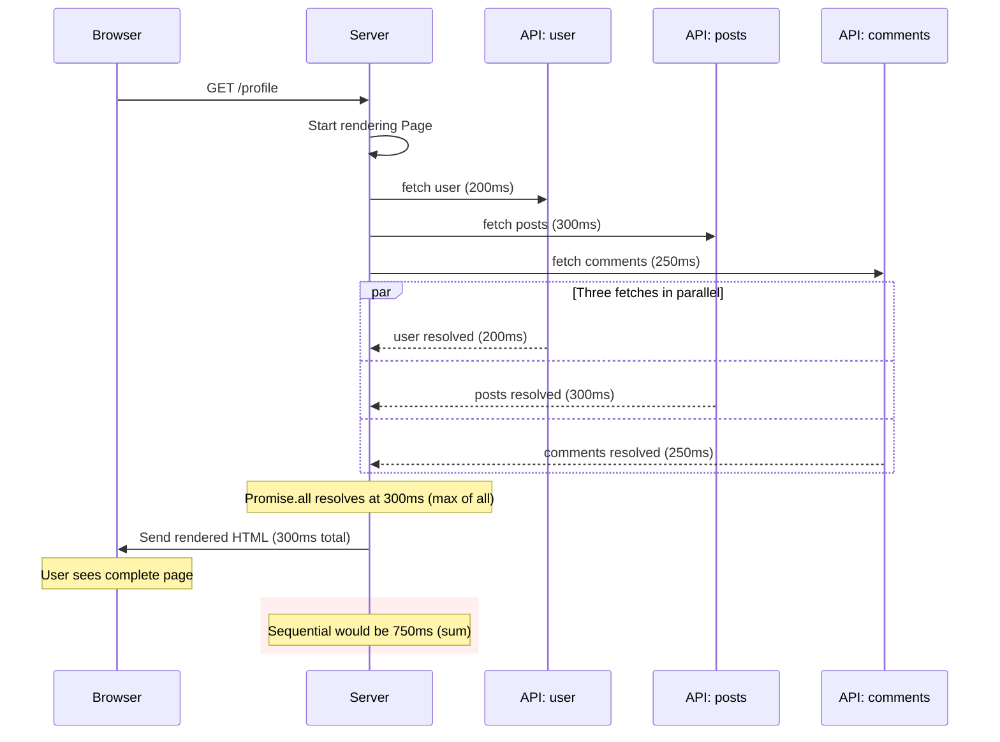
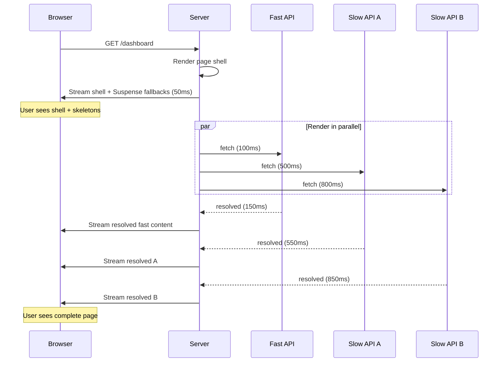
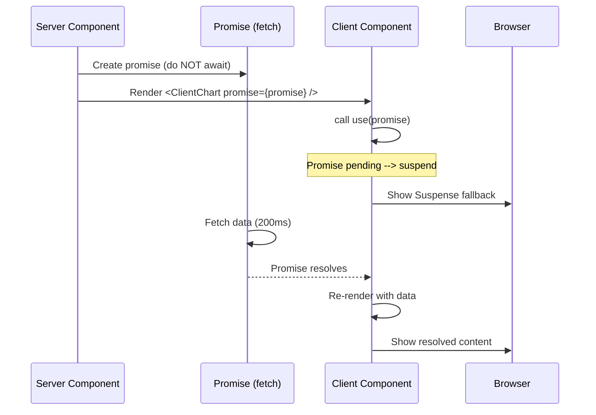

# 4.5 Data Fetching

> In the App Router, you fetch data by calling `await fetch(...)` (or any async operation) directly in a Server Component. No `getServerSideProps`, no `getStaticProps` — just async/await. This note covers the extended `fetch()` API, parallel fetching, the `cache()` function, the React 19 `use()` hook, third-party libraries, fetch priorities, and the streaming-data pattern.

## 4.5.1 Objective

By the end of this note you should be able to:

1. Fetch data in a Server Component using `async/await`, with no framework-specific data functions.
2. Use the extended `fetch()` options (`next.revalidate`, `next.tags`, `cache`) to control caching behavior per fetch.
3. Fetch in parallel using `Promise.all` and understand the difference between sequential and parallel fetching.
4. Use the `cache()` function from React to memoize fetches across components within a single request.
5. Use the React 19 `use()` hook to unwrap promises in Client Components.
6. Stream data with Suspense to send the page shell first and fill in slow data later.
7. Decide between fetching in Server Components, Client Components, and third-party libraries (TanStack Query).

## 4.5.2 Background Knowledge

This note assumes you have read [[4.1 App Router Foundations]], [[4.3 Server and Client Components]] (the Server/Client boundary and what each can do), and [[4.4 Rendering Strategies]] (static vs dynamic vs ISR vs streaming). You should also be comfortable with JavaScript promises, `async/await`, and `Promise.all` from general JavaScript knowledge, and with React's rendering model from [[3.1 JSX and Rendering]] and [[3.2 Components and Props]].

## 4.5.3 Core Concepts

### 4.5.3.1 The Big Shift: Fetch Directly in Components

In the Pages Router, data fetching required special functions: `getServerSideProps` for server-side fetching, `getStaticProps` for build-time fetching, `getStaticPaths` for dynamic route enumeration. These functions were called by Next.js before the component rendered, and their return value was passed as props.

In the App Router, **you just `await fetch(...)` directly in the component**. The component is `async`, returns a Promise that resolves to JSX, and Next.js awaits it during rendering. No special functions, no prop drilling from a data function.

```tsx
// app/products/page.tsx — App Router
export default async function ProductsPage() {
  const res = await fetch("https://api.example.com/products");
  const products = await res.json();
  return (
    <ul>
      {products.map((p) => <li key={p.id}>{p.name}</li>)}
    </ul>
  );
}
```

Compare to the Pages Router equivalent:

```tsx
// pages/products.tsx — Pages Router
export async function getServerSideProps() {
  const res = await fetch("https://api.example.com/products");
  const products = await res.json();
  return { props: { products } };
}

export default function Products({ products }: { products: any[] }) {
  return <ul>{products.map((p) => <li key={p.id}>{p.name}</li>)}</ul>;
}
```

The App Router version is half the boilerplate and composes naturally with layouts, Suspense, and the caching layer.

### 4.5.3.2 The Extended `fetch()` API

Next.js extends the standard Web `fetch()` API with two Next.js-specific option groups:

- `cache`: `'force-cache' | 'no-store'` — standard Web option, but Next.js honors it for caching.
- `next.revalidate`: number — time-based ISR interval (in seconds) for this fetch.
- `next.tags`: string[] — tags for on-demand revalidation via `revalidateTag`.

```tsx
// Cached forever (or until revalidated)
await fetch(url, { cache: "force-cache" });

// Never cached (always fresh)
await fetch(url, { cache: "no-store" });

// Cached, revalidate every 60 seconds
await fetch(url, { next: { revalidate: 60 } });

// Cached, tagged for on-demand revalidation
await fetch(url, { next: { tags: ["products"] } });

// Cached with both revalidate and tags
await fetch(url, { next: { revalidate: 3600, tags: ["products"] } });
```

In Next.js 15+, `fetch()` is **not cached by default**. To enable caching, you must explicitly use `cache: "force-cache"`, `next: { revalidate: N }`, or `next: { tags: [...] }`. (In Next.js 13-14, the default was `force-cache` — the change in Next.js 15 was made to align with the standard Web `fetch` behavior.)

### 4.5.3.3 Where Fetching Can Happen

Data can be fetched in:

- **Server Components** (default and preferred). The component is `async`, calls `await fetch(...)`, and renders the result. The fetch happens on the server; the data never crosses the wire to the browser.
- **Route Handlers** (`route.ts`). Used for API endpoints, webhooks, etc.
- **Server Actions**. Used for mutations (covered in [[4.7 Server Actions and Forms]]).
- **Client Components** (via `useEffect` or `use()`). Used when the data is per-user-interaction or otherwise can't be fetched on the server. Not preferred — Client Component fetching skips the cache and ships the fetch logic to the browser.

The mental model: **default to fetching in Server Components.** Move to Client Components only when the data depends on client-side state that can't be in the URL.

### 4.5.3.4 Caching Behavior in Dev vs Production

In development (`next dev`), `fetch()` is **not cached** — every request re-fetches. This is so you see fresh data while developing.

In production (`next build` + `next start`), `fetch()` is cached according to its options. This is the only behavior that matters in production.

This difference is a frequent source of confusion: code that "works fine in dev" (because every fetch is fresh) suddenly shows stale data in production (because the cache hasn't been invalidated). Always test caching behavior in a production build before deploying.

### 4.5.3.5 Parallel Fetching with `Promise.all`

When a page needs data from multiple sources, fetch them in parallel with `Promise.all`. This is dramatically faster than awaiting each fetch sequentially.

```tsx
// Sequential — slow (sum of all latencies)
export default async function Page() {
  const user = await fetch("/api/user").then((r) => r.json());
  const posts = await fetch("/api/posts").then((r) => r.json());
  const comments = await fetch("/api/comments").then((r) => r.json());
  // total time: user + posts + comments
}

// Parallel — fast (max of all latencies)
export default async function Page() {
  const [user, posts, comments] = await Promise.all([
    fetch("/api/user").then((r) => r.json()),
    fetch("/api/posts").then((r) => r.json()),
    fetch("/api/comments").then((r) => r.json()),
  ]);
  // total time: max(user, posts, comments)
}
```

Sequential fetching is appropriate when one fetch depends on the result of another (e.g., fetch user, then fetch their posts). Parallel fetching is appropriate when fetches are independent.

### 4.5.3.6 Fetching in Layouts

Layouts can also fetch data. The data is fetched once per layout render (which, due to layout persistence, is once per session unless `router.refresh()` is called).

```tsx
// app/dashboard/layout.tsx
import { db } from "@/lib/db";

export default async function DashboardLayout({ children }: { children: React.ReactNode }) {
  const user = await db.user.findFirst();
  return (
    <div>
      <header>Welcome, {user.name}</header>
      <main>{children}</main>
    </div>
  );
}
```

> [!warning] Avoid double-fetching
> If both a layout and a page fetch the same data, you do two fetches per request. Use the `cache()` function (below) to deduplicate, or fetch once in the layout and pass down as a prop.

### 4.5.3.7 The `cache()` Function

React's `cache()` function memoizes a function's return value within a single request. If the function is called multiple times with the same arguments during one request, the actual function body runs once and the cached result is returned for subsequent calls.

```tsx
// lib/getUser.ts
import { cache } from "react";
import { db } from "./db";

export const getUser = cache(async (id: string) => {
  return db.user.findUnique({ where: { id } });
});
```

```tsx
// app/dashboard/layout.tsx
import { getUser } from "@/lib/getUser";
export default async function Layout({ children }: { children: React.ReactNode }) {
  const user = await getUser("current"); // fetches once
  return <div>{children}</div>;
}
```

```tsx
// app/dashboard/page.tsx
import { getUser } from "@/lib/getUser";
export default async function Page() {
  const user = await getUser("current"); // returns cached result from layout's call
  return <h1>Hi, {user.name}</h1>;
}
```

Without `cache()`, both the layout and the page would fetch the user — two database queries per request. With `cache()`, the database is queried once, and both components receive the same data.

`cache()` is per-request — the memoization does not persist across requests. Each request gets its own cache. This is different from `fetch()`'s Data Cache, which persists across requests.

### 4.5.3.8 The React 19 `use()` Hook

React 19 introduced the `use()` hook, which unwraps a promise (or context) in a Client Component. Combined with Suspense, this lets Client Components consume promises that were created on the server.

```tsx
// app/page.tsx — Server Component
import { ClientChart } from "./ClientChart";

export default function Page() {
  const dataPromise = fetchData(); // returns a promise, does NOT await
  return (
    <Suspense fallback={<p>Loading...</p>}>
      <ClientChart dataPromise={dataPromise} />
    </Suspense>
  );
}
```

```tsx
// app/ClientChart.tsx — Client Component
"use client";
import { use } from "react";

export function ClientChart({ dataPromise }: { dataPromise: Promise<Data> }) {
  const data = use(dataPromise); // unwraps the promise; suspends if not ready
  return <Chart data={data} />;
}
```

The Server Component creates a promise (does not await it) and passes it to a Client Component. The Client Component calls `use()` to unwrap the promise, which suspends the component until the promise resolves. The Suspense boundary shows the fallback while the promise is pending.

This pattern is useful when:

- You want to fetch on the server (to use server-only credentials or to start the fetch early) but consume the data in a Client Component.
- You want the streaming benefit of Suspense but the data needs client-side processing.

### 4.5.3.9 Fetching with Third-Party Libraries

Third-party data libraries (TanStack Query, SWR, Apollo Client, etc.) can be used in the App Router, but with caveats:

- They are Client Component libraries (they use hooks).
- They do not integrate with Next.js's Data Cache (their own caching layer is separate).
- They cannot run in Server Components (because they use hooks).

For **mutations and client-side caching**, TanStack Query is excellent. For **server-side fetching**, prefer direct `fetch` or an ORM. A common pattern: fetch initial data on the server (with `fetch` or an ORM), pass it as a prop, and use TanStack Query in the Client Component for subsequent updates.

```tsx
// app/todos/page.tsx — Server Component, initial fetch
import { TodoList } from "./TodoList";

export default async function Page() {
  const initialTodos = await fetch("https://api.example.com/todos").then((r) => r.json());
  return <TodoList initialTodos={initialTodos} />;
}
```

```tsx
// app/todos/TodoList.tsx — Client Component with TanStack Query
"use client";
import { useQuery, useMutation, useQueryClient } from "@tanstack/react-query";

export function TodoList({ initialTodos }: { initialTodos: Todo[] }) {
  const queryClient = useQueryClient();
  const { data: todos } = useQuery({
    queryKey: ["todos"],
    queryFn: () => fetch("/api/todos").then((r) => r.json()),
    initialData: initialTodos, // hydrate from server-fetched data
  });
  // ... mutations, optimistic updates, etc.
}
```

The server fetches the initial data and ships it as HTML + serialized data. The Client Component hydrates from that data and uses TanStack Query for subsequent interactions (refetches, mutations).

### 4.5.3.10 Fetch Priorities

The `fetch()` API supports a `priority` option (`'high' | 'low' | 'auto'`) that hints to the browser about the relative importance of the request. Next.js honors this for prefetching and resource hints.

```tsx
await fetch("/api/critical", { priority: "high" });
await fetch("/api/non-critical", { priority: "low" });
```

Use `priority: 'high'` for data that blocks the initial render (above-the-fold content). Use `priority: 'low'` for data that can wait (below-the-fold content, analytics, etc.).

### 4.5.3.11 Streaming Data with Suspense

The streaming-data pattern: stream the page shell first, then stream in the data as it arrives. This is enabled by Suspense + async Server Components.

```tsx
// app/dashboard/page.tsx
import { Suspense } from "react";

export default function Page() {
  return (
    <main>
      <h1>Dashboard</h1>
      <Suspense fallback={<p>Loading metrics...</p>}>
        <Metrics />
      </Suspense>
      <Suspense fallback={<p>Loading activity...</p>}>
        <Activity />
      </Suspense>
    </main>
  );
}

async function Metrics() {
  const data = await fetch("https://api.example.com/metrics").then((r) => r.json());
  return <pre>{JSON.stringify(data)}</pre>;
}

async function Activity() {
  const data = await fetch("https://api.example.com/activity").then((r) => r.json());
  return <pre>{JSON.stringify(data)}</pre>;
}
```

What happens:

1. Next.js starts rendering `Page`. It encounters `<Suspense>` with `Metrics`.
2. It immediately emits the fallback as a placeholder and starts rendering `Metrics` in the background.
3. Same for `Activity`.
4. The page shell (the `<h1>` and both fallbacks) is sent to the browser immediately.
5. When each fetch resolves, Next.js streams in the resolved HTML, replacing the placeholder.

The user sees content in milliseconds, even if the slowest fetch takes a second. This is the perceived-performance win of streaming. See [[4.4 Rendering Strategies]] for the full streaming discussion.

### 4.5.3.12 Fetching in Client Components

When you must fetch in a Client Component (e.g., the data depends on client-side state), use either `useEffect` + `useState` (the classic pattern) or the React 19 `use()` hook with a server-created promise.

```tsx
// Pattern A: useEffect + useState (classic)
"use client";
import { useEffect, useState } from "react";

export function ClientSearch({ query }: { query: string }) {
  const [results, setResults] = useState([]);
  useEffect(() => {
    fetch(`/api/search?q=${query}`).then((r) => r.json()).then(setResults);
  }, [query]);
  return <ul>{results.map((r) => <li key={r.id}>{r.name}</li>)}</ul>;
}
```

```tsx
// Pattern B: use() with a server-created promise (React 19)
// Server Component:
import { Suspense } from "react";
import { ClientSearch } from "./ClientSearch";

export default function Page({ searchParams }: { searchParams: { q: string } }) {
  const promise = searchApi(searchParams.q); // returns promise, not awaited
  return (
    <Suspense fallback={<p>Searching...</p>}>
      <ClientSearch promise={promise} />
    </Suspense>
  );
}

// Client Component:
"use client";
import { use } from "react";

export function ClientSearch({ promise }: { promise: Promise<Result[]> }) {
  const results = use(promise);
  return <ul>{results.map((r) => <li key={r.id}>{r.name}</li>)}</ul>;
}
```

Pattern B has the advantage of starting the fetch on the server (no extra round trip from the client) and integrating with Suspense. Pattern A is simpler but adds a round trip (the client must download JS, then make a fetch).

## 4.5.4 Detailed Walkthrough

### 4.5.4.1 The Sequential vs Parallel Decision

The biggest performance lever in data fetching is parallelization. A page with three sequential fetches of 200 ms each takes 600 ms total. The same page with three parallel fetches takes 200 ms total.

Sequential is appropriate when fetch B depends on fetch A:

```tsx
export default async function Page({ params }: { params: { userId: string } }) {
  // Sequential — needed because posts depends on user
  const user = await fetch(`/api/users/${params.userId}`).then((r) => r.json());
  const posts = await fetch(`/api/users/${user.id}/posts`).then((r) => r.json());
  return <UserPosts user={user} posts={posts} />;
}
```

Parallel is appropriate when fetches are independent:

```tsx
export default async function Page({ params }: { params: { userId: string } }) {
  // Parallel — user and posts can be fetched together if posts uses userId from params
  const [user, posts] = await Promise.all([
    fetch(`/api/users/${params.userId}`).then((r) => r.json()),
    fetch(`/api/users/${params.userId}/posts`).then((r) => r.json()),
  ]);
  return <UserPosts user={user} posts={posts} />;
}
```

The trick: identify what each fetch actually depends on. If fetch B depends on data from fetch A, it must be sequential. If fetch B can use params or another input directly (without needing A's output), it can be parallel.

### 4.5.4.2 The `cache()` Function in Depth

`cache()` is React's per-request memoization. The function it wraps is called once per unique set of arguments; subsequent calls with the same arguments return the cached result.

```tsx
import { cache } from "react";

export const getUser = cache(async (id: string) => {
  console.log(`Fetching user ${id}`); // logs once per request per unique id
  return fetch(`/api/users/${id}`).then((r) => r.json());
});
```

If `getUser("123")` is called five times in a single request (from a layout, a page, a sidebar, etc.), the fetch runs once. The other four calls return the cached result.

Use `cache()` for:

- Database queries that might be called from multiple components.
- Authentication checks (`getCurrentUser()`) called from many places.
- Any expensive operation that should run once per request.

Do not use `cache()` for:

- Mutations (the cache is for reads).
- Cross-request persistence (the cache is per-request; use `fetch`'s Data Cache for cross-request).

### 4.5.4.3 Avoiding Double-Fetching in Layouts

A common anti-pattern: both the layout and the page fetch the same data.

```tsx
// app/dashboard/layout.tsx
export default async function Layout({ children }: { children: React.ReactNode }) {
  const user = await fetch("/api/user").then((r) => r.json()); // fetch 1
  return <div><Header user={user} />{children}</div>;
}

// app/dashboard/page.tsx
export default async function Page() {
  const user = await fetch("/api/user").then((r) => r.json()); // fetch 2 (duplicate!)
  return <h1>Welcome, {user.name}</h1>;
}
```

Two fixes:

**Option A: `cache()` the fetch.**

```tsx
// lib/getUser.ts
import { cache } from "react";
export const getUser = cache(() => fetch("/api/user").then((r) => r.json()));
```

Now both the layout and the page call `getUser()`, and the fetch runs once.

**Option B: Pass data from layout to page via React Context.**

This is harder in the App Router because Server Components cannot use Context (it's a hook-based API). The pattern is to use `cache()` instead — it's the idiomatic equivalent of Context for server-side data sharing.

### 4.5.4.4 The `use()` Hook and Suspense

The React 19 `use()` hook unwraps a promise in a Client Component. It must be called inside a Suspense boundary — if the promise is pending, `use()` throws a special "suspense" exception that React catches and uses to show the Suspense fallback.

```tsx
"use client";
import { use } from "react";

export function Chart({ dataPromise }: { dataPromise: Promise<ChartData> }) {
  const data = use(dataPromise);
  // If dataPromise is pending, use() suspends here.
  // The nearest Suspense boundary's fallback is shown.
  return <ChartView data={data} />;
}
```

The promise can be created on the server and passed as a prop. The fetch starts on the server (no client round trip), and the client consumes the result via `use()`.

Constraints:

- `use()` can only unwrap a promise once. After it resolves, the component re-renders with the data.
- The promise must not be created inside the Client Component (that would re-create it on every render). It must be passed in from a Server Component or memoized.
- The Client Component using `use()` must be inside a Suspense boundary.

### 4.5.4.5 Fetch Priorities and Resource Hints

The `priority` option on `fetch()` is a hint to the browser about the relative importance of the request. Next.js uses this to:

- Order resource hints (`<link rel="preload">`).
- Prioritize prefetching.
- Order the streaming of Suspense boundaries.

```tsx
// Critical above-the-fold data
const hero = await fetch("/api/hero", { priority: "high" }).then((r) => r.json());

// Below-the-fold data
const footer = await fetch("/api/footer", { priority: "low" }).then((r) => r.json());
```

Use `priority: "high"` for data that blocks the initial render. Use `priority: "low"` for data that can wait. The default is `auto`, which lets the browser decide.

### 4.5.4.6 Server vs Client Fetching: When to Use Each

| Criterion | Server Component fetch | Client Component fetch |
|-----------|------------------------|------------------------|
| Initial page load | Faster (parallel with HTML) | Slower (extra round trip) |
| SEO | Excellent (HTML has data) | Poor (data fetched after) |
| Per-user data | Use cookies on server | Use client state |
| Client-side state-dependent | Awkward (must round-trip) | Natural |
| Database access | Direct (no API needed) | Requires API route |
| Caching | Next.js Data Cache | Library-specific |
| Mutations | Use Server Actions | Library mutations |

Default to server. Move to client only when the data depends on client-side state that can't be in the URL (e.g., a search input's value while typing).

### 4.5.4.7 The Streaming Pattern in Production

A real-world dashboard page with streaming:

```tsx
// app/dashboard/page.tsx
import { Suspense } from "react";
import { StatsSkeleton, ChartSkeleton, TableSkeleton } from "@/components/skeletons";

export default function Page() {
  return (
    <main>
      <h1>Dashboard</h1>

      {/* Fast — renders immediately */}
      <QuickStats />

      {/* Slow — streams in */}
      <Suspense fallback={<ChartSkeleton />}>
        <RevenueChart />
      </Suspense>

      {/* Slow — streams in */}
      <Suspense fallback={<TableSkeleton />}>
        <RecentOrders />
      </Suspense>
    </main>
  );
}

async function QuickStats() {
  // Fast fetch — no Suspense needed
  const stats = await fetch("/api/stats-quick", { priority: "high" }).then((r) => r.json());
  return <Stats data={stats} />;
}

async function RevenueChart() {
  // Slow fetch — wraps in Suspense
  const data = await fetch("/api/revenue", { next: { revalidate: 300 } }).then((r) => r.json());
  return <Chart data={data} />;
}

async function RecentOrders() {
  const orders = await fetch("/api/orders/recent").then((r) => r.json());
  return <Table orders={orders} />;
}
```

The user sees the heading and quick stats within ~50 ms. The chart skeleton and table skeleton are visible immediately. As each slow fetch resolves, the skeleton is replaced with the real content. Total perceived load time is the latency of the fastest part, not the slowest.

## 4.5.5 Practical Examples

### 4.5.5.1 A Product Page with Parallel Fetching

```tsx
// app/products/[id]/page.tsx
import { Suspense } from "react";

export default async function Page({ params }: { params: { id: string } }) {
  // Parallel fetch — product info, reviews, related products
  const [product, reviews, related] = await Promise.all([
    fetch(`https://api.example.com/products/${params.id}`, { next: { revalidate: 3600, tags: [`product-${params.id}`] } }).then((r) => r.json()),
    fetch(`https://api.example.com/products/${params.id}/reviews`).then((r) => r.json()),
    fetch(`https://api.example.com/products/${params.id}/related`).then((r) => r.json()),
  ]);

  return (
    <main>
      <ProductHero product={product} />
      <ReviewsList reviews={reviews} />
      <RelatedProducts products={related} />
    </main>
  );
}
```

All three fetches start in parallel. Total time is the max of the three, not the sum.

### 4.5.5.2 Using `cache()` to Deduplicate Auth

```tsx
// lib/getCurrentUser.ts
import { cache } from "react";
import { cookies } from "next/headers";
import { db } from "./db";

export const getCurrentUser = cache(async () => {
  const cookieStore = await cookies();
  const sessionId = cookieStore.get("session")?.value;
  if (!sessionId) return null;
  return db.user.findUnique({ where: { sessionId } });
});
```

```tsx
// app/dashboard/layout.tsx
import { getCurrentUser } from "@/lib/getCurrentUser";

export default async function Layout({ children }: { children: React.ReactNode }) {
  const user = await getCurrentUser();
  if (!user) redirect("/login");
  return <div><Header user={user} />{children}</div>;
}
```

```tsx
// app/dashboard/page.tsx
import { getCurrentUser } from "@/lib/getCurrentUser";

export default async function Page() {
  const user = await getCurrentUser(); // returns cached result, no second DB hit
  return <h1>Welcome, {user.name}</h1>;
}
```

The database is queried once per request, even though `getCurrentUser` is called from both the layout and the page.

### 4.5.5.3 The `use()` Hook Pattern

```tsx
// app/page.tsx — Server Component
import { Suspense } from "react";
import { ClientChart } from "./ClientChart";
import { fetchChartData } from "@/lib/data";

export default function Page() {
  const promise = fetchChartData(); // create promise, do NOT await
  return (
    <Suspense fallback={<p>Loading chart...</p>}>
      <ClientChart promise={promise} />
    </Suspense>
  );
}
```

```tsx
// app/ClientChart.tsx — Client Component
"use client";
import { use } from "react";

export function ClientChart({ promise }: { promise: Promise<ChartData> }) {
  const data = use(promise); // suspends until promise resolves
  return <ChartView data={data} />;
}
```

The fetch starts on the server (no client round trip). The Client Component receives the promise and uses `use()` to unwrap it. The Suspense boundary shows the fallback while the promise is pending.

### 4.5.5.4 TanStack Query Hydration

```tsx
// app/todos/page.tsx — Server Component
import { dehydrate, HydrationBoundary, QueryClient } from "@tanstack/react-query";
import { TodoList } from "./TodoList";

export default async function Page() {
  const queryClient = new QueryClient();
  await queryClient.prefetchQuery({
    queryKey: ["todos"],
    queryFn: () => fetch("/api/todos").then((r) => r.json()),
  });

  return (
    <HydrationBoundary state={dehydrate(queryClient)}>
      <TodoList />
    </HydrationBoundary>
  );
}
```

```tsx
// app/todos/TodoList.tsx — Client Component
"use client";
import { useQuery } from "@tanstack/react-query";

export function TodoList() {
  const { data: todos } = useQuery({
    queryKey: ["todos"],
    queryFn: () => fetch("/api/todos").then((r) => r.json()),
  });
  return <ul>{todos?.map((t) => <li key={t.id}>{t.text}</li>)}</ul>;
}
```

The server prefetches the data and dehydrates the query client. The Client Component hydrates from the dehydrated state and uses TanStack Query for subsequent interactions (refetches, mutations). This combines server-side initial fetch with client-side interactivity.

## 4.5.6 Mermaid Diagrams

### 4.5.6.1 Parallel Data Fetching with `Promise.all`



### 4.5.6.2 Streaming Data with Suspense



### 4.5.6.3 The `use()` Hook — Server Promise to Client Component



## 4.5.7 Common Mistakes

1. **Sequential fetching when parallel is possible.** Awaiting each fetch in turn is the easiest mistake — and the costliest. Always look for fetches that can be parallelized with `Promise.all`.

2. **Forgetting that `fetch()` is uncached by default in Next.js 15+.** Code that worked in Next.js 13-14 (cached by default) suddenly becomes dynamic in 15+. Always set `cache`, `revalidate`, or `tags` explicitly if you want caching.

3. **Calling `cache()` and expecting cross-request persistence.** `cache()` is per-request. It does not persist across requests. Use `fetch()`'s Data Cache for cross-request caching.

4. **Double-fetching the same data in layout and page.** Two `fetch` calls for the same URL = two network requests. Use `cache()` to deduplicate.

5. **Creating a promise inside a Client Component and passing to `use()`.** The promise would be re-created on every render, causing an infinite loop or stale data. Create the promise in a Server Component (or memoize it) and pass as a prop.

6. **Using TanStack Query as if it were a Server Component.** TanStack Query uses hooks, which only work in Client Components. Do not call `useQuery` in a Server Component.

7. **Fetching in the root layout for every page.** The root layout wraps every route. Fetching in it makes every route wait for that data. Move route-specific data to the route's layout or page.

8. **Not handling fetch errors.** `fetch()` does not throw on HTTP errors (404, 500) — it only throws on network errors. Always check `res.ok` and handle non-2xx responses.

## 4.5.8 Best Practices

1. **Default to fetching in Server Components.** Use `async/await` directly. No framework-specific data functions.

2. **Parallelize independent fetches with `Promise.all`.** The performance difference is dramatic — sum vs max of latencies.

3. **Use `cache()` for shared reads.** Any function called from multiple components in a single request should be wrapped in `cache()` to deduplicate.

4. **Tag your fetches.** Even if you don't use on-demand revalidation today, adding `next: { tags: [...] }` gives you the option later without changing the fetch code.

5. **Stream slow parts with Suspense.** Any fetch that takes more than ~200 ms should be in its own Suspense boundary. The page shell streams immediately; slow parts fill in.

6. **Pass promises from server to client with `use()`.** This avoids the client round trip and integrates with Suspense. Avoid `useEffect` + `useState` for fetching when `use()` works.

7. **Handle errors explicitly.** Check `res.ok`. Throw or render an error state. Wrap in `error.tsx` for route-level error handling.

8. **Validate the response.** Use Zod or a similar library to validate the shape of API responses before using them. Treat external APIs as untrusted.

9. **Set fetch priorities.** Use `priority: "high"` for above-the-fold data and `priority: "low"` for below-the-fold data.

10. **Use TanStack Query for client-side mutations and refetching.** Pair it with server-side initial fetch (via `HydrationBoundary`) for the best of both worlds.

## 4.5.9 Mini Exercises

### Exercise 1 — Convert Sequential to Parallel

The following page fetches three resources sequentially. Refactor to fetch in parallel.

```tsx
export default async function Page({ params }: { params: { id: string } }) {
  const user = await fetch(`/api/users/${params.id}`).then((r) => r.json());
  const posts = await fetch(`/api/users/${user.id}/posts`).then((r) => r.json());
  const followers = await fetch(`/api/users/${user.id}/followers`).then((r) => r.json());
  return <UserProfile user={user} posts={posts} followers={followers} />;
}
```

**Worked solution:**

Look closely: `posts` and `followers` both depend on `user.id`, but `user.id` is the same as `params.id` (assuming the API uses `params.id` as the user ID). So they can be fetched in parallel with `user`:

```tsx
export default async function Page({ params }: { params: { id: string } }) {
  const [user, posts, followers] = await Promise.all([
    fetch(`/api/users/${params.id}`).then((r) => r.json()),
    fetch(`/api/users/${params.id}/posts`).then((r) => r.json()),
    fetch(`/api/users/${params.id}/followers`).then((r) => r.json()),
  ]);
  return <UserProfile user={user} posts={posts} followers={followers} />;
}
```

The trick was recognizing that `user.id === params.id` (in this case), so `posts` and `followers` don't actually need `user` to start their fetch. If they truly depended on a value only available from `user` (e.g., a different ID returned by the API), the sequential version would be correct.

### Exercise 2 — Deduplicate with `cache()`

Both the layout and the page call `getCurrentUser()`, causing two database hits per request. Use `cache()` to deduplicate.

```tsx
// app/dashboard/layout.tsx
import { getCurrentUser } from "@/lib/auth";
export default async function Layout({ children }: { children: React.ReactNode }) {
  const user = await getCurrentUser();
  if (!user) redirect("/login");
  return <div><Header user={user} />{children}</div>;
}
```

```tsx
// app/dashboard/page.tsx
import { getCurrentUser } from "@/lib/auth";
export default async function Page() {
  const user = await getCurrentUser();
  return <h1>Welcome, {user.name}</h1>;
}
```

**Worked solution:**

Wrap `getCurrentUser` with `cache()` in `lib/auth.ts`:

```tsx
// lib/auth.ts
import { cache } from "react";
import { db } from "./db";

export const getCurrentUser = cache(async () => {
  // ... existing logic that queries the database
  return db.user.findFirst({ /* ... */ });
});
```

Now both the layout and the page call `getCurrentUser()`, but the underlying function body runs only once per request. The second call returns the cached result. No code in the layout or page needs to change.

### Exercise 3 — Stream a Slow Component

The following page blocks on a slow fetch. Refactor to stream.

```tsx
// app/dashboard/page.tsx
export default async function Page() {
  const [fast, slow] = await Promise.all([
    fetch("/api/fast").then((r) => r.json()),
    fetch("/api/slow").then((r) => r.json()),  // takes 1 second
  ]);
  return (
    <main>
      <h1>Dashboard</h1>
      <FastView data={fast} />
      <SlowView data={slow} />
    </main>
  );
}
```

**Worked solution:**

Wrap the slow fetch in its own async component and use Suspense:

```tsx
// app/dashboard/page.tsx
import { Suspense } from "react";

export default function Page() {
  return (
    <main>
      <h1>Dashboard</h1>
      <FastViewWrapper />
      <Suspense fallback={<p>Loading slow view...</p>}>
        <SlowViewWrapper />
      </Suspense>
    </main>
  );
}

async function FastViewWrapper() {
  const fast = await fetch("/api/fast").then((r) => r.json());
  return <FastView data={fast} />;
}

async function SlowViewWrapper() {
  const slow = await fetch("/api/slow").then((r) => r.json());
  return <SlowView data={slow} />;
}
```

Now the page shell (with `<h1>` and the FastView, plus the SlowView's loading message) is sent immediately. The SlowView streams in when its fetch resolves. The user sees content in milliseconds instead of waiting a second.

Note: the original `Promise.all` version starts both fetches in parallel, so total time is the same. The streaming version's benefit is *perceived* performance — content appears earlier, even though total load is unchanged.

### Exercise 4 — Pass a Promise from Server to Client

The following Client Component fetches data in `useEffect`, adding a client round trip. Refactor to fetch on the server and pass the promise to the client via `use()`.

```tsx
// app/page.tsx
import { ClientChart } from "./ClientChart";
export default function Page() {
  return <ClientChart />;
}
```

```tsx
// app/ClientChart.tsx
"use client";
import { useEffect, useState } from "react";

export function ClientChart() {
  const [data, setData] = useState(null);
  useEffect(() => {
    fetch("/api/chart").then((r) => r.json()).then(setData);
  }, []);
  if (!data) return <p>Loading...</p>;
  return <Chart data={data} />;
}
```

**Worked solution:**

```tsx
// app/page.tsx — Server Component
import { Suspense } from "react";
import { ClientChart } from "./ClientChart";
import { fetchChartData } from "@/lib/data";

export default function Page() {
  const promise = fetchChartData(); // create promise, do NOT await
  return (
    <Suspense fallback={<p>Loading...</p>}>
      <ClientChart promise={promise} />
    </Suspense>
  );
}
```

```tsx
// app/ClientChart.tsx — Client Component
"use client";
import { use } from "react";

export function ClientChart({ promise }: { promise: Promise<ChartData> }) {
  const data = use(promise); // unwraps the promise; suspends if pending
  return <Chart data={data} />;
}
```

```ts
// lib/data.ts
import "server-only";
export async function fetchChartData(): Promise<ChartData> {
  const res = await fetch("https://api.example.com/chart");
  return res.json();
}
```

The fetch starts on the server (no client round trip). The promise is passed as a prop. The Client Component uses `use()` to unwrap it. The Suspense boundary shows the fallback while pending.

### Exercise 5 — Configure Caching for ISR

Configure a product page to be ISR with hourly revalidation, tagged for on-demand revalidation when a product is updated.

```tsx
// app/products/[id]/page.tsx — currently uncached
export default async function Page({ params }: { params: { id: string } }) {
  const res = await fetch(`https://api.example.com/products/${params.id}`);
  const product = await res.json();
  return <ProductView product={product} />;
}
```

**Worked solution:**

```tsx
// app/products/[id]/page.tsx
export const revalidate = 3600; // route-level default: 1 hour

export default async function Page({ params }: { params: { id: string } }) {
  const res = await fetch(`https://api.example.com/products/${params.id}`, {
    next: {
      revalidate: 3600,           // revalidate this fetch every hour
      tags: [`product-${params.id}`],  // tag for on-demand revalidation
    },
  });
  const product = await res.json();
  return <ProductView product={product} />;
}
```

To trigger on-demand revalidation when a product is updated (e.g., from a Server Action after an admin edit):

```tsx
// app/admin/products/[id]/edit/actions.ts
"use server";
import { revalidateTag } from "next/cache";

export async function updateProduct(id: string, data: ProductInput) {
  await api.updateProduct(id, data);
  revalidateTag(`product-${id}`);  // invalidate the cached fetch for this product
}
```

The combination of `revalidate: 3600` (time-based, hourly) and `tags: [...]` (on-demand, on update) gives you both safety nets: data is at most an hour stale, and updates trigger immediate revalidation.

## 4.5.10 Summary

In the App Router, data fetching happens directly in async Server Components — no `getServerSideProps`, no `getStaticProps`. The `fetch()` API is extended with `next.revalidate` (time-based ISR), `next.tags` (on-demand ISR), and `cache` (force-cache or no-store). Parallelize independent fetches with `Promise.all`. Use React's `cache()` function to deduplicate reads across components within a single request. Use the React 19 `use()` hook to unwrap promises passed from Server Components to Client Components. Stream slow parts of a page with `<Suspense>` to deliver content progressively. Use TanStack Query for client-side mutations, paired with server-side initial fetch via `HydrationBoundary`.

## 4.5.11 Related Notes

- [[4.1 App Router Foundations]] — the App Router model and file conventions.
- [[4.3 Server and Client Components]] — where data fetching can happen.
- [[4.4 Rendering Strategies]] — how `fetch` options affect static vs dynamic rendering.
- [[4.6 Caching and Revalidation]] — the four Next.js caches and how they interact with `fetch`.
- [[4.7 Server Actions and Forms]] — mutations and how they revalidate cached data.
- [[3.12 Suspense, Lazy Loading, and Code Splitting]] — the React Suspense primitive.
- [[3.16 API Integration and Data Fetching]] — general React data-fetching patterns.
