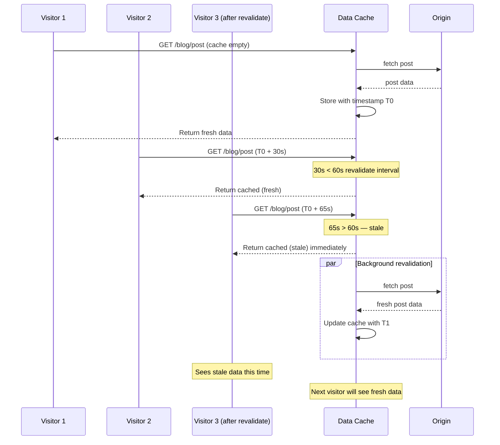
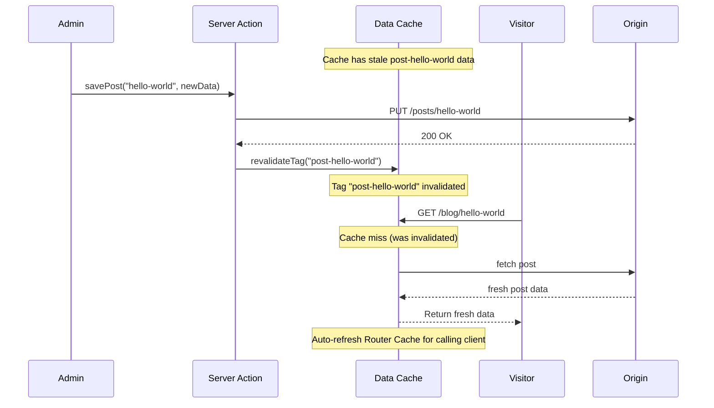

# 4.6 Caching and Revalidation

> Next.js has four distinct caches: the Data Cache (for `fetch` responses), the Full Route Cache (for statically rendered routes), the Router Cache (client-side, for visited routes), and Request Memoization (per-request fetch deduplication). This note covers each cache, how it is invalidated, and how to choose between time-based ISR, on-demand revalidation, and opting out entirely.

## 4.6.1 Objective

By the end of this note you should be able to:

1. Name the four Next.js caches and explain what each one stores.
2. Describe how each cache is invalidated — by time, by tag, by path, by request, by deploy.
3. Use `revalidate` (time-based ISR), `revalidateTag` (on-demand ISR), `revalidatePath`, `cache: 'no-store'`, and `noStore()` appropriately.
4. Explain the difference between dev and production caching behavior.
5. Use `router.refresh()` to refresh the Router Cache without losing client state.
6. Reason about the tradeoff between cache freshness and performance.

## 4.6.2 Background Knowledge

This note assumes you have read [[4.1 App Router Foundations]], [[4.4 Rendering Strategies]] (static vs dynamic vs ISR), and [[4.5 Data Fetching]] (the `fetch` extensions). You should be comfortable with HTTP caching concepts (cache headers, ETags, stale-while-revalidate) and with the difference between server and client from [[4.3 Server and Client Components]].

## 4.6.3 Core Concepts

### 4.6.3.1 The Four Caches

Next.js maintains four distinct caches, each with its own scope, lifetime, and invalidation rules. Understanding the difference is essential — most caching bugs come from confusing which cache is causing the staleness.

| Cache | Scope | Lifetime | Stores | Invalidated by |
|-------|-------|----------|--------|----------------|
| **Data Cache** | Server, across requests | Persistent (until invalidated) | `fetch()` responses | `revalidate`, `revalidateTag`, `revalidatePath`, deploy |
| **Full Route Cache** | Server, across requests | Persistent (until invalidated) | Statically rendered route HTML + RSC payload | Invalidation of underlying Data Cache, deploy |
| **Router Cache** | Client (browser) | Session (until refresh or invalidation) | RSC payloads for visited routes | `router.refresh()`, manual invalidation |
| **Request Memoization** | Server, single request | One request | `fetch()` dedupe within a request | Request ends |

The four caches form a layered system. A request first hits the Router Cache (if the route was visited before). If missed, the server renders the route, hitting the Full Route Cache (if the route is static). The render calls `fetch()`, which hits the Data Cache. Multiple `fetch` calls within the render hit Request Memoization.

### 4.6.3.2 The Data Cache

The Data Cache stores `fetch()` responses across requests. It is the most important cache for ISR and static rendering.

When you call `fetch(url, { next: { revalidate: 60 } })`:

1. The first request: fetches from the origin, stores the response in the Data Cache with a timestamp.
2. Subsequent requests within 60 seconds: returns the cached response.
3. The first request after 60 seconds: returns the cached response (stale) and triggers a background re-fetch.
4. The re-fetch updates the cache. The next request returns the fresh response.

The Data Cache is keyed by the URL and the fetch options. Two `fetch` calls to the same URL with different `next.tags` or `next.revalidate` are cached separately.

The Data Cache persists across requests and across deploys (on Vercel, it is stored in a region near your function). It is cleared by:

- Time-based revalidation (`revalidate: N`).
- On-demand revalidation (`revalidateTag` or `revalidatePath`).
- `cache: 'no-store'` (opt out for a single fetch).
- A new deploy (the cache is versioned by the build).

### 4.6.3.3 The Full Route Cache

The Full Route Cache stores the rendered HTML and RSC payload for **statically rendered** routes. It is the cache that makes static routes static.

When a route is statically rendered (no dynamic APIs, no `cache: 'no-store'`):

1. At build time, Next.js renders the route and stores the HTML + RSC payload in the Full Route Cache.
2. At request time, Next.js serves the cached HTML directly — no rendering happens.

The Full Route Cache is invalidated when:

- Any Data Cache entry the route depends on is invalidated (via `revalidate`, `revalidateTag`, or `revalidatePath`).
- A new deploy.

For dynamically rendered routes, the Full Route Cache is not used — the route is rendered on every request.

### 4.6.3.4 The Router Cache (Client-Side)

The Router Cache is a client-side cache of RSC payloads for visited routes. It lives in the browser's memory and is used to make client-side navigation instant.

When you click a `Link`:

1. Next.js checks the Router Cache for the destination route.
2. If cached (you visited it before), the navigation is instant — no server round trip.
3. If not cached, Next.js fetches the RSC payload from the server and caches it for future visits.

The Router Cache is invalidated by:

- `router.refresh()` — re-fetches the current route's RSC payload.
- A server action that calls `revalidatePath` or `revalidateTag` — Next.js automatically refreshes the affected routes in the Router Cache.
- A page reload — the cache is cleared.
- Stale-while-revalidate: entries have a default lifetime (5 minutes for static, 30 seconds for dynamic).

The Router Cache is the source of the "back button is instant" behavior in the App Router. It is also why a stale view can persist after a server-side data update — the client cache hasn't been invalidated.

### 4.6.3.5 Request Memoization

Request Memoization deduplicates `fetch()` calls within a single request. If you call `fetch(url)` twice in the same render (e.g., from a layout and a page), only one network request is made — the second call returns the memoized result.

Request Memoization is automatic for `fetch()` — you don't need to do anything. It is per-request: the memoization does not persist across requests.

```tsx
// Layout and page both fetch the user — only one network request happens
// app/dashboard/layout.tsx
export default async function Layout({ children }: { children: React.ReactNode }) {
  const user = await fetch("/api/user").then((r) => r.json()); // actual fetch
  // ...
}

// app/dashboard/page.tsx
export default async function Page() {
  const user = await fetch("/api/user").then((r) => r.json()); // memoized, no new request
  // ...
}
```

Request Memoization is similar to React's `cache()` function, but it is built into `fetch()` and does not require wrapping. For non-`fetch` operations (e.g., database queries), use `cache()` explicitly — see [[4.5 Data Fetching]].

### 4.6.3.6 The `revalidate` Option (Time-Based ISR)

The `revalidate` option sets the time-based ISR interval for a fetch. After `revalidate` seconds, the next request triggers a background re-fetch.

```tsx
// Route-level default
export const revalidate = 3600; // 1 hour

export default async function Page() {
  // Per-fetch override
  const data = await fetch("/api/data", { next: { revalidate: 60 } }); // 1 minute
  // ...
}
```

The route-level `revalidate` is the default for all fetches in the route. Per-fetch `next.revalidate` overrides for that specific fetch.

`revalidate = 0` is equivalent to `cache: 'no-store'` — the fetch is never cached, the route becomes dynamic.

### 4.6.3.7 The `tags` Option with `revalidateTag` (On-Demand ISR)

The `tags` option tags a fetch for on-demand revalidation. You can later call `revalidateTag(tag)` to invalidate all fetches with that tag.

```tsx
// Tag a fetch
const data = await fetch("/api/products", { next: { tags: ["products"] } });
```

```ts
// Revalidate all fetches with the "products" tag (typically from a Server Action)
import { revalidateTag } from "next/cache";
revalidateTag("products");
```

On-demand revalidation is typically called from:

- A Server Action after a mutation (e.g., a product update).
- A Route Handler receiving a webhook (e.g., a CMS publish event).
- A manual admin trigger.

`revalidateTag` works across all routes — any fetch with the matching tag is invalidated, and the routes that depend on those fetches are re-rendered.

### 4.6.3.8 The `revalidatePath` Function

`revalidatePath(path)` invalidates the Full Route Cache for a specific path. It is the path-level equivalent of `revalidateTag`.

```ts
import { revalidatePath } from "next/cache";

revalidatePath("/products");          // exact path
revalidatePath("/products/[id]");     // dynamic route — invalidates all instances
revalidatePath("/", "layout");        // invalidate the root layout
```

Use `revalidatePath` when:

- A mutation affects a specific page (e.g., updating a blog post should revalidate `/blog/[slug]`).
- You want to invalidate everything under a path (e.g., revalidating `/blog` after any post change).

Use `revalidateTag` when:

- A mutation affects data used across multiple routes (e.g., a product update affects the product page, the product list, and the homepage's featured products).
- You want fine-grained control via tags rather than paths.

### 4.6.3.9 The `cache: 'no-store'` Option

`cache: 'no-store'` opts a single fetch out of caching entirely. The fetch always hits the origin, and the route becomes dynamic.

```tsx
const data = await fetch("/api/live-data", { cache: "no-store" });
```

Use `no-store` when:

- The data is real-time (stock ticker, live scores).
- The data must never be stale (auth checks, payment status).
- You want to bypass the Data Cache for a specific fetch.

### 4.6.3.10 The `noStore()` Function

`noStore()` is a function from `next/server` that opts the entire route into dynamic rendering. It is equivalent to `cache: 'no-store'` on every fetch, but it works at the route level.

```tsx
import { noStore } from "next/server";

export default async function Page() {
  noStore(); // opt the entire route into dynamic rendering
  const data = await db.query("SELECT * FROM ...");
  // ...
}
```

Use `noStore()` when:

- The route should always be dynamic, regardless of which fetches it makes.
- You want a single explicit opt-out at the top of the route, rather than scattering `no-store` across fetches.

### 4.6.3.11 Dev vs Production Caching

In development (`next dev`):

- The Data Cache is **not used** — every `fetch` hits the origin.
- The Full Route Cache is **not used** — every route is rendered on every request.
- The Router Cache is used (for client-side navigation speed).
- Request Memoization is used.

In production (`next build` + `next start`):

- All four caches are used.
- `fetch` is cached according to its options.
- Statically rendered routes are served from the Full Route Cache.

This difference is the source of "it works in dev but not in prod" bugs. Always test caching behavior in a production build before deploying.

### 4.6.3.12 Refreshing the Router Cache with `router.refresh()`

`router.refresh()` is a Client Component method that re-fetches the current route's RSC payload from the server. It does not perform a full page reload — it asks the server to re-render the current route and swaps in the new server-rendered output, while keeping the client tree mounted.

```tsx
"use client";
import { useRouter } from "next/navigation";

export function RefreshButton() {
  const router = useRouter();
  return (
    <button onClick={() => router.refresh()}>
      Refresh data
    </button>
  );
}
```

Use cases:

- After a manual cache invalidation, you want to pull the fresh data into the current view.
- After a user action that mutates server-side state without going through a Server Action.

`router.refresh()` does not invalidate the Data Cache — it only refreshes the Router Cache and re-renders the route. If the Data Cache still has stale data, the refresh will return the stale data. To get truly fresh data, you must invalidate the Data Cache (via `revalidateTag` or `revalidatePath`) before refreshing.

## 4.6.4 Detailed Walkthrough

### 4.6.4.1 The Layered Cache in Action

Consider a request to `/products/123`:

1. The browser checks the **Router Cache** for `/products/123`. If cached (visited before within the session), the navigation is instant — no server round trip.
2. If not cached, the request goes to the server.
3. The server checks the **Full Route Cache** for `/products/123`. If the route is statically rendered and cached, the server returns the cached HTML directly — no rendering.
4. If not cached (or dynamic), the server renders the route. The render calls `fetch("https://api.example.com/products/123")`.
5. The fetch checks the **Data Cache** for that URL. If cached (and within the revalidate interval), the cached response is returned — no origin request.
6. If not cached, the fetch hits the origin. The response is stored in the Data Cache.
7. Within the render, if the same URL is fetched again, **Request Memoization** returns the memoized result — no second request.
8. The rendered HTML is sent to the browser. The Router Cache stores the RSC payload for future visits.

Each cache is a layer. A hit at any layer short-circuits the rest. A miss at the outer layers falls through to the inner layers.

### 4.6.4.2 Time-Based ISR: Stale-While-Revalidate

Time-based ISR is the stale-while-revalidate pattern at the page level. The mechanics:

1. At build time (or on the first request), the page is rendered and cached.
2. Subsequent requests serve the cached page.
3. After `revalidate` seconds, the next request triggers a background re-render.
4. The visitor who triggered the re-render still sees the cached page.
5. The re-render completes in the background and updates the cache.
6. The next visitor sees the fresh page.

```tsx
// app/blog/[slug]/page.tsx
export const revalidate = 60; // revalidate at most every 60 seconds

export default async function Page({ params }: { params: { slug: string } }) {
  const post = await fetch(`https://api.example.com/posts/${params.slug}`, {
    next: { revalidate: 60 },
  }).then((r) => r.json());
  return <article><h1>{post.title}</h1></article>;
}
```

The trade-off: data is up to `revalidate` seconds stale. The benefit: most requests are served from cache, with only occasional background re-renders.

### 4.6.4.3 On-Demand Revalidation with `revalidateTag`

On-demand revalidation invalidates the cache when the data actually changes, rather than on a fixed schedule. The pattern:

```tsx
// Tag the fetch
const post = await fetch(`https://api.example.com/posts/${slug}`, {
  next: { tags: [`post-${slug}`] },
}).then((r) => r.json());
```

```tsx
// Server Action that triggers revalidation after a mutation
"use server";
import { revalidateTag } from "next/cache";

export async function updatePost(slug: string, data: PostInput) {
  await api.updatePost(slug, data);
  revalidateTag(`post-${slug}`); // invalidate the fetch for this post
}
```

When `updatePost` is called, `revalidateTag` invalidates the Data Cache entry for the tagged fetch. The next request to the post page re-fetches from the origin and updates the cache.

On-demand revalidation is more efficient than time-based ISR when changes are infrequent — you only re-render when the data actually changes, not on a fixed schedule. It is also more responsive — there is no `revalidate`-second window of staleness.

### 4.6.4.4 `revalidatePath` vs `revalidateTag`

Both functions invalidate the cache, but they target different units:

- `revalidatePath("/blog/hello-world")` — invalidates the Full Route Cache for that specific path. Any fetches used by that path are also invalidated.
- `revalidateTag("post-hello-world")` — invalidates all fetches with that tag, across all routes that use them. The routes are re-rendered on the next request.

Use `revalidatePath` when:

- A mutation affects a specific page.
- You know the URL of the affected page.

Use `revalidateTag` when:

- A mutation affects data used by multiple pages.
- You want fine-grained control via tags.
- The mutation comes from an external source (webhook) that doesn't know URLs.

A common pattern: tag fetches with both a per-resource tag (`post-${slug}`) and a list tag (`posts-list`). Update a post  -->  `revalidateTag(`post-${slug}`)` (for the post page) and `revalidateTag("posts-list")` (for the blog index).

### 4.6.4.5 The Router Cache and Stale Views

The Router Cache is the source of the most confusing caching bug: the user updates data via a Server Action, the server revalidates the Data Cache, but the user's browser still shows the old data. Why? Because the Router Cache (client-side) still has the old RSC payload.

The fix: Server Actions automatically refresh the Router Cache after `revalidateTag` or `revalidatePath`. If you're using a manual mutation (e.g., a `fetch` from a Client Component), you need to call `router.refresh()` to refresh the Router Cache.

```tsx
"use client";
import { useRouter } from "next/navigation";

export function ManualUpdateButton() {
  const router = useRouter();
  return (
    <button onClick={async () => {
      await fetch("/api/update", { method: "POST" });
      router.refresh(); // refresh the Router Cache to pull fresh data
    }}>
      Update
    </button>
  );
}
```

In the Server Action path, the refresh is automatic:

```tsx
"use server";
import { revalidateTag } from "next/cache";

export async function updatePost(slug: string, data: PostInput) {
  await api.updatePost(slug, data);
  revalidateTag(`post-${slug}`);
  // Next.js automatically refreshes the Router Cache for the calling client
}
```

### 4.6.4.6 Opting Out Entirely

Sometimes you don't want any caching. Three ways to opt out:

1. **Per-fetch**: `fetch(url, { cache: "no-store" })`.
2. **Per-route**: `export const dynamic = "force-dynamic";` or call `noStore()`.
3. **Globally**: configure `next.config.ts` to disable caching defaults (rarely needed).

Use opt-out when:

- The data is real-time.
- The data must never be stale (auth, payments).
- You're debugging a caching issue and want to isolate it.

Opting out has a performance cost — every request hits the origin. Use sparingly.

### 4.6.4.7 Dev vs Production: A Worked Example

You build a blog with ISR (`revalidate = 60`). In dev, every page refresh shows fresh data (because the Data Cache is not used). You deploy to production. The first visitor sees the post. You publish a new post via the CMS. Visitors still see the old post (because the cache hasn't expired).

The fix: call `revalidateTag` or `revalidatePath` from the CMS webhook (or use on-demand revalidation in the CMS's Server Action). Without this, visitors wait up to 60 seconds for the new post.

The lesson: **always test caching behavior in a production build.** Dev hides caching bugs because no caching happens.

## 4.6.5 Practical Examples

### 4.6.5.1 Time-Based ISR for a Blog

```tsx
// app/blog/[slug]/page.tsx
export const revalidate = 3600; // 1 hour

export default async function Page({ params }: { params: { slug: string } }) {
  const post = await fetch(`https://api.example.com/posts/${params.slug}`, {
    next: { revalidate: 3600 },
  }).then((r) => r.json());
  return <article><h1>{post.title}</h1><div>{post.body}</div></article>;
}
```

The post is cached for an hour. Visitors see the cached version. The first visitor after an hour triggers a background re-render.

### 4.6.5.2 On-Demand Revalidation via Server Action

```tsx
// app/admin/posts/[slug]/edit/actions.ts
"use server";
import { revalidateTag } from "next/cache";
import { redirect } from "next/navigation";
import { api } from "@/lib/api";

export async function savePost(slug: string, formData: FormData) {
  const data = {
    title: String(formData.get("title")),
    body: String(formData.get("body")),
  };
  await api.updatePost(slug, data);
  revalidateTag(`post-${slug}`);  // invalidate the post page's data
  revalidateTag("posts-list");    // invalidate the blog index
  redirect(`/blog/${slug}`);
}
```

```tsx
// app/blog/[slug]/page.tsx
export default async function Page({ params }: { params: { slug: string } }) {
  const post = await fetch(`https://api.example.com/posts/${params.slug}`, {
    next: { tags: [`post-${slug}`] },
  }).then((r) => r.json());
  return <article>{/* ... */}</article>;
}
```

When the admin saves a post, the Server Action invalidates the post's data. The next visitor sees the fresh post.

### 4.6.5.3 Webhook-Driven Revalidation

```tsx
// app/api/cms-webhook/route.ts
import { revalidateTag } from "next/cache";

export async function POST(request: Request) {
  const payload = await request.json();
  if (payload.type === "post.published") {
    revalidateTag(`post-${payload.slug}`);
    revalidateTag("posts-list");
  }
  return Response.json({ ok: true });
}
```

When the CMS publishes a post, it sends a webhook to `/api/cms-webhook`. The route handler calls `revalidateTag` to invalidate the cached data. The next visitor sees the fresh post.

### 4.6.5.4 Opting Out for Live Data

```tsx
// app/stocks/[symbol]/page.tsx
export const dynamic = "force-dynamic";

export default async function Page({ params }: { params: { symbol: string } }) {
  const quote = await fetch(`https://api.example.com/stocks/${params.symbol}`, {
    cache: "no-store",
  }).then((r) => r.json());
  return <StockQuote quote={quote} />;
}
```

The route is forced dynamic, and the fetch is never cached. Every visitor gets a fresh quote. This is appropriate for real-time data.

### 4.6.5.5 Refreshing the Router Cache

```tsx
// app/dashboard/RefreshButton.tsx
"use client";
import { useRouter } from "next/navigation";

export function RefreshButton() {
  const router = useRouter();
  return (
    <button onClick={() => router.refresh()}>
      Refresh
    </button>
  );
}
```

Clicking the button asks the server to re-render the current route. The new RSC payload replaces the cached one. Client state (e.g., form input values) is preserved.

## 4.6.6 Mermaid Diagrams

### 4.6.6.1 The Four Caches and Their Relationships

```mermaid
flowchart TB
    Request([Incoming Request]) --> RC{Router Cache<br/>(client-side)<br/>hit?}
    RC -->|"hit"| ReturnCached[Return cached RSC payload]
    RC -->|"miss"| Server[Server renders route]

    Server --> FRC{Full Route Cache<br/>hit?}
    FRC -->|"hit (static route)"| ReturnHTML[Return cached HTML]
    FRC -->|"miss or dynamic"| Render[Render the route]

    Render --> Fetch[fetch url]
    Fetch --> RM{Request Memoization<br/>hit (same request)?}
    RM -->|"hit"| ReturnMemo[Return memoized result]
    RM -->|"miss"| DC{Data Cache<br/>hit?}

    DC -->|"hit (within revalidate)"| ReturnData[Return cached response]
    DC -->|"miss or stale"| Origin[Fetch from origin API]
    Origin --> StoreDC[Store in Data Cache]
    StoreDC --> ReturnData

    ReturnData --> Render
    Render --> StoreFRC[Store in Full Route Cache<br/>if static]
    StoreFRC --> StoreRC[Store RSC payload in Router Cache]
    StoreRC --> Response([Send response to browser])

    style RC fill:#fde2e2,stroke:#c0392b
    style FRC fill:#fff4e2,stroke:#f39c12
    style DC fill:#e2fde2,stroke:#27ae60
    style RM fill:#e2e2fd,stroke:#3498db
```

### 4.6.6.2 Time-Based ISR: Stale-While-Revalidate



### 4.6.6.3 On-Demand Revalidation via `revalidateTag`



## 4.6.7 Common Mistakes

1. **Confusing the four caches.** Most caching bugs come from attributing staleness to the wrong cache. "The data is stale" could be the Data Cache, the Full Route Cache, or the Router Cache. Identify which cache before fixing.

2. **Expecting caching to work in dev.** The Data Cache and Full Route Cache are not used in development. A bug you can't reproduce in dev is often a caching bug — test in a production build.

3. **Forgetting to call `revalidateTag` after a mutation.** If you update data without invalidating the cache, visitors see stale data until the time-based `revalidate` expires (or forever, if there is no `revalidate`).

4. **Using `revalidate = 0` by accident.** `revalidate = 0` is equivalent to `cache: 'no-store'` — the route becomes dynamic. If you want caching forever, use `revalidate = false` (or omit).

5. **Assuming `router.refresh()` invalidates the Data Cache.** It does not. It only refreshes the Router Cache and re-renders the route. If the Data Cache still has stale data, the refresh returns the stale data. Invalidate the Data Cache first.

6. **Tagging fetches inconsistently.** If you tag a fetch in some routes but not others, `revalidateTag` only invalidates the tagged routes. Make sure the tag is consistent across all routes that depend on the data.

7. **Overusing `cache: 'no-store'`.** Opting out of caching has a real performance cost. Use it only when the data genuinely cannot be stale. For "mostly fresh" data, use a short `revalidate` instead.

8. **Expecting on-demand revalidation to refresh the browser instantly.** `revalidateTag` invalidates the server-side caches. The browser's Router Cache is refreshed automatically only if the call came from a Server Action invoked by that browser. Other browsers see the fresh data on their next navigation.

## 4.6.8 Best Practices

1. **Tag your fetches from day one.** Even if you start with time-based ISR, adding `next: { tags: [...] }` to fetches gives you the option to use on-demand revalidation later without changing the fetch code.

2. **Use on-demand revalidation for admin-driven content.** Time-based ISR is a safety net; on-demand is the primary mechanism. When the admin updates content, call `revalidateTag`.

3. **Use time-based ISR as a safety net.** Set `revalidate` to the longest interval you can tolerate, so even if on-demand revalidation fails, the cache eventually refreshes.

4. **Test caching in production builds.** Dev hides caching bugs. Run `next build && next start` to test the production caching behavior before deploying.

5. **Invalidate paths after Server Actions.** After a mutation, call `revalidatePath` (for specific pages) or `revalidateTag` (for tagged data) to ensure visitors see the fresh data.

6. **Use `router.refresh()` for client-side refreshes.** After a manual mutation (not via Server Action), call `router.refresh()` to update the Router Cache.

7. **Opt out of caching only when necessary.** Real-time data, auth checks, and payment status legitimately need `no-store`. Most other data benefits from caching with a sensible `revalidate`.

8. **Document your cache invalidation strategy.** Caching is invisible — there is no UI that shows "this data is cached for 60 seconds". Document which routes use ISR, which use on-demand, and which opt out, so the team can reason about freshness.

9. **Use `cache()` for non-fetch deduplication.** Request Memoization only applies to `fetch()`. For database queries and other async operations, wrap them in React's `cache()` function.

10. **Avoid double-fetching the same data.** If a layout and a page both need the same data, fetch it once and use `cache()` to deduplicate. Or restructure so only the layout fetches and passes the data as a prop.

## 4.6.9 Mini Exercises

### Exercise 1 — Identify the Cache

For each symptom, identify which of the four caches is likely the cause.

A. A user updates their profile via a Server Action, but their browser still shows the old profile. The Server Action calls `revalidateTag("user-profile")`.

B. A visitor sees stale product data even after `revalidateTag("products")` was called from a webhook.

C. Two components in the same page both call `fetch("/api/user")`. You see one network request in the server logs.

D. A statically rendered marketing page shows old content after a deploy.

**Worked solution:**

A. **Router Cache**. The Server Action invalidated the Data Cache, but the browser's Router Cache still has the old RSC payload. Next.js should auto-refresh the Router Cache after a Server Action's `revalidateTag`, but if it doesn't (or if the call came from a Route Handler), you need `router.refresh()`.

B. **Data Cache or Full Route Cache**. If the webhook called `revalidateTag("products")`, the Data Cache should be invalidated. The next request should re-fetch. If the visitor still sees stale data, the issue is likely the Router Cache on their browser (they visited the page before the webhook fired). They'll see fresh data on their next navigation. If the issue persists across new visitors, the tag wasn't applied to the fetch correctly — verify the fetch has `next: { tags: ["products"] }`.

C. **Request Memoization**. This is exactly what Request Memoization does — deduplicates `fetch` calls within a single request. The second call returns the memoized result without a new network request.

D. **Full Route Cache**. A new deploy should clear the Full Route Cache (it's versioned by the build). If the visitor still sees old content, they may be seeing the Router Cache (their browser cached the old RSC payload). A hard refresh (Ctrl+Shift+R) clears the Router Cache. If the issue persists across new visitors, the deploy may not have completed, or the page is being served by a CDN that hasn't purged.

### Exercise 2 — Configure ISR with On-Demand Revalidation

Configure a product page to be ISR with hourly revalidation, plus on-demand revalidation when the product is updated. The product page is at `/products/[id]`. Updates happen via a Server Action in `/admin/products/[id]/edit`.

**Worked solution:**

```tsx
// app/products/[id]/page.tsx
export const revalidate = 3600; // 1 hour safety net

export default async function Page({ params }: { params: { id: string } }) {
  const product = await fetch(`https://api.example.com/products/${params.id}`, {
    next: {
      revalidate: 3600,
      tags: [`product-${params.id}`],
    },
  }).then((r) => r.json());
  return <ProductView product={product} />;
}
```

```tsx
// app/admin/products/[id]/edit/actions.ts
"use server";
import { revalidateTag } from "next/cache";
import { redirect } from "next/navigation";
import { api } from "@/lib/api";

export async function saveProduct(id: string, formData: FormData) {
  await api.updateProduct(id, {
    name: String(formData.get("name")),
    price: Number(formData.get("price")),
  });
  revalidateTag(`product-${id}`);  // invalidate this product's data
  redirect(`/products/${id}`);
}
```

The combination of `revalidate: 3600` (hourly safety net) and `tags: [...]` (on-demand on update) gives you both freshness guarantees. The data is at most an hour stale, and admin updates trigger immediate revalidation.

### Exercise 3 — Diagnose a Stale Data Bug

A user reports: "I updated my bio via the settings page, but my profile still shows the old bio. I have to refresh the page to see the change." The relevant code:

```tsx
// app/settings/profile/page.tsx
"use client";
import { useState } from "react";
import { useRouter } from "next/navigation";

export default function ProfilePage({ initialBio }: { initialBio: string }) {
  const [bio, setBio] = useState(initialBio);
  const router = useRouter();

  const save = async () => {
    await fetch("/api/profile", { method: "POST", body: JSON.stringify({ bio }) });
    router.refresh();
  };

  return (
    <>
      <textarea value={bio} onChange={(e) => setBio(e.target.value)} />
      <button onClick={save}>Save</button>
    </>
  );
}
```

```tsx
// app/api/profile/route.ts
export async function POST(request: Request) {
  const { bio } = await request.json();
  await db.updateBio(bio);
  return Response.json({ ok: true });
}
```

```tsx
// app/profile/page.tsx
export default async function ProfilePage() {
  const user = await fetch("https://api.example.com/user", {
    next: { revalidate: 3600 },
  }).then((r) => r.json());
  return <div>{user.bio}</div>;
}
```

Diagnose and fix.

**Worked solution:**

Diagnosis: The settings page calls a Route Handler (`/api/profile`) to update the bio, but the Route Handler does not call `revalidateTag` or `revalidatePath`. So the Data Cache for the profile page's fetch (cached with `revalidate: 3600`) is not invalidated. When `router.refresh()` runs, it re-renders the route, but the fetch returns the cached (stale) data.

Two fixes:

**Fix A — Add a tag and revalidate from the Route Handler:**

```tsx
// app/profile/page.tsx
export default async function ProfilePage() {
  const user = await fetch("https://api.example.com/user", {
    next: { revalidate: 3600, tags: ["user-profile"] },
  }).then((r) => r.json());
  return <div>{user.bio}</div>;
}
```

```tsx
// app/api/profile/route.ts
import { revalidateTag } from "next/cache";

export async function POST(request: Request) {
  const { bio } = await request.json();
  await db.updateBio(bio);
  revalidateTag("user-profile");  // invalidate the cached fetch
  return Response.json({ ok: true });
}
```

Now when the user saves, the Route Handler invalidates the tag. `router.refresh()` then re-renders the route with fresh data.

**Fix B — Convert the mutation to a Server Action** (preferred, see [[4.7 Server Actions and Forms]]):

```tsx
// app/settings/profile/actions.ts
"use server";
import { revalidateTag } from "next/cache";

export async function updateBio(bio: string) {
  await db.updateBio(bio);
  revalidateTag("user-profile");
  // Next.js auto-refreshes the Router Cache for the calling client
}
```

Server Actions auto-refresh the Router Cache after `revalidateTag`, so you don't need `router.refresh()`. They also avoid the need for a Route Handler.

### Exercise 4 — Choose the Right Opt-Out

For each scenario, choose the appropriate opt-out mechanism.

A. A stock ticker page that must always show live data.

B. A user dashboard that reads cookies for auth.

C. A specific fetch in an otherwise-cached page that hits a real-time API.

D. A webhook receiver route.

**Worked solution:**

A. **Route-level `dynamic = "force-dynamic"` + `cache: "no-store"` on the fetch.** The entire route is dynamic, and the specific fetch is never cached. Both belt and suspenders for live data.

B. **No explicit opt-out needed.** Reading `cookies()` automatically opts the route into dynamic rendering. The route is dynamic by virtue of using a dynamic API.

C. **Per-fetch `cache: "no-store"`.** Only the real-time fetch is uncached; the rest of the page can still benefit from caching. This is the surgical approach — opt out only what needs to be live.

D. **Route-level `dynamic = "force-dynamic"`.** Webhook receivers must always process the request — they should never be cached or prerendered. `force-dynamic` ensures this.

The general principle: prefer the most surgical opt-out that solves the problem. Per-fetch `no-store` is more surgical than route-level `force-dynamic`. Use route-level only when the entire route needs to be dynamic.

### Exercise 5 — Refresh the Router Cache

A user clicks a "Mark all as read" button (client-side fetch, no Server Action). The database updates, but the UI still shows unread notifications. The relevant code:

```tsx
"use client";
import { useRouter } from "next/navigation";

export function MarkAllReadButton() {
  const router = useRouter();
  return (
    <button onClick={async () => {
      await fetch("/api/notifications/read-all", { method: "POST" });
      router.refresh();
    }}>
      Mark all as read
    </button>
  );
}
```

The notifications list is a Server Component that fetches with `next: { revalidate: 3600, tags: ["notifications"] }`. The Route Handler `/api/notifications/read-all` does not call `revalidateTag`. Why does the UI not update, and how do you fix it?

**Worked solution:**

Why: `router.refresh()` re-renders the route, but the underlying fetch is still cached (the Data Cache was not invalidated). The refresh returns the stale cached data.

Fix: Call `revalidateTag("notifications")` from the Route Handler.

```tsx
// app/api/notifications/read-all/route.ts
import { revalidateTag } from "next/cache";

export async function POST() {
  await db.markAllRead();
  revalidateTag("notifications");  // invalidate the cached fetch
  return Response.json({ ok: true });
}
```

Now when the user clicks the button, the Route Handler invalidates the tag. `router.refresh()` re-renders the route, and the fetch returns fresh data (re-fetching from the origin because the cache was invalidated).

Alternative: convert the mutation to a Server Action. Server Actions auto-refresh the Router Cache after `revalidateTag`, so you don't need `router.refresh()` either. This is the preferred pattern in modern App Router code — see [[4.7 Server Actions and Forms]].

## 4.6.10 Summary

Next.js has four caches: the Data Cache (for `fetch` responses, persistent across requests), the Full Route Cache (for statically rendered routes, persistent across requests), the Router Cache (client-side, for visited routes, per-session), and Request Memoization (per-request, for `fetch` deduplication). Invalidation mechanisms are time-based (`revalidate`), on-demand (`revalidateTag`, `revalidatePath`), opt-out (`cache: 'no-store'`, `noStore()`, `dynamic = 'force-dynamic'`), and automatic (deploy). The dev environment does not use the Data Cache or Full Route Cache — always test caching in production builds. Use `router.refresh()` to refresh the Router Cache without losing client state, but invalidate the Data Cache first. Tag your fetches from day one to enable on-demand revalidation later.

## 4.6.11 Related Notes

- [[4.1 App Router Foundations]] — the App Router model.
- [[4.4 Rendering Strategies]] — how caching affects static vs dynamic rendering.
- [[4.5 Data Fetching]] — the `fetch()` extensions and how to use them.
- [[4.7 Server Actions and Forms]] — mutations and how they call `revalidateTag`/`revalidatePath`.
- [[4.8 Route Handlers]] — HTTP endpoints, often used for webhooks that trigger revalidation.
- [[4.9 Loading UI, Error Pages, and Streaming]] — how the Router Cache interacts with loading states.
