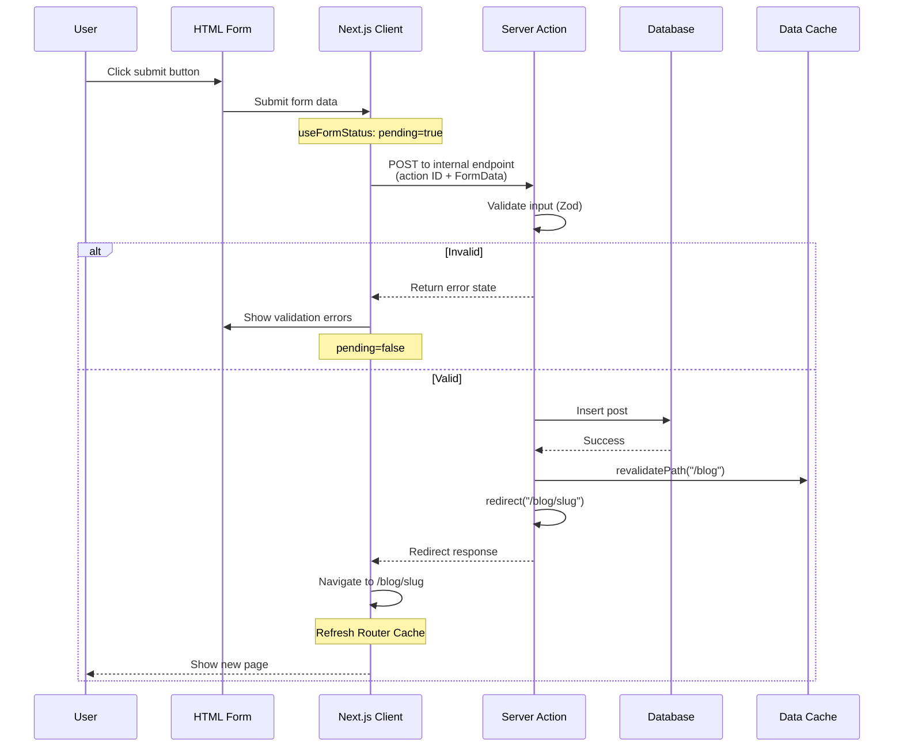
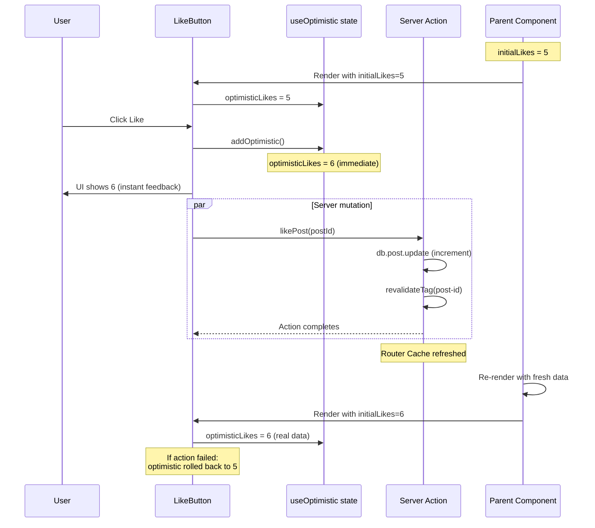

# 4.7 Server Actions and Forms

> Server Actions are async functions that run on the server and can be called directly from Client Components or HTML forms. They eliminate the need for separate API routes for mutations. This note covers the `"use server"` directive, the form `action` attribute, the `useFormStatus`, `useActionState` (formerly `useFormState`), and `useOptimistic` hooks, validation with Zod, error handling, and progressive enhancement.

## 4.7.1 Objective

By the end of this note you should be able to:

1. Define a Server Action at the file level and at the function level, and explain when to use each.
2. Wire a Server Action to an HTML form via the `action` attribute, and explain why this is better than `onSubmit`.
3. Use `useFormStatus` for pending state in submit buttons.
4. Use `useActionState` (React 19, formerly `useFormState`) for form state and validation errors.
5. Use `useOptimistic` for optimistic updates.
6. Validate form input with Zod on the server.
7. Call `revalidatePath` / `revalidateTag` and `redirect` from a Server Action.
8. Handle errors in Server Actions and explain progressive enhancement.

## 4.7.2 Background Knowledge

This note assumes you have read [[4.1 App Router Foundations]], [[4.3 Server and Client Components]] (the Server/Client boundary), [[4.6 Caching and Revalidation]] (revalidation APIs), and [[3.4 Forms and Conditional Rendering]] (general React form patterns). You should also be comfortable with the HTML `<form>` element, `FormData`, and HTTP `POST` requests from general web development.

## 4.7.3 Core Concepts

### 4.7.3.1 What Is a Server Action?

A Server Action is an `async` function that runs on the server and can be invoked from Client Components or HTML forms. It is the App Router's replacement for the Pages Router's API routes (`pages/api/...`) for the specific case of mutations.

```tsx
// app/actions.ts
"use server";

export async function createPost(formData: FormData) {
  const title = String(formData.get("title"));
  await db.post.create({ data: { title } });
  revalidatePath("/blog");
}
```

```tsx
// app/blog/new/page.tsx
import { createPost } from "@/app/actions";

export default function NewPostPage() {
  return (
    <form action={createPost}>
      <input name="title" />
      <button type="submit">Create</button>
    </form>
  );
}
```

When the form is submitted, the browser sends a `POST` to an internal Next.js endpoint that invokes the Server Action. The action runs on the server, has access to databases and other server-only resources, and can call `revalidatePath` / `revalidateTag` to refresh cached data.

### 4.7.3.2 Why Server Actions Exist

In the Pages Router, mutations required:

1. A separate API route (`pages/api/posts.ts`).
2. A `fetch` call from the Client Component to that API route.
3. Manual handling of pending state, errors, and cache invalidation.

This was verbose and error-prone. Server Actions eliminate the boilerplate:

- No separate API route — the action is just an async function.
- No `fetch` call — the form's `action` attribute handles it.
- Built-in pending state (`useFormStatus`) and optimistic updates (`useOptimistic`).
- Automatic cache invalidation via `revalidateTag` / `revalidatePath`.
- Progressive enhancement — forms work without JavaScript.

Server Actions are not a replacement for all API routes — public APIs, webhooks, and endpoints called by non-Next.js clients still need Route Handlers (see [[4.8 Route Handlers]]). Server Actions are specifically for Next.js-internal mutations.

### 4.7.3.3 How Server Actions Work Under the Hood

When Next.js compiles a Server Action:

1. It generates a unique ID for the action.
2. It creates an internal HTTP endpoint (e.g., `/__nextjs_original/...`) that maps the ID to the action.
3. When the action is invoked (from a form submit or a Client Component call), Next.js sends a `POST` to that internal endpoint with the action's ID and arguments.
4. The endpoint runs the action on the server and returns the result.

This is transparent to you — you write `async function` and call it. Next.js handles the wire protocol.

The implication: **Server Actions are POST requests under the hood.** They are not RPC over WebSocket, not GraphQL, not anything exotic. They are HTTP POSTs to internal endpoints. This means they are subject to the same rules as any HTTP request: CSRF considerations, rate limiting, etc.

### 4.7.3.4 The `"use server"` Directive

The `"use server"` directive marks a function (or a file) as a Server Action. There are two forms:

**File-level** — at the top of a file, marks every exported async function as a Server Action:

```ts
// app/actions.ts
"use server";

import { revalidatePath } from "next/cache";
import { db } from "@/lib/db";

export async function createPost(formData: FormData) {
  // ...
}

export async function deletePost(id: string) {
  // ...
}
```

**Function-level** — inside a Server Component, marks a single function as a Server Action:

```tsx
// app/page.tsx
import { revalidatePath } from "next/cache";

export default function Page() {
  async function createPost(formData: FormData) {
    "use server";
    // ...
  }

  return <form action={createPost}>...</form>;
}
```

File-level is preferred for reusable actions. Function-level is useful for actions that close over Server Component state (rare) or for co-locating an action with the page that uses it.

### 4.7.3.5 The Form `action` Attribute

The modern way to handle form submissions is the HTML `action` attribute, not the React `onSubmit` prop. The `action` attribute accepts a Server Action (or a URL).

```tsx
<form action={createPost}>
  <input name="title" />
  <button type="submit">Create</button>
</form>
```

When the form is submitted:

1. The browser gathers the form data into a `FormData` object.
2. The browser calls the Server Action with the `FormData` as the argument.
3. The action runs on the server.
4. After the action completes, Next.js refreshes the current route (if `revalidatePath` was called).

Benefits over `onSubmit`:

- **Progressive enhancement.** The form works without JavaScript — the `action` attribute is a standard HTML feature. With JS disabled, the form falls back to a standard POST.
- **No `e.preventDefault()`.** The default form submission is what you want — no need to prevent it.
- **No manual `FormData` construction.** The browser does it for you.
- **Built-in integration with Server Actions.** The `action` attribute accepts a Server Action directly.

### 4.7.3.6 The `FormData` API

`FormData` is the standard Web API for reading form data. In a Server Action, you receive a `FormData` object and read fields by name.

```tsx
async function createPost(formData: FormData) {
  const title = formData.get("title");         // string | null
  const tags = formData.getAll("tags");         // string[] (for multiple values)
  const file = formData.get("image");           // File | null
  const entries = Object.fromEntries(formData); // plain object
}
```

`get` returns the first value with the given name (or `null`). `getAll` returns all values (for checkboxes, multi-selects). Files are returned as `File` objects (a Web API).

### 4.7.3.7 Validation with Zod

Server Actions must validate input — the client cannot be trusted. The idiomatic pattern is Zod:

```tsx
"use server";
import { z } from "zod";

const PostSchema = z.object({
  title: z.string().min(1).max(200),
  body: z.string().min(1),
  tags: z.array(z.string()).optional(),
});

export async function createPost(formData: FormData) {
  const parsed = PostSchema.safeParse({
    title: formData.get("title"),
    body: formData.get("body"),
    tags: formData.getAll("tags"),
  });

  if (!parsed.success) {
    return { errors: parsed.error.flatten().fieldErrors };
  }

  await db.post.create({ data: parsed.data });
  revalidatePath("/blog");
}
```

Zod provides type-safe parsing, helpful error messages, and integrates well with TypeScript. Always validate at the action boundary, before any database writes.

### 4.7.3.8 The `useFormStatus` Hook

`useFormStatus` (from `react-dom`) gives a submit button information about the form's pending state. It must be a child component of the form (not the form itself).

```tsx
// app/blog/SubmitButton.tsx
"use client";
import { useFormStatus } from "react-dom";

export function SubmitButton() {
  const { pending } = useFormStatus();
  return (
    <button type="submit" disabled={pending}>
      {pending ? "Creating..." : "Create"}
    </button>
  );
}
```

```tsx
// app/blog/new/page.tsx
import { createPost } from "@/app/actions";
import { SubmitButton } from "./SubmitButton";

export default function NewPostPage() {
  return (
    <form action={createPost}>
      <input name="title" />
      <SubmitButton />
    </form>
  );
}
```

`useFormStatus` only works inside a component that is a descendant of a `<form>`. It reflects the pending state of the parent form.

### 4.7.3.9 The `useActionState` Hook (React 19)

`useActionState` (formerly `useFormState` in React 18-era canary) is a hook for managing form state and validation errors returned by a Server Action.

```tsx
"use client";
import { useActionState } from "react";

type State = { errors?: { title?: string[] } };

async function createPost(prevState: State, formData: FormData): Promise<State> {
  const title = String(formData.get("title"));
  if (!title) return { errors: { title: ["Title is required"] } };
  await api.createPost({ title });
  return {};
}

export function NewPostForm() {
  const [state, formAction] = useActionState(createPost, {});

  return (
    <form action={formAction}>
      <input name="title" />
      {state.errors?.title && <p>{state.errors.title[0]}</p>}
      <button type="submit">Create</button>
    </form>
  );
}
```

The hook takes an action and an initial state, and returns `[state, formAction]`. The `formAction` is what you pass to the form's `action` attribute. The `state` is the latest return value of the action.

The action signature is `(prevState, formData) => newState`. The `prevState` is the previous state (initially the initial state you passed). This lets the action accumulate state across multiple submissions.

### 4.7.3.10 The `useOptimistic` Hook

`useOptimistic` is a hook for optimistic updates — showing the user the result of an action before the action completes. If the action fails, the optimistic update is rolled back.

```tsx
"use client";
import { useOptimistic } from "react";

type Todo = { id: string; text: string; done: boolean };

export function TodoList({ todos, addTodoAction }: { todos: Todo[]; addTodoAction: (text: string) => Promise<void> }) {
  const [optimisticTodos, addOptimistic] = useOptimistic(
    todos,
    (state, newText: string) => [...state, { id: "temp", text: newText, done: false }]
  );

  return (
    <>
      <ul>
        {optimisticTodos.map((t) => <li key={t.id}>{t.text}</li>)}
      </ul>
      <form action={async (formData) => {
        const text = String(formData.get("text"));
        addOptimistic(text);
        await addTodoAction(text);
      }}>
        <input name="text" />
        <button type="submit">Add</button>
      </form>
    </>
  );
}
```

When the form is submitted, `addOptimistic(text)` immediately adds the new todo to the optimistic state (visible to the user). The Server Action runs in the background. When it completes, the component re-renders with the real data from the server (which now includes the new todo).

If the action fails, the optimistic update is automatically rolled back — the new todo disappears.

### 4.7.3.11 `revalidatePath` and `revalidateTag` in Server Actions

After a mutation, you call `revalidatePath` or `revalidateTag` to invalidate the cache for the affected data. This is the same API as in [[4.6 Caching and Revalidation]], but called from a Server Action.

```tsx
"use server";
import { revalidatePath, revalidateTag } from "next/cache";

export async function updatePost(slug: string, formData: FormData) {
  await db.post.update({ where: { slug }, data: { /* ... */ } });
  revalidatePath(`/blog/${slug}`);   // invalidate the post page
  revalidateTag("posts-list");        // invalidate the blog index
}
```

After the action completes, Next.js automatically refreshes the Router Cache for the calling client — the user sees the updated data without a manual `router.refresh()`.

### 4.7.3.12 `redirect()` After an Action

Use `redirect()` from `next/navigation` to navigate to a new URL after an action completes. Common pattern: after creating a resource, redirect to its detail page.

```tsx
"use server";
import { redirect } from "next/navigation";

export async function createPost(formData: FormData) {
  const post = await db.post.create({ data: { /* ... */ } });
  redirect(`/blog/${post.slug}`);
}
```

`redirect()` must be called outside `try/catch` blocks — it throws internally to short-circuit the action. (See "Common Mistakes" below.)

### 4.7.3.13 Error Handling

Server Actions can throw errors. The behavior depends on where the error is thrown:

- If the action throws during execution, the error propagates to the calling form. The form remains interactive; the user can retry.
- If the action calls `redirect()`, that "throws" a special redirect signal — it is not a real error.
- If the action returns an error state (instead of throwing), the calling component can display it via `useActionState`.

The pattern for validation errors: return them as state, don't throw.

```tsx
async function createPost(prevState: State, formData: FormData): Promise<State> {
  const parsed = PostSchema.safeParse(/* ... */);
  if (!parsed.success) {
    return { errors: parsed.error.flatten().fieldErrors };  // return, don't throw
  }
  try {
    await db.post.create({ data: parsed.data });
    return { success: true };
  } catch (e) {
    return { error: "Failed to create post" };  // return, don't throw
  }
}
```

For unexpected errors (database down, etc.), let them throw — Next.js will surface them via the nearest `error.tsx`.

### 4.7.3.14 Progressive Enhancement

Forms with Server Actions work without JavaScript. The `action` attribute is a standard HTML feature — when JS is disabled, the browser falls back to a standard POST request to the action's URL.

This means:

- The form works on slow connections where JS hasn't loaded yet.
- The form works in browsers with JS disabled.
- The form works in older browsers.

The catch: hooks like `useFormStatus`, `useActionState`, and `useOptimistic` require JS. Without JS, the form submits and the page navigates — no optimistic updates, no pending state. But the mutation still happens.

This is the progressive enhancement promise: basic functionality works without JS, enhanced functionality works with JS.

## 4.7.4 Detailed Walkthrough

### 4.7.4.1 The Anatomy of a Server Action Form

A complete example with all the pieces:

```tsx
// app/actions.ts
"use server";
import { z } from "zod";
import { revalidatePath } from "next/cache";
import { redirect } from "next/navigation";
import { db } from "@/lib/db";

const PostSchema = z.object({
  title: z.string().min(1, "Title is required").max(200),
  body: z.string().min(1, "Body is required"),
});

export type State = {
  errors?: { title?: string[]; body?: string[] };
  message?: string;
};

export async function createPost(prevState: State, formData: FormData): Promise<State> {
  const parsed = PostSchema.safeParse({
    title: formData.get("title"),
    body: formData.get("body"),
  });

  if (!parsed.success) {
    return { errors: parsed.error.flatten().fieldErrors };
  }

  try {
    const post = await db.post.create({ data: parsed.data });
    revalidatePath("/blog");
    redirect(`/blog/${post.slug}`);
  } catch (e) {
    return { message: "Failed to create post" };
  }
}
```

```tsx
// app/blog/new/SubmitButton.tsx
"use client";
import { useFormStatus } from "react-dom";

export function SubmitButton() {
  const { pending } = useFormStatus();
  return (
    <button type="submit" disabled={pending}>
      {pending ? "Creating..." : "Create post"}
    </button>
  );
}
```

```tsx
// app/blog/new/page.tsx
"use client";
import { useActionState } from "react";
import { createPost, type State } from "@/app/actions";
import { SubmitButton } from "./SubmitButton";

export default function NewPostPage() {
  const [state, formAction] = useActionState<State, FormData>(createPost, {});

  return (
    <form action={formAction}>
      <input name="title" />
      {state.errors?.title && <p className="error">{state.errors.title[0]}</p>}
      <textarea name="body" />
      {state.errors?.body && <p className="error">{state.errors.body[0]}</p>}
      {state.message && <p className="error">{state.message}</p>}
      <SubmitButton />
    </form>
  );
}
```

Pieces:

- `createPost` is the Server Action, defined in a `"use server"` file. It validates input, creates the post, revalidates the cache, and redirects.
- `SubmitButton` is a Client Component using `useFormStatus` to show pending state.
- `NewPostPage` is a Client Component using `useActionState` to manage form state and errors.
- The form's `action` attribute is the wrapped `formAction` from `useActionState`.

### 4.7.4.2 Why `useFormStatus` Must Be a Child Component

`useFormStatus` reads the form context — it can only be used inside a component that is a descendant of the `<form>`. The form itself cannot use it.

```tsx
//  This does not work — useFormStatus cannot be in the form's own component
function Form() {
  const { pending } = useFormStatus();  // returns pending: false always
  return (
    <form action={...}>
      <button disabled={pending}>{pending ? "..." : "Submit"}</button>
    </form>
  );
}
```

```tsx
//  Extract the button to a child component
function Form() {
  return (
    <form action={...}>
      <SubmitButton />
    </form>
  );
}

function SubmitButton() {
  const { pending } = useFormStatus();  // works correctly
  return <button disabled={pending}>{pending ? "..." : "Submit"}</button>;
}
```

This is because `useFormStatus` uses React Context, and the context provider is the form. A component cannot read its own context provider — only descendants can.

### 4.7.4.3 The `useActionState` Action Signature

The action passed to `useActionState` has a specific signature: `(prevState, formData) => newState`. The `prevState` is the previous state (initially the initial state you passed). The `formData` is the form's data.

```tsx
async function action(prevState: State, formData: FormData): Promise<State> {
  // prevState is the previous return value (or initial state on first call)
  // formData is the form's data
  // return the new state
}
```

This signature is different from a plain Server Action (which is just `(formData) => void` or `(formData) => result`). When you wrap an action with `useActionState`, the hook adapts the signature.

For a plain Server Action used directly in `action={...}` (no `useActionState`), the signature is just `(formData) => ...`.

### 4.7.4.4 Optimistic Updates in Detail

The `useOptimistic` pattern: show the user the result of an action immediately, before the action completes. If the action fails, the optimistic update is rolled back.

```tsx
"use client";
import { useOptimistic } from "react";

export function LikeButton({ postId, initialLikes, likeAction }: {
  postId: string;
  initialLikes: number;
  likeAction: (postId: string) => Promise<void>;
}) {
  const [optimisticLikes, addOptimistic] = useOptimistic(
    initialLikes,
    (state, _: void) => state + 1
  );

  return (
    <form action={async () => {
      addOptimistic();
      await likeAction(postId);
    }}>
      <button type="submit">Like ({optimisticLikes})</button>
    </form>
  );
}
```

When the user clicks Like:

1. `addOptimistic()` is called, immediately incrementing `optimisticLikes`. The user sees the new count.
2. The Server Action `likeAction` runs in the background.
3. When the action completes, the parent re-renders with the new `initialLikes` from the server. The optimistic state is replaced with the real state.
4. If the action fails, the optimistic state is rolled back — `optimisticLikes` returns to its previous value.

The user perceives instant feedback. The actual mutation happens in the background.

### 4.7.4.5 When to Use Server Actions vs Route Handlers

| Use case | Server Action | Route Handler |
|----------|---------------|---------------|
| Mutations from forms |  |  |
| Mutations from Client Components (no form) |  |  |
| Public API endpoints |  |  |
| Webhooks |  |  |
| Endpoints called by non-Next.js clients |  |  |
| File uploads from forms |  |  |
| GET requests (data fetching) |  |  |

Server Actions are for mutations invoked from your own Next.js app. Route Handlers are for everything else — public APIs, webhooks, GET endpoints.

### 4.7.4.6 Calling Server Actions from Client Components (Without a Form)

You can call a Server Action directly from a Client Component, without a form. This is useful for mutations triggered by button clicks that don't have form data.

```tsx
"use server";
export async function logout() {
  // clear session
  redirect("/login");
}
```

```tsx
"use client";
import { logout } from "@/app/actions";

export function LogoutButton() {
  return <button onClick={() => logout()}>Logout</button>;
}
```

The action is called like a regular async function. Next.js handles the wire protocol. The action can use `redirect`, `revalidateTag`, etc. just like in a form.

The catch: without a form, you lose progressive enhancement. The button requires JS to work. For mutations that have form data, prefer the form pattern.

### 4.7.4.7 Security Considerations

Server Actions are HTTP endpoints under the hood. They are subject to the same security considerations as any HTTP endpoint:

1. **Validate input.** Always validate with Zod or similar. The client cannot be trusted.
2. **Authorize.** Check that the user is allowed to perform the action. Read cookies via `cookies()` to identify the user.
3. **Rate-limit.** Server Actions can be called repeatedly. Consider rate-limiting for expensive actions.
4. **CSRF.** Server Actions use a built-in CSRF protection (the action ID is unguessable). You generally don't need additional CSRF protection, but verify this for your use case.
5. **Don't expose secrets.** Server Action arguments are serialized and sent over the wire. Don't pass secrets as arguments — read them from environment variables on the server.

```tsx
"use server";
import { cookies } from "next/headers";

export async function deletePost(id: string) {
  const cookieStore = await cookies();
  const sessionId = cookieStore.get("session")?.value;
  const user = await getUserFromSession(sessionId);
  if (!user || !user.isAdmin) {
    throw new Error("Not authorized");
  }
  await db.post.delete({ where: { id } });
  revalidatePath("/blog");
}
```

## 4.7.5 Practical Examples

### 4.7.5.1 A Complete Create-Post Form

```tsx
// app/actions.ts
"use server";
import { z } from "zod";
import { revalidatePath } from "next/cache";
import { redirect } from "next/navigation";
import { db } from "@/lib/db";
import { requireUser } from "@/lib/auth";

const PostSchema = z.object({
  title: z.string().min(1, "Title is required").max(200),
  body: z.string().min(1, "Body is required"),
});

export type State = {
  errors?: { title?: string[]; body?: string[] };
  message?: string;
};

export async function createPost(prevState: State, formData: FormData): Promise<State> {
  const user = await requireUser();
  const parsed = PostSchema.safeParse({
    title: formData.get("title"),
    body: formData.get("body"),
  });
  if (!parsed.success) {
    return { errors: parsed.error.flatten().fieldErrors };
  }
  try {
    const post = await db.post.create({
      data: { ...parsed.data, authorId: user.id, slug: slugify(parsed.data.title) },
    });
    revalidatePath("/blog");
    redirect(`/blog/${post.slug}`);
  } catch {
    return { message: "Failed to create post" };
  }
}
```

```tsx
// app/blog/new/SubmitButton.tsx
"use client";
import { useFormStatus } from "react-dom";

export function SubmitButton() {
  const { pending } = useFormStatus();
  return (
    <button type="submit" disabled={pending}>
      {pending ? "Creating..." : "Create post"}
    </button>
  );
}
```

```tsx
// app/blog/new/page.tsx
"use client";
import { useActionState } from "react";
import { createPost, type State } from "@/app/actions";
import { SubmitButton } from "./SubmitButton";

export default function NewPostPage() {
  const [state, formAction] = useActionState<State, FormData>(createPost, {});

  return (
    <form action={formAction} className="space-y-4">
      <div>
        <label htmlFor="title">Title</label>
        <input id="title" name="title" />
        {state.errors?.title && <p className="text-red-500">{state.errors.title[0]}</p>}
      </div>
      <div>
        <label htmlFor="body">Body</label>
        <textarea id="body" name="body" />
        {state.errors?.body && <p className="text-red-500">{state.errors.body[0]}</p>}
      </div>
      {state.message && <p className="text-red-500">{state.message}</p>}
      <SubmitButton />
    </form>
  );
}
```

### 4.7.5.2 Optimistic Like Button

```tsx
// app/actions.ts
"use server";
import { db } from "@/lib/db";
import { revalidateTag } from "next/cache";

export async function likePost(postId: string) {
  await db.post.update({ where: { id: postId }, data: { likes: { increment: 1 } } });
  revalidateTag(`post-${postId}`);
}
```

```tsx
// app/blog/[slug]/LikeButton.tsx
"use client";
import { useOptimistic } from "react";
import { likePost } from "@/app/actions";

export function LikeButton({ postId, initialLikes }: { postId: string; initialLikes: number }) {
  const [optimisticLikes, addOptimistic] = useOptimistic(
    initialLikes,
    (state) => state + 1
  );

  return (
    <form action={async () => {
      addOptimistic();
      await likePost(postId);
    }}>
      <button type="submit"> {optimisticLikes}</button>
    </form>
  );
}
```

When the user clicks Like, the count increments immediately. The server-side mutation runs in the background. When it completes, the parent re-renders with the new `initialLikes` from the server.

### 4.7.5.3 Delete with Confirmation

```tsx
// app/actions.ts
"use server";
import { revalidatePath } from "next/cache";
import { redirect } from "next/navigation";
import { db } from "@/lib/db";

export async function deletePost(id: string) {
  await db.post.delete({ where: { id } });
  revalidatePath("/blog");
  redirect("/blog");
}
```

```tsx
// app/blog/[slug]/DeleteButton.tsx
"use client";
import { useTransition } from "react";
import { deletePost } from "@/app/actions";

export function DeleteButton({ id }: { id: string }) {
  const [isPending, startTransition] = useTransition();

  return (
    <button
      disabled={isPending}
      onClick={() => {
        if (confirm("Are you sure?")) {
          startTransition(() => deletePost(id));
        }
      }}
    >
      {isPending ? "Deleting..." : "Delete"}
    </button>
  );
}
```

The `useTransition` hook lets you call a Server Action outside a form, with pending state. The action runs in a transition — React keeps the UI responsive during the mutation.

## 4.7.6 Mermaid Diagrams

### 4.7.6.1 Server Action Form Submission — Sequence



### 4.7.6.2 The `"use server"` Boundary

```mermaid
flowchart TB
    subgraph Client["Client Bundle"]
        Form["<form action={createPost}>"]
        SubmitButton["SubmitButton<br/>(useFormStatus)"]
        State["useActionState"]
        Form --> SubmitButton
        State --> Form
    end

    subgraph Server["Server Bundle"]
        ActionFile["app/actions.ts<br/>use server"]
        ActionFile --> CreatePost["createPost(formData)"]
        CreatePost --> Validate["Zod validate"]
        Validate --> DB["db.post.create"]
        DB --> Revalidate["revalidatePath"]
        Revalidate --> Redirect["redirect"]
    end

    Form -.->|"action attribute"| CreatePost
    CreatePost -.->|"returns state"| State

    Boundary["Server/Client Boundary"]
    Form -.-> Boundary
    Boundary -.-> CreatePost

    style Client fill:#fde2e2,stroke:#c0392b
    style Server fill:#e2fde2,stroke:#27ae60
    style Boundary fill:#fff4e2,stroke:#f39c12
```



### 4.7.6.3 Optimistic Update Lifecycle



## 4.7.7 Common Mistakes

1. **Wrapping `redirect()` in a try/catch.** `redirect()` throws internally to short-circuit the action. If you wrap it in `try/catch`, the catch block runs and the redirect is swallowed. Always call `redirect()` outside `try/catch`.

2. **Using `useFormStatus` in the form's own component.** It returns `pending: false` always, because it reads context from ancestors, not itself. Extract the button to a child component.

3. **Forgetting to validate input.** Server Actions are HTTP endpoints. The client can send any data. Always validate with Zod or similar before any database write.

4. **Forgetting to call `revalidatePath` or `revalidateTag`.** Without revalidation, the cache still has the old data. The user sees no change after the action.

5. **Passing non-serializable arguments.** Server Action arguments are serialized over the wire. You cannot pass functions, class instances, or Symbols. Pass plain data (strings, numbers, plain objects, arrays).

6. **Using `onSubmit` instead of `action`.** The `action` attribute is the modern way. `onSubmit` requires `e.preventDefault()` and manual `FormData` construction, and loses progressive enhancement.

7. **Calling Server Actions from non-Next.js clients.** Server Actions are internal endpoints, not a public API. Their URLs are not stable and should not be called by external clients. Use Route Handlers for public APIs.

8. **Not authorizing the action.** Any user can call any Server Action. You must check the user's identity and permissions inside the action. Do not assume the form's UI prevented unauthorized access.

9. **Returning thrown errors instead of state.** For validation errors, return them as state (via `useActionState`). Throwing causes the error to propagate to the nearest `error.tsx`, which is jarring for a form validation error.

10. **Mutating state directly in the action signature.** The `useActionState` action signature is `(prevState, formData) => newState`. Do not mutate `prevState` — return a new state object.

## 4.7.8 Best Practices

1. **Use the `action` attribute, not `onSubmit`.** It gives you progressive enhancement for free and integrates naturally with Server Actions.

2. **Validate with Zod at the action boundary.** Define a schema for each action. Parse the input before any database write. Return validation errors as state.

3. **Use `useFormStatus` for pending state.** Extract the submit button to its own Client Component and use `useFormStatus`. This is cleaner than tracking pending state manually.

4. **Use `useActionState` for form state.** It manages the action's return value (errors, success messages) and integrates with the form's `action` attribute.

5. **Use `useOptimistic` for instant feedback.** For mutations where the user expects instant response (likes, votes, toggles), use `useOptimistic`. The UI updates immediately; the server catches up.

6. **Call `revalidatePath` or `revalidateTag` after mutations.** Otherwise the cache serves stale data. Tag your fetches so you can use `revalidateTag` for fine-grained invalidation.

7. **Call `redirect()` outside `try/catch`.** It throws internally. Put it after the `try/catch` block, not inside.

8. **Authorize inside the action.** Read cookies via `cookies()` to identify the user. Check permissions. Do not trust the form's UI.

9. **Keep actions in a `"use server"` file.** File-level `"use server"` is cleaner than function-level. Co-locate actions in `app/actions.ts` or per-route action files.

10. **Use Route Handlers for public APIs and webhooks.** Server Actions are for Next.js-internal mutations. Anything called by external clients should be a Route Handler.

11. **Handle errors gracefully.** Return validation errors as state. Let unexpected errors throw — they'll be caught by `error.tsx`. Don't swallow errors silently.

12. **Test progressive enhancement.** Disable JS in your browser and verify the form still works (submits and the mutation happens). This is the progressive enhancement promise.

## 4.7.9 Mini Exercises

### Exercise 1 — Convert `onSubmit` to `action`

Refactor this `onSubmit`-based form to use a Server Action via the `action` attribute.

```tsx
"use client";
import { useState } from "react";

export function SubscribeForm() {
  const [email, setEmail] = useState("");
  const [status, setStatus] = useState<"idle" | "loading" | "error">("idle");

  const onSubmit = async (e: React.FormEvent) => {
    e.preventDefault();
    setStatus("loading");
    try {
      await fetch("/api/subscribe", { method: "POST", body: JSON.stringify({ email }) });
      setStatus("idle");
      setEmail("");
    } catch {
      setStatus("error");
    }
  };

  return (
    <form onSubmit={onSubmit}>
      <input type="email" value={email} onChange={(e) => setEmail(e.target.value)} />
      <button type="submit" disabled={status === "loading"}>
        {status === "loading" ? "..." : "Subscribe"}
      </button>
      {status === "error" && <p>Something went wrong</p>}
    </form>
  );
}
```

**Worked solution:**

```tsx
// app/actions.ts
"use server";
import { z } from "zod";
import { db } from "@/lib/db";

const Schema = z.object({ email: z.string().email() });

export type State = { error?: string; success?: boolean };

export async function subscribe(_: State, formData: FormData): Promise<State> {
  const parsed = Schema.safeParse({ email: formData.get("email") });
  if (!parsed.success) return { error: "Invalid email" };
  try {
    await db.subscriber.create({ data: parsed.data });
    return { success: true };
  } catch {
    return { error: "Failed to subscribe" };
  }
}
```

```tsx
// app/SubscribeForm.tsx
"use client";
import { useActionState } from "react";
import { useFormStatus } from "react-dom";
import { subscribe, type State } from "@/app/actions";

function SubmitButton() {
  const { pending } = useFormStatus();
  return <button type="submit" disabled={pending}>{pending ? "..." : "Subscribe"}</button>;
}

export function SubscribeForm() {
  const [state, formAction] = useActionState<State, FormData>(subscribe, {});
  return (
    <form action={formAction}>
      <input type="email" name="email" required />
      <SubmitButton />
      {state.error && <p>{state.error}</p>}
      {state.success && <p>Subscribed!</p>}
    </form>
  );
}
```

Changes:

- The form no longer uses `useState` for the input value — it's an uncontrolled input via `name="email"`.
- The action is a Server Action in a `"use server"` file, with Zod validation.
- `useFormStatus` handles pending state (in the extracted `SubmitButton`).
- `useActionState` handles the action's return value (errors and success).
- The form works without JS (progressive enhancement).

### Exercise 2 — Add Validation with Zod

Add Zod validation to this Server Action. The title must be 1-200 characters; the body must be non-empty; the tags must be an array of strings.

```tsx
"use server";
export async function createPost(formData: FormData) {
  const title = String(formData.get("title"));
  const body = String(formData.get("body"));
  const tags = formData.getAll("tags");
  await db.post.create({ data: { title, body, tags } });
  revalidatePath("/blog");
}
```

**Worked solution:**

```tsx
"use server";
import { z } from "zod";
import { revalidatePath } from "next/cache";
import { db } from "@/lib/db";

const PostSchema = z.object({
  title: z.string().min(1, "Title is required").max(200, "Title must be 200 chars or fewer"),
  body: z.string().min(1, "Body is required"),
  tags: z.array(z.string()).default([]),
});

export type State = {
  errors?: { title?: string[]; body?: string[]; tags?: string[] };
  success?: boolean;
};

export async function createPost(_: State, formData: FormData): Promise<State> {
  const parsed = PostSchema.safeParse({
    title: formData.get("title"),
    body: formData.get("body"),
    tags: formData.getAll("tags"),
  });

  if (!parsed.success) {
    return { errors: parsed.error.flatten().fieldErrors };
  }

  await db.post.create({ data: parsed.data });
  revalidatePath("/blog");
  return { success: true };
}
```

The Zod schema defines the expected shape and constraints. `safeParse` returns either `{ success: true, data }` or `{ success: false, error }`. On failure, we return the field errors as state. On success, we use the parsed (and typed) data for the database write.

### Exercise 3 — Fix the `redirect()` Bug

This Server Action does not redirect. Find the bug and fix it.

```tsx
"use server";
import { redirect } from "next/navigation";

export async function createPost(formData: FormData) {
  try {
    const post = await db.post.create({ data: { /* ... */ } });
    redirect(`/blog/${post.slug}`);
  } catch (e) {
    return { error: "Failed to create post" };
  }
}
```

**Worked solution:**

Diagnosis: `redirect()` throws internally to short-circuit the action. The `try/catch` catches the redirect's throw, treats it as an error, and returns `{ error: "Failed to create post" }`. The redirect is swallowed.

Fix: call `redirect()` outside the `try/catch`:

```tsx
"use server";
import { redirect } from "next/navigation";

export async function createPost(formData: FormData) {
  let post;
  try {
    post = await db.post.create({ data: { /* ... */ } });
  } catch (e) {
    return { error: "Failed to create post" };
  }
  redirect(`/blog/${post.slug}`);
}
```

Now the `redirect()` is outside the `try/catch` and throws normally, navigating the user to the new post's page.

### Exercise 4 — Build an Optimistic Like Button

Build a like button that shows the new count immediately when clicked, then confirms with the server. If the server fails, the count rolls back.

**Worked solution:**

```tsx
// app/actions.ts
"use server";
import { revalidateTag } from "next/cache";
import { db } from "@/lib/db";

export async function likePost(postId: string) {
  await db.post.update({
    where: { id: postId },
    data: { likes: { increment: 1 } },
  });
  revalidateTag(`post-${postId}`);
}
```

```tsx
// app/LikeButton.tsx
"use client";
import { useOptimistic } from "react";
import { likePost } from "@/app/actions";

export function LikeButton({ postId, initialLikes }: { postId: string; initialLikes: number }) {
  const [optimisticLikes, addOptimistic] = useOptimistic(
    initialLikes,
    (state) => state + 1
  );

  return (
    <form action={async () => {
      addOptimistic();
      await likePost(postId);
    }}>
      <button type="submit"> {optimisticLikes}</button>
    </form>
  );
}
```

When the user clicks the button:

1. `addOptimistic()` immediately increments `optimisticLikes`. The UI shows the new count.
2. The Server Action `likePost` runs in the background.
3. When the action completes, the parent re-renders with the new `initialLikes` (fetched fresh because `revalidateTag` invalidated the cache).
4. `useOptimistic` synchronizes — the optimistic state is replaced with the real state.
5. If the action fails (throws), the optimistic update is rolled back — `optimisticLikes` returns to its previous value.

### Exercise 5 — Authorize a Server Action

The following Server Action allows any user to delete any post. Add authorization: only the post's author can delete it.

```tsx
"use server";
import { revalidatePath } from "next/cache";
import { redirect } from "next/navigation";
import { db } from "@/lib/db";

export async function deletePost(id: string) {
  await db.post.delete({ where: { id } });
  revalidatePath("/blog");
  redirect("/blog");
}
```

Assume there is a `getCurrentUser()` function (already wrapped in `cache()`) that returns the current user or `null`.

**Worked solution:**

```tsx
"use server";
import { revalidatePath } from "next/cache";
import { redirect } from "next/navigation";
import { db } from "@/lib/db";
import { getCurrentUser } from "@/lib/auth";

export async function deletePost(id: string) {
  const user = await getCurrentUser();
  if (!user) throw new Error("Not authenticated");

  const post = await db.post.findUnique({ where: { id } });
  if (!post) throw new Error("Post not found");

  if (post.authorId !== user.id) {
    throw new Error("Not authorized to delete this post");
  }

  await db.post.delete({ where: { id } });
  revalidatePath("/blog");
  redirect("/blog");
}
```

Changes:

1. Call `getCurrentUser()` to get the authenticated user.
2. Throw if not authenticated.
3. Fetch the post to check ownership.
4. Throw if the user is not the author.
5. Only then perform the delete.

The throws will propagate to the nearest `error.tsx`, which can show a friendly error message. For a more polished UX, return errors as state instead of throwing — but for authorization failures, throwing is acceptable because the user shouldn't be reaching this code path through normal UI.

The key lesson: **never trust the client.** The form's UI might hide the delete button for non-authors, but a malicious user can call the Server Action directly. The action must independently verify authorization.

## 4.7.10 Summary

Server Actions are async functions that run on the server and can be called from Client Components or HTML forms. They are marked with the `"use server"` directive (file-level or function-level). Forms use the `action` attribute (not `onSubmit`) to wire up Server Actions, gaining progressive enhancement for free. `useFormStatus` provides pending state for submit buttons (must be in a child component of the form). `useActionState` (React 19, formerly `useFormState`) manages form state and validation errors. `useOptimistic` provides instant feedback for mutations. Validate input with Zod at the action boundary. Call `revalidatePath` or `revalidateTag` after mutations to refresh cached data. Use `redirect()` for post-action navigation (outside `try/catch`). Authorize inside the action — never trust the client. Use Route Handlers (not Server Actions) for public APIs and webhooks.

## 4.7.11 Related Notes

- [[4.1 App Router Foundations]] — the App Router model.
- [[4.3 Server and Client Components]] — the Server/Client boundary that Server Actions cross.
- [[4.5 Data Fetching]] — the read side of the data layer; Server Actions are the write side.
- [[4.6 Caching and Revalidation]] — the `revalidateTag` and `revalidatePath` APIs called from Server Actions.
- [[4.8 Route Handlers]] — when to use Route Handlers instead of Server Actions.
- [[3.4 Forms and Conditional Rendering]] — general React form patterns.
- [[3.6 Hooks (Built-In)]] — `useTransition`, `useState`, and the foundation for the action hooks.
