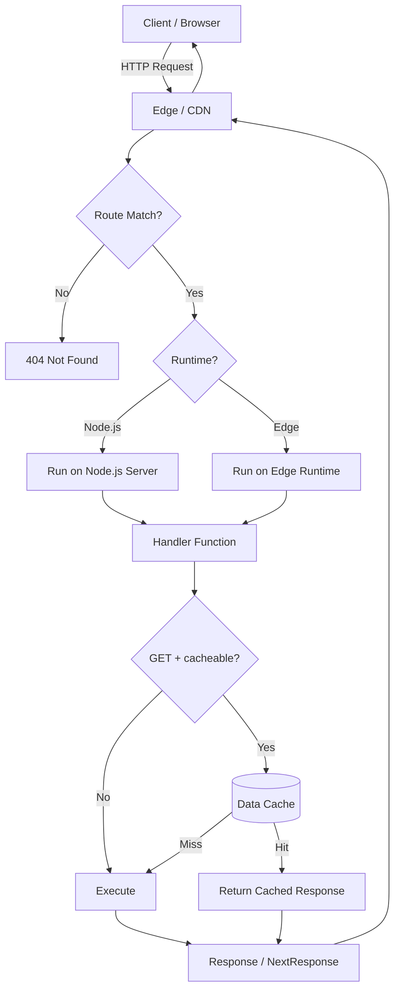
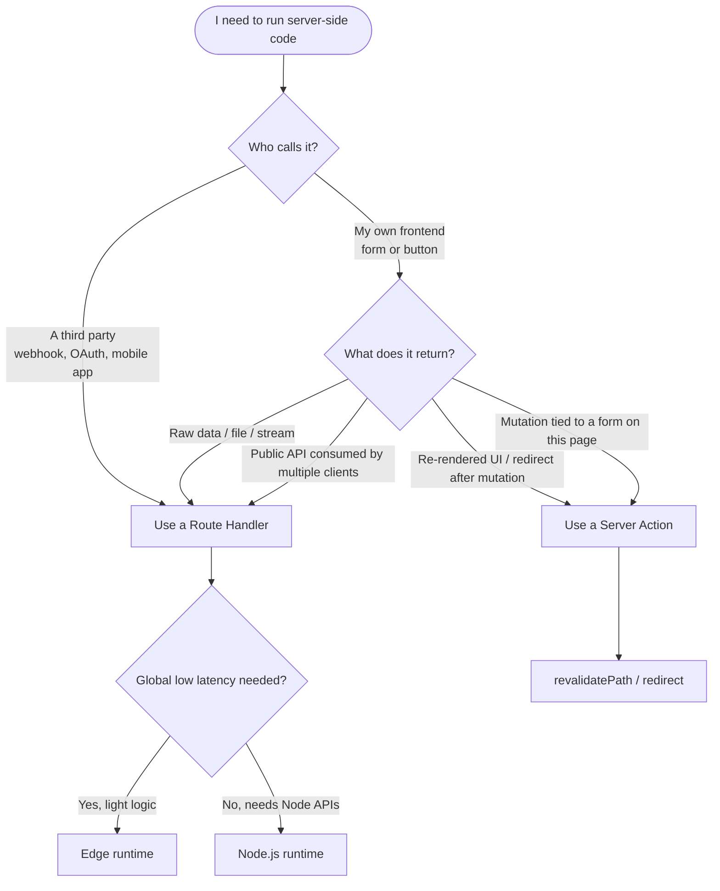

# 4.8 Route Handlers

> Route Handlers are functions exported from a `route.ts` (or `route.js`) file inside the App Router that respond to HTTP requests at a given URL. They replace the Pages Router's API Routes (`pages/api/*`) and are built on top of the standard Web [`Request`](https://developer.mozilla.org/en-US/docs/Web/API/Request) and [`Response`](https://developer.mozilla.org/en-US/docs/Web/API/Response) objects rather than Express-style `req`/`res`. This note covers the supported HTTP methods, reading request data, returning responses, the `NextResponse` helpers, caching behavior of `GET` handlers, the `dynamic` and `runtime` route segment config options, and the decision-making process for choosing Route Handlers over Server Actions.

## 4.8.1 Objective

By the end of this note you should be able to:

1. Create a Route Handler that responds to `GET`, `POST`, `PUT`, `PATCH`, `DELETE`, `HEAD`, and `OPTIONS` requests.
2. Read URL parameters, query string `searchParams`, request headers, cookies, and JSON / FormData / stream bodies using Web Standard APIs.
3. Use `NextResponse.json()`, `NextResponse.redirect()`, and `NextResponse.rewrite()` correctly.
4. Explain why `GET` Route Handlers are cached by default and how to opt out with `export const dynamic = 'force-dynamic'` or the `Cache-Control: no-store` header.
5. Choose between the Node.js and Edge runtimes with `export const runtime = 'nodejs' | 'edge'`.
6. Decide whether a given feature belongs in a Route Handler or a Server Action, and articulate the tradeoffs.

## 4.8.2 Background Knowledge

This note assumes you have read [[4.1 App Router Foundations]] (route segments, the `app/` directory), [[4.3 Server and Client Components]] (the Server/Client boundary), [[4.6 Caching and Revalidation]] (the Data Cache, Full Route Cache, and revalidation APIs), and [[4.7 Server Actions and Forms]] (mutations via `"use server"`). You should also be familiar with the Web Fetch API (`fetch`, `Request`, `Response`, `Headers`), the structure of an HTTP request and response, and the difference between JSON, FormData, and streaming bodies. If you have used Express or the Pages Router's `pages/api/*.ts` files, unlearn the `req.query` / `req.body` / `res.status(200).json(...)` mental model before continuing — Route Handlers do not work that way.

## 4.8.3 Core Concepts

### 4.8.3.1 What a Route Handler Actually Is

A Route Handler is just an exported async function whose name is an HTTP method (`GET`, `POST`, etc.) placed in a file named `route.ts` (or `route.js`) inside a route segment of the `app/` directory. The file path determines the URL. The exported function name determines which HTTP verbs the endpoint accepts.

```ts
// app/api/hello/route.ts
export async function GET(request: Request) {
  return Response.json({ message: 'Hello, World' });
}
```

Visiting `/api/hello` in the browser (which issues a `GET` request) returns the JSON above. Sending a `POST` to the same URL returns a `405 Method Not Allowed`, because no `POST` function was exported.

> [!note] File Naming Discipline
> A route segment may contain exactly one of `page.tsx`, `route.ts`, or neither — never both. `page.tsx` renders UI for a URL; `route.ts` returns raw HTTP. They cannot coexist at the same path because they would both be claiming to "answer" that URL.

### 4.8.3.2 The Web Standard `Request` and `Response` Objects

The argument passed to a Route Handler is a standard [`Request`](https://developer.mozilla.org/en-US/docs/Web/API/Request) — the same type you would use in the browser with `fetch()`. The return value must be a `Response` (or `NextResponse`, which extends `Response`). This is a deliberate alignment with Web Standards: the same code you write for a Route Handler can, in principle, run in a Service Worker or in any other Web-interoperable runtime.

This design choice has practical consequences:

- You read the body with `await request.json()`, `await request.text()`, `await request.formData()`, or `await request.blob()` — not with `req.body`.
- You read headers with `request.headers.get('Content-Type')`.
- You read cookies via `request.cookies` (because Next.js patches the standard `Request` with a `cookies` accessor for convenience — see below).
- You read query parameters via `request.nextUrl.searchParams` (Next.js extension) or `new URL(request.url).searchParams` (pure Web Standard).
- You return a `Response` object you construct yourself, or you use the `NextResponse` helpers.

### 4.8.3.3 The `NextResponse` Helpers

`NextResponse` extends `Response` and provides convenience static methods:

| Method | Use Case |
|--------|----------|
| `NextResponse.json(body, init)` | Return JSON with the right `Content-Type` |
| `NextResponse.redirect(url, status?)` | Issue an HTTP redirect (default 307) |
| `NextResponse.rewrite(url)` | Internally rewrite to another URL without changing the browser URL |
| `NextResponse.next()` | Continue to the next handler in the chain (used in middleware mostly) |

```ts
import { NextResponse } from 'next/server';

export async function GET() {
  return NextResponse.json(
    { ok: true },
    { status: 200, headers: { 'Cache-Control': 'no-store' } },
  );
}
```

### 4.8.3.4 Supported HTTP Methods

Next.js looks for exported functions named after standard HTTP methods. The names are case-sensitive (`GET`, not `get`). Supported methods are:

- `GET` — read data; cached by default unless you opt out.
- `POST` — create; never cached.
- `PUT` — replace at a known URL; never cached.
- `PATCH` — partial update; never cached.
- `DELETE` — remove; never cached.
- `HEAD` — like `GET` but no body; Next.js does not auto-derive it from `GET`, you must export it explicitly.
- `OPTIONS` — preflight / allowed methods; Next.js provides sensible defaults but you can override.

Exporting any other name (e.g. `CONNECT` or `TRACE`) is ignored.

### 4.8.3.5 Reading Request Data

The four sources of input are URL path params, query string, headers, and body.

**Dynamic URL params** come from the second argument when the route segment uses dynamic segments:

```ts
// app/api/users/[id]/route.ts
export async function GET(
  request: Request,
  { params }: { params: Promise<{ id: string }> },
) {
  const { id } = await params; // params is a Promise in Next.js 15+
  return Response.json({ id });
}
```

> [!warning] `params` is now a Promise
> In Next.js 15, `params` and `searchParams` became asynchronous. In Next.js 13–14 they were plain objects. Always `await` them in new code to be future-proof. The example above uses the modern form.

**Query string** is accessed via `request.nextUrl.searchParams`:

```ts
export async function GET(request: Request) {
  const { searchParams } = new URL(request.url);
  const page = Number(searchParams.get('page') ?? '1');
  return Response.json({ page });
}
```

**Headers** are read via the standard `Headers` API:

```ts
const auth = request.headers.get('authorization');
const userAgent = request.headers.get('user-agent');
```

**Cookies** are accessed via the `cookies` accessor on the Next.js-extended request:

```ts
import { cookies } from 'next/headers';

export async function GET(request: Request) {
  const sessionCookie = (await cookies()).get('session')?.value;
  return Response.json({ session: sessionCookie ?? null });
}
```

**Body** is read by awaiting one of the body-parsing methods. Each can only be consumed once per request:

```ts
export async function POST(request: Request) {
  const json = await request.json();      // application/json
  const text = await request.text();      // text/*
  const form = await request.formData();  // multipart/form-data or application/x-www-form-urlencoded
  const blob = await request.blob();      // binary
  return Response.json({ received: true });
}
```

### 4.8.3.6 Returning Responses

A handler must return a `Response`. Common patterns:

```ts
// JSON
return Response.json({ ok: true }, { status: 201 });

// Plain text
return new Response('Not Found', { status: 404, headers: { 'Content-Type': 'text/plain' } });

// Streaming (e.g. AI tokens, large files)
const stream = new ReadableStream({
  start(controller) {
    controller.enqueue(new TextEncoder().encode('data:hello\n\n'));
    controller.close();
  },
});
return new Response(stream, { headers: { 'Content-Type': 'text/event-stream' } });

// FormData
const fd = new FormData();
fd.append('file', new Blob(['hi']), 'hi.txt');
return new Response(fd);
```

### 4.8.3.7 Caching Behavior of `GET` Handlers

This is the single most-misunderstood part of Route Handlers. By default, a `GET` Route Handler with no dynamic inputs is cached at build time and reused across requests — exactly like a static page. The cached output lives in the Data Cache and survives deploys.

The handler is treated as **dynamic** (not cached) when any of the following is true:

- It reads dynamic data via `cookies()`, `headers()`, or `request.cookies` / `request.headers`.
- It uses `searchParams` (which are per-request by definition).
- It calls `fetch()` with `cache: 'no-store'`.
- It exports `export const dynamic = 'force-dynamic'`.
- It exports `export const dynamicParams = true` and the segment has dynamic params that are not pre-generated.

> [!danger] The Default Cache Bit You
> If you write a `GET` handler that returns "the current time" and you do not opt out of caching, every visitor for the lifetime of the deployment sees the *same* timestamp — the one captured at build time. This is the most common production surprise in Route Handlers.

To force a handler to always run on every request:

```ts
export const dynamic = 'force-dynamic'; // never cache
export const revalidate = 0;            // ISR with 0 = always revalidate
```

Or, equivalently, send a `Cache-Control: no-store` header in the response.

### 4.8.3.8 The `dynamic` Route Segment Config

The `dynamic` export controls how the segment behaves at build time:

| Value | Meaning |
|-------|---------|
| `'auto'` (default) | Next.js chooses based on what the handler touches |
| `'force-dynamic'` | Always dynamic, never cached |
| `'force-static'` | Always static; errors if it can't be (e.g. it reads cookies) |
| `'error'` | Errors at build time if it cannot be static |

```ts
export const dynamic = 'force-dynamic';
```

### 4.8.3.9 The `runtime` Export: Node.js vs Edge

Route Handlers can run on either the Node.js runtime or the Edge runtime:

```ts
export const runtime = 'nodejs'; // default; full Node APIs
export const runtime = 'edge';   // Web APIs only; cold-start free
```

The Edge runtime is faster to start (no container cold start) and runs geographically close to the user on Vercel's Edge Network, but it has no Node.js APIs: no `fs`, no `crypto.subtle` limitations, no most npm packages that depend on Node built-ins. Use Edge when you need global low latency and your logic is light (auth checks, redirects, A/B tests, simple proxying). Use Node.js when you need full library support, file system, or heavy computation.

### 4.8.3.10 Route Handlers vs Server Actions

Both run on the server. The differences are about *intent*, not capability:

| Aspect | Route Handler | Server Action |
|--------|---------------|---------------|
| URL | Has a stable URL (`/api/...`) | No URL; invoked via POST to the current page |
| HTTP shape | Standard REST | Encoded form data / RSC action payload |
| Caller | Anyone with the URL, including third parties | The current page/form only |
| Use cases | Webhooks, third-party API integrations, file uploads, OAuth callbacks, public API | Form submissions tied to UI, mutations triggered from Client Components |
| Discovery | Publicly visible | Opaque, bound to a session |
| Returning UI | No — returns raw data | Often revalidates a path and returns the new UI |

> [!tip] The Decision Rule
> If a *third party* needs to call it (Stripe webhook, GitHub webhook, OAuth callback, mobile app, a React Native client), use a Route Handler. If only *your own frontend* calls it from a form or button, use a Server Action.

## 4.8.4 Detailed Walkthrough

### 4.8.4.1 A Realistic GET Handler with Search Params

```ts
// app/api/products/route.ts
import { NextResponse } from 'next/server';

export async function GET(request: Request) {
  const { searchParams } = new URL(request.url);
  const page = Math.max(1, Number(searchParams.get('page') ?? '1'));
  const limit = Math.min(50, Math.max(1, Number(searchParams.get('limit') ?? '20')));
  const q = searchParams.get('q')?.toLowerCase() ?? '';

  const products = await fetch('https://api.example.com/products').then((r) => r.json());
  const filtered = q ? products.filter((p: { name: string }) => p.name.toLowerCase().includes(q)) : products;
  const start = (page - 1) * limit;
  const slice = filtered.slice(start, start + limit);

  return NextResponse.json({ items: slice, total: filtered.length, page, limit });
}
```

Note the explicit clamping of `page` and `limit` — never trust query strings.

### 4.8.4.2 A POST Handler with Validation

```ts
// app/api/feedback/route.ts
import { NextResponse } from 'next/server';
import { z } from 'zod';

const Body = z.object({
  message: z.string().min(1).max(2000),
  rating: z.number().int().min(1).max(5),
});

export async function POST(request: Request) {
  let json: unknown;
  try {
    json = await request.json();
  } catch {
    return NextResponse.json({ error: 'Invalid JSON' }, { status: 400 });
  }

  const parsed = Body.safeParse(json);
  if (!parsed.success) {
    return NextResponse.json({ error: parsed.error.flatten() }, { status: 422 });
  }

  // persist somewhere...
  return NextResponse.json({ ok: true }, { status: 201 });
}
```

### 4.8.4.3 A Dynamic Handler with Path Params

```ts
// app/api/users/[id]/route.ts
import { NextResponse } from 'next/server';

export async function GET(
  request: Request,
  { params }: { params: Promise<{ id: string }> },
) {
  const { id } = await params;
  if (!/^[a-zA-Z0-9_-]{1,64}$/.test(id)) {
    return NextResponse.json({ error: 'Bad id' }, { status: 400 });
  }
  const user = await fetch(`https://api.example.com/users/${id}`).then((r) => r.json());
  if (!user) return NextResponse.json({ error: 'Not found' }, { status: 404 });
  return NextResponse.json(user);
}

export async function DELETE(
  request: Request,
  { params }: { params: Promise<{ id: string }> },
) {
  const { id } = await params;
  // delete...
  return new Response(null, { status: 204 });
}
```

### 4.8.4.4 Streaming a Large Response

```ts
// app/api/export/route.ts
export async function GET() {
  const stream = new ReadableStream({
    async start(controller) {
      const encoder = new TextEncoder();
      for (let i = 0; i < 1000; i++) {
        controller.enqueue(encoder.encode(`row ${i}\n`));
        await new Promise((r) => setTimeout(r, 10));
      }
      controller.close();
    },
  });
  return new Response(stream, {
    headers: { 'Content-Type': 'text/plain; charset=utf-8' },
  });
}
```

### 4.8.4.5 File Uploads via FormData

```ts
// app/api/upload/route.ts
import { NextResponse } from 'next/server';
import { writeFile, mkdir } from 'node:fs/promises';
import path from 'node:path';

export async function POST(request: Request) {
  const form = await request.formData();
  const file = form.get('file');
  if (!(file instanceof File)) {
    return NextResponse.json({ error: 'No file' }, { status: 400 });
  }
  const bytes = Buffer.from(await file.arrayBuffer());
  const uploadDir = path.join(process.cwd(), 'uploads');
  await mkdir(uploadDir, { recursive: true });
  await writeFile(path.join(uploadDir, file.name), bytes);
  return NextResponse.json({ name: file.name, size: file.size });
}
```

> [!warning] This Will Not Work on the Edge Runtime
> `node:fs/promises` and `Buffer` are Node-only. This handler must declare `export const runtime = 'nodejs'` (which is the default) and will fail to compile if you switch it to Edge.

### 4.8.4.6 Forcing a Handler to Always Be Dynamic

```ts
// app/api/time/route.ts
export const dynamic = 'force-dynamic';

export async function GET() {
  return Response.json({ now: new Date().toISOString() });
}
```

Without `force-dynamic`, a build would capture `now` once at build time and serve that same timestamp until the next deploy — almost certainly not what you want.

### 4.8.4.7 Edge Runtime Handler for Auth Check

```ts
// app/api/me/route.ts
import { NextResponse } from 'next/server';
import { jwtVerify } from 'jose'; // jose is Edge-compatible, jsonwebtoken is not

export const runtime = 'edge';

export async function GET(request: Request) {
  const token = request.cookies.get('token')?.value;
  if (!token) return NextResponse.json({ user: null }, { status: 401 });
  try {
    const { payload } = await jwtVerify(token, secretKey);
    return NextResponse.json({ user: payload });
  } catch {
    return NextResponse.json({ user: null }, { status: 401 });
  }
}
```

## 4.8.5 Practical Examples

### 4.8.5.1 A Stripe Webhook Handler

Stripe sends `POST` requests with a signature in the `Stripe-Signature` header. The body must be read as raw text (not parsed JSON) for signature verification to work:

```ts
// app/api/webhooks/stripe/route.ts
import Stripe from 'stripe';
import { NextResponse } from 'next/server';

export const runtime = 'nodejs';

export async function POST(request: Request) {
  const sig = request.headers.get('Stripe-Signature');
  if (!sig) return new Response('Missing signature', { status: 400 });

  const raw = await request.text();
  const stripe = new Stripe(process.env.STRIPE_SECRET_KEY!);

  let event: Stripe.Event;
  try {
    event = stripe.webhooks.constructEvent(raw, sig, process.env.STRIPE_WEBHOOK_SECRET!);
  } catch (err) {
    return new Response(`Bad signature: ${(err as Error).message}`, { status: 400 });
  }

  switch (event.type) {
    case 'checkout.session.completed':
      // fulfil the order
      break;
    case 'customer.subscription.deleted':
      // revoke access
      break;
  }

  return NextResponse.json({ received: true });
}
```

### 4.8.5.2 An OAuth Callback Handler

```ts
// app/api/auth/callback/github/route.ts
import { NextResponse } from 'next/server';

export async function GET(request: Request) {
  const { searchParams } = new URL(request.url);
  const code = searchParams.get('code');
  const state = searchParams.get('state');
  if (!code || !state) return new Response('Bad callback', { status: 400 });

  const tokenRes = await fetch('https://github.com/login/oauth/access_token', {
    method: 'POST',
    headers: { Accept: 'application/json', 'Content-Type': 'application/json' },
    body: JSON.stringify({
      client_id: process.env.GITHUB_CLIENT_ID!,
      client_secret: process.env.GITHUB_CLIENT_SECRET!,
      code,
    }),
  });
  const { access_token } = await tokenRes.json();

  const res = NextResponse.redirect(new URL('/dashboard', request.url));
  res.cookies.set('gh_token', access_token, {
    httpOnly: true,
    secure: true,
    sameSite: 'lax',
    maxAge: 60 * 60 * 24 * 7,
  });
  return res;
}
```

### 4.8.5.3 A Public REST API with CORS

```ts
// app/api/quotes/route.ts
import { NextResponse } from 'next/server';

const quotes = [
  'The only way to do great work is to love what you do.',
  'Stay hungry. Stay foolish.',
  'Make it work, make it right, make it fast.',
];

const cors = {
  'Access-Control-Allow-Origin': '*',
  'Access-Control-Allow-Methods': 'GET, OPTIONS',
  'Access-Control-Allow-Headers': 'Content-Type',
};

export async function OPTIONS() {
  return new Response(null, { status: 204, headers: cors });
}

export async function GET() {
  const q = quotes[Math.floor(Math.random() * quotes.length)];
  return NextResponse.json({ quote: q }, { headers: cors });
}
```

### 4.8.5.4 A Streaming AI Chat Endpoint

```ts
// app/api/chat/route.ts
export const runtime = 'edge';

export async function POST(request: Request) {
  const { messages } = await request.json();
  const aiRes = await fetch('https://api.example.com/v1/chat/completions', {
    method: 'POST',
    headers: {
      Authorization: `Bearer ${process.env.AI_API_KEY}`,
      'Content-Type': 'application/json',
    },
    body: JSON.stringify({ model: 'gpt-4o-mini', stream: true, messages }),
  });

  if (!aiRes.body) return new Response('No body', { status: 500 });
  return new Response(aiRes.body, {
    headers: {
      'Content-Type': 'text/event-stream',
      'Cache-Control': 'no-cache, no-transform',
    },
  });
}
```

## 4.8.6 Mermaid Diagrams

### 4.8.6.1 Route Handler Request Lifecycle



### 4.8.6.2 Route Handler vs Server Action Decision Flow



### 4.8.6.3 Reading Request Data Sources

```mermaid
flowchart LR
    Req[Incoming Request] --> URL[URL]
    Req --> Headers[Headers]
    Req --> Body[Body]
    URL --> Path[Path params<br/>app/api/users/[id]]
    URL --> Search[searchParams<br/>?page=2&q=hi]
    Headers --> ContentType[Content-Type]
    Headers --> Auth[Authorization]
    Headers --> Cookies[Cookie]
    Body --> JSON[await request.json]
    Body --> Form[await request.formData]
    Body --> Text[await request.text]
    Body --> Blob[await request.blob]
```

## 4.8.7 Common Mistakes

1. **Assuming `params` is a sync object.** In Next.js 15+ it is a `Promise`. Forgetting to `await` it produces a `[object Promise]` string and breaks every downstream lookup.

2. **Forgetting to opt out of caching for time-sensitive GETs.** A `GET` handler returning "current time" or "today's stats" silently caches at build time. Always set `export const dynamic = 'force-dynamic'` or send `Cache-Control: no-store`.

3. **Using `next/server` `cookies()` in an Edge handler that also uses `node:fs`.** The Edge runtime does not have Node's `fs`. Mixing them produces a build error.

4. **Reading the body twice.** `request.json()` consumes the stream. Calling it again throws. If you need to log the body and use it, capture the value once.

5. **Returning plain objects instead of `Response`.** `return { ok: true }` is not a valid return value. You must wrap it: `return Response.json({ ok: true })`.

6. **Not handling `OPTIONS` for CORS preflight.** Browsers send an `OPTIONS` preflight before cross-origin `POST`/`PUT`/`DELETE`. If you do not export an `OPTIONS` handler, the browser blocks the actual request.

7. **Treating Route Handlers like Server Actions.** Route Handlers are public URLs. Putting secrets or trusted-only logic in them without auth checks exposes them to anyone on the internet.

8. **Forgetting to validate `searchParams`.** `?page=-1` or `?page=abc` will silently become `NaN` or wrap into absurd indexes. Always clamp and parse with defaults.

9. **Trying to colocate `page.tsx` and `route.ts` at the same URL.** The build fails with a confusing error. They are mutually exclusive.

10. **Using Node-only libraries (e.g. `jsonwebtoken`, `mongoose`, `prisma`'s binary engine) on the Edge runtime.** They either fail at import time or at runtime. Use Edge-compatible equivalents (`jose`, `@prisma/client/edge`, etc.).

## 4.8.8 Best Practices

1. **Validate all input with Zod (or similar).** Every body, every `searchParams` value, every path param. Trust nothing that came over the wire.

2. **Be explicit about caching.** If you want it cached, write a `revalidate` value. If you do not, write `export const dynamic = 'force-dynamic'`. Never leave it to `auto` for anything that returns time-sensitive or user-specific data.

3. **Pick the runtime deliberately.** Default to `nodejs`. Switch to `edge` only when you have a concrete latency requirement and your dependencies support it.

4. **Set explicit `Cache-Control` headers on responses.** The Data Cache and CDN behaviour depends on them. For dynamic public APIs, use `s-maxage=60, stale-while-revalidate=600`. For private data, use `private, no-store`.

5. **Centralise error handling.** Wrap handlers in a `withErrorHandler` higher-order function that catches, logs, and returns a consistent JSON error shape. This prevents leaking stack traces and keeps client code simple.

6. **Use `NextResponse.redirect` for OAuth flows, not `window.location`.** The server-side redirect keeps the access code off the client entirely.

7. **Log structured events.** A Route Handler is often the entry point for webhooks. Log `event.type`, `event.id`, and timing; you will thank yourself during incident triage.

8. **Version your public APIs by URL** (e.g. `app/api/v1/users/route.ts`). It is far easier than trying to version via headers, and you can iterate on `v2` while `v1` keeps working.

9. **Rate-limit public endpoints.** A Route Handler reachable from the open internet is a denial-of-service target. Use a middleware-level limiter (e.g. `@upstash/ratelimit`) or Vercel's edge rate limiting.

10. **Document your handlers.** A short JSDoc on each exported function — method, URL, body shape, response shape — turns a folder of `route.ts` files into a self-documenting API.

## 4.8.9 Mini Exercises

### Exercise 1: A Time Endpoint That Actually Updates

**Goal:** Build `/api/time` that returns the current server time on every request.

**Starter (broken):**

```ts
export async function GET() {
  return Response.json({ now: new Date().toISOString() });
}
```

**Worked solution:**

```ts
// app/api/time/route.ts
export const dynamic = 'force-dynamic';

export async function GET() {
  return Response.json({ now: new Date().toISOString() });
}
```

Without `force-dynamic`, the build captures one timestamp and serves it forever. Verify by running `next build` and refreshing the endpoint repeatedly — with the fix, the time changes; without it, it does not.

### Exercise 2: A GET Handler with Search Params, Validation, and Pagination

**Goal:** Build `/api/posts?page=1&limit=10&q=hello` that returns a slice of a hardcoded list, with `page` and `limit` clamped to safe ranges and `q` matched case-insensitively.

**Worked solution:**

```ts
// app/api/posts/route.ts
import { NextResponse } from 'next/server';

const POSTS = Array.from({ length: 95 }, (_, i) => ({
  id: i + 1,
  title: `Post ${i + 1}`,
  body: 'lorem ipsum hello world',
}));

export const dynamic = 'force-dynamic';

export async function GET(request: Request) {
  const { searchParams } = new URL(request.url);
  const page = Math.max(1, Number(searchParams.get('page') ?? '1') || 1);
  const limit = Math.min(50, Math.max(1, Number(searchParams.get('limit') ?? '10') || 10));
  const q = (searchParams.get('q') ?? '').toLowerCase();

  const filtered = q
    ? POSTS.filter((p) => p.title.toLowerCase().includes(q) || p.body.includes(q))
    : POSTS;
  const start = (page - 1) * limit;
  const items = filtered.slice(start, start + limit);

  return NextResponse.json({
    items,
    total: filtered.length,
    page,
    limit,
    totalPages: Math.ceil(filtered.length / limit),
  });
}
```

Test: `/api/posts?page=2&limit=5&q=Post%201` returns the five `Post 1X` items.

### Exercise 3: A POST Handler with Zod Validation

**Goal:** Build `/api/subscribe` that accepts `{ email: string }`, validates the email, and returns `201` on success or `422` with field errors on failure.

**Worked solution:**

```ts
// app/api/subscribe/route.ts
import { NextResponse } from 'next/server';
import { z } from 'zod';

const Body = z.object({
  email: z.string().email(),
});

export async function POST(request: Request) {
  let json: unknown;
  try {
    json = await request.json();
  } catch {
    return NextResponse.json({ error: 'Invalid JSON' }, { status: 400 });
  }

  const parsed = Body.safeParse(json);
  if (!parsed.success) {
    return NextResponse.json(
      { errors: parsed.error.flatten().fieldErrors },
      { status: 422 },
    );
  }

  // persist to your database / email provider here
  return NextResponse.json({ ok: true, email: parsed.data.email }, { status: 201 });
}
```

### Exercise 4: A Streaming Endpoint

**Goal:** Build `/api/count` that streams numbers from 1 to 10, one per second, as Server-Sent Events.

**Worked solution:**

```ts
// app/api/count/route.ts
export const dynamic = 'force-dynamic';

export async function GET() {
  const encoder = new TextEncoder();
  const stream = new ReadableStream({
    async start(controller) {
      for (let i = 1; i <= 10; i++) {
        controller.enqueue(encoder.encode(`data: ${i}\n\n`));
        await new Promise((r) => setTimeout(r, 1000));
      }
      controller.close();
    },
  });
  return new Response(stream, {
    headers: {
      'Content-Type': 'text/event-stream',
      'Cache-Control': 'no-cache, no-transform',
      Connection: 'keep-alive',
    },
  });
}
```

Test in the browser console:

```js
const es = new EventSource('/api/count');
es.onmessage = (e) => console.log(e.data);
```

### Exercise 5: A Decision Drill

For each of the following, decide Route Handler vs Server Action, and (if Route Handler) Node.js vs Edge runtime. Write one sentence justifying each.

1. Stripe webhook receiver.
2. "Was this page helpful?" thumbs-up button on a docs page.
3. OAuth callback from GitHub at `/api/auth/callback/github`.
4. Public quote-of-the-day JSON API consumed by a mobile app.
5. AI chat streaming endpoint.

**Worked answers:**

1. **Route Handler, Node.js.** Stripe calls it; needs raw body and signature verification; nothing prevents Node.js and many Stripe SDK features are easier there.
2. **Server Action.** Only your own page calls it; after the mutation you want to revalidate the page UI, not return JSON.
3. **Route Handler, Node.js or Edge.** GitHub redirects the user's browser here; needs to set cookies and redirect. Edge is fine if you only use Web APIs.
4. **Route Handler, Edge.** Public, light logic, benefits from global low latency.
5. **Route Handler, Edge.** Streaming response, low cold-start matters, no Node APIs needed.

## 4.8.10 Summary

Route Handlers are Next.js's REST-style answer to "I need an HTTP endpoint." They live in `route.ts` files, export named HTTP methods, and accept and return Web Standard `Request` / `Response` objects (extended by `NextResponse`). The critical things to remember:

- `GET` handlers are cached by default; opt out with `dynamic = 'force-dynamic'`, `revalidate = 0`, or a `Cache-Control: no-store` header.
- `params` is a `Promise` in Next.js 15+; always `await` it.
- The body can only be read once; pick the right method (`json`, `text`, `formData`, `blob`).
- The `runtime` export picks Node.js (full APIs, slower cold start) or Edge (Web APIs only, fast cold start).
- Route Handlers are for third-party callers, webhooks, public APIs, and file uploads; Server Actions are for mutations tied to your own UI. The decision rule is: *if a third party calls it, it is a Route Handler*.

## 4.8.11 Related Notes

- [[4.1 App Router Foundations]] — where Route Handlers fit in the App Router.
- [[4.3 Server and Client Components]] — the Server/Client boundary that Route Handlers sit on the server side of.
- [[4.6 Caching and Revalidation]] — the Data Cache that GET handlers participate in.
- [[4.7 Server Actions and Forms]] — the alternative for UI-bound mutations.
- [[4.9 Loading UI, Error Pages, and Streaming]] — streaming applies to Route Handlers too.
- [[4.12 Middleware (Practical Usage Only)]] — runs before Route Handlers.
- [[3.16 API Integration and Data Fetching]] — the client side of calling Route Handlers from React.
