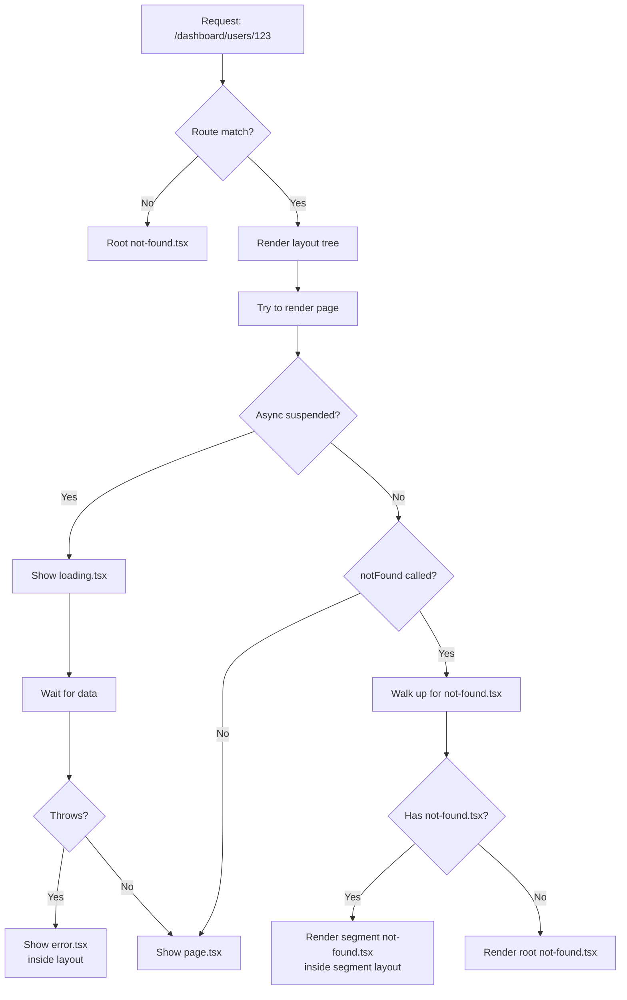
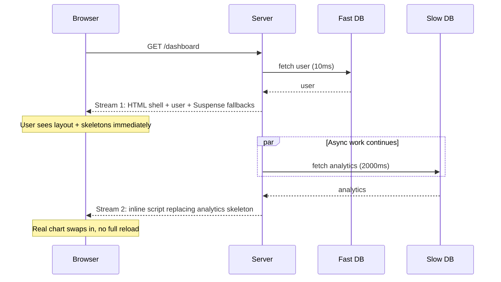
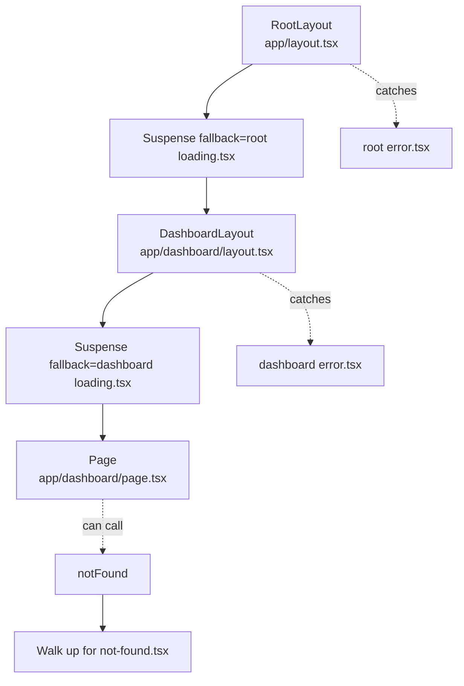

# 4.9 Loading UI, Error Pages, and Streaming

> Next.js provides three file conventions for managing the *uncertainty* of a request: `loading.tsx` shows a placeholder while a route segment renders, `error.tsx` catches uncaught errors thrown inside a route segment, and `not-found.tsx` renders when a route or resource is not found. All three are powered by React's component tree, are *scoped to a route segment*, and compose with `layout.tsx` to give users instant feedback during slow data fetches, broken dependencies, or missing resources. This note covers how each convention works, how they compose with layouts, the streaming SSR model that makes them possible, the Skeleton UI pattern, and the difference between per-segment and global handlers.

## 4.9.1 Objective

By the end of this note you should be able to:

1. Create a `loading.tsx` file that wraps a route segment in a React Suspense boundary and explain why it produces a perceived-performance win.
2. Explain the streaming SSR pipeline — shell first, then streamed chunks — and how this differs from the older "wait for everything, then send" SSR.
3. Create an `error.tsx` file that catches server and client errors and provides a recovery UI, and explain why it must be a Client Component.
4. Distinguish `error.tsx` (per-segment) from `global-error.tsx` (wraps the root) and explain when each fires.
5. Create a `not-found.tsx` file and trigger it explicitly with the `notFound()` function.
6. Explain the difference between `not-found.tsx` at the root versus per-segment.
7. Build a streaming page that renders a shell immediately and streams data-heavy sections in as they resolve.
8. Avoid the most common mistake: putting loading state inside a `page.tsx` instead of a `loading.tsx` (which causes layout shift).

## 4.9.2 Background Knowledge

This note assumes you have read [[4.1 App Router Foundations]] (route segments, layouts, the file-based conventions), [[4.2 Routing, Layouts, and Templates]] (how layouts wrap pages), [[4.3 Server and Client Components]] (the Server/Client boundary), and [[3.12 Suspense, Lazy Loading, and Code Splitting]] (how React Suspense works). You should also be familiar with the concept of an *error boundary* from React (a class component with `componentDidCatch` or the `ErrorBoundary` pattern) and the basic idea of HTTP streaming (a server sending chunks of a response over time rather than buffering the whole thing).

## 4.9.3 Core Concepts

### 4.9.3.1 Why These Conventions Exist

A page in the App Router is a tree of Server Components. Many of them `await` data — a database query, a fetch to a third-party API, a CMS call. If Next.js waited for *every* component in the tree to resolve before sending any HTML, users would stare at a blank white screen for seconds. The older Pages Router had exactly this problem: you awaited `getServerSideProps`, *then* you rendered.

The App Router fixes this by:

1. Streaming the HTML — sending the "shell" (the layout and any already-resolved children) immediately.
2. Wrapping unresolved subtrees in `<Suspense>` boundaries, which show a fallback while they wait.
3. Streaming the resolved subtrees in as inline `<script>` tags that swap the fallback for the real content.

The `loading.tsx` convention is the ergonomic wrapper around this: declaring a `loading.tsx` file in a segment is equivalent to wrapping the segment's `page.tsx` in `<Suspense fallback={<Loading />}>`.

### 4.9.3.2 The `loading.tsx` Convention

A `loading.tsx` file in a route segment creates a Suspense boundary around that segment's `page.tsx`. While the page's async data resolves, Next.js renders the loading component inside the surrounding layout.

```tsx
// app/dashboard/loading.tsx
export default function Loading() {
  return (
    <div className="p-8 animate-pulse">
      <div className="h-8 w-48 bg-gray-200 rounded mb-4" />
      <div className="h-4 w-full bg-gray-200 rounded mb-2" />
      <div className="h-4 w-2/3 bg-gray-200 rounded" />
    </div>
  );
}
```

```tsx
// app/dashboard/page.tsx
export default async function Page() {
  const data = await fetch('https://slow.api/stats').then((r) => r.json());
  return <pre>{JSON.stringify(data, null, 2)}</pre>;
}
```

Visiting `/dashboard` shows the skeleton instantly; when the fetch resolves, the skeleton is swapped for the real content.

> [!note] Loading wraps the *page*, not the *layout*
> The layout renders immediately. Only the page (and its children) is suspended. This is deliberate: layouts are usually chrome (nav, footer, sidebar) that should appear instantly; only the page's data should block.

### 4.9.3.3 How `loading.tsx` Composes with Layouts

Next.js wraps the segment in a Suspense boundary like this:

```tsx
<Layout>
  <Suspense fallback={<Loading />}>
    <Page />
  </Suspense>
</Layout>
```

Because the layout is *outside* the Suspense boundary, the layout renders immediately and only the page is suspended. If you have a nested layout, the parent layout also renders immediately.

### 4.9.3.4 The `error.tsx` Convention

An `error.tsx` file in a route segment is an error boundary for that segment. It catches errors thrown by:

- The segment's `page.tsx`.
- Any Server Component rendered inside it.
- Any Client Component rendered inside it that does not have its own closer error boundary.

It must be a Client Component because React's error boundary mechanism is client-side (it uses `componentDidCatch` / `getDerivedStateFromError`).

```tsx
// app/dashboard/error.tsx
'use client';

import { useEffect } from 'react';

export default function Error({
  error,
  reset,
}: {
  error: Error & { digest?: string };
  reset: () => void;
}) {
  useEffect(() => {
    console.error(error);
  }, [error]);

  return (
    <div className="p-8">
      <h2>Something went wrong!</h2>
      <p>{error.message}</p>
      <button onClick={() => reset()}>Try again</button>
    </div>
  );
}
```

The `reset` function re-renders the error boundary's children, which usually re-attempts the failed render. The `error` object includes a `digest` — a hashed identifier Next.js attaches to server errors so you can correlate them in your logs without exposing the stack trace to the client.

> [!warning] `error.tsx` Does Not Catch Layout Errors
> Because the error boundary sits *inside* the layout (it wraps the page, not the layout), an error thrown by `layout.tsx` itself is *not* caught by `error.tsx`. It propagates up to the parent segment's error boundary, or to `global-error.tsx` if there is no parent.

### 4.9.3.5 The `global-error.tsx` Convention

`global-error.tsx` lives in the root `app/` directory and replaces the entire `<html>` and `<body>` tree when the *root* layout itself throws. It is your last line of defence.

```tsx
// app/global-error.tsx
'use client';

export default function GlobalError({ error, reset }: { error: Error; reset: () => void }) {
  return (
    <html>
      <body>
        <h1>Global error</h1>
        <p>{error.message}</p>
        <button onClick={() => reset()}>Try again</button>
      </body>
    </html>
  );
}
```

Note it must render `<html>` and `<body>` itself, because the root layout (which normally provides those) is the thing that crashed.

### 4.9.3.6 The `not-found.tsx` Convention

A `not-found.tsx` file renders when something is not found. There are two distinct triggers:

1. The router cannot match the URL to any route (the user typed a URL that does not exist).
2. The `notFound()` function is called explicitly inside a Server Component, Route Handler, or Server Action.

```tsx
// app/dashboard/users/[id]/page.tsx
import { notFound } from 'next/navigation';

export default async function Page({ params }: { params: Promise<{ id: string }> }) {
  const { id } = await params;
  const user = await getUser(id);
  if (!user) notFound(); // throws, caught by the nearest not-found.tsx
  return <h1>{user.name}</h1>;
}
```

### 4.9.3.7 Root `not-found.tsx` vs Per-Segment `not-found.tsx`

A `not-found.tsx` at the root (`app/not-found.tsx`) catches unmatched URLs anywhere in the app. A per-segment `not-found.tsx` (e.g. `app/dashboard/not-found.tsx`) catches `notFound()` calls *within* that segment, rendered inside the segment's layout.

```mermaid
flowchart TD
    NotFoundCall[notFound called in /dashboard/users/[id]] --> Up[Walk up the segment tree]
    Up --> Find1{Has not-found.tsx?}
    Find1 -- Yes, in dashboard --> Render1[Render dashboard/not-found.tsx inside dashboard layout]
    Find1 -- No, walk up --> Find2{Has not-found.tsx?}
    Find2 -- Yes, in root --> Render2[Render app/not-found.tsx inside root layout]
    Find2 -- No --> Default[Default Next.js 404]
```

### 4.9.3.8 The Streaming SSR Pipeline

When a user requests a page that contains async Server Components, Next.js:

1. Renders the layout and any synchronously-available parts of the page.
2. Identifies subtrees that are suspended (waiting on data).
3. Sends the resolved HTML immediately, with `<Suspense>` placeholders in place of the suspended subtrees.
4. Streams the resolved subtrees as inline `<script>` tags that swap the placeholders.
5. Closes the response when the last subtree resolves.

This means the user sees the *shell* (layout, navigation, hero) immediately, and the data-heavy sections (charts, tables, recommendations) fill in as they resolve. The perceived performance is dramatically better than waiting for everything.

### 4.9.3.9 The Skeleton UI Pattern

A "skeleton" is a placeholder that visually resembles the final content — a gray box the same shape as a card, a gray bar where a title will be. Skeletons reduce perceived waiting time because the user's eye sees the structure forming rather than a spinner. `loading.tsx` is where you put skeletons.

> [!tip] Match Skeleton to Content Shape
> A skeleton that does not match the final content shape causes layout shift when it is swapped out. Measure the real content's height and width, then build a skeleton with the same dimensions.

### 4.9.3.10 Why Loading State Must Live in the Layout, Not the Page

If you put your loading state *inside* `page.tsx` — for example, a `useState(false)` that flips to `true` after the fetch resolves — the loading UI cannot appear until *after* the page has rendered, which is exactly when you no longer need it. The whole point of `loading.tsx` is that it renders *while the page is still suspended*, before the page's first render commits. This is only possible because `loading.tsx` is wrapped around the page by the framework, not rendered by the page itself.

The same logic applies to error and not-found states: they must live in dedicated files so the framework can show them when the page itself cannot render.

## 4.9.4 Detailed Walkthrough

### 4.9.4.1 A Streaming Dashboard

A realistic dashboard has some data that resolves fast (the user's name) and some that resolves slowly (analytics for the last 30 days). Stream them independently.

```tsx
// app/dashboard/layout.tsx
import { Suspense } from 'react';

export default function DashboardLayout({ children }: { children: React.ReactNode }) {
  return (
    <div className="min-h-screen flex">
      <aside className="w-60 bg-slate-900 text-white p-4">
        <h2 className="text-lg font-bold">Dashboard</h2>
        <nav>...</nav>
      </aside>
      <main className="flex-1 p-8">{children}</main>
    </div>
  );
}
```

```tsx
// app/dashboard/loading.tsx
export default function Loading() {
  return (
    <div className="space-y-4 animate-pulse">
      <div className="h-8 w-64 bg-slate-200 rounded" />
      <div className="h-32 bg-slate-200 rounded" />
      <div className="h-64 bg-slate-200 rounded" />
    </div>
  );
}
```

```tsx
// app/dashboard/page.tsx
import { Suspense } from 'react';

export default function Page() {
  return (
    <div className="space-y-8">
      <h1 className="text-3xl font-bold">Welcome back</h1>
      <Suspense fallback={<CardSkeleton label="Today's revenue" />}>
        <RevenueCard />
      </Suspense>
      <Suspense fallback={<ChartSkeleton />}>
        <AnalyticsChart />
      </Suspense>
    </div>
  );
}

async function RevenueCard() {
  const revenue = await fetch('https://slow.api/revenue', { cache: 'no-store' }).then((r) => r.json());
  return <div className="p-6 border rounded-lg">Today: ${revenue.today}</div>;
}

async function AnalyticsChart() {
  const data = await fetch('https://slow.api/analytics', { cache: 'no-store' }).then((r) => r.json());
  return <div className="p-6 border rounded-lg h-64">{/* chart */}...</div>;
}

function CardSkeleton({ label }: { label: string }) {
  return <div className="p-6 border rounded-lg animate-pulse h-24 bg-slate-100">{label}…</div>;
}

function ChartSkeleton() {
  return <div className="p-6 border rounded-lg animate-pulse h-64 bg-slate-100" />;
}
```

Visiting `/dashboard`:
1. The layout renders immediately (sidebar + main).
2. The page's `<h1>Welcome back</h1>` renders immediately.
3. `RevenueCard` and `AnalyticsChart` are suspended; their fallbacks render.
4. As each fetch resolves, its real content streams in and replaces the skeleton.

### 4.9.4.2 A Robust Error Boundary

```tsx
// app/dashboard/error.tsx
'use client';

import { useEffect } from 'react';
import { Button } from '@/components/ui/button';

export default function Error({
  error,
  reset,
}: {
  error: Error & { digest?: string };
  reset: () => void;
}) {
  useEffect(() => {
    // report to Sentry / Datadog
    console.error('[dashboard error]', error.digest, error.message);
  }, [error]);

  return (
    <div className="p-8 max-w-md mx-auto text-center">
      <h2 className="text-xl font-bold">This section failed to load</h2>
      <p className="text-slate-600 mt-2">
        Reference: <code>{error.digest}</code>
      </p>
      <Button onClick={() => reset()} className="mt-4">Try again</Button>
    </div>
  );
}
```

### 4.9.4.3 A Global Error Boundary

```tsx
// app/global-error.tsx
'use client';

export default function GlobalError({ error, reset }: { error: Error; reset: () => void }) {
  return (
    <html lang="en">
      <body>
        <div style={{ padding: 40, fontFamily: 'system-ui', textAlign: 'center' }}>
          <h1>Application error</h1>
          <p>The site is temporarily unavailable.</p>
          <button onClick={() => reset()}>Try again</button>
          <button onClick={() => (window.location.href = '/')}>Go home</button>
        </div>
      </body>
    </html>
  );
}
```

### 4.9.4.4 A Not-Found Page with Explicit Trigger

```tsx
// app/dashboard/users/[id]/page.tsx
import { notFound } from 'next/navigation';

export default async function Page({ params }: { params: Promise<{ id: string }> }) {
  const { id } = await params;
  const res = await fetch(`https://api.example.com/users/${id}`);
  if (res.status === 404) notFound();
  if (!res.ok) throw new Error('Failed to load user');
  const user = await res.json();
  return <h1>{user.name}</h1>;
}
```

```tsx
// app/dashboard/users/[id]/not-found.tsx
export default function NotFound() {
  return <p>This user does not exist.</p>;
}
```

## 4.9.5 Practical Examples

### 4.9.5.1 Per-Segment Loading Variants

Different routes want different skeletons. Just put a `loading.tsx` in each segment:

```tsx
// app/blog/loading.tsx
export default function Loading() {
  return (
    <div className="space-y-4">
      {Array.from({ length: 5 }).map((_, i) => (
        <div key={i} className="h-32 bg-slate-100 rounded animate-pulse" />
      ))}
    </div>
  );
}
```

```tsx
// app/blog/[slug]/loading.tsx
export default function Loading() {
  return (
    <article className="max-w-2xl mx-auto animate-pulse space-y-4">
      <div className="h-10 bg-slate-100 rounded w-3/4" />
      <div className="h-4 bg-slate-100 rounded w-1/4" />
      <div className="h-4 bg-slate-100 rounded" />
      <div className="h-4 bg-slate-100 rounded" />
      <div className="h-4 bg-slate-100 rounded w-2/3" />
    </article>
  );
}
```

### 4.9.5.2 Layered Suspense for Progressive Loading

A page can have multiple `<Suspense>` boundaries at different levels. The outermost shows a full-page skeleton; inner boundaries show finer-grained skeletons for sub-components.

```tsx
export default function Page() {
  return (
    <Suspense fallback={<PageSkeleton />}>
      <Header />
      <Suspense fallback={<FeedSkeleton />}>
        <Feed />
      </Suspense>
      <Suspense fallback={<SidebarSkeleton />}>
        <Sidebar />
      </Suspense>
    </Suspense>
  );
}
```

The `<Header>` resolves first (or instantly). The `<Feed>` and `<Sidebar>` stream in independently. Each replaces its own skeleton.

### 4.9.5.3 An Error Boundary That Recovers

```tsx
// app/products/error.tsx
'use client';

import { useEffect } from 'react';
import { useRouter } from 'next/navigation';

export default function Error({ error, reset }: { error: Error; reset: () => void }) {
  const router = useRouter();
  useEffect(() => {
    if (error.message.includes('rate limit')) {
      const t = setTimeout(() => reset(), 5000);
      return () => clearTimeout(t);
    }
  }, [error, reset]);

  return (
    <div className="p-8 text-center">
      <h2>Could not load products</h2>
      <p>{error.message}</p>
      <button onClick={() => reset()}>Retry</button>
      <button onClick={() => router.push('/')}>Go home</button>
    </div>
  );
}
```

### 4.9.5.4 Conditional Not-Found

```tsx
// app/docs/[...slug]/page.tsx
import { notFound } from 'next/navigation';
import { docs } from '@/lib/docs';

export default async function Page({ params }: { params: Promise<{ slug: string[] }> }) {
  const { slug } = await params;
  const path = slug.join('/');
  const doc = docs[path];
  if (!doc) notFound();
  return <article>{doc.content}</article>;
}
```

## 4.9.6 Mermaid Diagrams

### 4.9.6.1 Loading / Error / Not-Found File Resolution



### 4.9.6.2 Streaming SSR Pipeline



### 4.9.6.3 Composition with Layouts



## 4.9.7 Common Mistakes

1. **Putting the loading state inside `page.tsx`.** A `useState`-driven spinner inside the page cannot appear until *after* the page has rendered — defeating the entire purpose of `loading.tsx`.

2. **Forgetting `'use client'` on `error.tsx`.** Error boundaries require the React client runtime. A Server Component error boundary silently does nothing.

3. **Expecting `error.tsx` to catch layout errors.** It does not. It only catches errors from the *page* and below. Layout errors propagate up to the parent segment, eventually to `global-error.tsx`.

4. **Not rendering `<html>` and `<body>` in `global-error.tsx`.** The root layout is what normally provides those tags. When it crashes, the global error must supply them itself, or you get an invalid HTML document.

5. **Building skeletons that do not match the final content shape.** A skeleton 200px tall that swaps for content 600px tall causes a jarring layout shift — the exact opposite of what skeletons are for.

6. **Forgetting to `console.error` or report the error in the boundary.** Without logging, you have no visibility into production errors. The boundary swallows them silently.

7. **Treating `reset()` as "reload the page".** It is not. It re-renders the error boundary's children. If the underlying cause (e.g. a broken API) is still broken, the error immediately re-throws.

8. **Using `loading.tsx` for everything when finer-grained Suspense would be better.** A single full-page skeleton for a dashboard with five independent cards means one slow card blocks all of them. Wrap each card in its own `<Suspense>`.

9. **Forgetting `notFound()` throws.** Code after `notFound()` is unreachable. Treat it like `throw new Error()`.

10. **Returning a 404 status from the root `not-found.tsx` only.** Per-segment `not-found.tsx` files render a 404 body but Next.js still returns a 200 unless the trigger was an unmatched route. If you need a strict 404 status, call `notFound()` from a route that is matched, and the framework will return 404.

## 4.9.8 Best Practices

1. **Always pair `loading.tsx` with skeletons that match the content shape.** This eliminates layout shift and feels faster than a spinner.

2. **Use multiple `<Suspense>` boundaries within a page** to stream independent sections. One boundary per "data island" is a good rule of thumb.

3. **Make `error.tsx` actionable.** Show the digest, a retry button, and a way to contact support. A blank "Something went wrong" is hostile.

4. **Report errors from the boundary `useEffect`** to your monitoring (Sentry, Datadog, Logflare). The boundary is the only place that knows about them.

5. **Keep `global-error.tsx` minimal.** It must not depend on any of your app code (which may be what crashed). Inline styles, no imports of app components, just HTML and a retry button.

6. **Use `notFound()` aggressively.** It is clearer than returning a custom 404 response. It also composes with per-segment `not-found.tsx` for nicer UX.

7. **Distinguish "not found" from "error".** A missing resource is a normal application state, not a bug. Use `notFound()` for it; reserve `error.tsx` for actual failures (API down, parse error, etc.).

8. **Test error boundaries explicitly.** Add a `?error=1` query param to a dev-only route that throws, so you can see what your real users see.

9. **Avoid catching errors you cannot recover from.** If the database is down, a retry button just produces another error. Degrade gracefully instead (e.g. show cached data, or a banner saying "data may be stale").

10. **Document which segments have which error/not-found boundaries.** A mental map of "what catches what" prevents surprises during incidents.

## 4.9.9 Mini Exercises

### Exercise 1: Build a Streaming Product Page

**Goal:** Build `/products/[id]` that streams the product header immediately, the description second, and the reviews last.

**Worked solution:**

```tsx
// app/products/[id]/page.tsx
import { Suspense } from 'react';

export default async function Page({ params }: { params: Promise<{ id: string }> }) {
  const { id } = await params;
  return (
    <div className="space-y-8 max-w-3xl mx-auto p-8">
      <Suspense fallback={<div className="h-10 bg-slate-100 rounded animate-pulse" />}>
        <Header id={id} />
      </Suspense>
      <Suspense fallback={<div className="h-40 bg-slate-100 rounded animate-pulse" />}>
        <Description id={id} />
      </Suspense>
      <Suspense fallback={<div className="h-64 bg-slate-100 rounded animate-pulse" />}>
        <Reviews id={id} />
      </Suspense>
    </div>
  );
}

async function Header({ id }: { id: string }) {
  const p = await fetch(`https://api.example.com/products/${id}`).then((r) => r.json());
  return <h1 className="text-3xl font-bold">{p.name}</h1>;
}

async function Description({ id }: { id: string }) {
  const p = await fetch(`https://api.example.com/products/${id}/desc`).then((r) => r.json());
  return <p>{p.text}</p>;
}

async function Reviews({ id }: { id: string }) {
  const r = await fetch(`https://api.example.com/products/${id}/reviews`).then((r) => r.json());
  return <ul>{r.items.map((x: { author: string; text: string }) => <li key={x.author}>{x.author}: {x.text}</li>)}</ul>;
}
```

### Exercise 2: A Per-Segment Error Boundary with Recovery

**Goal:** Add an `error.tsx` to `/products/[id]` that logs the error, shows the digest, and offers retry + go-home.

**Worked solution:**

```tsx
// app/products/[id]/error.tsx
'use client';

import { useEffect } from 'react';
import { useRouter } from 'next/navigation';

export default function Error({
  error,
  reset,
}: {
  error: Error & { digest?: string };
  reset: () => void;
}) {
  const router = useRouter();
  useEffect(() => {
    console.error('[product error]', error.digest, error.message);
  }, [error]);

  return (
    <div className="p-8 text-center max-w-md mx-auto">
      <h2 className="text-xl font-bold">Could not load product</h2>
      <p className="text-slate-600 mt-2">Reference: {error.digest ?? 'unknown'}</p>
      <div className="flex gap-2 justify-center mt-4">
        <button onClick={() => reset()} className="px-4 py-2 bg-black text-white rounded">Retry</button>
        <button onClick={() => router.push('/')} className="px-4 py-2 border rounded">Home</button>
      </div>
    </div>
  );
}
```

### Exercise 3: A Not-Found Flow

**Goal:** Build `/docs/[...slug]` that calls `notFound()` when the slug is unknown, with a per-segment `not-found.tsx`.

**Worked solution:**

```tsx
// lib/docs.ts
export const docs: Record<string, { content: string }> = {
  'getting-started': { content: 'Welcome...' },
  'routing': { content: 'Routes are...' },
};
```

```tsx
// app/docs/[...slug]/page.tsx
import { notFound } from 'next/navigation';
import { docs } from '@/lib/docs';

export default async function Page({ params }: { params: Promise<{ slug: string[] }> }) {
  const { slug } = await params;
  const key = slug.join('/');
  const doc = docs[key];
  if (!doc) notFound();
  return <article className="prose">{doc.content}</article>;
}
```

```tsx
// app/docs/[...slug]/not-found.tsx
import Link from 'next/link';

export default function NotFound() {
  return (
    <div className="p-8 text-center">
      <h1 className="text-2xl font-bold">Page not found</h1>
      <p className="text-slate-600 mt-2">This doc does not exist.</p>
      <Link href="/docs" className="text-blue-600 underline">Browse docs</Link>
    </div>
  );
}
```

### Exercise 4: A Global Error Boundary

**Goal:** Build a `global-error.tsx` that renders a minimal valid HTML document with a retry and a "go home" button.

**Worked solution:**

```tsx
// app/global-error.tsx
'use client';

export default function GlobalError({ error, reset }: { error: Error; reset: () => void }) {
  return (
    <html lang="en">
      <body style={{ fontFamily: 'system-ui', padding: 40, textAlign: 'center' }}>
        <h1>Application error</h1>
        <p>Something went wrong. Please try again.</p>
        <p style={{ color: '#888', fontSize: 12 }}>{error.digest ?? error.message}</p>
        <div style={{ marginTop: 20, display: 'flex', gap: 8, justifyContent: 'center' }}>
          <button onClick={() => reset()} style={btn}>Retry</button>
          <button onClick={() => (window.location.href = '/')} style={btn}>Home</button>
        </div>
      </body>
    </html>
  );
}

const btn: React.CSSProperties = {
  padding: '8px 16px',
  border: '1px solid #ccc',
  borderRadius: 6,
  background: 'white',
  cursor: 'pointer',
};
```

### Exercise 5: A Multi-Suspense Page

**Goal:** Build a homepage with three independent sections (hero, news, tweets), each with its own Suspense fallback, so one slow section does not block the others.

**Worked solution:**

```tsx
// app/page.tsx
import { Suspense } from 'react';

export default function Page() {
  return (
    <div className="space-y-12">
      <Suspense fallback={<div className="h-64 bg-slate-100 rounded animate-pulse" />}>
        <Hero />
      </Suspense>
      <Suspense fallback={<div className="h-48 bg-slate-100 rounded animate-pulse" />}>
        <News />
      </Suspense>
      <Suspense fallback={<div className="h-48 bg-slate-100 rounded animate-pulse" />}>
        <Tweets />
      </Suspense>
    </div>
  );
}

async function Hero() {
  const data = await fetch('https://api.example.com/hero', { cache: 'no-store' }).then((r) => r.json());
  return <section className="h-64 bg-slate-900 text-white rounded-lg p-8">{data.title}</section>;
}

async function News() {
  const data = await fetch('https://api.example.com/news', { cache: 'no-store' }).then((r) => r.json());
  return <ul className="space-y-2">{data.items.map((n: { title: string }) => <li key={n.title}>{n.title}</li>)}</ul>;
}

async function Tweets() {
  const data = await fetch('https://api.example.com/tweets', { cache: 'no-store' }).then((r) => r.json());
  return <ul className="space-y-2">{data.items.map((t: { text: string }) => <li key={t.text}>{t.text}</li>)}</ul>;
}
```

## 4.9.10 Summary

`loading.tsx`, `error.tsx`, and `not-found.tsx` are the App Router's three file conventions for managing uncertainty. They are scoped to route segments, compose with layouts, and are powered by React Suspense and error boundaries. The streaming SSR pipeline sends the shell immediately and fills in suspended subtrees as they resolve, giving users instant feedback instead of a blank screen. The skeleton pattern — placeholders that match the final content shape — eliminates layout shift and feels faster than spinners. Remember the three big rules: loading state lives in `loading.tsx` (not in the page); error boundaries are Client Components and only catch page-level errors; `notFound()` is the explicit way to trigger a 404 from inside a Server Component.

## 4.9.11 Related Notes

- [[4.1 App Router Foundations]] — the segment model these conventions attach to.
- [[4.2 Routing, Layouts, and Templates]] — how layouts wrap pages.
- [[4.3 Server and Client Components]] — why `error.tsx` must be a Client Component.
- [[4.4 Rendering Strategies]] — streaming is a rendering strategy choice.
- [[4.5 Data Fetching]] — the async Server Components that get suspended.
- [[4.8 Route Handlers]] — handlers can also call `notFound()`.
- [[3.12 Suspense, Lazy Loading, and Code Splitting]] — the React primitive that powers `loading.tsx`.
- [[3.13 Error Boundaries and Debugging]] — the React primitive that powers `error.tsx`.
