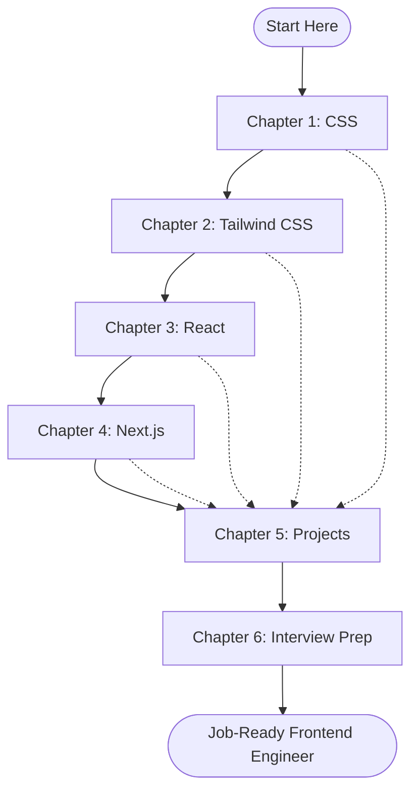
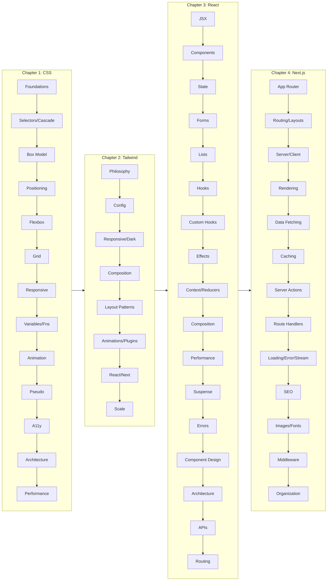
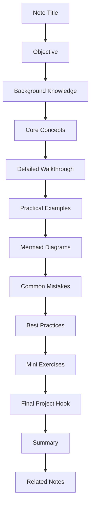

# Frontend Development Vault

> A practical, opinionated, end-to-end curriculum for becoming a strong modern frontend engineer. This vault focuses exclusively on **CSS, Tailwind CSS, React, and Next.js**. It deliberately excludes Node.js, backend development, databases, authentication, deployment, and DevOps except where those topics are required to understand Next.js from a frontend perspective.

---

## 0. How To Use This Vault

This vault is organized as a learning **course**, not an encyclopedia. Every chapter is a sequential stage. Each stage builds on the previous one. Each note inside a chapter covers one cohesive concept cluster, with:

- A clear **objective** so you know what skill you should walk away with.
- **Background knowledge** reminders for things you may have forgotten.
- **Core concepts** explained from first principles, with the *why* behind the *how*.
- **Practical examples** written in real, production-style code.
- **Common mistakes** that junior engineers make, and how to spot them.
- **Best practices** that senior engineers follow without thinking.
- **Mini exercises** that you should physically type out, not just skim.
- **Mermaid diagrams** (no ASCII art anywhere in this vault) to internalize structure.
- **Cross-links** (`[[note name]]`) to related notes for non-linear exploration.

### 0.1 Vault Folder Structure

```
Frontend Development Vault : {
    Chapter 1: CSS
        - 1.1 CSS Foundations
        - 1.2 Selectors and Cascade
        - 1.3 Box Model and Display
        - 1.4 Positioning and Normal Flow
        - 1.5 Flexbox
        - 1.6 Grid
        - 1.7 Responsive Design and Container Queries
        - 1.8 Variables, Functions, and Calculations
        - 1.9 Animations, Transitions, and Transforms
        - 1.10 Pseudo-Elements and Pseudo-Classes
        - 1.11 Accessibility in CSS
        - 1.12 CSS Architecture
        - 1.13 CSS Performance

    Chapter 2: Tailwind CSS
        - 2.1 Tailwind Philosophy and Setup
        - 2.2 Configuration and Theme Customization
        - 2.3 Responsive Utilities and Dark Mode
        - 2.4 Component Composition
        - 2.5 Layout Patterns in Tailwind
        - 2.6 Animations and Plugins
        - 2.7 Tailwind with React and Next.js
        - 2.8 Organizing Large Tailwind Projects

    Chapter 3: React
        - 3.1 JSX and Rendering
        - 3.2 Components and Props
        - 3.3 State and Events
        - 3.4 Forms and Conditional Rendering
        - 3.5 Lists and Keys
        - 3.6 Hooks (Built-In)
        - 3.7 Custom Hooks
        - 3.8 Effects and Side Effects
        - 3.9 Context and Reducers
        - 3.10 Composition and Patterns
        - 3.11 Performance Optimization
        - 3.12 Suspense, Lazy Loading, and Code Splitting
        - 3.13 Error Boundaries and Debugging
        - 3.14 Reusable Component Design
        - 3.15 Project Architecture and Folder Organization
        - 3.16 API Integration and Data Fetching
        - 3.17 Client-Side Routing

    Chapter 4: Next.js
        - 4.1 App Router Foundations
        - 4.2 Routing, Layouts, and Templates
        - 4.3 Server and Client Components
        - 4.4 Rendering Strategies
        - 4.5 Data Fetching
        - 4.6 Caching and Revalidation
        - 4.7 Server Actions and Forms
        - 4.8 Route Handlers
        - 4.9 Loading UI, Error Pages, and Streaming
        - 4.10 Metadata and SEO
        - 4.11 Images, Fonts, and Optimization
        - 4.12 Middleware (Practical Usage Only)
        - 4.13 Project Organization and Performance

    Chapter 5: Projects
        - 5.1 Landing Page
        - 5.2 Blog
        - 5.3 Portfolio
        - 5.4 Documentation Website
        - 5.5 Admin Dashboard
        - 5.6 Kanban Board
        - 5.7 Weather Application
        - 5.8 Notes Application
        - 5.9 Chat UI
        - 5.10 File Explorer UI
        - 5.11 SaaS Dashboard
        - 5.12 E-commerce Frontend
        - 5.13 Analytics Dashboard

    Chapter 6: Interview Prep
        - 6.1 CSS Interview Questions
        - 6.2 Tailwind Interview Questions
        - 6.3 React Interview Questions
        - 6.4 Next.js Interview Questions
        - 6.5 Frontend Architecture Questions
        - 6.6 Performance Questions
        - 6.7 Accessibility Questions
        - 6.8 Practical Coding and Debugging Exercises
}
```

### 0.2 Roadmap at a Glance



### 0.3 Reading and Practice Discipline

- **Read in order the first time.** Each chapter assumes the previous one.
- **Do not move on** until you can build the **Final Project** of the current stage without copy-pasting.
- **Type every code example.** Reading code without typing it produces false confidence.
- **Re-read the "Common Mistakes" section** of each note at least once a week for the first two months.
- **Use the interview chapter as a self-test**, not as study material. If you cannot answer a question, go back to the corresponding note.

### 0.4 Time Estimates

| Stage | Estimated Time | Why |
|-------|----------------|-----|
| Chapter 1: CSS | 2-3 weeks | Foundation. Skipping this guarantees Tailwind pain later. |
| Chapter 2: Tailwind CSS | 1-2 weeks | Fast once CSS fundamentals are solid. |
| Chapter 3: React | 4-6 weeks | The biggest stage. Hooks, effects, patterns, architecture. |
| Chapter 4: Next.js | 2-3 weeks | Builds directly on React. App Router is the main focus. |
| Chapter 5: Projects | 6-10 weeks | Done in parallel with chapters 3 and 4, and revisited after. |
| Chapter 6: Interview Prep | 2-3 weeks | Continuous. Start after chapter 3. |
| **Total** | **17-27 weeks** | Realistic part-time pace. |

### 0.5 Conventions in This Vault

1. **File names** use the form `1.1 Title.md` (number, period, space, words). No underscores anywhere.
2. **Section titles inside notes** use the same numbering pattern (`## 1.1.1 Subsection`).
3. **Code blocks** are always fenced with the language tag (` ```tsx `, ` ```css `).
4. **Diagrams** are always Mermaid. Never ASCII art.
5. **Cross-links** use Obsidian wikilink syntax: `[[3.6 Hooks (Built-In)]]`.
6. **Callouts** use Obsidian callout syntax:
   - `> [!note]` for additional context
   - `> [!warning]` for common mistakes
   - `> [!tip]` for senior-level tips
   - `> [!danger]` for things that will break production

---

## 1. Chapter Overviews

### 1.1 Chapter 1 — CSS

> **Objective:** Master the layout engine, the cascade, modern selectors, and the responsive toolkit that working frontend engineers use daily. By the end you should be able to reproduce almost any design you see on the web without looking up properties.

**Stage Final Project:** Reproduce a pixel-perfect Figma design of a multi-section marketing homepage that is fully responsive from 320px to 1920px, with at least three breakpoints, container queries for the card grid, and accessible focus states. No frameworks allowed.

**Folder Structure:**

```text
1. CSS/
  - 1.1 CSS Foundations.md
  - 1.2 Selectors and Cascade.md
  - 1.3 Box Model and Display.md
  - 1.4 Positioning and Normal Flow.md
  - 1.5 Flexbox.md
  - 1.6 Grid.md
  - 1.7 Responsive Design and Container Queries.md
  - 1.8 Variables, Functions, and Calculations.md
  - 1.9 Animations, Transitions, and Transforms.md
  - 1.10 Pseudo-Elements and Pseudo-Classes.md
  - 1.11 Accessibility in CSS.md
  - 1.12 CSS Architecture.md
  - 1.13 CSS Performance.md
```

### 1.2 Chapter 2 — Tailwind CSS

> **Objective:** Internalize the utility-first philosophy deeply enough that you no longer reach for component libraries like MUI or Chakra for everyday work. You should be able to build a complete design system from Tailwind primitives.

**Stage Final Project:** Build a reusable Tailwind-powered component library (Button, Input, Card, Modal, Tabs, Tooltip, Toast, Drawer, Table, Pagination) that you can drop into any Next.js project. Must include a dark mode, three breakpoints, and a documented variant API.

### 1.3 Chapter 3 — React

> **Objective:** Reach the level where you can read a large React codebase, understand the architecture, debug rendering issues, and design reusable components that other engineers want to use. This is the biggest chapter and where you spend the most time.

**Stage Final Project:** Build a fully featured Kanban board (Trello-lite) with drag-and-drop, optimistic updates, persisted state, virtualized lists, custom hooks for the data layer, performance optimization with `memo` and `useDeferredValue`, error boundaries, and Suspense for the data layer. No state management library — only React.

### 1.4 Chapter 4 — Next.js

> **Objective:** Master the App Router well enough to ship production Next.js applications. Understand rendering strategies deeply enough to choose correctly between static, dynamic, ISR, and streaming for every route you build.

**Stage Final Project:** Build a documentation website (like the Next.js docs) with MDX content, static generation for marketing pages, ISR for the docs themselves, server actions for the "was this page helpful?" feedback widget, route handlers for the search API, middleware for A/B testing, full SEO with metadata API, and `next/image` everywhere.

### 1.5 Chapter 5 — Projects

> **Objective:** Reinforce every chapter with progressively harder projects. Projects are not in strict order — you should interleave them with the relevant chapter. Each project note specifies which chapter's concepts it reinforces.

The thirteen projects in this chapter range from a single-evening landing page to a multi-week analytics dashboard. Each project note contains: requirements, recommended architecture, file structure, step-by-step build order, gotchas, and a self-assessment rubric.

### 1.6 Chapter 6 — Interview Prep

> **Objective:** Convert what you have learned into interview-ready answers and whiteboard confidence. Start this chapter *after* chapter 3, and treat it as continuous practice for the rest of the vault.

This chapter is question-driven, not concept-driven. Each question has a model answer, the reasoning behind it, the common wrong answers, and follow-up questions an interviewer might ask.

---

## 2. Curriculum Flow



---

## 3. What This Vault Deliberately Excludes

> [!warning] Out of Scope
> The following topics are intentionally absent. If you find yourself reaching for them, ask whether you are solving a frontend problem or a backend problem.

| Topic | Why Excluded |
|-------|--------------|
| Node.js fundamentals | Covered in your backend vault. |
| Express / Fastify / Nest | Backend framework. |
| Databases (SQL, Prisma, Mongo) | Backend persistence. |
| Authentication (JWT, sessions, OAuth server-side) | Backend responsibility. Next.js auth is mentioned only in terms of reading cookies/middleware. |
| Deployment (Docker, K8s, CI/CD pipelines) | Out of scope. We mention Vercel only as the deployment target Next.js assumes. |
| Testing frameworks (Jest, Vitest, Playwright) | Worth a separate vault. We mention only the testing mental model. |
| WebGL, Three.js, Canvas | Niche. Learn on demand. |
| WebRTC, audio/video processing | Niche. Learn on demand. |
| Mobile-specific frameworks (React Native) | Different platform. |

---

## 4. Tools and Prerequisites

Before you start chapter 1, make sure you have:

- A modern browser (Chrome or Firefox with DevTools).
- VS Code with the following extensions:
  - **ESLint**
  - **Prettier**
  - **Tailwind CSS IntelliSense**
  - **PostCSS Language Support**
  - **Mermaid Preview** (so you can render the diagrams in this vault inline)
  - **Obsidian** itself (for reading this vault) — or VS Code with the Markdown Notes extension.
- Node.js LTS installed (only because Tailwind, React, and Next.js need it as a build tool — we will not study Node itself).
- A GitHub account and basic Git literacy (commit, push, branch, merge).

---

## 5. Definition of Done

You have finished this vault when **all** of the following are true:

1. You can build a multi-section landing page from scratch in under 4 hours, fully responsive, with no framework.
2. You can build a Tailwind-based component library with at least 10 components, dark mode, and a documented API.
3. You can read a 50-file React codebase and explain the data flow without running it.
4. You can build a Next.js App Router project with mixed static and dynamic routes, server actions, route handlers, and proper metadata.
5. You can answer at least 80% of the interview questions in chapter 6 without notes.
6. You have shipped at least 5 of the 13 chapter-5 projects to a public URL.

When all six are true, you are a job-ready modern frontend engineer.

---

## 6. How Each Note Is Structured

Every note in this vault follows the same structure so your brain can relax into a rhythm:



This consistency is intentional. Frontend engineering rewards pattern recognition. So does this vault.

---

## 7. Start Here

Open [[1.1 CSS Foundations]] and begin. Do not skip ahead. Do not "already know this" your way past the foundations — the cost of a shaky foundation is paid back with interest later.

> [!tip] One Last Thing
> The fastest way to learn frontend engineering is to **build things in public**. Push every exercise to GitHub. Deploy every project to Vercel or Netlify. Share links. The accountability accelerates everything.

Happy building.
