# JavaScript, TypeScript, and Node.js Mastery Vault

> A complete, university-grade curriculum and engineering handbook built as an Obsidian knowledge base. Designed for the developer who already knows the basics but keeps forgetting the *why* behind the rules — closures, TDZ, coercion, event loop phases, type narrowing, backpressure, GC generations, and every other thing that separates a journeyman from a senior engineer.

---

## 0. How to Use This Vault

### 0.1 Reading Order

This is a **strictly sequenced curriculum**, not a random-access encyclopedia. Every note assumes you have read its prerequisites. Skipping forward is the single most common reason learners report that "TypeScript types feel like magic" or "the event loop just doesn't click." If you find yourself confused by a note, check its **Core Connections** section (Section 11) for the prerequisite notes and read those first.

The vault is organised into eight top-level modules. The first three (JavaScript, TypeScript, Node.js) form the technical core. The remaining five (Software Engineering, Testing, Tooling, Performance, Capstones) are the applied practice layer that turns language knowledge into production engineering judgement.

### 0.2 Note Schema (Every Note Follows This Exactly)

Each note contains eleven numbered sections. The schema is non-negotiable because the schema *is* the pedagogy.

1. **Purpose** — Why this topic exists, what real-world problem it solves, what would break without it.
2. **Theory and Deep Dive** — Specification-level mechanics. ECMAScript clauses, V8 internals, libuv phases, TC39 rationale.
3. **Mental Models** — Intuitive metaphors that survive contact with edge cases.
4. **Real-World Use Cases** — Where this concept shows up in Express, Fastify, NestJS, Discord, Slack, Vercel, GitHub Actions.
5. **Code Examples** — Side-by-side JavaScript and TypeScript. Each example has a minimal conceptual form and a production-grade form.
6. **Common Mistakes and Anti-Patterns** — Code that looks right but is wrong, with the *why*.
7. **Best Practices and Design Patterns** — Professional approaches with the reasoning behind each rule.
8. **Technical Interview Knowledge** — Five to ten whiteboard-style questions per note, with structured answers and the trap to avoid.
9. **Practical Exercises** — Incremental complexity, with full worked solutions and the reasoning for every step.
10. **Mini-Project Blueprint** — A small, self-contained project that exercises the concept end-to-end.
11. **Core Connections** — Wikilinks to prerequisite notes, sibling notes, and notes that build on this one.

### 0.3 Conventions

- **File names**: Numbered with a period and a space, no underscores. Example: `1.01 Syntax and Lexical Structure.md`.
- **Folder names**: Same convention. Example: `1. JavaScript Core/1. Fundamentals/`.
- **Diagrams**: Mermaid only. No raw ASCII art anywhere in the vault.
- **Cross-references**: Use Obsidian wikilinks `[[1.10 Closures and Lexical Scope]]` so navigation works inside the vault.
- **Code blocks**: Always specify the language (` ```javascript ` or ` ```typescript `).
- **Side-by-side JS/TS**: Each major example appears in both languages, with the differences annotated.

---

## 1. Vault Map

```mermaid
graph TD
    Root[JS TS Node Mastery Vault]

    Root --> M0[00. Meta]
    Root --> M1[1. JavaScript Core]
    Root --> M2[2. TypeScript Mastery]
    Root --> M3[3. NodeJS Runtime Backend]
    Root --> M4[4. Software Engineering Design]
    Root --> M5[5. Testing Quality Assurance]
    Root --> M6[6. Tooling Workflow]
    Root --> M7[7. Performance Scale Production]
    Root --> M8[8. Capstone Projects]

    M1 --> M1a[1. Fundamentals]
    M1 --> M1b[2. Advanced Scope Closures]
    M1 --> M1c[3. Object Oriented Prototypes]
    M1 --> M1d[4. Asynchronous JavaScript]
    M1 --> M1e[5. Engine Internals Memory]
    M1 --> M1f[6. Metaprogramming Esoteric]

    M2 --> M2a[1. Foundations Inference]
    M2 --> M2b[2. Advanced Type System]
    M2 --> M2c[3. Type Level Programming]
    M2 --> M2d[4. Architectural TypeScript]

    M3 --> M3a[1. Runtime Architecture]
    M3 --> M3b[2. Core APIs IO]
    M3 --> M3c[3. Networking Web]
    M3 --> M3d[4. Process Concurrency]
    M3 --> M3e[5. Enterprise Backend Patterns]

    M4 --> M4a[1. Design Principles]
    M4 --> M4b[2. Architectural Patterns]
    M4 --> M4c[3. Refactoring Clean Code]

    M5 --> M5a[1. Testing Theory Strategies]
    M5 --> M5b[2. Unit Testing]
    M5 --> M5c[3. Integration E2E Testing]
    M5 --> M5d[4. Mocking Double Patterns]

    M6 --> M6a[1. Package Management]
    M6 --> M6b[2. Linters Formatters]
    M6 --> M6c[3. Compilers Bundlers]
    M6 --> M6d[4. CI CD Debugging]

    M7 --> M7a[1. Diagnostics Profiling]
    M7 --> M7b[2. Security Hardening]
    M7 --> M7c[3. Production Scaling]

    M8 --> M8a[1. Realtime Analytics Engine]
    M8 --> M8b[2. Distributed Task Queue]
    M8 --> M8c[3. Type Safe Custom ORM]

    style Root fill:#1e293b,color:#fff
    style M1 fill:#3b82f6,color:#fff
    style M2 fill:#0ea5e9,color:#fff
    style M3 fill:#10b981,color:#fff
    style M4 fill:#f59e0b,color:#fff
    style M5 fill:#ef4444,color:#fff
    style M6 fill:#8b5cf6,color:#fff
    style M7 fill:#ec4899,color:#fff
    style M8 fill:#14b8a6,color:#fff
```



---

## 2. Complete Curriculum Index

### Module 1 — JavaScript Core (33 notes)

**Chapter 1.1 — Fundamentals and Type System Basics**
- [[1.01 Syntax and Lexical Structure]]
- [[1.02 Variables and Mutability]]
- [[1.03 Primitive Data Types]]
- [[1.04 Type Coercion and Equality]]
- [[1.05 Operators and Control Flow]]
- [[1.06 Complex Types Arrays]]
- [[1.07 Complex Types Objects]]

**Chapter 1.2 — Advanced Scope, Closures, and Context**
- [[1.08 Execution Context and Lexical Environment]]
- [[1.09 Hoisting Mechanics]]
- [[1.10 Closures and Lexical Scope]]
- [[1.11 This Keyword Binding]]
- [[1.12 Arrow Functions]]
- [[1.13 Functional Programming Concepts]]

**Chapter 1.3 — Object-Oriented JS and Prototypes**
- [[1.14 Prototypes and Inheritance]]
- [[1.15 Object Creation Patterns]]
- [[1.16 ES6 Classes Syntactic Sugar]]
- [[1.17 Subclassing Prototypal Underpinnings]]
- [[1.18 Mixins and Composition]]

**Chapter 1.4 — Asynchronous JavaScript**
- [[1.19 Asynchronous Paradigms Evolution]]
- [[1.20 Promises Specification]]
- [[1.21 Promises API and Concurrency]]
- [[1.22 Async Await Runtime]]
- [[1.23 Generators and Iterators]]
- [[1.24 Async Generators and Iterators]]

**Chapter 1.5 — Engine Internals and Memory Management**
- [[1.25 V8 Engine Pipeline]]
- [[1.26 Event Loop Concurrency Model]]
- [[1.27 Memory Lifecycles and Allocation]]
- [[1.28 Garbage Collection in V8]]
- [[1.29 Memory Leaks Diagnostic]]

**Chapter 1.6 — Metaprogramming and Esoteric JS**
- [[1.30 Property Descriptors and Attributes]]
- [[1.31 Proxy and Reflect APIs]]
- [[1.32 Well-Known Symbols]]
- [[1.33 Eval and New Function Unsafe]]

### Module 2 — TypeScript Mastery (19 notes)

**Chapter 2.1 — Foundations and Type Inference**
- [[2.01 Design Goals and Limitations]]
- [[2.02 Basic Type Space]]
- [[2.03 Type Assertions and Guards]]
- [[2.04 Type Inference and Contextual]]
- [[2.05 Unions and Intersections]]

**Chapter 2.2 — Advanced Type System**
- [[2.06 Interfaces vs Type Aliases]]
- [[2.07 Generics and Constraints]]
- [[2.08 Typeof Keyof Lookup]]
- [[2.09 Mapped Types]]
- [[2.10 Utility Types Deep Dive]]

**Chapter 2.3 — Type-Level Programming**
- [[2.11 Conditional Types]]
- [[2.12 Type Inference in Conditionals]]
- [[2.13 Template Literal Types]]
- [[2.14 Recursive Type-Level Operations]]
- [[2.15 Declaration Files and Merging]]

**Chapter 2.4 — Architectural TypeScript**
- [[2.16 TSConfig Deep Dive]]
- [[2.17 API Design with Types]]
- [[2.18 OOP Patterns in TypeScript]]
- [[2.19 Decorators and Metaprogramming]]

### Module 3 — Node.js Runtime and Backend Architecture (23 notes)

**Chapter 3.1 — Runtime Architecture and Core Engine**
- [[3.01 Architecture Overview]]
- [[3.02 Libuv Event Loop]]
- [[3.03 Thread Pool and Worker Pool]]
- [[3.04 V8 Isolates and Contexts in Node]]
- [[3.05 Microtask Queues and Process NextTick]]

**Chapter 3.2 — Core APIs and I/O Handling**
- [[3.06 Buffers and Binary Data]]
- [[3.07 Streams Fundamentals]]
- [[3.08 Streams Advanced Backpressure]]
- [[3.09 Filesystem APIs]]
- [[3.10 Event Emitter Pattern]]

**Chapter 3.3 — Networking and Web Protocols**
- [[3.11 Net Module TCP Sockets]]
- [[3.12 HTTP and HTTPS Modules]]
- [[3.13 HTTP2 Server Push]]
- [[3.14 WebSockets and Realtime]]

**Chapter 3.4 — Process Management and Concurrency**
- [[3.15 Process Global Object]]
- [[3.16 Child Processes]]
- [[3.17 Cluster Module]]
- [[3.18 Worker Threads]]

**Chapter 3.5 — Enterprise Backend Patterns**
- [[3.19 REST API Design]]
- [[3.20 Middleware Pattern]]
- [[3.21 Security Authentication and Authorization]]
- [[3.22 Security Vulnerabilities Mitigation]]
- [[3.23 Database Integration and ORM Patterns]]

### Module 4 — Software Engineering and Architectural Design (14 notes)

**Chapter 4.1 — Software Design Principles**
- [[4.01 SOLID Single Responsibility]]
- [[4.02 SOLID Open Closed]]
- [[4.03 SOLID Liskov Substitution]]
- [[4.04 SOLID Interface Segregation]]
- [[4.05 SOLID Dependency Inversion]]
- [[4.06 GRASP Principles]]
- [[4.07 DRY YAGNI KISS]]

**Chapter 4.2 — Architectural Patterns**
- [[4.08 Dependency Injection DI]]
- [[4.09 Clean and Onion Architecture]]
- [[4.10 CQRS and Event Sourcing]]
- [[4.11 Modular Monolith vs Microservices]]

**Chapter 4.3 — Refactoring and Clean Code Practices**
- [[4.12 Code Smells]]
- [[4.13 Refactoring Techniques]]
- [[4.14 Documentation as Code]]

### Module 5 — Testing and Quality Assurance (12 notes)

**Chapter 5.1 — Testing Theory and Strategies**
- [[5.01 Testing Pyramid and Trophy]]
- [[5.02 TDD Methodology]]
- [[5.03 Testability by Design]]

**Chapter 5.2 — Unit Testing**
- [[5.04 Unit Testing Fundamentals]]
- [[5.05 Testing Pure Functions]]
- [[5.06 Testing Asynchronous Code]]

**Chapter 5.3 — Integration and End-to-End Testing**
- [[5.07 Integration Testing APIs]]
- [[5.08 E2E Testing with Playwright]]
- [[5.09 Contract Testing with Pact]]

**Chapter 5.4 — Mocking and Double Patterns**
- [[5.10 Stubs Spies and Mocks]]
- [[5.11 Mocking External Services]]
- [[5.12 Test Data Builders and Fixtures]]

### Module 6 — Tooling and Workflow (13 notes)

**Chapter 6.1 — Package Management and Workspaces**
- [[6.01 NPM Internals]]
- [[6.02 PNPM and Monorepo Workspaces]]
- [[6.03 Publishing Libraries]]

**Chapter 6.2 — Linters, Formatters, and Code Quality**
- [[6.04 ESLint Flat Config]]
- [[6.05 Prettier Configuration]]
- [[6.06 Dependency Validation and Analysis]]

**Chapter 6.3 — Compilers, Bundlers, and Runtimes**
- [[6.07 TSC Compiler Operation]]
- [[6.08 ESBuild and SWC]]
- [[6.09 Vite and Webpack Comparison]]
- [[6.10 Alternative Runtimes Deno and Bun]]

**Chapter 6.4 — CI/CD and Production Diagnostics**
- [[6.11 Source Maps]]
- [[6.12 Debugging Techniques DevTools]]
- [[6.13 CI Pipeline Automation]]

### Module 7 — Performance, Security, and Scale (9 notes)

**Chapter 7.1 — Diagnostics and Profiling**
- [[7.01 Profiling CPU Usage]]
- [[7.02 Memory Leak Identification]]
- [[7.03 Event Loop Monitoring]]

**Chapter 7.2 — Security Hardening**
- [[7.04 API Rate Limiting]]
- [[7.05 CORS and CSP Security]]
- [[7.06 Secrets and Environment Management]]

**Chapter 7.3 — Production Scaling**
- [[7.07 Redis Caching Strategies]]
- [[7.08 Concurrency Clustering Workers]]
- [[7.09 Production Monitoring]]

### Module 8 — Capstone Projects (3 projects)

- [[8.01 Realtime Analytics Engine]]
- [[8.02 Distributed Task Queue]]
- [[8.03 Type Safe Custom ORM]]

---

## 3. Recommended Study Plan

### 3.1 Twelve-Week Intensive Track

| Week | Module | Output |
|------|--------|--------|
| 1–2  | Module 1.1–1.2 | Fundamentals, scope, closures. Build: a small functional library. |
| 3    | Module 1.3     | Prototypes and classes. Build: a typed event emitter. |
| 4    | Module 1.4     | Async. Build: a parallel image downloader with backpressure. |
| 5    | Module 1.5–1.6 | Engine internals and metaprogramming. Build: a Proxy-based validator. |
| 6    | Module 2.1–2.2 | TS foundations. Build: a typed wrapper around `fetch`. |
| 7    | Module 2.3–2.4 | Type-level programming. Build: a type-safe router. |
| 8    | Module 3.1–3.2 | Node core. Build: a streaming file transformer. |
| 9    | Module 3.3–3.4 | Networking and concurrency. Build: a TCP chat server. |
| 10   | Module 3.5 + 4 | Backend patterns and architecture. Build: a layered REST API. |
| 11   | Module 5–6     | Testing and tooling. Build: full test suite + CI pipeline. |
| 12   | Module 7 + 8   | Production and capstone. Build: one capstone, end to end. |

### 3.2 Six-Month Sustainable Track

Same modules, half the pace, twice the depth per note. Each week, read 2 notes and complete the exercises for both. End each month with a capstone-style integration project that uses at least three notes from that month.

### 3.3 Reference Track

Already working professionally and using this vault as a reference? Use the wikilinks in Section 11 of any note to traverse from a stuck point back to the root cause. The interview-prep sections (Section 8) double as a senior-engineer interview refresher.

---

## 4. Contributing and Extending

This vault is designed to be lived in. When you discover a new gotcha, add it to Section 6 of the relevant note. When a new TC39 proposal lands, add a subsection to Section 2. When you fail an interview question on a topic, write the question and answer into Section 8. Over twelve months of daily use, this vault becomes a personal senior-engineer brain.

---

## 5. Authoring Notes

When authoring a new note, copy `00. Meta/Templates/1. Note Template.md` and follow the schema exactly. The schema is the contract that makes the vault navigable.

---

**Total notes:** 113 (33 JS + 19 TS + 23 Node + 14 SE + 12 Testing + 13 Tooling + 9 Performance + 3 Capstones)
**Estimated total reading time:** ~80 hours at expert skimming pace; ~240 hours at study pace.
**Last updated:** 2026-06-27
