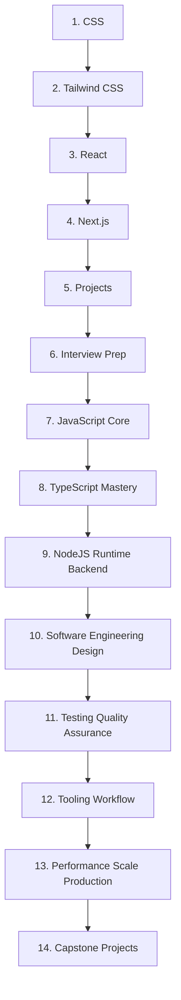

# Frontend + JavaScript, TypeScript, and Node.js Development Vault

This folder is now the single home for the frontend and JavaScript/TypeScript/Node.js curriculum. The existing notes were moved into one sequential structure; their note content and internal note IDs are preserved.

## Unified Folder Structure

```text
Frontend Development Vault
├── 1. CSS
├── 2. Tailwind CSS
├── 3. React
├── 4. Next.js
├── 5. Projects
├── 6. Interview Prep
├── 7. JavaScript Core
├── 8. TypeScript Mastery
├── 9. NodeJS Runtime Backend
├── 10. Software Engineering Design
├── 11. Testing Quality Assurance
├── 12. Tooling Workflow
├── 13. Performance Scale Production
├── 14. Capstone Projects
├── .obsidian
├── README.md
├── README - Frontend Development Vault.md
└── README - JavaScript TypeScript Node.js.md
```

## Learning Order



## Module Map

### 1. CSS
The CSS foundations, selectors, box model, layout, responsive design, animation, accessibility, architecture, and performance curriculum.

### 2. Tailwind CSS
Tailwind philosophy, configuration, responsive utilities, component composition, layout patterns, plugins, React/Next.js integration, and scaling large projects.

### 3. React
JSX, components, props, state, events, forms, lists, hooks, effects, context, composition, performance, Suspense, error boundaries, reusable component design, architecture, API integration, and routing.

### 4. Next.js
App Router, routing and layouts, Server/Client Components, rendering strategies, data fetching, caching, Server Actions, Route Handlers, streaming, SEO, optimization, middleware, and project organization.

### 5. Projects
The existing frontend project sequence remains intact, including landing pages, blogs, portfolios, documentation sites, dashboards, Kanban, weather, notes, chat, file explorer, SaaS, e-commerce, and analytics projects.

### 6. Interview Prep
Frontend interview questions covering CSS, Tailwind, React, Next.js, architecture, performance, accessibility, and practical debugging.

### 7. JavaScript Core
33 notes covering fundamentals, scope and closures, prototypes, asynchronous JavaScript, engine internals and memory, and metaprogramming. Existing note IDs `1.01`–`1.33` are preserved for link stability.

### 8. TypeScript Mastery
19 notes covering foundations and inference, advanced types, type-level programming, and architectural TypeScript. Existing note IDs `2.01`–`2.19` are preserved.

### 9. NodeJS Runtime Backend
23 notes covering Node.js runtime architecture, core APIs and I/O, networking, processes and concurrency, and enterprise backend patterns. Existing note IDs `3.01`–`3.23` are preserved.

### 10. Software Engineering Design
14 notes covering SOLID and other design principles, architectural patterns, refactoring, and clean-code practices. Existing note IDs `4.01`–`4.14` are preserved.

### 11. Testing Quality Assurance
12 notes covering testing strategy, TDD, testability, unit testing, integration/E2E testing, contract testing, mocking, and test data patterns. Existing note IDs `5.01`–`5.12` are preserved.

### 12. Tooling Workflow
13 notes covering package management, workspaces, linting, formatting, compilers, bundlers, alternate runtimes, source maps, debugging, and CI/CD. Existing note IDs `6.01`–`6.13` are preserved.

### 13. Performance Scale Production
9 notes covering CPU and memory diagnostics, event-loop monitoring, API hardening, secrets management, caching, concurrency, and production monitoring. Existing note IDs `7.01`–`7.09` are preserved.

### 14. Capstone Projects
Three existing capstones: Realtime Analytics Engine, Distributed Task Queue, and Type Safe Custom ORM. Existing project note IDs `8.01`–`8.03` are preserved.

## Structural Rules

1. Top-level folders use one continuous numeric order: `1` through `14`.
2. Existing frontend folder contents were retained in place.
3. JS/TS/Node modules were moved under the same folder without rebuilding their note trees from scratch.
4. Existing nested chapter numbering and note IDs are preserved to avoid unnecessary link churn.
5. Obsidian wikilinks remain note-name based, so moving folders does not require renaming the notes themselves.
6. The JS/Node Obsidian workspace was moved into this folder and its active-note path was updated to the new `7. JavaScript Core` location.
7. The two original curriculum READMEs are preserved as `README - Frontend Development Vault.md` and `README - JavaScript TypeScript Node.js.md`; this file is the unified index for the merged structure.

## Preserved Source Documentation

The original curriculum documents remain available inside this folder so no documentation content is discarded during the merge:

- `README - Frontend Development Vault.md`
- `README - JavaScript TypeScript Node.js.md`
