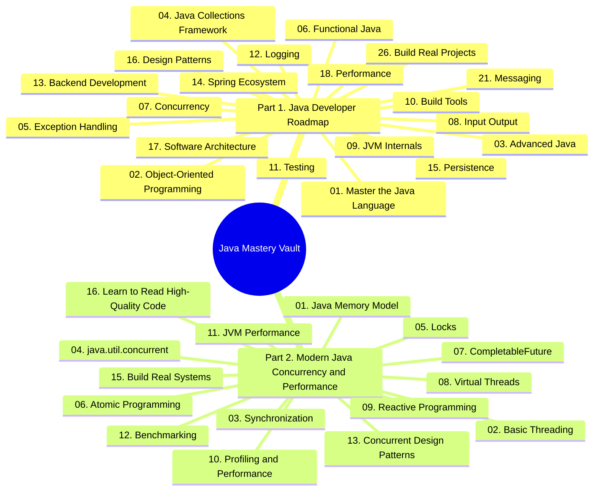
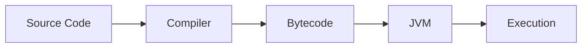

# Java Mastery Vault

> A comprehensive, exhaustive Obsidian vault covering the entire Java developer journey — from language fundamentals to advanced concurrency, performance engineering, and modern Java 21+ features.

---

## About This Vault

This vault consolidates **two complementary roadmaps** into a single, structured knowledge base:

1. **Java Developer Roadmap** — A complete journey from Java basics to enterprise-grade production systems, covering the language, OOP, collections, concurrency, Spring, persistence, design patterns, architecture, messaging, and real-world projects.
2. **Modern Java Concurrency and Performance** — A specialized deep dive (Java 21+) into the Java Memory Model, virtual threads, locks, atomics, `CompletableFuture`, profiling, benchmarking, and high-performance concurrent design.

Each note is written to be **self-contained, exhaustive, and unambiguous** — you should never need to look anything up after reading a note. Every concept includes background, theory, code, pitfalls, tips, and Mermaid diagrams.

---

## How to Use This Vault

- Read chapters **in order** if you are learning from scratch.
- Jump to any chapter directly if you need a refresher — each note is self-contained.
- Use Obsidian's graph view to see conceptual links between notes.
- Every code example is **copy-paste runnable** on Java 21+ unless otherwise noted.
- Mermaid diagrams render natively in Obsidian's reading view.

---

## Vault Structure

---

## File Naming Conventions

- **Numbering:** `01.`, `01.1`, `01.2` — always numbered with a period and a space.
- **No underscores** anywhere in filenames or section titles.
- **Spaces** are used to separate words.
- Files use the `.md` Markdown extension.

---

## Diagrams

All diagrams in this vault use **Mermaid** syntax. Obsidian renders Mermaid natively. Example:

---

## Recommended Reading Path

### Beginner Path (3 to 6 months)

1. `01. Java Developer Roadmap/01. Master the Java Language/`
2. `01. Java Developer Roadmap/02. Object-Oriented Programming/`
3. `01. Java Developer Roadmap/03. Advanced Java/`
4. `01. Java Developer Roadmap/04. Java Collections Framework/`
5. `01. Java Developer Roadmap/05. Exception Handling/`

### Intermediate Path (6 to 12 months)

6. `01. Java Developer Roadmap/06. Functional Java/`
7. `01. Java Developer Roadmap/07. Concurrency/`
8. `01. Java Developer Roadmap/08. Input Output/`
9. `01. Java Developer Roadmap/09. JVM Internals/`
10. `01. Java Developer Roadmap/10. Build Tools/`
11. `01. Java Developer Roadmap/11. Testing/`
12. `01. Java Developer Roadmap/12. Logging/`

### Backend and Enterprise Path (12 to 18 months)

13. `01. Java Developer Roadmap/13. Backend Development/`
14. `01. Java Developer Roadmap/14. Spring Ecosystem/`
15. `01. Java Developer Roadmap/15. Persistence/`
16. `01. Java Developer Roadmap/16. Design Patterns/`
17. `01. Java Developer Roadmap/17. Software Architecture/`
18. `01. Java Developer Roadmap/18. Performance/`
19. `01. Java Developer Roadmap/21. Messaging/`

### Concurrency Specialization (3 to 6 months)

20. `02. Modern Java Concurrency and Performance/01. Java Memory Model/`
21. `02. Modern Java Concurrency and Performance/02. Basic Threading/`
22. `02. Modern Java Concurrency and Performance/03. Synchronization/`
23. `02. Modern Java Concurrency and Performance/04. java.util.concurrent/`
24. `02. Modern Java Concurrency and Performance/05. Locks/`
25. `02. Modern Java Concurrency and Performance/06. Atomic Programming/`
26. `02. Modern Java Concurrency and Performance/07. CompletableFuture/`
27. `02. Modern Java Concurrency and Performance/08. Virtual Threads/`
28. `02. Modern Java Concurrency and Performance/09. Reactive Programming/`
29. `02. Modern Java Concurrency and Performance/10. Profiling and Performance/`
30. `02. Modern Java Concurrency and Performance/11. JVM Performance/`
31. `02. Modern Java Concurrency and Performance/12. Benchmarking/`
32. `02. Modern Java Concurrency and Performance/13. Concurrent Design Patterns/`

### Mastery Path (ongoing)

33. `01. Java Developer Roadmap/26. Build Real Projects/`
34. `02. Modern Java Concurrency and Performance/15. Build Real Systems/`
35. `02. Modern Java Concurrency and Performance/16. Learn to Read High-Quality Code/`

---

## Conventions Used in Every Note

Each note follows a consistent internal structure:

1. **Title and Overview** — what the note covers and why it matters.
2. **Background Knowledge** — prerequisites you must understand first.
3. **Core Concepts** — detailed, exhaustive explanation of every subtopic.
4. **Code Examples** — runnable Java snippets with line-by-line commentary.
5. **Mermaid Diagrams** — visual explanations of structure and flow.
6. **Common Pitfalls** — mistakes developers make and how to avoid them.
7. **Tips and Tricks** — insights that experienced engineers know.
8. **Interview Questions** — frequently asked questions with model answers.
9. **Summary** — concise recap of key points.

---

## Java Version

This vault targets **Java 21 LTS** as the baseline. Where features are specific to later versions (Java 22, 23, 24, 25), this is explicitly noted in the relevant note.

---

## License and Use

This vault is for personal study. Code examples may be freely used in your own projects. Attribution to the roadmap structure is appreciated but not required.

---

Happy learning. The journey from "I know Java syntax" to "I can build correct, scalable, high-performance concurrent Java systems" is long — this vault is your map.
