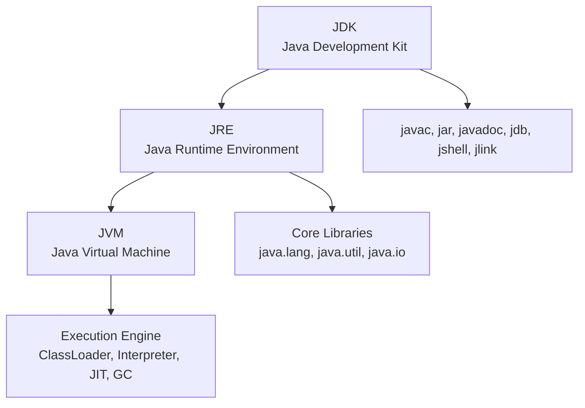
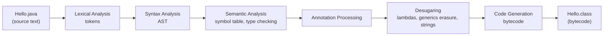
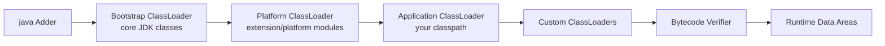
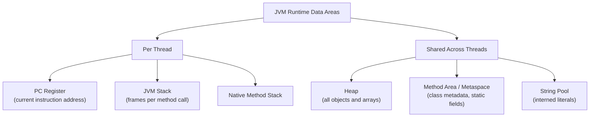
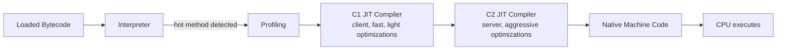
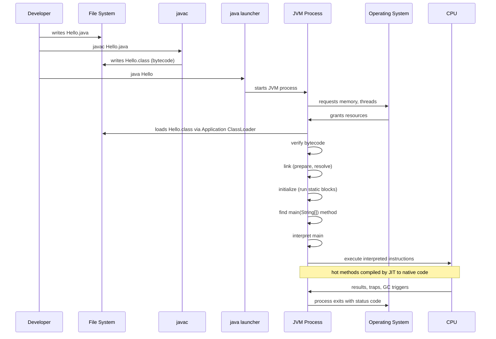

# 1.1. JVM JRE JDK and Execution Pipeline

## Overview

Java is rare among mainstream programming languages because it deliberately separates the act of writing code from the act of executing code by introducing an intermediate representation called **bytecode**. When you compile a `.java` file, you do not produce native machine instructions for any specific CPU. Instead, you produce a compact, platform-neutral binary format that lives inside `.class` files. This bytecode is then translated, verified, and executed by a piece of software called the **Java Virtual Machine (JVM)**. The JVM is what makes the famous slogan "Write Once, Run Anywhere" technically possible: as long as a JVM implementation exists for a given operating system and CPU architecture, the same bytecode can run there with no recompilation.

Around the JVM itself, the Java platform provides two more named bundles that beginners often confuse. The **Java Runtime Environment (JRE)** is the minimum set of components required to *run* Java applications: it contains the JVM, the core library classes (the `java.*`, `javax.*`, `jdk.*` modules), and supporting files. The **Java Development Kit (JDK)** is a superset of the JRE that also contains tools for *developing* Java applications, most notably `javac` (the compiler), `javadoc` (the documentation generator), `jdb` (the debugger), `jar` (the archiver), and from modern versions also `jshell`, `jlink`, `jpackage`, and so on. Starting with Java 11, the JRE as a separate download was effectively retired; today you simply install a JDK, which contains everything needed to both build and run Java programs.

Understanding this pipeline matters because every Java developer eventually has to answer questions like: "Why does my code compile but fail at runtime?", "What does `UnsupportedClassVersionError` mean?", "Why is my method inlined in one run but not another?", "How does the JVM decide what to garbage collect?", and "What is the difference between a JVM language and a Java language feature?" None of these can be answered convincingly without a solid mental model of the execution pipeline. This note walks through the entire journey of a Java program, from source text in your editor all the way to CPU instructions executing on bare metal.

## Background Knowledge

Before diving in, you should be comfortable with a few ideas. First, computers execute **machine code**: raw binary instructions that the CPU decodes directly. Different CPU families (x86 64, ARM64, RISC V, etc.) have different machine code formats, which is why a Windows `.exe` cannot run on a Linux machine without translation. Second, a **compiler** is a program that translates source code written in a high level language into a lower level form, often machine code. Third, an **interpreter** is a program that executes source code or bytecode one instruction at a time without producing a persistent machine code file. Fourth, the operating system manages processes, memory, files, and hardware access; any program you run, including the JVM itself, is a process under the OS.

Java sits in an interesting middle ground. It is compiled (from `.java` to `.class`) but the compiler output is not machine code; it is bytecode. The JVM then mixes interpretation and just in time (JIT) compilation to turn bytecode into native instructions lazily, only for the parts of the program that are actually hot. This hybrid model is the source of much of Java's performance and portability, and it is the central concept this note unpacks.

You should also know that "Java" technically refers to three distinct things: the **Java language** (syntax and grammar), the **Java platform** (the JVM specification and standard APIs), and the **Java ecosystem** (libraries, frameworks, build tools). When people say "Java is platform independent," they are really talking about the platform (specifically the bytecode and JVM specs), not the language itself.

## The Three Bundles: JDK, JRE, JVM



### JVM (Java Virtual Machine)

The JVM is an abstract computing machine defined by the **Java Virtual Machine Specification**. It is a specification, not a single piece of software; multiple vendors implement it (HotSpot from Oracle/OpenJDK, OpenJ9 from Eclipse, GraalVM from Oracle Labs, Azul Zing, Amazon Corretto's variant, etc.). The JVM is responsible for:

- Loading `.class` files through its **Classloader Subsystem**
- Verifying that bytecode is safe through the **Bytecode Verifier**
- Storing classes and runtime data in **Runtime Data Areas**
- Executing bytecode through the **Execution Engine** (interpreter + JIT compilers + garbage collector)

### JRE (Java Runtime Environment)

The JRE is the runtime distribution that bundles the JVM with the core class libraries and configuration files needed to *run* Java applications. If all you want to do is run a Java program (not develop one), the JRE was historically enough. Note: since Java 11, Oracle stopped shipping a separate JRE; instead, you use `jlink` to assemble a custom minimal runtime image from JDK modules.

### JDK (Java Development Kit)

The JDK is the full development bundle. It contains everything in the JRE plus developer tools. Modern JDKs (Java 9+) are organized into modules via the Java Platform Module System (JPMS). A typical JDK installation includes:

- `bin/` directory with executables (`javac`, `java`, `jar`, `javadoc`, `jshell`, `jlink`, `jpackage`, `jcmd`, `jstack`, `jmap`, `jhsdb`, etc.)
- `lib/` directory with the JDK's own modules (`java.base`, `java.compiler`, `java.desktop`, etc.)
- `conf/` for security policy, management properties
- `legal/` for license texts
- `include/` for C headers used by JNI

## The Compilation Process

When you run `javac Hello.java`, the compiler performs these phases:



### Lexical Analysis

The compiler scans the source text character by character and groups characters into **tokens**: identifiers, keywords, literals, operators, separators, whitespace, and comments. Whitespace and comments are discarded at this stage. Invalid characters or unterminated string literals cause a compile error here.

### Syntax Analysis

Tokens are organized into a tree structure called an **Abstract Syntax Tree (AST)**. Each node represents a language construct such as a class declaration, method declaration, statement, or expression. The grammar that defines valid trees is given by the Java Language Specification.

### Semantic Analysis

The compiler walks the AST and resolves names: which class `String` refers to, which method `println` is being called, whether types are compatible, whether exceptions are caught, whether `final` variables are reassigned, and so on. This stage produces the symbol table and detects type errors that the lexer and parser could not.

### Annotation Processing

User written annotation processors (classes implementing `javax.annotation.processing.Processor`) run between semantic analysis and code generation. They can read the AST, validate it, emit warnings or errors, and even **generate new source files**, which are then fed back through the same pipeline. Many frameworks (Lombok, MapStruct, Dagger, Hibernate's JPA metamodel generator) rely on this hook.

### Desugaring

Java the language has many high level constructs that do not exist in bytecode. The compiler rewrites them into lower level equivalents:

- **Lambdas** become private synthetic methods plus `invokedynamic` bootstrap calls
- **Generics** undergo **type erasure**: `List<String>` becomes `List`
- **Try with resources** becomes explicit `try finally` with `Throwable.addSuppressed`
- **String concatenation** with `+` becomes `invokedynamic` calls to `StringConcatFactory` (since Java 9)
- **Switch on enums** and **switch on strings** become lookup tables

### Code Generation

The final stage emits the bytecode into one `.class` file per top level class (including nested ones, which get names like `Outer$Inner.class`). Each `.class` file follows a strict binary format defined in the JVM Specification, including the **magic number** `0xCAFEBABE`, version numbers, constant pool, access flags, fields, methods, and attributes.

You can inspect a `.class` file with the `javap` tool:

```bash
javap -v -p Hello.class
```

This shows the constant pool, method signatures, and bytecode instructions, which is invaluable when debugging low level issues.

## Bytecode: The Intermediate Representation

Bytecode is the linchpin of Java's portability. It is a compact stack oriented instruction set where each opcode is a single byte (hence the name) followed by zero or more operands. Some examples:

- `iconst1` pushes the integer constant 1 onto the operand stack
- `iload0` loads an int from local variable slot 0
- `iadd` pops two ints and pushes their sum
- `invokevirtual #2` calls the method referenced by constant pool entry 2
- `getfield #3` reads an object field
- `areturn` returns a reference from a method

Bytecode is **platform independent**: the same `.class` file runs on Windows, Linux, macOS, on x86, ARM, or RISC V. It is also **verified** before execution to ensure type safety, no stack underflows, no illegal casts, and properly structured control flow.

Here is a small example and the bytecode it compiles to:

```java
public class Adder {
    public int add(int a, int b) {
        return a + b;
    }
}
```

The compiled `add` method (paraphrased from `javap` output):

```
0: iload1        // load local 1 (a) onto operand stack
1: iload2        // load local 2 (b) onto operand stack
2: iadd           // pop two ints, push sum
3: ireturn        // return int from method
```

Local slot 0 holds `this` in an instance method, so `a` is slot 1 and `b` is slot 2. The operand stack is the JVM's working area for arithmetic and method arguments.

## The Classloader Subsystem

Loading is the first phase of the JVM runtime pipeline. When you start `java Adder`, the JVM does the following:



### Loading Phases

1. **Loading** - finding the binary (`.class` file or in memory image) and producing a `Class` object.
2. **Linking**, which has three sub phases:
   - **Verification** - checks bytecode safety
   - **Preparation** - allocates memory for static fields and assigns default values (0, null, false)
   - **Resolution** - optionally replaces symbolic references in the constant pool with direct references (lazy by default)
3. **Initialization** - runs static initializers and static field assignments in source order

### Classloader Hierarchy

- **Bootstrap ClassLoader** - native code, loads `java.base` and other core modules. Has no Java parent.
- **Platform ClassLoader** (formerly Extension) - loads platform modules like `java.sql`, `java.xml`.
- **Application ClassLoader** - loads classes from your `-cp` / `CLASSPATH` and module path.
- **Custom ClassLoaders** - user written subclasses of `ClassLoader`, common in app servers and frameworks.

A classloader first **delegates** to its parent before attempting to load itself, with rare exceptions. This is the **parent delegation model**, and it prevents malicious code from replacing core classes like `java.lang.String`.

## Runtime Data Areas

The JVM organizes memory into several regions, each with its own purpose and lifetime:



### Program Counter (PC) Register

Each thread has its own PC register pointing to the address of the JVM instruction currently being executed. If the thread is executing a native method, the PC is undefined.

### JVM Stack

Each thread has a private stack of **frames**. A new frame is pushed for every method invocation and popped when the method returns. A frame contains:

- **Local Variables Array** - holds `this`, parameters, and local variables. Slots are 32 bit; longs and doubles take two slots.
- **Operand Stack** - the working area for bytecode instructions
- **Dynamic Linking** - reference to the constant pool of the current method's class for symbolic resolution
- **Return Value** slot and exception table

StackOverflowError occurs when a thread's stack depth exceeds the limit (often tunable with `-Xss`).

### Native Method Stack

For methods written in languages like C/C++ via JNI. May be a separate stack or merged with the JVM stack.

### Heap

The heap is where all class instances and arrays live. It is shared across all threads and is the main target of **Garbage Collection**. The heap is typically divided into generations:

- **Young Generation** - Eden + two Survivor spaces (S0, S1). Most objects die young.
- **Old Generation (Tenured)** - long lived objects promoted from survivors
- Optional **Large Object / Humongous** region in G1 GC for huge arrays

### Method Area (Metaspace)

Stores class metadata, method bytecode, field metadata, the runtime constant pool, and static variables (the references; the actual objects live on the heap). In HotSpot, this was moved out of the heap to native memory called **Metaspace** in Java 8, replacing the old PermGen.

### String Pool

A special region (historically in PermGen, now in the heap) that stores interned string literals. Two string literals with the same content refer to the same `String` instance, which is why `"a" == "a"` returns true.

## The Execution Engine

The execution engine turns bytecode into actual CPU work. It has three cooperating parts:



### Interpreter

The interpreter executes bytecode one instruction at a time without caching native code. It is slow but starts instantly and has zero warmup. The interpreter also collects **profiling data**: which methods are called often, which branches are taken, which types are observed at call sites.

### JIT Compilers

When a method (or loop body) crosses a threshold of invocations, the JVM **compiles it to native code** in the background. HotSpot has two main JIT compilers:

- **C1 (Client Compiler)** - quick compilation with simple optimizations: inlining of small methods, class hierarchy analysis, null check elision.
- **C2 (Server Compiler)** - aggressive optimizations based on profiling: loop unrolling, escape analysis, lock elision, vectorization, branch prediction hints.

By default, HotSpot uses **Tiered Compilation**: methods are first interpreted, then C1 compiled with profiling, then C2 compiled when truly hot. This balances startup time and peak throughput.

There is also **Graal**, a JIT compiler written in Java itself, which can replace C2 in GraalVM distributions.

### Deoptimization

The JIT compilers make **speculative assumptions** (e.g., "this call site always dispatches to `StringImpl`"). If a later class loading invalidates the assumption, the JVM **deoptimizes**: it discards the compiled native code and falls back to the interpreter. This is rare in steady state but common during warmup.

### Garbage Collector

The GC automatically reclaims memory occupied by objects that are no longer reachable. Modern collectors include:

- **G1** (default since Java 9) - region based, predictable pauses
- **ZGC** - sub millisecond pauses for huge heaps
- **Shenandoah** - concurrent compaction, Red Hat led
- **Serial** and **Parallel** - older collectors, still useful for tiny or batch workloads

## The Full Execution Pipeline



## A Worked Example: Hello World in Detail

```java
public class HelloWorld {
    public static void main(String[] args) {
        System.out.println("Hello, World!");
    }
}
```

Step by step:

1. You save this as `HelloWorld.java`. The filename must match the public class name.
2. You run `javac HelloWorld.java`. The compiler:
   - Lexes the source into tokens.
   - Builds an AST.
   - Resolves `System`, `System.out`, `PrintStream`, `String`, `println(String)`.
   - Generates bytecode, writing `HelloWorld.class`.
3. You run `java HelloWorld`. The launcher:
   - Finds the JVM shared library (typically `libjvm.so` or `jvm.dll`).
   - Starts a new OS process with the JVM runtime.
   - The Bootstrap ClassLoader loads `java.base` (which includes `java.lang.System`, `java.lang.String`, `java.io.PrintStream`).
   - The Application ClassLoader loads `HelloWorld.class` from the classpath.
   - The bytecode verifier checks `HelloWorld.class`.
   - Static fields of `System` are initialized (`System.out` is set to a `PrintStream` wrapping stdout).
   - The JVM locates `public static void main(String[])` and starts a thread on it.
4. The interpreter executes `main`:
   - `getstatic` reads `System.out`
   - `ldc` loads the string constant `"Hello, World!"`
   - `invokevirtual` calls `PrintStream.println(String)`
5. `println` writes to stdout (which the OS routes to your terminal).
6. `main` returns. The JVM destroys non daemon threads, runs shutdown hooks, and the process exits.

## Common Pitfalls

- **Wrong Java version at runtime.** Compiling with JDK 21 and running on JDK 17 throws `UnsupportedClassVersionError: ... has been compiled by a more recent version of the Java Runtime (class file version 65.0)`. Always match or exceed the compile target with your runtime.
- **Confusing `java` and `javac`.** `javac` compiles, `java` runs. New developers sometimes try `java Hello.java` to compile; this only works since Java 11 in single file source mode, and even then it skips `.class` generation.
- **Classpath mistakes.** Putting a directory on the classpath when you meant a jar, or vice versa, leads to `ClassNotFoundException`. Remember: directories contain the *root* of the package hierarchy; jars are listed as files.
- **Misunderstanding the String pool.** `new String("a")` always creates a fresh object on the heap; `"a"` from a literal is pooled. Use `.equals(...)` for content comparison.
- **Stack depth and recursion.** Unbounded recursion gives `StackOverflowError`. Increase `-Xss` only as a last resort; fix the algorithm.
- **Memory leaks via classloaders.** In containers and app servers, undeploying an application can leak memory if a classloader is held by a thread or static field. Modern frameworks mitigate this, but it is still a classic trap.
- **Treating the JVM as a black box.** When performance degrades, use `jcmd <pid> Thread.print`, the `jcmd <pid> GC.heapinfo` diagnostic, and `jfr` (Java Flight Recorder) to actually see what is happening.

## Tips and Tricks

- Use `javap -c -p MyClass.class` routinely to see what your source compiles to. It reveals hidden synthetic methods, lambda desugaring, and switch table generation.
- Use `jshell` for rapid experimentation. It is a REPL that compiles snippets in memory and shows you results immediately.
- Use `jlink` to produce a tiny custom runtime containing only the modules your app needs. This yields deployment images of 30 to 50 MB instead of a 300 MB JDK.
- For startup critical workloads (CLI tools, AWS Lambda), consider GraalVM **Native Image**, which ahead of time compiles your application to a native executable. Trade offs: longer build times, no JIT, reflection needs configuration.
- Inspect the JIT's decisions with `-XX:+UnlockDiagnosticVMOptions -XX:+PrintCompilation`. You will see which methods are compiled, deoptimized, and why.
- Understand the `-X` flags: `-Xms` (initial heap), `-Xmx` (max heap), `-Xss` (thread stack size), `-Xlog:gc` (GC logging).
- For classpath debugging, add `-Xlog:class+load=info` to see every class loaded and which classloader loaded it.
- Remember that the JVM's `main` thread is a **non daemon** thread. The JVM waits for all non daemon threads to finish before exit. Daemon threads (like the GC) are killed abruptly.
- The `classpath` is searched left to right. If two jars contain the same class, the first wins (the so called "classpath shadowing"). Tools like Maven Enforcer's `dependency-convergence` rule help detect this.

## Interview Questions

**Q1. What is the difference between JDK, JRE, and JVM?**
A1. The JVM is the abstract execution engine defined by the JVM Specification; it loads, verifies, and runs bytecode. The JRE is the runtime distribution containing the JVM plus the core class libraries needed to run Java applications. The JDK is a superset of the JRE that also contains developer tools such as `javac`, `jar`, `javadoc`, and `jshell`. Since Java 11 the standalone JRE is no longer shipped; you install a JDK and optionally use `jlink` to produce a minimal custom runtime.

**Q2. Why is Java called platform independent?**
A2. Because the language compiles to platform neutral bytecode (`.class` files) that any compliant JVM can execute. The JVM itself is platform specific (different binaries for Windows, Linux, macOS, x86, ARM), but the bytecode is not. So you compile once on any platform and run on any platform with a JVM.

**Q3. What is bytecode and why is it stack based?**
A3. Bytecode is the compact instruction set stored in `.class` files, defined by the JVM Specification. It is stack based because instructions operate on an operand stack rather than registers. This keeps the instruction format compact (most opcodes are one byte), simplifies verification (you can statically check that the stack never underflows), and makes the format independent of any CPU's register layout, which eases porting the JVM to new architectures.

**Q4. What are the phases of class loading?**
A4. Loading (producing a `Class` object from a binary representation), Linking (which consists of Verification, Preparation, and Resolution), and Initialization (running `<clinit>` static initializers and static field assignments in source order). Resolution can be lazy; the JVM spec permits resolving symbolic references on first use rather than eagerly.

**Q5. What is the difference between interpreter and JIT compiler?**
A5. The interpreter executes bytecode one instruction at a time, with low startup cost but slow steady state. The JIT compiler selectively compiles hot methods to native machine code based on profiling data, giving near C like peak performance but with warmup cost. HotSpot uses tiered compilation: interpret, then C1 compile with profiling, then C2 compile aggressively.

**Q6. What is the parent delegation model?**
A6. When a classloader is asked to load a class, it first delegates to its parent before attempting to load the class itself. Only if the parent cannot find the class does the child loader try. This prevents untrusted code from replacing core classes (e.g., a custom `java.lang.String`) and ensures that the same class is loaded exactly once per classloader namespace.

**Q7. What is the difference between Heap and Metaspace?**
A7. The Heap holds all object instances and arrays and is garbage collected. Metaspace (replacing PermGen since Java 8) holds class metadata, method bytecode, and the runtime constant pool, and is allocated in native memory. Static variables are stored as references in Metaspace but the objects they refer to live on the heap.

**Q8. What does `UnsupportedClassVersionError` mean and how do you fix it?**
A8. It means the bytecode's major version number is higher than what the running JVM supports. For example, class file version 65 corresponds to Java 21. If you run such a class on Java 17 (version 61), the JVM throws `UnsupportedClassVersionError`. Fix by either upgrading the runtime, recompiling with `--release 17` (or lower), or using a build tool that pins the release version.

**Q9. Why does the JVM have both C1 and C2 compilers?**
A9. C1 produces native code quickly with light optimizations, giving good startup performance for short lived applications. C2 takes longer to compile but performs aggressive optimizations (loop unrolling, escape analysis, vectorization) for maximum throughput. Tiered compilation uses C1 first with profiling instrumentation, then hands truly hot methods to C2 with rich profile data, achieving both fast startup and high peak throughput.

**Q10. Explain the bytecode verification step.**
A10. Before a class is allowed to execute, the verifier checks that the bytecode obeys JVM safety rules: operands match types, the operand stack does not underflow or overflow, methods are called with correct argument types, branches do not leave method bodies, final classes are not subclassed, and so on. This is what allows the JVM to run untrusted code safely without a slow runtime check on every instruction.

## Summary

The Java execution pipeline is a layered, deliberate design that trades a little startup overhead for enormous gains in portability, safety, and peak performance. You write source code, `javac` compiles it into platform neutral bytecode stored in `.class` files, and the JVM loads, verifies, links, and initializes those classes before executing them with a hybrid of interpretation and just in time compilation. Memory is organized into per thread stacks and a shared heap plus Metaspace, and unreachable objects are reclaimed by a sophisticated garbage collector. Knowing this pipeline gives you the mental scaffolding to diagnose classloading problems, tune GC, understand JIT behavior, and answer the questions that separate junior Java developers from senior engineers. The next notes in this phase zoom in on the language itself: primitive types, variables, control flow, methods, packages, and the type system that sits on top of this runtime.
