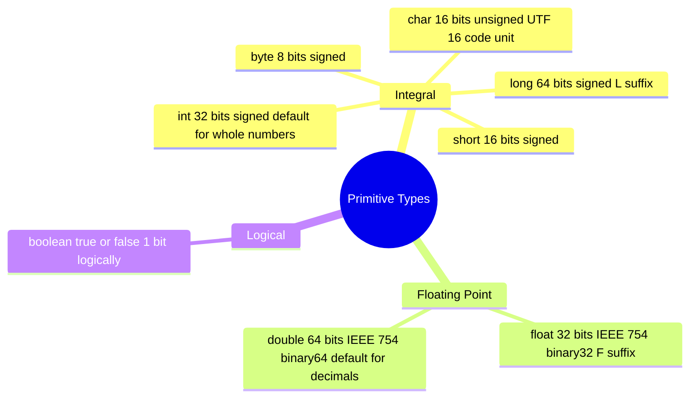
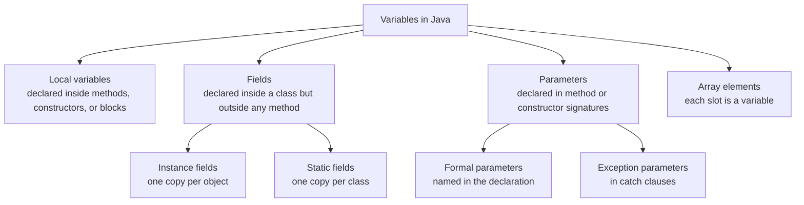
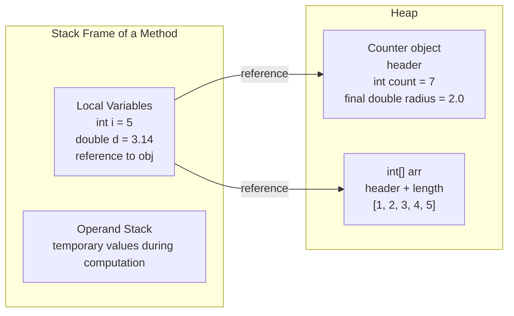

# 1.2. Primitive Types Variables and Constants

## Overview

Every value that flows through a Java program has a **type**. A type tells the compiler two things: how many bytes the value occupies in memory, and which operations are legal on that value. Java divides its type system into two great families: **primitive types** and **reference types**. Primitive types are the eight built in, non object, value types (`byte`, `short`, `int`, `long`, `float`, `double`, `char`, `boolean`) that the JVM stores directly and operates on with dedicated bytecode instructions. Reference types are everything else: classes, interfaces, arrays, and the special `null` type. This note focuses on the eight primitives, how they are stored in variables, and how variables become constants through the `final` keyword.

Primitives exist in Java for three intertwined reasons. First, **performance**: a primitive `int` is exactly 32 bits that the CPU can add, multiply, and compare using a single machine instruction. The wrapper class `Integer`, by contrast, is a full heap object with an object header (typically 12 to 16 bytes), a padding word, and an inner `int` field. Using `Integer` for tight numeric loops would slow programs down by an order of magnitude and trigger enormous garbage collection pressure. Second, **semantic clarity**: when you declare `int age`, you are stating explicitly that `age` is a 32 bit whole number, never `null`, never an object reference, never anything else. This makes method contracts precise and the compiler's type checking aggressive. Third, **language simplicity**: primitive types have well defined, predictable arithmetic defined by the **Java Language Specification (JLS)**, avoiding the complexity that C and C++ suffer from platform dependent integer sizes (`int` is 16 bits on some systems, 32 on others, 64 on yet others).

Variables are named storage locations that hold values of a specific type. A variable can be a **local variable** inside a method, a **field** of an object, a **static field** of a class, a **parameter** of a method or constructor, or an element of an array. Each kind of variable has its own scope, lifetime, initialization rules, and default value semantics. Constants in Java are not a separate language construct: they are simply variables declared with the `final` keyword, which guarantees that the variable can be assigned exactly once and never changes afterward. When a `final` variable is also `static` and initialized by a constant expression, the compiler can inline its value at every use site, producing both readability and performance.

By the end of this note you should be able to explain the size, range, default value, and literal syntax of every primitive; choose the right primitive for any given numeric or character task; explain how the JVM lays out primitives in stack frames versus fields in heap objects; and reason precisely about the difference between a `final` local variable, a `final` field, and a `static final` compile time constant.

## Background Knowledge

Before diving in, recall a few foundational ideas:

- **Bits and bytes.** A bit is a single binary digit (0 or 1). A byte is 8 bits and can represent 256 distinct values. The signed byte interpretation uses two's complement encoding, where the leftmost bit is the sign bit; this yields the range -128 through +127.
- **Two's complement.** Java uses two's complement for all signed integer types (`byte`, `short`, `int`, `long`). In two's complement, negation is performed by inverting all bits and adding one. The most negative value has no positive counterpart: for `int`, the value `Integer.MIN VALUE` is -2147483648, but `Integer.MAX VALUE` is +2147483647, so `-Integer.MIN VALUE == Integer.MIN VALUE` (overflow).
- **IEEE 754 floating point.** `float` and `double` use the IEEE 754 binary32 and binary64 formats. A floating point number is encoded as `sign * mantissa * 2^exponent`, where the mantissa has an implicit leading 1 bit for normal numbers. This encoding cannot represent most decimal fractions exactly: `0.1 + 0.2 != 0.3` in `double` arithmetic.
- **UTF 16.** Java's `char` is a 16 bit unsigned integer that holds a UTF 16 code unit. Most Unicode characters in the Basic Multilingual Plane (BMP) fit in one `char`, but characters outside the BMP (such as many emojis and historic scripts) require two `char` values called a **surrogate pair**. The length of a `String` is the number of UTF 16 code units, not the number of Unicode code points.
- **Stack vs heap.** The JVM allocates a stack frame per method invocation, holding local variables and operand stacks. Fields of objects live on the heap. Primitive locals live on the stack (or in registers, after JIT compilation); primitive fields live inside their owning object on the heap.
- **Compile time constants.** A constant expression is one composed of literals and `static final` primitives (or `String`s) initialized by a constant expression. The compiler computes such expressions at compile time and may inline the result.

With these preliminaries out of the way, let us tour each primitive in detail.

## The Eight Primitive Types



Here is the canonical table summarizing size, range, default value, and literal form:

| Type | Size | Range | Default | Literal Example |
|------|------|-------|---------|-----------------|
| `byte` | 8 bits | -128 to 127 | 0 | `42` |
| `short` | 16 bits | -32768 to 32767 | 0 | `10000` |
| `int` | 32 bits | -2^31 to 2^31 - 1 | 0 | `1000000` |
| `long` | 64 bits | -2^63 to 2^63 - 1 | 0L | `9000000000L` |
| `float` | 32 bits | ~+/-3.4e38, 7 sig digits | 0.0f | `3.14f` |
| `double` | 64 bits | ~+/-1.8e308, 15 sig digits | 0.0 | `3.14` |
| `char` | 16 bits | 0 to 65535 | `'\u0000'` | `'A'`, `65` |
| `boolean` | 1 bit logically | `true` or `false` | `false` | `true` |

A few crucial points about this table:

- The **default value** is what the JVM writes into a field of that type when an object is created but the field is not explicitly initialized. Local variables do **not** get default values; you must initialize them before use, or the compiler rejects the program.
- `int` is the default type for whole number literals. If you write `10000000000` (ten billion) without an `L` suffix, the compiler tries to parse it as an `int` and fails because it exceeds `Integer.MAX VALUE`.
- `double` is the default type for decimal literals. `3.14` is a `double`; to make it a `float` you must write `3.14f` (or `3.14F`).
- `char` is technically an unsigned 16 bit integer. You can assign any integer literal in range to a `char`: `char c = 65;` produces `'A'` because 65 is the ASCII code for A.
- `boolean` has no defined size in the JLS. The JVM spec says a `boolean` value is compiled to an `int` (0 or 1) in bytecode, and `boolean[]` arrays are stored as `byte[]` arrays. Some JVMs use a single byte for boolean fields.

## Detailed Look at Each Primitive

### byte

`byte` is an 8 bit signed integer ranging from -128 to +127. It is the smallest integer type and is most often used for I/O buffers (`byte[]` for reading binary streams), network protocols, and embedded style code where memory matters. Arithmetic on `byte` variables is performed by first promoting them to `int` (more on this in the **Numeric Promotion** section of file 01.5), so the following surprising code is incorrect:

```java
byte a = 10;
byte b = 20;
byte c = a + b;      // COMPILER ERROR: a + b is int, not byte
byte c2 = (byte)(a + b);   // OK: explicit cast
```

This promotion rule exists because the JVM's instruction set has no `byte add` instruction; all arithmetic is done in `int` or `long` registers. The cast tells the compiler "I know the result overflows in theory; trust me."

### short

`short` is a 16 bit signed integer ranging from -32768 to +32767. It is rarely used in application code because `int` is usually just as fast and more capacious. You will see `short` mostly in low level code: image pixel arrays (where each pixel is three `short` RGB values), audio sample buffers, and certain binary file formats. Like `byte`, `short` operands are promoted to `int` for arithmetic.

### int

`int` is the workhorse of Java numeric code. It is a 32 bit signed integer ranging from -2,147,483,648 to +2,147,483,647 (about 2.1 billion). It is the default type for whole number literals and the type used for array indices, loop counters, and most counting operations. Java 7 added optional digit separators in numeric literals (we avoid them in this vault to keep file content uniform), but the compiler ignores them, so a million written as `1000000` is identical to the same value written with digit separators in between. `int` arithmetic overflows silently: `Integer.MAX VALUE + 1 == Integer.MIN VALUE`, no exception is thrown. For monetary or other exact decimal arithmetic, never use `int` or `double`; use `BigDecimal` or a scaled `long`.

### long

`long` is a 64 bit signed integer ranging from -9,223,372,036,854,775,808 to +9,223,372,036,854,775,807 (about 9.2 quintillion). It is used for timestamps (milliseconds since epoch, nanoseconds, `Instant`'s internal storage), large counters, file sizes, and BigInteger like calculations where `int`'s 2 billion limit is too small. A `long` literal must end with `L` (or lowercase `l`, but never use lowercase because `9223372036854775807l` looks like `1` at the end). Use `Long.MAX VALUE` and `Long.MIN VALUE` constants for bounds.

```java
long nanos = System.nanoTime();
long earthPopulationIn2050 = 9700000000L;  // exceeds int range
long millisPerDay = 24L * 60 * 60 * 1000;     // 86400000
```

Notice the `24L` on the first factor: this forces the whole expression to be evaluated in `long` arithmetic. If you wrote `24 * 60 * 60 * 1000`, all factors would be `int`, and the intermediate result `86400000` fits, but for `365 * 24 * 60 * 60 * 1000` (milliseconds per year) the int intermediate overflows before promotion to long.

### float and double

`float` and `double` are IEEE 754 binary floating point types. `float` is 32 bits with about 7 significant decimal digits; `double` is 64 bits with about 15. **Always prefer `double` unless you have a specific reason** (such as interfacing with GPU shaders, large arrays where memory matters, or a published API that uses `float`).

Critical facts about floating point in Java:

- `0.1` cannot be represented exactly in either `float` or `double`; it is a repeating fraction in binary. Therefore `0.1 + 0.2` produces `0.30000000000000004` in `double`, not `0.3`.
- The literals `0.0` and `-0.0` are distinct values: `0.0 == -0.0` is `true`, but `Double.doubleToLongBits(0.0) != Double.doubleToLongBits(-0.0)`.
- Dividing by zero in floating point does **not** throw an exception; it produces `Infinity` or `-Infinity`. `1.0 / 0.0 == Double.POSITIVE INFINITY`.
- `0.0 / 0.0` produces `NaN` (Not a Number). `NaN != NaN` is `true`, which is the canonical way to test for NaN: `Double.isNaN(x)`.
- For exact decimal arithmetic (money, tax, interest), use `java.math.BigDecimal`, never `double`.

```java
double total = 0.0;
for (int i = 0; i < 10; i++) {
    total += 0.1;
}
System.out.println(total);              // 0.9999999999999999
System.out.println(total == 1.0);       // false

// Use BigDecimal for exact decimal math
var bd = new java.math.BigDecimal("0.1")
            .add(new java.math.BigDecimal("0.2"));
System.out.println(bd);                  // 0.3
```

A `float` literal requires an `f` or `F` suffix: `3.14f`. Without it, `3.14` is a `double`, and assigning it to a `float` variable without a cast is a compile time error (narrowing conversion).

### char

A `char` is a 16 bit **unsigned** integer in the range 0 to 65535 that holds a UTF 16 code unit. It is the only unsigned primitive in Java. You can write a `char` literal in four ways:

- Single character in single quotes: `'A'`
- Escape sequence: `'\n'`, `'\t'`, `'\\'`, `'\''`, `'\"'`, `'\r'`, `'\b'`, `'\f'`
- Unicode escape: `'\u0041'` (equals `'A'`)
- Integer literal in range: `char c = 65;` (also equals `'A'`)

The Unicode escape is processed by the lexer **before** parsing, which means it works even inside string literals and comments: `// \u000A System.out.println("oops");` is actually two lines because `\u000A` is the newline character, and the second line is real code. This is a notorious source of bugs.

Because `char` is unsigned, assigning a negative `int` to a `char` requires an explicit cast: `char c = (char) -1;` produces `char` 65535. The `char` type is also why `Character.isHighSurrogate(c)` and `Character.toCodePoint(high, low)` exist: characters outside the BMP (code points above 65535) require a surrogate pair of two `char` values, and `String.length()` counts code units, not code points.

```java
String emoji = "";   // U+1F600, outside BMP
System.out.println(emoji.length());      // 2  (two UTF 16 code units)
System.out.println(emoji.codePointCount(0, emoji.length()));  // 1 (one code point)
```

### boolean

A `boolean` can hold one of exactly two values: `true` or `false`. The JLS does not specify its size; the JVM spec says `boolean` values in expressions are represented as `int` 0 or 1, and `boolean[]` arrays use one byte per element. Some JVMs compress boolean fields to a single byte, others pack them into bits.

The two `boolean` literals are reserved words: `true` and `false`. There is no implicit conversion between `boolean` and any other type. In particular, `if (x)` requires `x` to be `boolean`, unlike C where any non zero `int` is truthy. This prevents a whole class of bugs like `if (x = 5)` (assignment instead of comparison) because the assignment expression has type `int`, not `boolean`.

## Variables

A **variable** is a named storage location with a type. Java categorizes variables by where they are declared:



### Declaration, Initialization, and Assignment

A variable declaration has the form `Type name;`. An initialization combines declaration and first assignment: `Type name = value;`. Multiple variables of the same type can be declared in one statement: `int x = 1, y = 2, z;`. The compound declaration is a stylistic choice; many teams prefer one variable per line for clarity.

```java
int age;             // declaration, no value yet (local: must init before use)
age = 30;            // assignment
int count = 0;       // declaration with initialization
double pi = 3.14159, e = 2.71828;
String name = "Ada"; // reference type variable, holding a reference to a String object
```

The **definite assignment rule** states that the compiler will refuse to compile code that reads a local variable that has not been definitely assigned on every possible execution path leading to the read. This rule is one of Java's great safety features and prevents an entire class of uninitialized variable bugs that plague C and C++.

```java
int x;
if (Math.random() > 0.5) {
    x = 10;
}
System.out.println(x);   // COMPILER ERROR: variable x might not have been initialized
```

### Local Variables

Local variables live inside a method, constructor, or initializer block. They are stored in the stack frame of the method that declares them (or in CPU registers after JIT compilation). They have **no default value** and must be definitely assigned before use. They go out of scope when the enclosing block exits, and the stack frame (along with all its locals) is popped when the method returns.

```java
public int square(int n) {
    int result;            // declared, uninitialized
    result = n * n;        // initialized
    return result;         // safe to read
}
```

Local variables can be declared `final`, which means they can be assigned exactly once. This is useful for clarity and for use in lambdas and anonymous classes:

```java
final int limit = 100;
// limit = 200;            // COMPILER ERROR
Runnable r = () -> System.out.println(limit);   // OK because limit is final
```

A variable that is not declared `final` but is never reassigned is called **effectively final**. Effectively final local variables can also be used in lambdas and inner classes. This is why most Java code does not bother writing `final` on local variables.

### Fields

Fields are variables declared inside a class but outside any method. They come in two flavors: **instance fields** (one copy per object) and **static fields** (one copy per class, shared by all instances). Fields **do** have default values: numeric types default to `0`, `boolean` to `false`, `char` to `'\u0000'`, and reference types to `null`.

```java
public class Counter {
    private int count;            // instance field, defaults to 0
    private static int instances; // static field, defaults to 0

    public Counter() {
        count = 0;
        instances++;              // increments the shared counter
    }
}
```

Relying on default values is generally considered poor style; explicit initialization documents intent:

```java
public class Counter {
    private int count = 0;
    private static int instances = 0;
}
```

### Parameters

Parameters are variables declared in the method or constructor signature. They are initialized from the arguments passed at the call site. They are effectively `final` by default in the sense that reassigning them is legal but discouraged:

```java
public int add(int a, int b) {
    a = a + b;   // legal but poor style; reuse of a as accumulator
    return a;
}
```

Java is strictly **pass by value**. For primitive parameters, the value (the bits) is copied into the parameter. For reference parameters, the value (the reference, an address) is copied. Reassigning the parameter inside the method does not change the caller's variable, but mutating the object the parameter points to is visible to the caller:

```java
public void mutate(int[] arr) {
    arr[0] = 99;          // visible to caller
    arr = new int[10];    // reassigns local parameter, caller unaffected
}
```

### Effectively Final Variables

A variable is **effectively final** if it is not declared `final` but is never reassigned after its initial assignment. This concept was introduced in Java 8 to support lambda expressions and anonymous inner classes, which can capture local variables only if they are final or effectively final. The reason is concurrency safety: the lambda may outlive the stack frame that declared the variable, so the variable's value must be guaranteed stable.

```java
public Runnable makeGreeter(String name) {
    int localCount = 1;                  // effectively final
    Runnable r = () -> {
        System.out.println("Hi " + name + " " + localCount);
    };
    // localCount = 2;  // would break effective finality, and r would not compile
    return r;
}
```

## Constants

Java does not have a separate `const` keyword (it is reserved but unused). Instead, the `final` keyword on a variable means "this variable can be assigned exactly once and never changes afterward." Constants are simply `final` variables, and there are several flavors.

### The final Keyword

`final` can be applied to:

- **Local variables** — assigned once, never reassigned
- **Parameters** — reassigned inside the method is forbidden (rarely used)
- **Instance fields** — must be assigned exactly once, either at declaration or in every constructor; otherwise the compiler rejects the class
- **Static fields** — assigned once, either at declaration or in a static initializer block
- **Methods** — cannot be overridden by subclasses (covered in Phase 2)
- **Classes** — cannot be subclassed (e.g., `String`, `Integer`)
- **Variables captured by lambdas and inner classes** — must be final or effectively final

```java
public class Circle {
    public static final double PI = 3.141592653589793;   // class constant
    private final double radius;                          // instance constant

    public Circle(double radius) {
        this.radius = radius;   // exactly once assignment
    }

    public double area() {
        return PI * radius * radius;
    }
}
```

### static final Compile Time Constants

When a `static final` field is of primitive type (or `String`) and is initialized by a **constant expression** (literals, other compile time constants, and operators on them), the compiler inlines the value at every use site. This means changing such a constant requires recompiling all code that uses it, or stale values will persist.

```java
public class Config {
    public static final int MAX CONNECTIONS = 100;     // inlined everywhere
    public static final String APP NAME = "MyApp";    // inlined everywhere
    public static final int TIMEOUT = 30 * 1000;       // constant expression, inlined
}
```

If `Config.MAX CONNECTIONS` is changed from 100 to 200 and only `Config` is recompiled, code that was compiled against the old `Config` will still see `100` until that code is also recompiled. This is a classic Java pitfall.

### Constant Expressions

A **constant expression** is one the compiler can fully evaluate at compile time. The JLS defines it precisely. It includes:

- Primitive type literals (`42`, `3.14`, `true`, `'A'`)
- `String` literals (`"hello"`)
- Casts to numeric types among constant expressions
- Unary and binary operators (except `&&`, `||`, and assignment) on constant expressions
- `static final` variables initialized by constant expressions

Constant expressions can be used in `switch` case labels, annotation arguments, array dimensions, and so on.

```java
static final int SIZE = 2 * 1024;
int[] buffer = new int[SIZE];    // OK, SIZE is a constant expression
```

## Literal Forms

Java supports several literal forms to make numbers readable:

- **Decimal**: `42`, `1000000`
- **Hexadecimal** (since Java 1.0): `0xFF`, `0xDEADBEEF`
- **Octal**: `017` (a leading zero means octal; this is a classic source of confusion because `010 != 10`)
- **Binary** (since Java 7): `0b1010`, `0B11110000`
- **Digit separators** (since Java 7): Java allows inserting underscore characters between digits of a numeric literal purely for human readability, for example grouping digits in threes or fours. The compiler strips them before parsing, so the resulting value is identical to the literal written without separators. We do not use this feature inside the code samples of this vault, but you should recognize it when reading other people's source code. Separators may appear only between digits, never at the start or end of a literal, never adjacent to a decimal point, and never adjacent to an `L`, `F`, or `D` suffix.
- **Floating point**: `3.14`, `3.14e2`, `3.14E-2`, `3.14f`, `3.14F`, `3.14d`, `3.14D`, `0x1.8p1` (hexadecimal floating point)
- **Char**: `'A'`, `'\n'`, `'\u0041'`, `65`
- **Boolean**: `true`, `false`
- **null**: the null literal, of the null type, assignable to any reference type
- **Text blocks** (since Java 15): multi line string literals, see file 03.6

```java
int million = 1000000;
long huge = 0xFFFFFFFFL;
double avogadro = 6.022e23;
char nul = '\0';
```

## Default Values

Default values apply only to fields and array elements, never to local variables:

| Type | Default |
|------|---------|
| `byte`, `short`, `int`, `long` | `0` |
| `float`, `double` | `0.0` (positive zero) |
| `char` | `'\u0000'` (the NUL character) |
| `boolean` | `false` |
| Any reference type | `null` |

When an array is created with `new int[10]`, every element is initialized to `0` automatically. When an object is created with `new Counter()`, every field not explicitly initialized gets its default. This guarantees that no field ever holds "garbage" memory contents, unlike C and C++.

```java
int[] arr = new int[5];
System.out.println(Arrays.toString(arr));   // [0, 0, 0, 0, 0]

String[] names = new String[3];
System.out.println(Arrays.toString(names)); // [null, null, null]
```

## Memory Layout of Primitives



Local primitive variables live in the stack frame. Fields of primitive type live inside their owning object on the heap, padded to alignment boundaries. Array elements of primitive type live in a contiguous block within the array object on the heap. The JIT compiler may "escape analyze" a local variable and decide that the object it points to never escapes the method; in that case it can perform **scalar replacement**, splitting the object's fields into separate local variables that live entirely in registers. This is one reason the JVM can match or exceed C performance on numeric code.

```java
public double average(double[] values) {
    double sum = 0.0;          // local: stack/register
    for (double v : values) {  // v is local: stack/register, references heap element
        sum += v;
    }
    return sum / values.length;
}
```

## Common Pitfalls

- **Integer overflow is silent.** `Integer.MAX VALUE + 1` becomes `Integer.MIN VALUE` with no exception. Use `Math.addExact`, `Math.multiplyExact`, etc. (since Java 8) to throw `ArithmeticException` on overflow.
- **Octal literals look decimal.** `int code = 010;` is `8`, not `10`. Always inspect leading zeros carefully, especially when porting codes from other languages.
- **Floating point is not exact.** Never use `double` for money. Use `BigDecimal` with a `String` constructor, not the `double` constructor (which would already have lost precision).
- **NaN inequality.** `Double.NaN == Double.NaN` is `false`. Always use `Double.isNaN(x)` to test.
- **Negative zero.** `0.0 == -0.0` is `true`, but they produce different results in some computations: `1.0 / 0.0 == Infinity`, `1.0 / -0.0 == -Infinity`. Be careful with sign sensitive comparisons.
- **Surrogate pairs in chars.** `String.length()` returns UTF 16 code units, not Unicode code points. A string with one emoji has length 2. Use `codePointCount` for the code point count.
- **byte and short promotion.** `byte a = 1, b = 2; byte c = a + b;` does not compile because `a + b` is `int`. This is the single most common surprise for beginners.
- **Unicode escapes processed before parsing.** `// \u000A doStuff()` is two lines of code, not a comment, because `\u000A` is converted to a newline before the lexer treats `//` as a comment.
- **Lowercase l in long literals.** `10000000000l` looks like `1000000000001` at a glance. Always use uppercase `L`.
- **Relying on default values for fields.** This compiles but hides intent. Always initialize explicitly, even if to the same default.
- **Using `==` on floats and doubles.** Floating point accumulation accumulates error, so `==` is almost always wrong. Use `Math.abs(a - b) < epsilon` instead.
- **Casting a negative int to char.** `char c = (char) -1;` produces 65535, not an error. The cast simply reinterprets the low 16 bits.
- **Inlined compile time constants.** Changing a `static final int` and recompiling only its class leaves dependent classes using the old value. Always do a clean rebuild when changing public constants.
- **Assuming boolean is one bit in memory.** The JLS says boolean; the JVM uses int (4 bytes) for boolean values in expressions and one byte per element in boolean arrays. Single bit storage is not guaranteed.
- **Trusting Integer.parseInt to validate.** It throws `NumberFormatException` on bad input. Wrap in try/catch or use a regex check first if performance matters.

## Tips and Tricks

- Java 7 introduced optional digit separators inside numeric literals. Use them sparingly when they materially improve readability of large constants (for example big hex masks). In this vault we omit them to keep file content uniform, but they are perfectly legal Java syntax.
- For monetary math, use `BigDecimal` constructed from `String`, not from `double`. `new BigDecimal("0.1")` is exact; `new BigDecimal(0.1)` is `0.1000000000000000055511...`.
- Use `Math.addExact`, `Math.subtractExact`, `Math.multiplyExact`, `Math.incrementExact`, `Math.negateExact` in security sensitive code to fail loudly on overflow.
- For high precision integer math, use `BigInteger`. For high precision decimal math, use `BigDecimal`.
- Use `Integer.BYTES`, `Long.BYTES`, `Double.BYTES` (since Java 8) instead of hardcoding `4`, `8`, `8` in your code. Same for `Short.BYTES`, `Float.BYTES`, `Character.BYTES`.
- Use `Integer.MAX VALUE`, `Integer.MIN VALUE`, `Long.MAX VALUE`, `Long.MIN VALUE` for bounds instead of magic numbers.
- Use `Character.codePointAt`, `Character.isHighSurrogate`, `Character.toCodePoint` to handle surrogate pairs correctly.
- Prefer `double` over `float` unless you have a specific reason. `float` is for storage, not computation.
- Always initialize fields explicitly, even if to the default, to document intent.
- Make `static final` constants `public` only if they are part of the API; otherwise make them `private` to allow recompilation without affecting downstream code.
- For local variables that should not change, omit `final` and rely on effective finality; IDEs and linters can flag accidental reassignment.
- When porting numeric code from C or C++, remember that Java integer sizes are fixed: `int` is always 32 bits, `long` always 64. There is no `long long`.
- For bitwise operations, use `>>>` (unsigned right shift) when you want logical shift on the bit pattern: `int hash = original >>> 16;`
- Use `Integer.toUnsignedString`, `Integer.parseUnsignedInt`, `Long.compareUnsigned` (since Java 8) to treat `int` and `long` as unsigned values without a separate type.
- For decimal value comparisons, use `BigDecimal.compareTo`, not `equals`: `new BigDecimal("1.0").equals(new BigDecimal("1.00"))` is `false`, but `compareTo` returns 0.

## Interview Questions

**Q1: What are the eight primitive types in Java?**
A: `byte` (8 bit signed), `short` (16 bit signed), `int` (32 bit signed), `long` (64 bit signed), `float` (32 bit IEEE 754), `double` (64 bit IEEE 754), `char` (16 bit unsigned UTF 16 code unit), and `boolean` (true or false, size undefined by JLS).

**Q2: Why does Java have primitive types when it is an "object oriented" language?**
A: For performance and simplicity. Primitive values are stored directly in stack frames or object fields without object headers, and arithmetic is done with dedicated bytecode instructions that map to single machine instructions. Wrapping every integer in an `Integer` object would add 16+ bytes of overhead per value and trigger massive garbage collection pressure. The Java designers made a pragmatic compromise: keep primitives for performance, add wrapper classes and autoboxing for unified API use (collections, generics).

**Q3: What is the difference between `int` and `Integer`?**
A: `int` is a primitive 32 bit signed integer stored by value. `Integer` is a reference type (a class) that wraps an `int` in a heap object. `int` cannot be `null`, has no methods, and is stored directly. `Integer` can be `null`, has methods like `parseInt` and `compareTo`, and is required for use in generic collections like `List<Integer>`. Autoboxing converts between them automatically, but with subtle performance and correctness implications (caching, identity, NullPointerException on unboxing null).

**Q4: What is the size of a `boolean` in Java?**
A: The JLS does not specify. The JVM spec says `boolean` values in expressions are represented as `int` (0 or 1), so 4 bytes in registers and on the operand stack. In arrays, `boolean[]` elements use 1 byte each. For fields, the implementation is JVM dependent (HotSpot uses 1 byte per boolean field, but may pack into bits via the `boolean` field layout). Code should never depend on a specific size.

**Q5: Why does `0.1 + 0.2 != 0.3` in Java?**
A: Because `0.1` and `0.2` cannot be represented exactly in binary floating point; they are repeating fractions in base 2 (like 1/3 in base 10). Their `double` approximations sum to `0.30000000000000004`, not `0.3`. This is true of all IEEE 754 systems, not just Java. For exact decimal arithmetic, use `BigDecimal`.

**Q6: What is the difference between `==` and `.equals()` for primitives?**
A: There is no `.equals()` for primitives; they are not objects. `==` compares primitive values directly (bit for bit). For reference types like `Integer`, `==` compares references (identity), while `.equals()` compares wrapped values (equality). Autoboxing can produce surprising `==` results due to `Integer` caching of -128 to 127.

**Q7: What is the default value of a `boolean` field? Of a `char` field?**
A: `boolean` defaults to `false`. `char` defaults to `'\u0000'`, the NUL character (code point 0). Numeric primitives default to 0 in their respective widths, and reference types default to `null`. Local variables have no default value and must be definitely assigned before use.

**Q8: Why is `char` in Java 16 bits and not 8 bits?**
A: Because Java was designed in the early 1990s when Unicode was a 16 bit character set (the BMP). Java's `char` was meant to hold any Unicode character. Later, Unicode grew beyond 65536 code points, and Java had to introduce surrogate pairs to represent characters in supplementary planes. So a single `char` is now a UTF 16 code unit, not a full code point, and supplementary characters require two `char`s.

**Q9: What is the difference between `final` and `static final`?**
A: `final` on a field means the field can be assigned exactly once and never changes; each instance has its own copy. `static final` means there is one copy per class, and it cannot change after initialization. A `static final` primitive or `String` initialized by a constant expression is a **compile time constant** that the compiler inlines at every use site.

**Q10: What is a compile time constant in Java?**
A: A `static final` field of primitive type or `String`, initialized by a constant expression (literals, other compile time constants, and operators on them). The compiler evaluates such expressions at compile time and may inline the result. Compile time constants can be used in `switch` case labels, annotation arguments, array dimensions, and so on. Changing a public compile time constant requires recompiling all dependent code, or stale inlined values will be used.

**Q11: What is the difference between `0.0` and `-0.0`?**
A: They are distinct `double` values with different bit patterns. `0.0 == -0.0` is `true`, but `Double.doubleToLongBits(0.0) != Double.doubleToLongBits(-0.0)`. They produce different infinities when divided: `1.0 / 0.0 == Infinity`, `1.0 / -0.0 == -Infinity`. Use `Double.compare(a, b)` if you need to distinguish them.

**Q12: Why does Java not have unsigned integer types?**
A: A design decision by James Gosling to keep the language simple. Unsigned arithmetic introduces corner cases (mixed signed/unsigned comparisons, promotion rules) that Gosling felt were not worth the complexity. Java instead provides unsigned utility methods in the wrapper classes: `Integer.parseUnsignedInt`, `Integer.toUnsignedString`, `Integer.compareUnsigned`, `Long.divideUnsigned`, and so on, all since Java 8.

**Q13: What is the largest value an `int` can hold?**
A: `Integer.MAX VALUE`, which is 2^31 - 1 = 2,147,483,647 (about 2.1 billion). The most negative value is `Integer.MIN VALUE` = -2,147,483,648. Note that the absolute value of `Integer.MIN VALUE` cannot be represented as an `int` (it overflows back to itself): `Math.abs(Integer.MIN VALUE) == Integer.MIN VALUE`.

**Q14: What is "definite assignment"?**
A: A JLS rule that requires every local variable to be definitely assigned on every possible execution path leading to a read. The compiler performs flow analysis and refuses to compile code that might read an uninitialized local. This eliminates an entire class of bugs. Fields and array elements are exempt because they have default values.

**Q15: How are primitive types stored in memory?**
A: Local primitive variables live in the stack frame of the method (or in CPU registers after JIT compilation). Primitive fields live inside their owning object on the heap, padded to alignment. Primitive array elements live in a contiguous block within the array object on the heap. The JIT may perform escape analysis and scalar replacement to keep some objects' fields in registers entirely, blurring the stack/heap distinction.

## Summary

Java's primitive types form the bedrock of the language's performance and type safety story. The eight primitives (`byte`, `short`, `int`, `long`, `float`, `double`, `char`, `boolean`) cover fixed width signed integers, IEEE 754 floating point, UTF 16 characters, and truth values. Each has a precisely defined size, range, default value, and literal syntax. Variables hold values of a specific type and come in five flavors (local, parameter, instance field, static field, array element), each with its own scope, lifetime, and initialization rules. The `final` keyword turns a variable into a constant, and `static final` primitives initialized by constant expressions become compile time constants that the compiler inlines at every use site.

The most important practical lessons are: prefer `int` for whole numbers and `double` for decimals unless you have a specific reason otherwise; never use floating point for money; use `BigDecimal` for exact decimal math; use `Math.*Exact` for overflow checked integer math; remember that integer arithmetic silently overflows; remember that floating point cannot represent most decimals exactly; remember that `char` is a UTF 16 code unit, not a Unicode code point; and rely on the definite assignment rule to keep local variables safe. With these foundations, you can write Java code that is both fast and correct, and you are well prepared to study the more advanced topics of operators, control flow, methods, and type conversions in the following notes.
