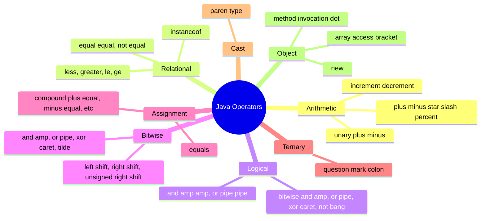

# 1.3. Operators Expressions and Control Flow

## Overview

Once you have variables and values, you need a way to combine them into **expressions** (which produce values) and to decide **which code runs next** based on those values. Java provides a rich set of operators, drawn largely from C and C++, plus a handful of modern additions such as the diamond operator, the `instanceof` pattern, and the `switch` expression with pattern matching. Operators build expressions; expressions form statements; statements are organized into blocks; and control flow constructs (`if`, `switch`, `for`, `while`, `do while`, enhanced `for`, `break`, `continue`, `return`, `throw`) decide which statements execute, in what order, and how many times.

This note walks through every operator category in Java, explains how the compiler parses and type checks expressions (operator precedence and associativity), and then covers the full control flow toolkit including Java 21's pattern matching `switch`. We pay special attention to the rules that surprise developers: integer division truncates toward zero, the modulus result has the sign of the dividend, short circuit operators skip the right operand, `==` on references compares identity not equality, the `+` operator is overloaded for `String` concatenation, and floating point equality is almost never what you want. We also cover labeled break and continue, the enhanced `for` loop's hidden `Iterator` desugaring, the new `switch` expression's exhaustiveness rules, and the guarded `case` labels introduced in Java 21.

By the end of this note you should be able to read a complex Java expression and predict its type and value without running the code, write control flow that is correct on the first attempt, choose between `if` cascades and `switch` expressions, and avoid the common pitfalls that cause production incidents.

## Background Knowledge

A few foundational ideas will help:

- **Expression vs statement.** An expression is a piece of code that has a type and produces a value when evaluated: `3 + 4`, `Math.max(a, b)`, `obj instanceof String`. A statement is a complete unit of execution: `int x = 3 + 4;`, `if (x > 0) doSomething();`, `return x;`. Some constructs are both: an assignment `x = 5` is an expression of type `int` with value 5, and an expression statement is an expression followed by a semicolon.
- **Operator precedence** determines which operator binds tighter when several appear without parentheses. For example, `*` binds tighter than `+`, so `2 + 3 * 4` is `14`, not `20`.
- **Associativity** determines the order of evaluation when operators of the same precedence appear in a chain. Most binary operators are left associative: `10 - 3 - 2` is `(10 - 3) - 2 = 5`, not `10 - (3 - 2) = 9`. Assignment is right associative: `a = b = c` is `a = (b = c)`.
- **Short circuit evaluation.** `&&` and `||` evaluate their left operand first and skip the right operand if the result is already determined. `&` and `|` always evaluate both. This matters when the right operand has side effects or could throw.
- **Numeric promotion.** When binary operators combine operands of different numeric types, the narrower operand is promoted to the wider type before the operation. `5 + 3.0` promotes `5` to `double` and produces `8.0`. We cover this in depth in file 01.5.
- **Truthiness.** Unlike C, JavaScript, and Python, Java has no truthiness: a `boolean` value is required for `if`, `while`, and the operands of `&&` and `||`. An `int` cannot be used as a condition. This eliminates the classic `if (x = 5)` bug.

## Operator Categories



## Arithmetic Operators

The basic arithmetic operators are `+`, `-`, `*`, `/`, `%`, plus unary `+` and `-`. They are defined for all numeric primitive types (`byte`, `short`, `int`, `long`, `float`, `double`, `char`) but with the **numeric promotion** rule: `byte` and `short` operands are promoted to `int`, and `char` is promoted to `int`. The result type is the promoted type of the operands.

```java
int a = 10, b = 3;
System.out.println(a + b);   // 13
System.out.println(a - b);   // 7
System.out.println(a * b);   // 30
System.out.println(a / b);   // 3 (integer division, truncates toward zero)
System.out.println(a % b);   // 1 (remainder)
System.out.println(-a);      // -10
```

Two crucial rules:

1. **Integer division truncates toward zero**, not toward negative infinity. `7 / 2 == 3`, `-7 / 2 == -3` (not -4). This matches C but differs from Python.
2. **The modulus result has the sign of the dividend.** `7 % 3 == 1`, `-7 % 3 == -1`, `7 % -3 == 1`. To always get a non negative remainder, use `Math.floorMod(a, b)`.

```java
System.out.println(-7 / 2);     // -3 (truncation toward zero)
System.out.println(-7 % 2);     // -1 (sign of dividend)
System.out.println(Math.floorMod(-7, 2));   // 1 (always non negative for positive divisor)
```

### Floating Point Arithmetic

Floating point arithmetic follows IEEE 754 rules. Division by zero does not throw; it produces infinity or NaN:

```java
double p = 1.0 / 0.0;     // Double.POSITIVE INFINITY
double n = -1.0 / 0.0;    // Double.NEGATIVE INFINITY
double z = 0.0 / 0.0;     // NaN
double inf = p + 1.0;     // still Infinity
double nan = z + 1.0;     // still NaN (NaN poisons everything)
System.out.println(nan == nan);   // false (NaN is not equal to itself)
System.out.println(Double.isNaN(nan));  // true
```

### String Concatenation with plus

The `+` operator is overloaded for `String`. If either operand of `+` is a `String`, the other is converted to its `String` representation and the two are concatenated. This is implemented by the compiler generating calls to `StringBuilder.append` (or `StringConcatFactory.makeConcatWithConstants` since Java 9, an invokedynamic based approach that lets the JVM pick the optimal strategy).

```java
String name = "Ada";
int age = 30;
String message = "Name: " + name + ", age: " + age;
// Equivalent to: new StringBuilder().append("Name: ").append(name).append(", age: ").append(age).toString()

// Pitfall: left to right associativity
System.out.println("Sum: " + 1 + 2);    // "Sum: 12" (concatenation)
System.out.println("Sum: " + (1 + 2));  // "Sum: 3" (arithmetic first)
System.out.println(1 + 2 + " is the sum"); // "3 is the sum" (arithmetic first because no String on the left yet)
```

The `+` operator with a `String` operand is the only operator overloading in the Java language. The designers chose this exception because string concatenation is so common that requiring `StringBuilder` everywhere would be painful.

### Increment and Decrement

`++` and `--` add or subtract 1 from a numeric variable. They come in two forms:

- **Prefix** (`++x`, `--x`): the value of the expression is the new value of `x`.
- **Postfix** (`x++`, `x--`): the value of the expression is the old value of `x`, and `x` is then updated.

```java
int x = 5;
int y = x++;   // y = 5, x = 6
int z = ++x;   // x = 7, z = 7
```

A classic confusion: `x = x++` leaves `x` unchanged. The expression `x++` evaluates to the old value of `x`, then `x` is incremented, then the assignment writes the old value back to `x`, undoing the increment. This is well defined in Java (unlike C where it is undefined behavior) but almost always indicates a bug.

```java
int x = 5;
x = x++;
System.out.println(x);   // 5, not 6
```

## Relational Operators

The relational operators are `==`, `!=`, `<`, `>`, `<=`, `>=`, and `instanceof`. All produce `boolean` results. The ordering operators (`<`, `>`, `<=`, `>=`) are defined only for numeric primitives. The equality operators (`==`, `!=`) are defined for all types but have very different semantics for primitives versus references.

```java
int a = 5, b = 10;
System.out.println(a < b);    // true
System.out.println(a >= b);   // false
System.out.println(a == 5);   // true (value comparison for primitives)
```

### Equality on References

For reference types, `==` compares references (identity), not the contents of the objects. Two distinct `String` objects that contain the same characters are not `==`.

```java
String s1 = "hello";
String s2 = "hello";
String s3 = new String("hello");
System.out.println(s1 == s2);           // true (string pool)
System.out.println(s1 == s3);           // false (different objects)
System.out.println(s1.equals(s3));      // true (content comparison)
```

The string pool is a JVM maintained pool of unique `String` literals. When you write `"hello"` twice in source code, both refer to the same pooled `String` object. Using `new String("hello")` always creates a fresh object on the heap, bypassing the pool. This is why **always use `.equals()` for `String` equality**.

### instanceof

The `instanceof` operator tests whether an object is an instance of a given type (a class, interface, array type, or sealed type pattern). It returns `true` if the object is non null and the runtime type is assignment compatible with the given type.

```java
Object obj = "hello";
if (obj instanceof String) {
    String s = (String) obj;   // safe cast after instanceof check
    System.out.println(s.length());
}

// Java 16+ pattern form (no separate cast needed)
if (obj instanceof String s) {
    System.out.println(s.length());
}

// Java 21+ pattern with guarded binding
if (obj instanceof String s && s.length() > 3) {
    System.out.println(s.toUpperCase());
}
```

The pattern form `obj instanceof String s` combines the type check and the variable binding. The variable `s` is in scope where the pattern matching succeeds, which is determined by flow analysis. This eliminates the boilerplate of casting after an `instanceof` check.

## Logical and Bitwise Operators

Java has both short circuit logical operators (`&&`, `||`) and non short circuit bitwise operators (`&`, `|`, `^`). The bitwise operators also apply to integer types as bit level operations.

### Short Circuit Logical Operators

`&&` and `||` evaluate their left operand first. If the result is already determined (false for `&&`, true for `||`), the right operand is not evaluated.

```java
if (obj != null && obj.length() > 0) {   // safe: length() only called if obj is non null
    // ...
}

boolean enabled = config != null && config.isEnabled();

// Common short circuit pattern
if (index < array.length && array[index] == target) {
    // safe access
}
```

Always prefer `&&` and `||` over `&` and `|` for boolean logic. The only reason to use `&` and `|` is when you specifically need both sides to be evaluated (rare) or for bit operations.

### Bitwise Operators on Integers

For integer types, `&`, `|`, `^`, and `~` perform bit level operations:

```java
int a = 0b1100;   // 12
int b = 0b1010;   // 10
System.out.println(Integer.toBinaryString(a & b));   // 1000 (AND)
System.out.println(Integer.toBinaryString(a | b));   // 1110 (OR)
System.out.println(Integer.toBinaryString(a ^ b));   // 0110 (XOR)
System.out.println(Integer.toBinaryString(~a));      // ...11110011 (NOT, two's complement)
```

### Shift Operators

Java has three shift operators:

- `<<` left shift: shifts bits left, filling with zeros. Equivalent to multiplying by 2 (for small shifts).
- `>>` signed right shift: shifts bits right, filling with the sign bit. Equivalent to dividing by 2 (rounding toward negative infinity).
- `>>>` unsigned right shift: shifts bits right, filling with zeros regardless of sign.

```java
int x = 1 << 4;        // 16
int n = -8;
System.out.println(n >> 1);    // -4 (sign extension)
System.out.println(n >>> 1);   // 2147483644 (zero fill)
```

Shift count is masked to the low 5 bits for `int` (so `x << 32 == x << 0 == x`) and low 6 bits for `long`. This surprises people who expect shifting by 32 to produce 0.

```java
int x = 1;
System.out.println(x << 32);   // 1, not 0 (shift count masked to 0)
System.out.println(x << 31);   // Integer.MIN VALUE
```

A common pattern for combining flags is bitwise OR, and for checking flags is bitwise AND:

```java
public static final int READ = 1;
public static final int WRITE = 2;
public static final int EXECUTE = 4;

int permissions = READ | WRITE;
boolean canWrite = (permissions & WRITE) != 0;
```

## Assignment Operators

The simple assignment `=` assigns the value of the right operand to the variable on the left. Compound assignment operators (`+=`, `-=`, `*=`, `/=`, `%=`, `&=`, `|=`, `^=`, `<<=`, `>>=`, `>>>=`) combine an operation with an assignment. They look like syntactic sugar but have a subtle behavior: they include an **implicit cast** back to the left operand's type.

```java
byte b = 10;
b = b + 5;       // COMPILE ERROR: b + 5 is int, cannot assign to byte
b += 5;          // OK: equivalent to b = (byte)(b + 5)
```

This implicit cast is convenient but can silently lose data:

```java
byte b = 100;
b += 100;        // No error, but b becomes (byte)200 = -56
```

The right side of an assignment is always evaluated before the left side is written. The left operand must be a variable (a "lvalue"), not an arbitrary expression.

Assignment is right associative, so chained assignments work:

```java
int a, b, c;
a = b = c = 5;   // equivalent to a = (b = (c = 5))
```

## Ternary Conditional Operator

The ternary operator `condition ? valueIfTrue : valueIfFalse` is the only Java operator that takes three operands. It is a compact alternative to `if else` when both branches produce values.

```java
int max = (a > b) ? a : b;
String sign = (x >= 0) ? "non negative" : "negative";
```

The type of the expression is the **common type** of the two branches, determined by numeric promotion and reference type unification rules. If one branch is `int` and the other is `double`, the result is `double`. If one is `String` and the other is a primitive, the primitive is boxed or stringified depending on context.

A subtle case: the ternary always evaluates exactly one of the two branches, never both.

```java
int x = 5;
String result = (x > 0) ? "positive" : throwException();   // Java 14+: throw expressions in ternary
```

Ternary chains are legal but quickly unreadable:

```java
String grade = score >= 90 ? "A" : score >= 80 ? "B" : score >= 70 ? "C" : "F";
```

Prefer a `switch` expression or a lookup table for more than two cases.

## Cast Operator

The cast operator `(Type)` explicitly converts a value from one type to another. It is required when the conversion would not happen implicitly (narrowing primitive conversion or downcasting references). The cast tells the compiler "I know what I am doing; trust me." At runtime, the JVM verifies the cast for reference types and throws `ClassCastException` if it fails.

```java
double d = 3.99;
int i = (int) d;            // 3 (truncation toward zero)
int rounded = (int) Math.round(d);   // 4

Object obj = "hello";
String s = (String) obj;    // OK at runtime
Integer n = (Integer) obj;  // ClassCastException at runtime
```

Casts have high precedence, so `(int) d + 1` is `((int) d) + 1`. Use parentheses when in doubt.

## Operator Precedence and Associativity

Java has 15 levels of operator precedence. In practice, you should use parentheses whenever the order is not obvious; relying on memorized precedence is a recipe for bugs. The full table, from highest to lowest precedence:

| Level | Operators | Associativity |
|-------|-----------|---------------|
| 1 | `()`, `[]`, `.`, method call | left to right |
| 2 | `!`, `~`, unary `+`/`-`, `++`, `--`, cast | right to left |
| 3 | `*`, `/`, `%` | left to right |
| 4 | `+`, `-` (binary) | left to right |
| 5 | `<<`, `>>`, `>>>` | left to right |
| 6 | `<`, `>`, `<=`, `>=`, `instanceof` | left to right |
| 7 | `==`, `!=` | left to right |
| 8 | `&` | left to right |
| 9 | `^` | left to right |
| 10 | `|` | left to right |
| 11 | `&&` | left to right |
| 12 | `||` | left to right |
| 13 | `?:` (ternary) | right to left |
| 14 | `->` (lambda) | right to left |
| 15 | `=`, `+=`, `-=`, `*=`, etc. | right to left |

A few rules of thumb cover 95% of real code:

- `*`, `/`, `%` bind tighter than `+`, `-`
- Arithmetic binds tighter than comparisons
- Comparisons bind tighter than `&&`, which binds tighter than `||`
- `?:` and assignment are right associative
- Cast binds tighter than arithmetic

```java
boolean ok = a + b == c && d != 0 || e > f;
// Parsed as: ((a + b) == c) && (d != 0)) || (e > f)
// Always write this with parentheses anyway
boolean ok2 = ((a + b) == c && d != 0) || (e > f);
```

## Control Flow

Java provides the standard structured programming constructs: `if else`, `switch`, `while`, `do while`, `for`, enhanced `for`, plus `break`, `continue`, `return`, and `throw`. Each has its own rules and idioms.

### if else

The `if` statement evaluates a `boolean` expression and executes a block if true. An optional `else if` chain handles multiple conditions, and an optional `else` handles the default case.

```java
if (score >= 90) {
    grade = "A";
} else if (score >= 80) {
    grade = "B";
} else if (score >= 70) {
    grade = "C";
} else {
    grade = "F";
}
```

The braces are technically optional when the body is a single statement, but **always use braces** even for one statement bodies. This prevents the classic Apple `goto fail` bug where an unbraced `if` body followed by an indented line caused a security vulnerability.

```java
// BAD: omitting braces is dangerous
if (condition)
    doSomething();
    doAnotherThing();   // ALWAYS runs, indentation is misleading

// GOOD: always use braces
if (condition) {
    doSomething();
    doAnotherThing();   // only runs if condition is true
}
```

### switch Statements and Expressions

The `switch` statement has been part of Java since version 1.0. Java 14 introduced the **switch expression** form, and Java 21 finalized **pattern matching switch** with type patterns, guarded labels, and exhaustiveness checking.

Classic switch statement (fall through):

```java
switch (day) {
    case MONDAY:
    case FRIDAY:
    case SUNDAY:
        System.out.println("Slow day");
        break;
    case TUESDAY:
        System.out.println("Busy");
        break;
    default:
        System.out.println("Normal");
        break;
}
```

The `break` is required to prevent fall through to the next case. Forgetting `break` is one of the most common Java bugs, which is why modern Java offers arrow style labels that do not fall through.

Java 14+ switch expression:

```java
String label = switch (day) {
    case MONDAY, FRIDAY, SUNDAY -> "Slow day";
    case TUESDAY -> "Busy";
    default -> "Normal";
};
```

The arrow form `->` does not fall through, no `break` is needed, and the value to the right of the arrow is the value of the expression. Multiple values can be combined with commas.

Java 21 pattern matching switch with type patterns and guards:

```java
String describe(Object obj) {
    return switch (obj) {
        case null -> "null";
        case Integer i when i > 0 -> "positive integer: " + i;
        case Integer i -> "non positive integer: " + i;
        case String s -> "string of length " + s.length();
        case int[] arr -> "int array of length " + arr.length;
        default -> "something else";
    };
}
```

Key features of pattern matching switch:

- A `null` case is required to handle null inputs (otherwise switch throws `NullPointerException` on null).
- `case Integer i` binds `i` to the value if it is an `Integer`.
- `when` introduces a guard (a boolean expression that must also be true).
- The compiler checks **exhaustiveness**: if a sealed type or a known set of types is being matched, all cases must be covered (or a `default`).
- Switch expressions must produce a value on every path; if you use the block form with `yield`, you must yield in every branch.

```java
int len(Object obj) {
    return switch (obj) {
        case String s -> s.length();
        case int[] arr -> arr.length;
        case null, default -> 0;
    };
}
```

Switch works on `byte`, `short`, `int`, `char`, their wrapper types, `String` (since Java 7), enum types, and (in pattern form) any reference type with type patterns. Long, float, and double are not allowed.

### while and do while

`while` repeatedly executes a block as long as a condition is true. The condition is checked before each iteration; if it starts false, the body never executes.

```java
int n = 100;
while (n > 0) {
    n = n / 2;
}
// n is 0
```

`do while` checks the condition after the body; the body always runs at least once:

```java
String line;
do {
    line = reader.readLine();
    if (line != null) {
        process(line);
    }
} while (line != null);
```

`do while` is rarer than `while` but useful for "read, then check" patterns. The trailing semicolon is required.

### for Loops

The classic `for` loop has three parts: initialization, condition, and update. Each is optional.

```java
for (int i = 0; i < 10; i++) {
    System.out.println(i);
}

// Multiple variables
for (int i = 0, j = 10; i < j; i++, j--) {
    System.out.println(i + " " + j);
}

// Infinite loop
for (;;) {
    if (shouldStop()) break;
}

// Empty body, all work in update
for (int i = 0; i < 10; System.out.println(i++));
```

The variables declared in the initialization are scoped to the loop body and disappear after it.

### Enhanced for Loop

The enhanced `for` (sometimes called the for each loop) iterates over arrays and any `Iterable`. The compiler desugars it differently for arrays (indexed loop) and iterables (explicit `Iterator`).

```java
int[] nums = {1, 2, 3, 4, 5};
for (int n : nums) {
    System.out.println(n);
}

List<String> names = List.of("Alice", "Bob", "Carol");
for (String name : names) {
    System.out.println(name);
}
```

The iterable form is roughly equivalent to:

```java
for (Iterator<String> it = names.iterator(); it.hasNext(); ) {
    String name = it.next();
    System.out.println(name);
}
```

The enhanced for cannot:
- Access the index of the current element (use a classic `for` if you need it)
- Modify the underlying collection (no `it.remove()`)
- Iterate two collections in parallel (use a classic `for` with index, or zip them)

### break and continue

`break` exits the innermost loop or switch immediately. `continue` skips the rest of the current iteration and proceeds to the next.

```java
for (int i = 0; i < 100; i++) {
    if (i % 2 == 0) continue;   // skip even numbers
    if (i > 50) break;          // stop at 50
    System.out.println(i);
}
```

Java also supports **labeled** break and continue, which can target an outer loop. This is useful for nested search loops:

```java
outer:
for (int i = 0; i < matrix.length; i++) {
    for (int j = 0; j < matrix[i].length; j++) {
        if (matrix[i][j] == target) {
            System.out.println("Found at " + i + ", " + j);
            break outer;
        }
    }
}
```

Labels are placed before a loop with a colon. `break outer` exits the labeled loop; `continue outer` skips to the next iteration of the labeled loop. Labels are rare in idiomatic Java; some teams ban them, preferring `return` from a helper method.

### return

`return` exits a method, optionally producing a value. A `void` method uses `return;` with no value. A method with a non void return type must `return` a value on every possible path; the compiler enforces this.

```java
public int factorial(int n) {
    if (n < 0) throw new IllegalArgumentException("negative");
    if (n <= 1) return 1;
    return n * factorial(n - 1);
}
```

Early return is fine in Java; modern style favors small methods with multiple returns over a single return at the end with deep nesting.

### throw

`throw` raises an exception, immediately unwinding the call stack until a matching `catch` is found. We cover exceptions in depth in Phase 5, but it is worth noting here that `throw` is a control flow mechanism that can jump out of any method.

```java
if (input == null) {
    throw new IllegalArgumentException("input must not be null");
}
```

Since Java 14, throw can appear in a switch expression's arrow:

```java
String name = switch (type) {
    case A -> "Alpha";
    case B -> "Beta";
    default -> throw new IllegalArgumentException("Unknown type: " + type);
};
```

## Expressions vs Statements

The Java Language Specification distinguishes **expressions** (which produce values) from **statements** (which execute). An **expression statement** is an expression followed by a semicolon, but only certain kinds of expressions can be used as statements:

- Assignments (`x = 5;`)
- Increment and decrement (`x++;`, `--x;`)
- Method invocations (`System.out.println("hi");`)
- Object creation (`new Foo();`)

A bare arithmetic expression like `5 + 3;` is **not** a valid statement; the compiler rejects it because it has no effect. This is a deliberate choice to prevent useless computations left in code by mistake.

```java
5 + 3;          // COMPILE ERROR: not a statement
x + 1;          // COMPILE ERROR: not a statement
Math.random();  // COMPILE ERROR: not a statement (no side effect, value discarded)
```

Some expressions have side effects and can be promoted to statements by adding a semicolon. The compiler only allows those with side effects.

## Common Pitfalls

- **Integer division.** `7 / 2 == 3` and `-7 / 2 == -3` (truncation toward zero). To get a decimal result, cast one operand: `(double) 7 / 2 == 3.5`.
- **Modulus sign.** `-7 % 3 == -1`. Use `Math.floorMod(-7, 3) == 2` for always non negative remainders.
- **Floating point equality.** `0.1 + 0.2 != 0.3` in `double`. Use `Math.abs(a - b) < 1e-9` or `BigDecimal`.
- **String concatenation precedence.** `"Value: " + 1 + 2` produces `"Value: 12"` because `+` is left associative. Use parentheses: `"Value: " + (1 + 2)`.
- **`==` on strings.** Compares references, not contents. Always use `.equals()` or `.equalsIgnoreCase()`.
- **Missing `break` in switch.** Causes fall through. Use arrow form `->` (Java 14+) to avoid this entirely.
- **Forgetting `default` in switch.** If a value not covered by any case appears, the switch silently does nothing. Add a `default` that throws or logs.
- **Unbraced `if` bodies.** Always use braces even for one statement, to prevent the "goto fail" bug.
- **`x = x++` leaves `x` unchanged.** The post increment evaluates to the old value, then `x` is incremented, then the old value is assigned back, undoing the increment.
- **Bitwise vs logical operators.** `&` and `|` always evaluate both operands, even for booleans. Use `&&` and `||` for short circuit evaluation.
- **Shift count masking.** `x << 32` does not produce 0; it produces `x` because the shift count is masked to 5 bits (for int) or 6 bits (for long).
- **Ternary null pointer.** `cond ? null : 5` triggers autoboxing and unboxing that can produce surprising `NullPointerException`s when one branch is a primitive and the other is `null`.
- **`instanceof` with null.** `null instanceof X` is always `false`; no `NullPointerException` is thrown.
- **Compound assignment silent overflow.** `b += 100` for a `byte b = 100` does not throw; it silently truncates. Use explicit arithmetic with `Math.addExact` if you want overflow checking.
- **Forgetting `do while` semicolon.** `do { ... } while (cond)` requires the trailing semicolon; forgetting it produces a confusing compile error.
- **Modifying collection during enhanced for.** Throws `ConcurrentModificationException`. Use `Iterator.remove()` explicitly.
- **Using switch on long, float, or double.** Not allowed. Convert to int, use an enum, or use if else.
- **Switch expression non exhaustiveness.** Pattern matching switch on a sealed type must cover all permitted subtypes or have a `default`, otherwise compilation fails.
- **Captured local in lambda must be effectively final.** A variable referenced from a lambda cannot be reassigned.

## Tips and Tricks

- Use the **arrow form of switch** (`->`) wherever possible. It eliminates the fall through bug and is more concise.
- Use **pattern matching switch** (Java 21) to replace `instanceof` chains. It is more readable and the compiler checks exhaustiveness.
- Prefer **enhanced for** over indexed for whenever you do not need the index. It is less error prone.
- Use **`Math.addExact`** and friends in security sensitive code to fail loudly on overflow.
- Use **`Math.floorMod`** for non negative modulo (useful for circular buffers, hash bucketing).
- Use **labeled break** sparingly for nested search loops; prefer extracting the search into a helper method and using `return`.
- Use **early return** to flatten nested `if` logic. The "guard clause" pattern is more readable than deep nesting.
- For combining flags, use **`EnumSet`** instead of int bit masks. It is type safe and the JIT compiles it to bit operations internally.
- Use **`Objects.equals(a, b)`** for null safe equality on references.
- Use **`Integer.compare(a, b)`** instead of `a - b` in comparators. Subtraction can overflow for extreme values: `Integer.MIN VALUE - Integer.MAX VALUE` is positive.
- Use **parentheses liberally**. They cost nothing at runtime and make precedence explicit to readers.
- Use **`var`** (Java 10+) in for loops to reduce verbosity: `for (var entry : map.entrySet())`.
- For decimal money math, prefer `BigDecimal` over `double` from the start; retrofitting later is painful.
- Use **`switch` expressions for factory methods**: `static Shape create(ShapeType t) { return switch (t) { case CIRCLE -> new Circle(); case SQUARE -> new Square(); }; }`
- Use **`yield`** in block style switch expressions to produce a value from a multi statement case.
- For infinite loops, use `while (true)` rather than `for (;;)`; both compile to the same bytecode but `while (true)` is more readable.
- The **`+` operator on `String`** is fine for a small number of concatenations. For loops building a string, use `StringBuilder` explicitly.

## Interview Questions

**Q1: What is the difference between `==` and `.equals()`?**
A: `==` compares references (identity) for objects, and values directly for primitives. `.equals()` is a method defined on `Object` that compares by content (equality) when overridden. For `String`, `==` returns `true` only when both references point to the same `String` object (often due to string pooling), while `.equals()` returns `true` when the character sequences are identical. Always use `.equals()` for `String` content comparison.

**Q2: What is short circuit evaluation? Give an example.**
A: `&&` and `||` evaluate the left operand first. If the result is already determined (false for `&&`, true for `||`), the right operand is not evaluated. Example: `if (obj != null && obj.length() > 0)` avoids a `NullPointerException` because `obj.length()` is only called when `obj` is non null. The non short circuit operators `&` and `|` always evaluate both operands.

**Q3: What is the result of `7 / 2` and `-7 / 2` in Java?**
A: Both `3` and `-3`. Integer division truncates toward zero, not toward negative infinity. Use `Math.floorDiv(-7, 2)` to get `-4` (floor division).

**Q4: What is `7 % 3`, `-7 % 3`, and `7 % -3` in Java?**
A: `1`, `-1`, and `1`. The modulus result has the sign of the dividend. Use `Math.floorMod(-7, 3)` to get `2`, which is always non negative for positive divisor.

**Q5: Why does `"Value: " + 1 + 2` produce `"Value: 12"`?**
A: The `+` operator is left associative. The first evaluation is `"Value: " + 1`, which produces the string `"Value: 1"`. Then `"Value: 1" + 2` produces `"Value: 12"`. To get `"Value: 3"`, use parentheses: `"Value: " + (1 + 2)`.

**Q6: What is the difference between `++x` and `x++`?**
A: Both increment `x` by 1. The prefix form `++x` evaluates to the new value of `x`. The postfix form `x++` evaluates to the old value of `x`, then increments. So `int y = x++` assigns the old value to `y`, while `int y = ++x` assigns the new value.

**Q7: What does `x = x++` do?**
A: It leaves `x` unchanged. The expression `x++` evaluates to the old value of `x`, then `x` is incremented, then the old value is assigned back to `x`, undoing the increment. This is well defined in Java (unlike C, where it is undefined behavior) but almost always indicates a bug.

**Q8: What is the difference between `>>` and `>>>`?**
A: `>>` is the signed right shift, which fills with the sign bit (preserving the sign of the value). `>>>` is the unsigned right shift, which fills with zeros regardless of sign. So `-8 >> 1` is `-4`, but `-8 >>> 1` is a large positive number.

**Q9: What does `x << 32` produce for an int?**
A: It produces `x`, not 0. The shift count for an int is masked to the low 5 bits, so `<< 32` is the same as `<< 0`. For long, the shift count is masked to 6 bits, so `<< 64` is also a no op.

**Q10: What is the result of `0.1 + 0.2 == 0.3` in Java?**
A: `false`. The doubles `0.1` and `0.2` cannot be represented exactly in binary, so their sum is `0.30000000000000004`, which is not equal to `0.3`. Use `BigDecimal` or epsilon based comparison.

**Q11: What is the difference between `&` and `&&`?**
A: `&` always evaluates both operands; `&&` short circuits, evaluating the right operand only if the left is true. For boolean logic, prefer `&&` and `||`. For bit level operations on integers, use `&`, `|`, `^`, `~`.

**Q12: Why does the compiler reject `b = b + 5` for a byte, but accept `b += 5`?**
A: `b + 5` promotes `b` to int (numeric promotion), and the result is int, which cannot be assigned to a byte without an explicit cast. `b += 5` is a compound assignment that includes an implicit cast back to the left operand's type: it is equivalent to `b = (byte)(b + 5)`.

**Q13: What is fall through in a switch, and how is it avoided?**
A: Fall through is when execution continues from one case label to the next without a `break`. It is the default behavior in classic switch statements. To avoid it, use `break` at the end of each case, or use the arrow form `->` introduced in Java 14, which never falls through.

**Q14: What is the difference between a switch statement and a switch expression?**
A: A switch statement executes code but does not produce a value. A switch expression (since Java 14, standard in Java 17) produces a value and can be assigned to a variable or used in a larger expression. Switch expressions must be exhaustive (cover all cases or have a default), and use either arrow form `-> value` or block form with `yield`.

**Q15: What is pattern matching switch?**
A: A Java 21 feature that allows `case` labels to match types and bind variables: `case Integer i -> ...`. It supports `null` cases, guarded patterns with `when`, and exhaustiveness checking for sealed types. It eliminates boilerplate `instanceof` checks and casts.

**Q16: What is the result of `null instanceof String`?**
A: `false`. The `instanceof` operator never throws `NullPointerException`; it returns `false` for null operands.

**Q17: Why does `5 + 3;` not compile as a statement?**
A: Because Java only allows expressions with side effects to be used as statements. The expressions allowed as statements are assignments, increment/decrement, method invocations, and object creation. A bare arithmetic expression has no side effect, so the compiler rejects it.

**Q18: What is a labeled break?**
A: A `break` followed by a label that targets an enclosing loop, causing exit from that outer loop. Example: `outer: for (...) { for (...) { if (found) break outer; } }`. Labels are rare in idiomatic Java; some teams prefer extracting the search into a helper method and using `return`.

**Q19: Can a `switch` work on `long`, `float`, or `double`?**
A: No. Switch works on `byte`, `short`, `int`, `char`, their wrapper types, `String` (since Java 7), enum types, and (in pattern form) any reference type. For `long`, `float`, or `double`, use `if else` or convert to an enum.

**Q20: What is `Math.addExact`?**
A: A method (since Java 8) that adds two ints or longs and throws `ArithmeticException` if overflow occurs. Useful in security sensitive code where silent overflow would be a bug. Similar methods exist for subtract, multiply, increment, and negate.

## Summary

Java's operator and control flow toolkit is large but coherent. Operators build expressions, which combine values via arithmetic, relational, logical, bitwise, assignment, ternary, cast, and instanceof operations. Operator precedence and associativity determine parsing; parentheses override both. The compiler type checks each expression and performs numeric promotion to unify operand types. The control flow constructs (`if else`, `switch`, `while`, `do while`, `for`, enhanced `for`, `break`, `continue`, `return`, `throw`) decide which statements run, in what order, and how many times. Java 14 added the switch expression form, and Java 21 added pattern matching switch with type patterns, guarded cases, and exhaustiveness checking.

The most important practical lessons are: always use `.equals()` for string content equality; prefer `&&` and `||` over `&` and `|` for boolean logic; remember that integer division truncates toward zero and modulus takes the sign of the dividend; remember that floating point cannot represent most decimals exactly and `==` on doubles is almost always wrong; always use braces around `if` bodies; prefer the arrow form of switch to avoid the fall through bug; use pattern matching switch for type based dispatch; and use `Math.*Exact` for overflow checked integer math. With these foundations, you can write Java control flow that is correct, readable, and maintainable, and you are well prepared to study methods, packages, and imports in the next note.
