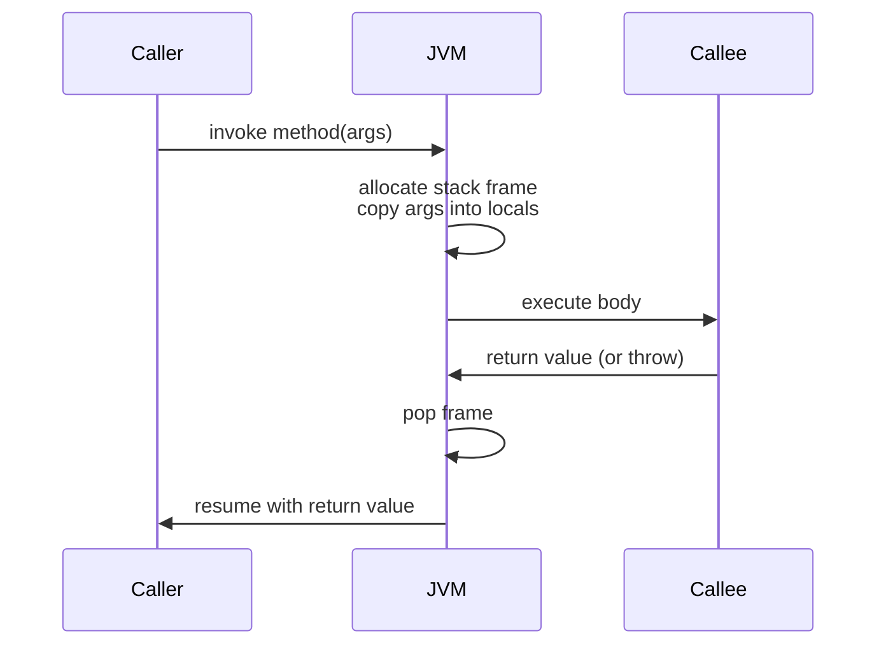
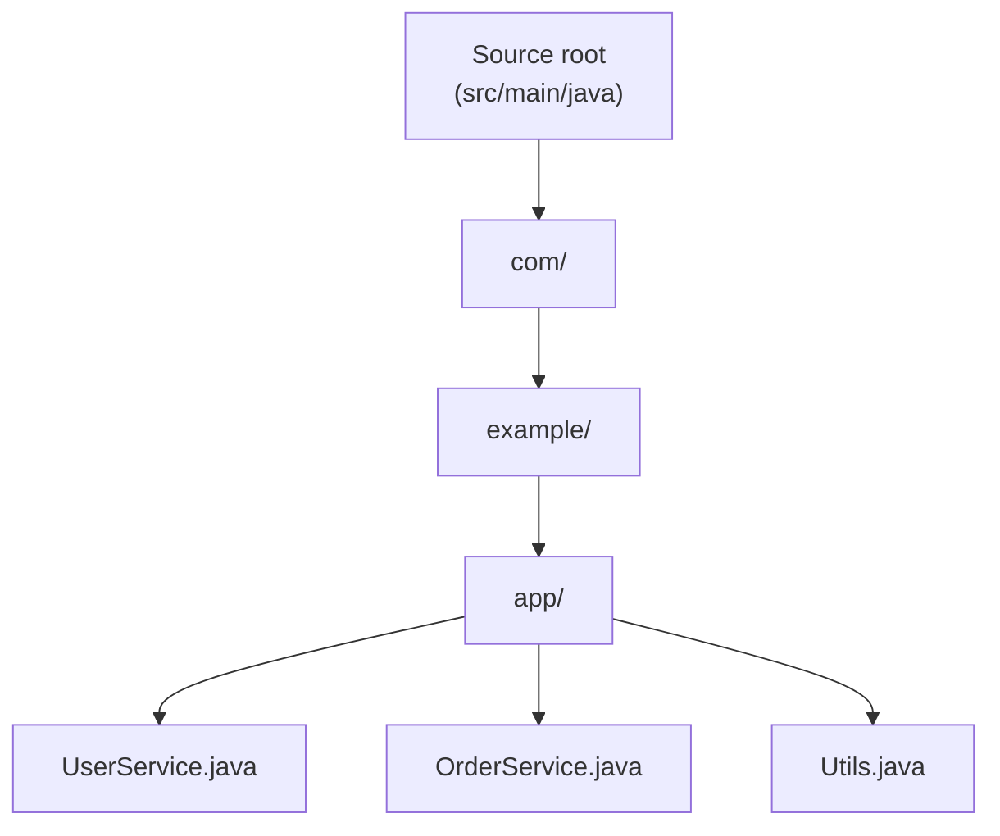

# 1.4. Methods Packages and Imports

## Overview

A Java program of any meaningful size is not a single block of code; it is a network of **methods** (named blocks of executable code) grouped into **classes**, which are themselves grouped into **packages** (named namespaces), which can be aggregated and reused across files through **imports**. Methods are the smallest reusable unit of behavior in Java. Packages are the language's way of organizing classes into namespaces, preventing name collisions, and signaling architectural layers (controllers in one package, repositories in another, models in a third). Imports are how a source file declares which classes from other packages it intends to use, so that you can write `List` instead of `java.util.List` everywhere.

This note covers the full lifecycle of methods: declaration, signature, parameters, arguments, return types, overloading, varargs, recursion, and the JVM stack frame that hosts each invocation. It then covers packages: declaration, the directory structure that mirrors them, naming conventions, and how the JVM finds classes via the classpath. Finally, it covers imports: single type imports, on demand imports, static imports, and the rare conflicts that arise. It also introduces the Java Platform Module System (JPMS) added in Java 9, which sits above packages and provides stronger encapsulation and reliable configuration.

A solid understanding of methods, packages, and imports is essential because every Java program you write uses them constantly. Misunderstanding method overloading resolution, the difference between parameters and arguments, the visibility rules between packages, or the way imports interact with the classpath will cause confusing compile errors and runtime failures. By the end of this note you should be able to design method signatures that read like prose, choose between overloading and renaming, structure packages for clarity, and use imports to keep your source files readable without sacrificing precision.

## Background Knowledge

Before diving in, recall a few foundational ideas:

- **Compilation unit.** A `.java` file is a compilation unit. It can contain at most one public top level class (whose name matches the file name) and any number of package private top level classes.
- **Classpath.** A list of directories and JAR files that the JVM searches when loading classes at runtime. The `java` and `javac` commands accept `-cp` (or `-classpath`) to set it. Directories are interpreted as the roots of package hierarchies; JARs are treated as a single root.
- **Visibility.** Java has four access levels: `public` (visible everywhere), `protected` (visible within the package and to subclasses), package private (visible only within the same package, the default if no modifier is given), and `private` (visible only within the same class). See file 02.6 for a deep dive.
- **Static vs instance.** A `static` method belongs to the class itself and is invoked without an instance. An instance method belongs to an object and is invoked through a reference. Static methods cannot directly access instance fields or call instance methods without an explicit instance reference.
- **Stack frame.** Each method invocation creates a stack frame containing local variables, the operand stack, and a reference to the calling frame. When the method returns, the frame is popped.

## Methods

A **method** is a named, parameterized block of code that can be invoked from elsewhere. Methods are the primary abstraction mechanism in procedural and object oriented programming: they encapsulate behavior, give it a name, allow it to be parameterized, and allow it to be reused.

### Method Declaration

A method declaration consists of modifiers, a return type, a name, a parameter list, an optional throws clause, and a body. The general form is:

```
modifiers returnType name(parameterList) throws exceptionList {
    // body
}
```

For example:

```java
public static int add(int a, int b) {
    return a + b;
}
```

The pieces:

- **Modifiers**: `public`, `protected`, `private`, package private (no modifier), plus `static`, `final`, `synchronized`, `native`, `abstract`, `strictfp`. We cover access modifiers in Phase 2.
- **Return type**: the type of value the method produces, or `void` if it produces none. A method with a non void return type must `return` a value on every path; the compiler enforces this.
- **Name**: an identifier following Java's rules (letters, digits, dollar sign, and the underscore character, not starting with a digit). By convention, method names are verbs in lowerCamelCase: `add`, `computeTotal`, `isValid`.
- **Parameter list**: zero or more `Type name` pairs, comma separated. Even with zero parameters, the parentheses are required.
- **throws clause**: a list of checked exception types the method may throw. Modern style avoids `throws` for runtime exceptions.
- **Body**: the statements to execute. Abstract and native methods have no body (just a semicolon).

### Method Signature

A method's **signature** is its name plus the types of its parameters, in order. The return type, modifiers, throws clause, and parameter names are **not** part of the signature. Two methods in the same class cannot have the same signature; this is what allows overloading (multiple methods with the same name but different parameter lists).

```java
public class MathUtils {
    public int add(int a, int b) { return a + b; }
    public int add(int a, int b, int c) { return a + b + c; }    // different arity, OK
    public double add(double a, double b) { return a + b; }      // different types, OK
    // public long add(int x, int y) { ... }   // COMPILE ERROR: same signature as add(int, int)
}
```

The JVM uses a slightly broader notion of signature that includes the return type (the "method descriptor"), but the Java language uses the source level signature (without return type) for overload resolution.

### Parameters and Arguments

A **parameter** is the variable declared in the method signature. An **argument** is the value passed to the method at the call site. The distinction matters in discussions of pass by value:

```java
public void reset(int counter) {     // counter is a parameter
    counter = 0;
}

int x = 5;
reset(x);                            // x is the argument
System.out.println(x);              // 5  (unchanged: Java is pass by value)
```

Java is strictly **pass by value**. For primitive arguments, the value (the bits) is copied into the parameter. For reference arguments, the value (the reference, an address) is copied. Reassigning the parameter inside the method does not change the caller's variable, but mutating the object the parameter points to is visible to the caller:

```java
public void addItem(List<String> list, String item) {
    list.add(item);                 // mutation visible to caller
    list = new ArrayList<>();       // reassigning the parameter has no effect on caller
}

List<String> names = new ArrayList<>();
addItem(names, "Alice");
System.out.println(names);          // [Alice]
```

The same rule applies to arrays: passing an array reference lets the method mutate the array's elements, but reassigning the parameter does not affect the caller's array variable.

### Return Types

A method's return type can be:

- A primitive type (`int`, `double`, etc.)
- A reference type (a class, interface, array, or type variable)
- `void`, meaning the method returns no value
- A covariant return type (since Java 5): a subclass can override a method to return a more specific type than the parent

```java
class Animal { Animal reproduce() { return new Animal(); } }
class Dog extends Animal { @Override Dog reproduce() { return new Dog(); } }  // covariant
```

A `void` method can use `return;` to exit early. A non void method must `return expression;` on every possible execution path; the compiler performs flow analysis to enforce this.

Since Java 16, methods can also return records and sealed types, which interact nicely with pattern matching switch.

### Method Overloading

**Overloading** is when a class has multiple methods with the same name but different parameter lists. The compiler chooses the most specific applicable method at compile time using a three phase algorithm:

1. **Phase 1**: try to find a method without boxing or unboxing or varargs.
2. **Phase 2**: try to find a method allowing boxing or unboxing.
3. **Phase 3**: try to find a method allowing varargs.

If multiple methods are applicable in the same phase, the most specific one is chosen. Specificity is determined by whether one method's parameter types are all assignable to the corresponding types of another. If no method is most specific, the call is ambiguous and the compiler rejects it.

```java
public class Printer {
    public void print(int x) { System.out.println("int: " + x); }
    public void print(long x) { System.out.println("long: " + x); }
    public void print(Integer x) { System.out.println("Integer: " + x); }
    public void print(int... xs) { System.out.println("varargs: " + Arrays.toString(xs)); }

    // new Printer().print(5);   // calls print(int)
    // new Printer().print(5L);  // calls print(long)
    // new Printer().print();    // calls print(int...) with empty array
}
```

Overloading is resolved at compile time based on the **static types** of the arguments, not the runtime types. This is different from overriding, which is resolved at runtime based on the actual object type.

```java
public class A { public void m(Object o) { System.out.println("A.m(Object)"); } }
public class B extends A { public void m(String s) { System.out.println("B.m(String)"); } }

A obj = new B();
obj.m("hello");   // prints "A.m(Object)" because static type is A, no override of m(Object)
```

This surprising behavior is one reason many teams prefer to avoid overloading across inheritance boundaries.

### varargs

**Variable arity methods** (varargs), introduced in Java 5, allow a method to accept zero or more arguments of a fixed type. The syntax is `Type... name`, and the parameter is treated as an array inside the method:

```java
public int sum(int... values) {
    int total = 0;
    for (int v : values) {
        total += v;
    }
    return total;
}

sum();              // values is int[0]
sum(1, 2, 3);       // values is int[]{1, 2, 3}
sum(new int[]{1, 2, 3, 4});   // also works; array passed directly
```

A method can have at most one varargs parameter, and it must be the last parameter. The compiler translates `sum(1, 2, 3)` into `sum(new int[]{1, 2, 3})` at the call site.

Beware: the array is allocated at the call site, so passing the same arguments repeatedly allocates a new array each time. Modern JITs may optimize this away via escape analysis, but it is a hidden cost.

Also beware of overloading ambiguity: `sum(int...)` and `sum(int, int...)` can both match `sum(1, 2, 3)`. The compiler uses the most specific rule and prefers the non varargs interpretation when possible.

A common idiom for "at least one argument":

```java
public int sum(int first, int... rest) {
    int total = first;
    for (int v : rest) total += v;
    return total;
}
```

Varargs of generic types like `List<String>...` produce heap pollution warnings because the array's runtime type is `List[]`, allowing non generic inserts. Use `@SafeVarargs` (since Java 7) on static, final, or private methods to suppress the warning at the declaration site.

### Method Invocation and the Stack Frame

When a method is invoked, the JVM allocates a **stack frame** on the current thread's call stack. The frame holds:

- The local variable array (parameters and locally declared variables)
- The operand stack (used for bytecode computation)
- A reference to the runtime constant pool of the method's class
- The return address (where to resume in the caller)

When the method returns (normally or by exception), the frame is popped and execution resumes in the caller. The size of the stack is bounded (default around 512 KB to 1 MB per thread); exceeding it throws `StackOverflowError`.



Local variables in the frame are addressed by index. `this` is slot 0 for instance methods, followed by parameters in declaration order, then by locally declared variables. The JIT compiler may keep some of these in CPU registers instead of the stack.

### Recursion

A method can call itself, either directly or indirectly. Recursion is natural for problems with recursive structure (trees, divide and conquer algorithms, parser combinators). Each recursive call gets its own stack frame, so deep recursion can overflow the stack.

```java
public int factorial(int n) {
    if (n <= 1) return 1;            // base case
    return n * factorial(n - 1);     // recursive case
}
```

Java does not guarantee **tail call optimization**, so deeply recursive methods can overflow the stack even when they are tail recursive. Convert deep recursion to iteration with an explicit stack data structure if depth may be large.

A common pattern combines recursion with memoization for exponential speedups:

```java
private static final Map<Integer, Long> fibCache = new HashMap<>();

public long fib(int n) {
    if (n < 2) return n;
    return fibCache.computeIfAbsent(n, k -> fib(k - 1) + fib(k - 2));
}
```

### Static Methods

A `static` method belongs to the class itself, not to any instance. It is invoked as `ClassName.method(args)` (or just `method(args)` from within the class) and has no `this` reference. It can only directly access static fields and call other static methods of the same class; accessing instance members requires an explicit instance reference.

```java
public class MathUtils {
    public static int square(int n) { return n * n; }
}

int x = MathUtils.square(5);   // 25
```

Static methods are commonly used for:

- Utility functions (`Math.max`, `Collections.sort`, `Files.readAllBytes`)
- Factory methods (`List.of`, `Map.of`, `Optional.of`)
- Helper methods that do not depend on instance state

Static methods cannot be overridden in the subclass sense, but they can be **hidden** by a subclass declaring a static method with the same signature. Hidden methods are resolved at compile time by the static type, unlike overridden instance methods which are resolved at runtime.

### Instance Methods

An instance method operates on a specific object accessed through `this`. It is invoked as `reference.method(args)` and dispatched dynamically based on the runtime type of the reference. This is the basis of polymorphism (covered in Phase 2).

```java
public class Counter {
    private int count = 0;
    public void increment() { count++; }      // instance method
    public int get() { return count; }
}

Counter c = new Counter();
c.increment();
c.increment();
System.out.println(c.get());    // 2
```

### final, abstract, synchronized, native Methods

- **`final`**: cannot be overridden by subclasses.
- **`abstract`**: has no body; subclasses must implement it. Only allowed in abstract classes or interfaces.
- **`synchronized`**: acquires a lock (the object's monitor for instance methods, the class's monitor for static methods) before executing, releasing it on return. Used for thread safety (covered in Phase 12).
- **`native`**: implemented in platform specific code (typically C or C++) via JNI. The body is just a semicolon.
- **`strictfp`**: (largely obsolete since Java 17) ensures floating point operations use a consistent precision across platforms.

### Default and Static Methods on Interfaces

Since Java 8, interfaces can have `default` and `static` methods with bodies. This allows interfaces to evolve without breaking existing implementations.

```java
public interface Greeter {
    void greet(String name);                      // abstract

    default void greetLoudly(String name) {       // default
        greet(name.toUpperCase());
    }

    static Greeter console() {                     // static
        return System.out::println;
    }
}
```

Default methods enable multiple inheritance of behavior. Diamond conflicts (two interfaces with the same default method) must be resolved explicitly by the implementing class. See file 02.3 for a deep dive.

## Packages

A **package** is a namespace that groups related classes and interfaces. Packages serve three purposes:

1. **Namespace management**: classes in different packages can have the same name without conflict (`com.example.User` and `com.other.User`).
2. **Access control**: package private members are visible only within the same package.
3. **Architectural layering**: package names convey intent (controllers in `com.app.web`, services in `com.app.service`, repositories in `com.app.repo`).

### Declaring a Package

A package is declared at the top of a `.java` file with the `package` keyword followed by a dotted name and a semicolon:

```java
package com.example.app;

public class UserService {
    // ...
}
```

The package declaration must be the first statement in the file (after comments). If omitted, the class is in the **default package** (unnamed), which cannot be imported by name from any other package. Always use a package; never use the default package for real code.

### Package Naming Conventions

By convention, package names are lowercase, no underscores, and use the reverse domain name of the organization as a prefix:

- `com.google.common.collect`
- `org.apache.commons.lang3`
- `io.netty.channel`

The reverse domain convention prevents collisions between libraries from different organizations. Inside an organization, additional segments convey project, module, and layer:

- `com.acme.shop.user.api`
- `com.acme.shop.user.service`
- `com.acme.shop.user.repository`

Java keywords cannot be used as package segments; for example, `com.example.int` is illegal (`int` is a keyword) and must be renamed, often as `com.example.intp` or `com.example.internal`.

### Directory Structure

The package declaration determines the directory structure on disk. A class `com.example.app.UserService` declared in `UserService.java` must live at `com/example/app/UserService.java` relative to a source root. The compiler produces `com/example/app/UserService.class` relative to the output directory.



This strict mapping allows the compiler and JVM to find classes by walking the classpath and translating dots to slashes. A classpath entry that is a directory is searched as a root; a JAR is treated as a single root.

### Subpackages

A package `com.example.app.user` is a subpackage of `com.example.app` in the directory hierarchy, but **the Java language does not treat them as related for access control**. Package private members of `com.example.app` are not visible to `com.example.app.user`. Each package is its own namespace.

This is a common source of confusion: developers expect `user` to be a "subpackage" that inherits access, but Java has no such concept. Either make the members `public`, or move the classes into the same package, or use a shared internal package.

### Default Package

A class without a package declaration is in the **default package** (also called the unnamed package). Classes in the default package cannot be imported by name from classes in any named package; the JLS does not define a syntax for it. The default package is fine for quick experiments and `jshell` snippets but should never be used for real code.

## Imports

An **import** statement tells the compiler which classes from other packages a source file will use, so that you can write `List` instead of `java.util.List` everywhere. Imports do not affect runtime behavior; they are purely a compile time convenience that the compiler resolves to fully qualified names in bytecode.

### Single Type Imports

A single type import names one class:

```java
import java.util.List;
import java.util.Map;
import java.io.IOException;

public class UserService {
    private List<User> users;        // List refers to java.util.List
}
```

### On Demand Imports

An on demand import names a package and makes all its top level types available without qualification:

```java
import java.util.*;
import java.io.*;

public class UserService {
    private List<User> users;        // still java.util.List
    private IOException lastError;   // java.io.IOException
}
```

On demand imports are convenient but slower to compile and can hide intent. They also introduce ambiguity risks: if two on demand imports expose a class with the same simple name, the compiler requires you to use the fully qualified name or add a single type import to disambiguate.

### Static Imports

A static import names a single static member (a static field, static method, or nested class) of a class, allowing it to be used without class qualification:

```java
import static java.lang.Math.PI;
import static java.lang.Math.sqrt;
import static java.util.Collections.emptyList;

public class Circle {
    public double area(double r) {
        return PI * r * r;            // PI instead of Math.PI
    }
    public double distance(double x, double y) {
        return sqrt(x * x + y * y);   // sqrt instead of Math.sqrt
    }
}
```

Static imports are useful for mathematical constants and helper methods but can hurt readability if overused (especially for methods whose name does not convey their origin). A common rule of thumb: use static imports for constants like `PI` and `TimeUnit.SECONDS`, but avoid them for general methods.

There is also on demand static import: `import static java.lang.Math.*;` makes all static members of `Math` available unqualified.

### Default Imports

Every Java source file implicitly imports `java.lang.*`. This is why you can write `String`, `Integer`, `System`, `Math`, `Thread`, `Exception`, `Runnable`, and so on without an explicit import. No other package is implicitly imported.

### Resolving Imports

When the compiler sees an unqualified type name, it resolves it in this order:

1. The same compilation unit (a class declared in the same file)
2. The same package
3. Single type imports
4. Types from on demand imports (in order of declaration)

If two single type imports have the same simple name, the file does not compile. If a single type import and an on demand import both match, the single type import wins. If two on demand imports both match, the compiler reports an ambiguity and requires a fully qualified name.

```java
import java.util.Date;
import java.sql.*;       // java.sql.Date also exists

public class Event {
    private Date when;   // refers to java.util.Date (single type import wins)
    private java.sql.Date sqlWhen;   // fully qualified for the other one
}
```

### Imports and the Classpath

Imports are a compile time concept; the classpath is a runtime concept. The compiler uses the import declarations and the compile time classpath to resolve types. At runtime, the JVM uses the runtime classpath to load classes by their fully qualified names. If a class is present at compile time but missing at runtime, you get `NoClassDefFoundError` or `ClassNotFoundException`.

The two classpaths are usually the same in development but can diverge in production deployments (for example, when test only libraries are on the compile classpath but not the runtime classpath).

## Access Modifiers and Packages

Access modifiers interact with packages as follows:

| Modifier | Same class | Same package | Subclass (other package) | World |
|----------|-----------|--------------|--------------------------|-------|
| `private` | yes | no | no | no |
| package private (no modifier) | yes | yes | no | no |
| `protected` | yes | yes | yes (through subclass reference) | no |
| `public` | yes | yes | yes | yes |

`protected` is the most confusing: it is package private plus access from subclasses in other packages. A subclass in another package can access `protected` members only through a reference of the subclass's own type, not through a reference of the parent type. See file 02.6 for the precise rules and pitfalls.

## Module System Basics

Java 9 introduced the **Java Platform Module System (JPMS)** as a layer above packages. A module is a named, versioned group of packages with explicit exports and dependencies, declared in a `module-info.java` file:

```java
module com.example.app {
    requires java.sql;
    requires org.slf4j;
    exports com.example.app.api;
    // com.example.app.internal is NOT exported: strong encapsulation
}
```

A `requires` directive declares a dependency on another module. An `exports` directive makes a package available to other modules; packages not exported are inaccessible even via reflection (modulo `--add-opens` escape hatches). A `requires transitive` directive propagates a dependency to consumers of this module.

Modules solve several problems that packages alone cannot:

- **Strong encapsulation**: non exported packages are truly inaccessible, unlike package private access which only protects within a package.
- **Reliable configuration**: missing dependencies are detected at startup, not at runtime.
- **Custom runtime images**: `jlink` can produce a stripped down JRE containing only the modules your app needs.

See file 03.7 for a deep dive on the module system. Most application code today still uses the classpath without modules, but libraries increasingly ship as modules.

## Common Pitfalls

- **Confusing parameters and arguments.** Parameters are declared in the signature; arguments are passed at the call site. Mixing them up leads to confused discussions of pass by value vs pass by reference.
- **Assuming Java is pass by reference.** It is strictly pass by value. Reference types pass a copy of the reference; reassigning the parameter has no effect on the caller.
- **Overloading across inheritance boundaries.** Overloading is resolved at compile time by the static type, so `A a = new B(); a.m("x")` calls `A.m(Object)`, not `B.m(String)`, if `B` only declares `m(String)`. Avoid this pattern.
- **Varargs allocation cost.** Each call to a varargs method allocates an array. JIT escape analysis may eliminate this, but in tight loops it can matter.
- **Varargs of generic types.** `List<String>...` causes heap pollution warnings. Use `@SafeVarargs` and never modify the array.
- **Default package.** Classes without a package cannot be imported from named packages. Always use a package.
- **Subpackages do not exist for access control.** `com.app.user` is not a "subpackage" of `com.app` for visibility. Package private members of `com.app` are not visible in `com.app.user`.
- **On demand import ambiguity.** Two on demand imports exposing the same simple name require disambiguation via single type import or fully qualified name.
- **Single type import of nested classes.** You import the outer class, then use `Outer.Nested`. You can also `import com.example.Outer.Nested;` directly if you really want.
- **Static imports of methods with same name.** `import static java.util.Collections.emptyList;` and `import static java.util.List.of;` together are fine, but adding another `of` from another class is ambiguous.
- **Recursive method overflow.** Deep recursion throws `StackOverflowError`. Convert to iteration with explicit stack if depth may be large.
- **Forgetting that `void` methods can use `return;`.** It is legal and useful for early exit; do not return a value.
- **Covariant return types with generics.** `List<String>` is not a subtype of `List<Object>`, so covariant returns of generic types require wildcards.
- **Forgetting the throws clause for checked exceptions.** A method that throws a checked exception and does not declare it will not compile.
- **Calling instance method from static context.** A static method has no `this` and cannot directly call instance methods or access instance fields.
- **Module path vs classpath confusion.** Code on the classpath is in the unnamed module and can access all exported packages of named modules but cannot access non exported packages. Reflection on non exported packages requires `--add-opens`.

## Tips and Tricks

- Keep methods **small and focused**: one method should do one thing. The "single level of abstraction" principle helps.
- Name methods as **verbs**: `computeTotal`, `validate`, `findById`. Name classes as **nouns**: `UserService`, `Order`, `Invoice`.
- Avoid overloading with the same number of parameters and confusingly similar types. Two methods `process(long)` and `process(Integer)` lead to surprising resolutions.
- Prefer **single type imports** over on demand imports in large codebases. They make dependencies explicit and speed up compilation slightly.
- Use **static imports** for constants and helper methods whose origin is obvious from the name (`PI`, `TimeUnit.SECONDS`, `assertThat`).
- Use `@SafeVarargs` on private, static, or final varargs methods that do not modify the array.
- Convert deep recursion to iteration with an explicit `ArrayDeque` as a stack when depth may be large.
- Use `final` on methods you do not want overridden, especially in library code.
- Use **package private** as the default access level for internal classes; widen to `public` only when the class is part of the API.
- Structure packages by **architectural layer** (api, service, repository) or by **feature** (user, order, payment), but be consistent within a project.
- Use the **reverse domain** convention for package names to prevent collisions.
- For utility classes with only static methods, mark the class `final` and add a private constructor to prevent instantiation.
- Use **default methods** on interfaces to evolve them without breaking implementations, but be cautious about diamond conflicts.
- Prefer **factory methods** (static `of`, `from`, `valueOf`) over public constructors for flexibility and readability.
- Use **records** (Java 16+) instead of boilerplate classes for simple data carriers.
- Use **`var`** for local variables when the type is obvious from the initializer, but avoid it when the type carries important information.
- For methods that may fail, prefer returning `Optional<T>` over returning `null` for non collection results.

## Interview Questions

**Q1: What is the difference between a parameter and an argument?**
A: A parameter is the variable declared in the method signature. An argument is the actual value passed to the method at the call site. The parameter is the "slot"; the argument is what fills the slot for a particular call.

**Q2: Is Java pass by value or pass by reference?**
A: Java is strictly pass by value. For primitive arguments, the value (the bits) is copied into the parameter. For reference arguments, the value (the reference, an address) is copied. Reassigning the parameter has no effect on the caller, but mutating the object the parameter points to is visible to the caller.

**Q3: What is a method signature?**
A: The method signature is the method name plus the types of its parameters, in order. The return type, modifiers, throws clause, and parameter names are not part of the signature. Two methods in the same class cannot have the same signature; this is what allows overloading.

**Q4: What is method overloading? How is it resolved?**
A: Overloading is when a class has multiple methods with the same name but different parameter lists. The compiler chooses the most specific applicable method at compile time using a three phase algorithm: first without boxing/unboxing/varargs, second with boxing/unboxing, third with varargs. The static types of the arguments (not the runtime types) determine the resolution.

**Q5: What is the difference between overloading and overriding?**
A: Overloading is multiple methods with the same name in the same class, resolved at compile time by the static argument types. Overriding is a subclass providing a new implementation of a method inherited from a parent, resolved at runtime by the actual object type. The two are different mechanisms that share only the syntactic similarity of "same name."

**Q6: What is varargs? How does it work?**
A: Varargs (variable arity methods), introduced in Java 5, allow a method to accept zero or more arguments of a fixed type using `Type... name` syntax. The parameter is treated as an array inside the method. At the call site, the compiler wraps the arguments in an array. A method can have at most one varargs parameter, and it must be last.

**Q7: What is `@SafeVarargs`?**
A: An annotation (since Java 7) for static, final, or private varargs methods that suppresses unchecked warnings about heap pollution. It tells the compiler "I promise this method does not pollute the heap." It cannot be used on non final instance methods because subclasses could override unsafely.

**Q8: What is a package, and why use one?**
A: A package is a namespace that groups related classes and interfaces. It serves three purposes: namespace management (preventing name collisions), access control (package private members visible only within the same package), and architectural layering (conveying intent through package names). Always use a package; never use the default package for real code.

**Q9: What is the default package, and why is it problematic?**
A: The default package (unnamed package) is where classes without a package declaration end up. Classes in the default package cannot be imported by name from classes in named packages, which makes them unusable from real code. It is fine for `jshell` experiments but should never be used in production.

**Q10: What is the difference between `com.app` and `com.app.user` for access control?**
A: Java has no concept of "subpackage" for access control. `com.app.user` is a separate package. Package private members of `com.app` are not visible to `com.app.user`. Each package is its own namespace, despite the directory hierarchy.

**Q11: What does an `import` statement do?**
A: It tells the compiler which classes from other packages a source file will use, so you can write `List` instead of `java.util.List`. Imports are purely a compile time convenience; the compiler resolves them to fully qualified names in bytecode. They have no effect on runtime behavior or the classpath.

**Q12: What is the difference between single type import and on demand import?**
A: Single type import (`import java.util.List;`) names one specific class. On demand import (`import java.util.*;`) names a package and makes all its top level types available without qualification. Single type imports are clearer and slightly faster to compile; on demand imports are convenient but can cause ambiguity.

**Q13: What is a static import?**
A: A static import (`import static java.lang.Math.PI;`) names a single static member of a class, allowing it to be used without class qualification. Useful for constants like `PI` and helper methods like `sqrt`, but can hurt readability if overused.

**Q14: What packages are implicitly imported?**
A: Only `java.lang.*` is implicitly imported in every source file. This is why you can use `String`, `Integer`, `System`, `Math`, `Thread`, `Exception`, and `Runnable` without explicit imports. No other package is implicit.

**Q15: How does the compiler resolve an unqualified type name?**
A: In this order: same compilation unit, same package, single type imports, then on demand imports. If two single type imports have the same simple name, the file does not compile. If a single type import and an on demand import both match, the single type import wins. If two on demand imports both match, ambiguity is reported.

**Q16: What is `StackOverflowError` and how do you avoid it?**
A: A runtime error thrown when a thread's call stack is exhausted, usually by unbounded recursion. Avoid it by converting deep recursion to iteration with an explicit stack data structure, or by raising the stack size with `-Xss` (only as a last resort, and only if you understand why depth is large).

**Q17: What is a default method on an interface?**
A: A method with a body introduced in Java 8 that allows interfaces to evolve without breaking existing implementations. Declared with the `default` keyword. If a class implements two interfaces with the same default method, it must override to resolve the conflict.

**Q18: What is the difference between a static method and an instance method?**
A: A static method belongs to the class, is invoked as `ClassName.method(args)`, and has no `this` reference. It can only directly access static members. An instance method belongs to an object, is invoked as `reference.method(args)`, and has access to `this` and instance members. Static methods are resolved at compile time (or hidden by subclass static methods); instance methods can be overridden and resolved at runtime.

**Q19: What is a covariant return type?**
A: A Java 5 feature where a subclass can override a method to return a more specific type than the parent. For example, if `Animal.reproduce()` returns `Animal`, `Dog.reproduce()` can return `Dog`. The compiler generates a bridge method to maintain binary compatibility.

**Q20: What is the Java Platform Module System (JPMS)?**
A: A layer above packages introduced in Java 9. A module is a named group of packages with explicit exports and dependencies declared in `module-info.java`. Modules provide strong encapsulation (non exported packages are inaccessible), reliable configuration (missing dependencies detected at startup), and custom runtime images (via `jlink`). Most application code still uses the classpath without modules, but libraries increasingly ship as modules.

## Summary

Methods, packages, and imports are the connective tissue of Java programs. Methods encapsulate behavior with names, parameters, return types, and bodies. Method signatures determine overloading; the compiler resolves overloads at compile time using a three phase algorithm. Varargs provide flexible arity but at the cost of array allocation. The JVM allocates a stack frame for each invocation, holding locals and the operand stack; recursion depth is bounded by the stack size. Packages group related classes into namespaces, prevent name collisions, and gate access via package private visibility. Imports are a compile time convenience that lets you use simple names instead of fully qualified ones; the compiler resolves them in a precise order. The Java Platform Module System sits above packages and adds strong encapsulation, reliable configuration, and custom runtime images.

The most important practical lessons are: keep methods small and focused; name them as verbs; avoid overloading across inheritance boundaries; always use a package; do not rely on subpackage relationships for access; prefer single type imports in large codebases; use static imports sparingly for constants; convert deep recursion to iteration; and understand that imports are compile time, classpath is runtime. With these foundations, you can structure Java programs that are clear, maintainable, and easy to evolve, and you are well prepared to study type conversions, casting, and wrapper classes in the next note.
