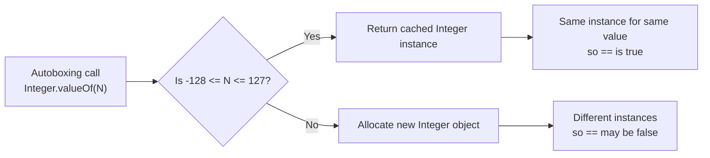

# 1.5. Type Conversions Casting and Wrapper Classes

## Overview

Java is a **statically typed** language with a strict type system, but it is not so strict that you can never move values between types. The Java Language Specification (JLS) defines five kinds of **conversions** that the compiler applies, sometimes implicitly and sometimes only with an explicit cast: **widening primitive conversions**, **narrowing primitive conversions**, **widening reference conversions**, **narrowing reference conversions**, and **boxing and unboxing conversions**. Around these conversions sits a universe of **wrapper classes** (`Byte`, `Short`, `Integer`, `Long`, `Float`, `Double`, `Character`, `Boolean`) that allow primitive values to participate in the object oriented world, especially in generic collections. Java 5 added **autoboxing and unboxing**, which automatically convert between primitives and their wrappers at assignment and method invocation boundaries, eliminating most of the boilerplate that earlier Java versions required.

This note walks through every kind of conversion, the precise rules the compiler applies, and the runtime costs involved. It then dives into the wrapper classes: how they cache small values, why `Integer.equals` works correctly but `Integer ==` does not, what happens when you unbox `null`, how `Integer.parseInt` differs from `Integer.valueOf`, and how the JIT compiler can sometimes eliminate autoboxing overhead entirely. We also cover numeric promotion, which is the rule that combines operands of different numeric types in arithmetic expressions.

Understanding conversions, casting, and wrappers is critical because they are pervasive and the rules are subtle. Misunderstanding them produces bugs that are hard to find: a `NullPointerException` from unboxing `null`, a silent overflow from a narrowing cast, a wrong result from `Integer ==`, a performance cliff from accidental autoboxing in a hot loop, or a surprising method overload resolution due to boxing and varargs. By the end of this note you should be able to read any conversion, predict its result without running the code, choose the right wrapper class method, and avoid the performance and correctness traps that surround boxing and unboxing.

## Background Knowledge

Before diving in, recall a few foundational ideas:

- **Primitive vs reference types.** Primitives (`byte`, `short`, `int`, `long`, `float`, `double`, `char`, `boolean`) are stored by value and have no methods. Reference types (classes, interfaces, arrays) are stored by reference and have methods. Wrappers are reference types that wrap a primitive value.
- **Static vs runtime typing.** The compiler uses static types (declared types) to decide which conversions are legal. The JVM uses runtime types (actual object classes) to verify casts and dispatch virtual calls.
- **Generic type erasure.** Generic types like `List<Integer>` exist only at compile time; at runtime they become `List` of `Object`. This is why primitives cannot be type parameters: you cannot write `List<int>`, only `List<Integer>`. Erasure is the historical reason autoboxing was added.
- **Stack vs heap allocation.** Primitive locals live on the stack; wrapper objects live on the heap. Each boxing operation allocates an object (unless the value is cached); each unboxing reads the wrapped primitive field.

## Numeric Promotion

When a binary operator combines two numeric operands, the compiler applies **numeric promotion** to bring them to a common type. There are two rules:

1. **Unary numeric promotion**: if one operand is `byte`, `short`, or `char`, it is promoted to `int`. If one operand is a `long`, both are promoted to `long`. If one is `float`, both are promoted to `float`. If one is `double`, both are promoted to `double`.
2. **Binary numeric promotion**: if one operand is `double`, the other is promoted to `double`. Else if one is `float`, the other is promoted to `float`. Else if one is `long`, the other is promoted to `long`. Else both are promoted to `int`.

```java
byte a = 1, b = 2;
// byte c = a + b;   // COMPILE ERROR: a + b is int, not byte
int c = a + b;       // OK
byte d = (byte)(a + b);   // OK with explicit cast

char ch = 'A';
int code = ch + 1;   // char promoted to int, result is int
char next = (char)(ch + 1);   // explicit cast back to char
```

The promotion rule exists because the JVM's instruction set has no `byte add` or `short add` instructions; arithmetic is done in `int` or `long` registers. The cast back to the narrower type is the programmer's promise that the value fits.

## Widening Primitive Conversion

A **widening primitive conversion** converts a narrower numeric type to a wider one without loss of information (except possibly for `int` to `float` and `long` to `double`, where some precision can be lost because the mantissa of a `float` is 23 bits and of a `double` is 52 bits). Widening conversions are **implicit**; they happen automatically at assignment, method invocation, and numeric promotion.

The widening paths are:

- `byte` to `short`, `int`, `long`, `float`, `double`
- `short` to `int`, `long`, `float`, `double`
- `char` to `int`, `long`, `float`, `double`
- `int` to `long`, `float`, `double`
- `long` to `float`, `double`
- `float` to `double`

```java
int i = 1000;
long l = i;          // widening, no cast needed
float f = l;         // widening, no cast needed (precision may be lost for large values)
double d = f;        // widening, no cast needed
```

A subtle case: `int` to `float` can lose precision because `float` has only 23 bits of mantissa. For example, `int x = 16777217; float fx = x;` results in `fx == 16777216.0f` because the value cannot be represented exactly. Similarly, `long` to `double` can lose precision for large values. These conversions are still considered widening because the *magnitude* range of the target type always covers the source type.

## Narrowing Primitive Conversion

A **narrowing primitive conversion** converts a wider type to a narrower one. It may lose information (magnitude and precision), so it requires an **explicit cast**. The JVM truncates the value to fit the target type, taking the low order bits for integer types and rounding toward zero for floating to integer conversions.

```java
double d = 3.99;
int i = (int) d;     // 3 (truncation toward zero, not rounding)
int rounded = (int) Math.round(d);   // 4 (round half up)

long l = 1000000L;
int n = (int) l;     // 1000000 (fits, no loss)
long big = 0x100000000L;   // 2^32
int m = (int) big;   // 0 (low 32 bits only)

char c = (char) -1;  // 65535 (low 16 bits, treated as unsigned)
```

The narrowing paths are the reverse of the widening paths. A `float` to `int` conversion truncates toward zero (not toward negative infinity). To round, use `Math.round`, `Math.floor`, or `Math.ceil` first.

```java
double pi = 3.14159;
int truncated = (int) pi;        // 3
int rounded = (int) Math.round(pi);   // 3 (round half to even? actually round half up)
int floored = (int) Math.floor(pi);   // 3
int ceiling = (int) Math.ceil(pi);    // 4
```

A special case for `byte` and `short`: a compile time constant `int` expression in range can be assigned to a `byte` or `short` variable without an explicit cast. This is why `byte b = 100;` compiles, but `byte b = a + 1;` (where `a` is a `byte` variable) does not.

```java
final int x = 100;
byte b = x;   // OK because x is a compile time constant in range
int a = 100;
byte c = a;   // COMPILE ERROR: a is not a constant expression
```

## Casting

A **cast** is the explicit `(Type) expression` syntax that forces a conversion the compiler would not perform implicitly. Casts come in three flavors:

1. **Numeric casts** for narrowing primitive conversions, as above.
2. **Reference casts** for narrowing reference conversions, as below.
3. **Boxing/unboxing casts** are not used directly; they happen via autoboxing.

### Reference Casting

A **widening reference conversion** happens implicitly when assigning a subclass reference to a superclass variable: `Animal a = new Dog();`. No cast is needed because every `Dog` is an `Animal`.

A **narrowing reference conversion** requires an explicit cast: `Dog d = (Dog) animal;`. The compiler accepts this if the types are in an inheritance relationship (otherwise it reports "inconvertible types"). At runtime, the JVM checks the actual class of the object; if it is not assignment compatible with the target type, a `ClassCastException` is thrown.

```java
Object obj = "hello";
String s = (String) obj;     // OK at runtime, obj is a String
Integer n = (Integer) obj;   // ClassCastException at runtime
```

Modern style uses `instanceof` patterns to combine the check and the cast (Java 16+):

```java
if (obj instanceof String s) {
    // s is in scope here, no cast needed
    System.out.println(s.length());
}
```

### Numeric Casting

Numeric casts truncate or convert as described above. Casts have high precedence, so `(int) d + 1` parses as `((int) d) + 1`. Use parentheses when needed.

A common gotcha: dividing two ints and assigning to a double requires casting one of the operands, not the result:

```java
int a = 5, b = 2;
double wrong = (double)(a / b);   // 2.0 (integer division first, then cast)
double right = (double)a / b;     // 2.5 (cast first, then double division)
double right2 = a / (double)b;    // 2.5
```

## Boxing and Unboxing Conversions

A **boxing conversion** converts a primitive value to its corresponding wrapper object. An **unboxing conversion** converts a wrapper object back to its primitive. Both can happen implicitly via **autoboxing** (since Java 5) or explicitly via `Integer.valueOf(5)` and `Integer.intValue()`.

The mapping between primitives and wrappers:

| Primitive | Wrapper |
|-----------|---------|
| `byte` | `Byte` |
| `short` | `Short` |
| `int` | `Integer` |
| `long` | `Long` |
| `float` | `Float` |
| `double` | `Double` |
| `char` | `Character` |
| `boolean` | `Boolean` |

### Autoboxing

When you assign a primitive to a wrapper variable, or pass a primitive where a wrapper is expected, the compiler inserts a call to `Wrapper.valueOf(primitive)`:

```java
Integer i = 5;                 // autobox: Integer.valueOf(5)
Double d = 3.14;               // autobox: Double.valueOf(3.14)
Boolean b = true;              // autobox: Boolean.valueOf(true)

List<Integer> nums = new ArrayList<>();
nums.add(10);                  // autobox: nums.add(Integer.valueOf(10))
nums.add(20);
int first = nums.get(0);       // unbox: nums.get(0).intValue()
```

### Unboxing

When you assign a wrapper to a primitive variable, or pass a wrapper where a primitive is expected, the compiler inserts a call to `wrapper.primitiveValue()`:

```java
Integer i = Integer.valueOf(5);
int n = i;                     // unbox: i.intValue()

Double d = 3.14;
double x = d;                  // unbox: d.doubleValue()
```

### Unboxing null Throws NullPointerException

A wrapper variable can be `null`. Unboxing `null` throws `NullPointerException`. This is a common source of crashes:

```java
Integer count = null;
int n = count;                 // NullPointerException at runtime

Map<String, Integer> counts = new HashMap<>();
int c = counts.get("missing");   // NullPointerException: get returns null, unboxing throws
```

To avoid this, use `getOrDefault`:

```java
int c = counts.getOrDefault("missing", 0);   // returns 0, no NPE
```

Or use `Optional`:

```java
int c = Optional.ofNullable(counts.get("missing")).orElse(0);
```

## Wrapper Classes

Each primitive has a corresponding **wrapper class** in `java.lang`. The wrappers are `final`, immutable, and extend `Number` (except `Boolean` and `Character`). They provide:

- Constants like `Integer.MAX VALUE`, `Integer.MIN VALUE`, `Double.NaN`, `Double.POSITIVE INFINITY`
- Static factory methods `valueOf` (preferred over constructors, which are deprecated since Java 9)
- Conversion methods like `parseInt`, `toString`, `valueOf(String)`
- Comparison methods like `compare`, `compareTo`
- Bit level methods like `Integer.bitCount`, `Integer.reverse`, `Double.doubleToLongBits`

### Integer

The most commonly used wrapper. Key methods:

```java
Integer a = Integer.valueOf(42);           // preferred factory
Integer b = 42;                            // autoboxing, equivalent
int n = a.intValue();                      // explicit unbox
int parsed = Integer.parseInt("123");      // primitive int from String
Integer fromString = Integer.valueOf("123");   // wrapper from String
String binary = Integer.toBinaryString(42);   // "101010"
String hex = Integer.toHexString(255);    // "ff"
int count = Integer.bitCount(0b1011);     // 3 (number of 1 bits)
int reversed = Integer.reverse(1);        // bit reversal
int max = Integer.max(3, 5);              // 5
int sum = Integer.sum(3, 5);              // 8
```

`Integer.parseInt` returns a primitive `int` and throws `NumberFormatException` on bad input. `Integer.valueOf(String)` returns a wrapper `Integer` and uses the cache for small values.

### Long, Double, Float

Similar APIs to `Integer`. `Long.parseLong("9223372036854775807")` parses a `long`. `Double.parseDouble("3.14")` parses a `double`. Each wrapper has its own `MAX VALUE`, `MIN VALUE`, and (for floats) `NaN`, `POSITIVE INFINITY`, `NEGATIVE INFINITY` constants.

```java
long big = Long.parseLong("9223372036854775807");
double nan = Double.NaN;
boolean isNan = Double.isNaN(nan);          // true
long bits = Double.doubleToLongBits(3.14);  // raw bit representation
```

### Character

The `Character` wrapper provides Unicode aware methods:

```java
char c = 'A';
boolean letter = Character.isLetter(c);          // true
boolean digit = Character.isDigit(c);            // false
char upper = Character.toUpperCase('a');         // 'A'
int type = Character.getType(c);                 // Character.UPPERCASE LETTER
int codePoint = Character.codePointAt("", 0);  // 128512 (U+1F600)
boolean supplementary = Character.isSupplementaryCodePoint(codePoint);  // true
```

### Boolean

The `Boolean` wrapper has only two singleton instances, `Boolean.TRUE` and `Boolean.FALSE`, plus `Boolean.parseBoolean(String)` (which returns `true` if and only if the string equals `"true"` case insensitively, otherwise `false`).

```java
Boolean t = Boolean.TRUE;
Boolean f = Boolean.FALSE;
Boolean fromString = Boolean.valueOf("true");    // TRUE
Boolean fromString2 = Boolean.valueOf("yes");    // FALSE (only "true" is true)
boolean primitive = Boolean.parseBoolean("true");
```

## Wrapper Instance Caching

To reduce object allocation for common values, the wrapper classes cache instances for small ranges:

- `Byte`, `Short`, `Integer`: cache values from -128 to 127 (inclusive)
- `Long`: caches -128 to 127
- `Character`: caches 0 to 127
- `Boolean`: caches `TRUE` and `FALSE` (only two instances ever)
- `Float` and `Double`: do not cache

This means `Integer.valueOf(127) == Integer.valueOf(127)` is `true` (both return the cached instance), but `Integer.valueOf(128) == Integer.valueOf(128)` is `false` (both create new objects).

```java
Integer a = 127;          // autobox: returns cached instance
Integer b = 127;          // autobox: same cached instance
System.out.println(a == b);    // true

Integer c = 128;          // autobox: creates new Integer
Integer d = 128;          // autobox: creates another new Integer
System.out.println(c == d);    // false  (different objects)
System.out.println(c.equals(d));   // true   (same value)
```

This is the single most famous Java pitfall. **Always use `.equals()` to compare wrappers, never `==`.** The cache range can be extended for `Integer` via the `-XX:AutoBoxCacheMax=N` JVM flag, but you cannot rely on this in portable code.



## Performance of Autoboxing

Autoboxing has two hidden costs:

1. **Object allocation**: each boxing operation (for non cached values) allocates a heap object. Each unboxing reads a field. In a hot loop, this can dominate execution time.
2. **Garbage collection pressure**: the wrappers become garbage quickly, filling young generations and triggering minor GCs.

```java
// BAD: autoboxing in a tight loop
Long sum = 0L;
for (int i = 0; i < Integer.MAX VALUE; i++) {
    sum += i;   // unbox sum, add i, box result: allocates ~2 billion Long objects!
}
// This program takes seconds to minutes and triggers massive GC

// GOOD: primitive accumulator
long sum = 0L;
for (int i = 0; i < Integer.MAX VALUE; i++) {
    sum += i;
}
// Runs in well under a second
```

The JIT compiler can sometimes eliminate autoboxing via **escape analysis**: if the wrapper object never escapes the method, it can be scalar replaced into individual fields kept in registers. This works for some simple cases but not for wrappers stored in collections or passed to other methods.

For numeric code that needs collections of primitives, consider:

- **Primitive arrays** (`int[]`, `double[]`) when size is known
- **Specialized libraries** like Eclipse Collections, fastutil, or Trove, which provide `IntArrayList`, `DoubleArrayList`, etc., with no boxing
- **`Map.Entry` style pairs** stored as primitive fields rather than `Map<Integer, Integer>`

## Conversion Rules Summary

The compiler applies conversions in this priority when assigning a value to a variable or passing it as an argument:

1. **Identity conversion** (same type): no conversion needed.
2. **Widening primitive conversion**: implicit.
3. **Widening reference conversion**: implicit.
4. **Boxing conversion**: implicit (autoboxing).
5. **Unboxing conversion**: implicit (autounboxing).
6. **Narrowing primitive conversion**: requires explicit cast.
7. **Narrowing reference conversion**: requires explicit cast.

A single conversion is applied at a time, except for **unboxing followed by widening primitive** (e.g., `Integer` to `long`), which is allowed implicitly: `Long x = someInteger;` is illegal (you cannot box to one type and assign to another), but `long x = someInteger;` is legal (unbox to int, then widen to long).

```java
Integer i = 5;
long l = i;      // OK: unbox to int, then widen to long
Long wrong = i;  // COMPILE ERROR: cannot assign Integer to Long

Number n = i;    // OK: Integer is a Number (widening reference)
```

## Common Pitfalls

- **`Integer == Integer` is unreliable.** Cached for -128 to 127, but `==` returns false outside that range. Always use `.equals()`.
- **Unboxing `null` throws `NullPointerException`.** Always check or use `getOrDefault`.
- **`Integer.parseInt` vs `Integer.valueOf`.** The former returns `int`, the latter returns `Integer` (and uses the cache). Mixing them up can cause subtle issues.
- **Accidental autoboxing in hot loops.** `Long sum = 0L; for (...) sum += i;` allocates billions of objects. Use primitives.
- **`Map.get` returning null and unboxing.** `int c = map.get(key);` throws NPE if the key is missing. Use `getOrDefault`.
- **Mixing `Integer` and `Long` in arithmetic.** `Integer i = 5; Long l = i + 1L;` does not compile because the result of `i + 1L` is `long`, which cannot be assigned to `Long` without explicit boxing (and `Long` does not auto-convert from `long` literal in this context, except via direct autoboxing of a `long` expression, which actually works).
- **Narrowing cast loses magnitude.** `int x = (int) 3.9e9;` silently truncates a value larger than `Integer.MAX VALUE` to a meaningless int.
- **Forgetting that `int` to `float` loses precision.** `float f = 16777217;` produces `16777216.0f` because the mantissa is only 23 bits.
- **Casting negative numbers to char.** `char c = (char) -1;` produces 65535, not an error.
- **Casting NaN to int.** `(int) Double.NaN` produces 0, not an error.
- **Casting infinity to int.** `(int) Double.POSITIVE INFINITY` produces `Integer.MAX VALUE`, not an error.
- **`Boolean.valueOf("yes")` is `false`.** Only the string `"true"` (case insensitive) yields `true`. Anything else is `false`.
- **Comparing wrappers with `compareTo` instead of `equals`.** `new Integer(1).compareTo(new Integer(2))` returns a negative int; `equals` returns `false`. They serve different purposes.
- **Numeric promotion in arithmetic.** `byte a = 1, b = 2; byte c = a + b;` does not compile because `a + b` is `int`.
- **Using `Integer` for keys when `int` would do.** The wrapper adds object header overhead. For huge maps, consider `int[]` indexed maps or specialized libraries.
- **Forgetting that `Number` is the superclass of all numeric wrappers.** `Number n = 5;` autoboxes to `Integer`, which is a `Number`. Useful for APIs that accept any numeric type.
- **Trusting `Integer.valueOf(String)` to validate input.** It throws `NumberFormatException` on bad input. Wrap in try/catch or pre-validate.
- **Confusing `intValue` and `parseInt`.** `Integer.valueOf("123").intValue()` is a roundabout way to write `Integer.parseInt("123")`.

## Tips and Tricks

- Always use **`.equals()`** to compare wrapper values. Use `Objects.equals(a, b)` for null safety.
- Use **`Integer.parseInt`** for primitive `int` from String; use **`Integer.valueOf`** only when you specifically need a wrapper object.
- Use **`getOrDefault`** on maps to avoid NPE on unboxing missing keys.
- Use **`Optional`** for methods that may not return a value, rather than returning `null` wrappers.
- In performance sensitive numeric code, prefer **primitive arrays** and primitive locals. Avoid `List<Integer>` for hot paths.
- For high volume numeric collections, consider **Eclipse Collections**, **fastutil**, or **Trove** for primitive specialized collections.
- Use **`Math.round`**, **`Math.floor`**, **`Math.ceil`** before casting `double` to `int` if you need rounding rather than truncation.
- Use **`Integer.compare(a, b)`** instead of `a - b` in comparators. Subtraction can overflow for extreme values.
- Use **`Integer.hashCode(int)`**, **`Long.hashCode(long)`**, etc. (since Java 8) for hash codes of primitives, instead of `new Integer(value).hashCode()`.
- Use **`Integer.sum`**, **`Integer.max`**, **`Integer.min`** as method references in streams: `intList.stream().reduce(0, Integer::sum)`.
- Use **`Integer.toUnsignedString`** and **`Integer.parseUnsignedInt`** to treat `int` as unsigned without a separate type.
- Use **`Double.isNaN`** and **`Double.isInfinite`** to test special floating point values.
- Use **`Double.doubleToLongBits`** and **`Double.longBitsToDouble`** for bit level manipulation of floating point values.
- Use **`BigDecimal`** constructed from `String`, not from `double`, for exact decimal arithmetic.
- Use **`Number`** as a parameter type when you genuinely accept any numeric type. Otherwise prefer the specific primitive or wrapper.
- Use **`Integer.bitCount`** for population count, **`Integer.highestOneBit`** for the highest set bit, **`Integer.numberOfTrailingZeros`** for finding the lowest set bit. These compile to single CPU instructions on modern hardware.
- For `Boolean`, prefer the primitive `boolean` and use `Boolean.TRUE`/`Boolean.FALSE` constants when you must have a wrapper.

## Interview Questions

**Q1: What is the difference between widening and narrowing primitive conversion?**
A: Widening converts a narrower type to a wider one (e.g., int to long) without loss of information (except possibly precision for int to float and long to double). It is implicit. Narrowing converts a wider type to a narrower one (e.g., double to int) and may lose magnitude or precision. It requires an explicit cast.

**Q2: Why does `byte c = a + b;` not compile when `a` and `b` are bytes?**
A: Because of numeric promotion: `byte` operands are promoted to `int` for arithmetic, so `a + b` is `int`, which cannot be assigned to a `byte` without an explicit cast. The JVM has no `byte add` instruction; arithmetic is done in `int` or `long` registers.

**Q3: What is the difference between `Integer.parseInt("123")` and `Integer.valueOf("123")`?**
A: `parseInt` returns a primitive `int`. `valueOf` returns a wrapper `Integer` (and uses the cache for values in -128 to 127). Use `parseInt` when you need a primitive; use `valueOf` when you need a wrapper.

**Q4: What is autoboxing and unboxing?**
A: Autoboxing is the automatic conversion of a primitive to its corresponding wrapper (e.g., `int` to `Integer`), inserted by the compiler as a call to `Wrapper.valueOf`. Unboxing is the reverse, inserted as a call to `wrapper.primitiveValue()`. Both were added in Java 5. They enable primitives to be used in generic collections.

**Q5: Why does `Integer a = 127, b = 127; a == b` return true but `Integer a = 128, b = 128; a == b` returns false?**
A: Because `Integer` caches values from -128 to 127. Autoboxing of 127 returns the same cached instance both times, so `==` (which compares references) is true. For 128, autoboxing creates new Integer objects each time, so `==` is false. Always use `.equals()` to compare wrapper values.

**Q6: What is the cache range for `Integer`? Can it be changed?**
A: -128 to 127, inclusive. The upper bound can be changed via the `-XX:AutoBoxCacheMax=N` JVM flag, but only the upper bound, and only for `Integer`. The lower bound (-128) is fixed. You cannot rely on this in portable code.

**Q7: What happens when you unbox `null`?**
A: A `NullPointerException` is thrown. This is a common source of crashes when retrieving values from maps: `int c = map.get(key);` throws if the key is missing. Use `map.getOrDefault(key, 0)` to avoid it.

**Q8: Why does `Long sum = 0L; for (int i = 0; i < N; i++) sum += i;` perform terribly?**
A: Because `sum += i` is `sum = sum + i`, which unboxes `sum` to `long`, adds `i`, and boxes the result back to `Long`. Each iteration allocates a new `Long` object (for values outside the cache), producing massive garbage collection pressure. Use a primitive `long sum` instead.

**Q9: Can the JIT compiler eliminate autoboxing?**
A: Sometimes, via escape analysis. If the wrapper object never escapes the current method, the JIT can scalar replace it into individual fields kept in registers. This works for some simple cases but not for wrappers stored in collections or passed to other methods. You cannot rely on it for hot loops.

**Q10: What is the difference between `(int) 3.99` and `(int) Math.round(3.99)`?**
A: The first truncates toward zero, producing 3. The second rounds half up, producing 4. Use `Math.round`, `Math.floor`, or `Math.ceil` if you need rounding behavior rather than truncation.

**Q11: Why does `int x = 16777217; float f = x;` produce `f == 16777216.0f`?**
A: Because `float` has only 23 bits of mantissa, so it cannot represent 16777217 exactly. The closest representable value is 16777216.0. This is a widening conversion that loses precision but not magnitude, so it is still considered widening.

**Q12: What does `(int) Double.NaN` produce?**
A: 0. Casting NaN to int does not throw; it produces 0. Similarly, `(int) Double.POSITIVE INFINITY` produces `Integer.MAX VALUE`, and `(int) Double.NEGATIVE INFINITY` produces `Integer.MIN VALUE`.

**Q13: What does `Boolean.valueOf("yes")` return?**
A: `Boolean.FALSE`. Only the string `"true"` (case insensitive) yields `Boolean.TRUE`. Anything else yields `Boolean.FALSE`. There is no exception for invalid input.

**Q14: What is the difference between `Integer.valueOf(5)` and `new Integer(5)`?**
A: `valueOf` is a factory method that uses the cache for values in -128 to 127, returning a shared instance. `new Integer(5)` always allocates a new object, bypassing the cache. Since Java 9, the `Integer` constructor is deprecated; always use `valueOf`.

**Q15: Why can you not write `List<int>` in Java?**
A: Because generic type parameters must be reference types, due to type erasure. At runtime, `List<T>` becomes `List` of `Object`, which cannot hold a primitive. You must use `List<Integer>` and rely on autoboxing. Specialized libraries like Eclipse Collections and fastutil provide primitive collections that avoid this overhead.

**Q16: What is `Number` and why is it useful?**
A: `Number` is the abstract superclass of `Byte`, `Short`, `Integer`, `Long`, `Float`, `Double`, and `BigInteger`/`BigDecimal`. It defines `intValue()`, `longValue()`, `floatValue()`, `doubleValue()`, and `byteValue()`/`shortValue()` (since Java 8). It is useful for APIs that accept any numeric wrapper type, but you pay the cost of unboxing at the call site.

**Q17: How do you compare two `Integer` for equality?**
A: Use `.equals()` (or `Objects.equals(a, b)` for null safety). Never use `==`, which compares references and is unreliable for non cached values.

**Q18: What is the result of `(double) 5 / 2` versus `(double)(5 / 2)`?**
A: The first casts `5` to `5.0`, then divides by `2` (promoted to `2.0`), producing `2.5`. The second does integer division `5 / 2 = 2` first, then casts to `2.0`. The position of the cast matters: cast one of the operands, not the result, to get floating point division.

**Q19: What is the `Integer` cache, and why does it exist?**
A: A static array of pre allocated `Integer` instances for values -128 to 127, returned by `Integer.valueOf(int)`. It exists to avoid allocating objects for the most common values, reducing memory pressure and improving `==` comparisons (which still should not be relied on). It is a performance optimization, not a semantic guarantee.

**Q20: What is the difference between `Integer.max(a, b)` and `Math.max(a, b)`?**
A: They are functionally identical for `int` arguments. `Integer.max` was added in Java 8 as a static method on `Integer` for use as a method reference (`reduce(Integer::max)`). `Math.max` is older and has overloads for `int`, `long`, `float`, and `double`. Use whichever fits the context; `Integer::max` is convenient in streams.

## Summary

Java's type conversion rules form a precise hierarchy: widening primitive conversions are implicit, narrowing primitive conversions require a cast, widening reference conversions are implicit, narrowing reference conversions require a cast with runtime verification, and boxing and unboxing conversions between primitives and their wrapper classes are implicit via autoboxing. Numeric promotion governs how operands of different numeric types are combined in arithmetic: byte, short, and char are promoted to int, and operands are widened to the widest participating type. Wrapper classes (`Byte`, `Short`, `Integer`, `Long`, `Float`, `Double`, `Character`, `Boolean`) provide object counterparts to primitives, with caching for small values, immutable instances, and a rich set of static utility methods.

The most important practical lessons are: always use `.equals()` to compare wrappers, never `==`; be careful with unboxing null; prefer `parseInt` for primitives and `valueOf` only when you need a wrapper; avoid autoboxing in hot loops by using primitive accumulators; remember that `int` to `float` and `long` to `double` can lose precision; use `Math.round`/`floor`/`ceil` before casting if you need rounding; and use `getOrDefault` on maps to avoid NPE on unboxing. With these foundations, you can write Java code that handles type conversions correctly and efficiently, and you are well prepared to study the `var` keyword and naming conventions in the final note of this phase.
