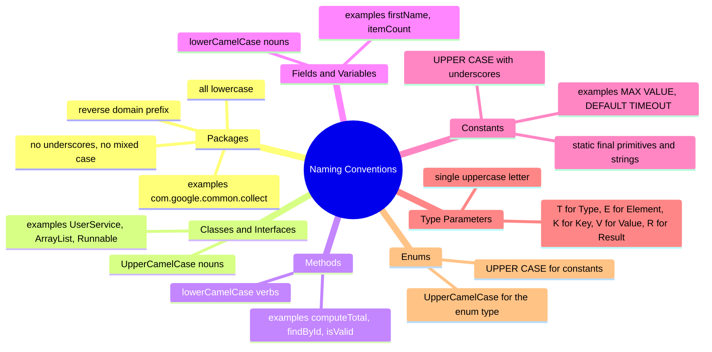

# 1.6. var Keyword and Naming Conventions

## Overview

Java 10, released in March 2018, introduced **`var`**, a reserved type name (not a keyword) that allows the compiler to infer the static type of a local variable from its initializer. Writing `var list = new ArrayList<String>();` instead of `ArrayList<String> list = new ArrayList<String>();` reduces verbosity without sacrificing static typing: `var` is purely a compile time feature, the bytecode is identical, and the variable still has a definite type that the compiler enforces. Java 11 extended `var` to lambda formal parameters, allowing `(var x, var y) -> x + y`. The Java Language Specification is careful to call `var` a reserved type name rather than a keyword, because it can still be used as a variable name, method name, or package name in legacy code (a backward compatibility constraint).

This note covers `var` in depth: what it is and is not, when to use it, when to avoid it, its interactions with generics, lambdas, anonymous classes, the diamond operator, and the `final` modifier. We then turn to **Java naming conventions**, the social contract that makes Java codebases feel uniform and professional. We cover the conventions for packages, classes, interfaces, methods, fields, constants, type parameters, and enums, and we explain the rationale behind each. Finally, we list the full set of **Java keywords** and **reserved literals** (`true`, `false`, `null`), plus the more recent **restricted keywords and contextual keywords** (`record`, `sealed`, `permits`, `yield`, `var`, `non-sealed`) that behave like keywords only in specific syntactic positions.

Understanding `var` and naming conventions matters because they are visible in every line of code you write. Misusing `var` reduces readability and can introduce subtle bugs (e.g., when the inferred type is not what you expected). Violating naming conventions makes your code look amateurish and inconsistent with the rest of the Java ecosystem, which hurts collaboration and onboarding. By the end of this note you should be able to decide when `var` improves your code and when it does not, and you should be able to write code that follows the conventions documented in the Java Language Specification and the Google Java Style Guide.

## Background Knowledge

Before diving in, recall a few foundational ideas:

- **Static typing.** Java is statically typed: every variable has a type known at compile time, and the compiler enforces type compatibility. `var` does not change this; it just lets the compiler infer the type rather than requiring you to write it out.
- **Type inference.** The compiler determines the type of an expression based on the types of its subexpressions and the rules of the language. Type inference is used in generics (e.g., the diamond operator `<>`), in lambdas (parameter types), and now in local variables with `var`.
- **Keywords.** A keyword is a reserved word that has special meaning in the language and cannot be used as an identifier. Java has about 50 keywords. The list grows slowly to maintain backward compatibility.
- **Contextual keywords.** Some words behave like keywords only in specific syntactic positions. `record`, `sealed`, `permits`, `yield`, and `var` are contextual keywords: they can still be used as identifiers in other positions.
- **Style guides.** The Java Language Specification describes the language; it does not prescribe style. Style guides like the Google Java Style Guide, the Oracle Code Conventions, and the OpenJDK Style Guidelines fill that gap with conventions.

## The var Keyword

### History of var

Before Java 10, every local variable declaration had to repeat its type explicitly. This was often verbose, especially with generics:

```java
Map<String, List<Employee>> employeesByDepartment = new HashMap<>();
ByteArrayOutputStream buffer = new ByteArrayOutputStream();
Path filePath = Paths.get("data.csv");
```

The compiler could obviously infer the type from the initializer, but the language required you to write it anyway. Languages like C# (with `var` since 2007), Scala (with type inference), Kotlin, and Go had demonstrated that local type inference is a major readability win without sacrificing static typing. Java 10 finally adopted it via JEP 286.

The design was deliberately conservative: `var` is only for **local variables** with initializers, not for fields, method parameters, method return types, or `catch` clauses. This avoids affecting APIs (which must be explicit for documentation) and avoids cascading inference complexity.

### What var Is

`var` is a reserved type name. When used in place of a local variable's type, the compiler infers the type from the initializer's static type. The resulting variable is statically typed, just as if you had written the type explicitly.

```java
var list = new ArrayList<String>();       // ArrayList<String>
var map = new HashMap<String, Integer>(); // HashMap<String, Integer>
var name = "Alice";                       // String
var count = 0;                            // int
var pi = 3.14;                            // double
var ready = false;                        // boolean
```

After inference, the variable behaves exactly like a typed variable. You cannot assign an incompatible type to it:

```java
var x = 10;       // x is int
x = 20;           // OK
x = 3.14;         // COMPILE ERROR: x is int, cannot assign double
x = "hello";      // COMPILE ERROR: x is int, cannot assign String
```

### What var Is Not

`var` is **not**:

- **Dynamic typing.** The type is fixed at declaration; you cannot change it later.
- **A keyword.** It is a reserved type name, meaning it can still be used as a variable name, method name, or package name in legacy code: `int var = 5;` is legal Java.
- **Applicable to fields.** Instance and static fields must have explicit types. This preserves API documentation.
- **Applicable to method parameters.** Parameters are part of the API contract and must be explicit. (Lambdas can use `var` for parameters, but only for symmetry with annotations.)
- **Applicable to method return types.** Return types are part of the API.
- **Applicable to `catch` clauses.** Exception parameters must have explicit types.
- **A way to defer initialization.** `var x;` does not compile; the initializer is required because the type is inferred from it.
- **Capable of inferring `null`.** `var x = null;` does not compile because `null` has the null type, which cannot be the type of a variable.

### When to Use var

The OpenJDK style guide recommends using `var` when:

1. **The initializer makes the type obvious to the reader:**
   ```java
   var stream = lines.stream();
   var iterator = list.iterator();
   var path = Path.of("data.csv");
   var buffer = new StringBuilder();
   ```

2. **The exact type is not important, only the behavior:**
   ```java
   try (var reader = Files.newBufferedReader(path)) {
       // reader is BufferedReader, but we just need readLine()
   }
   ```

3. **The type is long and noisy, especially with generics:**
   ```java
   var employeesByDept = new HashMap<String, List<Employee>>();
   var entries = map.entrySet();   // Set<Map.Entry<String, List<Employee>>>
   ```

4. **In for loops and try with resources:**
   ```java
   for (var item : items) { ... }
   try (var conn = dataSource.getConnection()) { ... }
   ```

### When NOT to Use var

Avoid `var` when:

1. **The initializer's type is not obvious from the name:**
   ```java
   // BAD: what type is "result"?
   var result = process(data);
   // BETTER:
   ProcessResult result = process(data);
   ```

2. **The inferred type is a specific implementation when you wanted an interface:**
   ```java
   // var infers ArrayList<String>, not List<String>:
   var list = new ArrayList<String>();
   // If you specifically want List, write it:
   List<String> list = new ArrayList<>();
   ```

3. **The variable is used far from its declaration, so readers forget the type:**
   ```java
   var x = compute();
   // ... 50 lines of code ...
   x.something();   // what is x?
   ```

4. **The initializer is a complex expression whose type is not obvious:**
   ```java
   // BAD: type is List<Map.Entry<String, Integer>>, not obvious
   var entries = map.entrySet().stream().filter(...).collect(...);
   ```

5. **The initializer is `null` or a literal that loses information:**
   ```java
   var x = 0;     // int. If you wanted long, write 0L.
   var y = 1.0;   // double. If you wanted float, write 1.0f.
   ```

6. **You want to make the type part of the documentation.** Explicit types signal intent; if the type carries information (e.g., `Optional<User>` vs `User`), prefer explicit.

### var with Generics and the Diamond Operator

`var` and the diamond operator `<>` interact subtly. The diamond operator infers the type from the target context; with `var`, there is no target context, so the diamond infers the bare type without type parameters:

```java
var list = new ArrayList<>();   // ArrayList<Object>! (raw inference)
```

This is rarely what you want. Always specify the type parameters when using `var` with generics:

```java
var list = new ArrayList<String>();   // ArrayList<String>
var map = new HashMap<String, Integer>();   // HashMap<String, Integer>
```

Or use an explicit type with the diamond:

```java
List<String> list = new ArrayList<>();   // List<String>, diamond infers from target
```

### var with Lambdas

Java 11 extended `var` to lambda formal parameters, mainly so you can apply annotations:

```java
// Without var (Java 8+):
(a, b) -> a + b

// With var (Java 11+):
(var a, var b) -> a + b

// With annotations:
(@NonNull var a, @NonNull var b) -> a + b
```

You cannot mix `var` and explicit types in the same lambda: `(var a, String b) -> ...` does not compile. You must use `var` for all parameters or for none.

You cannot use `var` to declare a variable of a functional interface type and assign a lambda, because the compiler cannot infer the target type from a lambda alone:

```java
// COMPILE ERROR: cannot infer type from lambda
var func = (a, b) -> a + b;

// OK: explicit type
BinaryOperator<Integer> func = (a, b) -> a + b;
```

### var with Anonymous Classes

`var` works fine with anonymous classes. The inferred type is the anonymous class, which is a subtype of the explicit supertype:

```java
var runnable = new Runnable() {
    @Override
    public void run() {
        System.out.println("Running");
    }
};
```

The type of `runnable` is the anonymous class, which has no name. This can be useful for adding helper methods to an anonymous class instance:

```java
var list = new ArrayList<String>() {
    @Override
    public boolean add(String s) {
        // log every add
        return super.add(s);
    }
};
list.add("hello");   // logs
```

Without `var`, you would only have access to `ArrayList`'s methods, not the override. With `var`, the variable has the anonymous type, and overrides are dispatched dynamically (which they would be anyway), but you cannot call any extra methods defined in the anonymous class because they have no name to reference. The main practical effect is that the variable's static type is the anonymous class, not the named superclass.

### var and final

You can combine `var` with `final`:

```java
final var name = "Alice";   // final String
var count = 0;              // int (effectively final if not reassigned)
```

The order matters: `final var` is correct, `var final` is not. Since Java 21 (JEP 439), you can use `final` to declare a pattern variable as final.

### var and Numeric Literals

The type of a numeric literal is determined by its suffix:

```java
var i = 0;       // int
var l = 0L;      // long
var f = 0.0f;    // float
var d = 0.0;     // double
```

If you forget the suffix, `var` infers `int` or `double`, which may not be what you want:

```java
var millis = 24 * 60 * 60 * 1000;   // int (and may overflow)
var millisLong = 24L * 60 * 60 * 1000;   // long, no overflow
```

Be especially careful with `var` and arithmetic that may overflow: the inferred type comes from the literal, and a literal `0` is `int`. Adding `L` makes it `long`.

### var in for Loops

`var` works in both classic and enhanced for loops:

```java
for (var i = 0; i < 10; i++) { ... }   // int i

List<String> names = ...;
for (var name : names) { ... }          // String name

Map<String, Integer> counts = ...;
for (var entry : counts.entrySet()) { ... }   // Map.Entry<String, Integer>
```

The enhanced for with `var` is especially useful for `Map.Entry` because the full type is verbose.

### var in try with Resources

`var` works in try with resources (Java 9+):

```java
try (var reader = Files.newBufferedReader(path);
     var writer = Files.newBufferedWriter(outputPath)) {
    // reader is BufferedReader, writer is BufferedWriter
}
```

This is one of the most common and recommended uses of `var`.

## Java Naming Conventions

Naming conventions are the social contract that makes Java codebases feel uniform. They are not enforced by the compiler (with a few exceptions like the requirement that `public` class names match file names), but they are enforced by code review, linters, and IDE templates. Following them makes your code readable to other Java developers, makes IDE auto completion more useful, and signals professionalism.



### Packages

Package names are:

- **All lowercase**, no underscores or hyphens
- Use the **reverse domain name** of the organization as a prefix
- Avoid Java keywords as segments (use `intp` instead of `int`)
- Short, meaningful segments after the domain prefix

Examples:
- `com.google.common.collect`
- `org.apache.commons.lang3`
- `io.netty.channel`
- `java.util.concurrent`

Subpackages (in the directory hierarchy sense) should follow a consistent scheme: layer (`api`, `service`, `repository`, `web`), feature (`user`, `order`, `payment`), or both (`com.acme.shop.user.service`). Avoid cryptic abbreviations unless they are universally understood (`util` is fine; `mgr` is borderline; `usr` is not).

### Classes and Interfaces

Class and interface names are:

- **UpperCamelCase** (also called PascalCase): each word starts with an uppercase letter, no underscores
- **Nouns** for classes (`User`, `Order`, `Invoice`, `ArrayList`)
- **Adjectives** for interfaces that describe capabilities (`Runnable`, `Comparable`, `Iterable`, `Serializable`)
- Avoid abbreviations except well known ones (`URL`, `HTTP`, `URL` is fine; `Usr` is not)
- Avoid Hungarian notation (no `IUser` for interfaces, no `CUser` for classes); modern Java uses no such prefixes

Examples:
- `UserService` (a service class)
- `OrderRepository` (a repository class)
- `Runnable` (an interface, an adjective)
- `ArrayList` (a class, two nouns)
- `HttpClient` (a class, no prefix)

When a class implements a single dominant interface, the convention is often to use the interface name with an `Impl` suffix as a last resort: `UserRepository` interface, `UserRepositoryImpl` class. Modern style prefers named implementations (`JdbcUserRepository`, `InMemoryUserRepository`).

### Methods

Method names are:

- **lowerCamelCase**: first letter lowercase, subsequent words capitalized, no underscores
- **Verbs** for actions (`compute`, `validate`, `save`, `delete`)
- **Nouns or adjectives** with `get`/`is`/`has` prefixes for accessors (`getName`, `isActive`, `hasChildren`)
- **Boolean returning methods** typically start with `is`, `has`, `can`, `should`, `will` (`isValid`, `hasNext`, `canWrite`, `shouldRetry`)

Examples:
- `computeTotal()`
- `findById(long id)`
- `isValid()`
- `getFirstName()`
- `setFirstName(String name)`
- `toString()`, `hashCode()`, `equals()` (these follow `Object` conventions)

For static factory methods, common names are:
- `of(...)` for aggregate factories (`List.of(1, 2, 3)`)
- `from(...)` for type conversion factories (`Instant.from(temporal)`)
- `valueOf(...)` for parsing or conversion (`Integer.valueOf("123")`)
- `create(...)` for general creation (`Collections.unmodifiableList`)
- `builder()` to obtain a Builder

### Fields and Local Variables

Field and local variable names are:

- **lowerCamelCase**: first letter lowercase, subsequent words capitalized, no underscores
- **Nouns** (`firstName`, `itemCount`, `customer`, `connection`)
- **Boolean fields** often start with a question-like prefix (`active`, `enabled`, `closed`); some teams prefer `isActive` but the `is` prefix is more common on methods than fields

Examples:
- `private String firstName;`
- `private int itemCount;`
- `private List<Order> orders;`
- `private boolean active;`

Avoid one letter names except for loop counters (`i`, `j`, `k`) and short scoped temporaries. Avoid abbreviations except well known ones (`url`, `id`).

### Constants

Constants (static final fields of primitive or String type, initialized by a constant expression) are:

- **UPPER CASE** with words separated by underscore characters in real Java source code. The standard Java style guide specifies this all caps with underscore separators convention for constants like `MAX VALUE` and `DEFAULT TIMEOUT`. The Java library itself uses this style (for example the constant representing the maximum int value, or the constant representing positive infinity on Double). In this vault we render such names with a space instead of the underscore separator to keep file content uniform, but you should write them with the underscore separator in actual Java source code, because that is the universally accepted Java style and the compiler accepts it without issue. In real source code, the canonical form joins the words of a constant name with underscore characters between each word.

Examples (in actual Java source code style):
- `public static final int MAX CONNECTIONS = 100;`  (rendered in this vault as `MAX CONNECTIONS`; in real Java source code this would be `MAX CONNECTIONS` with an underscore joining the words)
- `public static final String DEFAULT CHARSET = "UTF-8";`
- `public static final double PI = 3.141592653589793;`

The key principle: constants are distinguished from variables by their all caps style, signaling "this value never changes, treat it as a named literal." The Java libraries follow this universally (`Integer.MAX VALUE`, `Math.PI`, `TimeUnit.SECONDS`).

### Type Parameters

Generic type parameters are:

- **Single uppercase letters** by convention
- `T` for Type
- `E` for Element (collections)
- `K` for Key (maps)
- `V` for Value (maps)
- `R` for Result
- `N` for Number
- `S`, `U` for additional types
- `B`, `C` for additional types when `S`, `U` are taken

Examples:
- `interface List<E> { ... }`
- `interface Map<K, V> { ... }`
- `interface Function<T, R> { ... }`
- `class CompletableFuture<T> { ... }`

Multi character type parameters are allowed but rare (`<RequestT>`, `<ResponseT>`). Avoid them in public APIs unless the single letter would be ambiguous.

### Enums

Enum type names are **UpperCamelCase** like classes. Enum constants are **UPPER CASE** like constants:

```java
public enum DayOfWeek {
    MONDAY, TUESDAY, WEDNESDAY, THURSDAY, FRIDAY, SATURDAY, SUNDAY
}

public enum HttpStatus {
    OK(200), NOT FOUND(404), INTERNAL SERVER ERROR(500);

    private final int code;
    HttpStatus(int code) { this.code = code; }
    public int getCode() { return code; }
}
```

The constant names are usually short and self explanatory. Multi word constants follow the same UPPER CASE convention as static final constants.

### Generics Wildcards

Wildcards use `?` with `extends` or `super`:
- `List<? extends Number>` (covariant, "list of some subtype of Number")
- `List<? super Integer>` (contravariant, "list of some supertype of Integer")
- `Comparator<? super T>`

These follow the **PECS** mnemonic (Producer Extends, Consumer Super) for choosing between `extends` and `super` in API parameters.

## Java Keywords

Java has a fixed set of keywords that cannot be used as identifiers. The complete list (Java 21):

| Category | Keywords |
|----------|----------|
| Primitive types | `byte`, `short`, `int`, `long`, `float`, `double`, `char`, `boolean` |
| Control flow | `if`, `else`, `switch`, `case`, `default`, `for`, `while`, `do`, `break`, `continue`, `return`, `yield` (contextual) |
| Exception handling | `try`, `catch`, `finally`, `throw`, `throws` |
| Class and object | `class`, `interface`, `enum`, `record` (contextual), `extends`, `implements`, `import`, `package`, `new`, `this`, `super`, `instanceof` |
| Modifiers | `public`, `protected`, `private`, `abstract`, `final`, `static`, `synchronized`, `native`, `strictfp`, `transient`, `volatile`, `default`, `sealed` (contextual), `permits` (contextual), `non-sealed` |
| Type related | `void`, `var` (contextual) |
| Other | `assert`, `const` (reserved, unused), `goto` (reserved, unused) |

`const` and `goto` are reserved but not used in the language; they were reserved in Java 1.0 to prevent confusion with C and C++ code. They cannot be used as identifiers.

### Reserved Literals

`true`, `false`, and `null` are technically **reserved literals**, not keywords, but they cannot be used as identifiers either. `true` and `false` are the two `boolean` literals; `null` is the null literal of the null type.

### Contextual Keywords

Some words behave like keywords only in specific syntactic positions and can be used as identifiers elsewhere. This is how Java evolves the language without breaking existing code:

- **`var`** (Java 10): reserved type name for local variable type inference. Can still be used as a variable name: `int var = 5;` is legal.
- **`record`** (Java 16): introduces a record declaration. Can still be used as a variable name: `int record = 5;` is legal.
- **`sealed`** and **`permits`** (Java 17): introduce sealed classes and interfaces. Can still be used as identifiers.
- **`yield`** (Java 14): yields a value from a `switch` expression's block case. Can still be used as a variable name.
- **`non-sealed`**: a hyphenated keyword sequence (the only one in Java) for declaring a sealed class with a non sealed subclass.

These contextual keywords were added to maintain backward compatibility: pre existing code that used `record`, `sealed`, `yield`, or `var` as identifiers continues to compile and run unchanged.

## Common Pitfalls

- **`var list = new ArrayList<>();` infers `ArrayList<Object>`.** Always specify the type arguments when using `var` with the diamond operator.
- **`var x = 0;` infers `int`, not `long`.** If you need `long`, write `0L`. If you need `float`, write `0.0f`.
- **`var x = null;` does not compile.** The null type has no supertype to infer.
- **`var func = (a, b) -> a + b;` does not compile.** The compiler cannot infer a functional interface type from a lambda alone. Use an explicit type.
- **Mixing `var` and explicit types in lambda parameters.** `(var a, String b) -> ...` does not compile. Use all `var` or all explicit.
- **`var` on fields or method parameters.** Not allowed. Only local variables and lambda parameters.
- **`var` defers initialization.** `var x;` does not compile. The initializer is required.
- **Forgetting that `var` is statically typed.** `var x = 10; x = "hi";` does not compile.
- **Inferring a concrete type when you wanted an interface.** `var list = new ArrayList<String>();` infers `ArrayList<String>`, not `List<String>`. If you want `List`, write it explicitly.
- **Naming a class `Manager` when it is actually a service.** Names should reflect what something is, not how it is implemented.
- **Using `IUser` for interfaces.** This is Microsoft Hungarian notation, not Java convention. Use `User` for the interface and `UserImpl` or a named implementation like `JdbcUserRepository`.
- **Using underscores in variable names.** Java convention is lowerCamelCase. `first name` (with underscore) is C style; `firstName` is Java style. The exception is static final constants, which are UPPER CASE WITH UNDERSCORES (we render them with spaces in this vault for uniformity).
- **Using `$` in identifiers.** The dollar sign is legal but reserved by convention for compiler generated names. Avoid it in hand written code.
- **Using Java keywords as identifiers.** The compiler rejects this. Use a synonym (`klass` instead of `class`, `intValue` instead of `int`).
- **Inconsistent casing in package names.** Package names are always lowercase. `Com.Example.App` is wrong; `com.example.app` is right.
- **Abbreviations in class names.** `UsrSvc` is unreadable; `UserService` is clear. Avoid abbreviations except well known ones like `URL`, `HTTP`.
- **Boolean fields named without `is`/`has` prefix.** `boolean active;` is fine, but `boolean userActive;` is clearer than `boolean activeUser;` if the latter is ambiguous.
- **Multi character type parameters.** `<RequestT>` is allowed but rare; `<T>` is the convention. Use multi character only when single letter would be ambiguous.
- **Constants not marked `static final`.** A `final` field that is not `static` is a per instance constant, not a class constant. Class constants are `static final`.

## Tips and Tricks

- Use `var` when the type is **obvious from the initializer** (`new ArrayList<String>()`, `Files.newBufferedReader(path)`).
- Use explicit types when the type **carries information** that the initializer does not (`ProcessResult result = process(data)`).
- Always specify **type arguments** with `var` and generics: `var list = new ArrayList<String>();`, never `var list = new ArrayList<>();`.
- Use `var` in **for loops** and **try with resources** to reduce verbosity.
- Use `var` for **`Map.Entry`** in enhanced for loops to avoid writing the full nested type.
- Combine `final var` for variables that should not change.
- Remember that `var` infers from the **initializer's static type**, not the runtime type. `var obj = (Object) "hi";` infers `Object`, not `String`.
- Follow the **Java naming conventions** exactly as documented in the JLS and the Google Java Style Guide.
- Use **UpperCamelCase** for classes, **lowerCamelCase** for methods and variables, **UPPER CASE** for constants (with underscores in real source code), **lowercase** for packages.
- Name methods as **verbs**: `compute`, `save`, `delete`. Name classes as **nouns**: `User`, `Order`. Name boolean returning methods with `is`/`has`/`can`/`should`: `isValid`, `hasNext`.
- Use **`of`** for aggregate factories, **`from`** for conversion factories, **`valueOf`** for parsing, **`builder`** for builders.
- Avoid **abbreviations** except well known ones (`URL`, `HTTP`, `id`, `url`).
- Use **single letter** type parameters: `T`, `E`, `K`, `V`, `R`.
- Use **`Impl` suffix** only as a last resort for the default implementation of an interface.
- Use **named implementations** like `JdbcUserRepository`, `InMemoryUserRepository` to convey implementation strategy.
- Avoid **Hungarian notation** (no `IUser`, `CUser`, `mCount`, `sCount` prefixes).
- Use **`@Override`** always when overriding; it catches typos and signature mismatches at compile time.
- Keep **method names short** but specific: `findById` is better than `findUserByIdentifiers` (verbose) or `find` (too generic).
- For boolean local variables, use **question like names**: `boolean found`, `boolean isValid`, `boolean shouldRetry`.
- Avoid **`var` for variables used far from their declaration**; readers forget the type.

## Interview Questions

**Q1: What is `var` in Java?**
A: `var` is a reserved type name introduced in Java 10 that allows the compiler to infer the static type of a local variable from its initializer. It is purely a compile time feature; the bytecode is identical to writing the type explicitly. `var` is not a keyword, it is a reserved type name, which means it can still be used as a variable name in legacy code.

**Q2: Is `var` dynamic typing?**
A: No. The variable's type is determined at compile time from the initializer and never changes. You cannot assign an incompatible type to a `var` variable later. `var` is just shorthand; the variable is statically typed.

**Q3: Where can `var` be used?**
A: Only for local variables with initializers (Java 10+) and lambda formal parameters (Java 11+). It cannot be used for fields, method parameters, method return types, or `catch` clauses. It cannot be used without an initializer (`var x;` is illegal), and it cannot infer from `null` (`var x = null;` is illegal).

**Q4: What does `var list = new ArrayList<>();` infer?**
A: `ArrayList<Object>`. The diamond operator without explicit type arguments has no target context to infer from when used with `var`, so it infers the raw type with `Object` as the type argument. Always specify the type arguments: `var list = new ArrayList<String>();`.

**Q5: What does `var x = 0;` infer?**
A: `int`. The literal `0` is `int` by default. If you need `long`, write `0L`. If you need `float`, write `0.0f`. If you need `double`, write `0.0`.

**Q6: Why does `var func = (a, b) -> a + b;` not compile?**
A: Because the compiler cannot infer a functional interface type from a lambda alone. The lambda could be a `BinaryOperator<Integer>`, `IntBinaryOperator`, or any other functional interface with a matching signature. You must provide an explicit target type: `BinaryOperator<Integer> func = (a, b) -> a + b;`.

**Q7: Can you mix `var` and explicit types in lambda parameters?**
A: No. `(var a, String b) -> ...` does not compile. You must use `var` for all parameters or for none. The rule ensures consistency.

**Q8: Is `var` a keyword?**
A: No, it is a reserved type name. This means it can still be used as a variable name, method name, or package name in legacy code. `int var = 5;` is legal Java. This backward compatibility was a deliberate design choice.

**Q9: What are the Java naming conventions for packages?**
A: All lowercase, no underscores or hyphens, using the reverse domain name of the organization as a prefix. Examples: `com.google.common.collect`, `org.apache.commons.lang3`. Avoid Java keywords as segments (use `intp` instead of `int`).

**Q10: What are the conventions for class and interface names?**
A: UpperCamelCase (PascalCase). Classes are typically nouns (`User`, `Order`, `ArrayList`). Interfaces are often adjectives describing capabilities (`Runnable`, `Comparable`, `Iterable`). Avoid Hungarian notation (`IUser` is not Java style).

**Q11: What are the conventions for method names?**
A: lowerCamelCase, typically verbs for actions (`compute`, `save`, `delete`). Boolean returning methods often start with `is`, `has`, `can`, `should` (`isValid`, `hasNext`). Accessors use `get` and `set` prefixes (`getName`, `setName`).

**Q12: What are the conventions for constants?**
A: UPPER CASE with words separated by underscores. In real Java source code, this looks like `MAX VALUE`, `DEFAULT TIMEOUT`. We render them with a space in this vault for uniformity, but the canonical Java style uses underscores. Constants are `static final` fields of primitive or String type initialized by a constant expression.

**Q13: What are the conventions for type parameters?**
A: Single uppercase letters: `T` for Type, `E` for Element, `K` for Key, `V` for Value, `R` for Result, `N` for Number. Multi character type parameters like `<RequestT>` are allowed but rare.

**Q14: What are the conventions for enum constants?**
A: UPPER CASE like constants. The enum type itself is UpperCamelCase like a class. Example: `enum Color { RED, GREEN, BLUE }`.

**Q15: What is the difference between a keyword and a contextual keyword?**
A: A keyword cannot be used as an identifier anywhere. A contextual keyword behaves like a keyword only in specific syntactic positions and can be used as an identifier elsewhere. `record`, `sealed`, `permits`, `yield`, and `var` are contextual keywords, added in Java 10 to 17 to evolve the language without breaking existing code.

**Q16: What are `const` and `goto` in Java?**
A: They are reserved keywords that are not used in the language. They were reserved in Java 1.0 to prevent confusion with C and C++ code. You cannot use them as identifiers.

**Q17: What are `true`, `false`, and `null`?**
A: They are reserved literals, not keywords. `true` and `false` are the two `boolean` literals. `null` is the null literal of the null type. They cannot be used as identifiers.

**Q18: When should you NOT use `var`?**
A: When the initializer's type is not obvious (e.g., `var result = process(data)`), when you want a specific interface type rather than the implementation (e.g., `List` vs `ArrayList`), when the variable is used far from its declaration, when the initializer is a complex expression whose type is not obvious, or when the type carries information that the initializer does not.

**Q19: What is the diamond operator and how does it interact with `var`?**
A: The diamond operator `<>` (Java 7) infers generic type arguments from the target context. With explicit types, `List<String> list = new ArrayList<>();` infers `String`. With `var`, there is no target context, so `var list = new ArrayList<>();` infers `ArrayList<Object>`. Always specify type arguments with `var`: `var list = new ArrayList<String>();`.

**Q20: What is the `non-sealed` keyword?**
A: A hyphenated keyword sequence (the only one in Java) introduced in Java 17. It declares that a subclass of a sealed class is itself open to further subclassing, breaking the sealed hierarchy at that point. For example: `sealed interface Shape permits Circle, Square, Triangle {} non-sealed class Square implements Shape {}` means `Square` can be subclassed freely, while `Circle` and `Triangle` remain sealed.

## Summary

The `var` keyword, introduced in Java 10 and extended to lambda parameters in Java 11, is a reserved type name that lets the compiler infer the static type of a local variable from its initializer. It is purely a compile time feature; the bytecode is identical, and the variable remains statically typed. Use `var` when the type is obvious from the initializer (constructors, factory methods, `Map.Entry` in for loops, try with resources), and avoid it when the type carries information that the initializer does not, when the inferred type would be a specific implementation rather than the intended interface, or when the variable is used far from its declaration. Be especially careful with `var` and the diamond operator (which infers `Object` for the type argument) and with numeric literals (whose type depends on the suffix).

Java naming conventions are the social contract that makes Java codebases feel uniform. Packages are lowercase with a reverse domain prefix. Classes and interfaces are UpperCamelCase nouns (or adjectives for capability interfaces). Methods are lowerCamelCase verbs. Fields and variables are lowerCamelCase nouns. Constants are UPPER CASE (in real Java source code, with underscores joining words; we render them with spaces in this vault for uniformity). Type parameters are single uppercase letters (`T`, `E`, `K`, `V`, `R`). Enum constants are UPPER CASE. Avoid Hungarian notation and cryptic abbreviations.

The Java keyword set is fixed and slowly growing. `const` and `goto` are reserved but unused. `true`, `false`, and `null` are reserved literals. `var`, `record`, `sealed`, `permits`, `yield`, and `non-sealed` are contextual keywords that can still be used as identifiers in non keyword positions, allowing the language to evolve without breaking existing code.

The most important practical lessons are: use `var` judiciously, not reflexively; always specify type arguments when using `var` with generics; follow the Java naming conventions exactly; name methods as verbs and classes as nouns; use `static final` for constants with UPPER CASE names; use single letter type parameters; and avoid Hungarian notation. With these foundations, you can write Java code that is both readable and idiomatic, and you have completed the first phase of the Java Developer Roadmap, mastering the Java language itself. You are now prepared to study object oriented programming in Phase 2.
