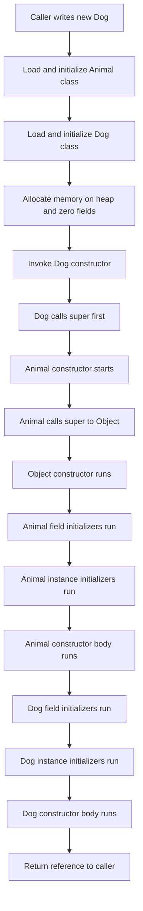
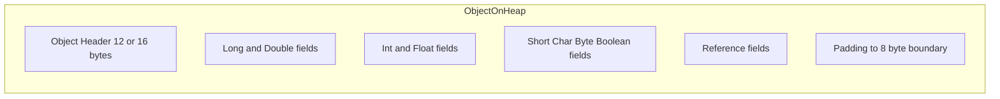
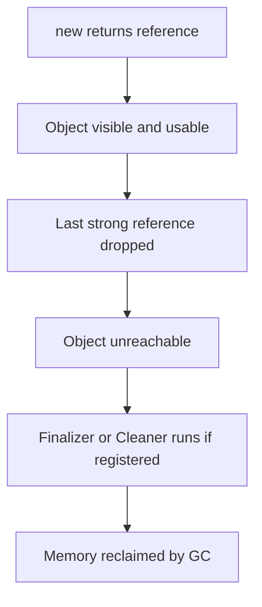

# 02.1. Classes, Objects, and Constructors

## Overview

Classes, objects, and constructors form the absolute foundation of every Java program. A class is the blueprint that defines the shape, behavior, and identity of a family of values. An object is a concrete realization of that blueprint, living in the Java heap with its own state and identity. A constructor is the special machinery that the Java runtime invokes to bring a new object into existence, initialize its fields, and prepare it for use. Mastering these three primitives is the gateway to every more advanced topic in this roadmap: encapsulation, inheritance, polymorphism, design patterns, and even concurrency models all build directly on the rules established here.

In this note we go far beyond the typical "a class is a blueprint" cliché. We explore the full lifecycle of an object, the precise initialization order that the JVM follows when you write `new`, the difference between constructors and static factory methods, the role of initialization blocks, the modern record syntax introduced in Java 14 and finalized in Java 16, and the sealed classes of Java 17 that let you build closed hierarchies. We end with a deep dive into the JVM memory model for objects, common pitfalls, and a bank of interview questions with model answers.

By the end of this note you should be able to read any production Java class declaration and predict exactly what happens when it is instantiated, in what order, and with what memory cost.

## Background Knowledge

Before diving into classes and constructors, make sure you are comfortable with the following prerequisites from Phase 1 of this roadmap:

- Primitive types (`int`, `long`, `double`, `boolean`, `char`, etc.) and reference types.
- Variables, fields, and the difference between local variables, instance fields, and static fields.
- The `static` keyword and what it means for a member to belong to a class rather than an instance.
- The Java package system and how `import` statements work.
- The `final` keyword as applied to variables.
- Basic understanding of the JVM stack and heap.

A quick refresher: the JVM allocates local variables and method frames on the thread stack, while objects themselves live on the shared heap. The reference returned by `new` is a value on the stack that points to an object on the heap. This separation is critical when we discuss constructors, because every constructor first calls a superclass constructor (either implicitly or via `super(...)`) before doing any of its own work.

## What Is a Class

A class is a named template that bundles two kinds of members: state (fields) and behavior (methods). It also defines a contract for how its instances should be created, by declaring one or more constructors. In Java, every class implicitly extends `java.lang.Object` unless it explicitly extends another class, which means every object in the language inherits the methods defined on `Object`: `equals`, `hashCode`, `toString`, `clone`, `getClass`, `wait`, `notify`, and `notifyAll`. We will explore those in detail in note 02.7.

A minimal class declaration has the following shape:

```java
// A class declaration with one field, one method, and one constructor.
public class Book {

    // Instance field: each Book object gets its own copy.
    private String title;

    // Constructor: shares the class name, has no return type.
    public Book(String title) {
        // 'this' refers to the object currently being constructed.
        this.title = title;
    }

    // Method: behavior that operates on the instance state.
    public String describe() {
        return "Book titled " + title;
    }
}
```

The Java Language Service allows a long list of modifiers in front of the `class` keyword: `public`, `final`, `abstract`, `sealed`, `non-sealed`, `strictfp`, and the strict module access modifiers. For day to day code, the most important are `public`, `final`, and `abstract`. A `final` class cannot be subclassed, which is a strong design choice used by `String`, `Integer`, and the wrapper classes. An `abstract` class cannot be instantiated directly and exists only to be extended.

## What Is an Object

An object is a runtime instance of a class. When you write `new Book("Effective Java")`, the JVM does the following things in order:

1. It allocates a contiguous block of memory on the heap large enough to hold the object header and all of its instance fields.
2. It zeroes out that memory, which means every field starts with its default value: `0` for numeric primitives, `false` for `boolean`, `'\u0000'` for `char`, and `null` for references.
3. It invokes the constructor chain, starting from the topmost superclass constructor down to the most derived class, allowing each constructor to initialize its own fields and run its instance initializer blocks.
4. It returns a reference to the fully constructed object, which is then assigned to the variable on the left side of the `=` operator.

The object identity is the address in the heap. Two distinct `new` expressions always produce two distinct objects, even if every field has the same value. Equality of identity is tested with the `==` operator, while equality of content is tested with the `equals` method (see note 02.7).

```java
Book a = new Book("Clean Code");
Book b = new Book("Clean Code");

System.out.println(a == b);        // false: different heap addresses
System.out.println(a.equals(b));   // depends on how Book.equals is implemented
```

## Fields: Instance vs Static vs Local

A field is a variable declared directly inside a class body but outside any method or constructor. There are three flavors that you must distinguish carefully.

```java
public class Counter {

    // Static field: one copy shared by every instance of Counter.
    private static int instanceCount = 0;

    // Instance field: each Counter object gets its own id.
    private final int id;

    // Constant: static and final, compile-time constant if possible.
    public static final String Category = "counter";

    public Counter() {
        instanceCount++;
        this.id = instanceCount;
    }

    public int currentId() {
        // Local variable: lives only inside this method frame.
        int snapshot = id;
        return snapshot;
    }
}
```

Static fields are sometimes called class variables. They live in a metadata structure associated with the class itself, not with any individual instance. They are loaded when the class is first referenced and stay alive until the class is unloaded, which for most applications means until the JVM exits. This makes static fields a common source of memory leaks if they hold references to large object graphs.

Instance fields live inside each object. Their default values come from the heap zeroing step described above, and their explicit initialization happens during constructor execution.

Local variables live on the thread stack, inside the frame of the method that declares them. They do not get default initialization: the compiler will refuse to let you read a local variable that has not been definitely assigned.

## Methods: Instance vs Static vs Final

A method is a named block of code that can be invoked on an object (instance method) or on the class itself (static method). Instance methods receive an implicit `this` parameter that refers to the receiver, while static methods do not.

```java
public class Geometry {

    // Static utility method: no 'this' needed.
    public static double areaOfCircle(double radius) {
        return Math.PI * radius * radius;
    }

    // Instance method: uses 'this' implicitly to access fields.
    public double circumference(double radius) {
        return 2 * Math.PI * radius;
    }
}
```

A `final` method cannot be overridden by subclasses. This is useful when a class wants to expose an invariant algorithm while still allowing other parts of itself to be subclassed. The template method pattern (see note 16.x) leans heavily on `final` methods that call non-final hook methods.

## Constructors: The Basics

A constructor is a special block of code that runs once, when an object is created, to bring it from the zeroed state produced by the JVM into a usable state. Constructors look like methods but differ in three important ways:

1. They share the exact name of the class (including case).
2. They have no return type, not even `void`.
3. They are not inherited: subclasses must declare their own constructors, although they can delegate to superclass constructors via `super(...)`.

```java
public class Point {

    private final double x;
    private final double y;

    // Constructor with two parameters.
    public Point(double x, double y) {
        this.x = x;
        this.y = y;
    }

    // Overloaded constructor: delegates to the two-argument form.
    public Point() {
        this(0.0, 0.0);
    }
}
```

If you do not declare any constructor at all, the compiler synthesizes a default no-argument constructor that simply calls `super()`. The moment you declare any constructor, the synthetic default disappears, and callers must use one of the constructors you provided.

## Default Constructor vs No-Arg Constructor

People sometimes conflate the term default constructor with the term no-argument constructor, but they are not the same. The default constructor is the one the compiler synthesizes for you when you write zero explicit constructors. A no-argument constructor is one that you write yourself with an empty parameter list. The two coincide in shape but differ in origin: the former is implicit, the latter is explicit.

This distinction matters for frameworks like Hibernate, Jackson, and Spring Data that rely on reflection to instantiate classes. Those frameworks typically need a no-argument constructor available, and they often need it to be at least package-private. If your only constructor takes arguments, the framework will fail to materialize your objects unless you provide a workaround (such as a Jackson `@JsonCreator` or a JPA `@PersistenceConstructor`).

## Constructor Chaining with this and super

Inside a constructor, the very first statement must be either a call to another constructor of the same class using `this(...)` or a call to a superclass constructor using `super(...)`. If you write neither, the compiler inserts an implicit `super()` call with no arguments. This rule guarantees that every superclass constructor runs before any subclass constructor body, which is essential for correctness: a subclass constructor cannot safely use inherited fields until the superclass has had a chance to initialize them.

```java
public class Animal {
    protected String name;
    public Animal(String name) {
        this.name = name;
        System.out.println("Animal constructor ran for " + name);
    }
}

public class Dog extends Animal {
    private String breed;
    public Dog(String name, String breed) {
        super(name);          // must be the first statement
        this.breed = breed;
        System.out.println("Dog constructor ran for " + breed);
    }
}

// Usage:
Dog d = new Dog("Rex", "Labrador");
// Output:
// Animal constructor ran for Rex
// Dog constructor ran for Labrador
```

A constructor may also delegate to another constructor of the same class using `this(...)`. This is a powerful pattern for consolidating validation logic in a single canonical constructor while still offering convenience overloads.

```java
public class Money {
    private final long cents;

    // Canonical constructor with full validation.
    public Money(long cents) {
        if (cents < 0) {
            throw new IllegalArgumentException("Money cannot be negative");
        }
        this.cents = cents;
    }

    // Convenience constructor: parse a decimal string.
    public Money(String decimal) {
        this(parse(decimal));   // delegates to canonical constructor
    }

    private static long parse(String decimal) {
        // simplistic parser, ignoring edge cases for brevity
        double value = Double.parseDouble(decimal);
        return Math.round(value * 100);
    }
}
```

## Constructor Overloading

Just like methods, constructors can be overloaded as long as their parameter lists differ in arity, types, or ordering. The compiler resolves which overload to call using a process called overload resolution, which we explore in detail in note 02.4. For now, the practical advice is: prefer a small number of well-named constructors, or use the static factory pattern, instead of a dozen overloads that all do roughly the same thing.

The builder pattern (note 16.x) is the standard solution when a class has many optional parameters and you want to avoid telescoping constructor proliferation. The telescoping anti-pattern looks like this:

```java
// Anti-pattern: telescoping constructors.
public class Pizza {
    public Pizza() { ... }
    public Pizza(boolean cheese) { ... }
    public Pizza(boolean cheese, boolean pepperoni) { ... }
    public Pizza(boolean cheese, boolean pepperoni, boolean mushrooms) { ... }
    public Pizza(boolean cheese, boolean pepperoni, boolean mushrooms, boolean onions) { ... }
}
```

Each new ingredient doubles the cognitive load on callers, who must remember whether the third `boolean` was mushrooms or onions. The builder pattern solves this elegantly by giving each parameter a name in the call site.

## Copy Constructors

A copy constructor takes a single argument of the same type as the class and produces a new instance whose state matches the argument. Java does not support copy constructors as a language feature (unlike C++), but the idiom is widely used.

```java
public class Person {
    private final String name;
    private final int age;

    public Person(String name, int age) {
        this.name = name;
        this.age = age;
    }

    // Copy constructor: produces a defensive copy.
    public Person(Person other) {
        this.name = other.name;
        this.age = other.age;
    }
}
```

Copy constructors are particularly useful for producing defensive copies of mutable inputs, for implementing the prototype pattern, and as an alternative to the problematic `Cloneable` interface discussed in note 02.7. Unlike `clone()`, copy constructors can be extended properly by subclasses (the subclass simply declares its own copy constructor), and they do not require the awkward `CloneNotSupportedException` machinery.

## Initialization Blocks

In addition to field initializers and constructors, Java supports two kinds of initialization blocks: instance initializer blocks and static initializer blocks. Both look like free-floating code blocks placed directly in the class body.

```java
public class Configuration {

    private static final Map<String, String> Defaults;

    // Static initializer block: runs once, when the class is loaded.
    static {
        Defaults = new HashMap<>();
        Defaults.put("port", "8080");
        Defaults.put("host", "localhost");
        Defaults.put("timeout", "30");
    }

    private final List<String> log;

    // Instance initializer block: runs before every constructor body,
    // but after the implicit super() call.
    {
        log = new ArrayList<>();
        log.add("Instance initialized at " + Instant.now());
    }

    public Configuration() {
        // At this point 'log' is already non-null.
    }
}
```

Static initializers run in textual order the first time the class is referenced, in a class initialization lock that the JVM holds. Instance initializers run in textual order during every constructor invocation, interleaved with field initializers, after `super()` returns but before the constructor body executes. They are rarely needed in modern Java, but they are essential for anonymous classes that need complex initialization (anonymous classes cannot declare named constructors) and for shared setup logic that should run regardless of which constructor is called.

## Initialization Order: The Complete Picture

This is one of the most frequently tested topics in Java interviews. The full initialization sequence for a single object of class `Dog extends Animal` is:

1. The class `Animal` is loaded and initialized if it has not been already (static fields and static blocks of `Animal` run, in textual order).
2. The class `Dog` is loaded and initialized (static fields and static blocks of `Dog` run, in textual order).
3. The JVM allocates memory for a new `Dog` on the heap and zeroes all fields.
4. The `Dog` constructor is invoked. Its first act is to call `super(...)` (explicitly or implicitly).
5. The `Animal` constructor runs: it first calls `super()` (which is `Object`'s constructor), then runs `Animal`'s field initializers and instance initializers in textual order, then runs the body of `Animal`'s constructor.
6. Control returns to `Dog`'s constructor. `Dog`'s field initializers and instance initializers run in textual order.
7. The body of `Dog`'s constructor runs.
8. The reference to the fully constructed `Dog` is returned to the caller.



A particularly nasty pitfall is to call an overridable method from a constructor. Because dynamic dispatch is in effect even during construction, the subclass version of the method will run before the subclass constructor body has had a chance to initialize its fields, leading to surprising null values. This is sometimes called the leaky constructor anti-pattern.

## Static Factory Methods

A static factory method is a static method that returns an instance of the class. It is often a better alternative to a public constructor for several reasons:

1. Unlike constructors, static factories have names, so they can express intent. `BigInteger.probablePrime(int, Random)` is clearer than `new BigInteger(...)` would be.
2. Unlike constructors, static factories are not required to create a new object each time. They can return cached instances, as `Boolean.valueOf(boolean)` does, or return a subclass, as `Collections.emptyList()` does.
3. Unlike constructors, static factories can return any subtype of their return type. This is the foundation of interface-based frameworks like Java's Collections Framework and the ServiceLoader API.

```java
public class Color {

    private final int rgb;

    // Private constructor: only the static factories can build one.
    private Color(int rgb) {
        this.rgb = rgb;
    }

    public static Color fromRgb(int rgb) {
        return new Color(rgb);
    }

    public static Color fromHex(String hex) {
        int value = Integer.parseInt(hex.replace("#", ""), 16);
        return new Color(value);
    }

    public static Color black() {
        return new Color(0x000000);
    }

    public static Color white() {
        return new Color(0xFFFFFF);
    }
}
```

The trade-off is that classes without public or protected constructors cannot be subclassed, which is sometimes a feature (it forces composition) and sometimes a limitation. Also, static factories are not visually distinguishable from any other static method, so the convention is to use well-known names like `valueOf`, `of`, `getInstance`, `newInstance`, `create`, and `from`.

## Records: The Modern Class for Immutable Data

Java 14 introduced records as a preview feature, and Java 16 finalized them. A record is a special form of class whose primary purpose is to carry transparently immutable data. The compiler generates the constructor, accessor methods, `equals`, `hashCode`, and `toString` for you, following well-tested contracts.

```java
public record Point(double x, double y) {

    // You can add a compact constructor for validation.
    public Point {
        if (Double.isNaN(x) || Double.isNaN(y)) {
            throw new IllegalArgumentException("Coordinates must be numbers");
        }
    }

    // You can add extra methods and even extra fields, but they must be static.
    public static Point origin() {
        return new Point(0.0, 0.0);
    }

    public double distanceTo(Point other) {
        double dx = x - other.x;
        double dy = y - other.y;
        return Math.sqrt(dx * dx + dy * dy);
    }
}
```

Records are implicitly final and cannot extend any other class. They can implement interfaces, however. They are perfect for DTOs, value objects, configuration tuples, and return types from stream pipelines. The accessor methods use the field name directly (so `point.x()` rather than `point.getX()`), which can feel unfamiliar at first but composes nicely with method references and pattern matching.

## Sealed Classes: Controlled Inheritance

Java 17 introduced sealed classes and sealed interfaces, which let you declare a closed hierarchy: only the classes you explicitly permit may extend or implement a sealed type. This enables exhaustive pattern matching in switch expressions and gives library authors precise control over their type lattices.

```java
public sealed Shape permits Circle, Square, Triangle {}

public final class Circle   extends Shape { /* ... */ }
public final class Square   extends Shape { /* ... */ }
public final class Triangle extends Shape { /* ... */ }
```

Every permitted subclass must itself be `final`, `sealed`, or `non-sealed`. The compiler knows the complete set of subclasses at compile time, which makes switch expressions exhaustive without a default branch:

```java
public double area(Shape shape) {
    return switch (shape) {
        case Circle c    -> Math.PI * c.radius() * c.radius();
        case Square s    -> s.side() * s.side();
        case Triangle t  -> 0.5 * t.base() * t.height();
    };
}
```

## Memory Layout of an Object

Every object on the HotSpot heap has a header of either 12 bytes (with compressed oops on a 64-bit JVM) or 16 bytes (without). The header consists of:

- A mark word containing identity hash code, age bits for the garbage collector, and lock state bits.
- A class pointer indicating the runtime class of the object.

After the header come the instance fields, laid out by the JVM in a memory-efficient order that groups longs and doubles first, then ints, then shorts and chars, then bytes, then references. This layout padding can be observed with the JOL (Java Object Layout) tool, which is invaluable when you are trying to minimize memory footprint in high-throughput systems.



The practical implication is that small classes with one or two reference fields can still cost 24 or 32 bytes each, because of header and alignment overhead. When you store millions of small objects, switching from boxed wrappers to primitives (or to primitive-specialized libraries like Eclipse Collections) can dramatically reduce heap pressure.

## Object Lifecycle

An object's life has four phases: creation, visible use, unreachable, and collected. The garbage collector reclaims memory once no thread can reach the object through any chain of live references. Finalizers (`finalize()` methods) ran before reclamation in old Java versions, but they were deprecated in Java 9 and removed for default behavior in Java 18, replaced by `Cleaner` API which uses phantom references and is much safer.



## Common Pitfalls

1. Calling overridable methods from a constructor. The subclass override will run with un-initialized fields, leading to subtle bugs. Mark methods called from constructors as `private`, `static`, or `final`.

2. Forgetting to call `super(...)` explicitly when the superclass has no no-argument constructor. The compiler will emit an error, but the fix is to add an explicit `super(...)` call with the right arguments.

3. Using `==` to compare object contents. This compares references, not values. Use `equals` instead, and remember to override `equals` and `hashCode` together (see note 02.7).

4. Leaking the `this` reference from a constructor. If you pass `this` to another thread or register it as a listener before the constructor finishes, the other code may observe a partially constructed object.

5. Forgetting that static fields persist for the entire JVM lifetime. A static field that holds a reference to a large object graph will prevent that graph from being garbage collected, which is one of the most common memory leaks in long-running applications.

6. Confusing field initialization order. Field initializers and instance initializer blocks run in textual order, after `super()` returns but before the constructor body. Reordering them can change behavior.

7. Overusing mutable static state. Static fields are not thread-safe by default. Use `AtomicReference`, locks, or immutable data instead.

8. Relying on finalize for cleanup. Use try-with-resources for `AutoCloseable` resources and `Cleaner` for native resources.

9. Using public mutable fields. This breaks encapsulation and prevents you from later adding validation, notification, or lazy loading.

10. Declaring many constructors with similar parameter lists. Use the builder pattern instead.

## Tips and Tricks

- Mark value-like classes as `final` and use records whenever possible. They give you correct `equals`, `hashCode`, and `toString` for free, and they prevent subclasses from breaking invariants.
- Prefer static factory methods over public constructors. They are more expressive and let you return cached or subclass instances.
- Always validate arguments inside the canonical constructor and reject bad inputs early. Fail-fast code is much easier to debug.
- Make defensive copies of mutable inputs in constructors. If your constructor takes a `Date` or a `List`, copy the data into a private field that only your class can see.
- Use `var` for local variables when the right-hand side makes the type obvious (`var book = new Book(...)`), but spell out the type when it adds clarity (`Book book = loadFromDisk()`).
- Use sealed classes when you have a closed set of variants. They make switch expressions exhaustive and enable pattern matching.
- Consider the canonical constructor pattern: one constructor that fully initializes the object, with all other constructors delegating to it through `this(...)`.
- Use `Objects.requireNonNull` for null checks on every required reference parameter.
- Profile with JOL when you are designing classes that will be instantiated millions of times.
- For configuration data, prefer records with validation in a compact constructor over mutable POJOs with dozens of setters.

## Interview Questions

**Q1. What is the difference between a class and an object?**
A class is a compile-time blueprint that defines fields and methods. An object is a runtime instance of a class, living on the heap with its own state and identity. Many objects can be created from a single class.

**Q2. What happens when you write `new Foo()`?**
The JVM allocates memory on the heap, zeroes all fields, then runs the constructor chain starting from `Object` down to `Foo`. Field initializers and instance initializer blocks run between the `super()` call and the constructor body. Finally, a reference to the fully constructed object is returned.

**Q3. What is the difference between a default constructor and a no-argument constructor?**
The default constructor is the synthetic one the compiler generates when you declare no constructors at all. A no-argument constructor is one you write explicitly. They are identical in shape but differ in origin: one is implicit, the other explicit.

**Q4. Can a constructor return a value?**
No. Constructors have no return type, not even `void`. The `new` operator always returns the reference to the newly allocated object; the constructor itself returns nothing.

**Q5. Why must `this(...)` or `super(...)` be the first statement in a constructor?**
Because the superclass must be fully initialized before any subclass code runs. By forcing the call to be first, the language guarantees that no field of the subclass can be read or written before `super()` has returned.

**Q6. What is constructor chaining?**
Constructor chaining is the practice of one constructor calling another, either in the same class via `this(...)` or in a superclass via `super(...)`. It lets you centralize initialization logic in a canonical constructor while offering convenience overloads.

**Q7. What is the difference between static factory methods and constructors?**
Static factories have names, can return cached or subclass instances, and are not required to allocate a new object. Constructors are unnamed, always create a new object of the exact declared type, and cannot be overridden.

**Q8. What is a copy constructor and why use it instead of `clone()`?**
A copy constructor takes an instance of the same class and produces a new instance with the same state. It is preferred over `clone()` because it is type-safe, works correctly with subclasses, and does not require the awkward `Cloneable` marker interface.

**Q9. What is the order of initialization for a subclass object?**
Static initializers of the superclass, then static initializers of the subclass, then heap allocation and field zeroing, then `super()` chain down from `Object`, then field initializers and instance initializers of the superclass, then superclass constructor body, then field initializers and instance initializers of the subclass, then subclass constructor body.

**Q10. Why is it bad to call an overridable method from a constructor?**
Because dynamic dispatch still works during construction. The subclass version of the method will run before the subclass constructor body has had a chance to initialize its fields, leading to null reads, incorrect state, and subtle bugs.

**Q11. What is a record and when should you use it?**
A record is a special form of class for transparently immutable data. The compiler generates the constructor, accessors, `equals`, `hashCode`, and `toString`. Use records for DTOs, value objects, configuration tuples, and any case where the class exists primarily to carry data.

**Q12. What is a sealed class and why use it?**
A sealed class explicitly lists the classes permitted to extend it. It gives library authors precise control over their type hierarchies and enables exhaustive pattern matching in switch expressions without a default branch.

**Q13. What is the difference between `==` and `equals`?**
`==` compares references for object types and values for primitives. `equals` compares logical content, but only if the class overrides `equals` to define what logical content means. The default `Object.equals` falls back to `==`.

**Q14. How does the JVM lay out an object in memory?**
Every object starts with a header (mark word plus class pointer, 12 or 16 bytes), followed by instance fields grouped by type for alignment efficiency, with padding to an 8-byte boundary. Use the JOL tool to inspect actual layouts.

**Q15. What is a static initializer and when does it run?**
A static initializer is a `static {}` block in the class body. It runs once, when the class is first loaded, in textual order with other static field initializers. It is commonly used to initialize complex static collections or to register JNI libraries.

## Summary

Classes, objects, and constructors are the bedrock of every Java program. A class declares the shape, behavior, and creation protocol of a family of values. An object is a heap-resident instance with its own identity, state, and lifetime. A constructor is the special machinery that the JVM uses to bring an object from a zeroed heap region into a usable state, following a strict sequence of `super()` calls, field initializers, instance initializers, and constructor bodies.

We examined the difference between default and no-argument constructors, the rules of constructor chaining with `this` and `super`, the role of initialization blocks, the powerful alternative of static factory methods, and the modern syntax of records and sealed classes. We walked through the complete initialization order, the memory layout of objects, and a list of common pitfalls that catch even experienced engineers off guard.

With these foundations in place, you are ready to tackle the four pillars of object-oriented programming in note 02.2, where we will build on this knowledge to explore encapsulation, inheritance, polymorphism, and abstraction in depth.
