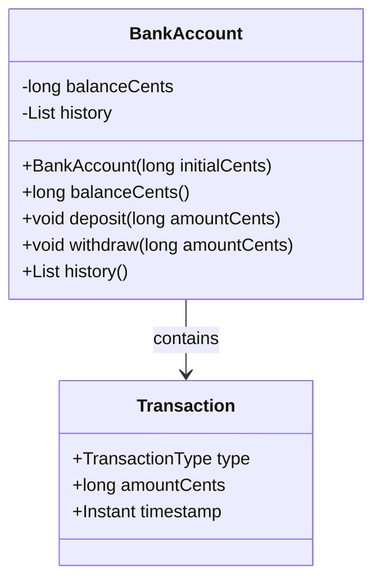
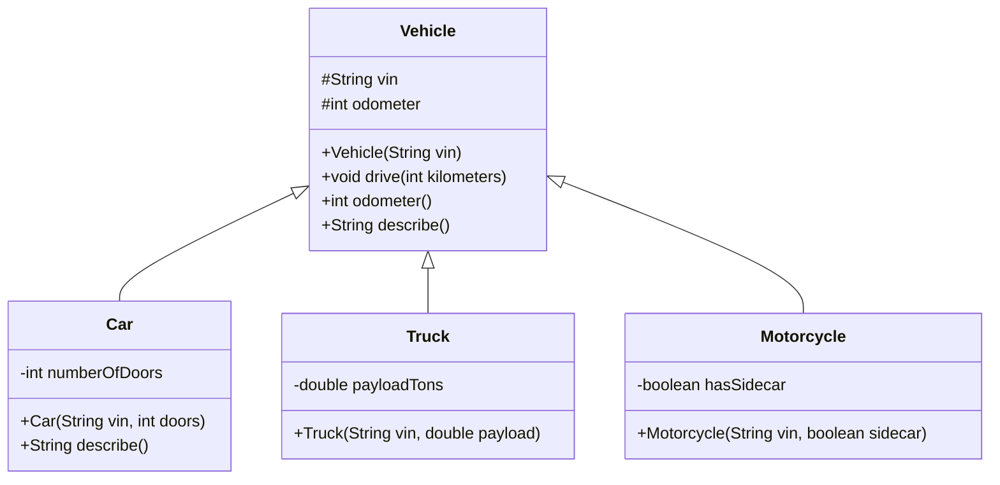
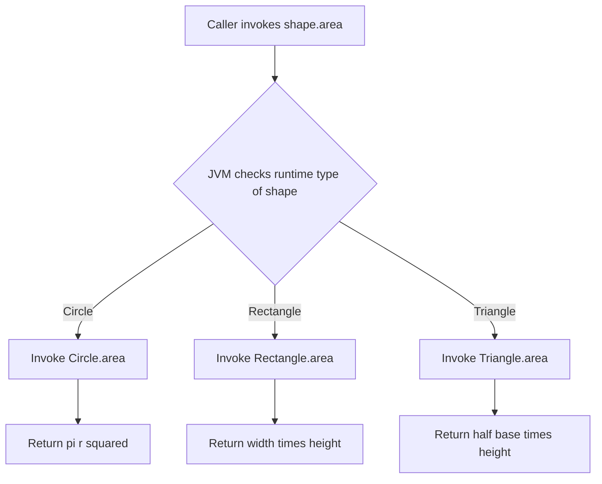
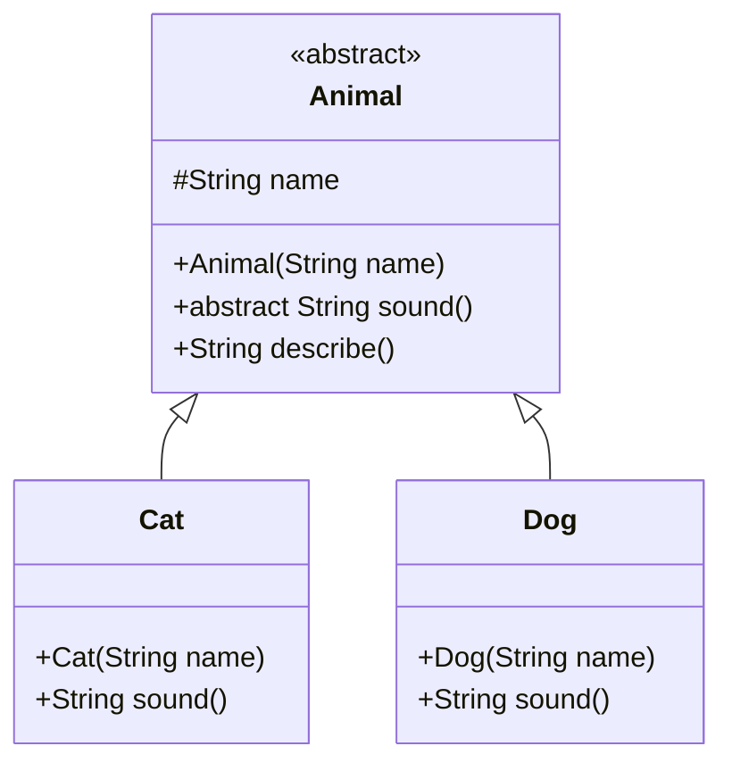
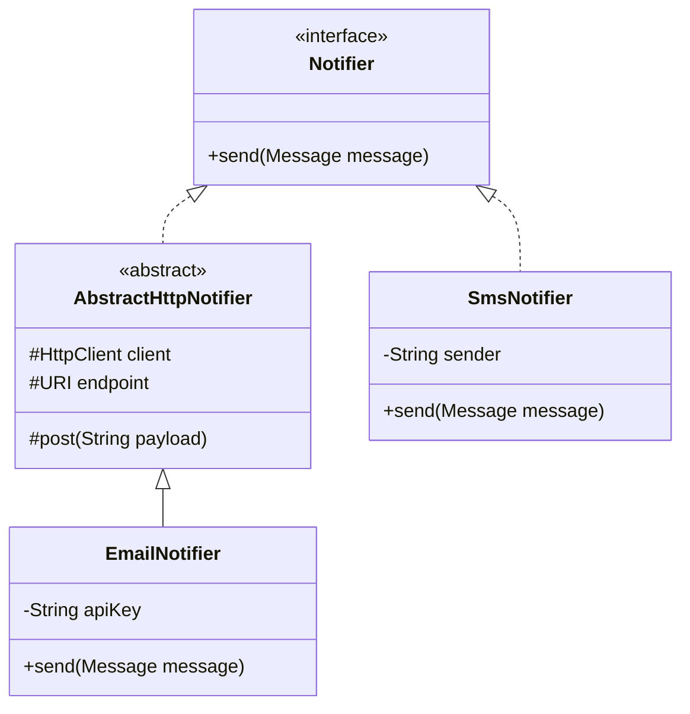

# 02.2. The Four Pillars of OOP

## Overview

Object-oriented programming rests on four design pillars that together describe almost every meaningful decision a developer makes when shaping a system: encapsulation, inheritance, polymorphism, and abstraction. Encapsulation is about bundling state and behavior in a single unit while hiding the messy implementation details behind a stable surface. Inheritance is about expressing an is-a relationship between types so that code can be reused and extended. Polymorphism is about letting the same call site invoke different concrete behavior depending on the runtime type of the receiver. Abstraction is about focusing on what a thing does rather than how it does it, so that you can reason about a system at the right level of detail without being overwhelmed by mechanics.

These four ideas are not independent. They reinforce one another. Encapsulation gives inheritance something stable to extend, because the protected invariants of a class are expressed through its private fields and the methods that mutate them. Polymorphism requires inheritance (or interface implementation) to be meaningful, because you need a shared type to dispatch against. Abstraction is what makes polymorphism valuable: without abstraction, the call site would still need to know which concrete type it was invoking. Together, these pillars let you build systems that are simultaneously expressive, extensible, and maintainable.

In this note we will explore each pillar in depth, with Java 21 syntax, real-world examples, Mermaid diagrams, and a healthy skepticism about when each pillar should and should not be applied. The goal is not to memorize definitions but to develop the engineering judgment required to choose the right combination of techniques for a given problem.

## Background Knowledge

Before reading this note, you should be comfortable with the following from Phase 1 and note 02.1:

- Classes, objects, and constructors, including the initialization order of fields and constructors.
- The `static` and `final` keywords as applied to fields, methods, and classes.
- The difference between reference equality (`==`) and content equality (`equals`).
- The package system and how `import` works.
- The Java type hierarchy: every class implicitly extends `java.lang.Object`.
- The basics of access modifiers: `public`, `protected`, package-private, and `private`.

We will build on these foundations to show how encapsulation is enforced, how inheritance composes constructors and fields, how polymorphism is implemented by the JVM through dynamic dispatch, and how abstraction is expressed through abstract classes and interfaces (the latter is treated more fully in note 02.3).

## Pillar One: Encapsulation

Encapsulation is the practice of bundling state and behavior together inside a class and exposing only a carefully designed public surface, while keeping the internal machinery private. The benefits are twofold. First, the class can enforce invariants: it can refuse to put itself into an invalid state. Second, the implementation can change without breaking callers, because callers only ever interacted with the public surface.

A canonical example is a bank account class. A naive version might expose the balance as a public field:

```java
// Bad: exposes internals, no invariant enforcement.
public class BankAccount {
    public long balance;
}
```

Anyone can write `account.balance = -1000000;` and the class cannot prevent it. Worse, if you later want to add auditing, overdraft protection, or currency conversion, you have to find and modify every call site in the codebase.

The encapsulated version hides the field behind methods:

```java
public class BankAccount {

    private long balanceCents;
    private final List<Transaction> history = new ArrayList<>();

    public BankAccount(long initialCents) {
        if (initialCents < 0) {
            throw new IllegalArgumentException("Initial balance cannot be negative");
        }
        this.balanceCents = initialCents;
    }

    public long balanceCents() {
        return balanceCents;
    }

    public void deposit(long amountCents) {
        if (amountCents <= 0) {
            throw new IllegalArgumentException("Deposit must be positive");
        }
        balanceCents += amountCents;
        history.add(new Transaction(TransactionType.DEPOSIT, amountCents, Instant.now()));
    }

    public void withdraw(long amountCents) {
        if (amountCents <= 0) {
            throw new IllegalArgumentException("Withdrawal must be positive");
        }
        if (amountCents > balanceCents) {
            throw new IllegalStateException("Insufficient funds");
        }
        balanceCents -= amountCents;
        history.add(new Transaction(TransactionType.WITHDRAWAL, amountCents, Instant.now()));
    }

    public List<Transaction> history() {
        // Defensive copy: callers cannot mutate our internal list.
        return List.copyOf(history);
    }
}
```

Now the class enforces invariants: balances cannot go negative, deposits and withdrawals must be positive, and the transaction history is immutable to outside code. The internal representation (a `List<Transaction>`) can later be swapped for a more efficient structure without breaking any caller.



Encapsulation is enforced by the access modifiers `private`, package-private (no modifier), `protected`, and `public`, which are explored in detail in note 02.6. The general principle is to start strict and loosen later: prefer `private` fields, package-private methods, and `public` only on the API you intend to expose. Java records compromise slightly on this principle: their components are exposed via accessor methods named after the field, and the fields themselves are immutable, but the underlying data is still visible to callers. That trade-off is acceptable because records are intended to be transparent data carriers rather than behavior-rich abstractions.

### Immutability as Encapsulation

A particularly strong form of encapsulation is immutability. An immutable class is one whose instances cannot change state after construction. Immutable classes are automatically thread-safe, can be shared freely without defensive copies, and make excellent map keys and set elements. The recipe for an immutable class is:

1. Mark all fields `final`.
2. Mark the class `final` (or use records, which are final by default).
3. Do not provide any mutating methods.
4. Do not leak mutable references: if a field is a mutable type, either copy it in the constructor and accessor, or expose only an unmodifiable view.

```java
public final class Money {

    private final long cents;
    private final Currency currency;

    public Money(long cents, Currency currency) {
        if (cents < 0) throw new IllegalArgumentException("cents must be non-negative");
        this.cents = cents;
        this.currency = Objects.requireNonNull(currency);
    }

    public long cents() { return cents; }
    public Currency currency() { return currency; }

    public Money plus(Money other) {
        if (!currency.equals(other.currency)) {
            throw new IllegalArgumentException("Currencies must match");
        }
        return new Money(cents + other.cents, currency);
    }

    public Money minus(Money other) {
        if (!currency.equals(other.currency)) {
            throw new IllegalArgumentException("Currencies must match");
        }
        long result = cents - other.cents;
        if (result < 0) {
            throw new IllegalArgumentException("Result cannot be negative");
        }
        return new Money(result, currency);
    }
}
```

Notice that `plus` and `minus` return new `Money` instances rather than mutating `this`. This is the functional style of object design, and it pairs beautifully with streams and concurrency.

## Pillar Two: Inheritance

Inheritance is the mechanism by which one class declares that it is a kind of another class, reusing its fields and methods and adding or specializing its own. Java supports single inheritance for classes (a class may have at most one superclass) but multiple inheritance of type through interfaces (a class may implement many interfaces).

```java
public class Vehicle {
    protected final String vin;
    protected int odometer;

    public Vehicle(String vin) {
        this.vin = Objects.requireNonNull(vin);
    }

    public void drive(int kilometers) {
        if (kilometers < 0) throw new IllegalArgumentException();
        odometer += kilometers;
    }

    public int odometer() {
        return odometer;
    }

    public String describe() {
        return "Vehicle " + vin + " with " + odometer + " km";
    }
}

public class Car extends Vehicle {
    private final int numberOfDoors;

    public Car(String vin, int numberOfDoors) {
        super(vin);              // must call superclass constructor first
        this.numberOfDoors = numberOfDoors;
    }

    @Override
    public String describe() {
        return "Car " + vin + " with " + numberOfDoors + " doors and " + odometer + " km";
    }
}
```

The keyword `extends` declares inheritance. The subclass automatically gains every non-private field and method of the superclass. Constructors are not inherited, but the subclass constructor must call one of them via `super(...)`.



### When to Use Inheritance

Inheritance is appropriate when the subclass truly is a subtype of the superclass: every place that expects a `Vehicle` should be able to accept a `Car` without surprise. This is the Liskov Substitution Principle, the L in SOLID, and it is the litmus test for whether inheritance is the right design. If your subclass violates the contract of the superclass (for example, by throwing on inputs the superclass would accept, or by changing return types in incompatible ways), inheritance is the wrong choice and composition should be used instead.

In practice, inheritance is overused in Java codebases. Many inheritance hierarchies are actually composition relationships mislabeled, and many subclasses exist only to reuse a few methods of their parent rather than to express a true is-a relationship. Joshua Bloch's Effective Java item 18 famously advises "favor composition over inheritance," and we will examine this in detail in note 02.5.

### What Gets Inherited

The subclass inherits:

- All non-private instance fields and static fields (subject to package access).
- All non-private instance methods and static methods (subject to package access).
- All nested types (subject to access modifiers).
- The obligation to call a superclass constructor.

The subclass does not inherit:

- Constructors.
- Private fields and methods (these exist in the heap, but the subclass cannot name them directly; it can only interact with them through inherited non-private methods).
- The initialization blocks of the superclass (though they still run during construction).

### The Object Class as Universal Superclass

Every Java class implicitly extends `java.lang.Object` unless it explicitly extends another class. This means every object in the language inherits the methods `equals`, `hashCode`, `toString`, `getClass`, `clone`, `finalize` (deprecated), `wait`, `notify`, and `notifyAll`. The last three are part of the Java monitor mechanism for thread synchronization, which we cover in note 07.x on concurrency. The first four are covered in detail in note 02.7.

## Pillar Three: Polymorphism

Polymorphism, from Greek roots meaning "many forms," is the ability of a single call site to dispatch to different concrete implementations depending on the runtime type of the receiver. In Java this works through dynamic dispatch: the JVM looks up the actual class of the object at runtime and invokes the most specific override of the method.

```java
public abstract class Shape {
    public abstract double area();
}

public final class Circle extends Shape {
    private final double radius;
    public Circle(double radius) { this.radius = radius; }
    @Override public double area() { return Math.PI * radius * radius; }
}

public final class Rectangle extends Shape {
    private final double width;
    private final double height;
    public Rectangle(double width, double height) {
        this.width = width;
        this.height = height;
    }
    @Override public double area() { return width * height; }
}

public class GeometryDemo {
    public static double totalArea(List<Shape> shapes) {
        double sum = 0;
        for (Shape s : shapes) {
            sum += s.area();   // dynamic dispatch picks the right override
        }
        return sum;
    }
}
```

The call `s.area()` is statically typed as `Shape.area()`, but at runtime the JVM checks the actual class of `s` and invokes `Circle.area()` or `Rectangle.area()` as appropriate. This is called runtime polymorphism or dynamic dispatch.



There is also a compile-time form of polymorphism called overload resolution, where the compiler chooses among several methods of the same name based on the static types of the arguments. We cover this in detail in note 02.4. The two forms are independent: you can have overloading without overriding, overriding without overloading, or both at once.

### Why Polymorphism Matters

Polymorphism is what lets you write code that is open for extension but closed for modification (the open-closed principle, the O in SOLID). You can write a method that operates on `Shape` once, and then add new shape classes years later without touching the original method. The dispatch mechanism makes the new behavior available automatically. This is the foundation of every extensible framework in the Java ecosystem, from servlet containers to Spring beans to JPA entity listeners.

### Polymorphism and Type Tests

Sometimes you need to do something different per concrete type that cannot be expressed as a single method on the supertype. The classic pre-Java 16 approach is a chain of `instanceof` checks and casts. Java 16 introduced pattern matching for `instanceof`, and Java 21 finalized pattern matching for switch, both of which make this much more pleasant:

```java
public String describe(Shape shape) {
    return switch (shape) {
        case Circle c    -> "a circle of radius " + c.radius();
        case Rectangle r -> "a rectangle " + r.width() + " by " + r.height();
        case Triangle t  -> "a triangle with base " + t.base();
        // No default needed if Shape is sealed and we cover all permitted subclasses.
    };
}
```

Pattern matching is especially powerful when combined with sealed types, because the compiler can verify exhaustiveness.

## Pillar Four: Abstraction

Abstraction is the practice of modeling a system at the right level of detail for the problem at hand, hiding implementation mechanics that callers do not need to know about. Abstraction is what lets you talk about a `List` without caring whether it is an `ArrayList` or a `LinkedList`, what lets you talk about an `ExecutorService` without caring whether it runs tasks on a single thread or a pool, and what lets you talk about an `HttpClient` without caring whether it uses NIO or blocking I/O.

In Java, abstraction is expressed through two language features: abstract classes and interfaces. Both let you declare a type with methods but defer the implementation to subclasses or implementers.

```java
public abstract class Animal {

    protected final String name;

    protected Animal(String name) {
        this.name = name;
    }

    // Abstract method: declared but not implemented here.
    public abstract String sound();

    // Concrete method: shared implementation for all subclasses.
    public String describe() {
        return name + " says " + sound();
    }
}

public class Cat extends Animal {
    public Cat(String name) { super(name); }
    @Override public String sound() { return "meow"; }
}

public class Dog extends Animal {
    public Dog(String name) { super(name); }
    @Override public String sound() { return "woof"; }
}
```



An abstract class can have constructors, fields, concrete methods, and abstract methods. It cannot be instantiated directly. A subclass must implement every abstract method (or itself be declared abstract). Interfaces, by contrast, cannot have instance fields or constructors, but they can have static fields, abstract methods, default methods, static methods, and (since Java 9) private methods. Interfaces are covered in full in note 02.3.

### Abstraction vs Encapsulation

These two pillars are easy to conflate. Encapsulation is about hiding implementation details behind a stable API; it is a property of a single class. Abstraction is about raising the level of discourse to what matters, ignoring how it is done; it is a property of a type hierarchy or API surface. A class can be encapsulated without being abstract (a `String` is fully encapsulated but concrete), and a type can be abstract without being well encapsulated (an interface that exposes a dozen leaky methods is abstract but poorly designed).

### Choosing Between Abstract Classes and Interfaces

The choice between an abstract class and an interface comes down to a few questions:

1. Do you need to share state (instance fields) across implementations? Use an abstract class; interfaces cannot have instance fields.
2. Do you need to share a constructor or protected methods? Use an abstract class.
3. Do you need to allow implementations to also extend another class? Use an interface; classes can implement many interfaces but extend only one.
4. Do you want a pure capability type with no inheritance baggage? Use an interface.

In modern Java, the trend is to prefer interfaces whenever possible, reserving abstract classes for cases where shared state or constructors are truly needed. Java 8's default methods gave interfaces most of the expressive power they were previously missing, and Java 9's private interface methods completed the picture.

## How the Four Pillars Work Together

Let us walk through a single example that exercises all four pillars at once. Consider a notification service that can deliver messages through email, SMS, or push notifications. The abstraction is the `Notifier` interface, which declares the single method `send`. Each concrete notifier encapsulates the details of its transport (SMTP, an HTTP API, a push gateway). The polymorphism is that callers can hold a `List<Notifier>` and fan out a message to all of them without knowing their concrete types. The inheritance, if any, is that some notifiers might share an `AbstractHttpNotifier` base class to reuse HTTP plumbing.

```java
public interface Notifier {
    void send(Message message);
}

public abstract class AbstractHttpNotifier implements Notifier {
    protected final HttpClient client;
    protected final URI endpoint;

    protected AbstractHttpNotifier(URI endpoint) {
        this.client = HttpClient.newHttpClient();
        this.endpoint = endpoint;
    }

    protected HttpResponse<String> post(String jsonPayload) throws IOException, InterruptedException {
        HttpRequest request = HttpRequest.newBuilder()
                .uri(endpoint)
                .header("Content-Type", "application/json")
                .POST(HttpRequest.BodyPublishers.ofString(jsonPayload))
                .build();
        return client.send(request, HttpResponse.BodyHandlers.ofString());
    }
}

public final class EmailNotifier extends AbstractHttpNotifier {
    private final String apiKey;

    public EmailNotifier(URI endpoint, String apiKey) {
        super(endpoint);
        this.apiKey = Objects.requireNonNull(apiKey);
    }

    @Override
    public void send(Message message) {
        try {
            String payload = toJson(message);
            post(payload);   // inherited helper
        } catch (Exception e) {
            throw new RuntimeException("Failed to send email", e);
        }
    }

    private String toJson(Message message) {
        // Simplified JSON construction; real code uses Jackson or Gson.
        return "{\"subject\":\"" + message.subject() + "\",\"body\":\"" + message.body() + "\"}";
    }
}

public final class SmsNotifier implements Notifier {
    private final String sender;
    public SmsNotifier(String sender) { this.sender = sender; }

    @Override
    public void send(Message message) {
        // Real implementation would call an SMS gateway.
        System.out.println("SMS from " + sender + ": " + message.body());
    }
}
```



The caller code is blissfully unaware of the concrete transports:

```java
public class NotificationService {

    private final List<Notifier> notifiers;

    public NotificationService(List<Notifier> notifiers) {
        this.notifiers = List.copyOf(notifiers);
    }

    public void broadcast(Message message) {
        for (Notifier n : notifiers) {
            n.send(message);   // polymorphic dispatch
        }
    }
}
```

This single example exercises all four pillars: abstraction through the `Notifier` interface, inheritance through `AbstractHttpNotifier`, polymorphism through the dynamic dispatch in `broadcast`, and encapsulation through the private fields and helpers in each notifier.

## Common Pitfalls

1. **Inheritance for code reuse.** Subclassing to reuse a few methods, when there is no is-a relationship, produces fragile hierarchies. Use composition instead.

2. **Leaking `this` from a constructor.** Anywhere a constructor passes `this` to outside code, the outside code may observe a partially constructed object. Avoid this pattern entirely.

3. **Calling overridable methods from a constructor.** The override runs before the subclass constructor body, so subclass fields are still at their default values. Mark such methods `private`, `static`, or `final`.

4. **Breaking the Liskov Substitution Principle.** A subclass that strengthens preconditions, weakens postconditions, or throws new checked exceptions breaks the superclass contract. Callers that depend on the supertype will fail in surprising ways.

5. **Using inheritance across package boundaries.** The implementation of a superclass can change in ways that break subclasses, even without recompiling them. This is why the JDK documents which classes are designed for subclassing and which are not.

6. **Forgetting to override `equals` and `hashCode` together.** If you override one, you must override the other, or your objects will misbehave in collections. See note 02.7.

7. **Exposing mutable internal state.** Returning the live reference to an internal `List`, `Map`, or array lets callers mutate your invariants. Return defensive copies or unmodifiable views.

8. **Treating interfaces as trivial.** A poorly designed interface is harder to evolve than a class, because every implementer must be updated. Spend time getting interfaces right.

9. **Overusing abstraction.** Premature abstraction (building frameworks before you have three concrete use cases) leads to speculative generality. Wait until the pattern is clear, then abstract.

10. **Confusing polymorphism with overloading.** Overloading is resolved at compile time based on static types; polymorphism is resolved at runtime based on the actual receiver. They behave differently and are not interchangeable.

## Tips and Tricks

- Design your public API in terms of interfaces, not concrete classes. This makes it easy to swap implementations and write tests with mocks.
- Mark classes `final` by default. Lift the restriction only when you have a deliberate reason to allow subclassing.
- Use records for transparent data classes; reserve regular classes for behavior-rich abstractions with invariants to enforce.
- Prefer composition for code reuse, especially across package boundaries. Inheritance is best reserved for closely co-designed types within the same package or module.
- When you do use inheritance, document the contract of every non-final method that subclasses might override. Specify the preconditions, postconditions, and side effects.
- Keep abstract classes small. The more state and behavior they contain, the harder they are to subclass correctly.
- Use sealed hierarchies when the set of variants is closed. They enable exhaustive pattern matching and prevent unwanted subclasses.
- Make defensive copies of mutable inputs in constructors and accessors. Immutability is the simplest way to be correct in concurrent code.
- Use `Objects.requireNonNull` to fail fast on null inputs.
- When designing a polymorphic API, write three callers before finalizing it. If they all read naturally, the API is probably right.

## Interview Questions

**Q1. What are the four pillars of OOP?**
Encapsulation, inheritance, polymorphism, and abstraction. Encapsulation bundles state and behavior behind a stable surface. Inheritance expresses an is-a relationship between types. Polymorphism lets one call site dispatch to different concrete behavior. Abstraction lets you focus on what a thing does rather than how it does it.

**Q2. What is encapsulation and why is it important?**
Encapsulation is the bundling of state and behavior in a class with private fields and a carefully designed public surface. It is important because it lets the class enforce invariants, prevents callers from putting the object in an invalid state, and lets the implementation evolve without breaking callers.

**Q3. What is the difference between inheritance and composition?**
Inheritance expresses an is-a relationship: a `Car` is a `Vehicle`. Composition expresses a has-a relationship: a `Car` has an `Engine`. Inheritance is implemented with `extends`; composition is implemented with a field of the composed type. Composition is generally more flexible and less fragile than inheritance.

**Q4. What is the Liskov Substitution Principle?**
The principle that subclasses should be substitutable for their superclass without breaking the program. Every method that operates on the superclass must behave correctly when given an instance of the subclass. Violating this principle (for example, by strengthening preconditions or weakening postconditions) means inheritance is the wrong design.

**Q5. What is runtime polymorphism and how is it implemented?**
Runtime polymorphism is the ability of a call site to dispatch to different concrete methods depending on the runtime type of the receiver. It is implemented by the JVM through dynamic dispatch: each object has a class pointer, and the JVM looks up the most specific override of the method in that class's vtable.

**Q6. What is the difference between method overloading and method overriding?**
Overloading is when two methods of the same name have different parameter lists. The compiler chooses among them based on the static argument types. Overriding is when a subclass redefines a method declared in its superclass. The JVM chooses the override at runtime based on the actual receiver type.

**Q7. Can a subclass override a static method?**
No. Static methods are not dispatched dynamically; they are bound to the declared type of the reference. A subclass can declare a static method with the same signature, but this is called hiding, not overriding, and the behavior depends on the static type of the reference.

**Q8. What is an abstract class and how does it differ from an interface?**
An abstract class cannot be instantiated and may contain abstract methods, concrete methods, fields, and constructors. An interface cannot have instance fields or constructors but can have abstract methods, default methods, static methods, and private methods. A class can extend only one abstract class but implement many interfaces.

**Q9. Why does Java not support multiple inheritance of classes?**
To avoid the diamond problem: if two superclasses declared the same method, the compiler would not know which to call. Java solves this by allowing only single inheritance of classes while allowing multiple inheritance of type through interfaces. Since Java 8, interfaces can have default methods, and conflicts are resolved by an explicit override rule.

**Q10. What is the difference between `final`, `finally`, and `finalize`?**
`final` marks a variable as unassignable, a method as non-overridable, or a class as non-extendable. `finally` is a block that runs after a try block regardless of whether an exception was thrown. `finalize` is a method on `Object` that the GC called before reclamation; it is deprecated and should not be used.

**Q11. How do you make a class immutable?**
Mark the class `final`, mark all fields `final` and `private`, do not provide mutating methods, and do not leak mutable references (return defensive copies or unmodifiable views from accessors). Initialize all state in the constructor.

**Q12. What is a default method and why was it added to interfaces?**
A default method is a method on an interface with a body. It was added in Java 8 to allow interfaces to evolve without breaking existing implementers. The most famous example is `Iterable.forEach`, which was added to a type that already had thousands of implementations in the wild.

**Q13. What is the diamond problem and how does Java handle it with default methods?**
The diamond problem occurs when a class inherits the same default method from two interfaces. Java requires the class to explicitly override the conflicting method, often by calling one of the inherited versions with `Interface.super.method()`.

**Q14. Can you call a constructor from a method?**
No. Constructors can only be called by the `new` operator or by another constructor through `this(...)` or `super(...)`. To reuse construction logic from a method, extract the logic into a private helper method that both call.

**Q15. Why is composition preferred over inheritance?**
Composition is more flexible: you can change the composed type at runtime, you can wrap multiple types in one class, and you are not tied to the implementation details of the composed class. Inheritance breaks encapsulation across package boundaries and produces fragile hierarchies when the superclass changes.

## Summary

The four pillars of object-oriented programming are the intellectual scaffolding on which every Java class is built. Encapsulation hides implementation behind a stable surface so that callers depend only on what you choose to expose. Inheritance expresses is-a relationships and enables code reuse, but it must be applied judiciously to avoid fragile hierarchies. Polymorphism lets one call site dispatch to many concrete behaviors, which is the engine of extensibility. Abstraction raises the level of discourse so that you can reason about a system without being overwhelmed by mechanics.

We examined each pillar with code examples and Mermaid diagrams, showed how they reinforce one another in a realistic notification service, and discussed the common pitfalls that catch even experienced engineers. We paid particular attention to the Liskov Substitution Principle as the litmus test for inheritance, to immutability as a particularly strong form of encapsulation, and to the modern preference for interfaces over abstract classes.

With these pillars in mind, the next note (02.3) drills into the precise rules of interfaces and abstract classes, including default methods, static methods, sealed interfaces, and the patterns that let you evolve them safely over time.
