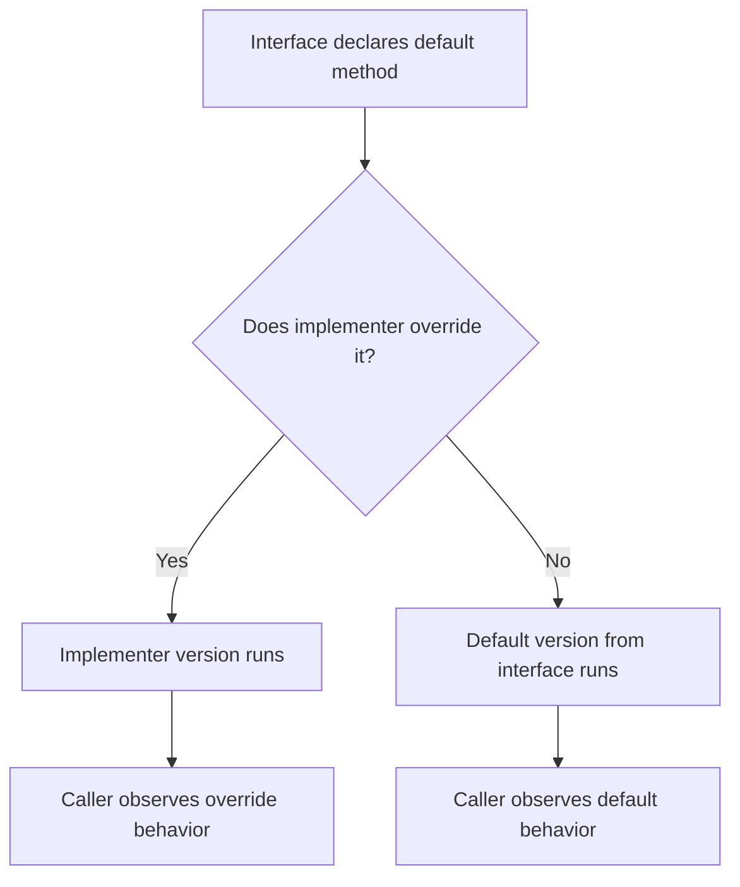
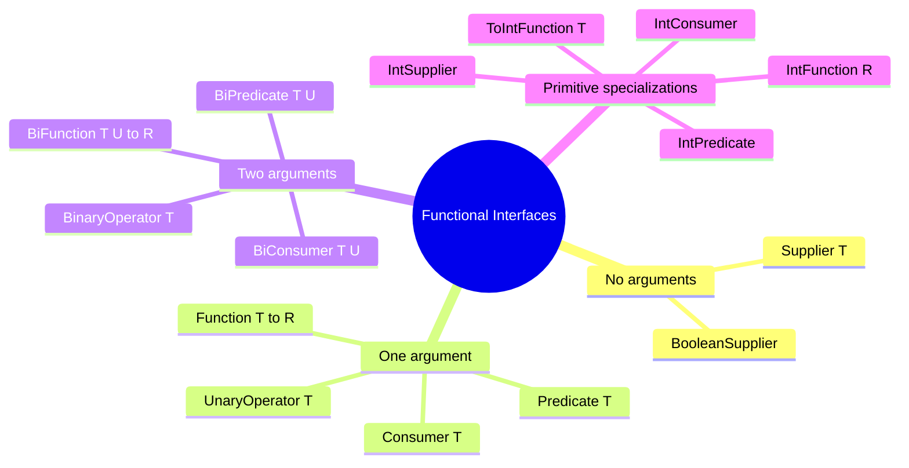
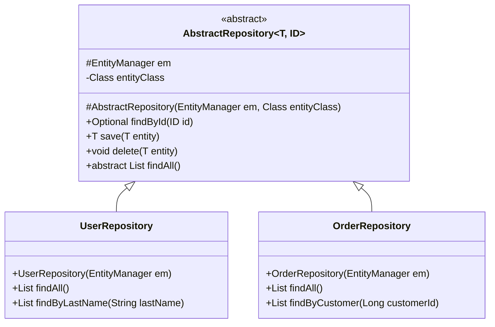
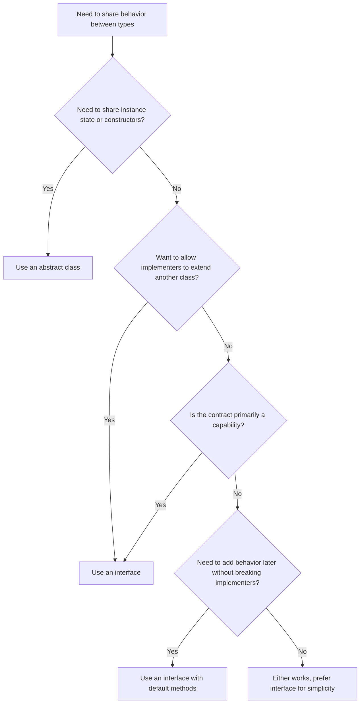

# 02.3. Interfaces and Abstract Classes

## Overview

Interfaces and abstract classes are the two language constructs Java gives you to separate what a type does from how it does it. They are the primary tools of abstraction, and they form the connective tissue of every well-designed Java library. Without them, you would be forced to depend on concrete classes everywhere, with the result that your code would be hard to test, hard to evolve, and tightly coupled to specific implementations. With them, you can design small, focused contracts that callers depend on, leaving implementers free to choose the best strategy for their context.

This note is a thorough treatment of both constructs. We will cover the syntax and semantics of interfaces, the evolution of interfaces from Java 1.0 to Java 21 (including default methods, static methods, private methods, sealed interfaces, and functional interfaces), the rules of multiple inheritance of type, and the patterns that let you evolve interfaces safely over time. We will then turn to abstract classes: their syntax, their relationship to interfaces, when to use them, and how to design base classes that are easy to subclass correctly. We will close with a detailed comparison and a set of decision rules for choosing between the two.

By the end of this note you should be able to design an interface or abstract class hierarchy for any problem domain, justify each design decision, and avoid the common traps that produce fragile or inconsistent APIs.

## Background Knowledge

Before reading this note, you should be comfortable with the following from earlier notes:

- Classes, objects, and constructors (note 02.1).
- The four pillars of OOP, especially abstraction and polymorphism (note 02.2).
- The `final` keyword as applied to classes and methods.
- The Java access modifiers (`public`, `protected`, package-private, `private`).
- The difference between static and instance members.
- The Object class methods `equals`, `hashCode`, and `toString` (covered fully in note 02.7).

You should also be aware that Java supports single inheritance for classes (a class has at most one superclass) but multiple inheritance of type (a class may implement many interfaces). This distinction is the historical reason interfaces exist: they provide the polymorphic dispatch of inheritance without the diamond problem that multiple inheritance of state would cause.

## What Is an Interface

An interface is a reference type, similar to a class, that can contain abstract methods, default methods, static methods, private methods, private static methods, constant declarations, and nested types. It cannot contain instance fields, instance initializers, or constructors. An interface declares a contract: any class that implements the interface promises to provide an implementation for every abstract method declared by the interface (or be declared abstract itself).

The simplest form of an interface looks like this:

```java
public interface Comparable<T> {
    int compareTo(T other);
}
```

This declares a single abstract method, `compareTo`, that takes an argument of type `T` and returns an `int`. Any class that declares `implements Comparable<T>` must provide a body for `compareTo` or be declared `abstract`.

The keyword `abstract` is implicit on every method that lacks a body, and the keyword `public` is implicit on every member of an interface. You can write them explicitly if you want, but it is conventional to omit them. Similarly, every field declared in an interface is implicitly `public`, `static`, and `final`. This makes interfaces a reasonable place to declare constants, though it is now considered better style to put constants in a class or an enum.

## The Evolution of Interfaces

Java 1.0 interfaces were pure contracts: a list of abstract methods and constants, nothing more. This was clean but limiting, because every evolution of an interface broke every existing implementation. Adding a method to an interface meant every class that implemented it had to be recompiled and updated, which was unacceptable for widely used interfaces in the JDK.

Java 8 changed this fundamentally by introducing default methods and static methods on interfaces. A default method has a body and is inherited by every implementer that does not override it. This lets library authors add methods to existing interfaces without breaking anyone. The classic example is `Iterable.forEach`, which was added to a type that already had thousands of implementations in the wild.

Java 9 added private methods and private static methods on interfaces. These exist purely as helpers for default and static methods; they cannot be inherited or implemented by implementers. They reduce code duplication between default methods.

Java 17 added sealed interfaces, which let you declare a closed set of permitted implementers. The compiler can then verify exhaustiveness in pattern matching, and library authors gain precise control over who may implement their interfaces.

## Default Methods

A default method is declared with the `default` keyword and has a body. It is inherited by every implementer that does not override it. Default methods are the JDK's primary mechanism for interface evolution.

```java
public interface Shape {

    double area();

    // Default method: provides a default behavior for area description.
    default String describe() {
        return String.format("Shape with area %.2f", area());
    }

    // Static factory on the interface itself.
    static Shape circle(double radius) {
        return new Circle(radius);
    }
}

public final class Circle implements Shape {
    private final double radius;
    public Circle(double radius) { this.radius = radius; }
    @Override public double area() { return Math.PI * radius * radius; }
}
```

Now any class that implements `Shape` automatically gets the `describe` method. The implementer can override it if a better description is needed.



### The Diamond Problem with Default Methods

When a class inherits the same default method from two interfaces, the compiler requires an explicit override. The class can resolve the conflict by calling one of the inherited versions with the `Interface.super.method()` syntax.

```java
public interface Walker {
    default void move() {
        System.out.println("Walking");
    }
}

public interface Swimmer {
    default void move() {
        System.out.println("Swimming");
    }
}

public class Duck implements Walker, Swimmer {

    // Must override because both interfaces provide a default.
    @Override
    public void move() {
        Walker.super.move();   // or Swimmer.super.move() or something else entirely
        System.out.println("Quacking while moving");
    }
}
```

The resolution rules are:

1. A class wins over an interface: a method declared in a class (or its superclass) takes precedence over any default method from an implemented interface.
2. Subtypes win over supertypes: a default method in a sub-interface wins over a default method with the same signature in a super-interface.
3. Otherwise, the conflict is ambiguous and the class must explicitly override the method.

These rules mirror the equivalent rules in other multiple-inheritance languages like Scala and CLOS, and they preserve the most specific implementation principle.

## Static Methods on Interfaces

Static methods on interfaces were added in Java 8. They are useful for factory methods and utility helpers that logically belong to the interface itself. Before Java 8, such methods had to be placed in a companion utility class (think `Collection` and `Collections`), which cluttered the API surface.

```java
public interface Comparator<T> {

    // Static factory method: returns a comparator that uses the natural order.
    static <T extends Comparable<? super T>> Comparator<T> naturalOrder() {
        return (a, b) -> a.compareTo(b);
    }

    // Static factory method: returns the reverse of the given comparator.
    static <T> Comparator<T> reverseOrder(Comparator<T> original) {
        return (a, b) -> original.compare(b, a);
    }
}
```

Static methods on interfaces are not inherited by implementers. You must call them with the interface name, like `Comparator.naturalOrder()`, never with an implementing class name.

## Private Methods on Interfaces

Java 9 introduced private methods (both instance and static) on interfaces. They exist solely to reduce duplication between default methods. They cannot be inherited by implementers, and they cannot be abstract.

```java
public interface Validator<T> {

    default ValidationResult validate(T input) {
        if (input == null) {
            return ValidationResult.failure("input was null");
        }
        if (!meetsLengthRequirement(input)) {
            return ValidationResult.failure("input too short");
        }
        if (!meetsFormatRequirement(input)) {
            return ValidationResult.failure("input has bad format");
        }
        return ValidationResult.success();
    }

    // Private helper used by the default method above.
    private boolean meetsLengthRequirement(T input) {
        return input.toString().length() >= 8;
    }

    private boolean meetsFormatRequirement(T input) {
        return input.toString().matches("[a-zA-Z0-9]+");
    }
}
```

Without private methods, you would either duplicate the helper logic in each default method or extract it to a static nested class, both of which are worse than the direct solution.

## Functional Interfaces

A functional interface is an interface that declares exactly one abstract method. The `@FunctionalInterface` annotation tells the compiler to enforce this constraint, refusing to compile if you accidentally add a second abstract method. Functional interfaces are the target type for lambda expressions and method references.

```java
@FunctionalInterface
public interface Predicate<T> {
    boolean test(T t);

    // Default methods do not count toward the single abstract method limit.
    default Predicate<T> and(Predicate<? super T> other) {
        return t -> test(t) && other.test(t);
    }

    default Predicate<T> or(Predicate<? super T> other) {
        return t -> test(t) || other.test(t);
    }

    default Predicate<T> negate() {
        return t -> !test(t);
    }

    // Static methods also do not count toward the single abstract method limit.
    static <T> Predicate<T> isEqual(Object targetRef) {
        return targetRef == null
                ? Objects::isNull
                : targetRef::equals;
    }
}
```

The single abstract method is also called the functional descriptor. For `Predicate<T>` it is `T -> boolean`. For `Function<T, R>` it is `T -> R`. For `Supplier<T>` it is `() -> T`. The JDK ships with a rich set of built-in functional interfaces in `java.util.function`, covering most common shapes. Prefer these over rolling your own, because they compose nicely with streams and other libraries.



## Sealed Interfaces

Java 17 introduced sealed interfaces (and sealed classes). A sealed interface declares a fixed set of permitted implementers, which can be classes or interfaces. The compiler can verify exhaustiveness in switch expressions and pattern matching, and library authors gain precise control over their type lattices.

```java
public sealed interface PaymentMethod
        permits CreditCard, DebitCard, BankTransfer, Cash {}

public final class CreditCard   implements PaymentMethod { /* ... */ }
public final class DebitCard    implements PaymentMethod { /* ... */ }
public final class BankTransfer implements PaymentMethod { /* ... */ }
public final class Cash         implements PaymentMethod { /* ... */ }
```

Every permitted implementer must be in the same module (or, in unnamed modules, the same package) as the sealed interface. Each permitted implementer must itself be `final`, `sealed`, or `non-sealed`. The combination of sealed types and pattern matching switch is one of the most powerful features in modern Java:

```java
public String describe(PaymentMethod method) {
    return switch (method) {
        case CreditCard cc    -> "Credit card ending in " + cc.lastFour();
        case DebitCard dc     -> "Debit card ending in " + dc.lastFour();
        case BankTransfer bt  -> "Bank transfer from " + bt.bankName();
        case Cash c           -> "Cash amount " + c.amount();
    };
}
```

There is no `default` branch, because the compiler knows the set is exhaustive. If you later add a new permitted implementer (say `Crypto`), every switch that does not handle it will fail to compile, which is exactly what you want for safety.

## Multiple Inheritance of Type

A Java class may implement any number of interfaces. This is multiple inheritance of type, and it is one of the most useful features of the language for decoupling. A single object can be a `Runnable`, a `Comparable`, a `Serializable`, and a `Cloneable` at the same time, with no conflict, because none of those interfaces demand state.

```java
public final class Task implements Runnable, Comparable<Task>, Serializable {

    private static final long SerialVersionUID = 1L;

    private final String name;
    private final int priority;

    public Task(String name, int priority) {
        this.name = name;
        this.priority = priority;
    }

    @Override
    public void run() {
        System.out.println("Running task " + name);
    }

    @Override
    public int compareTo(Task other) {
        return Integer.compare(priority, other.priority);
    }
}
```

The cost of this flexibility is that the implementer must provide a body for every abstract method declared by every interface. If two interfaces declare abstract methods with the same signature, one body satisfies both. If they declare default methods with the same signature, you must resolve the conflict explicitly as described above.

## What Is an Abstract Class

An abstract class is a class declared with the `abstract` keyword that cannot be instantiated directly. It may contain a mix of abstract methods (declared without a body) and concrete methods (with bodies), along with fields, constructors, static members, and nested types. Abstract classes are the natural home for shared state and shared initialization logic that should be inherited by subclasses.

```java
public abstract class AbstractRepository<T, ID> {

    protected final EntityManager em;
    private final Class<T> entityClass;

    protected AbstractRepository(EntityManager em, Class<T> entityClass) {
        this.em = Objects.requireNonNull(em);
        this.entityClass = Objects.requireNonNull(entityClass);
    }

    // Concrete method: shared by all subclasses.
    public Optional<T> findById(ID id) {
        return Optional.ofNullable(em.find(entityClass, id));
    }

    public T save(T entity) {
        em.persist(entity);
        return entity;
    }

    public void delete(T entity) {
        em.remove(entity);
    }

    // Abstract method: each subclass provides its own implementation.
    public abstract List<T> findAll();
}

public final class UserRepository extends AbstractRepository<User, Long> {

    public UserRepository(EntityManager em) {
        super(em, User.class);
    }

    @Override
    public List<User> findAll() {
        return em.createQuery("SELECT u FROM User u", User.class).getResultList();
    }

    public List<User> findByLastName(String lastName) {
        return em.createQuery(
                "SELECT u FROM User u WHERE u.lastName = :name", User.class)
                .setParameter("name", lastName)
                .getResultList();
    }
}
```

The abstract class provides a constructor that subclasses must call via `super(...)`, three shared methods that work for any entity type, and one abstract method that each subclass must implement.



## The Template Method Pattern

Abstract classes are the natural home for the template method pattern, where a base class declares the skeleton of an algorithm in a `final` method and lets subclasses override individual steps. The base class controls the overall flow; subclasses customize the details.

```java
public abstract class HttpHandler {

    // Template method: declares the skeleton of the algorithm.
    public final void handle(HttpRequest request, HttpResponse response) {
        if (!authenticate(request)) {
            response.setStatus(401);
            return;
        }
        if (!authorize(request)) {
            response.setStatus(403);
            return;
        }
        try {
            Object result = process(request);
            serialize(response, result);
            response.setStatus(200);
        } catch (Exception e) {
            response.setStatus(500);
            response.setBody("Internal error: " + e.getMessage());
        }
    }

    // Hook methods: subclasses override these.
    protected abstract boolean authenticate(HttpRequest request);
    protected abstract boolean authorize(HttpRequest request);
    protected abstract Object process(HttpRequest request);

    // Concrete hook with a default implementation; subclasses may override.
    protected void serialize(HttpResponse response, Object result) {
        response.setBody(result.toString());
        response.setContentType("text/plain");
    }
}

public final class OrderHandler extends HttpHandler {

    @Override
    protected boolean authenticate(HttpRequest request) {
        String token = request.header("Authorization");
        return token != null && token.startsWith("Bearer ");
    }

    @Override
    protected boolean authorize(HttpRequest request) {
        // Simplified authorization logic.
        return true;
    }

    @Override
    protected Object process(HttpRequest request) {
        return List.of("order1", "order2", "order3");
    }
}
```

The `handle` method is `final` so that subclasses cannot change the algorithm structure. The hook methods are `protected` so that only subclasses can see them. This is a powerful pattern for frameworks, because the framework controls the flow and the application supplies the details.

## Interfaces vs Abstract Classes: A Detailed Comparison

The following table summarizes the differences between interfaces and abstract classes. Read it carefully: the choice between them has lasting consequences for your API design.

| Property | Interface | Abstract Class |
| --- | --- | --- |
| Instantiated directly | No | No |
| Multiple inheritance | A class can implement many | A class can extend only one |
| Instance fields | Not allowed | Allowed |
| Constructors | Not allowed | Allowed |
| Static fields | Allowed (and implicitly public) | Allowed (any access modifier) |
| Abstract methods | Allowed (default) | Allowed |
| Concrete methods | Allowed (must be default, static, or private) | Allowed (any access modifier) |
| Default methods | Allowed (Java 8+) | N/A |
| Private methods | Allowed (Java 9+, instance and static) | Allowed |
| Final fields | Implicitly final | Optional |
| Constants | Yes, idiomatic | Yes, idiomatic |
| State | None | Yes |
| Use case | Pure contract, capability type | Shared state and behavior |



## When to Use an Interface

Use an interface when:

1. You want to declare a pure contract with no shared state. Examples: `Comparable`, `Iterable`, `Runnable`.
2. You want to express a capability that classes from unrelated hierarchies can offer. Examples: `Serializable`, `Cloneable`, `AutoCloseable`.
3. You want to allow a class to mix in multiple behaviors. A class can implement many interfaces but extend only one class.
4. You want to evolve the contract over time using default methods.
5. You want a target type for lambda expressions (functional interface).

## When to Use an Abstract Class

Use an abstract class when:

1. You need to share instance state (fields) across implementations.
2. You need to share constructors or initialization logic.
3. You need to share non-trivial code that depends on protected state.
4. You want to use the template method pattern.
5. You want to provide hook methods with `protected` access that subclasses can override.

In modern Java, the trend is to start with an interface and add an abstract class only when the limitations of interfaces (no state, no constructors) become a real problem. The JDK itself follows this trend: most new types introduced since Java 8 are interfaces with default methods, sometimes accompanied by an abstract companion class for shared implementation.

## Evolving Interfaces Safely

One of the hardest problems in library design is evolving an interface without breaking implementers. Adding an abstract method to an interface always breaks every implementer that does not provide the new method. Adding a default method usually does not break implementers, but it can break them if the new default depends on other methods that the implementer did not expect to be called.

The safest patterns are:

1. Add new methods as default methods with a sensible default behavior that does not depend on the implementer's internal state.
2. If the new behavior depends on implementer state, declare it abstract and provide a default that throws `UnsupportedOperationException`. Implementers who care can override it; those who do not will get a clear error if the method is called.
3. For major changes, prefer to add a new interface (e.g., `Iterable` and `Iterable2`) and have implementers implement both. This is uglier but completely safe.
4. Use sealed interfaces when you know all the implementers in advance. Adding a new abstract method to a sealed interface forces only the known implementers to be updated.

## Common Pitfalls

1. **Using interfaces for constants only.** The constant interface anti-pattern (an interface that contains only constants and is implemented by classes that want to use them) pollutes the class hierarchy. Use a `final` class with a private constructor or an enum instead.

2. **Adding default methods that depend on each other.** If two default methods on the same interface call each other, you create a tight coupling that implementers cannot easily break.

3. **Forgetting to resolve default method conflicts.** When a class implements two interfaces with the same default method, the compiler requires an explicit override. Forgetting this produces a confusing compile error.

4. **Using `@FunctionalInterface` on an interface with no abstract methods.** The annotation requires exactly one abstract method. Use it only on interfaces intended as lambda targets.

5. **Designing interfaces that leak implementation hints.** An interface should declare what callers can do, not how implementers must do it. Methods like `getInternalConnectionPool()` or `refreshCache()` leak implementation details into the contract.

6. **Marking too many methods `default`.** Default methods should be the exception, used for evolution, not the rule. An interface that is mostly default methods is probably an abstract class in disguise.

7. **Declaring abstract classes that are hard to subclass.** If your abstract class has dozens of protected methods and no documentation about which to override and in what order, no one will be able to subclass it correctly.

8. **Calling overridable methods from an abstract class constructor.** Same pitfall as in note 02.1: the subclass override runs before the subclass constructor body, leading to surprising nulls.

9. **Using abstract classes for capability types.** A capability like `Runnable` or `Comparable` should be an interface, not an abstract class, because classes from unrelated hierarchies need to offer it.

10. **Forgetting that interface fields are implicitly public static final.** If you write `int Limit = 100;` in an interface, it is a public constant, not a private instance field. Misunderstanding this is a common source of confusion.

## Tips and Tricks

- Design your public API in terms of interfaces; reserve classes for implementation.
- Provide an abstract companion class for shared implementation only when the limitations of interfaces become painful.
- Mark functional interfaces with `@FunctionalInterface` so the compiler catches accidental additions.
- Use sealed interfaces for closed sets of variants; they enable exhaustive pattern matching.
- When evolving an interface, prefer default methods with safe default behavior. If the new behavior requires implementer state, declare it abstract and let implementers opt in.
- Avoid constant interfaces. Use `final` classes with private constructors or enums instead.
- Document every non-trivial interface method with preconditions, postconditions, and side effects.
- Keep interfaces small and focused. The Single Responsibility Principle applies to interfaces more strongly than to classes.
- When using the template method pattern, mark the template method `final` and the hooks `protected`.
- Use static factory methods on interfaces to provide convenient construction without leaking concrete classes.

## Interview Questions

**Q1. What is the difference between an interface and an abstract class?**
An interface is a pure contract: it can declare abstract methods, default methods, static methods, private methods, and constants, but it cannot have instance fields or constructors. An abstract class can have all of those things, including instance fields, constructors, and concrete methods of any access modifier. A class can implement many interfaces but extend only one abstract class.

**Q2. Can an interface have a method with a body?**
Yes. Since Java 8, interfaces can have default methods and static methods with bodies. Since Java 9, they can also have private methods (both instance and static) with bodies, used as helpers for the default and static methods.

**Q3. What is a default method and why was it introduced?**
A default method is a method on an interface declared with the `default` keyword that has a body. It was introduced in Java 8 to allow interfaces to evolve without breaking existing implementations. The most famous example is `Iterable.forEach`.

**Q4. How does Java resolve the diamond problem with default methods?**
Three rules apply: a class wins over an interface, subtypes win over supertypes, and otherwise the conflict is ambiguous and the class must explicitly override the conflicting method, often using `Interface.super.method()` to call one of the inherited versions.

**Q5. What is a functional interface?**
A functional interface is an interface with exactly one abstract method. The `@FunctionalInterface` annotation tells the compiler to enforce this. Functional interfaces are the target types for lambda expressions and method references.

**Q6. Can an interface have constructors?**
No. Interfaces cannot have constructors because they have no instance state to initialize. The class that implements the interface has the constructor, which initializes the implementer's own state.

**Q7. What is a sealed interface and why use it?**
A sealed interface, introduced in Java 17, declares a fixed set of permitted implementers. The compiler can verify exhaustiveness in pattern matching, and library authors gain precise control over who may implement their interfaces. Sealed interfaces are most powerful when combined with switch expressions and pattern matching.

**Q8. Why can interfaces not have instance fields?**
Because Java avoids multiple inheritance of state to prevent the diamond problem. If interfaces could have instance fields, a class implementing two interfaces with conflicting field names would have ambiguous state. Constants (public static final fields) are allowed because they are not part of any instance.

**Q9. Can a class extend an abstract class and implement an interface that declare the same method?**
Yes. If the abstract class declares a concrete method and the interface declares an abstract or default method with the same signature, the class wins by rule 1. The abstract class method is used; the interface default is ignored.

**Q10. What is the template method pattern?**
A pattern in which an abstract class declares the skeleton of an algorithm in a `final` method and lets subclasses override individual hook methods to customize the steps. The base class controls the overall flow; subclasses supply the details. It is one of the canonical use cases for abstract classes.

**Q11. What happens if a class implements two interfaces with conflicting default methods?**
The compiler requires the class to explicitly override the conflicting method. The class can choose to call one of the inherited versions via `Interface.super.method()`, call both, or provide its own implementation.

**Q12. Can an interface extend another interface?**
Yes. An interface can extend any number of other interfaces. This is multiple inheritance of type at the interface level. If two parent interfaces declare the same default method, the sub-interface must resolve the conflict explicitly or redeclare the method.

**Q13. What is the difference between `abstract` and `default` methods on an interface?**
An abstract method has no body and must be implemented by every non-abstract class that implements the interface. A default method has a body and is inherited by every implementer that does not override it. Default methods are the JDK's primary tool for interface evolution.

**Q14. Should you use an interface or an abstract class for shared utility code?**
Neither. Use a `final` class with a private constructor and static methods. Utility code (like `java.util.Arrays` or `java.util.Collections`) does not need polymorphism and should not be inheritable.

**Q15. Why is the constant interface anti-pattern bad?**
Implementing an interface just to inherit its constants pollutes the class's public API with constants that callers should not see, and it permanently ties the class to the constant interface even when those constants are no longer used. Use a `final` class with a private constructor or an enum instead.

## Summary

Interfaces and abstract classes are the two tools Java gives you for separating what a type does from how it does it. Interfaces are pure contracts: they declare methods and constants but no instance state, and they enable multiple inheritance of type. Modern Java interfaces are far more expressive than their Java 1.0 ancestors, thanks to default methods (Java 8), static methods (Java 8), private methods (Java 9), and sealed interfaces (Java 17). They are the right choice for capability types, functional interfaces, and any case where you want to evolve a contract over time without breaking implementers.

Abstract classes are the right choice when you need to share instance state, constructors, or non-trivial initialization logic across implementations. They are the natural home for the template method pattern and for shared base classes that combine state with behavior. A class can extend only one abstract class, which makes them less flexible than interfaces but more powerful for shared implementation.

We compared the two constructs in detail, walked through the rules of multiple inheritance and default method resolution, and provided a decision flowchart for choosing between them. We also covered the patterns that let you evolve interfaces safely over time, the common pitfalls that catch even experienced engineers, and a bank of interview questions with model answers.

With these tools in hand, the next note (02.4) drills into the precise rules of method overriding, method overloading, and the interplay between them that produces both compile-time and runtime polymorphism.
