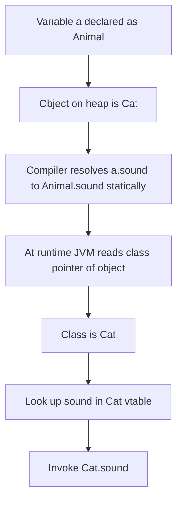
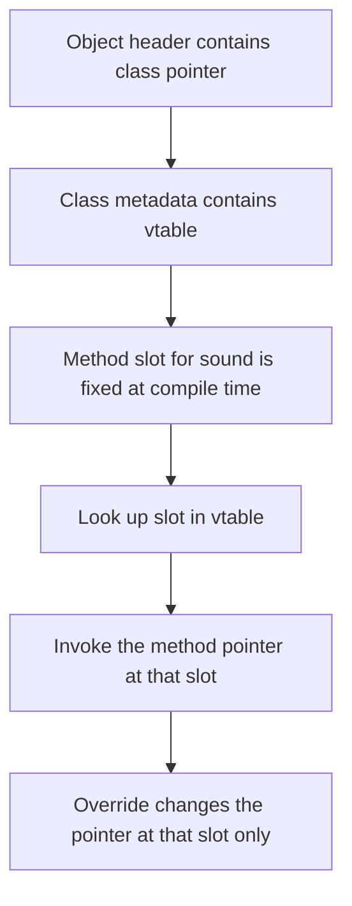
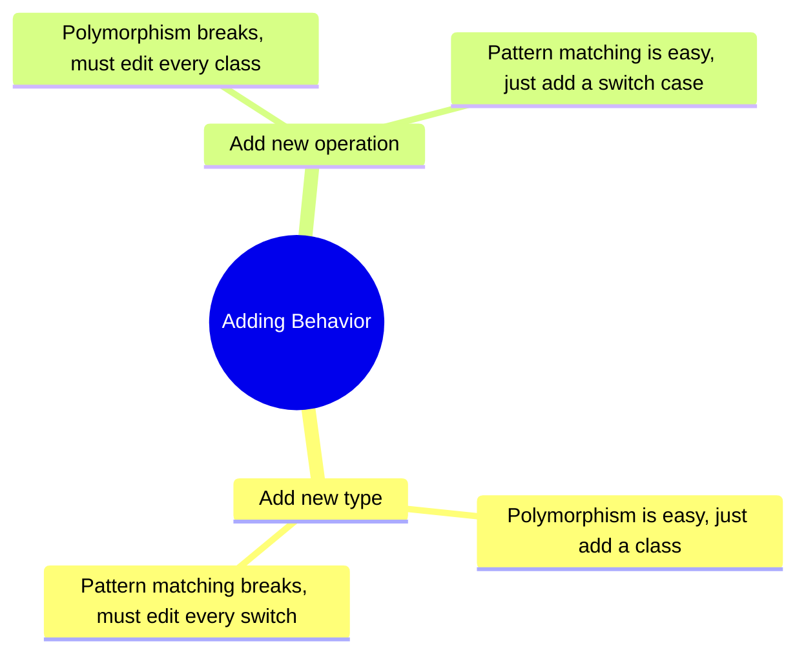

# 02.4. Method Overriding, Overloading, and Polymorphism

## Overview

Methods are the verbs of Java: they describe what objects can do. Two powerful mechanisms let you reuse and specialize method names: overriding and overloading. Overriding is the runtime mechanism by which a subclass replaces the implementation of a method declared in its superclass. Overloading is the compile-time mechanism by which several methods of the same name coexist with different parameter lists. Together they produce polymorphism, the ability of one call site to dispatch to different concrete behavior depending on context.

Although the two mechanisms look superficially similar, they have almost nothing in common. Overriding is resolved by the JVM at runtime based on the actual type of the receiver. Overloading is resolved by the compiler at compile time based on the static types of the arguments. Overriding follows inheritance lines and obeys the Liskov Substitution Principle. Overloading is purely a naming convenience and can be applied to methods that have no relationship to each other at all. Conflating them is one of the most common sources of confusion in Java interviews and code reviews.

This note is a thorough treatment of both mechanisms. We cover the precise rules of overriding, including signatures, return types, access modifiers, checked exceptions, and the `@Override` annotation. We cover the precise rules of overloading, including the three-phase resolution algorithm, autoboxing, varargs, and the tricky cases that produce surprising results. We then explore the relationship between overriding and polymorphism: how dynamic dispatch works at the JVM level, how `super` invokes the parent implementation, how `final` and `static` methods interact with overriding, and how pattern matching in Java 21 complements traditional polymorphism. We close with a long list of pitfalls, tips, and interview questions.

## Background Knowledge

Before reading this note, make sure you are comfortable with:

- Classes, objects, and constructors (note 02.1).
- The four pillars of OOP, especially polymorphism (note 02.2).
- Interfaces and abstract classes (note 02.3).
- The distinction between static type (declared type of a variable) and dynamic type (actual class of the object a reference points to).
- The `final` and `static` keywords as applied to methods.
- The Java type hierarchy and the `Object` class.

If you understand the difference between static and dynamic types, the rest of this note will fall into place. If not, re-read note 02.1's section on object identity before continuing.

## Method Overriding

Overriding occurs when a subclass declares a method with the same signature (name and parameter types) as a method declared in one of its superclasses. The subclass method replaces the superclass method for any call dispatched on an instance of the subclass. The superclass method is still callable from inside the subclass via the `super` keyword.

```java
public class Animal {
    public String sound() {
        return "some generic sound";
    }
}

public class Cat extends Animal {
    @Override
    public String sound() {
        return "meow";
    }
}

public class Dog extends Animal {
    @Override
    public String sound() {
        return "woof";
    }
}

Animal a = new Cat();
System.out.println(a.sound());   // prints "meow", not "some generic sound"
```

The variable `a` has static type `Animal` but dynamic type `Cat`. The call `a.sound()` is statically bound to `Animal.sound()` (the compiler verifies that `Animal` has a `sound` method), but at runtime the JVM looks up the actual class of the object and invokes the most specific override. This is dynamic dispatch, and it is the engine of polymorphism.



### The Signature Rule

For a method to override another, the signatures must match exactly. The signature consists of the method name and the parameter list (number and types of parameters, in order). The return type is not part of the signature, but the overriding method's return type must be compatible (see below). The names of the parameters do not matter.

```java
public class Base {
    public void process(String input, int count) { ... }
}

public class Sub extends Base {
    // This overrides, because signature is (String, int).
    @Override
    public void process(String text, int times) { ... }

    // This does NOT override; it overloads, because signature is (int, String).
    public void process(int count, String input) { ... }
}
```

The `@Override` annotation is your friend here. If you write `@Override` above a method that does not actually override anything, the compiler will tell you. This catches an astonishing range of bugs, from typos in method names to subtle signature mismatches. Make it a habit: every time you intend to override, write `@Override`.

### Covariant Return Types

Since Java 5, an overriding method may return a subtype of the return type declared by the superclass method. This is called a covariant return type, and it lets subclasses refine the type of their return values without breaking the superclass contract.

```java
public abstract class AnimalFactory {
    public abstract Animal create();
}

public class CatFactory extends AnimalFactory {
    @Override
    public Cat create() {     // covariant: Cat is a subtype of Animal
        return new Cat();
    }
}
```

Callers that hold an `AnimalFactory` still see the return type as `Animal`, so existing code continues to work. Callers that hold a `CatFactory` see the more specific `Cat` return type, which avoids a cast.

Covariant return types work for class types and for array types (since arrays are types). They do not work for primitive types, because primitive types do not have subtype relationships: an `int` is not a subtype of `long` for return type purposes.

### Access Modifier Rule

An overriding method cannot reduce the visibility of the superclass method. If the superclass method is `public`, the override must also be `public`. If it is `protected`, the override can be `protected` or `public`, but not package-private or `private`. The reasoning is that callers of the superclass should never be denied access to a method they could legitimately call.

```java
public class Base {
    public void visible() { ... }
    protected void sheltered() { ... }
}

public class Sub extends Base {
    @Override
    public void visible() { ... }       // OK: same or wider access

    @Override
    public void sheltered() { ... }     // OK: protected widened to public

    // @Override
    // private void visible() { ... }   // ERROR: cannot narrow access
}
```

### Checked Exception Rule

An overriding method cannot declare any checked exception that is not already declared by the superclass method, unless the new exception is a subtype of an exception already declared. The reasoning is the same as for access modifiers: callers of the superclass should never be forced to handle a new checked exception.

```java
public class Base {
    public void risky() throws IOException { ... }
}

public class Sub extends Base {
    // OK: FileNotFoundException is a subtype of IOException.
    @Override
    public void risky() throws FileNotFoundException { ... }

    // OK: declaring no exceptions is always allowed.
    @Override
    public void risky() { ... }

    // ERROR: SQLException is not a subtype of IOException.
    // @Override
    // public void risky() throws SQLException { ... }
}
```

Unchecked exceptions (subtypes of `RuntimeException`) are exempt from this rule, because they do not need to be declared or caught. An override can throw any unchecked exception it likes.

### The Override Puzzle of Static Methods

Static methods are not dispatched dynamically. They are bound to the static type of the reference at compile time. A subclass can declare a static method with the same signature as a static method in its superclass, but this is called hiding, not overriding. The behavior depends on the static type of the reference, which is usually a source of confusion.

```java
public class Parent {
    public static String greet() { return "Hello from Parent"; }
}

public class Child extends Parent {
    public static String greet() { return "Hello from Child"; }
}

Parent p = new Child();
System.out.println(p.greet());        // "Hello from Parent" (hiding, not overriding)
System.out.println(Child.greet());   // "Hello from Child"
```

The lesson is to avoid declaring static methods with the same name in subclasses. If you find yourself doing it, you probably want an instance method instead, or you should rename one of the statics to make the intent clear.

### The Override Puzzle of Private Methods

Private methods are not visible to subclasses, so they cannot be overridden. A subclass can declare a method with the same name and signature as a private method in its superclass, but the two methods have no relationship: they are simply two independent methods that happen to share a name.

### The Override Puzzle of Final Methods

A `final` method cannot be overridden. The compiler refuses to compile a subclass that tries. This is useful when a class wants to expose an invariant algorithm that subclasses must not change.

```java
public class Account {
    public final void audit() {
        // This algorithm cannot be changed by subclasses.
        recordTransaction();
        notifyAuditor();
    }
    protected void recordTransaction() { ... }
    protected void notifyAuditor() { ... }
}
```

### The Override Puzzle of Field Hiding

Fields are not overridden; they are hidden. If a subclass declares a field with the same name as a field in its superclass, both fields exist in the object, and which one you read depends on the static type of the reference. This is almost always a bad idea and a source of subtle bugs.

```java
public class Base {
    protected int value = 10;
}

public class Sub extends Base {
    protected int value = 20;   // hides Base.value
}

Base b = new Sub();
System.out.println(b.value);   // 10, because static type is Base

Sub s = new Sub();
System.out.println(s.value);   // 20, because static type is Sub
```

Avoid field hiding. If you need to specialize a value, use a method that the subclass overrides.

## Method Overloading

Overloading occurs when two or more methods in the same class (or inherited from a superclass) have the same name but different parameter lists. The compiler chooses among them based on the static types of the arguments at the call site. This is purely a compile-time mechanism: the JVM never knows that two methods were named the same.

```java
public class Printer {
    public void print(int value) {
        System.out.println("Integer: " + value);
    }

    public void print(double value) {
        System.out.println("Double: " + value);
    }

    public void print(String value) {
        System.out.println("String: " + value);
    }

    public void print(int[] values) {
        System.out.println("Integer array of length " + values.length);
    }
}

Printer p = new Printer();
p.print(42);              // Integer: 42
p.print(3.14);            // Double: 3.14
p.print("hello");         // String: hello
p.print(new int[]{1, 2}); // Integer array of length 2
```

The compiler uses a three-phase resolution algorithm to choose the most specific applicable method. The phases are, in order:

1. **Phase 1:** Try to find a method that matches without any boxing, unboxing, or varargs. If exactly one such method exists, it is chosen.
2. **Phase 2:** If no method matches in phase 1, try to find a method that matches with boxing and unboxing (but still no varargs). If exactly one such method exists, it is chosen.
3. **Phase 3:** If no method matches in phase 2, try to find a method that matches with boxing, unboxing, and varargs. If exactly one such method exists, it is chosen.

If at any phase multiple methods are applicable and none is more specific than all others, the call is ambiguous and the compiler refuses to compile.

### The Most Specific Method

A method `m1` is more specific than `m2` if every argument that can be passed to `m1` can also be passed to `m2` without an implicit conversion. For example, `print(int)` is more specific than `print(double)`, because every `int` can be widened to a `double` but not every `double` can be narrowed to an `int`.

```java
public class Calculator {
    public int add(int a, int b) { return a + b; }
    public long add(long a, long b) { return a + b; }
}

Calculator c = new Calculator();
c.add(1, 2);   // Calls add(int, int), because int is more specific than long
```

### Tricky Overloading Cases

Overloading combined with autoboxing and varargs produces some famously confusing cases. Consider this example:

```java
public class Confusing {
    public void foo(Object obj)   { System.out.println("Object"); }
    public void foo(String str)   { System.out.println("String"); }
    public void foo(int[] arr)    { System.out.println("int array"); }
}

Confusing c = new Confusing();
c.foo(null);   // Prints "int array"!
```

Why `int array`? Because all three methods are applicable in phase 1 (since `null` can be passed to any reference type), and `int[]` is more specific than `Object`, and `int[]` is more specific than `String` (because every `int[]` is an `Object` but not every `Object` is an `int[]`, and similarly for `String`). The compiler chooses the most specific, which is `int[]`. To force a different choice, cast the `null` explicitly: `c.foo((String) null)`.

A similar puzzle:

```java
public class Puzzler {
    public void bar(int a, long b)    { System.out.println("int long"); }
    public void bar(long a, int b)    { System.out.println("long int"); }
}

Puzzler p = new Puzzler();
p.bar(1, 2);   // Ambiguous! Both methods are applicable, neither is more specific.
```

The compiler cannot decide which overload to call, because each parameter of one method is wider than the corresponding parameter of the other in opposite directions. The result is a compile-time error.

### Varargs and Overloading

Varargs methods participate in overloading, but only in phase 3 of the resolution algorithm. A non-varargs method always wins over a varargs method when both are applicable.

```java
public class VarargsDemo {
    public void log(String message)              { System.out.println("Single: " + message); }
    public void log(String first, String... more) { System.out.println("Varargs: " + first); }
}

VarargsDemo d = new VarargsDemo();
d.log("hello");          // Single: hello (phase 1 beats phase 3)
d.log("hello", "world"); // Varargs: hello
d.log("hello", "a", "b", "c");  // Varargs: hello
```

A subtle pitfall: passing an explicit array of the component type can also match the varargs form. `d.log("hello", new String[]{"a", "b"})` is legal and binds to the varargs method, with `more` being the array.

### Overloading and Generics

Type erasure complicates overloading with generics. Two methods that have different generic signatures but the same erased signature cannot coexist in the same class.

```java
public class Box<T> {
    // ERROR: erasure conflicts with put(String)
    // public void put(T value) { ... }
    // public void put(String value) { ... }
}
```

The compiler treats `put(T)` and `put(String)` as the same method after erasure, because `T` erases to `Object` (or its bound). Both would have signature `put(Object)` and `put(String)` respectively, which is fine — but the bridge method generated for `put(String)` when `T = String` would conflict with the explicit `put(String)`. The details are subtle; the practical advice is to avoid mixing generic and non-generic overloads with the same arity.

### Overloading and Overriding Together

Overloading and overriding can coexist. A subclass can override a superclass method and also overload it with new parameter lists. The compiler resolves the overload based on argument types; the JVM then resolves the override based on the receiver's actual class.

```java
public class Base {
    public void process(String input) { System.out.println("Base.process(String)"); }
}

public class Sub extends Base {
    @Override
    public void process(String input) { System.out.println("Sub.process(String)"); }

    public void process(int input) { System.out.println("Sub.process(int)"); }
}

Base b = new Sub();
b.process("hello");    // Sub.process(String) (overriding)
b.process(42);         // Compile error: Base does not declare process(int)

Sub s = new Sub();
s.process("hello");    // Sub.process(String)
s.process(42);         // Sub.process(int)
```

The compile-time type of the reference determines which overloads are visible. The runtime type of the receiver determines which override is invoked. This is one of the more subtle aspects of the Java type system, and it catches people off guard regularly.

## Polymorphism in Depth

Polymorphism is the broader concept that ties overriding and dynamic dispatch together. The word polymorphism means "many forms." In Java, polymorphism takes three forms:

1. **Ad-hoc polymorphism** is overloading. The same method name resolves to different implementations based on argument types. This is a compile-time mechanism.
2. **Subtype polymorphism** is overriding. A reference of a supertype can refer to objects of many subtypes, and the right method is chosen at runtime. This is the most common form of polymorphism in Java.
3. **Parametric polymorphism** is generics. The same generic code works for many types without modification. Generics are covered in a later note.

### How Dynamic Dispatch Works at the JVM Level

Every Java class has a vtable, an array of method pointers indexed by method slot number. When a class is loaded, the JVM builds its vtable by copying the parent's vtable and then replacing slots for methods that are overridden. When a call `a.sound()` is executed, the JVM:

1. Reads the class pointer from the object header of `a`.
2. Looks up the vtable for that class.
3. Finds the slot for `sound` (which is at the same index in every subclass, because the slot number is fixed at compile time).
4. Invokes the method pointer stored at that slot.

This makes dynamic dispatch slightly more expensive than a direct call, but the JVM's just-in-time compiler can often inline the most common target (called monomorphic call site optimization), eliminating the overhead entirely.



### The super Keyword

Inside an overriding method, you can call the superclass version with `super.method()`. This bypasses dynamic dispatch and invokes the parent class's implementation directly. It is commonly used to add behavior before or after the parent's behavior.

```java
public class LoggingList extends ArrayList<String> {
    @Override
    public boolean add(String element) {
        System.out.println("Adding: " + element);
        return super.add(element);   // call ArrayList.add
    }

    @Override
    public String remove(int index) {
        System.out.println("Removing at index: " + index);
        return super.remove(index);
    }
}
```

`super` skips only one level of the hierarchy. If you have a three-level hierarchy `A -> B -> C` and you want to call `A.method()` from `C`, you cannot do it directly: `super.method()` from `C` calls `B.method()`, and there is no `super.super.method()` syntax. The standard workaround is for `B` to expose a method that calls `super.method()` and for `C` to call that.

### Polymorphism with Interfaces

Polymorphism works just as well with interfaces as with classes. When you call a method on an interface-typed reference, the JVM performs the same dynamic dispatch it would for a class-typed reference. The only difference is that the dispatch uses the class of the actual object, not the interface.

```java
public interface Shape {
    double area();
}

List<Shape> shapes = List.of(
    new Circle(2.0),
    new Rectangle(3.0, 4.0),
    new Triangle(2.0, 3.0)
);

double totalArea = 0;
for (Shape s : shapes) {
    totalArea += s.area();   // dynamic dispatch to Circle, Rectangle, or Triangle
}
```

### Polymorphism vs Pattern Matching

Java 21's pattern matching for switch provides an alternative to polymorphism in some cases. Instead of adding an abstract method to a hierarchy and overriding it in each subclass, you can write a switch that pattern-matches on the runtime type:

```java
public sealed interface Shape permits Circle, Rectangle, Triangle {}

public double area(Shape shape) {
    return switch (shape) {
        case Circle c    -> Math.PI * c.radius() * c.radius();
        case Rectangle r -> r.width() * r.height();
        case Triangle t  -> 0.5 * t.base() * t.height();
    };
}
```

The advantage of pattern matching is that you can add new operations without modifying the type hierarchy. The advantage of polymorphism is that you can add new types without modifying existing operations. This trade-off is known as the expression problem. Use polymorphism when the set of types is open but the set of operations is closed; use pattern matching when the set of types is closed (sealed) but the set of operations is open.



## Common Pitfalls

1. **Forgetting `@Override`.** Without the annotation, a typo in the method name or a subtle signature mismatch silently produces an overload instead of an override, and your code does not behave as expected. Always write `@Override`.

2. **Hiding instead of overriding static methods.** Static methods are not dispatched dynamically. A subclass that declares a static method with the same name hides the parent's, and the behavior depends on the static type of the reference.

3. **Field hiding.** Declaring a field with the same name as a superclass field does not override; it creates two fields, and the value you read depends on the static type of the reference. Avoid this entirely.

4. **Narrowing access in an override.** An override cannot reduce visibility. If the superclass method is `public`, the override must be `public`.

5. **Throwing new checked exceptions in an override.** An override cannot throw checked exceptions that are not subtypes of exceptions declared by the superclass method.

6. **Confusing overloading with overriding.** Overloading is resolved at compile time based on argument types. Overriding is resolved at runtime based on the receiver type. They behave differently and are not interchangeable.

7. **Ambiguous overloads.** Two overloads that are equally specific produce a compile-time error. Add an explicit cast or rename one of the methods.

8. **Overloading on `Object` and a specific type.** Passing `null` resolves to the most specific type, which is often not what you expect. Cast explicitly or add an explicit overload.

9. **Bridge methods and generics.** When a generic class is subclassed with a concrete type argument, the compiler generates bridge methods to preserve overriding semantics after type erasure. These can confuse reflection-based code.

10. **Calling overridable methods from a constructor.** The override runs before the subclass constructor body, so subclass fields are still at their default values. Mark methods called from constructors as `private`, `static`, or `final`.

11. **Overriding `equals` without overriding `hashCode`.** See note 02.7. The two methods have a contract that must be honored together.

12. **Overloading with autoboxing and varargs.** The three-phase resolution algorithm produces surprising results when these features combine. Prefer explicit overloads to varargs where possible.

13. **Using `super` to call a sibling's method.** `super` only goes up one level. There is no `super.super` and no way to call a sibling implementation.

14. **Forgetting that interface default methods participate in dispatch.** A class that implements an interface inherits its default methods, and they can be overridden by the class.

15. **Expecting polymorphism in `instanceof` chains.** `instanceof` tests the runtime type, but the chain of checks is fragile and should usually be replaced with polymorphism or pattern matching switch.

## Tips and Tricks

- Always write `@Override` when you intend to override. The compiler will catch signature mismatches that would otherwise produce silent overloads.
- Mark methods `final` when you do not want them overridden. This documents intent and lets the JVM inline aggressively.
- Avoid field hiding. If you need to specialize a value, use a method that the subclass overrides.
- Avoid declaring static methods with the same name in subclasses. Use instance methods or rename the statics.
- Prefer a small number of well-named methods over many overloads. Overloading can quickly become confusing, especially when combined with autoboxing and varargs.
- When overriding, copy the contract documentation (Javadoc) from the superclass and add notes about how your implementation differs.
- Use covariant return types to refine the return type in subclasses without breaking callers.
- When designing a polymorphic API, write three callers before finalizing it. If they all read naturally, the API is probably right.
- Use sealed types and pattern matching switch when the set of variants is closed and the set of operations is open.
- Use traditional polymorphism (an abstract method overridden in each subclass) when the set of variants is open and the set of operations is closed.
- Beware of the expression problem. Choose the design that fits your expected direction of change.
- Profile hot paths to ensure that dynamic dispatch is not a bottleneck. The JIT usually eliminates the overhead, but not always.
- Document which methods are designed to be overridden and which are not. The JDK uses `@implSpec` and `@implNote` Javadoc tags for this purpose.

## Interview Questions

**Q1. What is the difference between method overloading and method overriding?**
Overloading is when two methods of the same name have different parameter lists. The compiler chooses among them based on the static argument types. Overriding is when a subclass declares a method with the same signature as a method in its superclass. The JVM chooses the override at runtime based on the actual receiver type. Overloading is a compile-time mechanism; overriding is a runtime mechanism.

**Q2. Can you override a static method?**
No. Static methods are not dispatched dynamically. A subclass can declare a static method with the same signature, but this is called hiding, not overriding, and the behavior depends on the static type of the reference.

**Q3. Can you override a final method?**
No. The compiler refuses to compile a subclass that tries to override a final method. The `final` keyword is an explicit signal that the method must not be changed.

**Q4. Can you override a private method?**
No. Private methods are not visible to subclasses, so they cannot be overridden. A subclass can declare a method with the same name and signature, but the two methods have no relationship.

**Q5. What is a covariant return type?**
A covariant return type is when an overriding method returns a subtype of the return type declared by the superclass method. This has been allowed since Java 5. It lets subclasses refine the return type without breaking the superclass contract.

**Q6. Can an override throw new checked exceptions?**
No. An override can only throw checked exceptions that are subtypes of exceptions declared by the superclass method. Unchecked exceptions (subtypes of RuntimeException) are exempt from this rule.

**Q7. Can an override narrow the access modifier?**
No. An override must be at least as accessible as the superclass method. If the superclass method is `public`, the override must be `public`.

**Q8. What is the `@Override` annotation for?**
It tells the compiler to verify that the annotated method actually overrides a method from a superclass or implements a method from an interface. If it does not, the compiler emits an error. It catches typos, signature mismatches, and other accidental non-overrides.

**Q9. What is the three-phase algorithm for overload resolution?**
Phase 1 tries to find a method that matches without boxing, unboxing, or varargs. Phase 2 tries to find a method that matches with boxing and unboxing but not varargs. Phase 3 tries to find a method that matches with boxing, unboxing, and varargs. At each phase, if multiple methods are applicable, the most specific one is chosen; if none is most specific, the call is ambiguous.

**Q10. What does the most specific method mean?**
A method `m1` is more specific than `m2` if every argument that can be passed to `m1` can also be passed to `m2` without an implicit conversion. For example, `print(int)` is more specific than `print(double)`, because every int can be widened to a double.

**Q11. How does dynamic dispatch work at the JVM level?**
Each class has a vtable, an array of method pointers indexed by slot number. When a method is called on an object, the JVM reads the class pointer from the object header, looks up the method slot in the vtable, and invokes the method pointer stored there. Overriding changes the pointer at that slot.

**Q12. What is the difference between `super` and `this`?**
`this` refers to the current object. `super` refers to the same object but tells the compiler to skip dynamic dispatch and invoke the parent class's implementation of a method. `super` only goes up one level; there is no `super.super`.

**Q13. What is field hiding?**
Declaring a field with the same name as a field in a superclass. Both fields exist in the object, and which one you read depends on the static type of the reference. Field hiding is almost always a mistake.

**Q14. What is the expression problem?**
The tension between adding new types and adding new operations to a system. Object-oriented polymorphism makes adding types easy (just add a subclass) but adding operations hard (must edit every class). Functional style with pattern matching makes adding operations easy (just add a case) but adding types hard (must edit every switch). Sealed types and pattern matching switch in Java 21 give you the functional style with compile-time exhaustiveness checking.

**Q15. When should you use pattern matching switch instead of polymorphism?**
When the set of types is closed (sealed) and the set of operations is open. For example, an AST evaluator with a fixed set of node types but a growing set of operations (evaluate, pretty-print, type-check, optimize) is a natural fit for pattern matching. When the set of types is open and the set of operations is fixed, traditional polymorphism is better.

## Summary

Method overriding and method overloading are two of the most important mechanisms in Java, and they underpin the language's polymorphism. Overriding is the runtime mechanism by which a subclass replaces a superclass method, governed by precise rules about signatures, return types, access modifiers, and checked exceptions. Overloading is the compile-time mechanism by which several methods of the same name coexist with different parameter lists, resolved by a three-phase algorithm that prefers exact matches, then boxing, then varargs, with ties broken by the most specific method rule.

We walked through the precise rules of each mechanism, the tricky cases that produce surprising results, and the relationship between overriding and dynamic dispatch at the JVM level. We examined the vtable mechanism that powers runtime polymorphism, the `super` keyword for invoking parent implementations, and the trade-offs between traditional polymorphism and modern pattern matching switch in Java 21.

We closed with a long list of common pitfalls, practical tips, and interview questions with model answers. The most important takeaways are these: always use `@Override`, never hide fields or static methods, prefer a small number of well-named methods over many overloads, and choose between polymorphism and pattern matching based on which direction of change you expect to dominate.

The next note (02.5) builds on this foundation to explore the relationships between classes: composition, aggregation, association, and dependency. These relationships are the architecture of every Java system, and choosing the right one is the difference between a clean design and a tangled mess.
