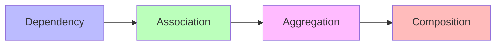
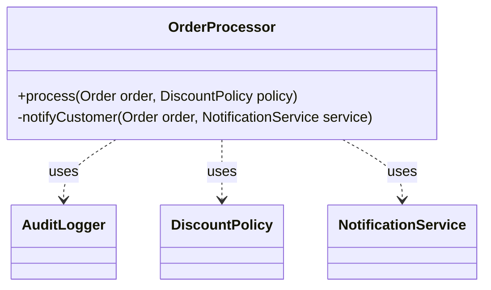
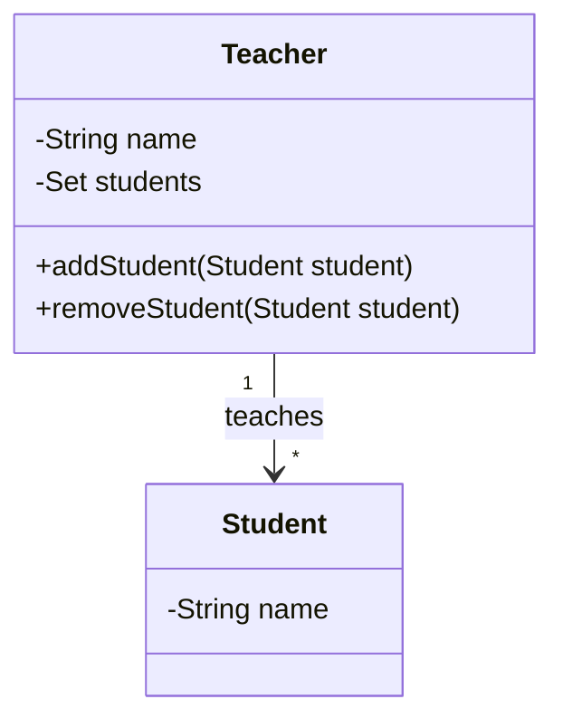
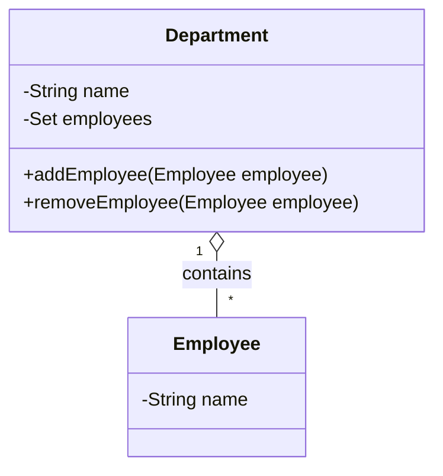
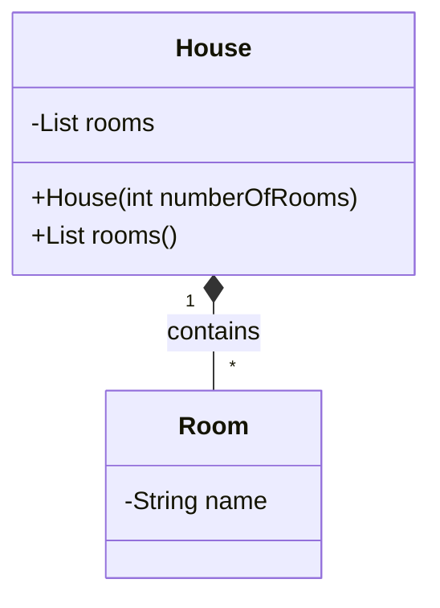
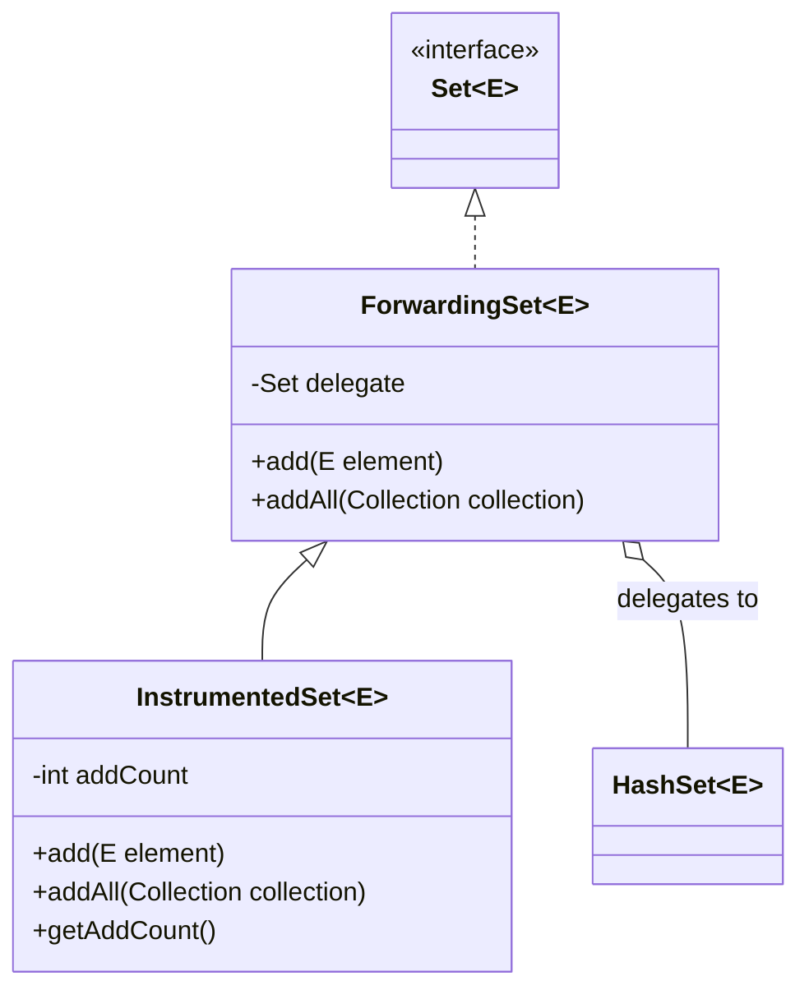
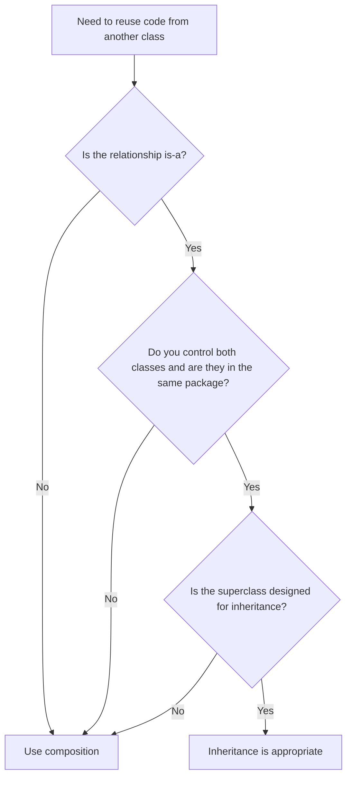
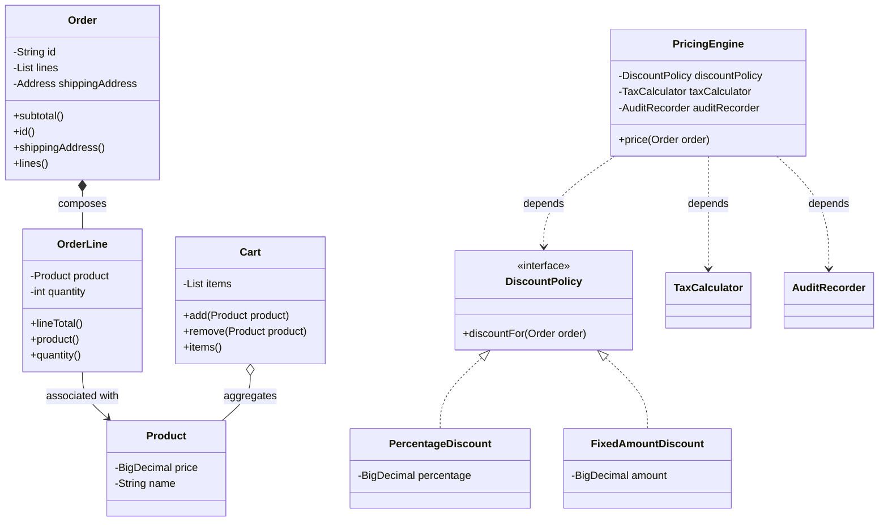

# 02.5. Composition, Aggregation, Association, and Dependency

## Overview

Every Java system is a web of relationships between classes. Some classes are descendants of others, inheriting their behavior and specializing it. Some classes are made up of others, bundling them as parts. Some classes merely know about others, holding references without owning them. Some classes are so loosely coupled that they only interact through method parameters, never holding a long-term reference at all. Understanding these relationships is the difference between designing a system that is clean, testable, and evolvable and one that is tangled, fragile, and resistant to change.

The four relationships we will study in this note are association, aggregation, composition, and dependency. They form a spectrum from weakest (dependency) to strongest (composition), with association and aggregation in between. The distinctions are sometimes subtle, but they have major architectural consequences: they determine who owns the lifetime of an object, who is responsible for its creation and disposal, how tightly coupled two classes are, and how easily you can substitute one implementation for another.

This note is a thorough treatment of all four relationships. We define each one precisely, show code examples in Java 21, examine the UML notation, discuss when each is appropriate, and walk through the famous "favor composition over inheritance" advice from Joshua Bloch's Effective Java. We close with a real-world case study, a list of common pitfalls, tips for designing clean relationships, and a bank of interview questions.

By the end of this note you should be able to look at any class diagram and articulate exactly what each arrow means, justify why you chose composition over inheritance in a particular design, and refactor a tangled inheritance hierarchy into a cleaner composition-based one.

## Background Knowledge

Before reading this note, make sure you are comfortable with:

- Classes, objects, and constructors (note 02.1).
- The four pillars of OOP, especially inheritance (note 02.2).
- Interfaces and abstract classes (note 02.3).
- Method overriding and the Liskov Substitution Principle (note 02.4).
- The `final` keyword as applied to fields and classes.
- The distinction between static type and dynamic type.
- The basics of UML class diagrams (we will use Mermaid to render them).

You should also be aware of the SOLID principles, particularly the Liskov Substitution Principle (the L in SOLID), which is the litmus test for whether inheritance is the right design. The Composition Over Inheritance principle is sometimes considered a fifth pillar or an extension of SOLID, and it is the central theme of this note.

## The Spectrum of Class Relationships

Class relationships form a spectrum from weakest to strongest. At the weakest end, a class uses another only briefly (dependency). At the strongest end, a class is composed of others and owns their lifetime (composition). The four relationships we will study, in order of increasing strength, are:



- **Dependency:** Class A uses class B as a local variable, parameter, or return type. There is no long-term reference. A does not own B; it just borrows it for the duration of a method call.
- **Association:** Class A has a field of type B. The relationship persists over time, but A and B have independent lifetimes. B can exist before, during, and after A.
- **Aggregation:** A specialized form of association where A is a container of B. B can exist independently of A and can be moved between containers.
- **Composition:** A specialized form of aggregation where A owns B. B cannot exist without A. When A is destroyed, B is destroyed too.

The distinction between association and aggregation is fuzzy in practice, and many practitioners collapse them into a single "has-a" relationship. The distinction between aggregation and composition is sharper and more important: it concerns ownership of lifetime.

## Dependency

Dependency is the weakest relationship between classes. A depends on B if A uses B in any way: as a parameter type, a local variable, a return type, or even just by calling a static method on B. There is no long-term reference from A to B; the relationship is transient.

```java
public class OrderProcessor {

    // OrderProcessor depends on AuditLogger (parameter), DiscountPolicy (field),
    // and NotificationService (local variable in another method).

    public void process(Order order, DiscountPolicy policy) {
        // OrderProcessor depends on DiscountPolicy as a parameter.
        BigDecimal total = order.total().subtract(policy.discountFor(order));

        // OrderProcessor depends on AuditLogger as a local variable.
        AuditLogger logger = new AuditLogger();
        logger.record(order, total);

        // OrderProcessor depends on NotificationService as a parameter to a helper.
        notifyCustomer(order, new EmailNotificationService());
    }

    private void notifyCustomer(Order order, NotificationService service) {
        service.send(order.customerEmail(), "Your order has been processed.");
    }
}
```

In UML, dependency is drawn as a dashed arrow with an open arrowhead:



Dependency is the loosest coupling between classes. If B changes, A may need to be recompiled, but the runtime behavior of A is otherwise unaffected. Dependencies are easy to manage: you can swap implementations at the call site, you can mock them in tests, and you can remove them by deleting a few lines of code.

The key principle for managing dependencies is dependency inversion: depend on abstractions, not concretions. If `OrderProcessor` depends on the `DiscountPolicy` interface rather than a concrete `TenPercentOffPolicy` class, you can swap discount strategies without changing `OrderProcessor`. This is the D in SOLID, and it is the foundation of every dependency injection framework.

## Association

Association is a long-term relationship where one class holds a reference to another. The two classes have independent lifetimes: B can exist before, during, and after A. A common example is the relationship between a teacher and a student: a teacher has many students, but the students exist independently of any one teacher.

```java
public class Teacher {
    private final String name;
    private final Set<Student> students = new HashSet<>();

    public Teacher(String name) {
        this.name = name;
    }

    public void addStudent(Student student) {
        students.add(student);
    }

    public void removeStudent(Student student) {
        students.remove(student);
    }
}

public class Student {
    private final String name;
    public Student(String name) {
        this.name = name;
    }
}

// Usage: teacher and student exist independently.
Student alice = new Student("Alice");
Student bob = new Student("Bob");
Teacher mrSmith = new Teacher("Mr. Smith");
mrSmith.addStudent(alice);
mrSmith.addStudent(bob);
// alice and bob still exist after mrSmith is garbage collected.
```

In UML, association is drawn as a solid line with an open arrowhead (for a directed association) or no arrowhead (for a bidirectional association):



Association is the most general has-a relationship. It is the relationship you choose when the two classes have a meaningful long-term connection but neither owns the other.

## Aggregation

Aggregation is a specialized form of association where one class is a container of others. The container is sometimes called the whole and the contained classes are called parts. The defining characteristic of aggregation is that the parts can exist independently of the whole: they can be created before the whole, removed from the whole, and reused in another whole.

A classic example is a department and its employees. A department has many employees, but the employees exist independently of the department. They can move to another department, or exist outside any department.

```java
public class Department {
    private final String name;
    private final Set<Employee> employees = new HashSet<>();

    public Department(String name) {
        this.name = name;
    }

    public void addEmployee(Employee employee) {
        employees.add(employee);
    }

    public void removeEmployee(Employee employee) {
        employees.remove(employee);
    }
}

public class Employee {
    private final String name;
    public Employee(String name) {
        this.name = name;
    }
}

// Usage: employees are created outside the department and can move between departments.
Employee alice = new Employee("Alice");
Employee bob = new Employee("Bob");
Department engineering = new Department("Engineering");
engineering.addEmployee(alice);
engineering.addEmployee(bob);

Department sales = new Department("Sales");
engineering.removeEmployee(alice);
sales.addEmployee(alice);
// Alice now works in Sales. The Employee object was never destroyed.
```

In UML, aggregation is drawn as a solid line with an open diamond at the whole end:



The distinction between association and aggregation is subtle and often subjective. The UML specification treats aggregation as a "shared" relationship, but in practice many modelers collapse them into a single has-a relationship. The distinction that matters more is between aggregation and composition, which concerns ownership of lifetime.

## Composition

Composition is the strongest has-a relationship. The whole owns the lifetime of the parts: when the whole is created, the parts are created (or passed in and exclusively owned); when the whole is destroyed, the parts are destroyed with it. The parts cannot exist outside the whole and cannot be transferred to another whole.

A classic example is a house and its rooms. A house is composed of rooms; the rooms cannot exist without the house. If you demolish the house, the rooms cease to exist.

```java
public class House {
    private final List<Room> rooms;

    public House(int numberOfRooms) {
        // The house creates its own rooms; they cannot exist outside the house.
        this.rooms = new ArrayList<>();
        for (int i = 0; i < numberOfRooms; i++) {
            this.rooms.add(new Room("Room " + (i + 1)));
        }
    }

    public List<Room> rooms() {
        // Return an unmodifiable view so callers cannot add or remove rooms.
        return Collections.unmodifiableList(rooms);
    }
}

public class Room {
    private final String name;
    public Room(String name) {
        this.name = name;
    }
}

// Usage: rooms are created inside the house and cannot outlive it.
House myHouse = new House(3);
// When myHouse is garbage collected, the Room objects inside it are also eligible for collection.
```

In UML, composition is drawn as a solid line with a filled diamond at the whole end:



Composition is the relationship you choose when the parts are an implementation detail of the whole. Callers should not be able to add, remove, or replace parts directly; they should go through the whole's API, which enforces invariants.

### Defensive Copying in Composition

When the parts are passed in from outside, composition requires defensive copying to ensure that the caller cannot retain a reference and mutate the part behind the whole's back:

```java
public final class DateRange {

    private final Instant start;
    private final Instant end;

    public DateRange(Instant start, Instant end) {
        if (start == null || end == null) {
            throw new IllegalArgumentException("start and end must not be null");
        }
        if (end.isBefore(start)) {
            throw new IllegalArgumentException("end must not be before start");
        }
        // Defensive copies: even if Instant is immutable, the pattern matters for
        // mutable types like Date or List.
        this.start = start;
        this.end = end;
    }

    public Instant start() {
        return start;
    }

    public Instant end() {
        return end;
    }
}
```

For mutable types, the defensive copy is mandatory. For immutable types like `Instant`, `String`, and records, it is unnecessary but harmless. The general rule is: if a caller can mutate the object after passing it in, copy it.

### Composition as Forwarding

A common pattern with composition is forwarding: the whole exposes methods that delegate to its parts. This is the foundation of the decorator and adapter patterns (see note 16.x):

```java
public class LoggingList<E> implements List<E> {

    private final List<E> delegate;

    public LoggingList(List<E> delegate) {
        this.delegate = Objects.requireNonNull(delegate);
    }

    @Override
    public boolean add(E element) {
        System.out.println("Adding: " + element);
        return delegate.add(element);
    }

    @Override
    public E get(int index) {
        System.out.println("Getting at index: " + index);
        return delegate.get(index);
    }

    // Forward every other List method to delegate...
    @Override public int size() { return delegate.size(); }
    @Override public boolean isEmpty() { return delegate.isEmpty(); }
    // ...and so on for every method of List.
}
```

Java 21's sealed interfaces and records make forwarding even cleaner, because you can declare a small focused interface and forward only the methods that matter.

## Favor Composition Over Inheritance

Joshua Bloch's Effective Java item 18 famously advises "favor composition over inheritance." The reasoning is that inheritance breaks encapsulation across package boundaries: a subclass depends on the implementation details of its superclass, and changes to the superclass can break the subclass even without recompiling it. Composition, by contrast, depends only on the public API of the composed class, which is much more stable.

Consider this fragile inheritance example:

```java
public class InstrumentedHashSet<E> extends HashSet<E> {

    private int addCount = 0;

    @Override
    public boolean add(E element) {
        addCount++;
        return super.add(element);
    }

    @Override
    public boolean addAll(Collection<? extends E> collection) {
        addCount += collection.size();
        return super.addAll(collection);
    }

    public int getAddCount() {
        return addCount;
    }
}

// Usage:
InstrumentedHashSet<String> set = new InstrumentedHashSet<>();
set.addAll(List.of("a", "b", "c"));
System.out.println(set.getAddCount());   // Prints 6, not 3!
```

The bug is that `HashSet.addAll` internally calls `add` for each element. The instrumented subclass overrides both `add` and `addAll`, so each element gets counted twice: once in `addAll` (which adds the size of the collection) and once in `add` (which is called by `addAll` for each element). The subclass is correct in isolation but broken because it depends on an implementation detail of the superclass (that `addAll` calls `add`).

The composition-based version has no such problem:

```java
public class InstrumentedSet<E> extends ForwardingSet<E> {

    private int addCount = 0;

    public InstrumentedSet(Set<E> delegate) {
        super(delegate);
    }

    @Override
    public boolean add(E element) {
        addCount++;
        return super.add(element);
    }

    @Override
    public boolean addAll(Collection<? extends E> collection) {
        addCount += collection.size();
        return super.addAll(collection);
    }

    public int getAddCount() {
        return addCount;
    }
}

public class ForwardingSet<E> implements Set<E> {

    private final Set<E> delegate;

    public ForwardingSet(Set<E> delegate) {
        this.delegate = Objects.requireNonNull(delegate);
    }

    @Override
    public boolean add(E element) {
        return delegate.add(element);
    }

    @Override
    public boolean addAll(Collection<? extends E> collection) {
        return delegate.addAll(collection);
    }

    // Forward every other Set method to delegate...
    @Override public int size() { return delegate.size(); }
    @Override public boolean isEmpty() { return delegate.isEmpty(); }
    // ...and so on.
}

// Usage:
InstrumentedSet<String> set = new InstrumentedSet<>(new HashSet<>());
set.addAll(List.of("a", "b", "c"));
System.out.println(set.getAddCount());   // Prints 3, correct!
```

The composition-based version correctly counts 3, because the instrumented set delegates to a concrete `HashSet` (which has its own internal `addAll` that does not call the instrumented `add`). The instrumented set's `addAll` adds the collection size, and its `add` is never called from `addAll`, so there is no double counting.



The composition-based version has several advantages:

1. It does not depend on the implementation details of `HashSet`. If `HashSet` changes how `addAll` works internally, the instrumented set still counts correctly.
2. It works with any `Set` implementation, not just `HashSet`. You can instrument a `TreeSet` or a `LinkedHashSet` by passing a different delegate.
3. It can add behavior to a `final` class (which cannot be subclassed).
4. It does not expose the public methods of `HashSet` that the instrumented set does not want to override.

The trade-off is more boilerplate: you must write forwarding methods for every method of the interface. In practice, this is acceptable, and libraries like Guava's `ForwardingObject` reduce the boilerplate further.

## When to Use Inheritance vs Composition

Despite the general advice to favor composition, inheritance still has its place. Use inheritance when:

1. The subclass truly is a subtype of the superclass. Every place that expects a `Vehicle` should be able to accept a `Car` without surprise.
2. The class is designed for inheritance. The JDK documents which classes are designed for subclassing (e.g., `AbstractList`) and which are not (e.g., `String`).
3. You control both classes and they live in the same package or module.
4. The hierarchy is shallow and the shared behavior is non-trivial.

Use composition when:

1. The relationship is has-a rather than is-a.
2. You want to reuse code from a `final` class or from multiple unrelated classes.
3. You want to add behavior at runtime (decorators, strategies).
4. The class hierarchy is in another package or module that you do not control.
5. You want to evolve the implementation without breaking subclasses.



## A Real-World Case Study: Pricing Engine

Let us put all four relationships together in a realistic example. Suppose we are building a pricing engine for an e-commerce site. The engine needs to apply discounts, compute taxes, and emit an audit record. The classes involved are:

- `PricingEngine`: the orchestrator. It depends on `DiscountPolicy`, `TaxCalculator`, and `AuditRecorder` (dependencies, injected as parameters or constructor arguments).
- `Order`: composed of `OrderLine` objects (composition: the order lines cannot exist outside the order).
- `OrderLine`: associated with a `Product` (association: the product exists independently of any order line).
- `DiscountPolicy`: an interface implemented by `PercentageDiscount` and `FixedAmountDiscount` (inheritance: each is a kind of discount policy).
- `Cart`: aggregates `Product` objects (aggregation: the products exist independently of the cart and can be added or removed).

```java
// Dependency: PricingEngine depends on DiscountPolicy, TaxCalculator, AuditRecorder.
public class PricingEngine {

    private final DiscountPolicy discountPolicy;
    private final TaxCalculator taxCalculator;
    private final AuditRecorder auditRecorder;

    public PricingEngine(DiscountPolicy discountPolicy,
                         TaxCalculator taxCalculator,
                         AuditRecorder auditRecorder) {
        this.discountPolicy = discountPolicy;
        this.taxCalculator = taxCalculator;
        this.auditRecorder = auditRecorder;
    }

    public Receipt price(Order order) {
        BigDecimal subtotal = order.subtotal();
        BigDecimal discount = discountPolicy.discountFor(order);
        BigDecimal afterDiscount = subtotal.subtract(discount);
        BigDecimal tax = taxCalculator.taxFor(afterDiscount, order.shippingAddress());
        BigDecimal total = afterDiscount.add(tax);
        auditRecorder.record(order, total);
        return new Receipt(order.id(), subtotal, discount, tax, total);
    }
}

// Composition: Order is composed of OrderLine. OrderLines cannot exist outside Order.
public final class Order {
    private final String id;
    private final List<OrderLine> lines;
    private final Address shippingAddress;

    public Order(String id, Address shippingAddress, List<OrderLine> lines) {
        this.id = id;
        this.shippingAddress = shippingAddress;
        // Defensive copy: the caller's list cannot affect our internal state.
        this.lines = List.copyOf(lines);
    }

    public BigDecimal subtotal() {
        return lines.stream()
                .map(OrderLine::lineTotal)
                .reduce(BigDecimal.ZERO, BigDecimal::add);
    }

    public String id() { return id; }
    public Address shippingAddress() { return shippingAddress; }
    public List<OrderLine> lines() { return lines; }
}

// Association: OrderLine is associated with Product. Product exists independently.
public final class OrderLine {
    private final Product product;
    private final int quantity;

    public OrderLine(Product product, int quantity) {
        this.product = product;
        this.quantity = quantity;
    }

    public BigDecimal lineTotal() {
        return product.price().multiply(BigDecimal.valueOf(quantity));
    }

    public Product product() { return product; }
    public int quantity() { return quantity; }
}

// Aggregation: Cart aggregates Product. Products exist before and after the cart.
public final class Cart {
    private final List<Product> items = new ArrayList<>();

    public void add(Product product) {
        items.add(product);
    }

    public void remove(Product product) {
        items.remove(product);
    }

    public List<Product> items() {
        return List.copyOf(items);
    }
}

// Inheritance: PercentageDiscount and FixedAmountDiscount are kinds of DiscountPolicy.
public interface DiscountPolicy {
    BigDecimal discountFor(Order order);
}

public final class PercentageDiscount implements DiscountPolicy {
    private final BigDecimal percentage;
    public PercentageDiscount(BigDecimal percentage) {
        this.percentage = percentage;
    }
    @Override
    public BigDecimal discountFor(Order order) {
        return order.subtotal().multiply(percentage).divide(BigDecimal.valueOf(100));
    }
}

public final class FixedAmountDiscount implements DiscountPolicy {
    private final BigDecimal amount;
    public FixedAmountDiscount(BigDecimal amount) {
        this.amount = amount;
    }
    @Override
    public BigDecimal discountFor(Order order) {
        return order.subtotal().min(amount);
    }
}
```



This single example exercises all four relationships and inheritance. Notice how each relationship is chosen for its semantic meaning: orders compose their lines (no lines without an order), order lines associate with products (products exist independently), carts aggregate products (products move in and out of carts), and discount policies are inherited (each is a kind of policy).

## Common Pitfalls

1. **Inheritance for code reuse.** Subclassing to reuse a few methods, when there is no is-a relationship, produces fragile hierarchies. Use composition instead.

2. **Leaking internal references.** Returning a live reference to an internal list, map, or array lets callers mutate your invariants. Return defensive copies or unmodifiable views.

3. **Bidirectional associations without sync logic.** If A has a reference to B and B has a reference back to A, both sides must be kept in sync. Use a single method that updates both sides.

4. **Confusing aggregation and composition.** If the part can exist without the whole, it is aggregation. If the part cannot exist without the whole, it is composition. Choose accordingly.

5. **Forgetting defensive copies in constructors.** If you store a mutable input directly, the caller can mutate it after construction. Copy mutable inputs.

6. **Forgetting defensive copies in accessors.** If you return a live reference to a mutable internal field, callers can mutate it. Return defensive copies or unmodifiable views.

7. **Circular dependencies.** If A depends on B and B depends on A, the design is tangled. Break the cycle by introducing an interface or by moving the shared dependency to a third class.

8. **Too many dependencies.** If a class takes a dozen dependencies in its constructor, it is probably doing too much. Split it into smaller classes.

9. **Using inheritance across package boundaries.** The implementation of a superclass can change in ways that break subclasses, even without recompiling them. Reserve inheritance for closely co-designed types in the same package.

10. **Holding references longer than necessary.** Long-lived references prevent garbage collection. Use `WeakReference` or `SoftReference` for caches, or simply clear the field when you no longer need it.

11. **Coupling through static state.** Static fields create hidden dependencies between classes. They make testing harder and they prevent parallel test execution. Prefer instance fields injected through constructors.

12. **Treating dependencies as optional.** If a dependency is truly optional, document it and use a sensible default. If it is required, fail fast in the constructor with `Objects.requireNonNull`.

13. **Overusing composition.** Composition has more boilerplate than inheritance. For closely related types in the same package, inheritance may still be the right choice.

14. **Forgetting to forward equals and hashCode.** A forwarding class must define its own `equals` and `hashCode` based on its own state, not delegate to the wrapped object.

15. **Not documenting relationships.** A class diagram is a contract. Document each relationship in Javadoc so future maintainers know whether to expect a part to outlive its whole.

## Tips and Tricks

- Start with composition and switch to inheritance only when the relationship is clearly is-a and the classes are co-designed.
- Depend on interfaces, not concrete classes. This is the dependency inversion principle, and it is the foundation of testable code.
- Use constructor injection for required dependencies. It makes the dependency explicit and fails fast if a required dependency is missing.
- Use defensive copies for mutable inputs and outputs. The cost is small and the safety is large.
- Use `List.copyOf` and `Map.copyOf` for unmodifiable copies. They are concise and efficient.
- Use `Collections.unmodifiableList` and friends for unmodifiable views, when a copy would be too expensive.
- Prefer aggregation over composition when the part has an independent lifecycle. This makes the design more flexible.
- Use the decorator pattern to add behavior to a class without subclassing. Composition makes decorators easy.
- Use the strategy pattern to swap algorithms at runtime. Composition makes strategies easy.
- Document each relationship in Javadoc. A comment like "this OrderLine is composed of a Product reference; the Product has an independent lifecycle" prevents future confusion.
- Draw a class diagram for any non-trivial design. Mermaid class diagrams are easy to write and easy to read.
- Beware of leaky abstractions: if a dependency exposes implementation details through its API, callers will couple to those details.
- Use `final` on fields that hold dependencies. This prevents accidental reassignment and makes the dependency visible in the constructor.

## Interview Questions

**Q1. What is the difference between association, aggregation, and composition?**
Association is any long-term relationship where one class holds a reference to another. Aggregation is a specialized association where one class is a container of others, but the parts have independent lifetimes. Composition is a specialized aggregation where the whole owns the lifetime of the parts: when the whole is destroyed, the parts are destroyed too.

**Q2. When would you use composition over inheritance?**
Use composition when the relationship is has-a rather than is-a, when you want to reuse code from a final class or from multiple unrelated classes, when you want to add behavior at runtime, or when the superclass is in another package you do not control. Use inheritance when the relationship is truly is-a and the classes are co-designed in the same package.

**Q3. What is the Liskov Substitution Principle?**
The principle that subclasses should be substitutable for their superclass without breaking the program. Every method that operates on the superclass must behave correctly when given an instance of the subclass. Violating this principle means inheritance is the wrong design.

**Q4. What is the InstrumentedHashSet problem?**
A subclass of HashSet that overrides add and addAll to count insertions produces double counts because HashSet.addAll internally calls add. The subclass depends on an implementation detail of the superclass. The fix is to use composition: a ForwardingSet that delegates to a concrete HashSet, with the instrumented logic in a wrapper that does not call back into itself.

**Q5. What is dependency inversion?**
The principle that high-level modules should not depend on low-level modules; both should depend on abstractions. In Java terms, depend on interfaces rather than concrete classes. This makes the design testable (you can substitute mocks) and flexible (you can substitute implementations).

**Q6. What is the difference between dependency and association?**
A dependency is a transient relationship where one class uses another as a parameter, local variable, or return type. There is no long-term reference. An association is a long-term relationship where one class holds a field of the other.

**Q7. How do you implement a defensive copy?**
In the constructor, copy the input into a new instance of the same type (for example, `new ArrayList<>(input)` for a list, or `new Date(input.getTime())` for a Date). In the accessor, do the same. This prevents the caller from mutating your internal state after passing in or reading out.

**Q8. What is the decorator pattern and how does it relate to composition?**
The decorator pattern adds behavior to a class without subclassing, by wrapping an instance of the class and forwarding method calls to it with added behavior. It is a direct application of composition over inheritance.

**Q9. What is the strategy pattern and how does it relate to composition?**
The strategy pattern encapsulates an algorithm behind an interface and lets the caller swap implementations. The class that uses the strategy composes with the interface, not with a concrete implementation.

**Q10. How do you decide between aggregation and composition?**
Ask: can the part exist without the whole? If yes, use aggregation. If no, use composition. For example, a department aggregates employees (employees exist before and after the department), but a house composes rooms (rooms cannot exist without the house).

**Q11. What is a circular dependency and why is it bad?**
A circular dependency is when A depends on B and B depends on A. It makes the design tangled, prevents independent testing, and can cause initialization problems. Break the cycle by introducing an interface or by moving the shared dependency to a third class.

**Q12. What is constructor injection and why is it preferred?**
Constructor injection is when dependencies are passed to a class through its constructor. It is preferred because it makes the dependency explicit, fails fast if a required dependency is missing, and produces immutable objects (when the field is final).

**Q13. What is the difference between `List.copyOf` and `Collections.unmodifiableList`?**
`List.copyOf` creates a new unmodifiable copy of the input. Changes to the input after the call do not affect the copy. `Collections.unmodifiableList` creates a view of the input; changes to the input are visible through the view. Use `copyOf` when you want isolation; use `unmodifiableList` when a copy would be too expensive and you trust the input not to change.

**Q14. How do you implement a forwarding class?**
Declare a class that implements the same interface as the wrapped class. Store the wrapped instance in a final field. Forward every method of the interface to the wrapped instance. Add behavior in subclasses or wrappers that override specific methods.

**Q15. Why is it bad to depend on static state?**
Static fields create hidden dependencies between classes. They make testing harder (you cannot easily substitute a mock) and they prevent parallel test execution (static state is shared across tests). Prefer instance fields injected through constructors.

## Summary

Class relationships form a spectrum from weakest (dependency) to strongest (composition). Dependency is a transient relationship where one class uses another without holding a long-term reference. Association is a long-term relationship where one class holds a field of another. Aggregation is a specialized association where one class is a container of others with independent lifetimes. Composition is the strongest has-a relationship, where the whole owns the lifetime of the parts.

We examined each relationship with code examples and Mermaid diagrams, walked through the famous "favor composition over inheritance" advice from Effective Java with the InstrumentedHashSet case study, and applied all four relationships together in a realistic pricing engine example. We discussed when to use inheritance (true is-a, co-designed classes) and when to use composition (has-a, runtime flexibility, classes you do not control). We closed with a long list of common pitfalls, practical tips, and interview questions.

The most important takeaways are these: depend on abstractions, not concretions; use constructor injection for required dependencies; make defensive copies of mutable inputs and outputs; favor composition for code reuse; reserve inheritance for true is-a relationships between co-designed classes; and document each relationship in Javadoc so future maintainers understand the design.

The next note (02.6) covers nested classes, anonymous classes, and access modifiers, which give you fine-grained control over how your classes relate to each other and how their internals are protected.
