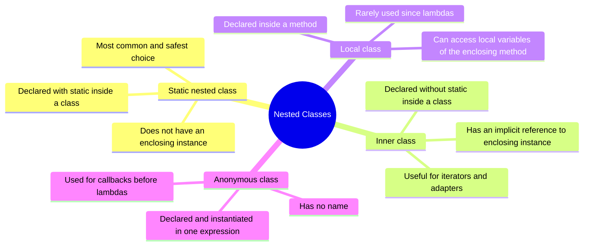
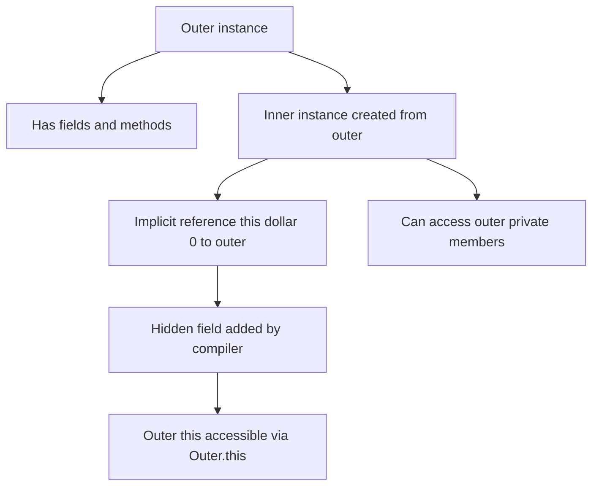
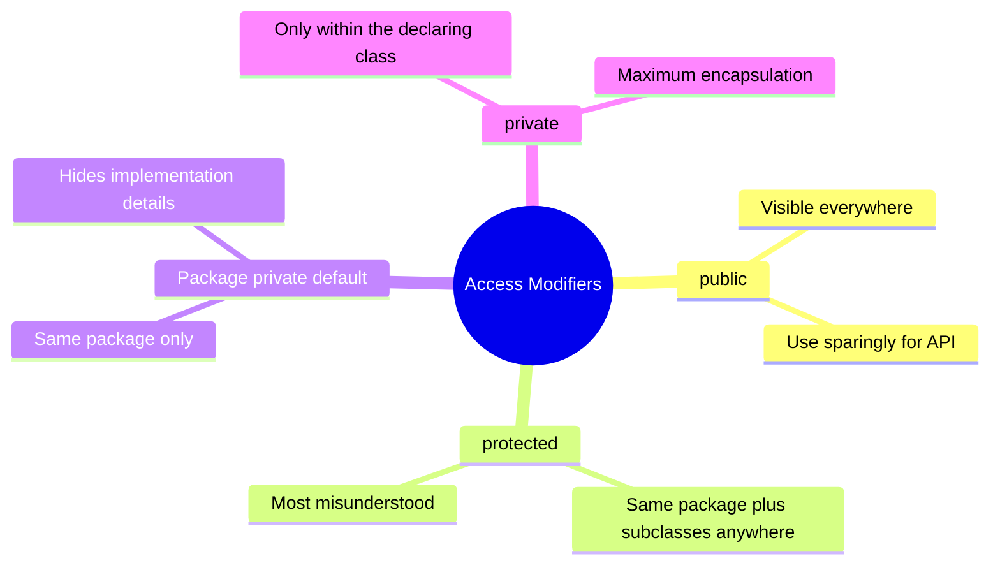

# 02.6. Nested Classes, Anonymous Classes, and Access Modifiers

## Overview

Real Java systems are not made of flat collections of top-level classes. They are made of classes that live inside other classes, classes that have no name at all, classes that share state with their enclosing instance, and classes whose visibility is carefully tuned to expose only what callers need to see. These features are not luxuries: they are the tools that let you build libraries with stable public surfaces, hide implementation details behind package-private helpers, and write event handlers and callbacks without polluting the namespace with dozens of single-use classes.

This note covers three related topics. First, the four kinds of nested classes in Java: static nested classes, inner classes (non-static member classes), local classes, and anonymous classes. Second, the four access modifiers (public, protected, package-private, private) and the precise rules that govern their visibility, including the often-misunderstood rule that protected members are accessible from the same package and from subclasses in any package. Third, the relationship between these features: how access modifiers interact with nested classes, how the synthetic accessor methods work, and how the JVM represents nested classes at runtime.

We will also cover modern alternatives to anonymous classes (lambdas, records, sealed types) and the modern best practice of preferring static nested classes over inner classes wherever possible. We close with a long list of pitfalls, tips, and interview questions.

By the end of this note you should be able to design a public API with a stable surface, hide implementation details behind package-private nested types, choose the right kind of nested class for each situation, and predict exactly which access modifier is needed for any given member.

## Background Knowledge

Before reading this note, make sure you are comfortable with:

- Classes, objects, and constructors (note 02.1).
- The four pillars of OOP, especially encapsulation (note 02.2).
- Interfaces and abstract classes (note 02.3).
- Method overriding and overloading (note 02.4).
- Composition and the difference between has-a and is-a (note 02.5).
- The `static` and `final` keywords as applied to fields, methods, and classes.
- The Java package system and how `import` works.
- The basics of lambda expressions (covered more fully in the Functional Java note).

You should also be aware that every Java class file produced by the compiler corresponds to one Java type, and that nested classes are compiled into separate class files with names like `Outer$Inner.class`. This naming convention is what makes nested classes feel like they are inside their enclosing class, even though at the JVM level they are siblings.

## The Four Kinds of Nested Classes

Java defines four kinds of nested classes, each with slightly different rules:



All four kinds of nested classes can be declared `private`, `protected`, package-private, or `public` (when they are member classes), which gives you fine-grained control over their visibility.

## Static Nested Classes

A static nested class is a class declared with the `static` keyword inside another class. It behaves like a top-level class for most purposes: it does not have an implicit reference to an enclosing instance, it can be instantiated without an enclosing instance, and it can have static members of its own.

```java
public class Calculator {

    // A static nested class. Lives inside Calculator but does not need
    // an enclosing Calculator instance.
    public static class Result {
        private final double value;
        private final String operation;

        public Result(double value, String operation) {
            this.value = value;
            this.operation = operation;
        }

        public double value() { return value; }
        public String operation() { return operation; }
    }

    public Result add(double a, double b) {
        return new Result(a + b, "add");
    }

    public Result multiply(double a, double b) {
        return new Result(a * b, "multiply");
    }
}

// Usage:
Calculator calc = new Calculator();
Calculator.Result r = calc.add(2, 3);
System.out.println(r.value() + " via " + r.operation());
```

Static nested classes are the most common and safest choice for nested types. They are easy to use, they do not create hidden coupling to an enclosing instance, and they can be made `public` for use by callers or `private` for use only within the enclosing class.

A common pattern is to use a `public static nested Builder` class for the builder pattern:

```java
public final class Pizza {

    private final boolean cheese;
    private final boolean pepperoni;
    private final boolean mushrooms;
    private final boolean onions;
    private final Size size;

    private Pizza(Builder builder) {
        this.cheese = builder.cheese;
        this.pepperoni = builder.pepperoni;
        this.mushrooms = builder.mushrooms;
        this.onions = builder.onions;
        this.size = builder.size;
    }

    public enum Size { Small, Medium, Large }

    public static class Builder {
        private boolean cheese;
        private boolean pepperoni;
        private boolean mushrooms;
        private boolean onions;
        private Size size = Size.Medium;

        public Builder cheese() { cheese = true; return this; }
        public Builder pepperoni() { pepperoni = true; return this; }
        public Builder mushrooms() { mushrooms = true; return this; }
        public Builder onions() { onions = true; return this; }
        public Builder size(Size size) { this.size = size; return this; }

        public Pizza build() {
            return new Pizza(this);
        }
    }
}

// Usage:
Pizza p = new Pizza.Builder()
        .size(Pizza.Size.Large)
        .cheese()
        .pepperoni()
        .build();
```

The `Builder` is declared `public static` so callers can write `new Pizza.Builder()` without needing an enclosing `Pizza` instance (which would be impossible anyway, since `Pizza` has no public constructor).

## Inner Classes (Non-Static Member Classes)

An inner class is a class declared inside another class without the `static` keyword. Each instance of an inner class is implicitly associated with an instance of its enclosing class, and it can access the enclosing instance's fields and methods directly, including private ones.

```java
public class LinkedList<E> {

    private Node head;
    private int size;

    private class Node {
        E data;
        Node next;
        Node(E data) { this.data = data; }
    }

    public class Iterator {
        private Node current = head;

        public boolean hasNext() {
            return current != null;
        }

        public E next() {
            E data = current.data;
            current = current.next;
            return data;
        }
    }

    public Iterator iterator() {
        return new Iterator();
    }

    public void add(E element) {
        Node node = new Node(element);
        node.next = head;
        head = node;
        size++;
    }
}

// Usage:
LinkedList<String> list = new LinkedList<>();
list.add("a");
list.add("b");
LinkedList<String>.Iterator it = list.iterator();
while (it.hasNext()) {
    System.out.println(it.next());
}
```

The `Iterator` inner class has an implicit reference to its enclosing `LinkedList` instance, which it uses to access the private `head` field. The `Node` inner class also has an implicit reference, even though it does not use the enclosing instance directly; this is one reason to prefer static nested classes.



### The Hidden `this$0` Field

Every inner class instance has a hidden field, named `this$0` in the bytecode, that holds a reference to the enclosing instance. The compiler adds this field to every inner class constructor and initializes it from a synthetic constructor parameter. You can access the enclosing instance from inside the inner class with the syntax `OuterClass.this`:

```java
public class Outer {
    private int x = 10;

    public class Inner {
        public int outerX() {
            return Outer.this.x;   // explicit access to enclosing instance
        }
    }
}
```

The hidden reference has two costs. First, it consumes memory: every inner instance is four or eight bytes larger than an equivalent static nested instance. Second, it prevents the inner instance from being garbage collected as long as the outer instance is reachable, which can cause memory leaks if the inner instance is held by a long-lived data structure.

### When to Use Inner Classes

Use inner classes when the inner instance genuinely needs access to the enclosing instance's state, and the relationship is "the inner instance belongs to this specific outer instance." The classic use case is an iterator that walks a specific collection. The iterator needs to read the collection's private fields, and it does not make sense to share an iterator across collections.

If the inner class does not need the enclosing instance, make it static. This is the advice of Joshua Bloch's Effective Java item 24: "favor static member classes over non-static." The cost of an unnecessary inner class is small but real, and the benefit of static is clarity: a static nested class clearly has no relationship to an enclosing instance.

## Local Classes

A local class is a class declared inside a method, constructor, or initializer block. It is in scope only within the block that declares it, and it cannot be referenced outside that block. Local classes can access local variables of the enclosing block, but only if those variables are final or effectively final (not reassigned after initialization).

```java
public class Logger {

    public Runnable createLogger(String prefix) {
        // A local class declared inside a method.
        class PrefixedLogger implements Runnable {
            @Override
            public void run() {
                System.out.println(prefix + ": logging at " + Instant.now());
            }
        }
        return new PrefixedLogger();
    }
}

// Usage:
Logger logger = new Logger();
Runnable r = logger.createLogger("APP");
r.run();
```

The local class `PrefixedLogger` captures the `prefix` parameter from the enclosing method. This capture works because `prefix` is effectively final: it is not reassigned after initialization. If you reassigned `prefix` after declaring the local class, the compiler would refuse to compile, because the captured value would be ambiguous.

Local classes are rare in modern Java, because lambdas (Java 8) cover most of the same use cases with much less ceremony. A local class is still useful when you need to declare multiple methods, fields, or constructors in the type, which lambdas cannot do.

## Anonymous Classes

An anonymous class is a class declared and instantiated in a single expression. It has no name, and it can either extend a superclass or implement an interface. Anonymous classes were the primary way to write callbacks and event handlers before Java 8 introduced lambdas.

```java
public class Button {

    public interface OnClickListener {
        void onClick();
    }

    private OnClickListener listener;

    public void setOnClickListener(OnClickListener listener) {
        this.listener = listener;
    }

    public void click() {
        if (listener != null) listener.onClick();
    }
}

// Usage with an anonymous class:
Button button = new Button();
button.setOnClickListener(new Button.OnClickListener() {
    @Override
    public void onClick() {
        System.out.println("Button was clicked!");
    }
});
button.click();
```

The expression `new Button.OnClickListener() { ... }` creates a new instance of an anonymous class that implements `OnClickListener`. The compiler generates a class file named `Button$1.class` (the number increments for each anonymous class in the enclosing class).

### Anonymous Classes vs Lambdas

For functional interfaces (interfaces with a single abstract method), lambdas are almost always preferable to anonymous classes. They are more concise, they do not generate a separate class file (the JVM uses `invokedynamic` to create the lambda), and they do not introduce a new scope.

```java
// With an anonymous class:
button.setOnClickListener(new Button.OnClickListener() {
    @Override
    public void onClick() {
        System.out.println("Clicked!");
    }
});

// With a lambda:
button.setOnClickListener(() -> System.out.println("Clicked!"));
```

Anonymous classes are still useful in a few cases:

1. When the target type is a class (not an interface) or an interface with multiple abstract methods.
2. When you need to declare fields or multiple methods on the instance.
3. When you need to capture `this` of the enclosing class (lambdas capture the enclosing `this`, anonymous classes have their own `this`).

```java
// Anonymous class is necessary when implementing an interface with multiple methods.
Comparator<String> comparator = new Comparator<>() {
    @Override
    public int compare(String a, String b) {
        return a.compareToIgnoreCase(b);
    }

    @Override
    public Comparator<String> reversed() {
        return (x, y) -> -compare(x, y);
    }
};
```

In modern Java (since Java 14), local record classes and pattern matching often replace the last few use cases of anonymous classes, and lambdas replace the rest. Anonymous classes are now mainly seen in pre-Java 8 code and in the rare cases where they are genuinely necessary.

## The Four Access Modifiers

Java has four access modifiers: `public`, `protected`, package-private (the default, with no keyword), and `private`. They control the visibility of classes, fields, methods, and constructors.



The visibility rules, from most restrictive to least restrictive:

| Modifier | Same class | Same package | Subclass in another package | Anywhere |
| --- | --- | --- | --- | --- |
| `private` | Yes | No | No | No |
| package-private (default) | Yes | Yes | No | No |
| `protected` | Yes | Yes | Yes (through a reference of the subclass type) | No |
| `public` | Yes | Yes | Yes | Yes |

The `protected` row is the trickiest. A `protected` member is accessible from any class in the same package, and from subclasses in any package, but the subclass access has a subtle rule: a subclass in another package can access a `protected` member only through a reference of the subclass's own type (or one of its subtypes), not through a reference of the superclass type. This rule prevents a subclass from accessing protected members of unrelated sibling subclasses.

```java
// File: com/example/parent/Base.java
package com.example.parent;

public class Base {
    protected void onlyForSubclasses() {
        System.out.println("Hello from Base");
    }
}

// File: com/example/child/Sub.java
package com.example.child;

import com.example.parent.Base;

public class Sub extends Base {

    public void test() {
        // OK: accessing through 'this' (which is of type Sub).
        onlyForSubclasses();

        // OK: accessing through another Sub reference.
        Sub other = new Sub();
        other.onlyForSubclasses();

        // ERROR: cannot access through a Base reference from another package.
        // Base base = new Base();
        // base.onlyForSubclasses();
    }
}
```

### Choosing the Right Access Modifier

The general principle is to start strict and loosen later. Mark every field `private` by default. Mark every method package-private by default, then promote to `protected` or `public` only when there is a clear reason. Mark every class package-private by default, then promote to `public` only when callers outside the package need to see it.

This discipline produces small, focused public APIs that are easy to evolve. If you start permissive and tighten later, you break callers; if you start strict and loosen later, you only add capabilities.

```java
// A well-encapsulated class.
public final class Temperature {

    // Private fields: callers cannot see or mutate them.
    private final double kelvin;

    // Public constructor: callers need to create instances.
    public Temperature(double kelvin) {
        if (kelvin < 0) {
            throw new IllegalArgumentException("Temperature cannot be below absolute zero");
        }
        this.kelvin = kelvin;
    }

    // Public accessors: callers need to read the value in various units.
    public double kelvin() { return kelvin; }
    public double celsius() { return kelvin - 273.15; }
    public double fahrenheit() { return kelvin * 9 / 5 - 459.67; }

    // Package-private helper: only this package needs to format for logs.
    String toLogString() {
        return String.format("%.2fK", kelvin);
    }

    // Private helper: only this class uses it.
    private boolean isAboveFreezing() {
        return kelvin > 273.15;
    }
}
```

### Access Modifiers on Nested Classes

Nested classes can have any of the four access modifiers when they are member classes (declared directly inside another class). This lets you hide implementation types as private nested classes or expose helper types as public static nested classes.

```java
public class Cache {

    // Private static nested class: only Cache can see this.
    private static class Entry {
        final Object key;
        final Object value;
        final long expiresAt;
        Entry next;

        Entry(Object key, Object value, long ttlMillis) {
            this.key = key;
            this.value = value;
            this.expiresAt = System.currentTimeMillis() + ttlMillis;
        }

        boolean isExpired() {
            return System.currentTimeMillis() > expiresAt;
        }
    }

    // Public static nested class: callers can use this as a configuration type.
    public static class Config {
        public final long defaultTtlMillis;
        public final int maxSize;

        public Config(long defaultTtlMillis, int maxSize) {
            this.defaultTtlMillis = defaultTtlMillis;
            this.maxSize = maxSize;
        }
    }

    private final Entry[] table;
    private final Config config;

    public Cache(Config config) {
        this.config = config;
        this.table = new Entry[config.maxSize];
    }

    // ... put, get, remove methods ...
}
```

The `Entry` class is an implementation detail of `Cache`. By making it `private static`, we hide it completely from callers, who never need to know that the cache uses a hash table internally. The `Config` class is part of the public API, so it is `public static`.

## Synthetic Accessor Methods

When a top-level class needs to access a private member of a nested class (or vice versa), the compiler generates a synthetic accessor method. The accessor has package-private visibility and a name like `access$000`. This is invisible to the source code but visible in the bytecode.

```java
public class Outer {

    private static class Inner {
        private int secret = 42;
    }

    public int reveal() {
        Inner inner = new Inner();
        // The compiler generates a synthetic accessor for Inner.secret.
        return inner.secret;
    }
}
```

The synthetic accessor is necessary because the JVM's access control is based on classes, not on source-level nesting. Before Java 11 introduced nestmates, two classes compiled from the same source file were considered separate at the bytecode level, and one could not directly access the other's private members. Nestmates (JEP 181) changed this: nested classes can now access each other's private members directly, without synthetic accessors. The JEP is transparent to source code but reduces bytecode size and slightly improves performance.

## The Modern Best Practice: Static Nested Classes

The modern best practice is to prefer static nested classes wherever possible. Inner classes should be used only when the inner instance genuinely needs access to the enclosing instance's state, and even then the design should be reconsidered: often a static nested class with an explicit reference to the outer instance is clearer and more flexible.

Consider these two designs for a linked list iterator:

```java
// Inner class version: implicit reference to enclosing LinkedList.
public class LinkedList<E> {
    private Node head;

    public class Iterator {
        private Node current = head;
        public boolean hasNext() { return current != null; }
        public E next() {
            E data = current.data;
            current = current.next;
            return data;
        }
    }
}

// Static nested class version: explicit reference to enclosing LinkedList.
public class LinkedList<E> {
    private Node head;

    public static class Iterator {
        private final LinkedList list;
        private Node current;

        public Iterator(LinkedList list) {
            this.list = list;
            this.current = list.head;
        }
        public boolean hasNext() { return current != null; }
        @SuppressWarnings("unchecked")
        public E next() {
            Object data = current.data;
            current = current.next;
            return (E) data;
        }
    }
}
```

The static nested class version is more verbose, but it has two advantages. First, the relationship to the enclosing instance is explicit: you can see the `list` field in the source, rather than relying on the compiler's hidden `this$0`. Second, the iterator can be created without an enclosing instance in tests: `new LinkedList.Iterator<>(emptyList)`, which is occasionally useful for testing.

In practice, the inner class version is more common for iterators because it is more concise. The decision comes down to clarity vs. concision, and both are defensible.

## Common Pitfalls

1. **Using inner classes when static would do.** Inner classes have an implicit reference to the enclosing instance, which costs memory and can cause leaks. Use static nested classes unless you genuinely need the enclosing instance.

2. **Capturing `this` unintentionally in lambdas.** A lambda that references an instance method of the enclosing class captures `this`. If the lambda is held by a long-lived data structure, it prevents the enclosing instance from being garbage collected.

3. **Confusing `protected` with package-private.** `protected` is accessible from subclasses in any package, not just the same package. This is more permissive than many people expect.

4. **Using `public` for everything.** Public is the maximum visibility; use it only when callers outside the package need to see the member. Otherwise prefer package-private or `private`.

5. **Holding references to enclosing instances in long-lived data structures.** Anonymous classes and inner classes hold implicit references to their enclosing instance. If you store one in a static field or a long-lived collection, the enclosing instance cannot be garbage collected.

6. **Forgetting that local classes can only capture final or effectively final variables.** Reassigning a captured variable produces a compile error.

7. **Using anonymous classes for functional interfaces.** Lambdas are more concise, more efficient, and more readable than anonymous classes for single-method interfaces.

8. **Declaring public mutable fields.** Even with the right access modifier, a public mutable field breaks encapsulation. Use accessor methods instead.

9. **Exposing implementation types in the public API.** If your public method returns a `private static nested class` type, callers cannot name the type. Return an interface or a public type instead.

10. **Forgetting that nested classes can access private members of the enclosing class.** This is a feature, not a bug, but it can be a source of tight coupling. Use it sparingly.

11. **Confusing local classes with anonymous classes.** A local class has a name and can be referenced multiple times within its block; an anonymous class has no name and is used only at its declaration site.

12. **Expecting `private` to mean invisible to other instances of the same class.** In Java, `private` means visible only within the declaring class, including from other instances of the same class. This is different from some other languages (e.g., Swift) where private is per-instance.

13. **Relying on synthetic accessor methods.** Modern Java (11+) uses nestmates and does not need synthetic accessors, but older code may still have them. Be aware that they exist if you are doing bytecode manipulation.

14. **Forgetting to mark utility classes `final` with a private constructor.** Utility classes (like `java.util.Arrays`) should not be instantiable or subclassable. Mark them `final` and add a private constructor.

15. **Using non-static nested classes for utility helpers.** A utility helper that does not need an enclosing instance should be a static nested class or a top-level class, not an inner class.

## Tips and Tricks

- Default to `private` for fields, package-private for methods, and package-private for classes. Promote to higher visibility only when there is a clear reason.
- Prefer static nested classes over inner classes. Use inner classes only when the inner instance needs the enclosing instance.
- Use lambdas instead of anonymous classes for functional interfaces. They are more concise and more efficient.
- Use local records (Java 16+) instead of local classes when you just need a small immutable data carrier.
- Use sealed types (Java 17+) to control the set of permitted subclasses of a public class.
- Mark utility classes `final` and add a private constructor. This prevents accidental instantiation and subclassing.
- Hide implementation types as private nested classes. Callers should see only the public API.
- Use `protected` for methods that subclasses are designed to override, and document the contract carefully.
- Be aware of the hidden `this$0` reference in inner classes. It costs memory and can cause leaks.
- Capture effectively final variables, not mutable ones, in lambdas and local classes. If you need to mutate, use a one-element array or an `AtomicReference`.
- Use `var` for local variables of nested types to reduce verbosity: `var iterator = list.iterator();`
- Use the builder pattern with a public static nested Builder class for classes with many optional parameters.
- Consider using sealed interfaces with records for closed sets of variants. This is often cleaner than a hierarchy of nested classes.
- Group related types in a single outer class to keep the namespace clean. For example, a `Graph` class might have `Graph.Node`, `Graph.Edge`, and `Graph.Builder` as nested types.
- Document the visibility of each public member in Javadoc, especially for library APIs that callers depend on.

## Interview Questions

**Q1. What are the four kinds of nested classes in Java?**
Static nested classes, inner classes (non-static member classes), local classes, and anonymous classes. Static nested classes do not have an enclosing instance; inner classes do; local classes are declared inside a method; anonymous classes are declared and instantiated in a single expression.

**Q2. What is the difference between a static nested class and an inner class?**
A static nested class behaves like a top-level class for most purposes: it has no implicit reference to an enclosing instance, it can have static members, and it can be instantiated without an enclosing instance. An inner class has an implicit reference to an enclosing instance, accessed via `Outer.this`, and cannot have static members other than compile-time constants.

**Q3. Why does an inner class have a hidden `this$0` field?**
Because every inner class instance is associated with an enclosing instance, and the JVM has no native concept of inner classes. The compiler adds a synthetic field named `this$0` to hold the reference, and a synthetic constructor parameter to initialize it. This is invisible at the source level but visible in the bytecode.

**Q4. What is the difference between an anonymous class and a lambda?**
An anonymous class is a class declared and instantiated in a single expression, with its own `this` reference and a separate class file. A lambda is a more concise expression that implements a functional interface, with `this` referring to the enclosing instance, and no separate class file (the JVM uses `invokedynamic` to create the lambda). Lambdas are preferred for functional interfaces.

**Q5. Can a local class access local variables of the enclosing method?**
Yes, but only if the variables are final or effectively final (not reassigned after initialization). This is because the local class instance may outlive the method invocation, and the captured value must not change.

**Q6. What are the four access modifiers in Java?**
`public`, `protected`, package-private (the default, with no keyword), and `private`. They control the visibility of classes, fields, methods, and constructors.

**Q7. What does `protected` mean?**
A `protected` member is accessible from any class in the same package and from subclasses in any package. The subclass access has a subtle rule: a subclass in another package can access a protected member only through a reference of the subclass's own type, not through a reference of the superclass type.

**Q8. What is the default access modifier in Java?**
Package-private (no keyword). The member is visible only to classes in the same package.

**Q9. Can a top-level class be `private` or `protected`?**
No. Top-level classes can only be `public` or package-private. Nested classes can have any of the four access modifiers.

**Q10. What is a synthetic accessor method?**
A package-private method generated by the compiler to allow one class to access the private member of another class. They were necessary before Java 11's nestmates; modern Java can access private members of nestmates directly.

**Q11. Why does Effective Java advise favoring static member classes over non-static?**
Because non-static member classes (inner classes) have an implicit reference to the enclosing instance, which costs memory and can cause leaks. If the inner class does not need the enclosing instance, making it static avoids these costs and is clearer.

**Q12. Can a nested class access private members of the enclosing class?**
Yes. Nested classes can access private members of their enclosing class (and other nested classes in the same source file). This is a feature of the Java language and is implemented at the bytecode level via nestmates in Java 11+.

**Q13. What is a nestmate?**
A nestmate is a class or interface that shares a nest with other classes or interfaces. Nestmates can access each other's private members directly, without synthetic accessor methods. Nestmates were introduced in Java 11 by JEP 181.

**Q14. How would you choose between an anonymous class and a lambda?**
Use a lambda when the target type is a functional interface (an interface with a single abstract method). Use an anonymous class when the target type is a class, an interface with multiple abstract methods, or when you need to declare fields or multiple methods on the instance.

**Q15. What is the access level of an interface's members by default?**
All members of an interface are implicitly `public`. All fields are implicitly `public`, `static`, and `final`. You can write the modifiers explicitly, but it is conventional to omit them.

## Summary

Nested classes, anonymous classes, and access modifiers are the tools that let you build a Java library with a stable public surface and well-hidden implementation details. Java has four kinds of nested classes: static nested classes (the most common and safest choice), inner classes (which have an implicit reference to an enclosing instance), local classes (declared inside a method), and anonymous classes (declared and instantiated in a single expression). Modern Java prefers static nested classes and lambdas over inner classes and anonymous classes wherever possible.

The four access modifiers (`public`, `protected`, package-private, `private`) control the visibility of classes, fields, methods, and constructors. The general principle is to start strict and loosen later: `private` fields, package-private methods, package-private classes, promoted only when there is a clear reason. The `protected` modifier is the most misunderstood: it is accessible from the same package and from subclasses in any package, with a subtle rule about how subclasses in other packages access it.

We examined the hidden `this$0` field of inner classes, the synthetic accessor methods of older Java versions, the nestmate mechanism introduced in Java 11, and the modern best practices of preferring static nested classes and lambdas. We closed with a long list of common pitfalls, practical tips, and interview questions.

The most important takeaways are these: prefer static nested classes over inner classes, prefer lambdas over anonymous classes for functional interfaces, default to `private` for fields and package-private for methods, and promote visibility only when there is a clear reason. These disciplines produce small, focused public APIs that are easy to evolve and hard to misuse.

The next note (02.7) covers the `Object` class and its methods: `equals`, `hashCode`, `toString`, and `clone`. These methods are the foundation of every Java object's behavior in collections, in logs, and in equality testing, and getting them right is essential for any non-trivial class.
