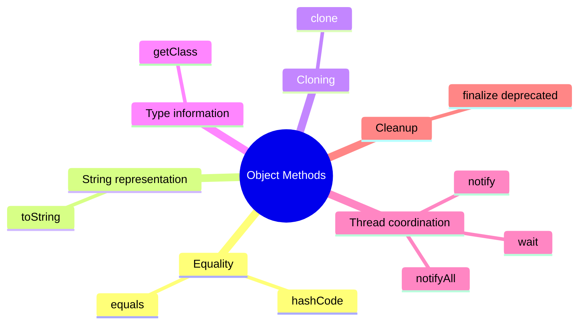
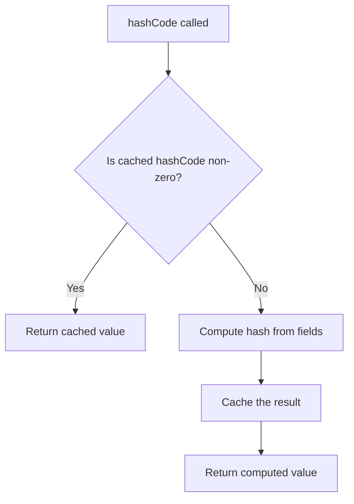
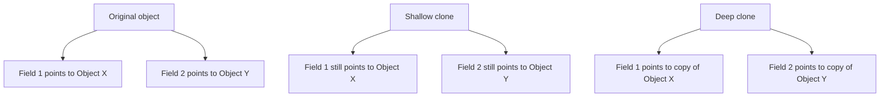

# 02.7. The Object Class and equals, hashCode, toString, clone

## Overview

Every class in Java inherits from `java.lang.Object`, either directly or through a chain of superclasses. This single root type gives every object a common set of methods that the language, the standard library, and your application code can rely on. The four most important of these methods are `equals`, `hashCode`, `toString`, and `clone`. They appear in almost every non-trivial Java class, and getting them right is the difference between a class that behaves correctly in collections, in logs, and in tests, and one that produces subtle bugs that take days to diagnose.

This note is a thorough treatment of all four methods. We cover the contract of `equals` (reflexivity, symmetry, transitivity, consistency, and null handling), the contract of `hashCode` (and especially its relationship to `equals`), the practical patterns for writing both correctly, and the modern alternatives like records that generate them for free. We cover `toString` and the conventions for producing useful debug output. We cover `clone` and why it is widely considered broken, with the recommended alternatives of copy constructors, static factory methods, and immutable design.

We close with a long list of common pitfalls, practical tips, and interview questions. By the end of this note you should be able to write correct `equals` and `hashCode` methods for any class, explain why they must be overridden together, produce useful `toString` output, and choose the right alternative to `clone` for any situation.

## Background Knowledge

Before reading this note, make sure you are comfortable with:

- Classes, objects, and constructors (note 02.1).
- The four pillars of OOP, especially encapsulation and inheritance (note 02.2).
- Method overriding and the `@Override` annotation (note 02.4).
- Access modifiers and the difference between `private`, package-private, `protected`, and `public` (note 02.6).
- The distinction between reference equality (`==`) and content equality (`equals`).
- The basics of the Java Collections Framework, especially `HashMap`, `HashSet`, and `TreeMap`.
- The `instanceof` operator and pattern matching for `instanceof` (Java 16+).

You should also be aware that the JDK ships with utility classes that help with these methods: `java.util.Objects` provides `equals`, `hash`, and `requireNonNull` methods; `java.lang.Record` provides correct implementations of all four for records automatically.

## The Object Class

`java.lang.Object` is the root of the Java class hierarchy. Every class implicitly extends `Object` unless it explicitly extends another class, in which case it transitively extends `Object` through that class. This means every object in the language inherits the following methods:



The equality methods (`equals` and `hashCode`) define how objects behave in collections and in equality tests. The string representation method (`toString`) defines how objects appear in logs and debuggers. The cloning method (`clone`) provides a way to produce a copy of an object, although it is widely considered broken. The type information method (`getClass`) returns the runtime class of the object. The thread coordination methods (`wait`, `notify`, `notifyAll`) are part of the Java monitor mechanism and are covered in the Concurrency note. The cleanup method (`finalize`) is deprecated and should not be used; the modern replacement is the `Cleaner` API.

This note focuses on `equals`, `hashCode`, `toString`, and `clone`, because those are the ones you will most often override in your own classes.

## The equals Method

The default `Object.equals` implementation compares references, exactly like `==`:

```java
public boolean equals(Object obj) {
    return (this == obj);
}
```

This is correct for classes where identity is the same as equality (like `Object` itself, threads, and some kinds of resource handles), but it is wrong for value-like classes where two distinct instances can be logically equal. For example, two `String` objects that contain the same characters should be considered equal, even if they live at different heap addresses.

You override `equals` when your class has a logical notion of equality that differs from identity. The override must satisfy the contract specified in the Javadoc of `Object.equals`:

### The equals Contract

1. **Reflexive:** For any non-null reference `x`, `x.equals(x)` must return `true`.
2. **Symmetric:** For any non-null references `x` and `y`, `x.equals(y)` must return `true` if and only if `y.equals(x)` returns `true`.
3. **Transitive:** For any non-null references `x`, `y`, and `z`, if `x.equals(y)` returns `true` and `y.equals(z)` returns `true`, then `x.equals(z)` must return `true`.
4. **Consistent:** For any non-null references `x` and `y`, multiple invocations of `x.equals(y)` must consistently return `true` or consistently return `false`, provided no information used in `equals` comparisons changes.
5. **Null handling:** For any non-null reference `x`, `x.equals(null)` must return `false`.

These properties sound obvious but are surprisingly easy to violate, especially when you mix equality across a class hierarchy.

### A Correct equals Implementation

Here is a correct `equals` implementation for a `Person` class with two fields:

```java
import java.util.Objects;

public final class Person {

    private final String name;
    private final int age;

    public Person(String name, int age) {
        this.name = Objects.requireNonNull(name);
        this.age = age;
    }

    @Override
    public boolean equals(Object o) {
        // Step 1: check reference equality (fast positive).
        if (this == o) return true;

        // Step 2: check type and null. Using instanceof handles null automatically.
        if (!(o instanceof Person)) return false;

        // Step 3: cast and compare significant fields.
        Person other = (Person) o;
        return age == other.age && name.equals(other.name);
    }

    @Override
    public int hashCode() {
        return Objects.hash(name, age);
    }
}
```

The pattern has three steps:

1. **Reference check.** If `this` and `o` are the same object, return `true` immediately. This is a fast path that avoids expensive field comparisons.
2. **Type check.** Use `instanceof` to verify that `o` is a `Person`. `instanceof` returns `false` for `null`, so this also handles the null case.
3. **Field comparison.** Cast `o` to `Person` and compare each significant field. Use `==` for primitives and `Objects.equals` (or `.equals`) for references.

### The Modern equals with Pattern Matching

Java 16 introduced pattern matching for `instanceof`, which collapses steps 2 and 3 into one:

```java
@Override
public boolean equals(Object o) {
    if (this == o) return true;
    if (!(o instanceof Person other)) return false;
    return age == other.age && name.equals(other.name);
}
```

The pattern `Person other` tests whether `o` is a `Person` and binds it to the variable `other` in one step. This is more concise and avoids an explicit cast.

### Common equals Pitfalls

The contract is easy to violate in subtle ways. Here are the most common pitfalls.

**Symmetry violation through inheritance.** Suppose you have a `Point` class with an `equals` method that compares `x` and `y`, and a `ColoredPoint` subclass that adds a `color` field and an `equals` method that compares `x`, `y`, and `color`. The result is asymmetric:

```java
Point p = new Point(1, 2);
ColoredPoint cp = new ColoredPoint(1, 2, Color.RED);

p.equals(cp);    // true: Point.equals only compares x and y
cp.equals(p);    // false: ColoredPoint.equals also requires color to match
```

The standard solution is to cannot extend an instantiable class and add a new significant field while preserving the equals contract. The options are:

1. Make `Person` final and do not allow subclasses.
2. Use composition instead of inheritance: `ColoredPoint` contains a `Point` rather than extending it.
3. Use an interface and have both `Point` and `ColoredPoint` implement it, with their `equals` methods checking for type identity.

The first option is the simplest and is what the `Person` example above uses by marking the class `final`. The second option is what Effective Java recommends when you need to add behavior. The third option is what the Java Collections Framework uses: `List.equals` returns `true` only if both lists are `List` instances with the same elements in the same order, regardless of concrete type.

**Transitivity violation through inheritance.** Even if you try to make `ColoredPoint.equals` symmetric by returning `false` when the other object is a plain `Point`, you break transitivity:

```java
ColoredPoint cp1 = new ColoredPoint(1, 2, Color.RED);
Point p = new Point(1, 2);
ColoredPoint cp2 = new ColoredPoint(1, 2, Color.BLUE);

cp1.equals(p);    // false (after the "fix")
p.equals(cp2);    // true (plain Point.equals)
cp1.equals(cp2);  // false (different colors)
// So cp1 == p == cp2 but cp1 != cp2, violating transitivity.
```

There is no general way to extend an instantiable class and add a significant field while preserving the equals contract. The only safe options are the three listed above.

**Inconsistency with `hashCode`.** If two objects are equal according to `equals`, they must have the same `hashCode`. We cover this in detail below. The practical consequence is that you must override both methods together.

**Floating point comparison.** Comparing floats with `==` is incorrect for equality purposes, because `Float.NaN != Float.NaN` and because tiny rounding errors can make two logically equal floats compare unequal. Use `Float.compare` and `Double.compare` instead, which handle `NaN` correctly and treat `+0.0` and `-0.0` as distinct.

**Arrays.** Arrays do not override `equals` from `Object`, so two distinct arrays are never equal by `equals` even if they contain the same elements. Use `Arrays.equals` to compare arrays element by element, and use `Arrays.deepEquals` for nested arrays. Similarly, use `Arrays.hashCode` and `Arrays.deepHashCode` in your `hashCode` method.

**Null fields.** Calling `.equals` on a potentially null field throws `NullPointerException`. Use `Objects.equals(a, b)` instead, which handles null safely.

### The Liskov Substitution Principle and equals

The Liskov Substitution Principle says that subclasses should be substitutable for their superclass without breaking the program. The equals contract is one of the places where this principle bites hardest: adding a significant field in a subclass breaks the contract, no matter how you write the equals method. The standard advice is therefore:

1. Prefer immutability and `final` classes for value types.
2. Use composition over inheritance when you need to add fields.
3. Use an interface as the equality type, and have each concrete class check for that interface.

## The hashCode Method

The `hashCode` method returns an integer that is used by hash-based data structures (`HashMap`, `HashSet`, `LinkedHashMap`, `ConcurrentHashMap`) to bucket objects. The contract, specified in the Javadoc of `Object.hashCode`, is:

### The hashCode Contract

1. **Consistency.** Whenever `hashCode` is invoked on the same object more than once during an execution of a Java application, it must consistently return the same integer, provided no information used in `equals` comparisons changes.
2. **Relationship to equals.** If two objects are equal according to `equals`, then their `hashCode` values must be equal.
3. **Distribution.** It is not required that two unequal objects have different hash codes, but the programmer should be aware that producing distinct hash codes for unequal objects improves the performance of hash tables.

The second rule is the most important and the most violated. If you override `equals` without overriding `hashCode`, your class will misbehave in every hash-based collection. Two equal objects will end up in different buckets, and operations like `contains`, `get`, and `remove` will fail.

### Why the Contract Matters

Consider this broken class:

```java
public final class PhoneNumber {

    private final short areaCode;
    private final short prefix;
    private final short line;

    public PhoneNumber(int areaCode, int prefix, int line) {
        this.areaCode = (short) areaCode;
        this.prefix = (short) prefix;
        this.line = (short) line;
    }

    @Override
    public boolean equals(Object o) {
        if (this == o) return true;
        if (!(o instanceof PhoneNumber other)) return false;
        return areaCode == other.areaCode
                && prefix == other.prefix
                && line == other.line;
    }

    // No hashCode override: uses Object.hashCode, which is based on identity.
}
```

If you put two logically equal `PhoneNumber` instances in a `HashMap`, they will end up in different buckets and the map will treat them as different keys:

```java
Map<PhoneNumber, String> map = new HashMap<>();
PhoneNumber p1 = new PhoneNumber(408, 555, 1234);
PhoneNumber p2 = new PhoneNumber(408, 555, 1234);
map.put(p1, "Alice");

map.get(p2);   // Returns null, even though p1.equals(p2) is true!
```

The fix is to override `hashCode` to return the same value for equal objects.

### A Correct hashCode Implementation

The standard recipe is to compute a hash code from each significant field:

```java
@Override
public int hashCode() {
    int result = Integer.hashCode(areaCode);
    result = 31 * result + Integer.hashCode(prefix);
    result = 31 * result + Integer.hashCode(line);
    return result;
}
```

The multiplier `31` is traditional. It is an odd prime, which means it has nice distribution properties when combined with bit shifting. The exact value is not critical, but using an odd prime is a good idea. The `Integer.hashCode(short)` and `Integer.hashCode(int)` methods return the value itself (for ints) or a wider version (for shorts and bytes).

A simpler alternative is to use `Objects.hash`:

```java
@Override
public int hashCode() {
    return Objects.hash(areaCode, prefix, line);
}
```

`Objects.hash` does the same computation as the manual version (with multiplier 31), but it is more concise. The downside is that it requires varargs allocation, which is a small performance cost in hot paths. For most code, the readability win is worth the cost.

### Caching the Hash Code

For immutable objects that are used as map keys or set elements, caching the hash code can pay off:

```java
public final class PhoneNumber {

    private final short areaCode;
    private final short prefix;
    private final short line;
    private int hashCode;   // lazily computed

    public PhoneNumber(int areaCode, int prefix, int line) {
        this.areaCode = (short) areaCode;
        this.prefix = (short) prefix;
        this.line = (short) line;
    }

    @Override
    public boolean equals(Object o) {
        if (this == o) return true;
        if (!(o instanceof PhoneNumber other)) return false;
        return areaCode == other.areaCode
                && prefix == other.prefix
                && line == other.line;
    }

    @Override
    public int hashCode() {
        int h = hashCode;
        if (h == 0) {
            h = Objects.hash(areaCode, prefix, line);
            hashCode = h;
        }
        return h;
    }
}
```

The cache works because the object is immutable: the hash code can never change once computed. For mutable objects, caching is unsafe, because the hash code can change when a field changes, which would break any hash-based collection that holds the object.

The `String` class uses exactly this caching trick, because strings are immutable and are frequently used as map keys.



### The Relationship Between equals and hashCode

The two methods must be overridden together. If you override one, you must override the other. The reason is the second rule of the hashCode contract: equal objects must have equal hash codes. If you override `equals` to compare fields, you must also override `hashCode` to hash the same fields. Otherwise, equal objects will end up with different hash codes (the identity-based default from `Object`), and they will not work correctly in hash-based collections.

The reverse is not required: unequal objects may have the same hash code (called a hash collision). Hash-based collections handle collisions gracefully, but they degrade in performance as collisions increase. A good hash function spreads unequal objects as uniformly as possible across the int range.

### The Records Shortcut

Records (Java 16+) generate correct `equals` and `hashCode` implementations automatically, based on the record's components. The generated `equals` compares each component; the generated `hashCode` hashes each component. This is one of the biggest wins of records: you get correct equality semantics for free.

```java
public record PhoneNumber(int areaCode, int prefix, int line) {}

// equals and hashCode are generated by the compiler, and they are correct.
PhoneNumber p1 = new PhoneNumber(408, 555, 1234);
PhoneNumber p2 = new PhoneNumber(408, 555, 1234);
p1.equals(p2);   // true
p1.hashCode() == p2.hashCode();   // true
```

For any class that exists primarily to carry data, prefer a record over a hand-written class with manual `equals` and `hashCode`. The record is shorter, the generated code is correct, and the equality semantics are predictable.

## The toString Method

The default `Object.toString` returns a string of the form `ClassName@hashcodeInHex`, which is useless for debugging:

```java
public String toString() {
    return getClass().getName() + "@" + Integer.toHexString(hashCode());
}
```

You should override `toString` to provide a useful representation of the object. The JDK convention is to include the class name and the significant fields, formatted in a readable way:

```java
@Override
public String toString() {
    return String.format("PhoneNumber(areaCode=%d, prefix=%d, line=%d)",
            areaCode, prefix, line);
}
```

The benefits of a good `toString` are enormous:

1. **Logging.** When you log an object, the logger calls `toString`. A useful `toString` makes the log readable; a useless one makes it opaque.
2. **Debugging.** When you set a breakpoint in a debugger, the debugger displays the `toString` of variables. A useful `toString` lets you see the state of an object at a glance.
3. **Error messages.** When an exception includes an object in its message, the `toString` is what gets included.
4. **Assertions in tests.** When an assertion fails, the test framework calls `toString` on the actual and expected values.

### toString Conventions

The JDK has a few conventions for `toString`:

1. **Include the class name.** This helps identify the type of the object in logs.
2. **Include all significant fields.** Anything that affects `equals` should appear in `toString`.
3. **Use a readable format.** Parentheses and field names are conventional: `PhoneNumber(areaCode=408, prefix=555, line=1234)`.
4. **Avoid sensitive data.** If the object contains passwords, credit card numbers, or other sensitive data, do not include them in `toString`. The JDK's `javax.security.auth.Subject` class is careful about this.
5. **Avoid recursive calls.** If your `toString` calls `toString` on a field that calls `toString` back on your object, you get infinite recursion and a `StackOverflowError`.

### Records and toString

Records generate a `toString` automatically, in the canonical `ClassName[field1=value1, field2=value2]` format. This is one of the many reasons to prefer records for data-carrying classes.

```java
public record PhoneNumber(int areaCode, int prefix, int line) {}

new PhoneNumber(408, 555, 1234).toString();
// Returns: PhoneNumber[areaCode=408, prefix=555, line=1234]
```

## The clone Method

The `clone` method returns a copy of the object. It is declared in `Object` as `protected`, which means subclasses can override it and expose it as `public`. The `Cloneable` interface is a marker interface (it has no methods) that signals to `Object.clone` that it is legal to clone the object.

```java
public class ArrayList<E> implements Cloneable {
    @Override
    @SuppressWarnings("unchecked")
    public ArrayList<E> clone() {
        try {
            return (ArrayList<E>) super.clone();
        } catch (CloneNotSupportedException e) {
            throw new AssertionError();   // should never happen
        }
    }
}
```

`clone` is widely considered broken, for several reasons:

1. **It is a magic method.** `Object.clone` is `native`, and it does a field-by-field copy without calling any constructor. This means invariants enforced by the constructor may not be enforced for the clone.
2. **It requires the `Cloneable` marker interface.** But `Cloneable` has no methods, so the compiler cannot check whether a class implements `clone` correctly.
3. **It is shallow by default.** `Object.clone` copies each field's reference, so the clone shares mutable state with the original. This is rarely what you want.
4. **It is awkward to extend.** A subclass that calls `super.clone()` gets a clone of the wrong type (the superclass type), which must be cast back. This works only because `super.clone` returns an object of the actual runtime class, but the cast is still ugly.
5. **It does not play well with `final` fields.** A `final` field cannot be reassigned after construction, so a clone that needs to fix up a final field (e.g., to point to a fresh copy of a mutable list) cannot do so.

### Shallow vs Deep Copy

The shallow vs deep copy distinction is the heart of the cloning problem. A shallow copy duplicates the object's fields but not the objects those fields reference. A deep copy duplicates the entire object graph.

```java
public class Stack implements Cloneable {

    private Object[] elements;
    private int size;

    public Stack() {
        elements = new Object[16];
        size = 0;
    }

    // Shallow clone: shares the elements array with the original.
    @Override
    public Stack clone() {
        try {
            return (Stack) super.clone();
        } catch (CloneNotSupportedException e) {
            throw new AssertionError();
        }
    }

    // Deep clone: copies the elements array too.
    public Stack deepClone() {
        try {
            Stack result = (Stack) super.clone();
            result.elements = elements.clone();   // copy the array
            return result;
        } catch (CloneNotSupportedException e) {
            throw new AssertionError();
        }
    }
}
```

The shallow `clone` shares the `elements` array with the original, so pushing onto one stack affects the other. The `deepClone` copies the array, so the two stacks are independent. The deep version is usually what you want, but `Object.clone` does not provide it; you have to write it yourself.



### Alternatives to clone

The recommended alternatives to `clone` are:

1. **Copy constructors.** A constructor that takes an argument of the same type and copies its state. This is type-safe, works with subclasses (each subclass declares its own copy constructor), and does not require the `Cloneable` interface.

```java
public final class Stack {
    private Object[] elements;
    private int size;

    public Stack() {
        elements = new Object[16];
        size = 0;
    }

    // Copy constructor: produces a deep copy.
    public Stack(Stack other) {
        this.elements = other.elements.clone();
        this.size = other.size;
    }
}
```

2. **Static factory methods.** A `from` or `copyOf` method that calls a private constructor. This is more flexible than a copy constructor, because it can return a subclass or a cached instance.

```java
public static Stack copyOf(Stack other) {
    return new Stack(other);
}
```

3. **Immutable design.** If the class is immutable, no copying is needed. Immutable objects can be shared freely, because they cannot be mutated. This is the simplest and safest approach, and it is what records and `String` and the wrapper classes provide.

The JDK itself uses copy constructors and static factories extensively: `ArrayList(Collection)`, `HashMap(Map)`, `List.copyOf(List)`, `Map.copyOf(Map)`. These are all preferred over `clone`.

### When clone Is Appropriate

There is exactly one case where `clone` is appropriate: when you are extending a class that already implements `Cloneable`, and you cannot change the design. In that case, you should call `super.clone()` and then fix up any mutable fields by deep-copying them. Otherwise, prefer a copy constructor, a static factory, or an immutable design.

## A Complete Example: Money

Let us put all four methods together in a complete `Money` class. The class is immutable, has correct `equals` and `hashCode`, a useful `toString`, and provides a copy constructor instead of `clone`.

```java
import java.math.BigDecimal;
import java.util.Currency;
import java.util.Objects;

public final class Money {

    private final BigDecimal amount;
    private final Currency currency;

    public Money(BigDecimal amount, Currency currency) {
        this.amount = Objects.requireNonNull(amount).setScale(currency.getDefaultFractionDigits());
        this.currency = Objects.requireNonNull(currency);
    }

    public Money(String amount, Currency currency) {
        this(new BigDecimal(amount), currency);
    }

    // Copy constructor: an alternative to clone.
    public Money(Money other) {
        this.amount = other.amount;
        this.currency = other.currency;
    }

    // Static factory: another alternative to clone.
    public static Money copyOf(Money other) {
        return new Money(other);
    }

    public BigDecimal amount() { return amount; }
    public Currency currency() { return currency; }

    public Money plus(Money other) {
        ensureSameCurrency(other);
        return new Money(amount.add(other.amount), currency);
    }

    public Money minus(Money other) {
        ensureSameCurrency(other);
        return new Money(amount.subtract(other.amount), currency);
    }

    private void ensureSameCurrency(Money other) {
        if (!currency.equals(other.currency)) {
            throw new IllegalArgumentException(
                    "Currency mismatch: " + currency + " vs " + other.currency);
        }
    }

    @Override
    public boolean equals(Object o) {
        if (this == o) return true;
        if (!(o instanceof Money other)) return false;
        return amount.equals(other.amount) && currency.equals(other.currency);
    }

    @Override
    public int hashCode() {
        return Objects.hash(amount, currency);
    }

    @Override
    public String toString() {
        return String.format("Money[amount=%s, currency=%s]", amount, currency);
    }
}
```

Notice how the four methods work together:

- `equals` compares the significant fields (`amount` and `currency`).
- `hashCode` hashes the same fields, satisfying the contract.
- `toString` includes the same fields in a readable format.
- The class is immutable, so no `clone` method is needed; the copy constructor and static factory are sufficient.

This is the modern idiom for value classes in Java. Use it as a template for your own value types.

## Common Pitfalls

1. **Overriding `equals` without overriding `hashCode`.** Equal objects end up with different hash codes, and hash-based collections break.

2. **Comparing floats with `==` in `equals`.** `Float.NaN != Float.NaN`, and rounding errors make logically equal floats compare unequal. Use `Float.compare` and `Double.compare`.

3. **Comparing arrays with `==` or `.equals` in `equals`.** Arrays do not override `equals` from `Object`. Use `Arrays.equals` and `Arrays.deepEquals`.

4. **Adding a significant field in a subclass.** This breaks the equals contract (symmetry or transitivity). Use composition instead, or make the class `final`.

5. **Forgetting the null check in `equals`.** The contract requires `x.equals(null)` to return `false`. Using `instanceof` handles this automatically.

6. **Returning `true` for incompatible types.** If `Money.equals` returns `true` for a `Dollar` object (because they happen to have the same amount), symmetry is broken if `Dollar.equals` does not return `true` for a `Money` object. Stick to one type.

7. **Including non-significant fields in `hashCode`.** If `equals` does not compare a field, `hashCode` should not hash it. (The reverse is also true: if `equals` compares a field, `hashCode` should hash it, although you can omit fields that rarely change for performance.)

8. **Caching `hashCode` for mutable objects.** If the object can change after the cache is populated, the cache becomes stale and the contract is broken.

9. **Using `clone` for deep copies.** `Object.clone` is shallow; you have to write the deep copy yourself, and at that point a copy constructor is simpler.

10. **Exposing sensitive data in `toString`.** Passwords, credit card numbers, and other sensitive data should not appear in `toString`, because they end up in logs.

11. **Infinite recursion in `toString`.** If your `toString` calls `toString` on a field that calls `toString` back on your object (e.g., bidirectional associations), you get a `StackOverflowError`. Use a `IdentityHashMap` to track visited objects, or simply omit the back-reference.

12. **Forgetting to mark `equals` and `hashCode` with `@Override`.** A typo in the method name silently produces an overload instead of an override, and your code does not behave as expected.

13. **Using `Objects.hash` with a single field.** `Objects.hash(x)` boxes the argument and allocates an array, which is wasteful. Use `x.hashCode()` directly for single-field classes.

14. **Relying on the default `toString` from `Object`.** `ClassName@hashcodeInHex` is useless for debugging. Always override `toString`.

15. **Forgetting that `clone` is shallow.** `super.clone()` copies field references, not the referenced objects. Mutable fields are shared between the original and the clone.

## Tips and Tricks

- Override `equals` and `hashCode` together, every time. If you override one, override the other.
- Use `Objects.equals` and `Objects.hash` for safe and concise implementations.
- Use pattern matching for `instanceof` to avoid an explicit cast in `equals`.
- Prefer immutability for value types. Immutable objects do not need `clone`, and their `hashCode` can be cached.
- Use records for transparent data carriers. They generate correct `equals`, `hashCode`, and `toString` automatically.
- Use copy constructors and static factories instead of `clone`. They are type-safe, work with subclasses, and do not require the `Cloneable` interface.
- Always override `toString`. The default is useless.
- Include the class name and all significant fields in `toString`.
- Avoid sensitive data in `toString`.
- For classes with array fields, use `Arrays.equals` in `equals` and `Arrays.hashCode` in `hashCode`.
- For classes with nested arrays, use `Arrays.deepEquals` and `Arrays.deepHashCode`.
- Cache `hashCode` for immutable objects that are used as map keys.
- Use a consistent multiplier (typically 31) when writing `hashCode` manually.
- Test your `equals` and `hashCode` with a property-based testing library like jqwik or QuickCheck. The contracts are easy to violate in subtle ways.
- Use the `EqualsVerifier` library to check your `equals` and `hashCode` for contract violations automatically.
- Document the equality semantics in Javadoc. State which fields are significant and whether subclasses are allowed.

## Interview Questions

**Q1. What is the contract of the `equals` method?**
Reflexivity (an object equals itself), symmetry (if a equals b, then b equals a), transitivity (if a equals b and b equals c, then a equals c), consistency (repeated calls return the same result), and null handling (`equals(null)` returns false).

**Q2. What is the contract of the `hashCode` method?**
Consistency (repeated calls return the same value) and the relationship to `equals` (equal objects must have equal hash codes). Unequal objects may have the same hash code (a collision), but the hash function should distribute unequal objects as uniformly as possible.

**Q3. Why must `equals` and `hashCode` be overridden together?**
Because the `hashCode` contract requires equal objects to have equal hash codes. If you override `equals` to compare fields but leave `hashCode` as the identity-based default, equal objects will have different hash codes, and hash-based collections will break.

**Q4. What happens if you put an object in a `HashMap` and then change a field that affects its `hashCode`?**
The object ends up in the wrong bucket. Subsequent `get`, `containsKey`, and `remove` operations on the key will return `null` or `false`, because the hash code used to look up the key no longer matches the hash code used to insert it. This is why mutable objects should not be used as map keys.

**Q5. How do you implement a correct `equals` method?**
Use the three-step pattern: check reference equality (`this == o`), check type and null (`if (!(o instanceof MyClass other)) return false;`), and compare significant fields (`return field1 == other.field1 && field2.equals(other.field2);`). Use `==` for primitives, `Objects.equals` for references, `Float.compare` for floats, and `Arrays.equals` for arrays.

**Q6. How do you implement a correct `hashCode` method?**
Hash each significant field with the same multiplier (typically 31) and combine the results. Use `Objects.hash` for a concise implementation, or write the manual loop for hot paths. For immutable objects, cache the result.

**Q7. Why is the multiplier 31 traditional in `hashCode`?**
It is an odd prime, which means it has good distribution properties when combined with bit shifting. It is also small enough that multiplication is fast (the JIT can optimize `31 * x` to `(x << 5) - x`). The exact value is not critical, but using an odd prime is a good idea.

**Q8. What is the difference between `==` and `equals`?**
`==` compares references for object types and values for primitives. `equals` compares logical content, but only if the class overrides `equals` to define what logical content means. The default `Object.equals` falls back to `==`.

**Q9. Why is `clone` considered broken?**
It is a magic method that bypasses constructors, so invariants may not be enforced. It is shallow by default, which is rarely what you want. It requires the `Cloneable` marker interface, which has no methods. It does not play well with `final` fields. It is awkward to extend, because subclasses that call `super.clone()` get a clone of the wrong type.

**Q10. What is the difference between shallow copy and deep copy?**
A shallow copy duplicates the object's fields but not the objects those fields reference. The copy shares mutable state with the original. A deep copy duplicates the entire object graph, so the copy is fully independent.

**Q11. What are the alternatives to `clone`?**
Copy constructors (a constructor that takes an argument of the same type and copies its state), static factory methods (a `copyOf` method that calls a private constructor), and immutable design (no copying needed, because immutable objects can be shared freely).

**Q12. What does the default `toString` return?**
`ClassName@hashcodeInHex`, which is useless for debugging. Always override `toString` to include the class name and the significant fields in a readable format.

**Q13. How do records affect `equals`, `hashCode`, and `toString`?**
Records generate correct implementations of all three methods automatically, based on the record's components. The generated `equals` compares each component; the generated `hashCode` hashes each component; the generated `toString` includes each component in a `ClassName[field=value]` format. This is one of the biggest wins of records.

**Q14. Can a subclass add a significant field to `equals` without breaking the contract?**
No. Adding a significant field in a subclass breaks either symmetry or transitivity. The standard solutions are to make the class `final`, to use composition instead of inheritance, or to use an interface as the equality type and have each concrete class check for that interface.

**Q15. How do you compare floating point fields in `equals`?**
Use `Float.compare` and `Double.compare`. They handle `NaN` correctly (treating `NaN` as equal to `NaN`) and treat `+0.0` and `-0.0` as distinct. Using `==` is incorrect, because `Float.NaN != Float.NaN` and tiny rounding errors can make logically equal floats compare unequal.

## Summary

The `Object` class gives every Java object a common set of methods, of which `equals`, `hashCode`, `toString`, and `clone` are the most important for everyday programming. `equals` defines logical equality; `hashCode` defines how objects are bucketed in hash-based collections; `toString` defines how objects appear in logs and debuggers; `clone` provides a way to copy an object, although it is widely considered broken.

The `equals` contract is reflexive, symmetric, transitive, consistent, and null-safe. The `hashCode` contract is consistent and tightly coupled to `equals`: equal objects must have equal hash codes. The two methods must be overridden together, every time. The standard pattern for `equals` is a three-step check (reference, type, fields), and the standard pattern for `hashCode` is to hash each significant field with a multiplier (typically 31) and combine the results. The `Objects.equals` and `Objects.hash` helpers make both methods concise and safe.

`toString` should always be overridden to include the class name and significant fields in a readable format. `clone` should be avoided in favor of copy constructors, static factories, or immutable design. Records generate correct implementations of `equals`, `hashCode`, and `toString` automatically, which is one of the biggest wins of the modern Java platform.

We closed with a long list of common pitfalls, practical tips, and interview questions. The most important takeaways are these: override `equals` and `hashCode` together; prefer records for data-carrying classes; prefer copy constructors and static factories over `clone`; always override `toString`; and use `Objects.equals` and `Objects.hash` to handle null safely and concisely.

The next note (02.8) covers `Comparable` and `Comparator`, the two interfaces that let you define orderings for your objects. They are the foundation of sorted collections, priority queues, and stream sorting operations, and they build directly on the equality semantics established here.
