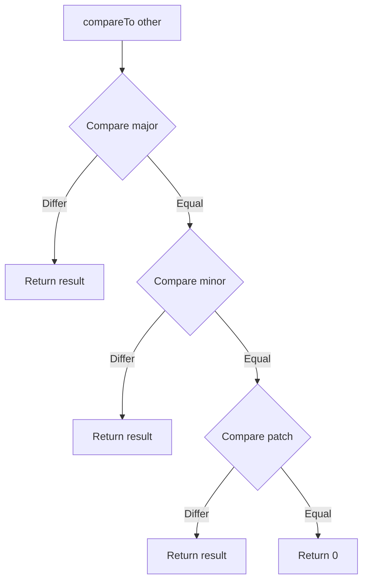
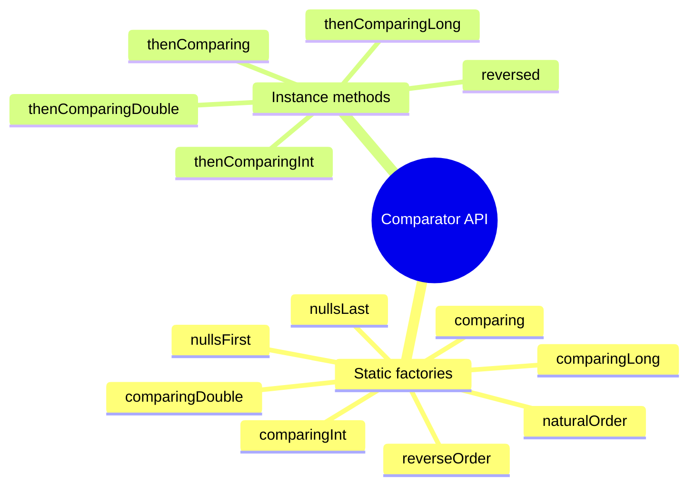
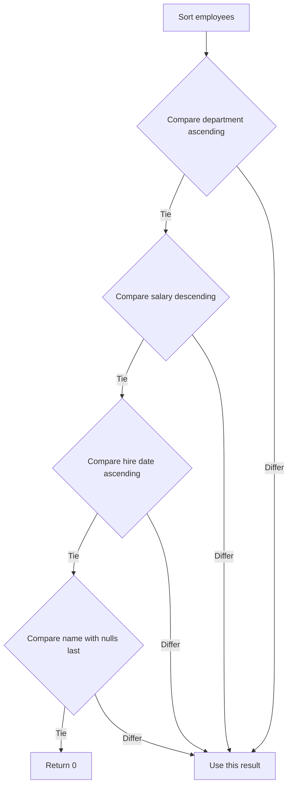

# 02.8. Comparable, Comparator, and Ordering

## Overview

Equality tells you whether two objects are the same. Ordering tells you which one comes first. Both are essential for building real systems: equality underpins collections and maps, while ordering underpins sorted sets, sorted maps, priority queues, and stream sorting operations. Java gives you two complementary interfaces for ordering objects: `Comparable`, which defines the natural ordering of a type by making the type itself implement an interface, and `Comparator`, which defines an external ordering that can be applied to any type without modifying it.

This note is a thorough treatment of both interfaces. We cover the contract of `compareTo`, the relationship between `Comparable` and `equals`, the proper way to compare floating point numbers and big numbers, the modern fluent `Comparator` API introduced in Java 8 (with `comparing`, `thenComparing`, `reversed`, `nullsFirst`, `nullsLast`, and `naturalOrder`), and the patterns for chaining comparators to produce multi-key orderings. We also cover sorted collections (`TreeSet`, `TreeMap`, `PriorityQueue`) and how they interact with `Comparable` and `Comparator`, and the pitfalls of using mutable fields as sort keys.

We close with a long list of common pitfalls, practical tips, and interview questions. By the end of this note you should be able to design a natural ordering for any of your types, write a custom comparator in a single fluent expression, and choose the right sorted collection for any problem.

## Background Knowledge

Before reading this note, make sure you are comfortable with:

- Classes, objects, and constructors (note 02.1).
- The four pillars of OOP, especially abstraction and polymorphism (note 02.2).
- Interfaces, including default and static methods (note 02.3).
- Method overriding and overloading (note 02.4).
- The `Object` class and the `equals` and `hashCode` contract (note 02.7).
- The basics of the Java Collections Framework, especially `List`, `Set`, `Map`, and `Stream`.
- Lambda expressions and method references (these are covered more fully in the Functional Java note, but a basic familiarity is assumed here).

You should also be aware that Java's sorted collections (`TreeSet`, `TreeMap`, `PriorityQueue`) use a red-black tree internally and require `O(log n)` time for insertions, deletions, and lookups. They depend on either the natural ordering of the elements (via `Comparable`) or an explicit `Comparator` passed to the constructor.

## The Comparable Interface

`Comparable<T>` is a generic interface with a single abstract method:

```java
public interface Comparable<T> {
    int compareTo(T other);
}
```

A class implements `Comparable<T>` to declare its natural ordering. The `compareTo` method returns a negative integer if `this` is less than `other`, zero if they are equal, and a positive integer if `this` is greater than `other`. The exact magnitude of the return value does not matter, only its sign.

```java
public final class Version implements Comparable<Version> {

    private final int major;
    private final int minor;
    private final int patch;

    public Version(int major, int minor, int patch) {
        this.major = major;
        this.minor = minor;
        this.patch = patch;
    }

    @Override
    public int compareTo(Version other) {
        int c = Integer.compare(major, other.major);
        if (c != 0) return c;
        c = Integer.compare(minor, other.minor);
        if (c != 0) return c;
        return Integer.compare(patch, other.patch);
    }

    @Override
    public boolean equals(Object o) {
        if (this == o) return true;
        if (!(o instanceof Version other)) return false;
        return major == other.major && minor == other.minor && patch == other.patch;
    }

    @Override
    public int hashCode() {
        return major * 31 * 31 + minor * 31 + patch;
    }

    @Override
    public String toString() {
        return major + "." + minor + "." + patch;
    }
}
```

The pattern is to compare the most significant field first, return immediately if they differ, then compare the next most significant field, and so on. This produces a lexicographic ordering on the tuple of fields.



### The compareTo Contract

The contract of `compareTo`, specified in the Javadoc of `Comparable`, is similar to the contract of `equals`:

1. **Antisymmetry.** If `a.compareTo(b) > 0`, then `b.compareTo(a) < 0`. If `a.compareTo(b) < 0`, then `b.compareTo(a) > 0`. If `a.compareTo(b) == 0`, then `b.compareTo(a) == 0`.
2. **Transitivity.** If `a.compareTo(b) > 0` and `b.compareTo(c) > 0`, then `a.compareTo(c) > 0`. The same for less than.
3. **Consistency.** If `a.compareTo(b) == 0`, then `a.equals(b)` should be true, although this is a recommendation rather than a hard requirement. (See below.)
4. **Null handling.** `a.compareTo(null)` should throw `NullPointerException`, unlike `equals` which returns `false` for `null`.

### The Relationship Between compareTo and equals

The third rule of the `compareTo` contract says that the natural ordering should be consistent with `equals`. This is a recommendation, not a hard requirement, but it has practical consequences. The JDK's sorted collections (`TreeSet`, `TreeMap`) use `compareTo` for equality testing, not `equals`. If your `compareTo` returns zero for two objects that are not `equals`, those two objects will be treated as the same key by a `TreeSet`, even though a `HashSet` would treat them as different.

The classic example is `BigDecimal`. The `BigDecimal` class has two representations of the value 1: `new BigDecimal("1")` and `new BigDecimal("1.0")`. Their `equals` methods return false (because the scale is part of the equality), but their `compareTo` methods return zero (because the values are equal). The result is that a `HashSet<BigDecimal>` treats them as different elements, but a `TreeSet<BigDecimal>` treats them as the same element:

```java
Set<BigDecimal> hashSet = new HashSet<>();
hashSet.add(new BigDecimal("1"));
hashSet.add(new BigDecimal("1.0"));
System.out.println(hashSet.size());   // 2

Set<BigDecimal> treeSet = new TreeSet<>();
treeSet.add(new BigDecimal("1"));
treeSet.add(new BigDecimal("1.0"));
System.out.println(treeSet.size());   // 1
```

This is technically allowed by the contract, but it is a source of confusion. The general advice is: if you implement `Comparable`, make your `compareTo` consistent with `equals`. If you cannot (e.g., because the class has a meaningful ordering that does not align with equality, like `BigDecimal`), document the inconsistency clearly so callers know what to expect.

### Comparing Primitives in compareTo

You cannot use `==` or `<` to compare primitive fields safely in `compareTo`, especially for floating point values. The static `compare` methods on the wrapper classes handle the edge cases correctly:

- `Integer.compare(x, y)` returns `Integer.signum(x - y)`, without the risk of integer overflow that `x - y` has.
- `Double.compare(x, y)` treats `NaN` as greater than all other values, and treats `+0.0` as greater than `-0.0`.
- `Boolean.compare(x, y)` treats `true` as greater than `false`.

```java
public final class Temperature implements Comparable<Temperature> {

    private final double kelvin;

    public Temperature(double kelvin) {
        if (kelvin < 0) {
            throw new IllegalArgumentException("Cannot be below absolute zero");
        }
        this.kelvin = kelvin;
    }

    @Override
    public int compareTo(Temperature other) {
        return Double.compare(kelvin, other.kelvin);
    }
}
```

Subtracting two ints in `compareTo` is a common source of overflow bugs. `Integer.compare` is safer and clearer.

### Comparing Strings

`String` implements `Comparable<String>` with a lexicographic ordering based on UTF-16 code units. This is usually what you want, but it can produce surprising results for natural language sorting. For example, "Zebra" comes before "apple" with the default ordering, because uppercase letters come before lowercase letters in the ASCII table.

For natural language sorting, use `Collator`:

```java
Collator collator = Collator.getInstance(Locale.US);
collator.setStrength(Collator.PRIMARY);

List<String> words = new ArrayList<>(List.of("Zebra", "apple", "Apple", "banana"));
words.sort(collator);
// Result depends on locale, but PRIMARY strength treats case as insignificant.
```

`Collator` is locale-aware and handles accents, case, and other language-specific rules. It is the right choice for any user-facing sorting.

## The Comparator Interface

`Comparator<T>` is a functional interface with a single abstract method:

```java
@FunctionalInterface
public interface Comparator<T> {
    int compare(T a, T b);
}
```

A `Comparator` is an external ordering: it can be applied to any type, even types that do not implement `Comparable`. It is also a way to override the natural ordering of a type when you want to sort differently.

```java
List<String> names = new ArrayList<>(List.of("Charlie", "Alice", "Bob"));

// Sort by natural ordering (alphabetical).
names.sort(Comparator.naturalOrder());
// Result: [Alice, Bob, Charlie]

// Sort by reverse natural ordering.
names.sort(Comparator.reverseOrder());
// Result: [Charlie, Bob, Alice]

// Sort by string length, using a lambda.
names.sort(Comparator.comparingInt(String::length));
// Result: [Bob, Alice, Charlie]
```

Before Java 8, comparators were usually written as anonymous classes, which was verbose. The modern `Comparator` API uses static factory methods and default methods on the interface to produce comparators in a single fluent expression.



### The comparing Method

The `comparing` method is the workhorse of the modern `Comparator` API. It takes a function that extracts a sort key from each element and produces a comparator that orders elements by that key:

```java
List<Person> people = new ArrayList<>(List.of(
        new Person("Alice", 30),
        new Person("Bob", 25),
        new Person("Charlie", 35)
));

// Sort by name, using the natural ordering of String.
people.sort(Comparator.comparing(Person::name));
// Result: [Alice, Bob, Charlie]

// Sort by age, using the natural ordering of int.
people.sort(Comparator.comparingInt(Person::age));
// Result: [Bob(25), Alice(30), Charlie(35)]
```

For primitive keys, use `comparingInt`, `comparingLong`, or `comparingDouble` to avoid boxing overhead.

### Chaining with thenComparing

The `thenComparing` method produces a comparator that uses a secondary key when the primary key is tied. This is how you build multi-key orderings:

```java
List<Person> people = new ArrayList<>(List.of(
        new Person("Alice", 30),
        new Person("Bob", 25),
        new Person("Alice", 25),
        new Person("Bob", 30)
));

// Sort by name, then by age.
people.sort(Comparator.comparing(Person::name).thenComparingInt(Person::age));
// Result: [Alice(25), Alice(30), Bob(25), Bob(30)]
```

The chain reads naturally: "compare by name, then by age." You can chain as many `thenComparing` calls as you need.

```java
// Sort by name, then by age, then by height.
people.sort(Comparator
        .comparing(Person::name)
        .thenComparingInt(Person::age)
        .thenComparingDouble(Person::height));
```

### Reversing with reversed

The `reversed` method produces a comparator that uses the reverse of the current ordering:

```java
// Sort by name descending, then by age descending.
people.sort(Comparator
        .comparing(Person::name)
        .thenComparingInt(Person::age)
        .reversed());
// Result: [Bob(30), Bob(25), Alice(30), Alice(25)]
```

Note that `reversed` reverses the entire chain, not just the last `thenComparing`. If you want to reverse only one level, you have to break the chain or use `Comparator.reverseOrder()` as a secondary comparator:

```java
// Sort by name ascending, then by age descending.
people.sort(Comparator
        .comparing(Person::name)
        .thenComparing(Comparator.comparingInt(Person::age).reversed()));
// Result: [Alice(30), Alice(25), Bob(30), Bob(25)]
```

### Handling Nulls with nullsFirst and nullsLast

The `nullsFirst` and `nullsLast` methods wrap another comparator and produce a comparator that sorts null values either first or last:

```java
List<String> names = new ArrayList<>(Arrays.asList("Alice", null, "Bob", null, "Charlie"));

names.sort(Comparator.nullsFirst(Comparator.naturalOrder()));
// Result: [null, null, Alice, Bob, Charlie]

names.sort(Comparator.nullsLast(Comparator.naturalOrder()));
// Result: [Alice, Bob, Charlie, null, null]

// Without null handling, sorting with nulls throws NullPointerException.
// names.sort(Comparator.naturalOrder());   // throws NPE
```

This is particularly useful when you are sorting data that may have missing fields, like a list of customers with optional email addresses.

### naturalOrder and reverseOrder

`Comparator.naturalOrder()` returns a comparator that uses the natural ordering of the elements (i.e., their `Comparable` implementation). `Comparator.reverseOrder()` returns a comparator that uses the reverse of the natural ordering. These are useful when you have a list of `Comparable` elements and want to sort them without writing a custom comparator.

```java
List<Integer> numbers = new ArrayList<>(List.of(3, 1, 4, 1, 5, 9, 2, 6));

numbers.sort(Comparator.naturalOrder());
// Result: [1, 1, 2, 3, 4, 5, 6, 9]

numbers.sort(Comparator.reverseOrder());
// Result: [9, 6, 5, 4, 3, 2, 1, 1]
```

### Custom Comparators with Lambdas

For one-off comparisons that do not fit the `comparing` pattern, you can write a lambda directly:

```java
List<String> names = new ArrayList<>(List.of("Alice", "Bob", "Charlie"));

// Sort by the number of vowels in the name.
names.sort((a, b) -> {
    long vowelsA = a.chars().filter(c -> "aeiouAEIOU".indexOf(c) >= 0).count();
    long vowelsB = b.chars().filter(c -> "aeiouAEIOU".indexOf(c) >= 0).count();
    return Long.compare(vowelsA, vowelsB);
});
// Result: [Bob, Alice, Charlie]
```

But for clarity, prefer `comparingLong` with a method reference or a lambda:

```java
names.sort(Comparator.comparingLong(ComparatorDemo::countVowels));
```

## Sorted Collections

Java provides three main sorted collections: `TreeSet`, `TreeMap`, and `PriorityQueue`. Each uses `Comparable` or `Comparator` internally to maintain order.

### TreeSet and TreeMap

`TreeSet<E>` is a `Set` that maintains its elements in sorted order. `TreeMap<K, V>` is a `Map` that maintains its keys in sorted order. Both are implemented as red-black trees, which guarantee `O(log n)` time for insertions, deletions, and lookups.

```java
// A TreeSet using the natural ordering of Integer.
Set<Integer> numbers = new TreeSet<>();
numbers.add(5);
numbers.add(1);
numbers.add(9);
numbers.add(3);
System.out.println(numbers);   // [1, 3, 5, 9]

// A TreeSet with a custom Comparator.
Set<String> byLength = new TreeSet<>(Comparator.comparingInt(String::length).thenComparing(Comparator.naturalOrder()));
byLength.add("hello");
byLength.add("hi");
byLength.add("hey");
byLength.add("world");
System.out.println(byLength);   // [hi, hey, hello, world]

// A TreeMap using the natural ordering of String.
Map<String, Integer> ages = new TreeMap<>();
ages.put("Charlie", 35);
ages.put("Alice", 30);
ages.put("Bob", 25);
System.out.println(ages);   // {Alice=30, Bob=25, Charlie=35}
```

`TreeSet` and `TreeMap` use `compareTo` (or `compare`) for equality testing, not `equals`. This means that two elements that compare as zero are treated as the same element, even if they are not `equals`. We saw this with `BigDecimal` above.

### PriorityQueue

`PriorityQueue<E>` is a queue that orders its elements according to a `Comparator` (or the natural ordering). The head of the queue is the least element. Insertion and removal are `O(log n)`.

```java
// A min-heap (natural ordering).
PriorityQueue<Integer> minHeap = new PriorityQueue<>();
minHeap.add(5);
minHeap.add(1);
minHeap.add(9);
minHeap.add(3);
System.out.println(minHeap.poll());   // 1
System.out.println(minHeap.poll());   // 3
System.out.println(minHeap.poll());   // 5
System.out.println(minHeap.poll());   // 9

// A max-heap (reverse ordering).
PriorityQueue<Integer> maxHeap = new PriorityQueue<>(Comparator.reverseOrder());
maxHeap.add(5);
maxHeap.add(1);
maxHeap.add(9);
maxHeap.add(3);
System.out.println(maxHeap.poll());   // 9
System.out.println(maxHeap.poll());   // 5
System.out.println(maxHeap.poll());   // 3
System.out.println(maxHeap.poll());   // 1
```

`PriorityQueue` is the standard way to implement a heap in Java. It is used for scheduling, for the `A*` search algorithm, and for any case where you need to repeatedly extract the minimum (or maximum) element.

### Stream Sorting

The `Stream` API provides `sorted` operations that use either the natural ordering or an explicit comparator:

```java
List<Person> people = List.of(
        new Person("Alice", 30),
        new Person("Bob", 25),
        new Person("Charlie", 35)
);

// Sort by name.
List<Person> byName = people.stream()
        .sorted(Comparator.comparing(Person::name))
        .toList();

// Sort by age descending, take the top 2.
List<Person> oldestTwo = people.stream()
        .sorted(Comparator.comparingInt(Person::age).reversed())
        .limit(2)
        .toList();
```

Stream sorting is stable: elements that compare as equal retain their original relative order. This is useful when you want to sort by a secondary key without writing a full comparator chain.

## Real-World Example: Multi-Key Ordering

Let us put it all together with a realistic example. Suppose we have a list of employees, and we want to sort them by department (ascending), then by salary (descending), then by hire date (ascending), with null names sorted last.

```java
public record Employee(
        String name,
        String department,
        BigDecimal salary,
        LocalDate hireDate
) {}

Comparator<Employee> byDepartment = Comparator.comparing(Employee::department);
Comparator<Employee> bySalaryDesc = Comparator.comparing(Employee::salary).reversed();
Comparator<Employee> byHireDate = Comparator.comparing(Employee::hireDate);
Comparator<Employee> byNameNullsLast = Comparator.comparing(Employee::name, Comparator.nullsLast(Comparator.naturalOrder()));

Comparator<Employee> fullComparator = byDepartment
        .thenComparing(bySalaryDesc)
        .thenComparing(byHireDate)
        .thenComparing(byNameNullsLast);

List<Employee> employees = List.of(
        new Employee("Alice", "Engineering", new BigDecimal("120000"), LocalDate.of(2020, 1, 15)),
        new Employee("Bob", "Engineering", new BigDecimal("110000"), LocalDate.of(2019, 6, 1)),
        new Employee(null, "Engineering", new BigDecimal("120000"), LocalDate.of(2021, 3, 10)),
        new Employee("Charlie", "Sales", new BigDecimal("90000"), LocalDate.of(2018, 9, 20)),
        new Employee("Diana", "Sales", new BigDecimal("95000"), LocalDate.of(2018, 9, 20))
);

List<Employee> sorted = employees.stream().sorted(fullComparator).toList();
// Result:
// Engineering, 120000, 2020-01-15, Alice
// Engineering, 120000, 2021-03-10, null
// Engineering, 110000, 2019-06-01, Bob
// Sales, 95000, 2018-09-20, Diana
// Sales, 90000, 2018-09-20, Charlie
```



This single fluent expression produces a comparator that handles four keys with mixed directions and null handling. Without the modern `Comparator` API, the same logic would require a verbose anonymous class with nested if-else chains.

## Common Pitfalls

1. **Subtracting ints in `compareTo`.** `a - b` can overflow if `a` is large and positive and `b` is large and negative. Use `Integer.compare(a, b)` instead.

2. **Comparing floats with `==` in `compareTo`.** `NaN` compares incorrectly, and `+0.0` and `-0.0` are treated as equal. Use `Double.compare(a, b)`.

3. **Inconsistency with `equals`.** If `compareTo` returns zero for two objects that are not `equals`, sorted collections will treat them as duplicates while hash-based collections will not. This produces confusing behavior. Document the inconsistency or align the two.

4. **Using mutable fields as sort keys.** If you put an object in a `TreeSet` and then mutate a field that affects `compareTo`, the object ends up in the wrong position in the tree, and lookups will fail. Use immutable keys, or remove the object before mutating and re-add it after.

5. **Forgetting to handle null.** `Comparator.naturalOrder()` throws `NullPointerException` if any element is null. Use `Comparator.nullsFirst` or `nullsLast` if nulls are possible.

6. **Chaining `reversed` incorrectly.** `reversed` reverses the entire chain, not just the last comparator. If you want to reverse only one level, break the chain or use `Comparator.reverseOrder()` as a secondary comparator.

7. **Boxing overhead with `comparing` for primitives.** `Comparator.comparing(Person::age)` boxes the int return value into an Integer. Use `Comparator.comparingInt(Person::age)` for primitive int keys.

8. **Using `equals` instead of `compareTo` for `BigDecimal`.** `new BigDecimal("1").equals(new BigDecimal("1.0"))` returns false, but `compareTo` returns zero. If you want to treat them as equal, use `compareTo`.

9. **Forgetting that `TreeSet` and `TreeMap` use `compareTo` for equality.** Two objects that compare as zero are treated as the same element, even if they are not `equals`. This can lose data if you are not careful.

10. **Expecting stable sort from `TreeSet`.** `TreeSet` does not preserve insertion order; it preserves sorted order. If you need stable ordering, use a `List` with `sort` or a `LinkedHashSet`.

11. **Comparing strings with default ordering for natural language.** The default `String.compareTo` is lexicographic by UTF-16 code unit, which puts "Zebra" before "apple" and does not handle accents correctly. Use `Collator` for user-facing sorting.

12. **Using `PriorityQueue` as a sorted list.** `PriorityQueue` does not iterate in sorted order; only the head is guaranteed to be the least element. If you need to iterate in sorted order, use a `TreeSet` or sort a `List`.

13. **Forgetting that `Stream.sorted` is stable.** Elements that compare as equal retain their original relative order. This is useful for secondary key sorting but can be surprising if you expect strict ordering.

14. **Comparing arrays with `compareTo` or `compare`.** Arrays do not implement `Comparable`, and there is no `Arrays.compare` for general arrays (there is for primitive arrays). Convert to a `List` and use `Comparator.comparing(List::toString)` or a custom comparator.

15. **Forgetting to make `compareTo` final when extending a Comparable class.** If a subclass adds a significant field, the natural ordering of the parent may not be appropriate for the child. Make `compareTo` final or use composition.

## Tips and Tricks

- Implement `Comparable` for types with an obvious natural ordering. Use `Comparator` for one-off or alternative orderings.
- Use `Integer.compare`, `Long.compare`, `Double.compare`, and `Boolean.compare` for primitive comparisons. They are safer and clearer than subtraction or `==`.
- Use `Comparator.comparing` and its primitive specializations to build comparators from key extractor functions. This is more concise and more readable than anonymous classes.
- Chain comparators with `thenComparing` to build multi-key orderings. The chain reads naturally: "compare by X, then by Y, then by Z."
- Use `reversed` to reverse the entire chain. Use `Comparator.reverseOrder()` as a secondary comparator to reverse only one level.
- Use `nullsFirst` and `nullsLast` to handle null values safely. They wrap another comparator and sort nulls first or last.
- Use `Collator` for natural language sorting. The default `String.compareTo` is lexicographic by UTF-16 code unit, which is rarely what users expect.
- Make `compareTo` consistent with `equals` whenever possible. If you cannot, document the inconsistency clearly.
- Use immutable keys for sorted collections. Mutating a key after insertion can corrupt the data structure.
- Use `PriorityQueue` for heaps. Use `TreeSet` or `TreeMap` for sorted sets and maps. Use `List.sort` or `Stream.sorted` for one-off sorting of lists.
- Cache the result of expensive key extractors. If your `comparing` function does a database lookup or a complex computation, extract the keys into a list first, sort the list, then map back to the original objects.
- Use the `Comparator` API in tests to assert orderings: `assertThat(list).isSortedAccordingTo(comparator)`.
- Use `Comparator.comparingInt`, `comparingLong`, and `comparingDouble` for primitive keys to avoid boxing overhead.
- For comparators that need to be reused, define them as `public static final` constants on the class they sort. This makes them easy to find and reuse.
- Document the natural ordering of your types in Javadoc. State which fields are significant and in what order.

## Interview Questions

**Q1. What is the difference between `Comparable` and `Comparator`?**
`Comparable` is implemented by a type to declare its natural ordering. The `compareTo` method is on the type itself. `Comparator` is an external ordering: a separate object that compares two instances of a type. A type can have only one natural ordering (its `Comparable` implementation) but any number of external comparators.

**Q2. What is the contract of `compareTo`?**
Antisymmetry (if a > b then b < a, and if a == b then b == a), transitivity (if a > b and b > c then a > c), consistency with equals (a == b implies a.equals(b), as a recommendation), and null handling (`compareTo(null)` throws `NullPointerException`).

**Q3. What does `compareTo` return?**
A negative integer if `this` is less than `other`, zero if they are equal, and a positive integer if `this` is greater than `other`. The exact magnitude does not matter, only the sign.

**Q4. Why should `compareTo` be consistent with `equals`?**
Because the JDK's sorted collections (`TreeSet`, `TreeMap`) use `compareTo` for equality testing, not `equals`. If `compareTo` returns zero for two objects that are not `equals`, those objects will be treated as the same key by a sorted collection, even though a hash-based collection would treat them as different. This produces confusing behavior.

**Q5. Give an example of a class where `compareTo` is not consistent with `equals`.**
`BigDecimal`. `new BigDecimal("1").equals(new BigDecimal("1.0"))` returns false (because the scale is part of equality), but `compareTo` returns zero (because the values are equal). The result is that a `HashSet<BigDecimal>` treats them as different elements, but a `TreeSet<BigDecimal>` treats them as the same.

**Q6. How do you compare two integers safely in `compareTo`?**
Use `Integer.compare(a, b)`. Subtracting (`a - b`) can overflow if `a` is large and positive and `b` is large and negative.

**Q7. How do you compare two doubles safely in `compareTo`?**
Use `Double.compare(a, b)`. It treats `NaN` as greater than all other values and treats `+0.0` as greater than `-0.0`, which are the correct semantics for sorting.

**Q8. What does `Comparator.comparing` do?**
It takes a function that extracts a sort key from each element and produces a comparator that orders elements by that key. For example, `Comparator.comparing(Person::name)` produces a comparator that sorts people by name.

**Q9. How do you build a multi-key ordering?**
Chain comparators with `thenComparing`. For example, `Comparator.comparing(Person::name).thenComparingInt(Person::age)` sorts by name, then by age.

**Q10. How do you reverse an ordering?**
Use `Comparator.reversed()` to reverse the entire chain. Use `Comparator.reverseOrder()` as a secondary comparator to reverse only one level: `Comparator.comparing(Person::name).thenComparing(Comparator.comparingInt(Person::age).reversed())`.

**Q11. How do you handle null values in a comparator?**
Use `Comparator.nullsFirst` or `Comparator.nullsLast` to wrap another comparator. They sort null values either first or last, without throwing `NullPointerException`.

**Q12. What is the difference between `TreeSet` and `HashSet`?**
`TreeSet` maintains elements in sorted order and uses `compareTo` (or `compare`) for equality. `HashSet` does not maintain order and uses `equals` and `hashCode` for equality. `TreeSet` offers `O(log n)` operations; `HashSet` offers `O(1)` amortized operations.

**Q13. What data structure does `TreeSet` use internally?**
A red-black tree, which is a self-balancing binary search tree. This guarantees `O(log n)` time for insertions, deletions, and lookups.

**Q14. Why should you not use mutable fields as sort keys?**
If you put an object in a `TreeSet` and then mutate a field that affects `compareTo`, the object ends up in the wrong position in the tree, and lookups will fail. Use immutable keys, or remove the object before mutating and re-add it after.

**Q15. How do you sort strings in a natural language-aware way?**
Use `Collator.getInstance(locale)`. The default `String.compareTo` is lexicographic by UTF-16 code unit, which puts "Zebra" before "apple" and does not handle accents correctly. `Collator` is locale-aware and handles these cases.

## Summary

`Comparable` and `Comparator` are the two interfaces that define orderings in Java. `Comparable` is implemented by a type to declare its natural ordering, with the `compareTo` method returning a negative integer, zero, or a positive integer. `Comparator` is an external ordering that can be applied to any type without modifying it, with the modern API providing `comparing`, `thenComparing`, `reversed`, `nullsFirst`, `nullsLast`, `naturalOrder`, and `reverseOrder` for building comparators in a single fluent expression.

The `compareTo` contract is antisymmetric, transitive, consistent, and null-hostile. It should be consistent with `equals` whenever possible, because the JDK's sorted collections use `compareTo` for equality testing. The classic example of inconsistency is `BigDecimal`, where `equals` and `compareTo` disagree on whether `1` and `1.0` are the same.

Sorted collections (`TreeSet`, `TreeMap`, `PriorityQueue`) use `Comparable` or `Comparator` internally to maintain order. `TreeSet` and `TreeMap` are red-black trees with `O(log n)` operations. `PriorityQueue` is a heap optimized for extracting the minimum (or maximum) element. Stream sorting uses `Comparable` or `Comparator` to produce sorted streams.

We walked through a real-world example of multi-key ordering with mixed directions and null handling, and we closed with a long list of common pitfalls, practical tips, and interview questions. The most important takeaways are these: use `Integer.compare` and `Double.compare` for primitives, use `Comparator.comparing` and `thenComparing` for multi-key orderings, use `nullsFirst` and `nullsLast` for null handling, use `Collator` for natural language sorting, and make `compareTo` consistent with `equals` whenever possible.

With these tools in hand, you have completed Phase 2 of the Java Developer Roadmap: Object-Oriented Programming. You can now design classes, hierarchies, interfaces, and orderings with the precision and confidence required of a senior Java engineer. The next phase of the roadmap builds on this foundation to explore the Java Collections Framework, exception handling, and functional programming, each of which relies heavily on the OOP principles you have just mastered.
