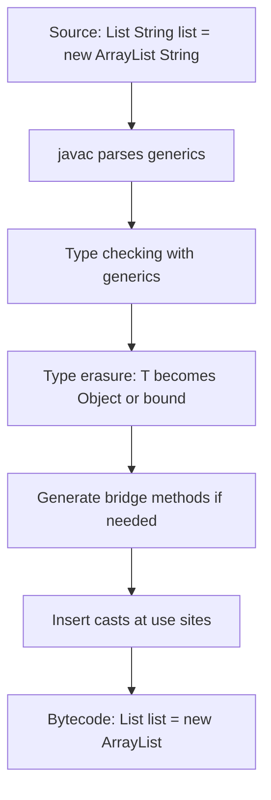

# Generics Wildcards and Type Erasure

## Overview

Generics are one of the most transformative features ever added to the Java language. Introduced in Java 5 (2004), they completely changed how developers write type-safe collections and reusable algorithms. Generics allow you to parameterize types, meaning a single class or method can operate on different concrete types while preserving compile-time type safety. Before generics, every element retrieved from a `List` had to be cast to its expected type, and any mismatch surfaced only at runtime as a `ClassCastException`. With generics, the compiler catches those mismatches before the code ever runs.

This note takes you on a deep journey through the entire generics system. We will explore generic classes, generic methods, bounded type parameters, the three flavors of wildcards (`?`, `? extends T`, `? super T`), the Principle of Indecent Exposure, and the famous PECS rule coined by Joshua Bloch. Most importantly, we will spend considerable time on **type erasure**, the design decision that allows generics to interoperate with pre-Java 5 code but that also imposes fundamental limitations such as the inability to use `new T()`, `T.class`, or primitive type parameters. We will also examine **bridge methods**, the synthetic methods the compiler emits to preserve polymorphism when generic types are subclassed.

By the end of this note, you will not only be able to write correct generic code, but you will also understand why the language behaves the way it does and how to reason about edge cases that confuse even experienced Java developers.

## Background Knowledge

Before diving into generics, make sure you are comfortable with the following prerequisites:

- **Subtyping and polymorphism in Java**: A `List<Number>` is not a `List<Object>`. This is the single most surprising fact about generics for newcomers. Java uses invariant subtyping for generic types by default, which we will justify shortly.
- **Casting and `instanceof`**: Before generics, code looked like `String s = (String) list.get(0);`. The cast was unchecked, and a wrong assumption meant a runtime exception.
- **The Object class**: Because every reference type in Java is a subtype of `Object`, pre-generic collections stored `Object` references, which is why unchecked casts were necessary.
- **Compile-time vs runtime types**: Generics are a compile-time feature. The runtime has almost no knowledge of generic type parameters, which is the direct consequence of type erasure.

A short historical note. Generics were added to Java a full decade after the language's debut. The designers were forced to maintain binary compatibility with the huge amount of existing Java code that used raw types like `List` instead of `List<String>`. This compatibility requirement is the root cause of type erasure, and almost every quirk of Java generics traces back to it. Languages designed later, such as Scala, Kotlin, and C#, took different paths (reified generics, declaration-site variance, or both), but Java's pragmatic compromise has held up remarkably well for two decades.

## Generic Classes

A generic class is a class that declares one or more type parameters in its signature. Type parameters are conventionally single uppercase letters: `T` for type, `E` for element, `K` for key, `V` for value, `R` for result, and `N` for number. These conventions are not enforced by the compiler but are universally followed in the standard library and most professional codebases.

Here is a complete generic class that represents a mutable pair of values:

```java
public class Pair<A, B> {

    private A first;
    private B second;

    public Pair(A first, B second) {
        this.first = first;
        this.second = second;
    }

    public A getFirst() { return first; }
    public B getSecond() { return second; }

    public void setFirst(A first) { this.first = first; }
    public void setSecond(B second) { this.second = second; }

    public <C> Pair<C, B> mapFirst(C newFirst, java.util.function.Function<A, C> fn) {
        // Generic method inside a generic class.
        // The class has type parameters A and B; the method introduces its own C.
        return new Pair<>(fn.apply(first), second);
    }

    @Override
    public String toString() {
        return "(" + first + ", " + second + ")";
    }
}
```

When you instantiate `Pair<String, Integer>`, the compiler treats `A` as `String` and `B` as `Integer` everywhere inside the class for that instance. Calling `setFirst` with anything other than a `String` becomes a compile-time error.

A subtle but important point: only the *declaration* of `Pair` introduces `A` and `B`. Static members of `Pair` cannot refer to `A` or `B` because type parameters belong to instances, not to the class itself:

```java
public class Pair<A, B> {
    // Static context cannot use A or B.
    // public static A defaultValue;  // Compile error.

    public static <X> Pair<X, X> twin(X value) {
        // This is fine: X is a static method's own type parameter.
        return new Pair<>(value, value);
    }
}
```

This restriction can be confusing at first, but the rationale is sound: type parameters are resolved per instance, while static members are shared across all instances regardless of their type arguments.

## Generic Methods

A generic method is a method that introduces its own type parameters, independent of any type parameters declared by the enclosing class. Generic methods can appear in ordinary (non-generic) classes, interfaces, and even static contexts.

```java
public class Box {

    // Generic static factory method.
    public static <T> Box of(T value) {
        Box b = new Box();
        b.value = value;
        return b;
    }

    // Generic instance method using two type parameters.
    public <U, V> String combine(U u, V v) {
        return u.toString() + " :: " + v.toString();
    }

    private Object value;

    @SuppressWarnings("unchecked")
    public <T> T get() {
        // Unchecked cast is unavoidable when storing as Object.
        return (T) value;
    }
}
```

You usually do not need to specify the type arguments explicitly when calling a generic method. The Java compiler infers them from the actual arguments and the target type. This is called **type inference**, and it has been progressively improved in Java 7 (the diamond operator `<>`), Java 8 (lambda target typing), and Java 10 (`var`).

```java
Box box = Box.of("Hello");              // T inferred as String.
List<String> list = List.of("a", "b");  // T inferred as String.
```

## Bounded Type Parameters

Without bounds, a type parameter `T` accepts any reference type. Bounds restrict the set of acceptable types and, crucially, allow you to call methods declared on the bound inside the generic code.

```java
public class Stats {

    // T must be a subtype of Number.
    public static <T extends Number> double sum(T[] values) {
        double total = 0.0;
        for (T value : values) {
            // Because T extends Number, we can call doubleValue().
            total += value.doubleValue();
        }
        return total;
    }

    // Multiple bounds: T must extend both Number and Comparable.
    public static <T extends Number & Comparable<T>> T max(T a, T b) {
        return a.compareTo(b) >= 0 ? a : b;
    }
}
```

When specifying multiple bounds, the first bound is used for erasure. If one of the bounds is a class, it must come first (Java has single inheritance, so only one class bound is allowed). Subsequent bounds must be interfaces.

```java
// Class first, then interfaces.
public static <T extends java.util.AbstractList<?> & java.io.Serializable & Cloneable>
    void persist(T list) { ... }
```

## Wildcards

Wildcards are the key to flexible generic APIs. A wildcard is written as `?` and represents an unknown type. There are three forms:

1. **Unbounded wildcard**: `List<?>` - a list of some unknown type.
2. **Upper bounded wildcard**: `List<? extends Number>` - a list of some subtype of Number.
3. **Lower bounded wildcard**: `List<? super Integer>` - a list of some supertype of Integer.

### Why wildcards exist

Generic types in Java are *invariant*: `List<String>` is not a subtype of `List<Object>`, even though `String` is a subtype of `Object`. Invariance is necessary for type safety. If `List<String>` were a subtype of `List<Object>`, you could do this:

```java
List<String> strings = new ArrayList<>();
List<Object> objects = strings;     // Hypothetically allowed.
objects.add(Integer.valueOf(42));   // Now strings contains an Integer!
String s = strings.get(0);          // ClassCastException.
```

To prevent this catastrophe, the compiler rejects the assignment of `List<String>` to `List<Object>`. But sometimes you genuinely want a parameter to accept a list of any kind of number, or any kind of shape. That is what wildcards give you, in a controlled fashion.

### Unbounded wildcard

`List<?>` means a list of some unknown type. You can read elements as `Object` (because every reference type is an `Object`), but you cannot add anything except `null`, because the compiler cannot guarantee that the added element is of the right type.

```java
public static void printAll(List<?> list) {
    for (Object item : list) {
        System.out.println(item);
    }
    // list.add("x");   // Compile error: cannot add to List<?>.
    // list.add(42);    // Compile error.
    list.add(null);     // null is allowed but rarely useful.
}
```

`List<?>` is the appropriate type when you only need to read elements and you do not care about their specific type. It is more permissive than `List<Object>` because it accepts `List<String>`, `List<Integer>`, and any other parameterized list.

### Upper bounded wildcard

`List<? extends Number>` is a list whose elements are some specific subtype of `Number`. It could be `List<Integer>`, `List<Double>`, or `List<Number>` itself. You can read from it as `Number`, but you cannot safely add anything (except `null`).

```java
public static double sum(List<? extends Number> numbers) {
    double total = 0.0;
    for (Number n : numbers) {
        total += n.doubleValue();
    }
    // numbers.add(Integer.valueOf(1));  // Compile error.
    return total;
}

List<Integer> ints = List.of(1, 2, 3);
List<Double> doubles = List.of(1.5, 2.5);
sum(ints);     // OK.
sum(doubles);  // OK.
```

The reason you cannot add is subtle. The actual list might be `List<Double>`, and adding an `Integer` would corrupt it. The compiler has no way to know which concrete subtype is hidden behind the `?`, so it conservatively forbids the write.

### Lower bounded wildcard

`List<? super Integer>` is a list whose elements are some specific supertype of `Integer`. It could be `List<Integer>`, `List<Number>`, or `List<Object>`. You can add `Integer` values to it (because every acceptable list type can hold an `Integer`), but you can only read from it as `Object`.

```java
public static void addNumbers(List<? super Integer> list, int count) {
    for (int i = 0; i < count; i++) {
        list.add(i);   // OK, Integer is acceptable.
    }
}

List<Number> numbers = new ArrayList<>();
addNumbers(numbers, 5);    // OK.
List<Object> objects = new ArrayList<>();
addNumbers(objects, 5);    // OK.
```

### PECS rule

Joshua Bloch summarized the design rule for choosing between `extends` and `super` in his famous mnemonic **PECS**: Producer Extends, Consumer Super.

- If a parameterized collection acts as a **producer** of values you will read, use `? extends T`.
- If it acts as a **consumer** of values you will write, use `? super T`.
- If it does both, do not use a wildcard; use a plain `T`.

The classic example is `java.util.Collections.copy`:

```java
public static <T> void copy(List<? super T> dest, List<? extends T> src) {
    // src is a producer: we read from it.   -> extends T
    // dest is a consumer: we write to it.   -> super T
    for (int i = 0; i < src.size(); i++) {
        dest.set(i, src.get(i));
    }
}
```

The PECS rule is one of the most frequently tested generics topics in interviews. Memorize it.

## Type Erasure

Type erasure is the process by which the Java compiler removes (erases) generic type information when generating bytecode. At runtime, an `ArrayList<String>` and an `ArrayList<Integer>` are both just an `ArrayList`. The type parameters `String` and `Integer` exist only at compile time.

### Why erasure exists

When generics were added in Java 5, an enormous amount of Java code already existed using raw types. The designers wanted generics to interoperate seamlessly with that code, both at source level and at the bytecode level. They achieved this by making the compiler erase generic types to their raw forms, so a generic `List<E>` compiles to the same `List` class that pre-existing code used. This decision is what allowed libraries compiled against Java 1.4 to keep working with Java 5 code without recompilation.

Languages like C#, Scala, and Kotlin chose reified generics, where type arguments are available at runtime. Java could in principle do the same today, but it would require breaking backward compatibility in fundamental ways (changes to the JVM specification, the bytecode format, and the standard library), so it has not happened.

### What the compiler does

For each type parameter, the compiler performs the following transformations:

1. Replace unbounded type parameters with `Object`.
2. Replace bounded type parameters with their leftmost bound.
3. Insert synthetic casts at call sites where the erased type would be narrower than the declared type.
4. Generate **bridge methods** to preserve polymorphism in subclasses that override generic methods.

Consider this source code:

```java
public class Stack<E> {
    public void push(E item) { ... }
    public E pop() { ... }
}
```

After erasure, the bytecode looks essentially like this:

```java
public class Stack {
    public void push(Object item) { ... }
    public Object pop() { ... }
}
```

When a caller writes `String s = stack.pop();`, the compiler inserts a cast: `String s = (String) stack.pop();`. This is why misuse of generics results in a `ClassCastException` at runtime, not a compile-time error, when raw types or unchecked casts are involved.

### Limitations imposed by erasure

Because type parameters are erased, the following operations are illegal:

```java
public class Container<T> {
    // private T[] array = new T[10];   // Compile error: cannot new T[].
    // private static T instance;       // Compile error: T not available in static context.

    public void demo() {
        // if (item instanceof T) { }   // Compile error.
        // T newInstance = new T();     // Compile error.
        // Class<T> clazz = T.class;    // Compile error.
    }
}
```

You can work around these limitations by passing a `Class<T>` token:

```java
public class Container<T> {
    private final Class<T> type;
    private final T[] array;

    @SuppressWarnings("unchecked")
    public Container(Class<T> type, int size) {
        this.type = type;
        // Creating a generic array via reflection.
        this.array = (T[]) java.lang.reflect.Array.newInstance(type, size);
    }

    public T newInstance() throws Exception {
        return type.getDeclaredConstructor().newInstance();
    }

    public boolean isInstance(Object o) {
        return type.isInstance(o);
    }
}
```

This pattern is called the **type token** pattern, and it is used extensively in frameworks such as Gson and Jackson.

## Bridge Methods

Bridge methods are synthetic methods the compiler generates to make overriding work correctly when a subclass narrows the type parameter of a generic superclass. Without them, polymorphism would break.

```java
public class Node<T> {
    private T value;

    public void setValue(T value) { this.value = value; }
    public T getValue() { return value; }
}

public class StringNode extends Node<String> {
    @Override
    public void setValue(String value) {
        System.out.println("Setting: " + value);
        super.setValue(value);
    }

    @Override
    public String getValue() {
        return super.getValue();
    }
}
```

After erasure, `Node` has `setValue(Object)` and `getValue()` returning `Object`. But `StringNode` declares `setValue(String)` and `getValue()` returning `String`. Without help, `StringNode.setValue(String)` would *overload*, not *override*, `Node.setValue(Object)`. To fix this, the compiler inserts two bridge methods in `StringNode`:

```java
// Synthetic bridge methods generated by the compiler.
public void setValue(Object value) {
    setValue((String) value);   // Calls the real setValue(String).
}

public Object getValue() {
    return getValue();          // Calls the real getValue() returning String.
}
```

You can observe these bridge methods with reflection:

```java
for (java.lang.reflect.Method m : StringNode.class.getMethods()) {
    if (m.isBridge()) {
        System.out.println("Bridge: " + m);
    }
}
```

Bridge methods explain several surprising behaviors:

- A method that overrides a generic method may have a different signature than the parent after erasure. Reflection reports both.
- Annotations placed on a parameter of the original method may not appear on the bridge method unless the annotation's `@Retention` and `@Target` allow it.
- Calling `getMethod("setValue", Object.class)` on `StringNode.class` returns the bridge method, while `getMethod("setValue", String.class)` returns the real method.

## Common Pitfalls

### Mixing raw types with generic code

```java
List<String> strings = new ArrayList<>();
List raw = strings;       // Unchecked but allowed.
raw.add(Integer.valueOf(1));  // Compiles, corrupts the list.
String s = strings.get(0);    // ClassCastException at runtime.
```

Always avoid raw types in new code. Use `List<Object>` or `List<?>` if you need flexibility.

### Heap pollution

Heap pollution occurs when a variable of a parameterized type refers to an object that is not of that parameterized type. This typically happens through unchecked casts or raw type usage. The JVM cannot detect it at the moment of insertion; it surfaces as a `ClassCastException` later.

### Varargs and generics

When a method has a varargs parameter of a non-reifiable type (such as `List<String>`), heap pollution is possible:

```java
public static <T> T first(T... args) {
    return args[0];
}

List<String> a = List.of("a");
List<Integer> b = List.of(1);
List<String> result = first(a, b);   // Heap pollution!
```

The compiler warns with `[unchecked] Possible heap pollution from parameterized vararg type`. You can suppress it with `@SafeVarargs` if you can prove the method is genuinely safe (it does not store into the array and does not expose the array to code that might).

### Creating generic arrays is forbidden

Because arrays are covariant and reified (they know their component type at runtime) while generics are invariant and erased, mixing them creates holes in the type system. Hence `new T[10]` is illegal.

### Static fields of type T

A class's static fields are shared across all parameterizations, so they cannot reference the class's type parameters. A static field of type `T` would have to be both a `String` and an `Integer` if both `Box<String>` and `Box<Integer>` were used in the same JVM, which is impossible.

## Tips and Tricks

- Use `?` (unbounded wildcard) when you only read and the element type is irrelevant. `boolean isEmpty(List<?> list)` is more useful than `boolean isEmpty(List<Object> list)`.
- Use PECS for parameters that consume or produce.
- Pass `Class<T>` when you need runtime type information inside generic code.
- Annotate generic methods that use varargs with `@SafeVarargs` if you can guarantee safety. The annotation also requires the method to be `static`, `final`, or (in Java 9+) `private`.
- Use `java.util.List.copyOf` and friends to defensively copy with type safety, since they reject `null`.
- Prefer generic factory methods like `Collections.emptyList()` over constructing raw instances.
- Use `Objects.requireNonNull` to validate type-token based construction early.

## Interview Questions

**Q1. What is the difference between `List<?>`, `List<Object>`, and `List`?**

`List<?>` is a list of some unknown type; you can read elements as `Object` but cannot write (except `null`). `List<Object>` is a list specifically of `Object`, which can hold any reference but is NOT a supertype of `List<String>`. `List` is a raw type, which bypasses generic checks entirely and should be avoided.

**Q2. Why is `List<String>` not a subtype of `List<Object>`?**

Because generics are invariant for type safety. If subtyping were allowed, you could add an `Integer` to a `List<String>` via a `List<Object>` reference, causing heap pollution and later a `ClassCastException`.

**Q3. Explain PECS.**

Producer Extends, Consumer Super. If a parameterized collection supplies data you read, use `? extends T`. If it receives data you write, use `? super T`. If both, use `T` without a wildcard.

**Q4. What is type erasure and why was it chosen?**

Type erasure is the compiler's removal of generic type information when generating bytecode. It was chosen for backward compatibility with pre-Java 5 code that used raw types. The cost is the loss of runtime type information about generic parameters and several restrictions (no `new T()`, no `T.class`, no `instanceof T`).

**Q5. What are bridge methods?**

Synthetic methods the compiler inserts into subclasses that override methods inherited from a generic superclass with narrowed types. They restore proper overriding after erasure by accepting the erased parameter types and forwarding to the real method with a cast.

**Q6. How do you create a generic array safely?**

You cannot directly `new T[10]`. The workaround is to use `java.lang.reflect.Array.newInstance(componentType, size)` with a `Class<T>` token, then cast to `T[]` with `@SuppressWarnings("unchecked")`. Alternatively, store an `Object[]` and cast elements on retrieval.

**Q7. Why does `@SafeVarargs` exist and what conditions must hold?**

It suppresses unchecked varargs warnings for methods that accept parameterized varargs. To be safe, the method must not store into the varargs array (other than writing `null`) and must not let the array escape to code that could misuse it. The annotation is allowed only on `static`, `final`, or `private` methods.

**Q8. How do multiple bounds work, and which one is used for erasure?**

A type parameter can have multiple bounds separated by `&`. At most one bound may be a class, and it must come first. The leftmost bound is used for erasure, so it determines which methods are visible inside the generic code.

## Generic Type Inference

Type inference is the compiler's ability to deduce type arguments that you did not write explicitly. It has been progressively improved across Java versions, and modern Java can often infer type arguments from the surrounding context without any help from the developer.

### Diamond Operator

Java 7 introduced the diamond operator, which lets you omit the type arguments when constructing a generic object if the target type provides them:

```java
// Before Java 7 - explicit and verbose.
Map<String, List<Integer>> map = new HashMap<String, List<Integer>>();

// Java 7+ diamond operator.
Map<String, List<Integer>> map = new HashMap<>();
```

The diamond operator is purely a compile-time convenience. The compiler fills in the type arguments from the declared type of the variable.

### Target Typing for Generic Methods

Java 8 introduced target typing for generic method invocations, where the compiler uses the expected type (for example, the parameter type of an outer method call) to infer the type arguments of an inner call:

```java
// The compiler infers T = String from the expected return type.
java.util.function.Supplier<String> supplier = List.of("a", "b")::toString;

// Inference from method parameter type.
void process(List<String> names) { ... }
process(List.of("a", "b"));    // T inferred as String.
```

### var and Inference

Java 10 introduced `var` for local variable type inference. Combined with generic methods, this leads to very concise code:

```java
var names = List.of("Alice", "Bob", "Carol");    // Inferred as List<String>.
var map = new HashMap<String, List<Integer>>();  // The full type is preserved.
```

Note that `var` does not change the runtime type; it only lets you omit the declared type on the left-hand side. The compiler still performs full type checking.

### Limitations of Inference

Inference cannot always determine the type you want. A classic case is the empty list:

```java
List<String> names = Collections.emptyList();   // OK, inferred as List<String>.
// Collections.emptyList().add("x");            // Compile error, type is Object.
```

In the second case, there is no target type, so the compiler falls back to `List<Object>`. Provide an explicit witness type if needed:

```java
Collections.<String>emptyList().add("x");
```

## Capture Conversion

Capture conversion is a subtle but important mechanism that lets the compiler treat a wildcard type as a unique, unknown type. When you pass a `List<? extends Number>` to a method, the wildcard is captured into a fresh type variable that the compiler treats as a specific but unknown subtype of Number.

```java
public static <T> void swapHelper(List<T> list, int i, int j) {
    T temp = list.get(i);
    list.set(i, list.get(j));
    list.set(j, temp);
}

public static void swap(List<?> list, int i, int j) {
    swapHelper(list, i, j);   // Capture converts ? to a fresh type T.
}
```

The `swap` method cannot directly call `list.set` because `List<?>` does not allow writes. But by forwarding to a generic helper, the wildcard is captured to a fresh type parameter `T`, and the helper can safely perform the swap. This pattern is widely used in the JDK, for instance in `Collections.reverse`.

## Generic Exceptions

Java does not allow generic subclasses of `Throwable`:

```java
// Compile error: a generic class cannot extend Throwable.
// public class MyException<T> extends RuntimeException { }
```

The reason is type erasure: the catch clause is matched at runtime based on the erased class, so two different parameterizations of the same generic exception type would be indistinguishable in `catch` blocks. This would defeat exception handling semantics.

You can, however, use generic fields and methods inside an exception class:

```java
public class ApplicationException extends RuntimeException {
    private final java.util.List<Object> context;

    public ApplicationException(String msg, java.util.List<Object> context) {
        super(msg);
        this.context = context;
    }

    public java.util.List<Object> getContext() { return context; }
}
```

## Generics and Inheritance

It is crucial to remember that generic types are invariant: `List<Subclass>` is not a subtype of `List<Superclass>`. However, you can express covariant or contravariant relationships with wildcards:

```java
// Covariant: a List<? extends Number> can hold a List<Integer>.
List<? extends Number> numbers = new ArrayList<Integer>();

// Contravariant: a List<? super Integer> can hold a List<Number>.
List<? super Integer> sink = new ArrayList<Number>();
```

Subtype relationships also hold for the type parameters themselves. If `Manager extends Employee`, then `List<Manager>` is a subtype of `List<? extends Employee>` but not of `List<Employee>`.

## Mermaid Diagram: Type Erasure Compilation Flow



## Summary

Generics give Java compile-time type safety for collections and reusable algorithms. They rely on a small set of primitives: generic classes, generic methods, bounded type parameters, and three flavors of wildcards. The PECS rule guides correct wildcard usage. Type erasure, the consequence of a historic compatibility decision, strips generic type information at runtime, leading to bridge methods, the type token pattern, and several unavoidable limitations. Understanding these mechanics deeply is what separates a casual generics user from someone who can design clean, safe, and flexible generic APIs.
