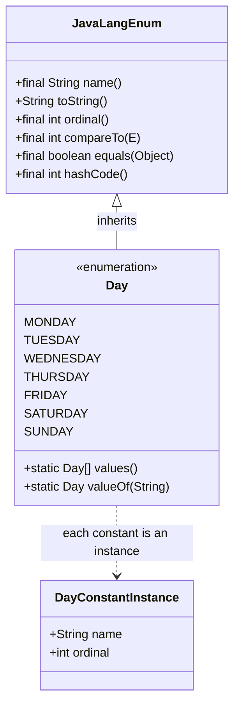
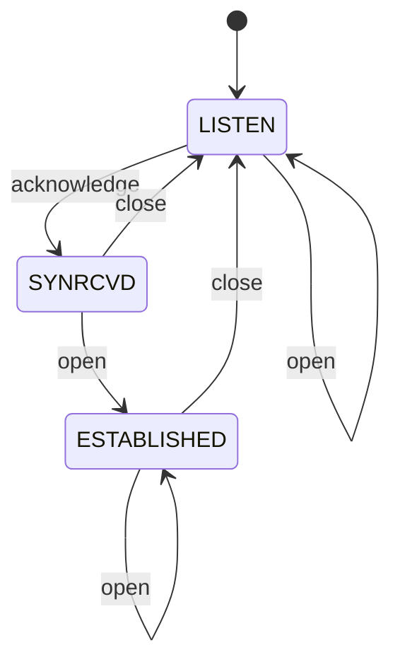
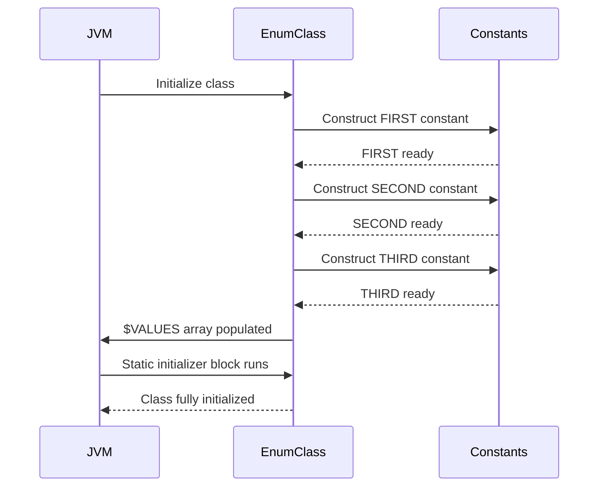

# Enums

## Overview

Enumerations, or enums for short, are a special kind of class that represents a fixed set of named constants. Java introduced enums in Java 5 (2004), alongside generics and annotations. They are far more powerful than their counterparts in C or C++, where an enum is little more than a named integer. In Java, an enum is a full-fledged class with constructors, fields, methods, and even interfaces it can implement. Each enum constant is an instance of the enum class, and the JVM guarantees that there is exactly one instance per constant for the lifetime of the program. This makes enums the canonical way to implement the Singleton pattern in Java, and they are the recommended representation for any finite set of related constants such as days of the week, HTTP status codes, operations in a calculator, or states in a state machine.

This note takes you through every aspect of Java enums: how to declare and use them, how to add fields, constructors, and methods, how to use them in `switch` statements (including the modern pattern matching switch of Java 21), how to implement behavior per constant, how to use enums with `EnumSet` and `EnumMap` for blazing-fast collections, how to implement the strategy and state machine patterns, how `equals`, `hashCode`, `compareTo`, and `ordinal` behave, and how to handle serialization correctly. By the end, you will understand why Joshua Bloch said "use enums instead of int constants" in *Effective Java* and how to design enums that are bulletproof.

## Background Knowledge

Before working through this note, you should be comfortable with:

- **Classes and objects**: An enum is a class, and an enum constant is an instance.
- **The `final` keyword**: All enums are implicitly final; you cannot extend them.
- **The `java.lang.Comparable` and `java.io.Serializable` interfaces**: All enums implicitly implement both.
- **Static initializers**: The enum constants are constructed during class initialization in declaration order.
- **Switch statements**: Enums integrate tightly with `switch`, including the new pattern matching switch.

A historical note: before Java 5, developers emulated enums with `public static final int` constants. This approach had three serious problems. First, no type safety: a method expecting a `Day` constant could be passed any `int`, including values that did not correspond to any day. Second, no namespace: constants from different "enums" could clash. Third, no behavior: the constants were just integers, with no methods, fields, or polymorphism. Java enums fixed all three problems at once.

## Declaring an Enum

The simplest enum declaration looks like this:

```java
public enum Day {
    MONDAY, TUESDAY, WEDNESDAY, THURSDAY, FRIDAY, SATURDAY, SUNDAY
}
```

Despite its terse syntax, this is a real class. The compiler generates it as a final class that extends `java.lang.Enum` and contains seven public static final fields of type `Day`, one per constant. Each constant is an instance constructed during class initialization.

You can use the enum in code like any other type:

```java
Day today = Day.WEDNESDAY;
System.out.println(today.name());          // WEDNESDAY
System.out.println(today.ordinal());       // 2
System.out.println(today.toString());      // WEDNESDAY (overridable)
Day[] allDays = Day.values();              // Array of all constants in declaration order.
Day parsed = Day.valueOf("FRIDAY");        // Returns Day.FRIDAY.
```

The `values()` method returns a fresh array each time, so modifying it does not affect the enum. The `valueOf(String)` method throws `IllegalArgumentException` if the name does not match a constant.

## Adding Fields, Constructors, and Methods

The real power of Java enums comes from the ability to attach data and behavior. Each constant can carry its own fields, and the enum class can have constructors (always private) and methods.

```java
public enum Planet {

    MERCURY(3.303e+23, 2.4397e6),
    VENUS  (4.869e+24, 6.0518e6),
    EARTH  (5.976e+24, 6.37814e6),
    MARS   (6.421e+23, 3.3972e6),
    JUPITER(1.9e+27,   7.1492e7),
    SATURN (5.688e+26, 6.0268e7),
    URANUS (8.686e+25, 2.5559e7),
    NEPTUNE(1.024e+26, 2.4746e7);

    private final double mass;       // in kilograms
    private final double radius;     // in meters

    // Constructor is implicitly private; explicit "private" is allowed.
    Planet(double mass, double radius) {
        this.mass = mass;
        this.radius = radius;
    }

    // Universal gravitational constant in m^3 / kg s^2.
    private static final double G = 6.67300E-11;

    public double surfaceGravity() {
        return G * mass / (radius * radius);
    }

    public double surfaceWeight(double otherMass) {
        return otherMass * surfaceGravity();
    }
}
```

A few rules to remember:

- The list of constants must come first, terminated by a semicolon.
- Constructors are always implicitly private. You may write `private` explicitly, but you cannot write `public` or `protected`.
- Fields are typically final. Mutable fields are allowed but rarely a good idea.
- Methods can be called on a constant directly: `Planet.EARTH.surfaceWeight(70.0)`.

## Constant-Specific Methods

A remarkable feature of Java enums is that each constant can override a method declared in the enum body. This is essentially constant-specific behavior, a clean alternative to large `switch` statements.

```java
public enum Operation {

    PLUS  { public int apply(int a, int b) { return a + b; } },
    MINUS { public int apply(int a, int b) { return a - b; } },
    TIMES { public int apply(int a, int b) { return a * b; } },
    DIVIDE{
        public int apply(int a, int b) {
            if (b == 0) throw new ArithmeticException("divide by zero");
            return a / b;
        }
    };

    // Method declared abstract at enum level; each constant must implement it.
    public abstract int apply(int a, int b);
}
```

Here `PLUS`, `MINUS`, `TIMES`, and `DIVIDE` are technically anonymous subclasses of `Operation`. They each provide their own implementation of `apply`, and polymorphism dispatches to the correct one at runtime. This is the strategy pattern implemented in three lines per operation.

You can combine constant-specific methods with shared fields and constructors. The constant-specific class body can also override `toString`, add fields, or even implement additional interfaces.

## Enums with Interfaces

Enums cannot extend a class (because they already extend `java.lang.Enum`), but they can implement interfaces. This is often used to share a common API across different enums or to expose an enum as a strategy.

```java
public interface Measurable {
    double getMeasure();
}

public enum Size implements Measurable {
    SMALL(0.5), MEDIUM(1.0), LARGE(1.5), XL(2.0);

    private final double measure;
    Size(double measure) { this.measure = measure; }

    @Override
    public double getMeasure() { return measure; }
}

public enum Volume implements Measurable {
    LOW(0.1), MEDIUM(0.5), HIGH(1.0);

    private final double measure;
    Volume(double measure) { this.measure = measure; }

    @Override
    public double getMeasure() { return measure; }
}

// A single method can accept any Measurable.
public static double average(Measurable[] items) { ... }
```

This decoupling is useful when you want to abstract over enums from different domains.

## EnumSet and EnumMap

The `java.util` package offers two highly optimized collections for enums: `EnumSet` and `EnumMap`. They are implemented internally as bit vectors and arrays indexed by `ordinal()`, respectively. Operations are constant time and use bit-level CPU instructions where possible. If the key or element type is an enum, you should always prefer these over `HashSet` and `HashMap`.

```java
EnumSet<Day> weekend = EnumSet.of(Day.SATURDAY, Day.SUNDAY);
EnumSet<Day> workdays = EnumSet.complementOf(weekend);
EnumSet<Day> all = EnumSet.allOf(Day.class);
EnumSet<Day> none = EnumSet.noneOf(Day.class);

EnumMap<Day, String> schedule = new EnumMap<>(Day.class);
schedule.put(Day.MONDAY, "Gym");
schedule.put(Day.TUESDAY, "Study");
```

`EnumSet.of` returns a regular set whose iterator is guaranteed to traverse the constants in their natural (declaration) order. `EnumMap` similarly preserves declaration order in iteration.

## Enums in Switch

Enums and `switch` are made for each other. The compiler produces very efficient bytecode that uses an `int` lookup based on `ordinal()`:

```java
public static String describe(Day day) {
    return switch (day) {
        case MONDAY -> "Start of the work week.";
        case FRIDAY -> "Almost the weekend.";
        case SATURDAY, SUNDAY -> "Weekend!";
        default -> "Midweek.";
    };
}
```

The new arrow-style switch (Java 14+) eliminates fall-through bugs and lets you combine multiple constants with a comma. Java 21 also supports pattern matching switch, which we cover in another note.

A compile-time benefit: if you cover all enum constants explicitly, you can omit the `default` branch. The compiler will then check completeness and produce an error if a new constant is added later. In practice, you should still include a `default` that throws `AssertionError` to guard against the (rare) case where `day` is `null` or where new constants are added without updating the switch.

## Implementing the State Machine Pattern

Enums are a natural fit for state machines because each state can carry its own behavior and even its own transition logic.

```java
public enum TcpState {

    LISTEN {
        @Override public TcpState open()  { return this; }
        @Override public TcpState close() { return this; }
        @Override public TcpState acknowledge() { return SYNRCVD; }
    },
    SYNRCVD {
        @Override public TcpState open()  { return ESTABLISHED; }
        @Override public TcpState close() { return LISTEN; }
        @Override public TcpState acknowledge() { return ESTABLISHED; }
    },
    ESTABLISHED {
        @Override public TcpState open()  { return this; }
        @Override public TcpState close() { return LISTEN; }
        @Override public TcpState acknowledge() { return this; }
    };

    public abstract TcpState open();
    public abstract TcpState close();
    public abstract TcpState acknowledge();
}
```

This pattern is concise, type safe, and easy to extend. Each state is a self-contained strategy.

## Enum Singletons

Implementing a Singleton with an enum is the simplest and safest approach in Java. It is thread safe, serialization safe, and immune to reflection-based attacks (mostly).

```java
public enum DatabaseConnection {
    INSTANCE;

    private final java.sql.Connection connection;

    DatabaseConnection() {
        // Initialize the connection once.
        this.connection = createConnection();
    }

    private java.sql.Connection createConnection() {
        // ... real connection setup ...
        return null;
    }

    public java.sql.Connection getConnection() {
        return connection;
    }
}
```

Usage: `DatabaseConnection.INSTANCE.getConnection()`. The JVM guarantees only one instance exists.

## Serialization of Enums

All enums implicitly extend `java.lang.Enum`, which implements `Serializable`. However, the default serialization process for enums is special cased: the serialized form contains only the constant's name, never its fields. On deserialization, the JVM looks up the constant by name with `Enum.valueOf`. This means:

- You do not need to implement `readResolve` to prevent duplicate instances. The JVM already does this.
- Transient or mutable fields are NOT restored on deserialization. They will be `null` or the default value.
- If you add a new constant in the middle, ordinals shift, but constants are looked up by name, so existing serialized streams still work as long as the names are unchanged.

For these reasons, prefer immutable fields. If you need mutable state, consider using a separate, non-serializable state object keyed by the enum.

## Important Methods

Every enum inherits the following from `java.lang.Enum`:

- `final String name()`: the declared name of the constant. Cannot be overridden.
- `String toString()`: defaults to `name()` but can be overridden.
- `final int ordinal()`: the position in the declaration, starting at 0. Avoid using this in application code because reordering constants silently breaks logic.
- `final int compareTo(E other)`: compares by ordinal. The natural order of an enum is its declaration order.
- `final boolean equals(Object other)`: identity comparison. Use `==` instead.
- `final int hashCode()`: identity-based.
- `static E[] values()`: returns all constants in declaration order.
- `static E valueOf(String name)`: returns the constant with that name.

The `equals` method on an enum is final and uses identity. This means `==` and `equals` behave identically. The convention is to use `==` because it is shorter, never throws on `null`, and makes intent clearer.

```java
Day a = Day.MONDAY;
Day b = Day.MONDAY;
System.out.println(a == b);           // true
System.out.println(a.equals(b));      // true
```

## Mermaid Diagram: Enum Lifecycle



## Mermaid Diagram: Enum State Machine



## Common Pitfalls

### Relying on `ordinal()`

```java
// BAD: relies on ordinal
public int dayNumber() { return ordinal() + 1; }
```

If a constant is added or removed, the numbers change silently. Store an explicit field instead.

### Using `==` to compare across class loaders

Enums loaded by different class loaders are different classes. In rare multi-classloader setups, `==` between constants from different loaders returns false. Stick to one class loader when possible.

### Mutable fields that lead to surprising behavior

```java
public enum Counter {
    INSTANCE;
    private int count;
    public void inc() { count++; }
    public int get() { return count; }
}
```

This is technically legal but shared mutable state in an enum can lead to subtle concurrency bugs. Either make the enum stateless or guard mutable state carefully.

### Forgetting to handle `null` in switch

Switch statements on enums throw `NullPointerException` if the value is `null`. Always validate inputs.

### Serializing mutable enum fields

As mentioned, mutable fields are not preserved across serialization. This is a frequent source of bugs.

## Tips and Tricks

- Use `EnumSet.of` to pass sets of enum constants as parameters; it is the most performant way.
- Use `EnumMap` whenever you need a map keyed by an enum.
- Implement constant-specific methods instead of large `switch` blocks for cleaner polymorphism.
- Implement an interface to abstract over multiple enums.
- Always use `==` for enum comparison; it is null safe and idiomatic.
- Use `name()` for serialization and persistence; never use `ordinal()`.
- Implement `toString` to provide user-friendly names.
- Add a `fromString` static helper that maps user-friendly strings to enum constants, possibly case-insensitive.
- Use enums to implement the Strategy, State, and Command patterns.
- Avoid mutable state in enums that need to be serialized.

## Interview Questions

**Q1. Why use enums instead of `public static final int` constants?**

Enums provide type safety, namespaces, behavior, and integration with `switch`, `EnumSet`, and `EnumMap`. They are also self-documenting and prevent invalid values at compile time.

**Q2. Can an enum have a constructor?**

Yes, but it must be private (or package-private, which is effectively private because no other class can extend the enum). The constructor is called once per constant during class initialization.

**Q3. Can an enum implement an interface? Can it extend a class?**

An enum can implement any number of interfaces. It cannot extend a class because it implicitly extends `java.lang.Enum`, and Java has single inheritance.

**Q4. What is the difference between `name()` and `toString()`?**

`name()` is final and returns the declared identifier. `toString()` defaults to `name()` but can be overridden for human-friendly display.

**Q5. Why is `EnumSet` faster than `HashSet`?**

Because it is backed by a bit vector (typically a `long`) and operations use bit-level CPU instructions. Add, remove, contains, and iteration are O(1) or O(n) with very small constants.

**Q6. How are enums serialized?**

Only the constant name is serialized. On deserialization, the JVM looks up the constant by name with `Enum.valueOf`. Mutable fields are not preserved. The serialization machinery ensures only one instance per constant.

**Q7. Why is the enum Singleton pattern preferred?**

It is concise, thread safe by JVM guarantee, serialization safe, and largely immune to reflection-based instantiation attacks (the JVM refuses to reflectively create enum instances).

**Q8. What are constant-specific class bodies?**

Each enum constant can declare an anonymous subclass body that overrides methods declared in the enum. This is a clean way to implement per-constant behavior without large switches.

**Q9. What is the danger of using `ordinal()`?**

The ordinal depends on declaration order, which can change when constants are added or removed. Using `ordinal()` in business logic therefore introduces fragility. Store an explicit field instead.

**Q10. Can you iterate over an enum in declaration order?**

Yes. `values()` returns an array in declaration order, and `EnumSet` and `EnumMap` iterators preserve that order. The natural ordering of an enum (via `Comparable`) is also the declaration order.

## EnumSet and EnumMap Performance Internals

The performance advantage of `EnumSet` and `EnumMap` is rooted in their representation. `EnumSet` is an abstract class with two concrete implementations:

- `RegularEnumSet` is used when the enum has 64 or fewer constants. It stores the set as a single `long` bit vector.
- `JumboEnumSet` is used for larger enums. It stores the set as an array of `long` values, each covering 64 constants.

Because of this representation, basic operations are essentially bit-level CPU instructions:

- `add(e)` is `bits |= (1L << e.ordinal())`.
- `remove(e)` is `bits &= ~(1L << e.ordinal())`.
- `contains(e)` is `(bits & (1L << e.ordinal())) != 0`.
- `size()` is `Long.bitCount(bits)`.
- Iteration walks the bits in order.

`EnumMap` is backed by an array indexed by `ordinal()`. The first slot stores the enum constant class, the rest are values. Lookups, inserts, and removes are O(1) with no hashing overhead, no collisions, and no resizing. Iteration follows declaration order, which is deterministic and predictable.

For these reasons, you should always prefer `EnumSet` and `EnumMap` when working with enums in collections, both for performance and for predictability.

## Enum Constants as Flyweights

Each enum constant is a singleton instance created once at class initialization. This means enums are a built-in implementation of the Flyweight pattern. You can attach significant precomputed state to each constant without worrying about per-instance memory costs.

```java
public enum HttpStatus {
    OK(200, "OK"),
    NOTFOUND(404, "Not Found"),
    INTERNALERROR(500, "Internal Server Error");

    private final int code;
    private final String reason;
    private final byte[] encoded;   // Precomputed bytes for HTTP responses.

    HttpStatus(int code, String reason) {
        this.code = code;
        this.reason = reason;
        this.encoded = (code + " " + reason).getBytes("US-ASCII");
    }

    public int code() { return code; }
    public String reason() { return reason; }
    public byte[] encoded() { return encoded.clone(); }   // Defensive copy.
}
```

The `encoded` byte array is computed once per constant, never per request. This is a small but real optimization in hot paths.

## Designing Robust Enum APIs

When designing enums for a public API, consider these best practices:

1. **Make fields final and immutable.** Mutable state in a singleton is a recipe for subtle bugs.
2. **Validate in the constructor.** Throw `IllegalArgumentException` if arguments are invalid.
3. **Provide a `fromCode` or `fromString` factory method** for reverse lookups, with case-insensitive matching if appropriate.
4. **Override `toString`** to provide user-friendly display names.
5. **Avoid `ordinal()` in business logic**; use explicit fields.
6. **Use `EnumSet` and `EnumMap` for collections of constants.**
7. **Prefer constant-specific methods** over large switches when behavior varies per constant.
8. **Implement `Comparable`** if there is a meaningful natural order beyond declaration order.
9. **Document the intended meaning of each constant** with Javadoc.
10. **Consider an interface** if multiple enums share semantics.

Example of a polished, reverse-lookup-enabled enum:

```java
public enum HttpStatus {
    OK(200, "OK"),
    NOTFOUND(404, "Not Found"),
    INTERNALERROR(500, "Internal Server Error");

    private static final java.util.Map<Integer, HttpStatus> BYCODE;

    static {
        BYCODE = new java.util.HashMap<>();
        for (HttpStatus s : values()) {
            BYCODE.put(s.code, s);
        }
    }

    private final int code;
    private final String reason;

    HttpStatus(int code, String reason) {
        this.code = code;
        this.reason = reason;
    }

    public int code() { return code; }
    public String reason() { return reason; }

    public static HttpStatus fromCode(int code) {
        HttpStatus s = BYCODE.get(code);
        if (s == null) {
            throw new IllegalArgumentException("Unknown HTTP status: " + code);
        }
        return s;
    }

    @Override
    public String toString() {
        return code + " " + reason;
    }
}
```

## Enum Polymorphism Without Inheritance

Although enums cannot extend classes, you can model polymorphic behavior with constant-specific methods or by implementing an interface. This is the standard Java idiom for replacing the Strategy pattern in enum contexts:

```java
public enum PaymentMethod {

    CREDITCARD {
        @Override public double fee(double amount) { return amount * 0.029 + 0.30; }
        @Override public String describe() { return "Credit or debit card"; }
    },
    PAYPAL {
        @Override public double fee(double amount) { return amount * 0.049; }
        @Override public String describe() { return "PayPal balance or linked account"; }
    },
    BANKTRANSFER {
        @Override public double fee(double amount) { return amount > 1000 ? 0 : 0.50; }
        @Override public String describe() { return "Direct bank transfer"; }
    };

    public abstract double fee(double amount);
    public abstract String describe();
}
```

Calling `PaymentMethod.PAYPAL.fee(100.0)` dispatches to the PayPal-specific implementation. This is far cleaner than a `switch` on the enum value, because adding a new constant forces you to implement the abstract methods in the new constant, ensuring completeness.

## Enum with Builder for Complex Construction

When an enum constant needs many configuration parameters, a builder pattern can help:

```java
public enum FeatureFlag {

    DARKMODE(config -> config.enabled(true).priority(1)),
    NEWDASHBOARD(config -> config.enabled(false).priority(2));

    private final boolean enabled;
    private final int priority;

    private FeatureFlag(java.util.function.Consumer<ConfigBuilder> configurator) {
        ConfigBuilder b = new ConfigBuilder();
        configurator.accept(b);
        Config c = b.build();
        this.enabled = c.enabled;
        this.priority = c.priority;
    }

    public boolean isEnabled() { return enabled; }
    public int priority() { return priority; }

    private static class ConfigBuilder {
        boolean enabled;
        int priority;
        ConfigBuilder enabled(boolean e) { this.enabled = e; return this; }
        ConfigBuilder priority(int p) { this.priority = p; return this; }
        Config build() { return new Config(enabled, priority); }
    }

    private record Config(boolean enabled, int priority) {}
}
```

This pattern is overkill for simple enums but useful when each constant has rich configuration.

## Enum Iteration Order and Determinism

The iteration order of enum constants is always their declaration order. This is guaranteed by:

- `values()` returning constants in declaration order.
- The natural ordering (`Comparable`) using `ordinal()`, which is the declaration index.
- `EnumSet` iterators traversing in declaration order.
- `EnumMap` key iterators traversing in declaration order.

This determinism is valuable for serialization, logging, and tests. If you change declaration order, however, ordinal values shift, so any code that depends on `ordinal()` becomes silently broken.

## Enum Concurrency Considerations

Enum constants are inherently thread safe to read because they are immutable singletons. However, mutable fields on an enum are shared across all threads:

```java
public enum Counter {
    INSTANCE;
    private int count;   // Shared mutable state - not safe.
    public void inc() { count++; }
    public int get() { return count; }
}
```

For thread-safe counters, use `AtomicInteger`:

```java
public enum Counter {
    INSTANCE;
    private final java.util.concurrent.atomic.AtomicInteger count = new java.util.concurrent.atomic.AtomicInteger();
    public void inc() { count.incrementAndGet(); }
    public int get() { return count.get(); }
}
```

## Mermaid Diagram: Enum Constant Instantiation Order



## EnumSet Algebraic Operations

`EnumSet` supports the full range of set algebra you would expect, all implemented with bit operations. These operations are useful for representing permission sets, configuration options, and feature flags.

```java
public enum Permission {
    READ, WRITE, EXECUTE, DELETE, ADMIN
}

EnumSet<Permission> readOnly  = EnumSet.of(Permission.READ);
EnumSet<Permission> readWrite = EnumSet.of(Permission.READ, Permission.WRITE);
EnumSet<Permission> adminOnly = EnumSet.of(Permission.ADMIN);

// Union: combine two sets.
EnumSet<Permission> all = readWrite.clone();
all.addAll(adminOnly);  // { READ, WRITE, ADMIN }

// Intersection: keep only elements present in both.
EnumSet<Permission> intersection = EnumSet.copyOf(readWrite);
intersection.retainAll(readOnly);  // { READ }

// Complement: elements NOT in a set.
EnumSet<Permission> notAdmin = EnumSet.complementOf(adminOnly);  // { READ, WRITE, EXECUTE, DELETE }

// Difference: elements in A but not in B.
EnumSet<Permission> difference = EnumSet.copyOf(readWrite);
difference.removeAll(readOnly);  // { WRITE }
```

These operations are very fast and very readable. Compared to using `Set<Permission>` with a `HashSet`, the `EnumSet` version is significantly faster, especially for small enums (under 64 constants), because the entire set fits in a single `long`.

## Testing Enums

When testing enums, you should cover at least these cases:

1. **All constants are present** in the expected order.
2. **Reverse lookups** (`fromCode`, `fromString`) succeed for valid inputs and fail with clear exceptions for invalid inputs.
3. **Constant-specific methods** produce expected results for each constant.
4. **Serialization round trips** preserve the constant identity.
5. **`toString`** produces user-friendly output.

A simple test skeleton:

```java
import org.junit.jupiter.api.Test;
import static org.junit.jupiter.api.Assertions.*;

class HttpStatusTest {

    @Test
    void allConstantsPresent() {
        assertArrayEquals(
            new HttpStatus[] { HttpStatus.OK, HttpStatus.NOTFOUND, HttpStatus.INTERNALERROR },
            HttpStatus.values()
        );
    }

    @Test
    void fromCodeResolves() {
        assertEquals(HttpStatus.NOTFOUND, HttpStatus.fromCode(404));
    }

    @Test
    void fromCodeRejectsUnknown() {
        assertThrows(IllegalArgumentException.class, () -> HttpStatus.fromCode(999));
    }

    @Test
    void toStringMatchesHttpFormat() {
        assertEquals("404 Not Found", HttpStatus.NOTFOUND.toString());
    }
}
```

## Summary

Java enums are full-fledged classes that excel at representing fixed sets of related constants. They support fields, constructors, methods, constant-specific behavior, interfaces, and tight integration with `switch`, `EnumSet`, and `EnumMap`. They provide built-in thread safety and serialization guarantees, making them the ideal choice for singletons and constant sets. Understanding their internal mechanics (anonymous subclasses, name-based serialization, ordinal-based comparison) helps you avoid the common pitfalls and design enums that are robust, expressive, and easy to maintain.
