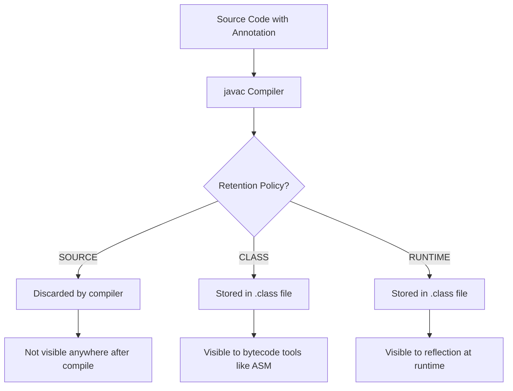
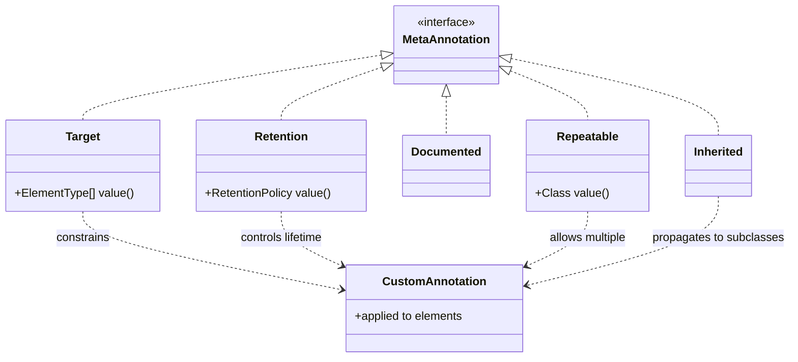
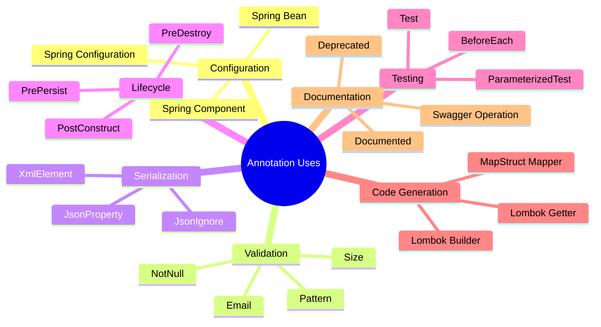

# Annotations

## Overview

Annotations are a metadata facility introduced in Java 5 (alongside generics and enums). An annotation is a special kind of interface that you attach to program elements such as classes, methods, fields, parameters, type uses, and even other annotations. Annotations do not directly affect program execution; instead, they provide information that compilers, build tools, frameworks, and runtime reflection can use to generate code, validate correctness, configure behavior, or perform dependency injection.

This note covers everything you need to know about annotations in modern Java: how to declare them, how to apply them, the meta-annotation types (`@Target`, `@Retention`, `@Documented`, `@Inherited`, `@Repeatable`), the different retention policies (source, class, runtime), type annotations introduced in Java 8, repeatable annotations, built-in annotations, and how to process annotations at runtime with reflection. We will also discuss annotation processors, the compile-time mechanism used by Lombok, MapStruct, Dagger, and many other frameworks to generate code based on annotations. By the end you will be able to design your own annotations, choose the right retention policy, and integrate them into your build pipeline.

## Background Knowledge

Before diving into annotations, make sure you understand:

- **Interfaces**: An annotation type is declared with `@interface`, which is essentially a special form of interface.
- **Default methods**: Annotation members have defaults and follow specific type rules.
- **Reflection (`java.lang.reflect`)**: Runtime annotations are accessed through the reflection API.
- **The class file format**: Annotations can be retained in bytecode and read by tools that inspect `.class` files.

A short history lesson. Before annotations, Java frameworks relied on verbose XML configuration files (think early Spring and EJB descriptors). Annotations allowed metadata to live next to the code it described, dramatically reducing boilerplate and improving maintainability. Modern Spring, Hibernate, JPA, Jakarta EE, JUnit, and countless other frameworks are heavily annotation-driven.

## Declaring an Annotation

An annotation type is declared with `@interface`:

```java
public @interface Reviewer {
    String name();
    String comment() default "";
    int rating() default 3;     // 1 to 5.
}
```

Each method declaration in the body is called an **element** of the annotation. The element's name is the method name, and its type must be one of:

- A primitive type (`int`, `long`, `double`, `boolean`, etc.)
- `String`
- `Class` or `Class<?>` (parameterized Class is allowed)
- An enum type
- An annotation type
- A one-dimensional array of any of the above

Elements can have default values specified with `default`. If no default is given, the element must be specified when the annotation is used. Multi-dimensional arrays are not allowed.

You apply an annotation by writing `@AnnotationType` followed by parenthesized key-value pairs:

```java
@Reviewer(name = "Alice", comment = "Looks good", rating = 5)
public class Calculator { ... }
```

If an annotation has only a single element named `value`, you can omit the element name:

```java
public @interface SuppressWarnings {
    String[] value();
}

@SuppressWarnings("unchecked")
public void process() { ... }
```

If the annotation has no elements, you can omit the parentheses entirely: `@Override`.

## Marker, Single-Value, and Multi-Value Annotations

Annotations are commonly categorized by how many elements they have:

- **Marker annotation**: No elements, e.g., `@Override`. Acts as a flag.
- **Single-value annotation**: One element, conventionally named `value`, e.g., `@SuppressWarnings("unchecked")`.
- **Multi-value annotation**: Multiple elements, e.g., `@Reviewer(name = "Alice", rating = 5)`.

## Meta-Annotations

Meta-annotations are annotations applied to other annotation types to control their behavior. The `java.lang.annotation` package provides the most important ones.

### @Target

`@Target` specifies which program elements the annotation can be applied to. It takes an array of `ElementType` enum values:

- `TYPE`: classes, interfaces, annotations, enums
- `FIELD`: fields, including enum constants
- `METHOD`: methods
- `PARAMETER`: method parameters
- `CONSTRUCTOR`: constructors
- `LOCALVARIABLE`: local variables
- `ANNOTATIONTYPE`: annotation types themselves
- `PACKAGE`: packages (in `package-info.java`)
- `TYPEPARAMETER`: generic type parameters (Java 8+)
- `TYPEUSE`: any type use (Java 8+)
- `MODULE`: modules (Java 9+)
- `RECORDCOMPONENT`: record components (Java 16+)

```java
@Target({ElementType.METHOD, ElementType.FIELD})
public @interface Audited { }
```

### @Retention

`@Retention` specifies how long the annotation is retained:

- `SOURCE`: discarded by the compiler. Example: `@Override`, `@SuppressWarnings`.
- `CLASS`: retained in the `.class` file but not available at runtime via reflection. This is the default.
- `RUNTIME`: retained in the `.class` file and available via reflection at runtime.

```java
@Retention(RetentionPolicy.RUNTIME)
@Target(ElementType.TYPE)
public @interface Service { }
```

If you want a framework to read your annotation at runtime (as Spring, Hibernate, JUnit do), you must set `@Retention(RUNTIME)`. Without it, reflection cannot see the annotation.

### @Documented

Indicates that the annotation should appear in the Javadoc of the annotated element.

### @Inherited

Indicates that, when applied to a class, the annotation is also applied to its subclasses. It only works on class-level annotations, not on interfaces, methods, or fields.

```java
@Inherited
@Retention(RetentionPolicy.RUNTIME)
@Target(ElementType.TYPE)
public @interface Persistent { }

@Persistent
public class Animal { }
public class Dog extends Animal { }     // Dog is also @Persistent.
```

### @Repeatable

Allows the same annotation to be applied multiple times to the same element. You must also declare a containing annotation type that holds an array of the repeatable one.

```java
@Repeatable(Schedules.class)
@Retention(RetentionPolicy.RUNTIME)
@Target(ElementType.METHOD)
public @interface Schedule {
    String day();
    String time();
}

@Retention(RetentionPolicy.RUNTIME)
@Target(ElementType.METHOD)
public @interface Schedules {
    Schedule[] value();
}

public class Worker {
    @Schedule(day = "Monday",    time = "09:00")
    @Schedule(day = "Wednesday", time = "14:00")
    @Schedule(day = "Friday",    time = "09:00")
    public void work() { }
}
```

At runtime, you can retrieve the repeated annotations with `getAnnotationsByType(Schedule.class)`, which automatically flattens the container.

## Built-in Annotations

The JDK ships with many useful annotations. The most common ones in `java.lang`:

- `@Override`: marks a method as overriding a superclass method. Causes a compile error if it does not. Always use it.
- `@Deprecated`: marks a program element as superseded. The compiler emits a warning when the element is used. You can add `since` and `forRemoval` attributes (Java 9+).
- `@SuppressWarnings`: tells the compiler to suppress specified warnings.
- `@SafeVarargs`: suppresses unchecked warnings related to varargs of generic types. Java 7+.
- `@FunctionalInterface`: marks an interface as having exactly one abstract method. The compiler enforces this.

In `java.lang.annotation`:

- `@Retention`, `@Target`, `@Documented`, `@Inherited`, `@Repeatable`, `@Native`.

The `javax.annotation` (or `jakarta.annotation`) package adds `@Generated`, `@Resource`, `@PostConstruct`, `@PreDestroy`.

## Type Annotations (Java 8+)

Java 8 introduced type annotations, which can be applied to any use of a type, not just declarations. This enables tools like the Checker Framework to perform extended type checking (nullness, tainting, interned, etc.).

```java
@Retention(RetentionPolicy.RUNTIME)
@Target(ElementType.TYPEUSE)
public @interface NonNull { }
@Target(ElementType.TYPEUSE)
public @interface Nullable { }

public class User {
    private @NonNull String name;
    private @Nullable String nickname;

    public @NonNull String greet(@Nullable String prefix) {
        return (prefix == null ? "" : prefix) + name;
    }

    // Type annotation on array contents vs array itself.
    public void process(@NonNull String @Nullable [] names) {
        // names may be null, but if non-null, contains no null entries.
    }
}
```

The placement matters: `@NonNull String[]` means a non-null array of nullable strings, while `String @NonNull []` means a non-null array of strings (any nullness). Type annotations can appear on generics, wildcards, casts, `throws` clauses, `implements` clauses, and more.

## Repeatable Annotations in Practice

Repeatable annotations simplify APIs that previously required wrapping values in an array:

```java
@Retention(RetentionPolicy.RUNTIME)
@Target(ElementType.TYPE)
@Repeatable(Permissions.class)
public @interface Permission {
    String value();
}

@Retention(RetentionPolicy.RUNTIME)
@Target(ElementType.TYPE)
public @interface Permissions {
    Permission[] value();
}

@Permission("read")
@Permission("write")
public class FileManager { }
```

## Reading Annotations at Runtime

When an annotation has `RUNTIME` retention, you can read it via reflection:

```java
@Service
public class UserService { ... }

Class<?> clazz = UserService.class;

// Is the annotation present?
boolean present = clazz.isAnnotationPresent(Service.class);

// Get a single annotation.
Service service = clazz.getAnnotation(Service.class);

// Get all annotations of a type (including from repeatable containers).
Permission[] perms = clazz.getAnnotationsByType(Permission.class);

// Get all annotations directly present on this element.
java.lang.annotation.Annotation[] all = clazz.getAnnotations();
```

Important differences:

- `getAnnotation` returns the annotation if present, or null.
- `getAnnotationsByType` handles `@Repeatable` and also follows `@Inherited`.
- `getDeclaredAnnotation` and `getDeclaredAnnotationsByType` ignore inherited annotations.
- `getAnnotations` includes inherited ones; `getDeclaredAnnotations` does not.

A real-world example of using reflection to process annotations:

```java
public class AnnotationProcessor {

    public static void process(Object target) throws Exception {
        Class<?> clazz = target.getClass();
        for (java.lang.reflect.Method m : clazz.getDeclaredMethods()) {
            if (m.isAnnotationPresent(Run.class)) {
                Run run = m.getAnnotation(Run.class);
                int times = run.times();
                for (int i = 0; i < times; i++) {
                    m.setAccessible(true);
                    m.invoke(target);
                }
            }
        }
    }
}

@Retention(RetentionPolicy.RUNTIME)
@Target(ElementType.METHOD)
@interface Run {
    int times() default 1;
}
```

## Compile-Time Annotation Processing

Runtime reflection is convenient but pays a runtime cost. For library code, **annotation processors** run at compile time and can generate new source files or validate annotations without any runtime overhead. This is how Lombok generates getters and setters, how MapStruct generates mappers, how Dagger generates dependency injection code, and how the `@Generated` JPA metamodel is created.

An annotation processor implements `javax.annotation.processing.Processor`:

```java
@SupportedAnnotationTypes("com.example.Service")
@SupportedSourceVersion(SourceVersion.RELEASE21)
public class ServiceProcessor extends AbstractProcessor {

    @Override
    public boolean process(Set<? extends TypeElement> annotations,
                           RoundEnvironment roundEnv) {
        for (Element e : roundEnv.getElementsAnnotatedWith(Service.class)) {
            // Generate a new source file, emit warnings, etc.
            processingEnv.getMessager().printMessage(
                javax.tools.Diagnostic.Kind.NOTE,
                "Found @Service on " + e.getSimpleName()
            );
        }
        return true; // Claim the annotation.
    }
}
```

You register the processor by placing its compiled `.class` file in a JAR with a `META-INF/services/javax.annotation.processing.Processor` descriptor. Modern build tools (Maven, Gradle) auto-detect processors on the annotation processing classpath.

A newer alternative is the **Filer API** combined with JavaPoet or JavaParser to generate Java source. The result is generated `.java` files compiled alongside the main sources.

## Mermaid Diagram: Annotation Retention Lifecycle



## Mermaid Diagram: Meta-Annotation Targets



## Common Pitfalls

### Forgetting `@Retention(RUNTIME)`

The default is `CLASS`, which means reflection cannot see the annotation. This is the most common annotation mistake.

### Misunderstanding `@Inherited`

`@Inherited` only works for class-level annotations. Method-level annotations are never inherited, even if the annotation type is marked `@Inherited`. This is a frequent source of confusion.

### Using annotation element types that are not allowed

You cannot use collections, maps, or multidimensional arrays as element types. Use an array of a simple type or a nested annotation instead.

### Default values that are mutable

Default values cannot be `null`. If you want to represent "not set," use a sentinel value or an empty array.

### Relying on annotation ordering

The JVM does not guarantee the order of annotations retrieved via reflection. Do not write code that depends on order.

### Annotation elements must be compile-time constants

When applying an annotation, all element values must be constant expressions. You cannot use `Math.random()` or a method call.

## Tips and Tricks

- Always set `@Retention(RUNTIME)` if frameworks need to read the annotation at runtime.
- Always set `@Target` to constrain where your annotation can be applied; this prevents misuse.
- Use `@Documented` so your annotations show up in Javadoc.
- Prefer `@Repeatable` over a single annotation with an array of values; it is more readable.
- Use `@Override` religiously; it catches misspelled method overrides at compile time.
- Consider annotation processors for library code to avoid runtime reflection cost.
- Use `getAnnotationsByType` to correctly handle repeatable annotations.
- Combine type annotations with a static analysis tool like the Checker Framework for advanced correctness checks.
- Use `@FunctionalInterface` on all single-method interfaces you intend to use as lambda targets.
- Use `@Deprecated(forRemoval = true, since = "2.0")` for API you plan to remove.

## Interview Questions

**Q1. What is the difference between `SOURCE`, `CLASS`, and `RUNTIME` retention?**

`SOURCE` annotations are discarded by the compiler and never appear in bytecode. `CLASS` (the default) annotations are written to the bytecode but not visible via reflection. `RUNTIME` annotations are in the bytecode and visible via reflection.

**Q2. Why must a runtime framework annotation have `RUNTIME` retention?**

Because reflection (`getAnnotation`, `isAnnotationPresent`, etc.) only sees annotations that the JVM loads at runtime. With `SOURCE` or `CLASS` retention, the annotation data is unavailable.

**Q3. What are meta-annotations and why are they useful?**

Meta-annotations are annotations applied to annotation types to control their behavior: where they can be used, how long they are retained, whether they are inherited, whether they are repeatable, and whether they appear in Javadoc.

**Q4. How do repeatable annotations work internally?**

The compiler wraps repeated annotations of a `@Repeatable` type into a containing annotation type. At runtime, `getAnnotationsByType` flattens the container back into individual annotations.

**Q5. What is the difference between `@Inherited` on a class annotation and on a method annotation?**

`@Inherited` only causes class-level annotations to propagate to subclasses. It has no effect on interface annotations, method annotations, or field annotations.

**Q6. Can an annotation extend another annotation?**

No. Annotation types implicitly extend `java.lang.annotation.Annotation`, and Java forbids any explicit `extends` clause on an annotation type.

**Q7. What is the role of an annotation processor?**

An annotation processor runs at compile time, examines annotations on source elements, and can generate new source files, emit warnings or errors, or perform validation. It enables frameworks like Lombok and MapStruct.

**Q8. What is a type annotation and how is it different from a declaration annotation?**

Type annotations (Java 8+) annotate uses of types, not declarations. They can appear on generics, casts, throws clauses, and so on. They are primarily used by static analysis tools, not by the JVM itself.

**Q9. Why can annotation elements not be `null`?**

The Java Language Specification forbids `null` as an annotation element value to keep the language simple and unambiguous. Use a sentinel value or an empty array to indicate absence.

**Q10. What happens if you apply an annotation to a target not allowed by its `@Target`?**

The compiler rejects the usage with an error. This is a compile-time check, not a runtime one.

## Custom Annotation Example: Retry

Let us design a custom `@Retry` annotation that we can place on methods to declare that they should be retried on failure. We will then write a runtime processor that uses reflection to read the annotation and apply the retry logic.

```java
import java.lang.annotation.*;

@Retention(RetentionPolicy.RUNTIME)
@Target(ElementType.METHOD)
public @interface Retry {
    int maxAttempts() default 3;
    long delayMillis() default 100;
    Class<? extends Throwable>[] retryOn() default { RuntimeException.class };
}
```

A service that uses the annotation:

```java
public class EmailService {

    @Retry(maxAttempts = 5, delayMillis = 500, retryOn = { java.io.IOException.class })
    public void send(String to, String body) throws java.io.IOException {
        // Simulated network call.
        if (Math.random() < 0.5) {
            throw new java.io.IOException("Network failure");
        }
        System.out.println("Email sent to " + to);
    }
}
```

A runtime processor that wraps calls to annotated methods:

```java
import java.lang.reflect.*;

public class RetryProxy implements InvocationHandler {

    private final Object target;

    public RetryProxy(Object target) { this.target = target; }

    public static <T> T wrap(T target, Class<T> iface) {
        Object proxy = Proxy.newProxyInstance(
            iface.getClassLoader(),
            new Class<?>[] { iface },
            new RetryProxy(target)
        );
        return iface.cast(proxy);
    }

    @Override
    public Object invoke(Object proxy, Method method, Object[] args) throws Throwable {
        Retry retry = method.getAnnotation(Retry.class);
        if (retry == null) {
            return method.invoke(target, args);
        }
        int attempts = 0;
        int max = retry.maxAttempts();
        while (true) {
            try {
                return method.invoke(target, args);
            } catch (InvocationTargetException e) {
                Throwable cause = e.getCause();
                if (++attempts >= max || !shouldRetry(retry, cause)) {
                    throw cause;
                }
                Thread.sleep(retry.delayMillis());
            }
        }
    }

    private boolean shouldRetry(Retry retry, Throwable cause) {
        for (Class<? extends Throwable> t : retry.retryOn()) {
            if (t.isInstance(cause)) return true;
        }
        return false;
    }
}
```

This is a small but complete framework in about 40 lines. It illustrates the typical flow: declare an annotation, mark code with it, and use reflection at runtime to act on it.

## Real-World Framework Annotations

Familiarity with the most common framework annotations helps you read and write idiomatic Java code:

- **JUnit 5**: `@Test`, `@BeforeEach`, `@AfterEach`, `@BeforeAll`, `@ParameterizedTest`, `@DisplayName`, `@Disabled`.
- **Spring**: `@Component`, `@Service`, `@Repository`, `@Autowired`, `@Configuration`, `@Bean`, `@RequestMapping`, `@Transactional`.
- **JPA / Hibernate**: `@Entity`, `@Table`, `@Id`, `@Column`, `@OneToMany`, `@ManyToOne`, `@NamedQuery`.
- **Jackson**: `@JsonProperty`, `@JsonCreator`, `@JsonIgnore`, `@JsonFormat`, `@JsonSerialize`.
- **Lombok**: `@Getter`, `@Setter`, `@Builder`, `@Data`, `@Slf4j`, `@RequiredArgsConstructor`.
- **Jakarta Bean Validation**: `@NotNull`, `@NotBlank`, `@Size`, `@Pattern`, `@Valid`.
- **JAXB**: `@XmlElement`, `@XmlAttribute`, `@XmlRootElement`, `@XmlType`.

Each of these is declared with `@Retention(RUNTIME)` so that the framework can read it reflectively, and with appropriate `@Target` to constrain its usage.

## Annotation Inheritance Details

Annotation inheritance is subtle and frequently misunderstood. Here are the precise rules:

- Class-level annotations marked `@Inherited` are inherited by subclasses.
- Annotations on interfaces are NEVER inherited, even with `@Inherited`.
- Method-level annotations are NEVER inherited, even with `@Inherited`. They are inherited only if the subclass does not override the method.
- Field-level annotations are NEVER inherited.
- Annotations on type parameters and type uses follow the same rules as their enclosing element.

In practice, this means you cannot rely on `@Inherited` for anything but class-level annotations. For method annotations, frameworks often walk the class hierarchy manually using `AnnotationUtils.findAnnotation(method, annotationType)` to simulate inheritance.

## Compile-Time Annotation Processor Walkthrough

Let us sketch a complete annotation processor that generates a `toString` method for any class annotated with `@AutoToString`. We will use JavaPoet to generate source code.

```java
import javax.annotation.processing.*;
import javax.lang.model.SourceVersion;
import javax.lang.model.element.*;
import javax.tools.Diagnostic;
import com.squareup.javapoet.*;

@SupportedAnnotationTypes("com.example.AutoToString")
@SupportedSourceVersion(SourceVersion.RELEASE21)
public class AutoToStringProcessor extends AbstractProcessor {

    @Override
    public boolean process(Set<? extends TypeElement> annotations, RoundEnvironment env) {
        for (Element e : env.getElementsAnnotatedWith(com.example.AutoToString.class)) {
            if (e.getKind() != ElementKind.CLASS) continue;
            TypeElement type = (TypeElement) e;

            MethodSpec toString = MethodSpec.methodBuilder("toString")
                .addAnnotation(Override.class)
                .addModifiers(Modifier.PUBLIC)
                .returns(String.class)
                .addStatement("return $S + super.toString()",
                    type.getSimpleName() + "[")
                .build();

            TypeSpec generated = TypeSpec.classBuilder(type.getSimpleName() + "ToString")
                .addMethod(toString)
                .build();

            try {
                JavaFile.builder(
                    processingEnv.getElementUtils().getPackageOf(type).getQualifiedName().toString(),
                    generated
                ).build().writeTo(processingEnv.getFiler());
            } catch (java.io.IOException ex) {
                processingEnv.getMessager().printMessage(
                    Diagnostic.Kind.ERROR, "Failed to write: " + ex.getMessage()
                );
            }
        }
        return true;
    }
}
```

Compile-time processors like this are how Lombok, MapStruct, Dagger, and Hibernate's static metamodel generator work. They produce code that is compiled alongside your sources, eliminating runtime reflection entirely.

## Type Annotations in Practice

Type annotations shine when combined with a static analysis tool like the Checker Framework. They let you express invariants the compiler cannot otherwise check:

```java
import org.checkerframework.checker.nullness.qual.*;

public class UserService {
    private @NonNull String name;
    private @Nullable String nickname;

    public UserService(@NonNull String name, @Nullable String nickname) {
        this.name = java.util.Objects.requireNonNull(name);
        this.nickname = nickname;
    }

    public @NonNull String displayName() {
        return nickname != null ? nickname : name;
    }

    // The framework verifies that this method never returns null.
    public @NonNull String upper() {
        return displayName().toUpperCase();
    }
}
```

With the checker enabled, the compiler will warn you if you try to assign a nullable value to a non-null variable, dereference a nullable reference, or return null from a method declared to return non-null.

## Annotation Best Practices

- Always set `@Retention(RUNTIME)` if frameworks need to read the annotation.
- Always set `@Target` to constrain misuse.
- Use `@Documented` so your annotations appear in Javadoc.
- Prefer `@Repeatable` for collections of annotations.
- Use `@Inherited` only for class-level annotations.
- Annotate your annotation type itself with `@Retention`, `@Target`, etc.
- Provide Javadoc for each element so callers know what to set.
- Use sensible defaults so most callers can omit most elements.
- Prefer `Class<? extends ...>` over `Class` for type safety in annotation elements that take a class.
- Consider providing a constant class with commonly used annotation instances for clarity.

## Annotation Use Cases Across the Ecosystem

Annotations appear in nearly every part of the modern Java ecosystem. Understanding the categories helps you recognize patterns across frameworks.

### Configuration Metadata

Frameworks use annotations to declare how components should be wired together. Spring's `@Component`, `@Autowired`, `@Configuration`, and `@Bean` are textbook examples. They replace XML configuration with declarative, type-safe annotations that live next to the code they configure.

### Validation

Bean Validation annotations (`@NotNull`, `@Size`, `@Pattern`, `@Email`) declare constraints on fields and parameters. At runtime, a validator traverses the annotations and enforces them. This pattern is used heavily in web applications to validate request payloads.

### Serialization Hints

Jackson and similar libraries use annotations to control how objects are serialized to JSON or XML. `@JsonProperty` renames a field, `@JsonIgnore` excludes it, `@JsonFormat` controls date formatting. These annotations let you keep your serialization logic next to the field declarations.

### Lifecycle Callbacks

Annotations like `@PostConstruct` and `@PreDestroy` (Jakarta) mark methods that the container should call when a bean is created or destroyed. JPA's `@PrePersist` and `@PostLoad` do the same for entity lifecycle events.

### Testing

JUnit's `@Test`, `@BeforeEach`, and `@ParameterizedTest` mark test methods and lifecycle hooks. JUnit 5 also supports `@DisplayName` for human-friendly test names and `@Nested` for grouped tests.

### Code Generation

Lombok uses annotation processors to generate boilerplate (getters, setters, constructors, builders) at compile time. MapStruct uses processors to generate efficient mapper classes. Hibernate's static metamodel generator produces typed `@StaticMetamodel` classes for criteria queries.

### Documentation

`@Deprecated` marks APIs as obsolete and triggers compiler warnings. Javadoc picks up `@Documented` annotations automatically. Tools like Swagger use `@Operation` and `@Parameter` to generate API documentation.

## Annotations vs Configuration Files

The shift from XML configuration to annotations has been one of the biggest cultural changes in the Java ecosystem. The trade-offs are:

- **Annotations** are co-located with the code, type safe, refactor-friendly, and easy to find. They are awkward for cross-cutting configuration that changes between environments.
- **External configuration files** (YAML, properties, JSON) are environment-specific and can change without recompilation. They are better for deployment-time configuration.

Modern frameworks (Spring Boot, Quarkus, Micronaut) combine both: annotations declare structure, external configuration provides environment-specific values. This is why you see `@Value("${db.url}")` in Spring, which injects a value from external configuration into an annotated field.

## Mermaid Diagram: Annotation Categories



## Annotation and Reflection Interaction

When you use reflection to read annotations, you must be aware of several nuances:

- `getAnnotation` returns the directly declared annotation, or for class-level annotations, the inherited one if applicable.
- `getAnnotationsByType` handles `@Repeatable` correctly, returning individual instances rather than the container.
- `getDeclaredAnnotation` returns only annotations directly on the element, ignoring inherited ones.
- Annotations on type parameters and type uses are accessed through `AnnotatedParameterizedType`, `AnnotatedType`, and similar classes.
- Annotations on method parameters are obtained via `Method.getParameterAnnotations`, which returns an array parallel to the parameter array.

A robust pattern for finding an annotation including those on interfaces and superclass methods is to walk the hierarchy:

```java
public static <A extends Annotation> A findAnnotation(Method method, Class<A> type) {
    A found = method.getAnnotation(type);
    if (found != null) return found;
    // Walk super class.
    Class<?> sup = method.getDeclaringClass().getSuperclass();
    while (sup != null) {
        try {
            Method superMethod = sup.getDeclaredMethod(method.getName(), method.getParameterTypes());
            found = superMethod.getAnnotation(type);
            if (found != null) return found;
        } catch (NoSuchMethodException ignored) { }
        sup = sup.getSuperclass();
    }
    // Walk interfaces.
    for (Class<?> iface : method.getDeclaringClass().getInterfaces()) {
        try {
            Method ifaceMethod = iface.getMethod(method.getName(), method.getParameterTypes());
            found = ifaceMethod.getAnnotation(type);
            if (found != null) return found;
        } catch (NoSuchMethodException ignored) { }
    }
    return null;
}
```

Spring's `AnnotationUtils.findAnnotation` does exactly this, and many libraries depend on similar logic.

## Summary

Annotations are Java's metadata mechanism. They are declared with `@interface`, applied with `@Type` syntax, and controlled by meta-annotations such as `@Target`, `@Retention`, `@Documented`, `@Inherited`, and `@Repeatable`. Runtime frameworks read annotations via reflection; compile-time tools use annotation processors to generate code or validate usage. By choosing the right retention policy and target, you can build clean, declarative APIs that integrate smoothly with frameworks like Spring, JUnit, and Hibernate. Understanding the meta-annotation system and the difference between declaration and type annotations is essential for designing libraries that feel native and idiomatic.
