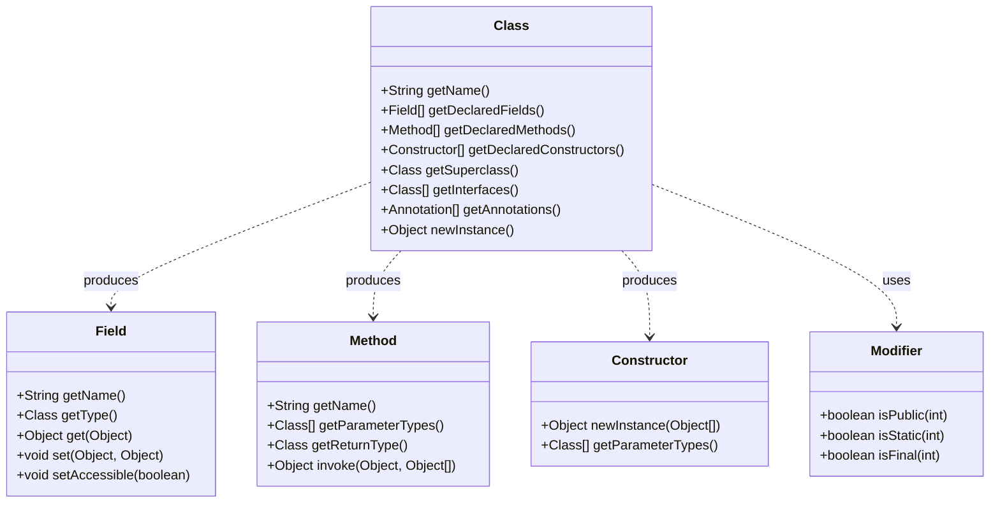
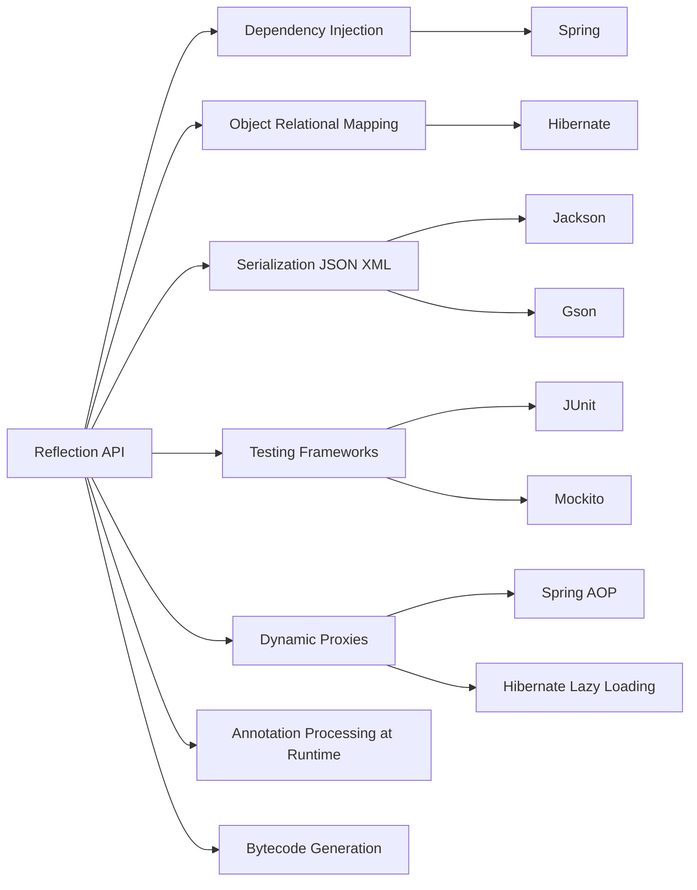
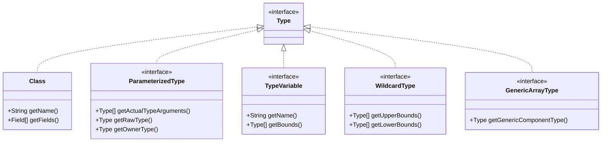

# Reflection

## Overview

Reflection is the mechanism by which a Java program can inspect and modify its own structure and behavior at runtime. With reflection, you can discover the classes, methods, fields, constructors, and annotations of any object, instantiate classes whose names are known only at runtime, invoke methods by name, read and write private fields, and even generate new classes on the fly. Reflection is the foundation of countless frameworks: Spring, Hibernate, JPA, Jackson, Gson, JUnit, Mockito, and many others would be impossible without it. Reflection is also what powers serialization frameworks, dependency injection containers, ORM mappers, proxy generators, and dynamic language runtimes running on the JVM.

This power comes at a cost. Reflection is slower than direct code, breaks compile-time type safety, can violate encapsulation, and increases the surface area for security vulnerabilities. Modern Java has progressively restricted the most dangerous uses of reflection (especially around internal JDK classes) through modules and strong encapsulation in Java 9 through Java 17. This note walks through the entire reflection API, shows idiomatic patterns for common tasks, explains performance and security implications, and covers the modern alternatives such as `MethodHandle`, `VarHandle`, and records.

## Background Knowledge

Before reading this note, make sure you understand:

- **Classes and objects**: Every object has a `Class` object that represents its type.
- **The class loader**: A `Class` object is loaded by a class loader and is unique per class loader per type.
- **Modifiers**: `public`, `private`, `protected`, `static`, `final`, etc.
- **Generics**: Reflection can expose generic type signatures when they were preserved in the bytecode.
- **Annotations**: Reflection is the standard way to read runtime annotations.
- **Modules (Java 9+)**: Strong encapsulation may block reflective access to internal types.

A historical note. Reflection has been part of Java since version 1.1 (1997), when it was added to support JavaBeans, serialization, and remote method invocation. The original API has remained remarkably stable, but Java 8 added type annotations and parameter reflection, Java 9 added modules and `MethodHandle` improvements, and Java 16+ finalized strong encapsulation of JDK internals. Today, code that uses reflection to access `sun.misc.Unsafe` or `java.lang.invoke` internals will, by default, fail with `InaccessibleObjectException`.

## The Class Object

The entry point to reflection is `java.lang.Class`. There are three ways to obtain a `Class` object:

```java
// 1. The .class literal.
Class<String> stringClass = String.class;

// 2. The getClass() method on an instance.
String greeting = "Hello";
Class<?> greetingClass = greeting.getClass();

// 3. The static Class.forName method.
Class<?> listClass = Class.forName("java.util.ArrayList");
```

Each approach has different trade-offs. The `.class` literal is compile-time checked and the simplest. `getClass()` returns the runtime class of an instance, which may be a subclass of the declared type. `Class.forName` is necessary when the class name is available only at runtime (e.g., loaded from configuration), and it triggers class initialization by default.

Once you have a `Class` object, you can introspect it:

```java
String name = stringClass.getName();           // java.lang.String
String simpleName = stringClass.getSimpleName(); // String
Class<?> superclass = stringClass.getSuperclass(); // java.lang.Object
Class<?>[] interfaces = stringClass.getInterfaces();
int modifiers = stringClass.getModifiers();
boolean isPublic = java.lang.reflect.Modifier.isPublic(modifiers);
boolean isFinal = java.lang.reflect.Modifier.isFinal(modifiers);
boolean isInterface = stringClass.isInterface();
boolean isRecord = stringClass.isRecord();      // Java 16+
boolean isSealed = stringClass.isSealed();      // Java 17+
Package pkg = stringClass.getPackage();
```

## Inspecting Fields

`Class` exposes four families of methods for fields:

- `getField(String)`: returns a public field (including inherited ones).
- `getFields()`: returns all public fields.
- `getDeclaredField(String)`: returns any field declared in this class (excluding inherited), including private ones.
- `getDeclaredFields()`: returns all fields declared in this class.

```java
public class Person {
    public String name;
    private int age;
    protected String nickname;
}

Class<?> clazz = Person.class;
Field[] publicFields = clazz.getFields();             // only public ones.
Field[] allDeclared = clazz.getDeclaredFields();      // all, including private.

Field ageField = clazz.getDeclaredField("age");
ageField.setAccessible(true);   // Required to access private fields.

Person p = new Person();
p.name = "Alice";
ageField.setInt(p, 30);                       // Write private field.
System.out.println(ageField.getInt(p));        // Read private field.
```

Calling `setAccessible(true)` suppresses Java language access checks. Without it, accessing private members throws `IllegalAccessException`. In modular Java, even with `setAccessible(true)`, you may still get `InaccessibleObjectException` for classes in modules that do not open the relevant package to your module.

## Inspecting Methods

The method reflection API parallels the field API:

```java
public class Calculator {
    public int add(int a, int b) { return a + b; }
    private int multiply(int a, int b) { return a * b; }
}

Class<?> clazz = Calculator.class;
Method[] publicMethods = clazz.getMethods();         // includes inherited.
Method[] declaredMethods = clazz.getDeclaredMethods(); // declared only.

Method add = clazz.getMethod("add", int.class, int.class);
Calculator calc = new Calculator();
Object result = add.invoke(calc, 2, 3);              // Returns Integer 5.

Method multiply = clazz.getDeclaredMethod("multiply", int.class, int.class);
multiply.setAccessible(true);
Object product = multiply.invoke(calc, 4, 5);        // Returns Integer 20.
```

Important behaviors:

- `getMethod` requires the parameter types because Java supports overloading.
- `invoke` returns an `Object`; primitives are boxed.
- Static methods are invoked with `null` as the target: `staticMethod.invoke(null, args)`.
- If the method throws an exception, `invoke` wraps it in `InvocationTargetException`. You must unwrap with `getCause`.

## Inspecting Constructors

Constructors are obtained with `getConstructor`, `getConstructors`, `getDeclaredConstructor`, and `getDeclaredConstructors`. To create instances:

```java
Class<?> clazz = Class.forName("java.util.ArrayList");
Constructor<?> ctor = clazz.getConstructor(int.class);  // initialCapacity constructor.
Object list = ctor.newInstance(16);
// list is a fresh ArrayList with initial capacity 16.
```

`newInstance` on a `Constructor` is the modern, generic way to create instances. The older `Class.newInstance()` is deprecated since Java 9 because it propagates checked exceptions without declaring them.

## Reading Annotations

Reflection is the primary way to read runtime annotations. This is the foundation of dependency injection frameworks and serialization libraries.

```java
@Retention(RetentionPolicy.RUNTIME)
@Target(ElementType.TYPE)
public @interface Service { }

@Retention(RetentionPolicy.RUNTIME)
@Target(ElementType.FIELD)
public @interface Inject { }

@Service
public class UserService {
    @Inject private Logger logger;
}

Class<?> clazz = UserService.class;
if (clazz.isAnnotationPresent(Service.class)) {
    Service s = clazz.getAnnotation(Service.class);
    System.out.println("Found @Service");
}

for (Field f : clazz.getDeclaredFields()) {
    if (f.isAnnotationPresent(Inject.class)) {
        f.setAccessible(true);
        // Inject a logger instance.
        f.set(instance, new ConsoleLogger());
    }
}
```

## Reflecting on Generics

Reflection can recover some generic type information that was preserved in the bytecode via the `Signature` attribute. For example, you can inspect the return type of a method that returns `List<String>`:

```java
public class Repository {
    public java.util.List<String> findAll() { return List.of(); }
}

Method m = Repository.class.getMethod("findAll");
java.lang.reflect.Type returnType = m.getGenericReturnType();

if (returnType instanceof java.lang.reflect.ParameterizedType pt) {
    System.out.println(pt.getRawType());    // interface java.util.List
    System.out.println(pt.getActualTypeArguments()[0]); // class java.lang.String
}
```

`getGenericSuperclass` and `getGenericInterfaces` are useful for recovering the type arguments of a generic superclass, which is the basis for the **super type token** pattern used by Gson and Jackson:

```java
public abstract class TypeReference<T> { }

TypeReference<List<String>> ref = new TypeReference<>() {};
Class<?> clazz = ref.getClass();
Type superType = clazz.getGenericSuperclass();
ParameterizedType pt = (ParameterizedType) superType;
Type actualType = pt.getActualTypeArguments()[0]; // List<String>
```

## Dynamic Proxies

`java.lang.reflect.Proxy` lets you implement one or more interfaces at runtime by routing every method call to a single `InvocationHandler`. This is how Spring AOP, Hibernate lazy loading, and Mockito mocks work.

```java
public interface Greeter {
    String greet(String name);
}

InvocationHandler handler = (proxy, method, args) -> {
    System.out.println("Calling: " + method.getName());
    return "Hello, " + args[0];
};

Greeter proxy = (Greeter) Proxy.newProxyInstance(
    Greeter.class.getClassLoader(),
    new Class<?>[] { Greeter.class },
    handler
);

String result = proxy.greet("Alice");   // Logs and returns "Hello, Alice".
```

For proxying classes (not just interfaces), libraries use bytecode generation (CGLIB, ByteBuddy) because the JDK's `Proxy` only supports interfaces.

## Array Manipulation

`java.lang.reflect.Array` provides reflective access to arrays, including the ability to create arrays whose component type is known only at runtime.

```java
Object intArray = java.lang.reflect.Array.newInstance(int.class, 5);
Array.set(intArray, 0, 42);
System.out.println(Array.get(intArray, 0));    // 42
System.out.println(Array.getLength(intArray)); // 5
```

This is essential for writing generic collection utilities that must create typed arrays, since `new T[]` is illegal due to type erasure.

## MethodHandle and VarHandle

`java.lang.invoke.MethodHandle`, introduced in Java 7, is a modern, more efficient alternative to `Method` for invocation. It is the basis for `invokedynamic`, lambda translation, and many JVM optimizations.

```java
MethodHandles.Lookup lookup = MethodHandles.lookup();
MethodHandle mh = lookup.findVirtual(String.class, "length",
    MethodType.methodType(int.class));
int len = (int) mh.invoke("Hello");   // 5
```

`VarHandle`, introduced in Java 9, offers similar benefits for field access with fine-grained memory ordering, replacing many uses of `sun.misc.Unsafe`.

```java
VarHandle vh = MethodHandles.lookup().findVarHandle(Counter.class, "count", int.class);
Counter c = new Counter();
vh.set(c, 10);
int v = (int) vh.get(c);
vh.compareAndSet(c, 10, 20);   // Atomic compare and set.
```

MethodHandles and VarHandles are typically faster than reflection after warm-up because the JVM can inline them aggressively. They are the preferred mechanism for low-level library code.

## Performance Considerations

Reflection is significantly slower than direct code:

- Looking up members by name involves string comparisons and security checks.
- Each `invoke` is a virtual call through the reflection runtime, with primitive boxing and argument array allocation.
- The JIT can optimize some of this away, but cold paths still pay a 5x to 30x overhead.

Mitigation strategies:

1. **Cache `Method`, `Field`, and `Constructor` objects** in static fields. Lookups are expensive; invocation is less so.
2. **Use `setAccessible(true)` once** at lookup time; this also speeds up access checks.
3. **Prefer `MethodHandle`** for tight loops where performance matters.
4. **Generate bytecode** with ASM, ByteBuddy, or cglib for the very highest throughput. This is what Jackson, Gson (after warm-up), and Spring do for hot paths.
5. **Avoid `Class.forName` in hot paths**; load classes once at startup.
6. **Consider annotation processors** to generate dedicated code at compile time and avoid runtime reflection entirely.

A common benchmark pattern: parse JSON with reflective Gson 100k times, then with generated Jackson code. The generated version is typically 3 to 10 times faster.

## Security Considerations

Reflection is a double-edged sword for security:

- It allows legitimate frameworks to perform magic (DI, ORM, serialization).
- It also allows malicious code to bypass access controls, instantiate sensitive classes, and read private state.

The JDK has progressively restricted reflective access:

- Java 9 introduced modules with strong encapsulation. A package must be `opens` for deep reflection (e.g., `setAccessible(true)` on private members).
- Java 16 made strong encapsulation the default. Accessing internal JDK classes (like `sun.misc.Unsafe`) throws `InaccessibleObjectException` unless you pass `--add-opens` flags on the command line.
- The `java.security.Manager` was deprecated in Java 17 and removed in Java 18 (replaced largely by module boundaries).

For libraries, this means:

- Prefer public API surfaces.
- If you must reflect, document the required `--add-opens` flags.
- Consider `MethodHandle` or generated bytecode for trusted internal access.
- Never use reflection on untrusted input without validation; an attacker who controls a class name can load arbitrary classes from the classpath.

## Mermaid Diagram: Reflection API Overview



## Mermaid Diagram: Reflection Use Cases



## Common Pitfalls

### Forgetting `setAccessible(true)`

Accessing private members without `setAccessible(true)` throws `IllegalAccessException`. In modular code, even with `setAccessible(true)`, internal classes may still be inaccessible.

### Not caching lookups

Repeating `getMethod` calls in a hot loop is extremely slow. Look up once, store in a `static final` field.

### Ignoring `InvocationTargetException`

When a reflected method throws, `invoke` wraps the cause in `InvocationTargetException`. Forgetting to unwrap means you log the wrong exception.

### Using `Class.newInstance` (deprecated)

It propagates checked exceptions without declaring them. Use `Constructor.newInstance` instead.

### Reflecting into JDK internals

Code that historically used `sun.misc.Unsafe` or reflected into `java.lang` private fields fails on modern JDKs without `--add-opens`. Plan for this in your library's documentation.

### Mixing reflection and the JVM's optimizer

The JIT optimizes direct code far better than reflection. If performance matters, switch to `MethodHandle` or generated bytecode.

### Memory leaks via class loaders

Reflectively loading classes with custom class loaders can leak class loaders (and everything they reference) if even one instance or static reference survives. This is the classic "PermGen leak" (now Metaspace leak) of application servers.

## Tips and Tricks

- Cache reflection objects in `static final` fields with `setAccessible(true)` called once.
- Prefer `Constructor.newInstance` over `Class.newInstance`.
- Always wrap `invoke` in try/catch and unwrap `InvocationTargetException`.
- Use the super type token pattern to recover generic type information at runtime.
- Use `Proxy` for interface mocks; use ByteBuddy for class mocks.
- For high-throughput code, use `MethodHandle` or generate bytecode.
- Document `--add-opens` requirements for your library.
- Use `Class.isRecord` and `Class.isSealed` (Java 16/17) to detect records and sealed classes.
- Use `getRecordComponents` to enumerate record fields in declaration order.
- Combine reflection with `MethodHandles.privateLookupIn` for advanced library use cases like deep proxying across modules.

## Interview Questions

**Q1. What are the three ways to obtain a `Class` object?**

The `.class` literal (compile-time checked), the `getClass()` instance method (returns runtime class), and `Class.forName(String)` (runtime lookup by name).

**Q2. Why is reflection slow?**

Because each call involves name lookup, security checks, argument boxing, virtual dispatch through reflection runtime, and array allocation. The JIT can optimize some of this but cannot match direct code.

**Q3. What is the difference between `getMethod` and `getDeclaredMethod`?**

`getMethod` returns public methods including inherited ones. `getDeclaredMethod` returns any method declared directly in the class (including private) but excludes inherited methods.

**Q4. What does `setAccessible(true)` do?**

It suppresses Java language access checks, allowing access to private members. In modular Java, it may still fail with `InaccessibleObjectException` if the package is not opened to your module.

**Q5. How is `MethodHandle` different from `Method`?**

A `MethodHandle` is a typed, direct pointer to a method. After warm-up, the JVM can inline it aggressively. `Method` is a heavyweight reflection object with runtime type checks on every invocation.

**Q6. What is `InvocationTargetException`?**

The checked wrapper exception thrown by `Method.invoke` when the underlying method throws. You must call `getCause` to see the original exception.

**Q7. How do dynamic proxies work?**

`Proxy.newProxyInstance` creates a class at runtime that implements one or more interfaces and forwards every method call to a single `InvocationHandler`. The handler decides what to do with each call.

**Q8. What is the super type token pattern?**

By creating an anonymous subclass of a generic type, you embed the type argument in the class's generic superclass signature, which reflection can recover at runtime. This is how Gson and Jackson accept `List<String>` type information.

**Q9. Why was `Class.newInstance` deprecated?**

Because it propagates checked exceptions thrown by the constructor without declaring them, defeating compile-time exception checking. `Constructor.newInstance` wraps them in `InvocationTargetException`.

**Q10. How has reflection changed in Java 9 through Java 17?**

Modules introduced strong encapsulation: only packages that are `exports` are accessible for ordinary reflection, and only packages that are `opens` are accessible for deep reflection (`setAccessible(true)`). Java 16 made this the default, blocking access to JDK internals without `--add-opens` flags.

## Reflective Access to Generics

Although type parameters are erased at runtime, the compiler preserves generic signatures in the bytecode via the `Signature` attribute. Reflection exposes this through a hierarchy of types in `java.lang.reflect`:

- `Type` is the root interface.
- `Class` implements `Type` and represents raw types.
- `ParameterizedType` represents parameterized types like `List<String>`.
- `TypeVariable` represents type variables like `T`.
- `WildcardType` represents wildcards like `? extends Number`.
- `GenericArrayType` represents arrays of parameterized types.

Common use cases:

```java
public class Box<T> {
    private T value;
    public List<T> items() { return List.of(); }
    public Map<String, List<T>> grouped() { return Map.of(); }
}

// Recover type parameter of a class.
TypeVariable<?>[] params = Box.class.getTypeParameters();
System.out.println(params[0].getName());   // T

// Recover generic return type of a method.
Method m = Box.class.getMethod("items");
Type rt = m.getGenericReturnType();
if (rt instanceof ParameterizedType pt) {
    System.out.println(pt.getRawType());                  // interface java.util.List
    System.out.println(pt.getActualTypeArguments()[0]);   // T (TypeVariable)
}

// Recover nested generics.
Method g = Box.class.getMethod("grouped");
Type grt = g.getGenericReturnType();
ParameterizedType mapType = (ParameterizedType) grt;
Type valueArg = mapType.getActualTypeArguments()[1];   // List<T>
ParameterizedType listType = (ParameterizedType) valueArg;
System.out.println(listType.getRawType());              // interface java.util.List
```

This is the foundation for frameworks that need to know the full generic shape of an API. Jackson uses it to pick the right serializer for `List<Foo>` versus `List<Bar>`. Spring uses it to resolve generic type parameters of `Repository<T, ID>`.

## Super Type Token Pattern

Because you cannot write `List<String>.class`, libraries use the super type token pattern to recover generic types at runtime. You create an anonymous subclass of a generic type, and the actual type argument is embedded in the bytecode:

```java
public abstract class TypeReference<T> {
    private final Type type;

    protected TypeReference() {
        Type superClass = getClass().getGenericSuperclass();
        if (superClass instanceof ParameterizedType pt) {
            this.type = pt.getActualTypeArguments()[0];
        } else {
            throw new IllegalArgumentException("Missing type parameter");
        }
    }

    public Type getType() { return type; }
}

// Usage: the type argument List<String> is captured.
TypeReference<List<String>> ref = new TypeReference<>() {};
Type t = ref.getType();   // ParameterizedType for List<String>
```

Gson's `TypeToken` and Jackson's `TypeReference` both use this pattern. It is the standard workaround for type erasure when you need runtime generic type information.

## Performance Optimization Patterns

Reflection is slow, but you can mitigate the cost significantly with these patterns:

### Pattern 1: Cache Lookups

Look up `Method`, `Field`, and `Constructor` objects once and store them in `static final` fields:

```java
public class FieldAccessor {
    private static final Field VALUEFIELD;

    static {
        try {
            VALUEFIELD = SomeClass.class.getDeclaredField("value");
            VALUEFIELD.setAccessible(true);
        } catch (NoSuchFieldException e) {
            throw new ExceptionInInitializerError(e);
        }
    }

    public static Object get(SomeClass obj) throws IllegalAccessException {
        return VALUEFIELD.get(obj);
    }
}
```

This is the single biggest win. After caching, each access is essentially a direct field read with a small reflection overhead.

### Pattern 2: MethodHandle for Hot Paths

For methods called in tight loops, switch to `MethodHandle`:

```java
private static final MethodHandle LENGTHMH;

static {
    try {
        LENGTHMH = MethodHandles.lookup().findVirtual(
            String.class, "length", MethodType.methodType(int.class));
    } catch (Exception e) {
        throw new ExceptionInInitializerError(e);
    }
}

int len = (int) LENGTHMH.invoke("Hello");
```

After warm-up, the JIT inlines the call site, achieving performance close to a direct invocation.

### Pattern 3: Generated Bytecode

For maximum performance, generate a dedicated accessor class with ASM or ByteBuddy. The generated class calls the field or method directly, with no reflection overhead at all. This is what Jackson does for the hottest serialization paths.

### Pattern 4: Avoid Primitive Boxing

If a field is primitive, use the typed reflective methods (`getInt`, `setInt`, `getBoolean`, etc.) instead of `get` and `set` with autoboxing:

```java
Field f = clazz.getDeclaredField("count");
f.setAccessible(true);
f.setInt(target, 42);     // No boxing.
int v = f.getInt(target); // No boxing.
```

This avoids creating an `Integer` object on every call.

## Reflection vs MethodHandles vs Bytecode Generation

The choice between reflection, `MethodHandle`, and generated bytecode depends on your performance requirements and complexity tolerance. Reflection offers the simplest API and the lowest type safety. `MethodHandle` and `VarHandle` provide typed access and high performance after warm-up. Generated bytecode (via ASM or ByteBuddy) offers the highest performance and strongest type safety at the cost of significant implementation complexity.

For most application code, reflection is fine. For library infrastructure such as serializers, mappers, and dependency injectors, prefer `MethodHandle` or generated bytecode. For the very hottest paths, generated bytecode is the only choice that approaches direct code performance.

## Real-World Use Cases

Reflection powers almost every Java framework you use:

- **Spring** scans the classpath for classes annotated with `@Component`, instantiates them with `Constructor.newInstance`, and injects dependencies by reflectively setting `@Autowired` fields.
- **Hibernate** reads `@Entity` classes, reflects over their fields to map them to columns, and uses `MethodHandle` or generated proxies for lazy loading.
- **Jackson** reflects over getters and fields to serialize objects to JSON and uses the canonical constructor (via `getRecordComponents` for records) to deserialize.
- **JUnit** scans test classes for `@Test` methods and invokes them reflectively, wrapping each in exception handling.
- **Mockito** uses CGLIB or ByteBuddy to generate subclasses that override methods and intercept calls.
- **Gson** uses the super type token pattern to deserialize `List<Foo>` correctly.

Understanding reflection is essential for reading framework source code and for designing your own infrastructure.

## Mermaid Diagram: Reflection API Type Hierarchy



## Reflection with Records

Records were designed with reflection in mind. The `Class` API gained two new methods specifically for records:

```java
public static void inspect(Class<?> clazz) {
    if (!clazz.isRecord()) {
        System.out.println(clazz.getName() + " is not a record");
        return;
    }
    System.out.println("Record: " + clazz.getName());
    for (RecordComponent rc : clazz.getRecordComponents()) {
        System.out.println("  " + rc.getName()
            + " : " + rc.getType().getSimpleName()
            + " (accessor: " + rc.getAccessor().getName() + ")");
    }
}

inspect(java.time.LocalDate.class);  // Not a record.
inspect(SomeRecord.class);
```

`RecordComponent` provides:

- `getName`: the component name.
- `getType`: the component type (`Class`).
- `getGenericType`: the generic type (e.g., `List<String>`).
- `getAccessor`: the accessor `Method`.
- `getAnnotations`: annotations on the component.

Frameworks like Jackson use `getRecordComponents` to find the canonical constructor and bind JSON fields to record components in a type-safe way. The combination of records and reflection gives you clean data carriers that frameworks can construct without compromising validation, because the canonical constructor always runs.

## Reflection and Sealed Types

Reflection also learned about sealed types:

```java
Class<?> clazz = Shape.class;
if (clazz.isSealed()) {
    Class<?>[] permitted = clazz.getPermittedSubclasses();
    System.out.println("Sealed type with permitted subtypes:");
    for (Class<?> c : permitted) {
        System.out.println("  " + c.getName());
    }
}
```

This is useful for code generators, serializers, and pattern matching tools that need to enumerate the closed set of variants of a sealed hierarchy.

## Reflection and Modules

When reflecting into modules, you need to be aware of `MethodHandles.privateLookupIn`, which lets a class gain reflective access to a target class in another module, provided the target module has opened the relevant package or has used `opens ... to` to grant access to the caller's module:

```java
Lookup privateLookup = MethodHandles.privateLookupIn(
    TargetClass.class,
    MethodHandles.lookup()
);
```

This is the modern, legal way for frameworks to perform deep reflection across module boundaries. It respects module visibility rather than bypassing it.

## Proxy Classes in Depth

`java.lang.reflect.Proxy` creates classes at runtime that implement one or more interfaces. Each invocation on the proxy is routed to an `InvocationHandler`. This is how Spring AOP wraps beans with transactional or security advice, how Hibernate implements lazy loading, and how Mockito creates mocks.

A complete example:

```java
public interface Calculator {
    int add(int a, int b);
    int subtract(int a, int b);
}

Calculator calc = (Calculator) java.lang.reflect.Proxy.newProxyInstance(
    Calculator.class.getClassLoader(),
    new Class<?>[] { Calculator.class },
    (proxy, method, args) -> {
        System.out.println("Calling " + method.getName()
            + " with " + java.util.Arrays.toString(args));
        long start = System.nanoTime();
        Object result;
        try {
            switch (method.getName()) {
                case "add":      result = (int) args[0] + (int) args[1]; break;
                case "subtract": result = (int) args[0] - (int) args[1]; break;
                default: throw new UnsupportedOperationException(method.getName());
            }
        } finally {
            System.out.println("Elapsed: " + (System.nanoTime() - start) + " ns");
        }
        return result;
    }
);

System.out.println(calc.add(2, 3));
System.out.println(calc.subtract(10, 4));
```

The proxy prints the call details and elapsed time before returning the result. Real frameworks use the same pattern to add transactions, security checks, logging, retries, and more, all without modifying the original code.

For proxying classes (not just interfaces), libraries use bytecode generation (CGLIB, ByteBuddy) to create subclasses that override methods.

## Reflective Array Manipulation

`java.lang.reflect.Array` lets you create and manipulate arrays whose component type is known only at runtime:

```java
// Create an int array of length 10.
Object intArray = java.lang.reflect.Array.newInstance(int.class, 10);
// Set element 0 to 42.
Array.set(intArray, 0, 42);
// Get element 0.
System.out.println(Array.get(intArray, 0));   // 42
// Length.
System.out.println(Array.getLength(intArray)); // 10

// Create a 2D array.
Object matrix = Array.newInstance(int.class, 3, 4);
Array.set(Array.get(matrix, 0), 1, 99);
```

This is used by `java.util.Arrays.copyOf`, by `ArrayList.toArray`, and by generic collection utilities that need to create typed arrays.

## Annotation Discovery Patterns

A common pattern in framework code is to scan a package for classes annotated with a particular annotation. Spring's component scan does exactly this. Here is a simplified version:

```java
public static <A extends Annotation> java.util.List<Class<?>> findAnnotated(
        String basePackage, Class<A> annotation) throws Exception {
    java.util.List<Class<?>> result = new java.util.ArrayList<>();
    String path = basePackage.replace('.', '/');
    var url = Thread.currentThread().getContextClassLoader().getResource(path);
    if (url == null) return result;
    java.nio.file.Path dir = java.nio.file.Paths.get(url.toURI());
    try (var stream = java.util.stream.StreamSupport
            .stream(java.nio.file.Files.newDirectoryStream(dir, "*.class").spliterator(), false)) {
        for (var p : stream.toList()) {
            String className = basePackage + "."
                + p.getFileName().toString().replace(".class", "");
            Class<?> c = Class.forName(className);
            if (c.isAnnotationPresent(annotation)) {
                result.add(c);
            }
        }
    }
    return result;
}
```

This is dramatically simplified compared to Spring's actual implementation, which handles JARs, nested archives, and module paths. But it illustrates the principle.

## Summary

Reflection is the most powerful introspection mechanism in Java, enabling frameworks to inspect and manipulate code at runtime. The core API centers on `Class`, `Field`, `Method`, and `Constructor`, with supporting classes for annotations, generics, arrays, and dynamic proxies. Reflection is slower than direct code, must be used carefully to respect modular encapsulation, and is increasingly supplemented by `MethodHandle`, `VarHandle`, and generated bytecode for high-performance use cases. Understanding the trade-offs is critical for designing frameworks and libraries that are both flexible and safe.
