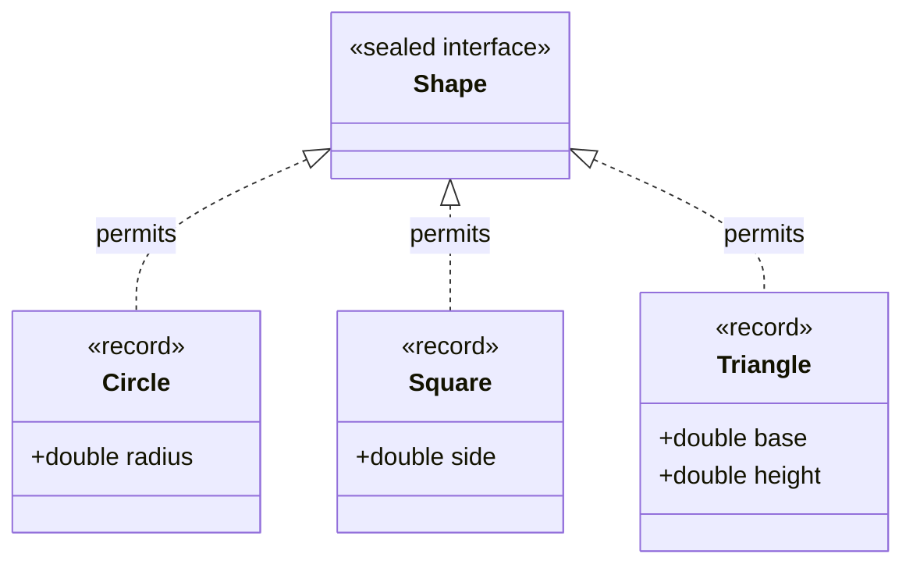
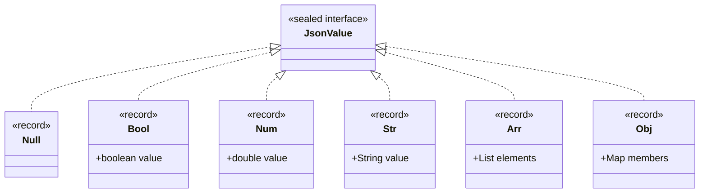
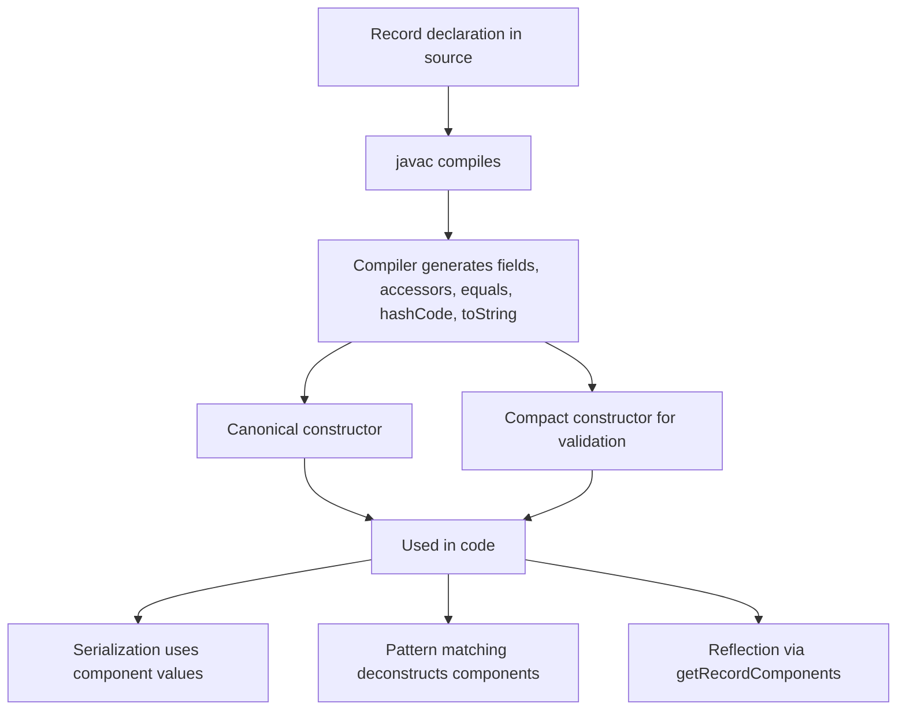

# Records and Sealed Classes

## Overview

Records and sealed classes are two of the most important additions to Java in the past decade. Records, finalized in Java 16, provide a concise syntax for declaring immutable data carriers. They generate the constructor, accessors, `equals`, `hashCode`, and `toString` for you, eliminating dozens of lines of boilerplate per class. Sealed classes, finalized in Java 17, let you restrict which classes can extend or implement a given type. Together, records and sealed classes enable a programming style called **algebraic data types**, common in functional languages like Haskell and Scala, where a closed hierarchy of immutable shapes models a domain precisely and the compiler can verify exhaustive handling in pattern matching.

This note covers the syntax and semantics of records, including compact constructors, custom accessors, validation, serialization, and integration with reflection. It then covers sealed classes and interfaces, the `permits` clause, the rules for sealed subtypes, and how sealed hierarchies interact with pattern matching switch in Java 21. We will also discuss when to prefer records over classes, the trade-offs of immutability, and how these features change the way we design domain models in modern Java.

## Background Knowledge

Before reading this note, make sure you understand:

- **Immutability**: An object whose state cannot change after construction.
- **Final classes and fields**: The building blocks of immutability.
- **`equals`, `hashCode`, and `toString`**: The `Object` methods that records generate for you.
- **Pattern matching**: Records integrate tightly with pattern matching, which we cover in a separate note.
- **Algebraic data types**: A sum type (sealed hierarchy) of product types (records) is the canonical way to model a closed domain in functional programming.

A short motivation. Before records, a typical data carrier in Java looked like this:

```java
public final class Point {
    private final int x;
    private final int y;

    public Point(int x, int y) {
        this.x = x;
        this.y = y;
    }

    public int getX() { return x; }
    public int getY() { return y; }

    @Override
    public boolean equals(Object o) {
        if (this == o) return true;
        if (!(o instanceof Point p)) return false;
        return x == p.x && y == p.y;
    }

    @Override
    public int hashCode() {
        return java.util.Objects.hash(x, y);
    }

    @Override
    public String toString() {
        return "Point[x=" + x + ", y=" + y + "]";
    }
}
```

This is roughly 30 lines for a class that holds two integers. With records, the same functionality becomes one line:

```java
public record Point(int x, int y) {}
```

## Records

A record is declared with the `record` keyword. The header lists the **components**, which are the fields of the record. The compiler generates:

- A private final field for each component.
- A canonical constructor whose parameters match the components.
- Accessor methods named after the components (e.g., `x()` and `y()`).
- `equals` and `hashCode` based on all components.
- `toString` in the form `RecordName[comp1=val1, comp2=val2]`.

Records are implicitly final and cannot be extended. They can, however, implement interfaces. They cannot extend other classes (because they already extend `java.lang.Record`).

### Compact Constructor

You can add a **compact constructor** to perform validation or normalization. The compact constructor does not declare a parameter list; the parameters are implicitly the components. You do not need to assign fields yourself; the compiler inserts the assignments at the end.

```java
public record Range(int start, int end) {

    // Compact constructor: no parameter list, no explicit field assignments.
    public Range {
        if (start > end) {
            throw new IllegalArgumentException("start must not exceed end");
        }
        // Optional normalization (e.g., clamp to 0).
        if (start < 0) start = 0;
    }
}
```

This is the preferred way to validate record state because the validation runs for any constructor that delegates to the canonical one.

### Custom Constructors

A record can declare additional constructors, but they must delegate to the canonical constructor on their first line. This guarantees that the compact constructor's validation always runs.

```java
public record Range(int start, int end) {

    public Range {
        if (start > end) {
            throw new IllegalArgumentException("start must not exceed end");
        }
    }

    // Convenience constructor that creates a single-point range.
    public Range(int point) {
        this(point, point);
    }
}
```

### Custom Accessors

You can override the auto-generated accessors. This is useful for returning defensive copies or computed values.

```java
public record Password(byte[] hash) {

    @Override
    public byte[] hash() {
        // Defensive copy to preserve immutability.
        return hash.clone();
    }
}
```

Note that accessor methods on records are not annotated `@Override` in the typical sense, but you can write `@Override` because they override the implicitly declared accessors.

### Static Members

Records can have static fields, static methods, and static factories. Static fields must be initialized; they cannot reference the components (which are instance state).

```java
public record Money(double amount, String currency) {

    private static final java.util.Set<String> KNOWN =
        java.util.Set.of("USD", "EUR", "GBP", "JPY");

    public Money {
        if (!KNOWN.contains(currency)) {
            throw new IllegalArgumentException("Unknown currency: " + currency);
        }
    }

    public static Money usd(double amount) {
        return new Money(amount, "USD");
    }

    public static Money eur(double amount) {
        return new Money(amount, "EUR");
    }
}
```

### Implementing Interfaces

Records can implement any interface. This is how you give records behavior beyond their components.

```java
public record Point(int x, int y) implements Comparable<Point> {

    @Override
    public int compareTo(Point other) {
        int cmp = Integer.compare(x, other.x);
        return cmp != 0 ? cmp : Integer.compare(y, other.y);
    }
}
```

### Serialization of Records

Records serialize very cleanly. The serialized form contains the component values, not the field layout. On deserialization, the canonical constructor is invoked, which means validation runs automatically. This is a major security improvement over traditional serialization, where `readObject` can leave an object in an inconsistent state.

```java
public record Token(String value, java.time.Instant expiresAt)
        implements java.io.Serializable { }
```

You cannot define `readObject` or `writeObject` on a record (they would not be called anyway). Custom serialization logic must live in a `writeReplace` or `readResolve` method, or in an external serializer.

### Reflection and Records

Reflection was extended to recognize records:

```java
Class<?> clazz = Point.class;
boolean isRecord = clazz.isRecord();
java.lang.reflect.RecordComponent[] comps = clazz.getRecordComponents();
for (var c : comps) {
    System.out.println(c.getName() + " : " + c.getType());
}
```

This is how frameworks like Jackson, Gson, and Spring bind JSON or query parameters to records: they enumerate the record components and use the canonical constructor.

## Sealed Classes

Sealed classes and interfaces, finalized in Java 17, let you declare a closed hierarchy. Only the classes listed in the `permits` clause may extend or implement a sealed type, and they must themselves be `final`, `sealed`, or `non-sealed`.

```java
public sealed interface Shape
    permits Circle, Square, Triangle {}

public record Circle(double radius) implements Shape {}
public record Square(double side) implements Shape {}
public record Triangle(double base, double height) implements Shape {}
```

A few rules:

- The `permits` clause lists direct subtypes.
- Each permitted subtype must be in the same module (or, in unnamed modules, the same package).
- Each permitted subtype must be `final` (cannot be extended further), `sealed` (extends the hierarchy), or `non-sealed` (reopens the hierarchy to anyone).
- If the subtypes are declared in the same source file, the `permits` clause may be omitted; the compiler infers them.

### Why Sealed Classes Matter

Before sealed classes, Java had two extremes: `final` classes (closed but not extensible at all) and open classes (anyone could extend). There was no way to express "I want exactly these three subclasses and no others." This mattered because:

- It lets the compiler verify exhaustive `switch` statements in pattern matching (Java 21).
- It documents intent: future readers know the hierarchy is closed.
- It enables safe polymorphic deserialization (you can switch on all variants without a default branch).
- It enables better optimization: the JIT can inline virtual calls when there are only a few possible targets.

### Sealed Interfaces vs Sealed Classes

Both work the same way, but interfaces are usually preferred because records can implement them (records cannot extend classes):

```java
public sealed interface Event permits LoginEvent, LogoutEvent, PurchaseEvent {}

public record LoginEvent(String userId, java.time.Instant at) implements Event {}
public record LogoutEvent(String userId, java.time.Instant at) implements Event {}
public record PurchaseEvent(String userId, double amount) implements Event {}
```

### Nested Sealed Hierarchies

Sealed types can nest:

```java
public sealed interface Tree<T> permits Tree.Leaf, Tree.Node {

    record Leaf<T>() implements Tree<T> {}
    record Node<T>(T value, Tree<T> left, Tree<T> right) implements Tree<T> {}
}
```

This models a binary tree cleanly. Note how the permits clause references `Tree.Leaf` and `Tree.Node`, which are themselves generic.

### non-sealed Subtypes

A `non-sealed` subtype reopens the hierarchy. Anyone can extend it.

```java
public sealed interface Vehicle
    permits Car, Truck, Motorcycle {}

public final record Car(int doors) implements Vehicle {}
public final record Truck(double cargoKg) implements Vehicle {}
public non-sealed class Motorcycle implements Vehicle {}  // Anyone may subclass.
```

Use `non-sealed` rarely; it removes the benefits of sealed types.

## Records and Sealed Classes Together: Algebraic Data Types

Combining records (product types) and sealed hierarchies (sum types) gives you algebraic data types, a powerful modeling tool from functional programming.

```java
public sealed interface JsonValue
    permits JsonValue.Null, JsonValue.Bool, JsonValue.Num, JsonValue.Str, JsonValue.Arr, JsonValue.Obj {

    record Null() implements JsonValue {}
    record Bool(boolean value) implements JsonValue {}
    record Num(double value) implements JsonValue {}
    record Str(String value) implements JsonValue {}
    record Arr(java.util.List<JsonValue> elements) implements JsonValue {}
    record Obj(java.util.Map<String, JsonValue> members) implements JsonValue {}
}

public static String toJson(JsonValue v) {
    return switch (v) {
        case JsonValue.Null n  -> "null";
        case JsonValue.Bool b  -> String.valueOf(b.value());
        case JsonValue.Num n   -> String.valueOf(n.value());
        case JsonValue.Str s   -> "\"" + s.value() + "\"";
        case JsonValue.Arr a   -> a.elements().stream()
                                       .map(Main::toJson)
                                       .collect(java.util.stream.Collectors.joining(",", "[", "]"));
        case JsonValue.Obj o   -> o.members().entrySet().stream()
                                       .map(e -> "\"" + e.getKey() + "\":" + toJson(e.getValue()))
                                       .collect(java.util.stream.Collectors.joining(",", "{", "}"));
    };
}
```

This is a fully exhaustive `switch` over a closed hierarchy. The compiler verifies that every permitted subtype is covered. If you add a new variant later (say, `Binary`), the compiler emits an error in every `switch` that does not handle it.

## Mermaid Diagram: Sealed Hierarchy of Shapes



## Mermaid Diagram: Algebraic Data Type



## Common Pitfalls

### Mutable Components

Records are not deeply immutable. If a component is an array or a mutable collection, external code can mutate the state.

```java
public record IntArray(int[] values) {}

int[] arr = {1, 2, 3};
IntArray r = new IntArray(arr);
arr[0] = 99;
System.out.println(r.values()[0]);   // 99 - state changed externally.
```

Always copy arrays or use `List.copyOf` to ensure immutability:

```java
public record IntArray(int[] values) {
    public IntArray { values = values.clone(); }
    public int[] values() { return values.clone(); }
}
```

### Validation in Non-Canonical Constructors

If you skip delegation, validation may be bypassed. Always delegate to the canonical constructor on the first line of any additional constructor.

### Forgetting `equals` Semantics

Records use all components for `equals` and `hashCode`. If you add a transient or derived field as a static cache, it does not affect equality. If you need a different equality contract, you must use a regular class.

### Overusing Records

Records are perfect for data carriers, value objects, DTOs, and event types. They are less suited for entities with mutable state, services with collaborators, or classes with rich behavior that does not fit the data-carrier mold.

### Sealed Hierarchy Across Modules

Subtypes of a sealed type must be in the same module (or the same package in an unnamed module). You cannot have a sealed type in module A permitting a subtype in module B.

### Pattern Matching Without Exhaustiveness

The compiler only verifies exhaustiveness if your sealed type has a known, closed set of subtypes in scope. Mixing reflection or deserialization can introduce surprises if you are not careful.

## Tips and Tricks

- Use records for DTOs, value objects, events, commands, and any data carrier.
- Use compact constructors for validation.
- Make defensive copies for mutable components like arrays.
- Use static factories for common construction patterns or to cache frequent instances.
- Use records with sealed interfaces to model closed domain hierarchies.
- Use pattern matching switch to dispatch on sealed hierarchies; the compiler checks exhaustiveness.
- Use `Class.isRecord()` and `getRecordComponents()` in frameworks to support records transparently.
- For serialization, prefer the canonical constructor to ensure validation runs.
- Do not extend records with rich business logic; keep them as pure data and put logic elsewhere (or in companion static methods).
- Use `non-sealed` only when you genuinely need to reopen the hierarchy; it discards the safety benefits.

## Interview Questions

**Q1. What is a record, and what does the compiler generate for you?**

A record is a final, immutable data carrier. The compiler generates a private final field per component, a canonical constructor, accessor methods, and `equals`, `hashCode`, and `toString` based on the components.

**Q2. Can a record be extended? Can it extend another class?**

No, records are implicitly final and cannot be extended. They also cannot extend a class because they already extend `java.lang.Record`. They can, however, implement interfaces.

**Q3. What is a compact constructor, and why use it?**

A compact constructor has no parameter list and no explicit field assignments. It is the natural place to perform validation or normalization because the compiler inserts the field assignments after it runs. The validation applies to any constructor that delegates to the canonical one.

**Q4. Are records deeply immutable?**

No. Records are shallowly immutable: the fields cannot be reassigned, but if a component is a mutable object (such as an array or a mutable list), the contents can change. Make defensive copies in such cases.

**Q5. What is a sealed class, and what is the `permits` clause?**

A sealed class or interface restricts which types may extend or implement it. The `permits` clause lists the direct subtypes, which must be `final`, `sealed`, or `non-sealed`, and must be in the same module (or same package in unnamed modules).

**Q6. What are the differences between `final`, `sealed`, and `non-sealed` subtypes?**

A `final` subtype cannot be extended further. A `sealed` subtype continues the closed hierarchy with its own `permits` list. A `non-sealed` subtype reopens the hierarchy, allowing anyone to extend it.

**Q7. How do sealed types enable exhaustive pattern matching?**

Because the set of subtypes is closed and known at compile time, the compiler can verify that a `switch` covers every case. If a new subtype is added, every non-exhaustive `switch` produces a compile error.

**Q8. How does record serialization differ from regular class serialization?**

Records serialize their component values, not their field layout. On deserialization, the canonical constructor is invoked, which means validation runs. You cannot define `readObject`/`writeObject` on a record; custom logic must use `writeReplace`/`readResolve`.

**Q9. How do you reflectively discover record components?**

`Class.isRecord()` returns true for records, and `Class.getRecordComponents()` returns an array of `RecordComponent` objects with name, type, accessor, and annotations.

**Q10. When should you not use records?**

Avoid records for mutable entities (such as JPA `@Entity` classes that change over their lifetime), classes with rich behavior that does not fit the data-carrier pattern, or types that need a custom equality contract. Use a regular class instead.

## Record Design Patterns

Records enable several design patterns that were previously verbose to express in Java.

### Pattern 1: Value Object

A value object represents a domain concept by its value rather than by identity. Two value objects with the same components are equal. Records are perfect for this:

```java
public record Money(java.math.BigDecimal amount, String currency) {
    public Money {
        java.util.Objects.requireNonNull(amount);
        java.util.Objects.requireNonNull(currency);
        if (amount.signum() < 0) {
            throw new IllegalArgumentException("Money cannot be negative");
        }
    }

    public Money plus(Money other) {
        requireSameCurrency(other);
        return new Money(amount.add(other.amount), currency);
    }

    public Money minus(Money other) {
        requireSameCurrency(other);
        return new Money(amount.subtract(other.amount), currency);
    }

    private void requireSameCurrency(Money other) {
        if (!currency.equals(other.currency)) {
            throw new IllegalArgumentException("Currency mismatch");
        }
    }
}
```

### Pattern 2: Tuple

Records make excellent lightweight tuples. The standard library even includes `Map.Entry` as a record-like type. You can create your own pair or triple:

```java
public record Pair<A, B>(A first, B second) {}
public record Triple<A, B, C>(A first, B second, C third) {}
```

### Pattern 3: Command

Commands are immutable descriptions of an action. They fit naturally as records:

```java
public sealed interface Command permits CreateOrder, CancelOrder, RefundOrder {}
public record CreateOrder(String orderId, java.util.List<String> itemIds, String customerId) implements Command {}
public record CancelOrder(String orderId, String reason) implements Command {}
public record RefundOrder(String orderId, java.math.BigDecimal amount) implements Command {}
```

### Pattern 4: Event

Events are immutable facts about something that happened. Records combined with sealed interfaces give you a clean event hierarchy:

```java
public sealed interface AccountEvent permits AccountOpened, DepositMade, WithdrawalMade, AccountClosed {}
public record AccountOpened(String accountId, String ownerId, java.time.Instant at) implements AccountEvent {}
public record DepositMade(String accountId, java.math.BigDecimal amount, java.time.Instant at) implements AccountEvent {}
public record WithdrawalMade(String accountId, java.math.BigDecimal amount, java.time.Instant at) implements AccountEvent {}
public record AccountClosed(String accountId, java.time.Instant at) implements AccountEvent {}
```

### Pattern 5: Builder for Records

For records with many components, a builder pattern improves readability:

```java
public record Order(String id, String customerId, java.util.List<LineItem> items, java.math.BigDecimal total) {

    public static Builder builder() { return new Builder(); }

    public static class Builder {
        private String id;
        private String customerId;
        private java.util.List<LineItem> items = new java.util.ArrayList<>();
        private java.math.BigDecimal total = java.math.BigDecimal.ZERO;

        public Builder id(String id) { this.id = id; return this; }
        public Builder customerId(String customerId) { this.customerId = customerId; return this; }
        public Builder addItem(LineItem item) {
            this.items.add(item);
            this.total = total.add(item.price());
            return this;
        }
        public Order build() {
            return new Order(id, customerId, java.util.List.copyOf(items), total);
        }
    }
}
```

## Migrating to Records

If you have an existing class that looks like a record (final, immutable fields, mostly boilerplate), migration is straightforward:

1. Identify fields that should become components.
2. Convert the class to a record.
3. Move constructor validation to a compact constructor.
4. Replace `getX()` calls with `x()` accessor calls. This is the most invasive part of migration.
5. Update reflection-based code that depended on field names.
6. Test thoroughly, especially serialization round trips.

For backward compatibility, you can add `getX()` methods that delegate to `x()`:

```java
public record Point(int x, int y) {
    // Backward-compatible accessors.
    public int getX() { return x(); }
    public int getY() { return y(); }
}
```

## Records and Lombok

Lombok's `@Value` annotation produces a class very similar to a record: immutable, with `equals`, `hashCode`, `toString`, and accessor methods. The difference is that Lombok uses `getX()` naming while records use `x()` naming, and Lombok classes are still regular classes that can be extended (well, they are final too, but the syntax is different).

If you are already using Lombok, you may wonder whether to switch to records. The answer is: yes for pure data carriers, no for classes that need mutable state, inheritance, or rich behavior. Records are a language feature, so they integrate better with pattern matching, reflection, and serialization than Lombok-generated classes.

## Sealed Hierarchies and Domain Modeling

Sealed types shine when you model a domain with a closed set of variants. Examples include:

- **HTTP methods**: GET, POST, PUT, DELETE, PATCH, HEAD, OPTIONS.
- **Tree nodes**: leaf, branch, empty.
- **AST nodes**: literal, variable, binary op, function call.
- **Domain events**: created, updated, deleted.
- **Result types**: success, failure, partial.
- **Payment methods**: credit card, paypal, bank transfer.

Without sealed types, you would use `abstract class` or `interface` with a comment saying "do not extend outside this package." The compiler cannot enforce that. Sealed types make the restriction a first-class language feature.

## Performance Characteristics of Records

Records have the same performance as regular final classes with final fields. There is no overhead for using a record versus a hand-written equivalent class. The compiler-generated `equals` and `hashCode` are equivalent to what you would write by hand. `toString` produces a slightly more verbose string than a custom one might, but it is convenient and consistent.

Records also benefit from being recognizable by the JIT. The JVM can sometimes devirtualize calls on records more aggressively because the type is final.

## Mermaid Diagram: Record Lifecycle



## Records and Immutability Best Practices

Records are immutable by default, but immutability has subtleties. To make a record truly immutable, follow these rules:

1. **All components should be immutable themselves.** If a component is a mutable type (array, `List`, `Map`), make a defensive copy in the compact constructor and return a copy from the accessor.

2. **Use `List.copyOf`, `Set.copyOf`, and `Map.copyOf` to wrap collections.** These return unmodifiable snapshots.

3. **For arrays, clone in the constructor and accessor.** This prevents external code from mutating the underlying data.

4. **Avoid holding references to mutable external state.** If a record's component is a reference to a mutable object owned by external code, the record is not effectively immutable.

5. **Prefer primitive types over boxed primitives** when possible, because primitives are inherently immutable.

Here is a record that is truly immutable:

```java
public record ImmutablePerson(String name, java.time.LocalDate birthDate,
                              java.util.List<String> hobbies) {

    public ImmutablePerson {
        java.util.Objects.requireNonNull(name);
        java.util.Objects.requireNonNull(birthDate);
        hobbies = java.util.List.copyOf(hobbies);  // Defensive copy.
    }
}
```

## Sealed Hierarchies and Pattern Matching Together

Sealed hierarchies become especially powerful when combined with pattern matching switch. Here is a complete example of an evaluator for a small expression language:

```java
public sealed interface Expr
    permits Expr.Num, Expr.Add, Expr.Mul, Expr.Neg {}

public record Num(double value) implements Expr {}
public record Add(Expr left, Expr right) implements Expr {}
public record Mul(Expr left, Expr right) implements Expr {}
public record Neg(Expr operand) implements Expr {}

public static double eval(Expr e) {
    return switch (e) {
        case Num(double v) -> v;
        case Add(Expr l, Expr r) -> eval(l) + eval(r);
        case Mul(Expr l, Expr r) -> eval(l) * eval(r);
        case Neg(Expr o) -> -eval(o);
    };
}

public static String toInfix(Expr e) {
    return switch (e) {
        case Num(double v) -> Double.toString(v);
        case Add(Expr l, Expr r) -> "(" + toInfix(l) + " + " + toInfix(r) + ")";
        case Mul(Expr l, Expr r) -> "(" + toInfix(l) + " * " + toInfix(r) + ")";
        case Neg(Expr o) -> "-(" + toInfix(o) + ")";
    };
}
```

Adding a new operator (say, `Div`) requires updating both `eval` and `toInfix`. The compiler enforces this. Without sealed types and pattern matching, you would likely forget to update one of the methods.

## Migrating From Lombok to Records

If your codebase uses Lombok's `@Value` or `@Data` (with `final` fields), you may want to migrate to records. The benefits are:

- Records are a language feature; no annotation processor required.
- Records integrate with pattern matching, reflection, and serialization.
- Records have a cleaner accessor naming convention (`x()` instead of `getX()`).
- Records are recognized by Jackson, Gson, Spring, and other frameworks out of the box.

The migration steps:

1. Identify candidate classes (final, all fields final, no behavior beyond accessors).
2. Convert each to a record.
3. Update callers to use the new accessor style.
4. Add backward-compatible `getX()` methods if external code depends on them.
5. Test serialization round trips, especially if the class was `Serializable`.

## Records in Stream Pipelines

Records are well suited for use as intermediate types in stream pipelines because they are immutable, type safe, and easy to construct:

```java
public record SalesSummary(String product, long count, java.math.BigDecimal total) {}

java.util.List<SalesSummary> summaries = sales.stream()
    .collect(java.util.stream.Collectors.groupingBy(
        Sale::product,
        java.util.stream.Collectors.collectingAndThen(
            java.util.stream.Collectors.toList(),
            list -> new SalesSummary(
                list.get(0).product(),
                list.size(),
                list.stream().map(Sale::amount)
                     .reduce(java.math.BigDecimal.ZERO, java.math.BigDecimal::add)
            )
        )
    ))
    .values().stream().toList();
```

Records make the intermediate type explicit and self-documenting. Without records, you would need a custom class or a generic `Pair`/`Tuple` type.

## Summary

Records and sealed classes bring algebraic data type modeling to Java. Records eliminate boilerplate for immutable data carriers while ensuring correct `equals`, `hashCode`, and `toString`. Sealed classes close inheritance hierarchies, enabling exhaustive pattern matching and safer domain modeling. Together they reshape how Java developers design value objects, events, and domain hierarchies. By combining records for product types with sealed interfaces for sum types, you can write code that is concise, correct, and compiler-verified, with far less boilerplate than idiomatic Java 8.
