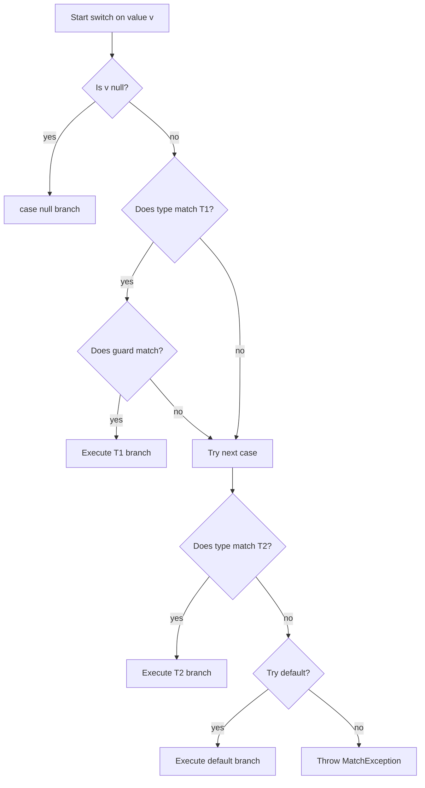
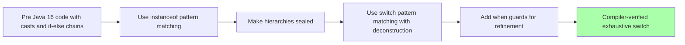

# Pattern Matching and Text Blocks

## Overview

Pattern matching and text blocks are two modern Java features that significantly reduce boilerplate and improve expressiveness. Pattern matching for `instanceof` was finalized in Java 16, records and sealed classes were finalized in Java 16 and 17 respectively, and pattern matching for `switch` was finalized in Java 21. Text blocks, finalized in Java 15, finally gave Java a clean multiline string syntax comparable to those in Python, Kotlin, and Scala.

This note covers both features in depth. For pattern matching we will explore type patterns, the flow-sensitive scoping that lets you use the bound variable safely, the new switch expression with case labels, deconstruction patterns for records, guarded patterns with `when`, exhaustiveness checking with sealed types, and the difference between preview and final semantics. For text blocks we will cover the syntax, incidental whitespace stripping rules, escape sequences including `\s` and `\` line continuation, formatted strings, and best practices for embedding code snippets (SQL, JSON, HTML) in Java sources.

## Background Knowledge

Before reading this note, you should be comfortable with:

- **`instanceof` checks and explicit casts**: The traditional pattern that pattern matching replaces.
- **Switch statements and switch expressions (Java 14+)**: The arrow form `case X -> ...` and the yield of values.
- **Records**: Pattern matching deconstructs records into their components.
- **Sealed classes**: The compiler uses sealed hierarchies to verify exhaustiveness.
- **String literals and escape sequences**: `\n`, `\t`, `\\`, `\"`, etc.

A short motivation. Consider this pre-Java-16 code:

```java
Object obj = "Hello";
if (obj instanceof String) {
    String s = (String) obj;
    System.out.println(s.length());
}
```

There is a redundant cast: we already know `obj` is a `String`, but the compiler still requires us to declare it again. Pattern matching for `instanceof` collapses this into one step:

```java
if (obj instanceof String s) {
    System.out.println(s.length());
}
```

Similarly, traditional `switch` over an object required an `if-else` chain with casts. Pattern matching switch turns a 20-line `if-else` chain into a 5-line `switch`.

## Pattern Matching for instanceof

The type pattern `T variable` binds `variable` to the matched value when the runtime type matches `T`. The variable is in scope only where the match is guaranteed.

```java
Object obj = Math.random() > 0.5 ? "hello" : Integer.valueOf(42);

if (obj instanceof String s) {
    // s is in scope here, and the compiler KNOWS it is a String.
    System.out.println(s.toUpperCase());
} else if (obj instanceof Integer i) {
    System.out.println(i.doubleValue());
}
```

### Flow-Sensitive Scoping

The bound variable is in scope only where the pattern is guaranteed to match. This includes the `if` block, the condition of the `if` (after the `instanceof`), and any conjunction after the `instanceof`:

```java
if (obj instanceof String s && s.length() > 5) {
    // s is in scope here, AND in the second part of the conjunction.
    System.out.println(s);
}

if (!(obj instanceof String s)) {
    // s is NOT in scope here: the pattern did not match.
    return;
}
// s IS in scope here: the early return guarantees a match.
System.out.println(s.toUpperCase());
```

The compiler performs flow analysis to determine where the binding is definitely true. This is the most powerful aspect of pattern matching: it eliminates casts while remaining statically type safe.

### Combining with `&&` and `||`

The `&&` operator preserves the binding in the right-hand side:

```java
if (obj instanceof String s && s.startsWith("Hello")) {
    System.out.println("Greeting: " + s);
}
```

The `||` operator does NOT preserve the binding, because either side may have failed:

```java
if (obj instanceof String s || obj instanceof Integer i) {
    // Neither s nor i is in scope here.
}
```

## Pattern Matching for Switch (Java 21)

Java 21 finalized pattern matching for `switch`. A `case` label can be a type pattern, a record deconstruction pattern, or even a guarded pattern.

### Type Patterns in Switch

```java
public static String describe(Object obj) {
    return switch (obj) {
        case null      -> "null";
        case Integer i -> "integer " + i;
        case String s  -> "string of length " + s.length();
        case double[] arr -> "array of " + arr.length + " doubles";
        default        -> "something else";
    };
}
```

Several improvements over traditional switch:

- You can switch over any object, not just primitives, strings, and enums.
- A `case null` is allowed; previously `switch` threw `NullPointerException` on null.
- No fall-through means no missing `break` bugs.
- The compiler can verify exhaustiveness for sealed hierarchies.

### Record Deconstruction Patterns

You can deconstruct a record into its components directly in the case label:

```java
public sealed interface Shape permits Circle, Square, Triangle {}
public record Circle(double radius) implements Shape {}
public record Square(double side) implements Shape {}
public record Triangle(double base, double height) implements Shape {}

public static double area(Shape shape) {
    return switch (shape) {
        case Circle(double r)         -> Math.PI * r * r;
        case Square(double s)         -> s * s;
        case Triangle(double b, double h) -> 0.5 * b * h;
    };
}
```

The pattern `Circle(double r)` matches a `Circle` and binds its `radius` component to `r`. You can also use `case Circle c` for type-only matching, or `case Circle(double r) when r > 10` for a guarded pattern.

### Nested Patterns

Patterns can nest arbitrarily:

```java
public record Box(Shape shape) {}

public static String describe(Box box) {
    return switch (box) {
        case Box(Circle(double r)) -> "Boxed circle, radius " + r;
        case Box(Square(double s)) -> "Boxed square, side " + s;
        case Box(Triangle(double b, double h)) -> "Boxed triangle, " + b + "x" + h;
    };
}
```

### Guarded Patterns with `when`

A guarded pattern refines a match with a boolean condition using the `when` keyword:

```java
public static String classify(int n) {
    return switch (n) {
        case int i when i < 0            -> "negative";
        case int i when i == 0           -> "zero";
        case int i when i < 100          -> "small positive";
        default                           -> "large positive";
    };
}
```

Guards are evaluated left to right after the pattern matches. If a guard fails, the next case is tried.

### Exhaustiveness

For sealed hierarchies, the compiler verifies that all subtypes are covered. If you omit one, you get a compile error:

```java
public static String describe(Shape s) {
    return switch (s) {
        case Circle c -> "circle";
        case Square s2 -> "square";
        // Compile error: Triangle not covered.
    };
}
```

This is one of the biggest wins of sealed types plus pattern matching: adding a new variant forces every switch to be updated.

### Parenthesized Patterns

You can parenthesize a pattern to control the precedence of `&&` and `||`:

```java
case (String s && (s.length() > 5)) -> ...;
```

This is rarely needed but occasionally clarifies complex patterns.

### Default vs Total Patterns

A `default` branch matches anything else. A type pattern with the type `Object` (such as `case Object o ->`) is called a total pattern and is treated like a default for exhaustiveness purposes, but it also binds the value to a variable.

## Mermaid Diagram: Pattern Matching Decision Tree



## Text Blocks

A text block is a multiline string literal introduced in Java 15. It begins with three double quotes `"""` followed by a line break and ends with three double quotes. Text blocks make it easy to embed JSON, SQL, HTML, and other structured text in Java code.

```java
String json = """
        {
            "name": "Alice",
            "age": 30,
            "active": true
        }
        """;
```

### Incidental Whitespace Stripping

Text blocks strip incidental whitespace. The compiler determines the minimum indentation across all non-blank lines (after the opening `"""` line) and removes that amount from every line. This lets you indent the entire block to match the surrounding code without affecting the resulting string.

```java
String s = """
            Hello
            World
            """;
// Result: "Hello\nWorld\n" (no leading spaces).
```

If you need to preserve leading whitespace, use the `\s` escape (which is a single space that is not stripped) at the end of a line, or indent the entire block further than the minimum.

### Trailing Whitespace

Trailing whitespace on each line is stripped. Use `\s` at the end of a line to preserve a trailing space.

### Line Continuation with Backslash

A backslash at the end of a line joins that line with the next, suppressing the newline:

```java
String s = """
        Hello \
        World
        """;
// Result: "Hello World\n"
```

### Escape Sequences

Text blocks support all the escape sequences of regular string literals (`\n`, `\t`, `\\`, `\"`, `\uXXXX`) plus two new ones:

- `\s`: a single space that is preserved during incidental whitespace stripping.
- `\<newline>`: line continuation, suppresses the newline.

### formatted Method

The `String.formatted` method (Java 15+) is the cleanest way to interpolate values into a text block:

```java
String sql = """
        SELECT id, name, email
        FROM users
        WHERE active = %s
        ORDER BY name
        """.formatted(true);
```

For SQL injection safety, however, you should still use prepared statements with bind parameters in production code.

### Embedding Source Code

Text blocks are great for embedding source code of other languages:

```java
String script = """
        function greet(name) {
            return "Hello, " + name + "!";
        }
        console.log(greet("World"));
        """;
```

### Comparing String Concatenation Strategies

Before text blocks, multiline strings required either `+` concatenation or `String.join`:

```java
// Old style - hard to read.
String json = "{\n" +
              "  \"name\": \"Alice\",\n" +
              "  \"age\": 30\n" +
              "}";

// New style - clean and readable.
String json = """
        {
            "name": "Alice",
            "age": 30
        }
        """;
```

### Indenting and Stripping

`String.indent(int n)` adds (positive) or removes (negative) indentation. `String.stripIndent()` removes incidental whitespace. `String.translateEscapes()` interprets escape sequences in a string that was built dynamically.

## Common Pitfalls

### Forgetting the Newline After Opening Quotes

```java
String s = """Hello""";   // Compile error: text block must start with newline.
```

The opening `"""` must be followed by a line break. Everything on the same line as the opening `"""` is a syntax error.

### Trailing Newline

Text blocks always end with a newline (unless you use a line continuation immediately before the closing `"""`). If you do not want the trailing newline, use `stripIndent` and `stripTrailing`, or restructure:

```java
String s = """
        Hello
        World""".stripIndent();
// Result: "Hello\nWorld"
```

### Surprising Whitespace Stripping

If you mix tabs and spaces, the indentation comparison is character by character, which can lead to surprising results. Stick to a single style (preferably spaces) within a text block.

### Guarded Pattern Pitfalls

The condition after `when` runs at runtime, not compile time. If it throws, you get an exception in the switch. Keep guards simple and side-effect free.

### Non-Exhaustive Switch

Even with sealed types, if you do not cover all cases AND there is no default, the JVM throws `MatchException` at runtime. The compiler usually warns you, but ignoring the warning means runtime risk.

### Pattern Variable Shadowing

The bound variable from a pattern can shadow an outer variable. Be careful with naming to avoid confusion.

## Tips and Tricks

- Use `instanceof T t` everywhere you previously did an `instanceof` followed by a cast.
- Use flow-sensitive scoping to combine pattern matching with early returns for very clean code.
- Use record deconstruction in switch to flatten data flow.
- Use `when` guards to refine cases without nested if statements.
- Use sealed hierarchies to enable exhaustive switch and get compile-time safety.
- Use text blocks for any string longer than one line; the readability gain is enormous.
- Prefer `String.formatted` over manual concatenation for interpolation.
- For SQL, use text blocks for the query string but still use bind parameters for safety.
- For JSON, use text blocks for static examples in tests, but use a real JSON library for production parsing.
- Use `stripIndent` and `translateEscapes` when handling dynamically built text.

## Interview Questions

**Q1. What is pattern matching for instanceof?**

A feature (Java 16) that combines an instanceof check with variable binding. `if (obj instanceof String s)` both tests the type and binds `s` to the value, with the compiler performing flow analysis to determine where `s` is definitely in scope.

**Q2. What is flow-sensitive scoping?**

The compiler tracks where a pattern variable is definitely assigned. It is in scope in the then-branch of an `if`, in conjunctions after the instanceof, and after a `return` in the else-branch. It is not in scope in disjunctions or where the match might have failed.

**Q3. How does pattern matching switch differ from traditional switch?**

It can switch over any object, supports type patterns, record deconstruction, guarded patterns with `when`, and null cases. It also verifies exhaustiveness for sealed hierarchies.

**Q4. What is a guarded pattern?**

A pattern followed by `when <boolean>`. The boolean is evaluated at runtime after the pattern matches. If it is false, the case is skipped.

**Q5. How does record deconstruction work in switch?**

A case like `case Circle(double r)` matches a `Circle` instance and binds `r` to its `radius` component. Nested patterns can deconstruct arbitrarily deep.

**Q6. What is exhaustiveness checking?**

The compiler verifies that a switch over a sealed type covers every permitted subtype (or has a default). If you add a new subtype, every existing switch becomes a compile error until you handle the new case.

**Q7. What happens if a switch is not exhaustive at runtime?**

The JVM throws `MatchException`. The compiler usually warns or errors at compile time, but ignoring those messages leads to runtime failure.

**Q8. What is a text block, and how is it delimited?**

A multiline string literal introduced in Java 15. It starts with `"""` followed by a line break and ends with `"""`. The compiler strips incidental whitespace.

**Q9. How is incidental whitespace determined?**

The compiler finds the minimum indentation across all non-blank lines and removes that amount from every line. Trailing whitespace is also stripped.

**Q10. What are the new escape sequences in text blocks?**

`\s` represents a single space that is preserved during stripping, and `\<newline>` joins two lines, suppressing the newline between them.

**Q11. How do you interpolate values into a text block?**

Use `String.formatted` (Java 15+) with `%s`, `%d`, etc. For SQL or other injection-prone contexts, prefer parameterized APIs instead of string interpolation.

## Pattern Matching in Collections and Algorithms

Pattern matching shines when combined with the Collections Framework and stream pipelines. Here is an example that processes a heterogeneous list of shapes:

```java
public sealed interface Shape permits Circle, Rectangle, Triangle {}
public record Circle(double radius) implements Shape {}
public record Rectangle(double width, double height) implements Shape {}
public record Triangle(double a, double b, double c) implements Shape {}

public static double totalArea(java.util.List<Shape> shapes) {
    return shapes.stream()
        .mapToDouble(s -> switch (s) {
            case Circle(double r) -> Math.PI * r * r;
            case Rectangle(double w, double h) -> w * h;
            case Triangle(double a, double b, double c) -> {
                double s = (a + b + c) / 2;
                yield Math.sqrt(s * (s - a) * (s - b) * (s - c));
            }
        })
        .sum();
}
```

The switch is exhaustive because `Shape` is sealed. Adding a new variant (say, `Square`) forces every switch to be updated.

## Type Patterns in Detail

A type pattern `T variable` matches if the value is an instance of `T` at runtime. The bound variable has type `T` and is in scope wherever the match is guaranteed:

```java
Object value = ...;
String result = switch (value) {
    case String s when s.isEmpty() -> "empty string";
    case String s                   -> "string: " + s;
    case Integer i when i < 0       -> "negative integer";
    case Integer i                  -> "non-negative integer: " + i;
    case double[] arr               -> "double array of length " + arr.length;
    case null                       -> "null";
    default                         -> "other: " + value;
};
```

Notice how the same type `String` can appear in multiple cases with different guards. The first matching case wins, so order matters when guards overlap.

## Combining instanceof and Pattern Matching

Before pattern matching, complex type dispatch looked like:

```java
public static String describe(Object obj) {
    if (obj instanceof String) {
        String s = (String) obj;
        if (s.isEmpty()) return "empty";
        return "string of length " + s.length();
    } else if (obj instanceof Integer) {
        Integer i = (Integer) obj;
        return "integer: " + i;
    } else if (obj == null) {
        return "null";
    } else {
        return "other";
    }
}
```

With pattern matching for instanceof, this becomes:

```java
public static String describe(Object obj) {
    if (obj instanceof String s && s.isEmpty()) return "empty";
    if (obj instanceof String s) return "string of length " + s.length();
    if (obj instanceof Integer i) return "integer: " + i;
    if (obj == null) return "null";
    return "other";
}
```

Or, with switch pattern matching, even more concisely:

```java
public static String describe(Object obj) {
    return switch (obj) {
        case String s when s.isEmpty() -> "empty";
        case String s -> "string of length " + s.length();
        case Integer i -> "integer: " + i;
        case null -> "null";
        default -> "other";
    };
}
```

## Text Block Templates and Advanced Usage

Text blocks are not just for static strings. They are powerful templates for code generation, configuration files, and reports:

```java
public static String generateHtml(String title, java.util.List<String> items) {
    String body = items.stream()
        .map(item -> "        <li>" + item + "</li>")
        .collect(java.util.stream.Collectors.joining("\n"));
    return """
            <!DOCTYPE html>
            <html>
            <head>
                <title>%s</title>
            </head>
            <body>
                <h1>%s</h1>
                <ul>
            %s
                </ul>
            </body>
            </html>
            """.formatted(title, title, body);
}
```

For SQL queries, text blocks make multi-line queries readable:

```java
String sql = """
        SELECT u.id, u.name, COUNT(o.id) AS ordercount
        FROM users u
        LEFT JOIN orders o ON o.userid = u.id
        WHERE u.createdat >= ?
          AND u.status = ?
        GROUP BY u.id, u.name
        HAVING COUNT(o.id) > ?
        ORDER BY ordercount DESC
        LIMIT 100
        """;

try (var stmt = connection.prepareStatement(sql)) {
    stmt.setTimestamp(1, java.sql.Timestamp.from(since));
    stmt.setString(2, "ACTIVE");
    stmt.setInt(3, minOrders);
    try (var rs = stmt.executeQuery()) {
        while (rs.next()) { ... }
    }
}
```

For JSON templates in tests:

```java
String expectedJson = """
        {
          "id": 42,
          "name": "Alice",
          "roles": ["admin", "user"]
        }
        """;
```

For YAML configuration:

```java
String yaml = """
        server:
          port: 8080
          ssl:
            enabled: true
            keystore: classpath:keystore.p12
        logging:
          level:
            root: INFO
            com.example: DEBUG
        """;
```

## Real-World Refactoring Example

Consider this pre-Java-16 visitor implementation:

```java
public static String process(Tree tree) {
    if (tree instanceof Leaf) {
        Leaf leaf = (Leaf) tree;
        return "leaf: " + leaf.value();
    } else if (tree instanceof Node) {
        Node node = (Node) tree;
        return "node: " + process(node.left()) + ", " + process(node.right());
    } else {
        throw new IllegalArgumentException("Unknown tree: " + tree);
    }
}
```

With sealed types and pattern matching:

```java
public sealed interface Tree permits Tree.Leaf, Tree.Node {}
public record Leaf(String value) implements Tree {}
public record Node(Tree left, Tree right) implements Tree {}

public static String process(Tree tree) {
    return switch (tree) {
        case Leaf(String v) -> "leaf: " + v;
        case Node(Tree l, Tree r) -> "node: " + process(l) + ", " + process(r);
    };
}
```

The compiler guarantees exhaustiveness, so there is no need for a default branch.

## Tips for Combining Pattern Matching and Text Blocks

- Use sealed types wherever you have a closed set of variants; this enables exhaustive switch.
- Use record deconstruction to extract components directly in case labels.
- Use `when` guards to refine matches without nested if statements.
- Use text blocks for any string longer than one line.
- Use `String.formatted` for interpolation; never concatenate multiline strings manually.
- For SQL, always use prepared statements with bind parameters even when the query is a text block.
- For HTML templates in production code, use a proper templating engine; text blocks are best for tests and small snippets.
- For YAML and JSON in production code, use a proper parser; text blocks are best for documentation and tests.

## Mermaid Diagram: Pattern Matching Refactor Path



## Pattern Matching for Switch Semantics

The semantics of pattern matching switch are important to understand precisely:

1. **Case labels are evaluated in declaration order.** The first matching case wins.
2. **A `case` with a guarded pattern matches only if both the pattern and the guard succeed.**
3. **If a guard fails, the next case is tried, not the same case without the guard.**
4. **A `case null` matches only the null value.** Without it, a switch over a null value throws `NullPointerException`.
5. **Exhaustiveness is checked for sealed hierarchies.** If the compiler can prove all subtypes are covered, no `default` is needed.
6. **A `default` branch matches anything not matched by earlier cases.**
7. **If no case matches and there is no default, the JVM throws `MatchException`.**

These rules make pattern matching switch very different from traditional switch. The most important practical implication is ordering: put more specific cases (with guards) before less specific ones.

## Type Patterns and Polymorphism

Type patterns interact subtly with polymorphism. Consider:

```java
sealed interface Animal permits Dog, Cat {}
record Dog(String name) implements Animal {}
record Cat(String name) implements Animal {}

Animal pet = new Dog("Rex");
String result = switch (pet) {
    case Dog(String n) -> "Dog named " + n;
    case Cat(String n) -> "Cat named " + n;
};
```

The compiler knows `pet` is either a `Dog` or a `Cat` because `Animal` is sealed. The switch is exhaustive without a default. If you add a new variant (`Bird`), the switch becomes a compile error.

## Pattern Matching with Null

Traditional `switch` throws `NullPointerException` when the selector is null. Pattern matching switch lets you handle null explicitly:

```java
String describe(Object obj) {
    return switch (obj) {
        case null -> "null";
        case String s -> "string";
        default -> "other";
    };
}
```

Without `case null`, the switch still throws NPE on null input. This preserves backward compatibility with the traditional behavior while giving you the option to handle null gracefully.

## Text Block Whitespace Rules in Depth

The exact rules for incidental whitespace stripping are:

1. Split the content into lines, with line terminators removed.
2. Determine the minimum indentation across all non-blank lines.
3. Remove that minimum indentation from every line.
4. Strip trailing whitespace from each line.
5. Remove blank leading and trailing lines, but keep one trailing newline if the closing `"""` is on its own line.

Example:

```java
String s = """
        Hello
          World
        """;
// Result: "Hello\n  World\n"
// Minimum indentation is 8 spaces, removed from each line.
// "  World" preserves its internal indentation.
```

If you want no trailing newline, place the closing `"""` immediately after the last content:

```java
String s = """
        Hello
        World""";
// Result: "Hello\nWorld"
```

If you need to preserve leading whitespace that would otherwise be stripped, use `\s` at the start of each affected line, or indent the entire block deeper than the surrounding code.

## Text Blocks and Escape Sequences

In addition to standard escape sequences, text blocks support:

- `\<newline>`: line continuation. Joins two lines without a newline.
- `\s`: a single space that is preserved during whitespace stripping.

Example showing both:

```java
String s = """
        Line 1 \
        continues on same line
        Line 3 with trailing space.\s
        """;
// Result: "Line 1 continues on same line\nLine 3 with trailing space. \n"
```

The `\s` ensures the trailing space before the newline is preserved.

## Common Refactoring Patterns

Modern Java developers routinely refactor from verbose patterns to pattern matching and text blocks:

- Replace `instanceof + cast` with `instanceof T t`.
- Replace `if-else` chains on type with `switch` pattern matching.
- Replace `+`-concatenated multiline strings with text blocks.
- Replace `String.format` calls with `formatted` calls on text blocks.
- Replace sealed hierarchies with manual visitor patterns where applicable.

Each refactor reduces code size, improves readability, and catches more bugs at compile time.

## Summary

Pattern matching and text blocks are two of the most impactful additions to modern Java. Pattern matching for `instanceof` eliminates redundant casts with flow-sensitive scoping. Pattern matching for `switch` (Java 21) lets you dispatch on type, deconstruct records, add guards, and verify exhaustiveness on sealed hierarchies. Text blocks (Java 15) bring clean multiline string literals to Java with predictable whitespace handling and helpful escape sequences. Together they reduce boilerplate, eliminate common bugs, and bring Java closer to the expressiveness of more modern languages without sacrificing static type safety.
