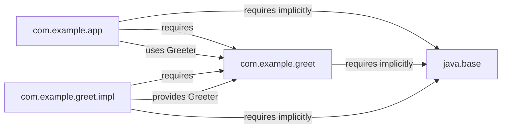
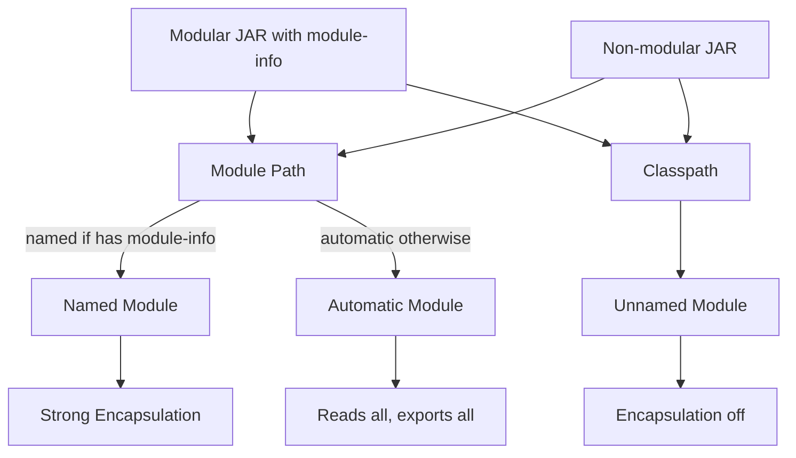
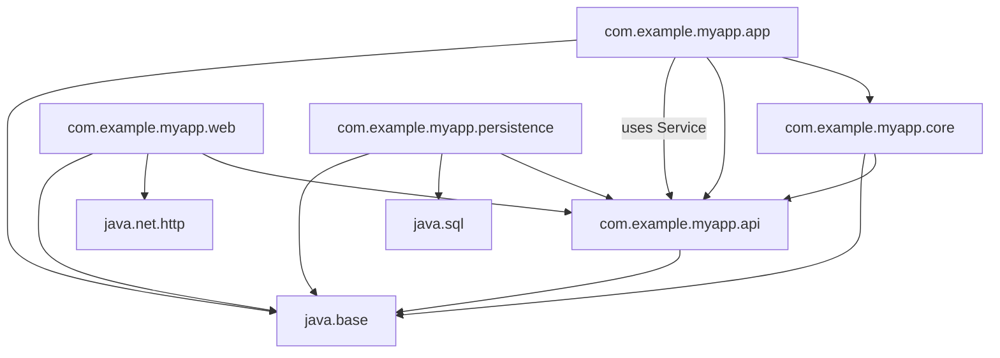

# Java Modules System

## Overview

The Java Platform Module System (JPMS), commonly known as Project Jigsaw, was introduced in Java 9 as the biggest change to the Java platform since generics. Modules bring strong encapsulation and reliable configuration to the language. A module is a named, versioned (conceptually) group of related packages and resources, with explicit dependencies on other modules. The module system replaces the historical classpath with the module path, makes the JVM verify dependencies at startup, and (since Java 16) makes strong encapsulation of JDK internals the default.

This note covers the module declaration file `module-info.java`, the directives `requires`, `exports`, `opens`, `uses`, and `provides ... with`, the difference between the module path and the classpath, automatic modules, unnamed modules, the layered API, common build tool integration, and migration strategies from classpath to modules. We will also discuss the practical realities: many libraries still have not modularized, and you often end up with a hybrid setup. By the end, you will be able to design a modular Java application, understand the error messages the module system produces, and migrate an existing application step by step.

## Background Knowledge

Before reading this note, make sure you understand:

- **Packages**: The basic unit of namespacing in Java.
- **The classpath**: The traditional mechanism for finding classes at runtime.
- **JAR files**: The packaging format for compiled classes and resources.
- **The JDK structure**: Before Java 9, the JDK was a giant `rt.jar` containing everything from `java.lang` to `java.corba`. After Java 9, the JDK is itself modularized into about 70 modules.
- **Reflection and access control**: Modules change how reflective access works.

A short motivation. The pre-Java-9 classpath had three big problems. First, no reliable dependency configuration: if you forgot a JAR, you got `NoClassDefFoundError` at runtime instead of a clear error at startup. Second, no encapsulation across JAR boundaries: any `public` class was accessible to any other class on the classpath, including internal helpers like `sun.misc.Unsafe`. Third, the JDK was a monolith, making it impossible to ship a small runtime for embedded devices or microservices. JPMS addresses all three by introducing modules with explicit `requires` and `exports` clauses and by reorganizing the JDK into modules.

## The module-info.java File

A module is declared by placing a `module-info.java` file at the root of the source tree. It contains a module declaration with directives:

```java
module com.example.myapp {

    // Required modules at compile time and runtime.
    requires java.base;          // Implicit; you do not have to write this.
    requires java.sql;
    requires org.slf4j;

    // Required only at compile time (e.g., annotation libraries).
    requires static lombok;

    // Required transitively: any module that requires THIS module
    // also gets access to the transitive one without declaring it.
    requires transitive java.sql;

    // Packages that are accessible to other modules.
    exports com.example.myapp.api;
    exports com.example.myapp.internal to com.example.test;  // qualified export.

    // Open packages for deep reflection (e.g., for frameworks).
    opens com.example.myapp.model;

    // Whole module can be opened for reflection.
    opens com.example.myapp.dto to com.fasterxml.jackson.databind;

    // Service consumption: this module uses ServiceLoader to find implementations.
    uses com.example.myapp.spi.PaymentProvider;

    // Service provision: this module provides an implementation.
    provides com.example.myapp.spi.PaymentProvider
        with com.example.myapp.payment.StripePaymentProvider;
}
```

Let us examine each directive.

### requires

Declares that this module depends on another module. The compiler and JVM verify that the required module is on the module path at compile time and runtime. Without it, you get a clear error.

### requires static

Declares a dependency that is required at compile time but optional at runtime. This is useful for annotation libraries (like Lombok) whose annotations are erased by the compiler.

### requires transitive

Means any module that requires THIS module also implicitly requires the transitive target. This avoids forcing downstream modules to manually re-declare common dependencies. The classic example is `java.sql` requiring `java.xml` transitively, because parts of the SQL API expose XML types.

### exports

Makes a package accessible to other modules. By default, all packages are inaccessible. Only those listed in `exports` are visible to consumers. This is the heart of strong encapsulation.

### exports ... to ...

A qualified export limits visibility to specific modules. Useful for tightly coupled modules that share internal helpers without exposing them to the world.

### opens

Allows deep reflection on the package at runtime. Even if a package is not exported, opening it allows frameworks to call `setAccessible(true)` on its members. This is required by Hibernate, Jackson, Spring, and similar frameworks.

### opens ... to ...

A qualified open: only specific modules may reflect into the package. Use this for finer-grained control.

### uses and provides

These support the Java ServiceLoader mechanism. `uses` declares that this module will look up service implementations at runtime. `provides ... with` declares that this module supplies an implementation. The ServiceLoader finds all providers on the module path that declare `provides` for the requested service.

## Module Path vs Classpath

The module path is the modular equivalent of the classpath. It contains modular JARs (those with `module-info.class`). The classpath is still supported for backward compatibility; JARs on the classpath end up in the **unnamed module**, which reads every other module and exports every package (effectively turning off module encapsulation for those classes).

Key behaviors:

- Modular JARs on the module path are treated as named modules.
- Modular JARs on the classpath are treated as if they had no module info (they become part of the unnamed module).
- Non-modular JARs on the module path become **automatic modules**: the module name is derived from the JAR filename or from `Automatic-Module-Name` in the manifest, and they read every other module and expose all packages.

## Automatic Modules

An automatic module is a JAR on the module path that does not contain `module-info.class`. The JVM derives a name from the JAR filename (stripping version suffixes and replacing special characters with dots) or uses the `Automatic-Module-Name` manifest attribute for a stable name.

Automatic modules:

- Can be required by named modules: `requires com.google.guava`.
- Read every other module (named, automatic, and unnamed).
- Export every package.

This makes them a transitional mechanism. You can use libraries that have not yet been modularized by placing them on the module path as automatic modules, while still gaining module-level dependency verification for your own code.

## Unnamed Module

If you put a JAR on the classpath (not the module path), it ends up in the unnamed module. The unnamed module reads every other module and exports every package. It is essentially "module system off" for those classes. This is the fallback mode for legacy applications and is what most existing applications still use.

## The java.base Module

Every module implicitly requires `java.base`, which contains `java.lang`, `java.util`, `java.io`, `java.time`, and the other core packages. You never need to write `requires java.base` explicitly. The JDK itself is now broken into about 70 modules (`java.sql`, `java.desktop`, `java.net.http`, `java.logging`, etc.). Use `java --list-modules` to see them all.

## A Complete Modular Example

Here is a small two-module project:

File: `greet-api/src/main/java/com/example/greet/Greeter.java`
```java
package com.example.greet;

public interface Greeter {
    String greet(String name);
}
```

File: `greet-api/src/main/java/module-info.java`
```java
module com.example.greet {
    exports com.example.greet;
}
```

File: `greet-impl/src/main/java/com/example/greet/impl/EnglishGreeter.java`
```java
package com.example.greet.impl;

import com.example.greet.Greeter;

public class EnglishGreeter implements Greeter {
    public String greet(String name) {
        return "Hello, " + name + "!";
    }
}
```

File: `greet-impl/src/main/java/module-info.java`
```java
module com.example.greet.impl {
    requires com.example.greet;
    provides com.example.greet.Greeter with com.example.greet.impl.EnglishGreeter;
}
```

File: `greet-app/src/main/java/com/example/app/Main.java`
```java
package com.example.app;

import com.example.greet.Greeter;
import java.util.ServiceLoader;

public class Main {
    public static void main(String[] args) {
        ServiceLoader<Greeter> loader = ServiceLoader.load(Greeter.class);
        for (Greeter g : loader) {
            System.out.println(g.greet("World"));
        }
    }
}
```

File: `greet-app/src/main/java/module-info.java`
```java
module com.example.app {
    requires com.example.greet;
    uses com.example.greet.Greeter;
}
```

Compiling and running:

```
javac -d out/greet-api greet-api/src/main/java/module-info.java greet-api/src/main/java/com/example/greet/Greeter.java
javac -d out/greet-impl --module-path out/greet-api greet-impl/src/main/java/module-info.java greet-impl/src/main/java/com/example/greet/impl/EnglishGreeter.java
javac -d out/greet-app --module-path out/greet-api:out/greet-impl greet-app/src/main/java/module-info.java greet-app/src/main/java/com/example/app/Main.java

java --module-path out/greet-api:out/greet-impl:out/greet-app --module com.example.app/com.example.app.Main
```

## Mermaid Diagram: Module Dependency Graph



## Mermaid Diagram: Module Path vs Classpath



## Migration Strategies

Migrating an existing classpath application to modules is rarely a quick task. The recommended approach is incremental:

1. **Run on the classpath as before** with Java 9+. Everything still works because JARs go into the unnamed module.
2. **Identify internal APIs you depend on.** Run `jdeps --jdk-internals myapp.jar` to find usages of JDK internal APIs and get suggestions for replacements.
3. **Move JARs to the module path as automatic modules** one by one. This gives you named modules without modifying the JARs.
4. **Add `module-info.java` to your own modules** one at a time. Use `jdeps --generate-module-info` to draft the file.
5. **Refine the draft** by removing unused `requires`, adding `exports`, and adding `opens` for frameworks that need reflection.
6. **Test thoroughly.** Module errors often surface only at runtime, not compile time.

## Common Pitfalls

### Forgetting to Open Packages for Reflection

Frameworks like Hibernate, Jackson, and Spring need to call `setAccessible(true)` on private fields. Without `opens`, you get `InaccessibleObjectException` at runtime. Add `opens com.example.model;` or use `--add-opens` command-line flags as a quick workaround.

### Split Packages

The module system forbids the same package in two modules. If your application has the same package in two JARs (a common legacy pattern), you cannot modularize until you rename one of them.

### Circular Dependencies

Modules cannot have circular `requires` dependencies. If your code has cycles, you must refactor before modularizing.

### Missing requires transitive

If module A exposes types from module B in its public API, it must `requires transitive B`. Otherwise, downstream modules get cryptic errors when they try to use those types.

### Non-Modular Dependencies

Many libraries still ship without `module-info.class`. They can be used as automatic modules, but their internal structure is opaque to the module system.

### Tools That Do Not Support Modules

Older versions of some build plugins and code analysis tools do not understand modules. Upgrade to recent versions before modularizing.

### Module Name Collisions

Two JARs that derive the same automatic module name from their filename conflict on the module path. Use `Automatic-Module-Name` in the manifest of your own libraries to provide stable, unique names.

## Tips and Tricks

- Always declare `Automatic-Module-Name` in the manifest of libraries you publish, even before adding a full `module-info.java`. This gives downstream users a stable module name.
- Use `jdeps` early and often to discover dependencies and split packages.
- Use qualified exports (`exports ... to ...`) for tightly coupled modules instead of making packages fully public.
- Use `opens` (or `opens ... to ...`) for frameworks that need reflection.
- Prefer `requires transitive` for dependencies exposed in your API.
- Consider keeping a non-modular fallback JAR (without `module-info.class`) for users who still live on the classpath. Multi-release JARs can help.
- Use `jlink` to produce a custom runtime image containing only the modules your application needs. This can shrink a Java deployment from hundreds of megabytes to tens.
- Use the `ModuleLayer` API for advanced scenarios such as loading multiple versions of the same module in the same JVM.
- Document your `requires` and `exports` clearly in your project README so downstream users know what they can rely on.
- Use `--add-opens` and `--add-exports` flags sparingly; they are escape hatches, not a long-term solution.

## Interview Questions

**Q1. What problem does the Java Module System solve?**

It provides reliable dependency configuration (modules declare what they need), strong encapsulation (only exported packages are visible), and a modular JDK (smaller runtime images via `jlink`). It replaces the classpath's "everything visible, no dependency checks" model with explicit declarations.

**Q2. What directives can appear in `module-info.java`?**

`requires`, `requires static`, `requires transitive`, `exports`, `exports ... to ...`, `opens`, `opens ... to ...`, `uses`, and `provides ... with ...`.

**Q3. What is the difference between `requires`, `requires static`, and `requires transitive`?**

`requires` declares a compile-time and runtime dependency. `requires static` is compile-time only. `requires transitive` makes the dependency visible to any module that requires this one.

**Q4. What is the difference between `exports` and `opens`?**

`exports` makes a package accessible to other modules for ordinary (compile-time and runtime) access. `opens` makes it accessible for deep reflection (via `setAccessible(true)`) at runtime.

**Q5. What is an automatic module?**

A non-modular JAR placed on the module path. The JVM derives a name from the filename or manifest, and the module reads every other module and exports every package. It is a transitional mechanism.

**Q6. What is the unnamed module?**

The implicit module that contains all classes on the classpath. It reads every other module and exports every package, effectively disabling module encapsulation for those classes.

**Q7. Why do frameworks like Hibernate need `opens`?**

Because they use reflection with `setAccessible(true)` to read and write private fields. Without `opens`, the JVM throws `InaccessibleObjectException` in Java 16+.

**Q8. What is `jlink`?**

A tool that produces a custom runtime image containing only the modules your application needs, plus the JVM. It can shrink a deployment dramatically and is essential for microservices and containers.

**Q9. Why are split packages forbidden?**

Because the module system uses packages as the unit of access control. If the same package existed in two modules, the access rules would be ambiguous. The compiler and JVM reject split packages.

**Q10. How would you migrate a large classpath application to modules?**

Incrementally: run on the classpath first, use `jdeps` to find internal API usage and to draft `module-info.java`, move JARs to the module path as automatic modules, add module info to your own code one module at a time, and test thoroughly. Use `--add-opens` as a temporary escape hatch for reflection issues.

## Module Versioning

The module system does not have built-in versioning. A module has a name but no version field in `module-info.java`. Versioning is the responsibility of build tools and the module layer API.

The convention is to encode the version in the JAR filename (e.g., `guava-32.1.1.jar`) or in the JAR manifest (`Implementation-Version`). The `java.lang.module.ModuleDescriptor` class exposes the version when it has been recorded in the manifest. At runtime, you can read it:

```java
Module module = MyClass.class.getModule();
ModuleDescriptor descriptor = module.getDescriptor();
Optional<ModuleDescriptor.Version> version = descriptor.version();
version.ifPresent(v -> System.out.println("Version: " + v));
```

For semantic versioning in the manifest, use the `Module-Version` attribute (rare) or simply `Implementation-Version` (common).

## Module Layer API

The `ModuleLayer` API lets you load modules at runtime with fine-grained control. This is useful for plugin systems, application servers, and any scenario where you need to load and unload modules dynamically.

```java
// Find modules in a directory.
java.nio.file.Path dir = java.nio.file.Paths.get("plugins");
ModuleFinder finder = ModuleFinder.of(dir);

// Resolve modules and their dependencies.
Configuration parent = ModuleLayer.boot().configuration();
Configuration config = parent.resolve(finder, ModuleFinder.of(), java.util.Set.of("plugin.alpha"));

// Create a layer with a custom class loader.
ClassLoader scl = ClassLoader.getSystemClassLoader();
ModuleLayer layer = ModuleLayer.boot().defineModulesWithOneLoader(config, scl);

// Load a class from the layer.
Class<?> pluginClass = layer.findLoader("plugin.alpha").loadClass("com.example.Plugin");
```

This is a powerful pattern for building extensible applications. Each plugin can be in its own module with its own dependencies and class loader, isolated from other plugins.

## jlink Deep Dive

`jlink` is the module system's killer feature for deployment. It assembles a custom runtime image containing only the modules your application needs, plus a stripped-down JVM. The result is a self-contained directory that can be zipped, copied, or shipped in a Docker image with a tiny footprint.

Basic usage:

```
jlink --module-path target/modules:/path/to/jdk/jmods \
      --add-modules com.example.app \
      --output myapp-image \
      --launcher start=com.example.app/com.example.app.Main \
      --strip-debug \
      --compress=zip-6 \
      --no-header-files \
      --no-man-pages
```

Key options:

- `--module-path`: where to find your modules and JDK modules.
- `--add-modules`: the root modules to include (transitive dependencies are added automatically).
- `--output`: the directory to write the image to.
- `--launcher name=module/main`: creates a launcher script.
- `--strip-debug`: removes debug information to shrink the image.
- `--compress=zip-6`: compresses the image using the highest compression level.
- `--no-header-files`, `--no-man-pages`: removes unnecessary files.

The resulting image is a complete, runnable Java application that includes the JVM. You can run it with `myapp-image/bin/start` (or `start.bat` on Windows). There is no need for a separate JRE installation.

For Docker images, `jlink` lets you create a runtime of 30 to 80 megabytes instead of the 200+ megabytes of a full JDK image. This dramatically reduces container startup time and image pull time.

## Modular Library Design

If you publish a library, follow these best practices:

1. **Add an `Automatic-Module-Name` to your manifest** even before adding `module-info.java`. This gives consumers a stable module name. Without it, the name is derived from the JAR filename, which can change.

```
Automatic-Module-Name: com.example.mylib
```

2. **When you add `module-info.java`, keep the same module name** to avoid breaking existing consumers.

3. **Export only packages that are part of your public API.** Internal packages should not be exported. Use qualified exports for tightly-coupled modules.

4. **Open packages that frameworks need to reflect into.** For example, if your library has DTOs that Jackson needs to deserialize, `opens` those packages.

5. **Use `requires transitive` for dependencies that are exposed in your API.** This prevents downstream modules from having to manually re-declare those dependencies.

6. **Avoid split packages.** If your library has the same package in multiple JARs, you cannot modularize.

7. **Publish a multi-release JAR if you need different code on different Java versions.**

## Module Patterns for Application Architecture

Modules change how we organize large applications. Common patterns:

- **API module**: contains interfaces and DTOs that other modules depend on.
- **Implementation module**: contains the implementation of the API, often loaded via `ServiceLoader`.
- **SPI module**: contains service interfaces for plugins.
- **Plugin modules**: each plugin is its own module that provides an SPI implementation.
- **Application module**: the main module that wires everything together.

A typical layout:

```
myapp/
  api/         module com.example.myapp.api { exports com.example.myapp.api; }
  core/        module com.example.myapp.core { requires com.example.myapp.api; }
  web/         module com.example.myapp.web { requires com.example.myapp.api; requires transitive java.net.http; }
  persistence/ module com.example.myapp.persistence { requires com.example.myapp.api; requires java.sql; }
  app/         module com.example.myapp.app { requires com.example.myapp.api; requires com.example.myapp.core; uses com.example.myapp.api.Service; }
```

Each module has clear dependencies and a clear public surface. Internal packages are not exported. Reflection is allowed only on packages that are explicitly opened.

## Mermaid Diagram: Typical Modular Application Layout



## Common Migration Tools

- **`jdeps`**: analyzes dependencies and suggests module-info. Use `jdeps --generate-module-info` to draft a module declaration.
- **`jdeps --list-deps`**: lists the modules a JAR depends on.
- **`jdeps --jdk-internals`**: finds usages of internal JDK APIs.
- **`--add-opens` and `--add-exports`**: command-line escape hatches for opening or exporting packages without modifying source.
- **`--illegal-access=debug|permit|deny|warn`**: controls how the JVM handles reflective access to JDK internals (deprecated in Java 17, removed in Java 18).

## ServiceLoader in Depth

The `ServiceLoader` API existed before modules (since Java 6), but it integrates tightly with them. A service is an interface or abstract class that one module declares with `uses` and another module provides an implementation for with `provides ... with`.

```java
// In the API module.
public interface GreetingStrategy {
    String greeting(String name);
}

// In the implementation module.
module com.example.greet.impl {
    requires com.example.greet.api;
    provides com.example.greet.api.GreetingStrategy
        with com.example.greet.impl.FormalGreeting;
}

// In the application module.
module com.example.greet.app {
    requires com.example.greet.api;
    uses com.example.greet.api.GreetingStrategy;
}

// In the application code.
ServiceLoader<GreetingStrategy> loader =
    ServiceLoader.load(GreetingStrategy.class);
for (GreetingStrategy strategy : loader) {
    System.out.println(strategy.greeting("Alice"));
}
```

The `ServiceLoader` finds every provider on the module path that declares `provides` for the requested service. It instantiates each provider class with its no-arg constructor.

Services decouple consumers from providers. The application module only knows about the API module and the service interface; the implementation module is selected at deployment time by placing it on the module path.

## Module Resolution at Startup

When you launch a modular application, the JVM performs module resolution before executing any code. Starting from the root modules you specify with `--module`, it traces `requires` directives transitively until it has a complete graph. If a required module is missing, the JVM refuses to start with a clear error:

```
Error: Missing required module [com.example.greet.api]
```

This is a vast improvement over the classpath, where missing classes surfaced only at runtime as `NoClassDefFoundError`.

The resolution process also detects cycles. If module A requires B and B requires A, the JVM rejects the configuration.

## Reflection in Modules

Reflection in a modular world requires care. By default:

- A module can reflect on its own classes freely.
- A module can reflect on classes of any module it reads (that is, modules it `requires` or that are automatically or unnamed).
- For deep reflection (`setAccessible(true)` on private members), the target package must be `opens` to the calling module (or `opens` to everyone).

For example, if Hibernate needs to reflect into your entities:

```java
module com.example.app {
    requires com.example.entities;   // plain requires - normal access only
    requires org.hibernate.orm.core;
    opens com.example.entities.model to org.hibernate.orm.core;
}
```

If you instead `opens com.example.entities.model` (without `to`), any module that reads your module can reflect into it.

## Multi-Release JARs

A multi-release JAR (MRJAR) lets you ship different bytecode for different Java versions in the same JAR. This is useful when you want to take advantage of newer APIs without breaking compatibility with older runtimes.

```
mylib.jar
  META-INF/
    MANIFEST.MF
    versions/
      9/
        com/example/Helper.class        // Java 9+ version
      11/
        com/example/Helper.class        // Java 11+ version
      17/
        com/example/Helper.class        // Java 17+ version
  com/example/
    Helper.class                         // Default (Java 8 baseline)
    Other.class
```

The manifest must contain `Multi-Release: true`. The JVM picks the highest version that does not exceed its own version. MRJARs are useful for libraries that want to use modules on Java 9+ while still supporting Java 8.

## Build Tool Integration

Maven, Gradle, and other build tools support modules. The key configurations:

- **Maven** with `maven-compiler-plugin` 3.10+: configure `release` to 9 or higher; the plugin respects `module-info.java` automatically.
- **Gradle** with the `application` or `java-library` plugin: configure `JavaVersion` to 9 or higher; the toolchain handles modules.
- **Moditect** plugin: generates `module-info.java` for third-party JARs that lack it, useful when migrating dependencies.
- **`jpackage`** tool: produces platform-specific installers (deb, rpm, msi, dmg) from a modular application.

## Diagnostic Commands

Useful JVM flags for module debugging:

- `--show-module-resolution`: prints the module graph as the JVM resolves it.
- `--validate-modules`: checks for errors without running the application.
- `--list-modules`: lists all observable modules.
- `--describe-module <name>`: prints the descriptor for a module.
- `--add-reads <module>=<target>`: forces a module to read another module.
- `--add-exports <module>/<package>=<target>`: exports a package from one module to another.
- `--add-opens <module>/<package>=<target>`: opens a package for deep reflection.
- `--patch-module <module>=<file>`: adds classes or resources to a module.

## Module Naming Conventions

Module names follow the same reverse-DNS convention as packages. The recommended practice is to use a name that matches the top-level package in the module. For example, if your module's top package is `com.example.mylib`, the module name should be `com.example.mylib`.

This convention has several benefits:

- It makes the relationship between module names and packages obvious.
- It prevents name collisions because reverse-DNS names are unique.
- It helps tools and frameworks automatically discover the module's packages.

When you publish a library, you should commit to a module name early by adding `Automatic-Module-Name` to the manifest, even before adding a full `module-info.java`. Once consumers start using your library with a particular module name, changing it is a breaking change.

Avoid using version numbers in module names. The module system does not support multiple versions of the same module in the same layer, so encoding a version in the name does not help and confuses downstream tools.

## Module Evolution Strategy

When you evolve a modular library, you must consider compatibility:

- **Binary compatibility**: existing classes and methods continue to work.
- **Source compatibility**: existing source files continue to compile.
- **Behavioral compatibility**: existing programs continue to behave the same way.

For modules, you must also consider:

- **Module name compatibility**: do not change the module name.
- **Export compatibility**: do not remove exports of packages that consumers depend on.
- **Requires compatibility**: do not remove `requires` directives that consumers may rely on transitively.

When you need to make a breaking change, the standard approach is to release a new major version with a new module name (e.g., `com.example.mylib.v2`). This lets consumers migrate at their own pace.

## Summary

The Java Module System brings reliable dependency configuration, strong encapsulation, and a modular JDK to Java. Modules are declared with `module-info.java` using `requires`, `exports`, `opens`, `uses`, and `provides`. The module path replaces the classpath for modular JARs, while automatic modules and the unnamed module smooth migration for non-modular code. Modern Java (16+) enforces strong encapsulation by default, which means frameworks need `opens` directives and legacy code that reflected into JDK internals must be updated. Although full modularization is a significant migration effort, even partial adoption (automatic modules, `--add-opens`) gives immediate benefits in clarity and dependency verification.
