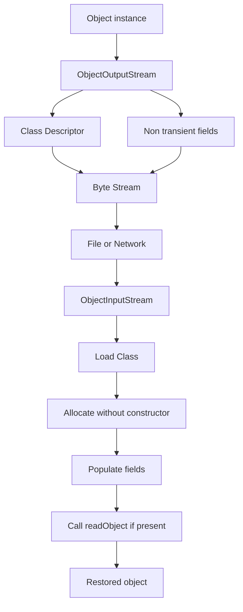
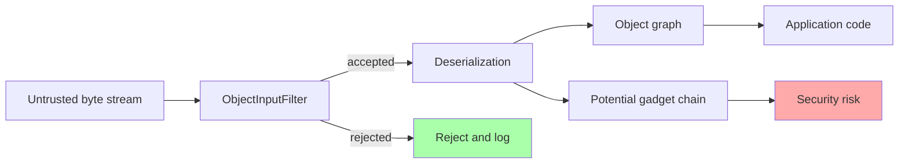
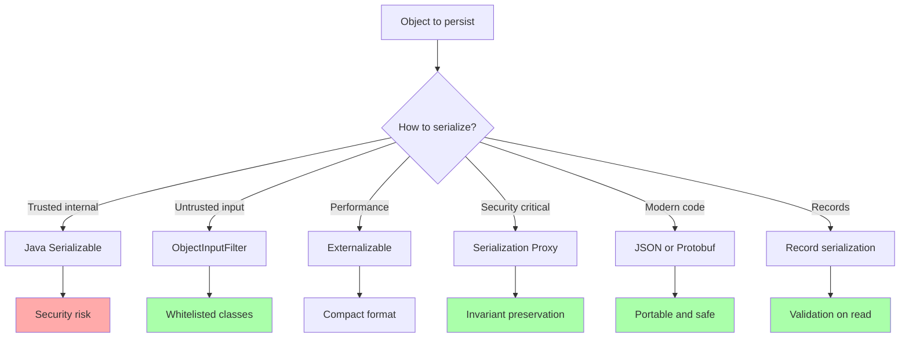

# Varargs Assertions Serialization and Special Keywords

## Overview

This note gathers several smaller but important topics that every advanced Java developer should master. Individually, none of them warrants a full chapter, but together they cover a surprising amount of the language's surface area. We will cover varargs (variable arity methods), assertions and the `assert` keyword, the serialization mechanism including `transient` and `serialVersionUID`, a brief introduction to the `volatile` keyword (with a pointer to the dedicated concurrency chapter for a deep dive), native methods via the `native` keyword, and the `strictfp` keyword that controls floating-point strictness.

Each section follows the same pattern: motivation, syntax, semantics, examples, pitfalls, tips, and interview questions. By the end, you will be able to use these features correctly and confidently, and you will understand the historical and engineering reasons behind some of Java's more unusual design choices.

## Background Knowledge

Before reading this note, make sure you understand:

- **Method signatures and overloading**: How the compiler chooses between overloaded methods.
- **The `Object` class and `equals`/`hashCode`**: Relevant for serialization correctness.
- **The JVM's floating-point model**: Relevant for `strictfp`.
- **The class loader and class initialization**: Relevant for `native` methods and JNI.
- **Threads and visibility**: Relevant for the brief `volatile` discussion.

## Varargs

Varargs (short for variable-length arguments) were introduced in Java 5. A method declared with a parameter of type `T...` accepts zero or more arguments of type `T`, which the compiler collects into an array.

### Syntax and Semantics

```java
public static int sum(int... numbers) {
    int total = 0;
    for (int n : numbers) {
        total += n;
    }
    return total;
}

sum();          // Returns 0.
sum(1);         // Returns 1.
sum(1, 2, 3);   // Returns 6.
sum(new int[] {1, 2, 3, 4});  // You can also pass an array directly.
```

Under the hood, the compiler turns `int... numbers` into `int[] numbers`. Every call site that passes individual values is rewritten to wrap them in an array. This is why varargs are sometimes called "syntactic sugar for arrays."

### Rules

- A method can have at most one varargs parameter.
- The varargs parameter must be the last parameter.
- Passing an array directly to a varargs parameter is allowed.
- Overloading resolution prefers non-varargs methods over varargs methods when both match.

### Heap Pollution with Generic Varargs

Because arrays are covariant and reified while generics are invariant and erased, generic varargs create a type safety hole:

```java
public static <T> T[] arrayOf(T... items) {
    return items;   // The actual array type is Object[], not T[].
}

String[] strings = arrayOf("a", "b");
// At runtime: arrayOf returns Object[].
// Assigning to String[] works because of covariant arrays,
// but the JVM remembers the array's actual component type as Object.
strings[0] = "x";   // OK.
strings[0] = (String) new Object();   // ClassCastException (ArrayStoreException actually).
```

More dangerously:

```java
public static <T> T pick(T first, T... rest) {
    return first;
}

List<String> a = List.of("a");
List<Integer> b = List.of(1);
List<String> wrong = pick(a, b);   // Heap pollution.
String s = wrong.get(0);            // Compiles, but might fail at runtime.
```

To address this, the compiler emits an unchecked warning for any method with generic varargs. If you can prove your method is safe (does not write to the array and does not let the array escape where unsafe code could misuse it), annotate it with `@SafeVarargs`:

```java
@SafeVarargs
public static <T> List<T> safeList(T... items) {
    // Safe: we copy elements out without writing to the array
    // and without exposing the array itself.
    return List.of(items);
}
```

`@SafeVarargs` requires the method to be `static`, `final`, or (since Java 9) `private`.

### When to Use Varargs

- When the natural API accepts any number of arguments of the same type (e.g., `List.of`, `String.format`, `Collections.addAll`).
- When the typical case has few arguments and the array allocation overhead is negligible.
- For public APIs where the varargs form is significantly cleaner than passing a `List`.

### When Not to Use Varargs

- Hot paths where array allocation matters.
- APIs where callers frequently pass zero arguments and you want to force them to be explicit.
- When you need to distinguish a single array argument from multiple scalar arguments.

## Assertions and the `assert` Keyword

The `assert` keyword was added in Java 1.4. It lets you encode invariants that should always hold during development but should not impose runtime overhead in production. Assertions are disabled by default and must be explicitly enabled with the `-ea` (enable assertions) command-line flag.

### Syntax

There are two forms:

```java
assert condition;
assert condition : message;
```

If assertions are enabled and `condition` evaluates to `false`, the JVM throws `AssertionError`. The optional message is converted to a string and included in the error. If assertions are disabled, the entire `assert` statement is skipped, with no runtime cost beyond the bytecode for the boolean expression (which the JIT can sometimes eliminate).

### Enabling and Disabling

- `-ea` or `-enableassertions`: enables assertions in all classes except system classes.
- `-ea:com.example...`: enables assertions in the `com.example` package and subpackages.
- `-ea:MyClass`: enables assertions in `MyClass` only.
- `-da` or `-disableassertions`: disables assertions (default).
- `-esa` or `-enablesystemassertions`: enables assertions in system classes.

### Proper Use

Use assertions to verify internal invariants that should never fail if your code is correct:

```java
public void setAge(int age) {
    if (age < 0 || age > 150) {
        throw new IllegalArgumentException("Invalid age: " + age);
    }
    this.age = age;
    assert invariantHolds() : "Invariant broken after setAge";
}

private boolean invariantHolds() {
    return age >= 0 && age <= 150;
}
```

Key principles:

- Assertions are for detecting programming errors, not for validating user input.
- Assertions should have no side effects, because they may be disabled in production.
- Do not use assertions for public API preconditions; throw `IllegalArgumentException` or `NullPointerException` instead.
- Use assertions liberally in development to catch bugs early.
- Avoid using assertions to perform work that the program relies on.

### Misuse Examples

```java
// BAD: side effect in assertion.
assert removeItem(item);

// BAD: using assertions for argument validation of a public method.
public void process(String input) {
    assert input != null;   // Should be Objects.requireNonNull(input).
}

// GOOD: assertion about an internal invariant.
private void rebalanceTree() {
    // ... rebalancing logic ...
    assert isBalanced() : "Tree is not balanced after rebalance";
}
```

## Serialization

Serialization is the process of converting an object's state into a byte stream, which can later be deserialized back into an equivalent object. Java's built-in mechanism, `java.io.Serializable`, has been part of the platform since Java 1.1. It is convenient but has serious security implications that have led to its decline in modern code.

### The Serializable Marker Interface

`Serializable` is a marker interface with no methods. Implementing it tells the JVM that instances of the class may be written with `ObjectOutputStream.writeObject` and read with `ObjectInputStream.readObject`.

```java
public class User implements java.io.Serializable {
    private String name;
    private int age;

    public User(String name, int age) {
        this.name = name;
        this.age = age;
    }
}

User user = new User("Alice", 30);

// Serialize.
try (var out = new java.io.ObjectOutputStream(
         new java.io.FileOutputStream("user.ser"))) {
    out.writeObject(user);
}

// Deserialize.
try (var in = new java.io.ObjectInputStream(
         new java.io.FileInputStream("user.ser"))) {
    User restored = (User) in.readObject();
    System.out.println(restored);
}
```

### How It Works

The default serialization mechanism writes:

1. The class descriptor (class name, serialVersionUID, field layout).
2. The value of each non-transient, non-static field.

On deserialization:

1. The class is loaded (no constructor is invoked).
2. Fields are populated from the stream.
3. If the class defines `readObject`, it is called to perform custom deserialization.

### The `transient` Keyword

A field marked `transient` is skipped during serialization. On deserialization, it receives the default value for its type (`null` for objects, `0` for numbers, `false` for booleans).

```java
public class Session implements java.io.Serializable {
    private String userId;
    private transient String temporaryToken;  // Not serialized.
    private transient java.sql.Connection connection;  // Not serialized.
}
```

Use `transient` for:

- Fields that hold runtime-only resources (database connections, sockets, file handles).
- Cached values that can be recomputed.
- Sensitive data that should not be persisted (consider encrypting instead).

### `serialVersionUID`

Every serializable class has a version number called `serialVersionUID`. If you do not declare one, the compiler computes one based on the class structure. If the class changes (e.g., you add a field), the computed value changes, and deserialization of old data fails with `InvalidClassException`.

Always declare an explicit `serialVersionUID`:

```java
public class User implements java.io.Serializable {
    private static final long serialVersionUID = 1L;
    private String name;
    private int age;
}
```

This lets you evolve the class (add fields, remove fields) while still being able to deserialize older data, as long as the changes are compatible.

### Custom Serialization

You can take control of serialization by defining these methods:

```java
private void writeObject(java.io.ObjectOutputStream out) throws IOException {
    out.defaultWriteObject();   // Write the default-serializable fields.
    // Write custom data.
    out.writeUTF(encrypt(sensitiveData));
}

private void readObject(java.io.ObjectInputStream in)
        throws IOException, ClassNotFoundException {
    in.defaultReadObject();
    sensitiveData = decrypt(in.readUTF());
}

private void readObjectNoData() throws ObjectStreamException {
    // Called if the stream has no data for this class (e.g., version mismatch).
}
```

For complete control, implement `Externalizable` instead of `Serializable`:

```java
public class Point implements java.io.Externalizable {
    private int x, y;

    public void writeExternal(ObjectOutput out) throws IOException {
        out.writeInt(x);
        out.writeInt(y);
    }

    public void readExternal(ObjectInput in) throws IOException {
        x = in.readInt();
        y = in.readInt();
    }
}
```

`Externalizable` requires a public no-arg constructor and gives you full responsibility for the format.

### `writeReplace` and `readResolve`

These methods let you substitute a different object during serialization or deserialization. They are commonly used to implement serialization-safe singletons and proxies.

```java
public class Singleton implements java.io.Serializable {
    public static final Singleton INSTANCE = new Singleton();

    private Singleton() {}

    // Returns a proxy that will be serialized instead of this object.
    private Object writeReplace() {
        return new Proxy(this);
    }

    // On deserialization, replace the proxy with the singleton.
    private Object readResolve() {
        return INSTANCE;
    }
}
```

### Security Risks of Serialization

Java's built-in deserialization is one of the most dangerous features in the language. A crafted byte stream can trigger the construction of arbitrary classes, potentially invoking code that performs malicious actions. Many high-profile CVEs (including exploits in Apache Commons Collections, Spring, and WebLogic) are based on deserialization gadgets.

Mitigation strategies:

1. **Avoid Java serialization in new code.** Use JSON, Protocol Buffers, Avro, or other formats with explicit schemas.
2. **Never deserialize untrusted data.** If you must, use an `ObjectInputFilter` (Java 9+) to whitelist allowed classes.
3. **Use `Serializable` only for short-lived, trusted data exchange.**
4. **Prefer records for serializable data classes** because their canonical constructor runs on deserialization, enabling validation.
5. **Mark sensitive fields `transient`** to prevent accidental leakage.

Here is how to install an `ObjectInputFilter`:

```java
ObjectInputStream ois = new ObjectInputStream(inputStream);
ois.setObjectInputFilter(info -> {
    Class<?> clazz = info.serialClass();
    if (clazz != null && !ALLOWED.contains(clazz.getName())) {
        return ObjectInputFilter.Status.REJECTED;
    }
    return ObjectInputFilter.Status.UNDECIDED;
});
```

In Java 17+, you can set a global filter with the `jdk.serialFilter` system property.

## Mermaid Diagram: Serialization Flow



## Mermaid Diagram: Deserialization Security Layers



## Brief Introduction to `volatile`

The `volatile` keyword is a visibility modifier for fields. It guarantees that reads and writes to the field are visible across threads in a consistent order, preventing threads from caching stale values in CPU registers or per-CPU caches. `volatile` also forbids certain compiler optimizations that reorder accesses.

```java
public class Flag {
    private volatile boolean running = true;

    public void stop() {
        running = false;
    }

    public void run() {
        while (running) {
            // Without volatile, another thread might never see running=false.
        }
    }
}
```

`volatile` provides visibility and ordering but NOT atomicity for compound operations like `++`. For atomic counters, use `AtomicInteger` or `synchronized`. A deep dive into `volatile`, the Java Memory Model, and happens-before relationships is in the dedicated concurrency chapter.

## Native Methods

The `native` keyword marks a method as implemented in a language other than Java, typically C or C++, via the Java Native Interface (JNI). The method has no body in Java (the body is provided by a shared library loaded at runtime).

```java
public class NativeExample {
    static {
        System.loadLibrary("native");   // Loads libnative.so or native.dll.
    }

    public native int computeHash(byte[] data);
}
```

Use native methods when:

- You need to call platform-specific APIs that are not exposed by the JDK.
- You need to integrate with existing C/C++ libraries.
- You need performance characteristics that pure Java cannot deliver (rare nowadays).

Native methods have significant downsides:

- They break portability.
- They can crash the JVM (no safety net like Java's bounds checks and null checks).
- They complicate deployment (you must ship the native library for every platform).
- They bypass Java's security model.

The modern alternative to JNI is **Project Panama** (Foreign Function and Memory API), finalized in Java 22, which provides a safer, more efficient way to call native code without writing C glue.

## The `strictfp` Keyword

`strictfp` forces a method or class to use strict floating-point semantics, ensuring identical results across platforms. Without `strictfp`, the JVM was historically allowed to use extended precision (80-bit) intermediate values on x86 processors, which could produce slightly different results on different hardware.

```java
public strictfp class MathUtils {
    public strictfp double compute(double a, double b) {
        return a * b / 3.0;
    }
}
```

In practice, `strictfp` is rarely needed today because:

- Since Java 17, strict floating-point semantics are always the default. The keyword is retained for backward compatibility but has no effect.
- Most numerical code uses `java.lang.Math` or `java.lang.StrictMath` rather than raw operators.
- Differences between platforms were already small for most use cases.

`StrictMath` is a class that guarantees bit-identical results across platforms by using the `fdlibm` library. Use it when you need cross-platform reproducibility for numerical computations.

## Common Pitfalls

### Varargs and null

Passing `null` directly to a varargs parameter is ambiguous: it could mean "no arguments" or "a single null argument." The compiler usually interprets it as the latter, which causes `NullPointerException` when iterating.

```java
public static void print(String... args) {
    System.out.println(args == null ? "null" : args.length);
}

print(null);          // Prints "null" - ambiguous!
print((String) null); // Prints 1.
print();              // Prints 0.
```

### Forgetting to Enable Assertions

By default, assertions are disabled. Code that relies on assertions for correctness will silently skip them in production. Never use assertions for critical logic.

### Serializing Non-Serializable Fields

If a class implements `Serializable` but contains a non-transient, non-serializable field, serialization fails at runtime with `NotSerializableException`. Mark such fields `transient` or implement custom `writeObject`/`readObject`.

### Changing Classes Without Updating `serialVersionUID`

If you forget to declare `serialVersionUID` and then change the class, deserialization of old data fails. Always declare it explicitly for serializable classes.

### Deserializing Untrusted Data

The single biggest security risk. Use `ObjectInputFilter` or, better, avoid Java serialization entirely for untrusted input.

### Volatile Misuse for Atomic Counters

`volatile int count; count++;` is not thread safe. Use `AtomicInteger` instead.

### Native Methods Without Guards

Native code can crash the JVM. Validate inputs in Java before calling native methods.

### Believing `strictfp` Still Matters

In Java 17+, strict floating-point is the default. `strictfp` is essentially a no-op now. Modern code rarely needs it.

## Tips and Tricks

- Annotate generic varargs methods with `@SafeVarargs` when you can prove safety.
- Avoid passing `null` to varargs; pass an empty array or no argument instead.
- Enable assertions in development and CI builds with `-ea`.
- Never use assertions for argument validation of public methods.
- Mark non-serializable fields `transient`.
- Always declare `serialVersionUID` for serializable classes.
- Avoid Java serialization for new code; prefer JSON, Protobuf, or Avro.
- Use `ObjectInputFilter` if you must deserialize untrusted data.
- For singletons, use `readResolve` to prevent duplicate instances after deserialization.
- Prefer records for serializable data; their canonical constructor runs on deserialization.
- Use `volatile` for simple boolean flags, not for atomic counters.
- Use `AtomicInteger`, `AtomicLong`, and `AtomicReference` for lock-free atomic operations.
- Prefer Project Panama over JNI for new native integrations.
- Use `StrictMath` when you need cross-platform bit-identical numerical results.
- Document why a field is `transient` so future maintainers understand.

## Interview Questions

**Q1. What are varargs and how are they implemented?**

Varargs allow a method to accept a variable number of arguments of the same type. The compiler turns the `T...` parameter into `T[]` and wraps individual arguments into an array at the call site. You can also pass an array directly.

**Q2. Why are generic varargs potentially unsafe?**

Because arrays are covariant and reified while generics are invariant and erased. The actual array type is `Object[]`, but the compiler lets you treat it as `T[]`. This can lead to heap pollution and `ClassCastException` at runtime. Use `@SafeVarargs` if you can prove the method is safe.

**Q3. When should you use `@SafeVarargs`?**

When the method does not write to the varargs array (other than `null`), does not let the array escape where unsafe code could misuse it, and the type parameter is only used for reading. The method must be `static`, `final`, or `private`.

**Q4. What is the difference between `assert` and throwing an exception?**

`assert` is for internal invariants and can be disabled in production. Throwing exceptions is for runtime conditions and public API contracts that always need to be enforced. Assertions should have no side effects.

**Q5. How do you enable assertions?**

With the `-ea` (or `-enableassertions`) command-line flag. You can enable them per package or per class with `-ea:com.example...` or `-ea:MyClass`. System class assertions use `-esa`.

**Q6. What is the `transient` keyword?**

It marks a field so that it is skipped during serialization. On deserialization, the field receives its default value (null, 0, false).

**Q7. Why declare `serialVersionUID`?**

To control version compatibility during deserialization. If you do not declare it, the compiler computes one based on the class structure, so any change to the class breaks deserialization of older data. An explicit `serialVersionUID` lets you evolve the class while still accepting older serialized forms.

**Q8. Why is Java deserialization considered dangerous?**

Because a crafted byte stream can trigger the construction and method invocation of arbitrary classes, leading to remote code execution via "gadget chains." Mitigation includes avoiding Java serialization, using `ObjectInputFilter`, and preferring schema-based formats like JSON or Protobuf.

**Q9. What does `volatile` guarantee?**

Visibility and ordering: writes by one thread are seen by other threads, and the compiler and CPU cannot reorder accesses in ways that violate the happens-before rules. It does NOT guarantee atomicity for compound operations.

**Q10. What is the difference between `volatile` and `synchronized`?**

`volatile` provides visibility and ordering for a single field without locking. `synchronized` provides mutual exclusion in addition to visibility, allowing compound operations to be atomic. Use `volatile` for simple flags and `synchronized` or `Atomic*` classes for compound operations.

**Q11. What is a native method?**

A method declared with the `native` keyword that has no body in Java. Its implementation is provided by a shared library loaded with `System.loadLibrary`, typically written in C or C++ via JNI. Native methods can crash the JVM and break portability.

**Q12. Does `strictfp` matter in modern Java?**

No. Since Java 17, strict floating-point semantics are the default. The keyword is retained for backward compatibility but has no effect. For guaranteed cross-platform numerical results, use `StrictMath`.

## Externalizable in Depth

`Externalizable` is an alternative to `Serializable` that gives you complete control over the serialization format. It requires more code but produces smaller, faster, and more secure serialized forms.

```java
public class Point implements java.io.Externalizable {
    private int x, y;

    // Required public no-arg constructor.
    public Point() {}

    public Point(int x, int y) {
        this.x = x;
        this.y = y;
    }

    @Override
    public void writeExternal(ObjectOutput out) throws IOException {
        out.writeInt(x);
        out.writeInt(y);
    }

    @Override
    public void readExternal(ObjectInput in) throws IOException {
        x = in.readInt();
        y = in.readInt();
    }

    @Override
    public String toString() {
        return "Point(" + x + ", " + y + ")";
    }
}
```

Key differences from `Serializable`:

- A public no-arg constructor is required. The deserializer calls it, so the class can be properly initialized.
- You write every field explicitly. Nothing is serialized automatically.
- The serialized form is compact and self-documenting.
- Validation can be performed in `readExternal` after fields are set.

`Externalizable` is preferred for performance-sensitive code where you control both the producer and consumer of the serialized form. It is harder to evolve than `Serializable` because adding or removing a field requires careful format versioning.

## Serialization Proxy Pattern

Joshua Bloch's serialization proxy pattern is a defensive technique that protects against the security risks of `readObject`. Instead of serializing the actual class, you serialize a proxy that knows how to recreate the real class through its public API.

```java
public final class Period implements java.io.Serializable {
    private final java.time.LocalDate start;
    private final java.time.LocalDate end;

    public Period(java.time.LocalDate start, java.time.LocalDate end) {
        if (end.isBefore(start)) {
            throw new IllegalArgumentException("end before start");
        }
        this.start = start;
        this.end = end;
    }

    // The proxy is serialized instead of the real Period.
    private Object writeReplace() {
        return new SerializationProxy(this);
    }

    // Defensive: prevent deserialization of the real class directly.
    private void readObject(java.io.ObjectInputStream stream)
            throws java.io.InvalidObjectException {
        throw new java.io.InvalidObjectException("Use proxy");
    }

    private static class SerializationProxy implements java.io.Serializable {
        private final java.time.LocalDate start;
        private final java.time.LocalDate end;

        SerializationProxy(Period p) {
            this.start = p.start;
            this.end = p.end;
        }

        private Object readResolve() {
            // Recreate the Period through its public constructor,
            // so all validation runs.
            return new Period(start, end);
        }
    }
}
```

This pattern is the most secure way to use Java serialization. The real class's invariants are always enforced because deserialization goes through the public constructor.

## JNI Detailed Example

Here is a minimal JNI example. The Java side declares a native method and loads the library:

```java
public class HelloNative {
    static {
        System.loadLibrary("hellonative");
    }

    public native String greet(String name);

    public static void main(String[] args) {
        System.out.println(new HelloNative().greet("World"));
    }
}
```

After compiling, you generate a C header with `javac -h .` (the `-h` flag derives header file names from class names). The generated header declares a C function whose name is determined by JNI's required convention: the function is named by combining the word `Java`, the Java class name, and the method name with separator characters mandated by the JNI specification. The function signature accepts a JNI environment pointer and a `jstring` argument:

```c
#include <jni.h>
#include "HelloNative.h"

JNIEXPORT jstring JNICALL HelloNativeGreet
  (JNIEnv *env, jobject this, jstring name) {
    const char *cname = (*env)->GetStringUTFChars(env, name, NULL);
    char buffer[256];
    snprintf(buffer, sizeof(buffer), "Hello, %s, from native code!", cname);
    (*env)->ReleaseStringUTFChars(env, name, cname);
    return (*env)->NewStringUTF(env, buffer);
}
```

You then compile the C code into a shared library using your platform's C compiler, supplying the JNI headers from your JDK installation directory. Place the resulting library on the dynamic library path or set the `java.library.path` system property when launching the JVM.

The traditional JNI macros `JNIEXPORT` and `JNICALL` are platform abstraction macros defined in the JNI headers; their actual definition varies by operating system and architecture. The traditional JNI function naming convention (which uses separator characters between the class name and method name) is enforced by the JVM at runtime when it looks up the function pointer for a native method.

The modern alternative is the Foreign Function and Memory API (Project Panama), which lets you call native functions without writing any C glue code. You describe the native function's signature using a `FunctionDescriptor`, look up the function by name in a system library, and obtain a `MethodHandle` to call it:

```java
import java.lang.foreign.*;
import java.lang.invoke.MethodHandle;

Linker linker = Linker.nativeLinker();
SymbolLookup stdlib = linker.defaultLookup();
MethodHandle strlen = linker.downcallHandle(
    stdlib.find("strlen").orElseThrow(),
    FunctionDescriptor.of(ValueLayout.ADDRESS, ValueLayout.ADDRESS)
);

try (Arena arena = Arena.ofConfined()) {
    MemorySegment cString = arena.allocateUtf8String("Hello, Panama!");
    long length = (long) strlen.invoke(cString);
    System.out.println("Length: " + length);
}
```

Panama is safer, more portable, and does not require compiling C code. It became a final feature in Java 22 and is the recommended path for new native integrations.

## Mermaid Diagram: Serialization Alternatives



## Summary

This note covered several smaller but important Java features. Varargs provide convenient variable-arity methods but introduce heap pollution risks with generic types, mitigated by `@SafeVarargs`. Assertions via the `assert` keyword encode internal invariants that can be enabled in development without production cost. Serialization converts objects to byte streams but carries serious security risks that make it unsuitable for new code; prefer JSON or Protobuf and use `transient` for non-serializable fields, `serialVersionUID` for versioning, and `ObjectInputFilter` for untrusted data. The `volatile` keyword gives visibility guarantees without atomicity and is covered in depth in the concurrency chapter. Native methods enable calling C/C++ code via JNI, but Project Panama is the modern alternative. The `strictfp` keyword is essentially obsolete in Java 17+ because strict floating-point is the default. Mastering these features rounds out your understanding of the Java language and helps you write safer, more idiomatic code.
