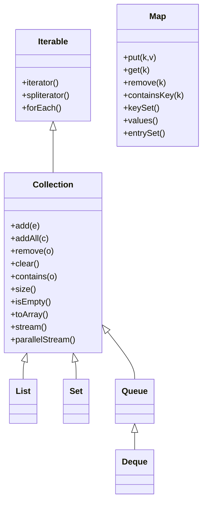
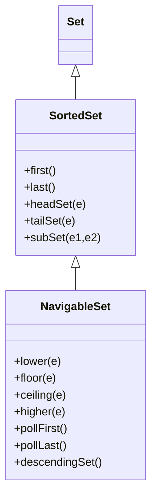

# 04.1 Collection Hierarchy and Core Interfaces

> The Java Collections Framework (JCF) is one of the most heavily used APIs in the entire Java platform. Every backend service, every data pipeline, every game loop and every UI framework eventually stores, retrieves, shuffles and partitions data using the types defined in `java.util`. Mastering the framework therefore is not optional for a professional Java developer; it is the single most leveraged skill after knowing the language itself.

## Overview

The Java Collections Framework was introduced in JDK 1.2 to unify the ad hoc data structures (`Vector`, `Stack`, `Hashtable`, `Enumeration`) that shipped with the original JDK into a coherent, interface driven design. The framework has four pillars:

1. **Core interfaces** that abstract the shape of a data structure (`Collection`, `List`, `Set`, `Queue`, `Deque`, `Map`).
2. **Concrete implementations** that provide concrete behaviour for those interfaces (resizable arrays, linked lists, hash tables, red black trees, heaps).
3. **Algorithms** as static utility methods on `Collections` and `Arrays` (sort, search, shuffle, reverse, frequency, disjoint).
4. **Infrastructure** such as `Iterator`, `Iterable`, `Comparator`, `Comparable`, `Spliterator`, and `Optional`, that make the framework integrate with the language (for each loop, try with resources, streams).

This first note of the Phase 4 series focuses exclusively on the **interfaces**. We will look at the inheritance hierarchy, the contracts each interface imposes, the methods each one declares, and the design rationale behind them. Subsequent notes will dive into each implementation family in depth.

## Background Knowledge

Before reading further, ensure you are comfortable with:

- **Generics** (`List<String>`, `Map<K,V>`, `? extends T`, `? super T`). The Collections Framework is thoroughly generic since Java 5 and you cannot read its source without understanding type erasure and bounded wildcards.
- **The `Iterable` contract** and the enhanced for loop introduced in Java 5.
- **The `Iterator` pattern** and the difference between fail fast and fail safe iteration.
- **`equals` and `hashCode`** semantics, because every `Set` and `Map` depends on them.
- **The `Comparable` and `Comparator`** contracts used by sorted collections and `Collections.sort`.
- **Boxing and unboxing**, because the framework originally supported only objects, so primitive values are stored as their wrapper types.

If any of these feel fuzzy, return to Phase 1 and Phase 2 notes before continuing.

## The Top of the Hierarchy

The framework has **two parallel hierarchies**: the `Collection` hierarchy (for storing single elements) and the `Map` hierarchy (for storing key value pairs). `Map` does not extend `Collection` because a map is conceptually a different shape: it stores pairs rather than single elements. This separation is a deliberate design choice that keeps the `Collection` interface clean.



Notice that `Collection` extends `Iterable`, which is what enables the enhanced for loop:

```java
List<String> names = List.of("Ada", "Linus", "Grace");
for (String name : names) {
    System.out.println(name);
}
```

Under the hood, the compiler translates the for each into:

```java
Iterator<String> it = names.iterator();
while (it.hasNext()) {
    String name = it.next();
    System.out.println(name);
}
```

## The Iterable Interface

`Iterable<T>` is the smallest interface in the framework and lives in `java.lang`. It declares three methods:

```java
public interface Iterable<T> {
    Iterator<T> iterator();
    default void forEach(Consumer<? super T> action);
    default Spliterator<T> spliterator();
}
```

- `iterator()` returns a fresh `Iterator` over the elements.
- `forEach` was added in Java 8 as a default method, allowing lambda based iteration.
- `spliterator` was added in Java 8 to support parallel stream splitting.

Any class that implements `Iterable` can be used in the enhanced for loop and can serve as the source of a stream. This is why you should generally expose collections through their most general iterable form in public APIs.

## The Collection Interface

`Collection<E>` is the root of the single element hierarchy. It defines the basic vocabulary for adding, removing, querying and bulk operating on elements. The full method set is:

| Method | Description | Optional? |
|---|---|---|
| `boolean add(E e)` | Ensures the collection contains `e`. | Optional |
| `boolean addAll(Collection<? extends E> c)` | Adds all elements of `c`. | Optional |
| `boolean remove(Object o)` | Removes one occurrence of `o`. | Optional |
| `boolean removeAll(Collection<?> c)` | Removes every element that is in `c`. | Optional |
| `boolean retainAll(Collection<?> c)` | Retains only elements in `c`. | Optional |
| `void clear()` | Removes all elements. | Optional |
| `boolean contains(Object o)` | Returns true if `o` is present. | Mandatory |
| `boolean containsAll(Collection<?> c)` | True if all elements of `c` are present. | Mandatory |
| `boolean isEmpty()` | True if size is zero. | Mandatory |
| `int size()` | Returns the element count. | Mandatory |
| `Iterator<E> iterator()` | Returns an iterator. | Mandatory |
| `Object[] toArray()` | Returns a new `Object[]`. | Mandatory |
| `<T> T[] toArray(T[] a)` | Returns an array of the given type. | Mandatory |
| `default boolean removeIf(Predicate<? super E> filter)` | Removes matching elements. | Default |
| `default Stream<E> stream()` | Returns a sequential stream. | Default |
| `default Stream<E> parallelStream()` | Returns a parallel stream. | Default |
| `default Spliterator<E> spliterator()` | Returns a spliterator. | Default |

### Optional Operations

The `Collection` interface marks certain mutator operations as **optional**. Implementations are allowed to throw `UnsupportedOperationException` for them. This is a pragmatic compromise: it lets the framework model both mutable and immutable collections (such as `Collections.unmodifiableList` and the immutable factory methods `List.of`, `Set.of`, `Map.of`) without splitting the hierarchy into separate read and write interfaces.

This design decision is controversial. It moves the "this operation is not supported" contract from compile time (where it would live if you had separate `ReadOnlyCollection` and `MutableCollection` interfaces) to runtime. In practice, every Java developer has at some point been bitten by an `UnsupportedOperationException` from `Arrays.asList` or `List.of`.

### A Minimal Collection Example

```java
import java.util.*;

public class CollectionDemo {
    public static void main(String[] args) {
        Collection<String> tools = new ArrayList<>(List.of("Hammer", "Drill", "Saw"));
        tools.add("Wrench");
        tools.addAll(List.of("Pliers", "Screwdriver"));
        System.out.println("Size: " + tools.size());
        System.out.println("Contains Drill: " + tools.contains("Drill"));

        boolean removed = tools.removeIf(t -> t.length() < 4);
        System.out.println("Removed short tools: " + removed);

        tools.forEach(System.out::println);

        Object[] array = tools.toArray();
        String[] typed = tools.toArray(new String[0]);
    }
}
```

## The List Interface

`List<E>` models an **ordered** sequence that allows duplicate elements and positional access. Key methods:

```java
public interface List<E> extends Collection<E> {
    boolean add(E e);
    void add(int index, E element);
    boolean addAll(int index, Collection<? extends E> c);
    E get(int index);
    E set(int index, E element);
    E remove(int index);
    int indexOf(Object o);
    int lastIndexOf(Object o);
    ListIterator<E> listIterator();
    ListIterator<E> listIterator(int index);
    List<E> subList(int fromIndex, int toIndex);
    default void sort(Comparator<? super E> c);
    default void replaceAll(UnaryOperator<E> operator);
    static <E> List<E> of(E... elements);
    static <E> List<E> copyOf(Collection<? extends E> coll);
}
```

A `List` makes the following guarantees:

- **Insertion order is preserved.** Iterating the list yields elements in the order in which they were inserted (unless explicitly reordered).
- **Positional access is O(1)** for array backed implementations and O(n) for linked implementations.
- **Duplicate elements are allowed.** Two `equals` elements can coexist.
- **`ListIterator`** allows bidirectional traversal and in place mutation.

### The ListIterator Contract

```java
ListIterator<String> it = names.listIterator();
while (it.hasNext()) {
    String name = it.next();
    if (name.equals("Linus")) {
        it.set("Linus Torvalds");
    }
    if (name.equals("Ada")) {
        it.add("Lovelace");
    }
}
```

`ListIterator` extends `Iterator` with `hasPrevious`, `previous`, `nextIndex`, `previousIndex`, `set`, and `add`.

## The Set Interface

`Set<E>` models a **mathematical set**: a collection that cannot contain duplicate elements. The contract:

- **No duplicates.** Calling `add(e)` when `e` already exists returns `false` and leaves the set unchanged.
- **At most one null** (for sets that permit null).
- **Order is implementation dependent.** `HashSet` provides no order guarantee, `LinkedHashSet` preserves insertion order, `TreeSet` preserves sorted order.

`Set` does not declare many new methods beyond `Collection`; its power lies in the duplicate rejection contract:

```java
public interface Set<E> extends Collection<E> {
    static <E> Set<E> of(E... elements);
    static <E> Set<E> copyOf(Collection<? extends E> coll);
}
```

### Equals and HashCode Matter

A `Set` relies entirely on `equals` to determine duplicates. If you put mutable objects into a `HashSet` and later mutate them in a way that changes their `hashCode`, the set will behave erratically:

```java
Set<List<Integer>> set = new HashSet<>();
List<Integer> list = new ArrayList<>(List.of(1, 2, 3));
set.add(list);
list.add(4);
System.out.println(set.contains(list)); // false!
```

The element is physically inside the bucket array, but its hash code has changed so the lookup misses the bucket.

## The Queue Interface

`Queue<E>` models a collection designed for holding elements prior to processing. It introduces methods that express intent rather than behaviour:

| Operation | Throws Exception | Returns Special Value |
|---|---|---|
| Insert | `add(e)` | `offer(e)` |
| Remove | `remove()` | `poll()` |
| Examine | `element()` | `peek()` |

The two columns give you a choice of failure semantics. `add` and `remove` throw on capacity violation or empty queue; `offer`, `poll` and `peek` return `false`, `null`, or `null` instead.

Queues typically (but not necessarily) order elements in FIFO (first in first out) order. Priority queues order elements according to a `Comparator` or natural ordering. LIFO queues are properly called deques.

## The Deque Interface

`Deque<E>` (pronounced "deck") is a "double ended queue" supporting element insertion and removal at both ends. It extends `Queue`:

| Operation | Head (throws) | Head (returns) | Tail (throws) | Tail (returns) |
|---|---|---|---|---|
| Insert | `addFirst` | `offerFirst` | `addLast` | `offerLast` |
| Remove | `removeFirst` | `pollFirst` | `removeLast` | `pollLast` |
| Examine | `getFirst` | `peekFirst` | `getLast` | `peekLast` |

A `Deque` can be used as a `Queue` (FIFO) or as a `Stack` (LIFO). When used as a stack, the equivalent of `push`, `pop`, and `peek` are provided as default methods that delegate to `addFirst`, `removeFirst`, and `peekFirst`. The Java documentation explicitly recommends using `Deque` instead of the legacy `Stack` class.

```java
Deque<String> stack = new ArrayDeque<>();
stack.push("A");
stack.push("B");
stack.push("C");
System.out.println(stack.pop()); // C
System.out.println(stack.pop()); // B
```

## The Map Interface

`Map<K,V>` is the root of the key value pair hierarchy. It does not extend `Collection` but is universally considered part of the Collections Framework. Key methods:

```java
public interface Map<K,V> {
    V put(K key, V value);
    V putIfAbsent(K key, V value);
    V get(Object key);
    V getOrDefault(Object key, V defaultValue);
    V remove(Object key);
    boolean containsKey(Object key);
    boolean containsValue(Object value);
    int size();
    boolean isEmpty();
    void putAll(Map<? extends K, ? extends V> m);
    void clear();
    Set<K> keySet();
    Collection<V> values();
    Set<Map.Entry<K,V>> entrySet();
    default void forEach(BiConsumer<K,V> action);
    default void replaceAll(BiFunction<K,V,V> function);
    default V compute(K key, BiFunction<K,V,V> remappingFunction);
    default V computeIfAbsent(K key, Function<K,V> mapper);
    default V computeIfPresent(K key, BiFunction<K,V,V> remapper);
    default V merge(K key, V value, BiFunction<V,V,V> remapper);
    static <K,V> Map<K,V> of();
    static <K,V> Map<K,V> of(K k1, V v1, ...);
    static <K,V> Map<K,V> entry(...);
    static <K,V> Map<K,V> copyOf(Map<K,V> map);
}
```

A `Map` makes the following guarantees:

- **Keys are unique.** Two equal keys cannot coexist.
- **Values may repeat.** Multiple keys can map to the same value.
- **The three collection views** (`keySet`, `values`, `entrySet`) are backed by the map. Removing an entry from `entrySet` removes the corresponding mapping from the map.
- **`equals` and `hashCode`** must be consistent for any type used as a key.

### The Entry Interface

`Map.Entry<K,V>` is a nested interface that represents a single key value pair. Java 8 added the static method `Map.entry(k, v)` to create immutable entries, which is useful when building a map from a stream:

```java
Map<String, Integer> counts = Stream.of(
        Map.entry("apple", 3),
        Map.entry("banana", 5)
    ).collect(Collectors.toMap(Map.Entry::getKey, Map.Entry::getValue));
```

## SortedSet, NavigableSet, SortedMap, NavigableMap

Beyond the basic interfaces, the framework defines sorted variants:

- `SortedSet<E>` extends `Set<E>` with methods that exploit the ordering: `first()`, `last()`, `headSet(e)`, `tailSet(e)`, `subSet(e1, e2)`.
- `NavigableSet<E>` extends `SortedSet<E>` with search methods like `lower`, `floor`, `ceiling`, `higher`, `pollFirst`, `pollLast`, and `descendingSet`.
- `SortedMap<K,V>` and `NavigableMap<K,V>` are the analogous extensions for maps.



`TreeSet` and `TreeMap` are the canonical implementations of these interfaces.

## The Iterator and ListIterator Contracts

`Iterator<E>` declares three methods:

```java
public interface Iterator<E> {
    boolean hasNext();
    E next();
    default void remove();
    default void forEachRemaining(Consumer<? super E> action);
}
```

The `remove` method is optional and only valid between calls to `next`. Calling `remove` twice in a row throws `IllegalStateException`.

### Fail Fast vs Fail Safe

Java collections come in two flavours of iteration safety:

- **Fail fast** iterators throw `ConcurrentModificationException` if the underlying collection is structurally modified after the iterator is created. `ArrayList`, `LinkedList`, `HashMap` all use fail fast iterators. The check uses a `modCount` counter that is bumped on every structural change.
- **Fail safe** iterators operate on a snapshot or use a copy on write semantics. `CopyOnWriteArrayList`, `CopyOnWriteArraySet`, and the `keySet().iterator()` of `ConcurrentHashMap` are fail safe.

Fail fast iterators are cheap to create but throw if you mutate during iteration. Fail safe iterators tolerate concurrent mutation but pay a memory cost and may not reflect in progress changes.

## The Comparable and Comparator Contracts

Two interfaces define element ordering:

```java
public interface Comparable<T> {
    int compareTo(T other);
}

@FunctionalInterface
public interface Comparator<T> {
    int compare(T a, T b);
    boolean equals(Object obj); // inherited, default
    default Comparator<T> reversed();
    default Comparator<T> thenComparing(Comparator<? super T> other);
    static <T,U> Comparator<T> comparing(Function<? super T,? extends U> keyExtractor);
    // and many more
}
```

Use `Comparable` when a class has a single natural ordering. Use `Comparator` when you need multiple orderings or when the natural ordering does not exist.

```java
List<Person> people = ...;
people.sort(Comparator.comparing(Person::lastName)
                       .thenComparing(Person::firstName)
                       .reversed());
```

Java 21 introduces **record patterns** and **pattern matching for switch**, which pair beautifully with `Comparator`:

```java
record Person(String firstName, String lastName, int age) {}

List<Person> sorted = people.stream()
    .sorted(Comparator.comparing(Person::lastName)
                      .thenComparingInt(Person::age))
    .toList();
```

## The Spliterator Contract

`Spliterator<T>` is Java 8's replacement for `Iterator` in parallel stream pipelines. It can split itself into two halves for parallel processing:

```java
public interface Spliterator<T> {
    boolean tryAdvance(Consumer<? super T> action);
    Spliterator<T> trySplit();
    long estimateSize();
    int characteristics();
    default void forEachRemaining(Consumer<? super T> action);
    default long getExactSizeIfKnown();
    default boolean hasCharacteristics(int characteristics);
}
```

Characteristics include `ORDERED`, `DISTINCT`, `SORTED`, `SIZED`, `NONNULL`, `IMMUTABLE`, `CONCURRENT`, `SUBSIZED`. The framework uses these to decide whether to parallelize, whether it can skip sorting, and so on.

## Immutable Collection Factories

Java 9 introduced immutable collection factories:

```java
List<String> immutableList = List.of("A", "B", "C");
Set<Integer> immutableSet = Set.of(1, 2, 3, 4);
Map<String, Integer> immutableMap = Map.of("one", 1, "two", 2);
Map<String, Integer> bigMap = Map.ofEntries(
    Map.entry("three", 3),
    Map.entry("four", 4)
);
```

These collections:

- Are immutable; calling `add`, `remove` or `set` throws `UnsupportedOperationException`.
- Reject `null` keys and values with `NullPointerException`.
- Have iteration order that is deterministic but unspecified for `Set.of` and `Map.of` (designed to discourage reliance on order).
- Are serialized properly.

Java 10 added `List.copyOf`, `Set.copyOf`, and `Map.copyOf` which create immutable copies from existing collections.

## Common Pitfalls

1. **Raw types.** Declaring `List list = new ArrayList();` disables generics, so the compiler cannot catch type errors. Always parameterize.

2. **Mixing `Integer` and `int`.** `list.remove(3)` on a `List<Integer>` removes the element at index 3, not the element equal to `3`. Use `list.remove(Integer.valueOf(3))` to remove by value.

3. **Mutating a key after insertion.** As shown above, mutating an object after putting it into a `HashSet` causes the element to become invisible to lookups.

4. **Relying on `toString` order.** The output of `HashSet.toString` is hash based and can change between JVM runs because `String.hashCode` was randomized in Java 8 (it is now stable, but other types may not be).

5. **Using `subList` and then modifying the parent.** The view returned by `List.subList` is structurally tied to the parent. Structural modification of the parent (other than through the view) makes the view undefined.

6. **Forgetting that `Arrays.asList` is fixed size.** It returns a `List` backed by the array, so `add` and `remove` throw. Use `new ArrayList<>(Arrays.asList(...))` to obtain a fully mutable copy.

7. **Comparing wrapper types with `==`.** `Integer.valueOf(127) == Integer.valueOf(127)` is `true` because of caching, but `Integer.valueOf(200) == Integer.valueOf(200)` is `false`. Always use `.equals`.

8. **Modifying a collection while iterating.** Use `Iterator.remove()` or `Collection.removeIf` instead of `collection.remove(o)` inside a for each loop.

## Tips and Tricks

- Prefer the interface type in declarations: `List<String>`, not `ArrayList<String>`. This makes switching implementations trivial.
- Use `List.of`, `Set.of`, `Map.of` for constants and small fixed collections.
- Use `Collections.unmodifiableXxx` only when you need a defensive copy view of an existing mutable collection; otherwise prefer the immutable factories.
- Use `EnumSet` and `EnumMap` for enum based collections; they are dramatically faster than `HashSet`/`HashMap`.
- Use `computeIfAbsent` for caching: `Map<Key, Value> cache = new HashMap<>(); Value v = cache.computeIfAbsent(key, this::expensiveCompute);`
- Use `merge` for histograms: `histogram.merge(word, 1, Integer::sum);`
- For parallel iteration, prefer `collection.parallelStream().forEach(...)` over manual `Spliterator` usage unless you have specific partitioning needs.
- Use `sealed` interfaces (Java 17+) and pattern matching to encode collection shape at the type level.

## Interview Questions

**Q1: Why does `Map` not extend `Collection`?**

A `Collection` represents a single element, whereas a `Map` represents a key value pair. Forcing `Map` to extend `Collection` would require either treating the pair as the element (so `add(Map.Entry)` would be the only insertion method, losing the convenience of `put`) or treating only keys or values as elements (which would lose half the information). The designers chose to keep `Map` as a parallel hierarchy while providing the three collection views (`keySet`, `values`, `entrySet`) that bridge the two.

**Q2: What is the difference between `Collection` and `Collections`?**

`Collection` is the root interface of the framework, declaring the contract for a group of elements. `Collections` (plural) is a utility class with static methods like `sort`, `binarySearch`, `reverse`, `synchronizedList`, `unmodifiableList`. They are easily confused because of the name but play totally different roles.

**Q3: What is an optional operation and why does the framework have them?**

An optional operation is a method on `Collection` (or its subinterfaces) that an implementation is allowed to refuse by throwing `UnsupportedOperationException`. Examples are `add` on `Arrays.asList` and `set` on `List.of`. The framework allows optional operations so that immutable, fixed size, and unmodifiable views can share the same interface hierarchy as fully mutable collections. The tradeoff is that contract violations are detected at runtime rather than compile time.

**Q4: What is fail fast iteration and how is it implemented?**

Fail fast iteration means the iterator throws `ConcurrentModificationException` if the underlying collection is structurally modified after the iterator was created. The mechanism is a `modCount` field on the collection that is incremented on every structural change. When the iterator is created it records the current `modCount`; on every `next` call it compares its recorded value with the collection's current value and throws if they differ. Note that fail fast is best effort: in concurrent code the modCount check is not synchronised, so violations can slip through.

**Q5: What is the difference between `Comparable` and `Comparator`?**

`Comparable` is implemented by a class to define its natural ordering; there can be only one natural ordering per class. `Comparator` is a separate strategy object that defines an ordering for instances of another class; you can have as many comparators as you need. `Comparable` uses `compareTo`, `Comparator` uses `compare`. The Collections Framework uses `Comparable` when no `Comparator` is supplied to `Collections.sort` or `TreeSet`.

**Q6: Why are immutable factory methods preferred over `Collections.unmodifiableXxx`?**

The immutable factories (`List.of`, `Set.of`, `Map.of`) produce collections that are immutable by construction, take less memory, reject nulls upfront, and have stable iteration characteristics. `unmodifiableXxx` wraps an existing mutable collection, so it is only as immutable as the underlying collection; if the original is mutated, the unmodifiable view reflects the change.

**Q7: What is the role of `Spliterator`?**

`Spliterator` is a more powerful iterator designed for parallel stream processing. It can split itself into two independent spliterators (`trySplit`), report its estimated size (`estimateSize`), and declare characteristics (`ORDERED`, `DISTINCT`, `SORTED`, `SIZED`, `NONNULL`, `IMMUTABLE`, `CONCURRENT`, `SUBSIZED`) that let stream pipelines optimize execution.

**Q8: Can a `Set` contain `null`?**

It depends on the implementation. `HashSet` and `LinkedHashSet` permit one `null` element. `TreeSet` does not permit `null` because comparing `null` against another element throws `NullPointerException`. The immutable `Set.of` rejects `null`. `ConcurrentHashMap` (when used as a `Set` via `newKeySet()`) also rejects `null` because of ambiguity in concurrent reads.

**Q9: What is the contract of `hashCode` for objects used in `HashSet` and `HashMap`?**

The contract is: (1) whenever `hashCode` is invoked on the same object more than once during an execution, it must return the same value; (2) if two objects are equal according to `equals`, they must have the same hash code; (3) it is not required that two unequal objects have different hash codes, but the framework benefits from unequal objects producing distinct hash codes. Violating (2) breaks `HashSet` and `HashMap` because the bucket assignment would be inconsistent.

**Q10: What is the difference between `Array` and `ArrayList`?**

An array is a language level construct: fixed in size, covariant, can hold primitives, and has no built in methods. `ArrayList` is a library class: resizable, invariant (generic), holds only objects (so primitives are autoboxed), implements `List`, and supports stream operations. Arrays are faster for fixed size primitive storage; `ArrayList` is more convenient for variable size object storage.

## Deep Dive: The Design Philosophy Behind the Framework

The Java Collections Framework was designed by Joshua Bloch following a set of principles that have made it one of the most enduring and influential library designs in the Java ecosystem. Understanding these principles helps you extend the framework with your own implementations and reason about its quirks.

### Principle 1: Interfaces over Implementations

Every collection type is exposed as an interface, and the concrete classes are merely "reference implementations" of those interfaces. This means the framework is open to extension: you can write your own `List` implementation that uses a sparse hash table, a compressed bit vector, or a memory mapped file, and it will work seamlessly with every algorithm in `Collections` and every stream operation in the JDK. The price is that some operations are "optional" (throwing `UnsupportedOperationException`), because the framework cannot statically enforce that every implementation supports every operation.

### Principle 2: Static Factory Methods on Utility Classes

Rather than adding algorithms as instance methods on `Collection` (which would force every implementation to provide them), the framework exposes algorithms as static methods on `Collections` and `Arrays`. This is the "static utility class" pattern. It has the downside that you cannot add new algorithms to the framework without subclassing or wrapping, but it has the upside that the existing classes remain backward compatible. Java 8 mitigated this by adding `default` methods to interfaces, which is why `List.sort(comparator)` is now possible even though the JDK cannot modify the `AbstractList` source in older code.

### Principle 3: Fail Fast Iteration

The framework prioritises early detection of concurrent modification over silent corruption. Iterators are fail fast: they throw `ConcurrentModificationException` if the underlying collection is structurally modified after the iterator was created. This is a best effort check, not a guarantee, but it catches the vast majority of bugs in single threaded code where a developer iterates and mutates in the same loop. For genuinely concurrent access, the framework provides `CopyOnWriteArrayList` and `ConcurrentHashMap` with weakly consistent iterators.

### Principle 4: Immutability through Views

Rather than having a separate `ImmutableList` type (as Scala and Kotlin do), the framework provides immutability through views: `Collections.unmodifiableList`, `List.of`, and `List.copyOf`. These return instances of hidden classes that implement the same `List` interface but throw on mutator methods. This means an "immutable list" can be passed to any method expecting a `List`, with no API friction. The price is that the immutability is checked at runtime, not at compile time.

### Principle 5: Generics with Bounded Wildcards

The framework was retrofitted with generics in Java 5. The signatures use bounded wildcards to express variance: `boolean addAll(Collection<? extends E> c)` accepts a collection of any subtype of `E`, and `void copy(List<? super T> dest, List<? extends T> src)` expresses the producer extends, consumer super (PECS) principle. This makes the framework maximally flexible without sacrificing type safety.

### The Modern Collections Stack

In modern Java code you will often combine the JDK collections with third party libraries:

- **Guava**: adds `ImmutableList`, `Multimap`, `BiMap`, `Table`, `RangeSet`, and richer collection utilities.
- **Eclipse Collections**: adds primitive collections, `ImmutableList`, `Multimap`, `Bag`, and parallel lazy iteration.
- **fastutil**: adds primitive specialized collections with minimal memory overhead.
- **Caffeine**: a high performance caching library with size, time, and weight based eviction.

These libraries fill gaps in the JDK without replacing it. The JDK collections remain the lingua franca of Java code, and every other library interoperates with them.

## Summary

The Java Collections Framework is built around a small set of interfaces (`Iterable`, `Collection`, `List`, `Set`, `Queue`, `Deque`, `Map`, plus the sorted and navigable variants) that abstract the shape of a data structure, leaving the implementation strategy to concrete classes. The framework embraces generics, optional operations, and the Iterable contract to integrate cleanly with the language itself. Understanding the interface contracts is the foundation for everything that follows: once you know what `List` promises, you can reason about any `List` implementation you encounter, whether it ships with the JDK or comes from a third party library. The next note in this series examines the concrete `List` implementations `ArrayList`, `LinkedList`, `Vector`, and `Stack` in depth.
