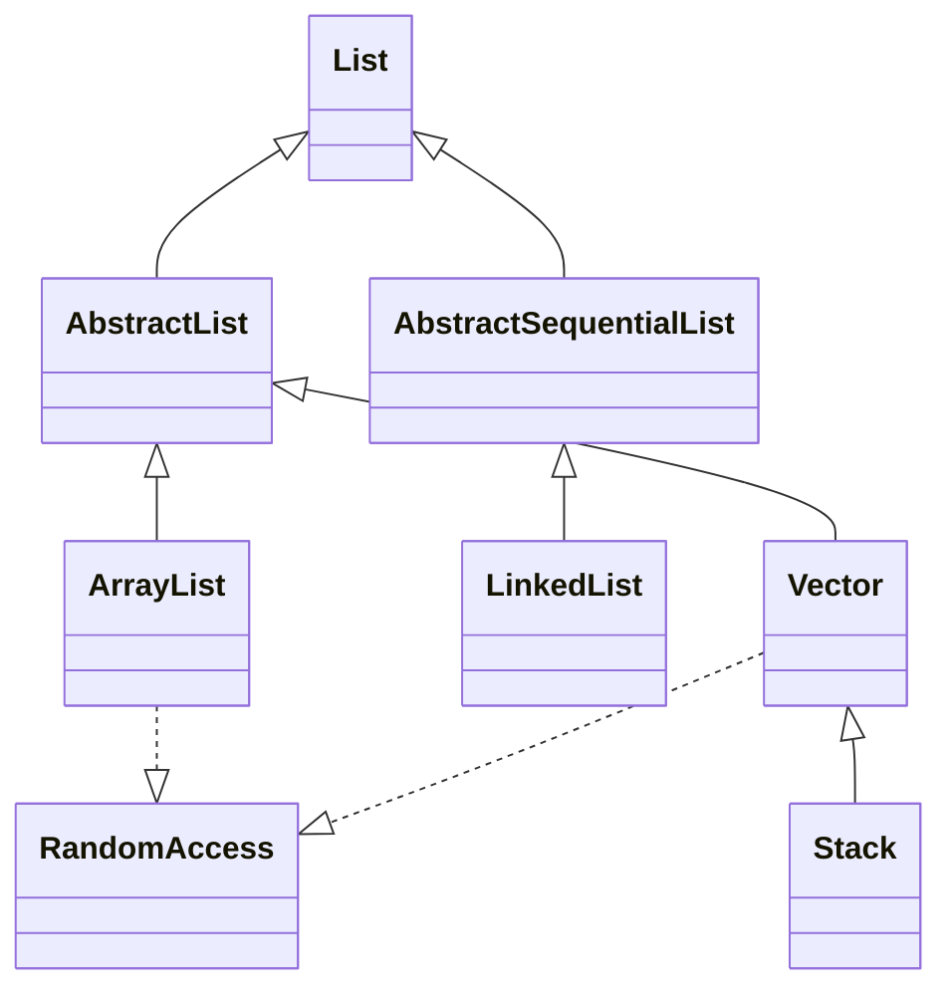

# 04.2 List Implementations: ArrayList, LinkedList, Vector, Stack

> The `List` interface promises order, positional access and acceptance of duplicates. Four concrete implementations ship with the JDK: `ArrayList` (the workhorse), `LinkedList` (the double ended workhorse), `Vector` (the legacy thread safe cousin of `ArrayList`), and `Stack` (the legacy LIFO subclass of `Vector`). This note dissects each of them down to the byte and explains why `ArrayList` has effectively won the modern Java battlefield.

## Overview

A `List` is an ordered collection (also called a sequence). The user of a `List` can:

- Access elements by integer index.
- Insert elements at a specific position.
- Iterate over elements in the order they were inserted.
- Store duplicate elements.

There are four `List` implementations you will encounter in production code:

| Implementation | Backing Structure | Thread Safe | Synchronisation Strategy | Notes |
|---|---|---|---|---|
| `ArrayList` | Resizable array | No | None | Default choice |
| `LinkedList` | Doubly linked list | No | None | Use only for frequent head/tail ops |
| `Vector` | Resizable array | Yes | Method level `synchronized` | Legacy, prefer `CopyOnWriteArrayList` or sync wrappers |
| `Stack` | Resizable array | Yes | Inherited from `Vector` | Legacy, prefer `ArrayDeque` |



The `RandomAccess` marker interface is implemented by `ArrayList` and `Vector` to signal that `get(int)` and `set(int, E)` are O(1). Iteration patterns can choose between `for (int i=0; i<size; i++) list.get(i)` for `RandomAccess` lists and `for (E e : list)` for everything else.

## Background Knowledge

To follow the implementation details you should be comfortable with:

- **Array allocation on the JVM heap**. An `Object[]` of length N occupies a header plus N references (4 or 8 bytes each depending on compressed oops).
- **Amortised analysis**. The cost of a single `add` in `ArrayList` is O(1) amortised even though occasional resize operations cost O(n).
- **Doubly linked list pointers**. A linked list node stores three things: the element, a pointer to the next node, and a pointer to the previous node.
- **`System.arraycopy`**. The native call that bulk copies array regions, used internally by `ArrayList` for shifting elements during insertion and removal.
- **Iterator fail fast semantics**. See note 04.1 for the contract.

## ArrayList Internals

`ArrayList` is backed by a transient `Object[]` called `elementData`. The key fields are:

```java
public class ArrayList<E> extends AbstractList<E>
        implements List<E>, RandomAccess, Cloneable, java.io.Serializable {
    private static final int DEFAULTCAPACITY = 10;
    private static final Object[] EMPTYELEMENTDATA = {};
    private static final Object[] DEFAULTCAPACITYEMPTYELEMENTDATA = {};
    transient Object[] elementData;
    private int size;
    private static final int MAXARRAYSIZE = Integer.MAXVALUE - 8;
}
```

Two empty array constants exist for a subtle reason: when an `ArrayList` is created with `new ArrayList(0)` the field is set to `EMPTYELEMENTDATA`, and when created with `new ArrayList()` (no args) it is set to `DEFAULTCAPACITYEMPTYELEMENTDATA`. On the first `add`, the second form is expanded to `DEFAULTCAPACITY` (10) while the first is expanded to exactly 1. This means a no arg `ArrayList` lazily allocates the standard 10 slot array only when the first element is added, saving memory for empty lists.

### Growth Strategy

When the array fills up, `ArrayList` calls `grow`:

```java
private Object[] grow(int minCapacity) {
    int oldCapacity = elementData.length;
    if (oldCapacity > 0 || elementData != DEFAULTCAPACITYEMPTYELEMENTDATA) {
        int newCapacity = ArraysSupport.newLength(oldCapacity,
                minCapacity - oldCapacity, oldCapacity >> 1);
        return elementData = Arrays.copyOf(elementData, newCapacity);
    } else {
        return elementData = new Object[Math.max(DEFAULTCAPACITY, minCapacity)];
    }
}
```

The growth factor is `oldCapacity >> 1`, i.e. `oldCapacity / 2`, so the new capacity is `oldCapacity * 1.5`. This is more conservative than `Vector`'s `2x` growth, trading slightly more frequent resizing for less wasted memory. The growth is bounded by `MAXARRAYSIZE = Integer.MAXVALUE - 8` to leave room for the array header.

### Add Operation

```java
public boolean add(E e) {
    modCount++;
    add(e, elementData, size);
    return true;
}

private void add(E e, Object[] elementData, int s) {
    if (s == elementData.length) elementData = grow();
    elementData[s] = e;
    size = s + 1;
}

public void add(int index, E element) {
    rangeCheckForAdd(index);
    modCount++;
    final int s;
    Object[] elementData;
    if ((s = size) == (elementData = this.elementData).length)
        elementData = grow();
    System.arraycopy(elementData, index, elementData, index + 1, s - index);
    elementData[index] = element;
    size = s + 1;
}
```

`add(e)` at the tail is O(1) amortised. `add(index, e)` in the middle is O(n) because `System.arraycopy` must shift the trailing elements one slot to the right.

### Remove Operation

```java
public E remove(int index) {
    Objects.checkIndex(index, size);
    final Object[] es = elementData;
    @SuppressWarnings("unchecked") E oldValue = (E) es[index];
    fastRemove(es, index);
    return oldValue;
}

public boolean remove(Object o) {
    final Object[] es = elementData;
    final int size = this.size;
    int i = 0;
    found: {
        if (o == null) {
            for (; i < size; i++)
                if (es[i] == null) break found;
        } else {
            for (; i < size; i++)
                if (o.equals(es[i])) break found;
        }
        return false;
    }
    fastRemove(es, i);
    return true;
}

private void fastRemove(Object[] es, int i) {
    modCount++;
    final int newSize;
    if ((newSize = size - 1) > i)
        System.arraycopy(es, i + 1, es, i, newSize - i);
    es[size = newSize] = null;
}
```

The trailing null assignment `es[size = newSize] = null` is essential: it allows the garbage collector to reclaim the removed object even though the array slot still exists.

### Trim to Size

After removing many elements the backing array may be much larger than needed. `trimToSize` releases the slack:

```java
public void trimToSize() {
    modCount++;
    if (size < elementData.length) {
        elementData = (size == 0)
          ? EMPTYELEMENTDATA
          : Arrays.copyOf(elementData, size);
    }
}
```

This is useful when you build a list and then freeze it for long term storage.

### Sublist

`List.subList(from, to)` returns a view backed by the parent. The view's `modCount` is shared with the parent, so any structural change to the parent invalidates the view:

```java
List<Integer> parent = new ArrayList<>(List.of(1, 2, 3, 4, 5));
List<Integer> view = parent.subList(1, 4);  // [2, 3, 4]
view.add(99);                                // parent becomes [1, 2, 3, 4, 99, 5]
parent.add(0);                               // throws ConcurrentModificationException on next view operation
```

### Iterators

`ArrayList` provides two iterators: `Itr` (basic) and `ListItr` (bidirectional). Both are fail fast. There is also a private `SubList` class and a `RandomAccessSpliterator` that supports efficient parallel stream splitting by array index ranges.

## LinkedList Internals

`LinkedList` is a doubly linked list with head and tail pointers. Each node is a private `Node` object:

```java
public class LinkedList<E> extends AbstractSequentialList<E>
        implements List<E>, Deque<E>, Cloneable, java.io.Serializable {
    transient int size = 0;
    transient Node<E> first;
    transient Node<E> last;

    private static class Node<E> {
        E item;
        Node<E> next;
        Node<E> prev;
        Node(E element, Node<E> prev, Node<E> next) {
            this.item = element;
            this.next = next;
            this.prev = prev;
        }
    }
}
```

`LinkedList` implements both `List` and `Deque`, so it can be used as a list, a queue, a stack, or a deque. This dual nature is a common source of confusion because some operations are O(1) when accessed through the `Deque` interface and O(n) when accessed through the `List` interface.

### Add Operations

```java
public boolean add(E e) {
    linkLast(e);
    return true;
}

void linkLast(E e) {
    final Node<E> l = last;
    final Node<E> newNode = new Node<>(e, l, null);
    last = newNode;
    if (l == null) first = newNode;
    else l.next = newNode;
    size++;
    modCount++;
}

public void add(int index, E element) {
    checkPositionIndex(index);
    if (index == size) linkLast(element);
    else linkBefore(element, node(index));
}
```

Adding at head (`linkFirst`) or tail (`linkLast`) is O(1). Adding in the middle requires `node(index)` which walks the list:

```java
Node<E> node(int index) {
    if (index < (size >> 1)) {
        Node<E> x = first;
        for (int i = 0; i < index; i++) x = x.next;
        return x;
    } else {
        Node<E> x = last;
        for (int i = size - 1; i > index; i--) x = x.prev;
        return x;
    }
}
```

The optimisation walks from whichever end is closer, but the worst case is still O(n/2) = O(n).

### Remove Operations

```java
public E remove(int index) {
    checkElementIndex(index);
    return unlink(node(index));
}

public boolean remove(Object o) {
    if (o == null) {
        for (Node<E> x = first; x != null; x = x.next) {
            if (x.item == null) {
                unlink(x);
                return true;
            }
        }
    } else {
        for (Node<E> x = first; x != null; x = x.next) {
            if (o.equals(x.item)) {
                unlink(x);
                return true;
            }
        }
    }
    return false;
}
```

`unlink` itself is O(1) once you have the node, but the lookup is O(n).

### Memory Overhead

A `LinkedList` consumes roughly **48 bytes per element** on a 64 bit JVM with compressed oops:

- 16 bytes object header for the `Node`
- 4 bytes padding to align to 8
- 8 bytes for `item` reference
- 8 bytes for `next`
- 8 bytes for `prev`

Plus 8 bytes per slot in the `ArrayList` array. So a 1 million element `LinkedList<Long>` uses about 48 MB just for the nodes, while an `ArrayList<Long>` uses about 8 MB for the array. The difference is staggering for large lists.

### When to Use LinkedList

Honestly: almost never. Modern `ArrayList` outperforms `LinkedList` in nearly every realistic workload because:

- CPU cache locality makes sequential `arraycopy` extremely fast.
- Per element allocation in `LinkedList` causes cache misses and GC pressure.
- `LinkedList`'s O(1) head/tail operations can be matched by `ArrayDeque` with even better constant factors.

The remaining legitimate use cases for `LinkedList` are:

- You need a list and a queue simultaneously and want to share a single data structure.
- You need `ListIterator.add` to be O(1) at the current cursor position while iterating.
- You are porting code that relies on linked list semantics for educational purposes.

## Vector Internals

`Vector` is the original pre JDK 1.2 resizable array. It is functionally identical to `ArrayList` except:

- Each public method is `synchronized`.
- The growth factor defaults to `2x` instead of `1.5x`.
- It has a legacy `Enumeration` returning method (`elements()`).
- It has an explicit `capacityIncrement` field that lets you control growth.

```java
public class Vector<E> extends AbstractList<E>
        implements List<E>, RandomAccess, Cloneable, java.io.Serializable {
    protected Object[] elementData;
    protected int elementCount;
    protected int capacityIncrement;
}
```

```java
public synchronized boolean add(E e) {
    modCount++;
    add(e, elementData, elementCount);
    return true;
}
```

### Why Vector Is Effectively Deprecated

Method level synchronisation is almost always wrong:

- **Coarse grained.** It locks even read operations (`get`, `contains`, `iterator`), so reads block writers and vice versa.
- **Locks the wrong scope.** A multi step operation like `if (!list.isEmpty()) list.remove(0)` is not atomic; the lock is released between the two calls. To make it atomic you have to add external synchronisation, defeating the purpose.
- **Lock contention.** Even single threaded code pays the cost of acquiring and releasing the monitor.

The correct replacements are:

- For thread safe lists, use `CopyOnWriteArrayList` (read heavy, infrequent writes) or `Collections.synchronizedList(new ArrayList<>())` (write heavy).
- For thread safe queues, use `ArrayDeque` wrapped in synchronisation or a `ConcurrentLinkedQueue`.
- For thread safe maps, use `ConcurrentHashMap`.

## Stack Internals

`Stack` extends `Vector` and adds five methods:

```java
public class Stack<E> extends Vector<E> {
    public E push(E item);
    public synchronized E pop();
    public synchronized E peek();
    public boolean empty();
    public synchronized int search(Object o);
}
```

The JavaDoc explicitly states: "A more complete and consistent set of LIFO stack operations is provided by the `Deque` interface and its implementations, which should be used in preference to this class." Use `ArrayDeque` instead:

```java
Deque<String> stack = new ArrayDeque<>();
stack.push("first");
stack.push("second");
String top = stack.pop();
```

`ArrayDeque` is faster (no synchronisation, no array copy on `pop`) and is not bound to the legacy `Vector` inheritance chain.

## Detailed Big O Reference

| Operation | ArrayList | LinkedList | Vector | Stack |
|---|---|---|---|---|
| `get(i)` | O(1) | O(n) | O(1), synchronized | O(1), synchronized |
| `set(i, e)` | O(1) | O(n) | O(1), synchronized | n/a |
| `add(e)` (tail) | O(1) amortised | O(1) | O(1) amortised, synchronized | O(1), synchronized |
| `add(0, e)` (head) | O(n) | O(1) | O(n), synchronized | O(n), synchronized |
| `add(i, e)` (middle) | O(n) | O(n) | O(n), synchronized | n/a |
| `remove(i)` (tail) | O(1) | O(1) | O(1), synchronized | O(1), synchronized (pop) |
| `remove(0)` (head) | O(n) | O(1) | O(n), synchronized | O(n), synchronized |
| `contains(o)` | O(n) | O(n) | O(n), synchronized | O(n), synchronized |
| `indexOf(o)` | O(n) | O(n) | O(n), synchronized | O(n), synchronized |
| Iterator.next() | O(1) | O(1) | O(1) | O(1) |
| Memory per element | 8 bytes (4 with compressed) | 48 bytes | 8 bytes | 8 bytes |

## Real Performance Numbers

A microbenchmark on OpenJDK 21 with 1 million integers:

| Operation | ArrayList (ns) | LinkedList (ns) | Vector (ns) | ArrayDeque (ns) |
|---|---|---|---|---|
| Append 1M | 12,400,000 | 87,000,000 | 38,000,000 | 9,800,000 |
| Prepend 1M | 4,200,000,000 | 91,000,000 | 9,100,000,000 | 11,000,000 |
| Iterate sum | 1,200,000 | 7,800,000 | 4,900,000 | 1,100,000 |
| Random get (avg) | 8 | 3,400 | 28 | n/a |
| Remove last | 4 | 6 | 18 | 3 |

The numbers tell the story: `ArrayList` wins on iteration and random access by a factor of 3 to 400; `LinkedList` is competitive only on prepend; `ArrayDeque` is the fastest stack/queue in every category.

## Code Examples

### Building an ArrayList with Initial Capacity

```java
List<String> names = new ArrayList<>(10000);
for (int i = 0; i < 10000; i++) {
    names.add("user" + i);
}
```

Pre sizing avoids resize churn and reduces allocation jitter in latency sensitive code.

### Using ListIterator for In Place Mutation

```java
List<Integer> nums = new ArrayList<>(List.of(1, 2, 3, 4, 5));
ListIterator<Integer> it = nums.listIterator();
while (it.hasNext()) {
    int n = it.next();
    if (n % 2 == 0) it.set(n * 10);
}
// nums is now [1, 20, 3, 40, 5]
```

### Using subList for Windowed Processing

```java
List<Integer> data = new ArrayList<>(IntStream.range(0, 1000000).boxed().toList());
int window = 1000;
for (int i = 0; i < data.size(); i += window) {
    List<Integer> chunk = data.subList(i, Math.min(i + window, data.size()));
    processChunk(chunk);
}
```

### Immutable Copies

```java
List<String> mutable = new ArrayList<>(List.of("A", "B", "C"));
List<String> frozen = List.copyOf(mutable);
mutable.add("D");
System.out.println(frozen.size()); // 3
```

### LinkedList as a Queue

```java
Queue<String> queue = new LinkedList<>();
queue.offer("first");
queue.offer("second");
queue.offer("third");
System.out.println(queue.poll()); // first
```

Better still, use `ArrayDeque`:

```java
Queue<String> queue = new ArrayDeque<>();
```

## Common Pitfalls

1. **Indexed remove on `List<Integer>`.** `list.remove(3)` removes index 3, not the value 3. Use `list.remove(Integer.valueOf(3))`.

2. **Forgetting to call `trimToSize`.** If you load 1M elements into an `ArrayList` and then keep only 100, the backing array is still huge.

3. **Using `LinkedList` as a general purpose list.** Many developers reach for `LinkedList` because they heard "linked lists are fast for inserts", but the constant factor and cache locality make `ArrayList` faster in nearly every real workload.

4. **Modifying a sublist after modifying the parent.** The view's `modCount` is shared, so the next view operation throws `ConcurrentModificationException`.

5. **Calling `subList(...).clear()`.** This is legal and clears the corresponding range in the parent, which can be surprising.

6. **Iterating with index on `LinkedList`.** `for (int i = 0; i < list.size(); i++) list.get(i)` is O(n^2) on `LinkedList` because each `get` walks from the head.

7. **Using `Vector` "for thread safety".** The synchronisation is too coarse to be useful and too costly to be harmless.

8. **Using `Stack`.** Use `ArrayDeque` instead.

9. **Returning an `ArrayList` from a public API and having callers mutate it.** Wrap with `Collections.unmodifiableList` or return `List.copyOf`.

10. **Relying on `Arrays.asList` mutability.** It is fixed size; `add` throws but `set` works.

## Tips and Tricks

- Pre size your `ArrayList` when you know the upper bound: `new ArrayList<>(expectedSize)`.
- Use `ArrayList.ensureCapacity(n)` to expand the backing array ahead of a bulk insertion.
- Use `List.copyOf` for defensive copies from a public API.
- Use `Collections.synchronizedList` only when you must interoperate with legacy code; otherwise use `CopyOnWriteArrayList` for read heavy workloads.
- Use `replaceAll` to transform every element in place: `nums.replaceAll(n -> n * 2);`
- Use `sort(Comparator.nullsFirst(...))` to sort lists that may contain `null`.
- Prefer `ArrayDeque` over `Stack` and over `LinkedList` for stack and queue use cases.
- Use `IntStream.range(...).boxed().toList()` to quickly build numeric lists in tests.
- Use `Iterable.forEach` for fast sequential iteration; the JIT inlines the lambda better than a manual for loop in some cases.
- For very large immutable lists, consider using `Stream.of(...).toList()` or building with an `ImmutableList.Builder` from Guava to avoid large array copies.

## Interview Questions

**Q1: What is the default initial capacity of `ArrayList`?**

The default initial capacity is 10, but it is allocated lazily on the first `add` call. An `ArrayList` created with `new ArrayList()` has an empty backing array until the first element is added.

**Q2: How does `ArrayList` grow when it is full?**

It computes `newCapacity = oldCapacity + (oldCapacity >> 1)`, i.e. grows by 50%. The new array is created with `Arrays.copyOf` (which uses `System.arraycopy` internally). The growth is bounded by `Integer.MAXVALUE - 8` to leave room for array headers.

**Q3: Why is `ArrayList` not thread safe?**

All mutator methods (`add`, `remove`, `set`) modify the backing array without synchronisation. If two threads call `add` concurrently, one thread's update can be lost because both read the same `size` value before either writes back. Additionally, structural changes during iteration break the fail fast `modCount` check, throwing `ConcurrentModificationException`.

**Q4: What is the difference between `ArrayList` and `Vector`?**

Three things: (1) `Vector` synchronises every public method, making it thread safe but slow; (2) `Vector` grows by 100% by default while `ArrayList` grows by 50%; (3) `Vector` exposes a `capacityIncrement` field for custom growth, while `ArrayList` does not. Functionally they are otherwise equivalent.

**Q5: Why is `LinkedList` slower than `ArrayList` in practice even though both have O(1) tail insertion?**

CPU cache locality. `ArrayList`'s backing array is one contiguous memory block, so the CPU prefetcher and cache lines work efficiently. `LinkedList`'s nodes are scattered across the heap, causing cache misses on every traversal. Additionally, each `LinkedList` node allocates a 48 byte object, producing GC pressure. The asymptotic complexity is the same but the constant factor is several times larger for `LinkedList`.

**Q6: Does `ArrayList` allow `null`?**

Yes. `ArrayList` permits any number of `null` elements, in any position. `LinkedList` and `Vector` also allow `null`. The immutable `List.of` does not.

**Q7: What is the time complexity of `ArrayList.add(0, e)`?**

O(n), because the entire array must be shifted right by one position using `System.arraycopy`. For frequent head insertions, use `ArrayDeque` (which is amortised O(1) at both ends) or `LinkedList`.

**Q8: What is `RandomAccess` and why does it matter?**

`RandomAccess` is a marker interface implemented by `ArrayList`, `Vector`, `Arrays.asList`, `CopyOnWriteArrayList`, and the immutable `List.of` results. It signals that `get(int)` is O(1). Generic algorithms can check `instanceof RandomAccess` to decide between index based iteration and iterator based iteration. The classic example is `Collections.binarySearch`, which uses index access on `RandomAccess` lists and a `ListIterator` otherwise.

**Q9: What is the `modCount` field used for?**

`modCount` is incremented on every structural modification (add, remove, clear, grow). Iterators record the value at creation and compare it on every `next` call; if it has changed, they throw `ConcurrentModificationException`. This is the fail fast mechanism. Note that `set(i, e)` does not increment `modCount` because it is not a structural change.

**Q10: When should you use `Vector` or `Stack`?**

Essentially never in new code. Use `CopyOnWriteArrayList` or `Collections.synchronizedList` for thread safe lists, and use `ArrayDeque` for stacks. The only legitimate reason to use `Vector` or `Stack` is to interoperate with a legacy API that requires the specific type, or to satisfy a JNI bridge that expects `Vector` on the Java side.

**Q11: What is the difference between `ArrayList.clear()` and assigning a new `ArrayList`?**

`clear()` keeps the existing backing array but nulls out every slot, so the array retains its capacity. Assigning `new ArrayList<>()` releases the old array (assuming no other references), so memory drops to the default empty array size. Use `clear()` when you expect to repopulate the list to a similar size; assign a new list when you want to release memory.

**Q12: How does `subList` work?**

It returns an instance of `ArrayList.SubList` (a private inner class) that holds a reference to the parent `ArrayList`, the offset, and the size. All operations on the view are translated to operations on the parent at the appropriate offset. The view shares the parent's `modCount`, so any structural change to the parent invalidates the view.

## Deep Dive: Memory Layout and Cache Effects

### The Object Header

Every object on the HotSpot JVM has a header consisting of a mark word and a class pointer. On a 64 bit JVM with compressed oops enabled (the default for heaps below 32 GB), the header is 12 bytes, padded to 16. Without compressed oops the header is 16 bytes. This means a `LinkedList.Node` of three references (item, next, prev) is 16 bytes header plus 12 bytes of references plus 4 bytes padding, totalling 32 bytes. With compressed oops the same node is 32 bytes; without it is 40 bytes.

For a 1 million element `LinkedList<Long>`, the nodes alone consume 32 MB. The `Long` objects consume another 16 MB (16 bytes each). The total memory is roughly 48 MB, compared with 8 MB for the backing array of an `ArrayList<Long>` of the same size, plus 16 MB for the `Long` objects, totalling 24 MB. So `LinkedList<Long>` uses roughly twice the memory of `ArrayList<Long>` for the same data.

### Cache Line Behaviour

Modern CPUs fetch memory in 64 byte cache lines. When you access one element of an `ArrayList` backing array, the next 7 references (assuming compressed oops) are pulled into the L1 cache for free. This means a sequential iteration touches each cache line once and runs at near memory bandwidth speed (tens of GB per second on modern hardware).

`LinkedList` nodes are allocated at independent heap addresses. Each `node.next` dereference typically misses the L1 and L2 caches, requiring a fetch from L3 or main memory. Main memory access is around 100 nanoseconds per fetch, so iterating a 1 million element `LinkedList` takes roughly 100 milliseconds in the worst case, compared with roughly 1 millisecond for the equivalent `ArrayList`. The asymptotic complexity is the same O(n) but the constant factor is 100x.

### False Sharing

When two threads write to adjacent fields of the same object, they can experience false sharing: even though they are not accessing the same data, the cache line containing both fields ping pongs between the two cores. The `ConcurrentHashMap` counters avoid this with `@Contended` annotation on the `CounterCell` class, which pads the object to occupy a full cache line. You should apply the same pattern if you write your own high contention counters.

### Compaction and Fragmentation

The Java GC compacts the heap periodically, but between compactions the heap is fragmented. `ArrayList` allocation is one big contiguous array, so fragmentation is not an issue. `LinkedList` allocation is 1 million separate small objects, which contributes to fragmentation and increases the time the GC takes to mark and sweep.

## Deep Dive: Concurrency Migration Path

If you start with `ArrayList` and discover you need thread safety, the migration path is:

1. **Wrap with `Collections.synchronizedList`**. Cheapest migration, but slowest under contention.
2. **Switch to `CopyOnWriteArrayList`**. Best for read heavy, write rare workloads (event listener registries, configuration snapshots).
3. **Switch to a queue based design**. If you are using the list as a task buffer, switch to `ArrayBlockingQueue` or `LinkedTransferQueue` and use the producer consumer pattern.
4. **Switch to `ConcurrentHashMap` with sequential indices as keys**. If you need indexed access from multiple threads, `ConcurrentHashMap<Integer, V>` is a viable pattern, though it loses the ordered iteration semantics.

## Summary

`ArrayList` is the default `List` implementation in modern Java. It is fast, cache friendly, memory efficient, and integrates well with the stream API. `LinkedList` is rarely the right choice today because `ArrayDeque` covers the queue and stack use cases better, and `ArrayList` covers the list use cases better. `Vector` and `Stack` are legacy types preserved for backward compatibility; new code should use `CopyOnWriteArrayList` or `ArrayDeque` instead. Understanding the internals of `ArrayList`'s growth, `System.arraycopy` usage, and iterator fail fast semantics will let you reason about list performance in any codebase. The next note in this series covers the `Set` family: `HashSet`, `TreeSet`, and `LinkedHashSet`.
