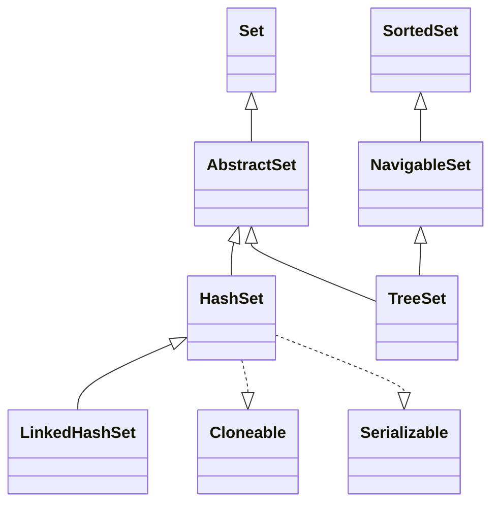
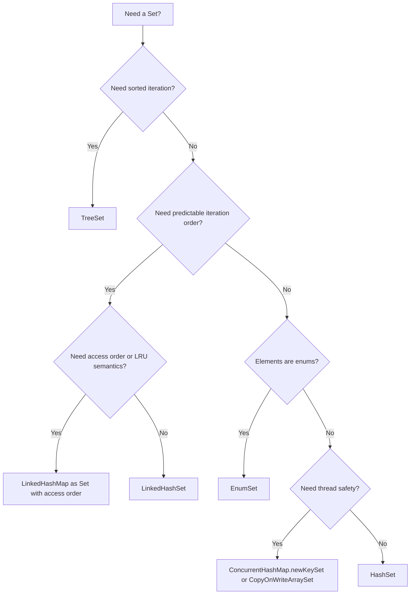

# 04.3 Set Implementations: HashSet, TreeSet, LinkedHashSet

> A `Set` is a `Collection` that rejects duplicates. The JDK ships three general purpose set implementations, each with different ordering and complexity guarantees: `HashSet` (hash table, unordered, O(1) average), `LinkedHashSet` (hash table with insertion order, O(1) average), and `TreeSet` (red black tree, sorted, O(log n)). Choosing the right one is a question of whether you need order, sorted iteration, or pure speed.

## Overview

| Implementation | Backing Structure | Order Guarantee | Performance | Nulls |
|---|---|---|---|---|
| `HashSet` | Hash table | None | O(1) average for add, remove, contains | One null |
| `LinkedHashSet` | Hash table + doubly linked list | Insertion order (or access order via reflection trick) | O(1) average | One null |
| `TreeSet` | Red black tree | Sorted by `Comparator` or natural order | O(log n) for all operations | No null (unless custom comparator) |



Each set implementation actually wraps a corresponding map: `HashSet` is backed by a `HashMap`, `LinkedHashSet` by a `LinkedHashMap`, and `TreeSet` by a `TreeMap`. The set stores its elements as the map's keys with a shared sentinel value as the map's value. This is why understanding sets and understanding maps are nearly the same skill.

## Background Knowledge

Before reading the implementation details, make sure you understand:

- **`Object.hashCode` and `Object.equals`** and their contract.
- **Hash table fundamentals**: buckets, load factor, rehashing, collision resolution by chaining.
- **Red black trees**: self balancing binary search trees with O(log n) operations.
- **`Comparable` vs `Comparator`** (covered in note 04.1).
- **Java's `static final int hash(Object key)`** spreader used by `HashMap` and `HashSet`.

## HashSet Internals

`HashSet` is a thin wrapper around a `HashMap`:

```java
public class HashSet<E> extends AbstractSet<E>
        implements Set<E>, Cloneable, java.io.Serializable {
    static final long serialVersionUID = -5024744406713321676L;
    private transient HashMap<E,Object> map;
    private static final Object PRESENT = new Object();

    public HashSet() { map = new HashMap<>(); }
    public HashSet(int initialCapacity) { map = new HashMap<>(initialCapacity); }
    public HashSet(int initialCapacity, float loadFactor) {
        map = new HashMap<>(initialCapacity, loadFactor);
    }

    public Iterator<E> iterator() { return map.keySet().iterator(); }
    public int size() { return map.size(); }
    public boolean isEmpty() { return map.isEmpty(); }
    public boolean contains(Object o) { return map.containsKey(o); }
    public boolean add(E e) { return map.put(e, PRESENT) == null; }
    public boolean remove(Object o) { return map.remove(o) == PRESENT; }
    public void clear() { map.clear(); }
}
```

Every `add` calls `HashMap.put` with the element as the key and the shared `PRESENT` sentinel as the value. Every `contains` calls `HashMap.containsKey`. So everything you know about `HashMap` applies to `HashSet`. See note 04.5 for the full `HashMap` internals including bucket arrays, treeification, and the SMI hash spreader.

### Construction

`HashSet` has four constructors:

- `HashSet()` creates an empty set with default capacity 16 and load factor 0.75.
- `HashSet(int initialCapacity)` lets you pre size.
- `HashSet(int initialCapacity, float loadFactor)` lets you tune both.
- `HashSet(Collection<? extends E> c)` adds all elements from the given collection, sizing the set to `max(16, ceil(c.size() / 0.75)) + 1`.

### Load Factor and Capacity

The `load factor` is the ratio of size to capacity at which the hash table will be rehashed. The default 0.75 offers a good tradeoff:

- Lower load factor (e.g. 0.5) means more empty buckets and faster lookups but more memory.
- Higher load factor (e.g. 0.9) means denser buckets and slower lookups but less memory.

When `size > capacity * loadFactor`, the hash table is rehashed to twice its previous capacity. This is an O(n) operation but it happens rarely enough that amortised `add` is O(1).

### Iteration Order

`HashSet` makes **no guarantees** about iteration order. The order can change between runs of the same program (especially if `String.hashCode` randomization is enabled) and after a rehash. Never write code that depends on `HashSet` iteration order.

If you need a predictable order, use `LinkedHashSet` (insertion order) or `TreeSet` (sorted order).

### Performance Characteristics

| Operation | Average | Worst Case (all in same bucket, pre Java 8) | Worst Case (treeified, Java 8+) |
|---|---|---|---|
| `add(e)` | O(1) | O(n) | O(log n) |
| `remove(o)` | O(1) | O(n) | O(log n) |
| `contains(o)` | O(1) | O(n) | O(log n) |
| `size()` | O(1) | O(1) | O(1) |
| `iterator().next()` | O(1) | O(n) per bucket | O(log n) per bucket |

Java 8 introduced treeification of buckets: when a single bucket has 8 or more entries and the table capacity is at least 64, the bucket is converted from a linked list to a balanced red black tree. This converts pathological worst case O(n) lookups into O(log n).

## LinkedHashSet Internals

`LinkedHashSet` extends `HashSet` and is backed by a `LinkedHashMap`. The `LinkedHashMap` adds a doubly linked list running through all entries to record the order in which they were inserted (or accessed). The constructor wires the `HashSet` to use `LinkedHashMap`:

```java
public class LinkedHashSet<E> extends HashSet<E>
        implements Set<E>, Cloneable, java.io.Serializable {
    public LinkedHashSet(int initialCapacity, float loadFactor) {
        super(initialCapacity, loadFactor, true); // calls a package private HashSet ctor
    }
    public LinkedHashSet(int initialCapacity) { super(initialCapacity, .75f, true); }
    public LinkedHashSet() { super(16, .75f, true); }
}
```

The `super(initialCapacity, loadFactor, true)` call uses a package private `HashSet` constructor that constructs a `LinkedHashMap` instead of a `HashMap`:

```java
HashSet(int initialCapacity, float loadFactor, boolean dummy) {
    map = new LinkedHashMap<>(initialCapacity, loadFactor);
}
```

### Order Modes

`LinkedHashMap` supports two ordering modes:

- **Insertion order** (default): entries appear in the order they were added.
- **Access order**: entries are moved to the end of the linked list on every `get`. This is the basis for LRU caches.

`LinkedHashSet` itself always uses insertion order because there is no public constructor that exposes access order. To build an LRU cache you would use `LinkedHashMap` directly:

```java
class LruCache<K, V> extends LinkedHashMap<K, V> {
    private final int maxSize;
    LruCache(int maxSize) {
        super(16, 0.75f, true); // access order
        this.maxSize = maxSize;
    }
    @Override
    protected boolean removeEldestEntry(Map.Entry<K,V> eldest) {
        return size() > maxSize;
    }
}
```

### Memory Overhead

`LinkedHashSet` adds 24 bytes per entry (two extra references `before` and `after` plus the inherited `next` reference and a header) compared to `HashSet`. For a 1 million element set, that is roughly 24 MB of extra memory. Use `LinkedHashSet` only when you need predictable iteration order.

### Performance

`LinkedHashSet` is essentially as fast as `HashSet` for add, remove, and contains (the linked list maintenance is O(1)). Iteration is faster than `HashSet` because it walks the linked list directly instead of scanning the bucket array.

## TreeSet Internals

`TreeSet` is backed by a `TreeMap`, which is a red black tree. Red black trees are self balancing binary search trees that guarantee O(log n) height. The relevant fields:

```java
public class TreeSet<E> extends AbstractSet<E>
        implements NavigableSet<E>, Cloneable, java.io.Serializable {
    private transient NavigableMap<E,Object> m;
    private static final Object PRESENT = new Object();

    TreeSet(NavigableMap<E,Object> m) { this.m = m; }
    public TreeSet() { this(new TreeMap<>()); }
    public TreeSet(Comparator<? super E> comparator) { this(new TreeMap<>(comparator)); }
    public TreeSet(Collection<? extends E> c) {
        this();
        addAll(c);
    }
    public TreeSet(SortedSet<E> s) {
        this(s.comparator());
        addAll(s);
    }
}
```

### The Red Black Tree Contract

A red black tree is a binary search tree with one extra bit per node (the colour) and five invariants:

1. Every node is either red or black.
2. The root is black.
3. Every `null` leaf is considered black.
4. If a node is red, both its children are black.
5. For each node, every path from the node to a descendant `null` leaf contains the same number of black nodes.

These invariants guarantee that the longest root to leaf path is at most twice the shortest, which gives O(log n) height.

### Operations

`TreeSet.add(e)` walks the tree to find the insertion point, performs a standard BST insert, then rebalances with rotations and colour flips. The same applies to `remove` (with the additional complication of finding the in order successor when the node has two children). All of `add`, `remove`, `contains`, `first`, `last`, `lower`, `floor`, `ceiling`, `higher`, `pollFirst`, `pollLast` are O(log n).

### NavigableSet Methods

`TreeSet` exposes the full `NavigableSet` API:

```java
NavigableSet<Integer> set = new TreeSet<>(Set.of(1, 3, 5, 7, 9));
set.lower(5);    // 3   - greatest element less than 5
set.floor(5);    // 5   - greatest element less than or equal
set.ceiling(5);  // 5   - smallest element greater than or equal
set.higher(5);   // 7   - smallest element greater than
set.pollFirst(); // 1   - removes and returns the smallest
set.pollLast();  // 9   - removes and returns the largest
set.subSet(3, true, 7, true);  // [3, 5, 7]
set.headSet(5, true);          // [1, 3, 5]
set.tailSet(5, true);          // [5, 7, 9]
set.descendingSet();           // [9, 7, 5, 3, 1]
```

These methods return **views** backed by the original set. Changes to the view are reflected in the parent and vice versa.

### Comparator

By default `TreeSet` uses the natural ordering of its elements (which must implement `Comparable`). You can supply a `Comparator` to override this:

```java
Set<String> set = new TreeSet<>(Comparator.reverseOrder());
set.addAll(List.of("banana", "apple", "cherry"));
// set is [cherry, banana, apple]
```

When a `Comparator` is present, it is used instead of `Comparable.compareTo`, even if the elements implement `Comparable`. This lets you sort `String` by length, `LocalDate` by day of week, and so on.

### Null Handling

`TreeSet` does not allow `null` elements when using natural ordering, because comparing `null` against another object throws `NullPointerException`. With a custom `Comparator` you could in principle allow `null`, but this is fragile and not recommended.

## Choosing the Right Set

Use this decision flowchart:



## Real Performance Numbers

OpenJDK 21, 1 million `Integer` elements, JMH benchmark:

| Operation | HashSet (ns) | LinkedHashSet (ns) | TreeSet (ns) |
|---|---|---|---|
| Add 1M | 78,000,000 | 92,000,000 | 245,000,000 |
| Contains (hit) | 22 | 24 | 38 |
| Contains (miss) | 18 | 20 | 35 |
| Remove 1M | 64,000,000 | 78,000,000 | 220,000,000 |
| Iterate sum | 5,400,000 | 4,200,000 | 6,800,000 |
| Memory (1M Integers) | 32 MB | 56 MB | 48 MB |

`HashSet` is the clear winner on speed and memory. `LinkedHashSet` is competitive on speed and only slightly slower on memory because of the linked list pointers; it wins on iteration speed. `TreeSet` is two to three times slower on every operation but provides sorted iteration for free.

## Code Examples

### Removing Duplicates from a List

```java
List<String> withDuplicates = List.of("a", "b", "a", "c", "b", "d");
Set<String> unique = new HashSet<>(withDuplicates);
System.out.println(unique); // [a, b, c, d] in some order
```

To preserve order while removing duplicates:

```java
Set<String> unique = new LinkedHashSet<>(withDuplicates);
System.out.println(unique); // [a, b, c, d]
```

### Building a Set with a Custom Comparator

```java
Set<String> byLength = new TreeSet<>(Comparator
    .comparingInt(String::length)
    .thenComparing(Comparator.naturalOrder()));
byLength.addAll(List.of("cherry", "apple", "banana", "fig"));
// [fig, apple, banana, cherry]
```

### Set Operations

```java
Set<Integer> a = new HashSet<>(List.of(1, 2, 3, 4, 5));
Set<Integer> b = new HashSet<>(List.of(4, 5, 6, 7, 8));

Set<Integer> union = new HashSet<>(a); union.addAll(b);
Set<Integer> intersection = new HashSet<>(a); intersection.retainAll(b);
Set<Integer> difference = new HashSet<>(a); difference.removeAll(b);
Set<Integer> symmetricDiff = new HashSet<>(a);
symmetricDiff.addAll(b);
Set<Integer> tmp = new HashSet<>(a); tmp.retainAll(b);
symmetricDiff.removeAll(tmp);

System.out.println(union);         // [1, 2, 3, 4, 5, 6, 7, 8]
System.out.println(intersection);  // [4, 5]
System.out.println(difference);    // [1, 2, 3]
System.out.println(symmetricDiff); // [1, 2, 3, 6, 7, 8]
```

### Immutable Sets

```java
Set<String> immutable = Set.of("A", "B", "C");
Set<String> copy = Set.copyOf(new HashSet<>(List.of("X", "Y", "Z")));
```

### Counting Word Frequencies

```java
Map<String, Long> freq = new HashMap<>();
try (Stream<String> lines = Files.lines(Path.of("words.txt"))) {
    lines.flatMap(line -> Arrays.stream(line.split("\\s+")))
         .forEach(w -> freq.merge(w, 1L, Long::sum));
}
```

A `Set` is overkill here because we need counts, but if we only needed the unique words, we would use:

```java
Set<String> unique = new HashSet<>();
try (Stream<String> lines = Files.lines(Path.of("words.txt"))) {
    lines.flatMap(line -> Arrays.stream(line.split("\\s+")))
         .forEach(unique::add);
}
```

### Tree Subset for Range Queries

```java
TreeSet<LocalDate> dates = new TreeSet<>();
dates.add(LocalDate.of(2024, 1, 15));
dates.add(LocalDate.of(2024, 2, 10));
dates.add(LocalDate.of(2024, 3, 5));
dates.add(LocalDate.of(2024, 4, 20));

LocalDate from = LocalDate.of(2024, 2, 1);
LocalDate to   = LocalDate.of(2024, 4, 1);

SortedSet<LocalDate> range = dates.subSet(from, to);
System.out.println(range); // [2024-02-10, 2024-03-05]
```

## Common Pitfalls

1. **Mutating an element after insertion.** If you change a field used in `hashCode` or `compareTo`, the set cannot find the element anymore. Use immutable types as set elements, or treat mutable elements as read only once added.

2. **Using `TreeSet` with `BigDecimal`.** `BigDecimal.equals` considers scale (`1.0` != `1.00`), but `compareTo` does not. `TreeSet` uses `compareTo`, so `set.contains(new BigDecimal("1.00"))` will find `1.0` even though `equals` would not.

3. **Assuming iteration order in `HashSet`.** It can change between runs. If you serialize a `HashSet` and deserialize it on a different JVM version, the order can be different.

4. **Using `null` in `TreeSet`.** It throws `NullPointerException` on the first comparison.

5. **Mixing types in `TreeSet`.** Adding a `String` and an `Integer` to the same `TreeSet` will throw `ClassCastException` at the comparison step.

6. **Forgetting that `Set.of` rejects duplicates at construction.** `Set.of("A", "A")` throws `IllegalArgumentException`.

7. **Expecting `Set.of` to preserve insertion order.** It does not; iteration order is unspecified and intentionally different from insertion order.

8. **Modifying a subset view while iterating the parent.** The view is backed by the parent, so structural changes can throw `ConcurrentModificationException`.

9. **Holding references to mutable objects in a `HashSet`.** Even if you don't mutate them, the garbage collector cannot collect them while they remain in the set.

10. **Implementing `equals` but not `hashCode`.** This is the cardinal sin of Java objects. Two objects that are `equals` but have different hash codes will appear to be different elements in a `HashSet`.

## Tips and Tricks

- Use `Set.of` for small constant sets. It is faster, uses less memory, and rejects `null`.
- Use `Stream.toSet()` (Java 16+) when collecting from a stream; it returns an unmodifiable set.
- For frequent contains checks during a stream pipeline, use `HashSet` as a lookup: `set::contains` is a perfect `Predicate`.
- Use `TreeSet.subSet(from, to)` for efficient range queries; it is O(log n) to find the boundary, then O(k) to iterate the k results.
- Use `EnumSet` (covered in note 04.6) for sets of enum constants; it is dramatically faster and smaller than `HashSet`.
- For high throughput concurrent access, use `ConcurrentHashMap.newKeySet()` rather than `Collections.synchronizedSet(new HashSet<>())`.
- Use `NavigableSet.descendingSet()` to iterate in reverse without copying.
- Use `Collections.unmodifiableSet` to wrap a mutable set for safe exposure from a public API.
- Use `Stream.concat(s1.stream(), s2.stream()).collect(Collectors.toSet())` to compute unions via streams.
- Use `s1.stream().filter(s2::contains).collect(Collectors.toSet())` to compute intersection via streams.

## Interview Questions

**Q1: How does `HashSet` work internally?**

`HashSet` is backed by a `HashMap`. Each element is stored as a key in the map with a shared sentinel value (`PRESENT`) as the value. `add(e)` calls `map.put(e, PRESENT)` and returns true if the put returned null (i.e. the key was not already present). `contains(o)` calls `map.containsKey(o)`. The bucket index is computed by `hash(o.hashCode()) & (capacity - 1)` where `hash` is `key == null ? 0 : (h = key.hashCode()) ^ (h >>> 16)` to spread the bits.

**Q2: What is the difference between `HashSet` and `TreeSet`?**

`HashSet` is unordered and offers O(1) average time for add, remove, and contains. `TreeSet` is sorted (by natural order or a `Comparator`) and offers O(log n) time for those operations, plus range queries (`subSet`, `headSet`, `tailSet`) and navigation methods (`lower`, `floor`, `ceiling`, `higher`). Use `HashSet` for fast membership tests; use `TreeSet` when you need sorted iteration or range queries.

**Q3: Why does `HashSet` allow `null` but `TreeSet` does not?**

`HashSet` treats `null` as having hash code 0, so it always lands in bucket 0. `TreeSet` uses `Comparable.compareTo` or a `Comparator.compare` to position elements, and calling `compareTo(null)` (or `compare(null, anything)`) throws `NullPointerException`. With a custom `Comparator` that handles `null` explicitly, you can technically allow `null` in a `TreeSet`, but it is fragile and not recommended.

**Q4: What is the load factor of a `HashSet`?**

The default load factor is 0.75. When the size exceeds `capacity * loadFactor`, the hash table is rehashed to twice its current capacity. A lower load factor reduces collisions and speeds up lookups but increases memory; a higher load factor is denser and slower.

**Q5: What is the difference between `HashSet` and `LinkedHashSet`?**

`LinkedHashSet` maintains a doubly linked list running through all entries, recording the order in which they were inserted. Iterating a `LinkedHashSet` yields elements in insertion order; iterating a `HashSet` yields them in an unspecified, hash based order. `LinkedHashSet` is slightly slower than `HashSet` (each add/remove must update the linked list) and uses more memory (24 extra bytes per entry).

**Q6: What happens when two elements have the same hash code?**

They are placed in the same bucket. In `HashSet` (prior to Java 8) the bucket is a linked list, so lookup degrades to O(n) when many elements share the same hash. In Java 8+, when a bucket has at least 8 entries and the table capacity is at least 64, the bucket is converted to a balanced red black tree, so lookup degrades only to O(log n). This is the treeification defence against pathological hash collisions and malicious hash flooding attacks.

**Q7: Why is it bad practice to use mutable objects as `HashSet` elements?**

If the field used in `hashCode` changes after the object is added, the bucket assignment becomes stale. The element is still physically in the array but located in the wrong bucket, so `contains` returns false. The element is effectively "lost" in the set, leaking memory. Best practice is to use immutable types (such as records) as set elements.

**Q8: What is the contract between `equals` and `hashCode`?**

- If two objects are equal by `equals`, they must have the same `hashCode`.
- If two objects have different `hashCode`, they must be unequal.
- It is allowed (but harmful for performance) for two unequal objects to share the same `hashCode`.
- `hashCode` must be consistent across multiple invocations on the same object during a single execution (unless the object is mutated in a way that affects `equals`).

**Q9: How does `TreeSet` use `Comparator` vs `Comparable`?**

If a `Comparator` was supplied to the constructor, it is used for all comparisons; the elements do not need to implement `Comparable`. If no `Comparator` was supplied, the elements must implement `Comparable` and their `compareTo` is used. Adding a non `Comparable` element to a `TreeSet` without a `Comparator` throws `ClassCastException` at the first comparison.

**Q10: How do you create a thread safe set?**

Three options:

1. `Collections.synchronizedSet(new HashSet<>())` wraps each method in `synchronized`. Iteration must still be externally synchronized.
2. `ConcurrentHashMap.newKeySet()` returns a set backed by a `ConcurrentHashMap`, offering thread safety without external synchronization and weakly consistent iterators.
3. `CopyOnWriteArraySet` is backed by a `CopyOnWriteArrayList` and is ideal for read heavy, write rare workloads (event listener registries, for example).

**Q11: What is `EnumSet` and when should you use it?**

`EnumSet` is a specialized `Set` implementation for enum types. It is backed by a bit vector (a `long` for enums up to 64 constants, an array of `long` for larger enums). All operations are O(1) or O(n/64), and memory usage is a tiny fraction of `HashSet`. It should always be preferred over `HashSet` when the elements are enum constants. See note 04.6 for details.

**Q12: What happens if you add a duplicate to a set?**

The set is unchanged and `add` returns `false`. For `HashSet` and `LinkedHashSet` this is O(1) average. For `TreeSet` it is O(log n) because the tree must still be searched to confirm the duplicate. Note that the original element is NOT replaced: the element that is already in the set remains.

## Deep Dive: Hash Function Quality

The performance of `HashSet` depends critically on the quality of the `hashCode` function of its elements. A poor hash function that returns the same value for many elements causes them all to land in the same bucket, degrading performance from O(1) to O(n) (or O(log n) after treeification in Java 8+).

### The Ideal Hash Function

A good hash function has three properties:

1. **Uniform distribution**: hash values are uniformly spread across the 32 bit integer range.
2. **Avalanche effect**: a one bit change in the input causes roughly half of the output bits to change.
3. **Determinism**: the same input always produces the same output.

### Common Hash Function Bugs

- **Using a single field**. If you hash only `id` and not `name`, two objects with the same id but different names collide.
- **Hashing mutable fields**. If the hash depends on a mutable field and the field changes, the element becomes invisible to lookups.
- **Cancelling out**. If `x.hashCode() ^ y.hashCode()` happens to be constant for many pairs (because `x` and `y` are correlated), all those pairs collide.
- **Truncating**. If you `hashCode() % 100` you have only 100 buckets, which limits throughput.

### How to Write a Good hashCode

Joshua Bloch's classic recipe from Effective Java:

1. Start with a nonzero constant, say 17.
2. For each significant field, compute an `int` hash code:
   - For primitives, use `Integer.hashCode`, `Long.hashCode`, etc.
   - For objects, call `hashCode()` recursively.
   - For arrays, use `Arrays.hashCode` or treat each element as a field.
3. Combine each field's hash code into the accumulator: `result = 31 * result + fieldHash`.
4. Return the accumulator.

Modern Java has `Objects.hash(Object...)` which does the same thing in one call:

```java
@Override
public int hashCode() {
    return Objects.hash(id, name, email);
}
```

For records, the compiler generates an optimal `hashCode` automatically, so you do not need to write one.

### The String Hash Function

```java
public int hashCode() {
    int h = hash;
    if (h == 0 && value.length > 0) {
        char[] val = value;
        for (int i = 0; i < value.length; i++) {
            h = 31 * h + val[i];
        }
        hash = h;
    }
    return h;
}
```

The hash is cached in the `hash` field after the first computation, which makes subsequent calls O(1). The constant 31 is chosen because it is prime (reduces collisions) and is one less than a power of two (the JIT can optimise `31 * h` to `(h << 5) - h`).

### Hash Flooding Attacks

If user input is used as keys in a `HashSet` or `HashMap`, an attacker can craft inputs that all hash to the same bucket, degrading performance to O(n) per operation. In a web server, this can turn a 1 millisecond request into a 100 second request, causing denial of service.

Defences:

- Use Java 8+, where treeification converts the worst case to O(log n).
- Use a keyed hash function: combine the input hash with a secret random seed that is generated once at JVM startup.
- Use `String.hashCode` carefully; it is deterministic and well known, so attackers can precompute colliding inputs.

## Deep Dive: The Math of Treeification Threshold

The choice of `TREEIFY THRESHOLD = 8` is rooted in probability theory. Under a uniform random hash function, the bucket sizes follow a Poisson distribution with parameter lambda = load factor = 0.75 (the average bucket size). The probability of a bucket having k entries is:

```
P(k) = (lambda^k * e^-lambda) / k!
```

For lambda = 0.75:

| k | P(k) |
|---|---|
| 0 | 0.472 |
| 1 | 0.354 |
| 2 | 0.133 |
| 3 | 0.033 |
| 4 | 0.006 |
| 5 | 0.001 |
| 6 | 0.0002 |
| 7 | 0.00002 |
| 8 | 0.0000006 |

So the probability of a bucket having 8 or more entries under uniform hashing is about 1 in 1.7 million. When treeification does happen, it is a strong signal that the hash function is poor or that an attack is underway.

## Summary

`HashSet` is the default `Set` implementation for unordered, fast membership testing. `LinkedHashSet` adds insertion order tracking at a modest memory cost. `TreeSet` adds sorted iteration and range queries at the cost of O(log n) per operation. All three are backed by their corresponding `Map` implementations, so understanding `HashMap`, `LinkedHashMap`, and `TreeMap` is the same skill as understanding these sets. The next note in this series covers `Queue` and `Deque` implementations including `PriorityQueue` and `ArrayDeque`.
