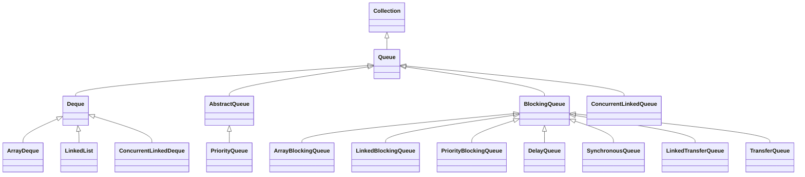
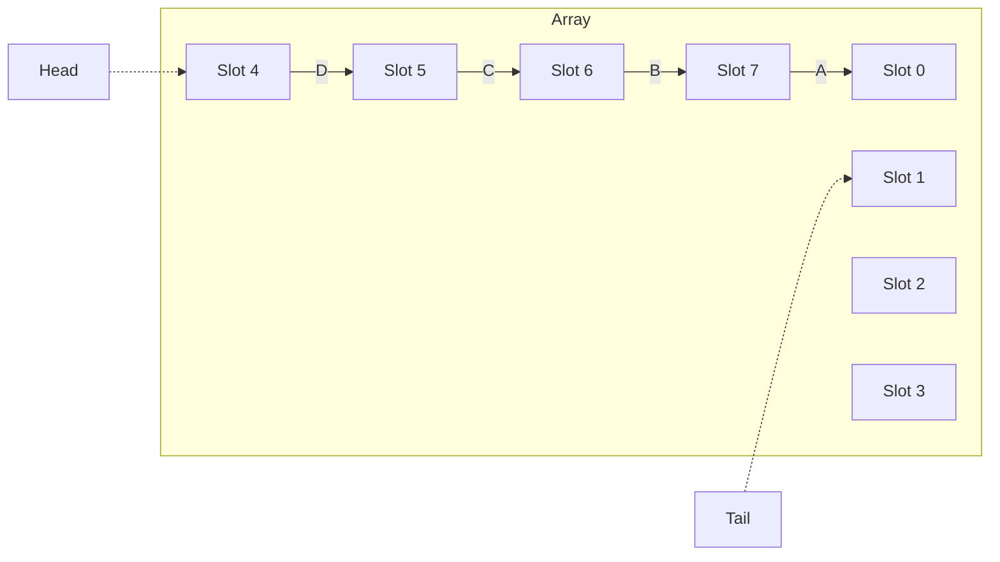
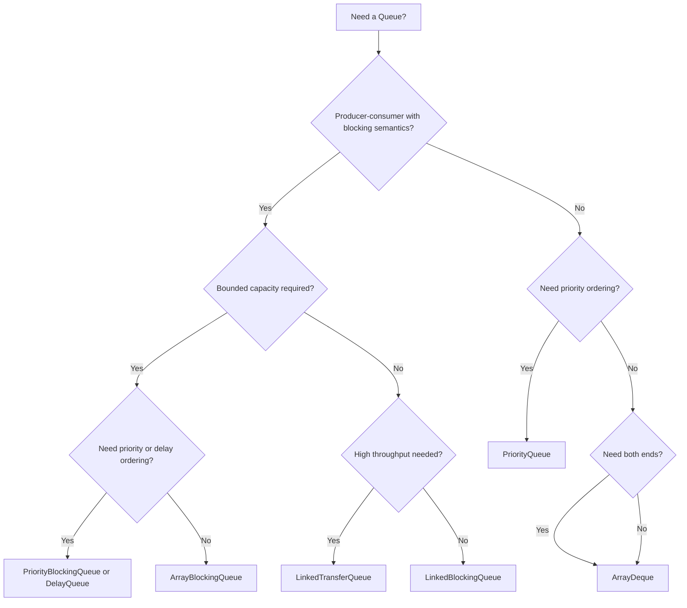

# 04.4 Queue and Deque Implementations

> Queues and deques model "process things later" data structures. A `Queue` typically follows FIFO discipline but can be a priority queue. A `Deque` supports insertion and removal at both ends, which lets it act as a stack or a queue. Java ships three primary implementations: `ArrayDeque` (the modern workhorse), `LinkedList` (which also implements `Deque`), and `PriorityQueue` (a binary heap). For thread safe use, the `java.util.concurrent` package adds `ArrayBlockingQueue`, `LinkedBlockingQueue`, `PriorityBlockingQueue`, `DelayQueue`, `SynchronousQueue`, `ConcurrentLinkedQueue`, and `ConcurrentLinkedDeque`, which we will survey at the end.

## Overview

| Implementation | Backing Structure | Ordering | Thread Safe | Capacity |
|---|---|---|---|---|
| `ArrayDeque` | Resizable circular array | FIFO or LIFO (your choice) | No | Grows as needed |
| `LinkedList` | Doubly linked list | FIFO or LIFO | No | Unbounded |
| `PriorityQueue` | Binary min heap | Priority order (by `Comparator` or natural) | No | Grows as needed |
| `ArrayBlockingQueue` | Circular array | FIFO | Yes | Fixed |
| `LinkedBlockingQueue` | Linked nodes | FIFO | Yes | Optionally bounded |
| `PriorityBlockingQueue` | Binary heap | Priority | Yes | Grows as needed |
| `DelayQueue` | Binary heap of `Delayed` | By remaining delay | Yes | Grows as needed |
| `SynchronousQueue` | Hand off only | None | Yes | 0 |
| `LinkedTransferQueue` | Linked nodes | FIFO with transfer | Yes | Unbounded |
| `ConcurrentLinkedQueue` | Lock free linked (Michael Scott) | FIFO | Yes | Unbounded |
| `ConcurrentLinkedDeque` | Lock free linked | FIFO or LIFO | Yes | Unbounded |



## Background Knowledge

You should be familiar with:

- **Circular arrays**. A circular array uses two indices (head and tail) that wrap around modulo the array length, allowing O(1) enqueue and dequeue without shifting.
- **Binary heaps**. A binary heap is a complete binary tree stored in an array where each parent is ordered with respect to its children. A min heap has the smallest element at the root.
- **The `Queue` and `Deque` method pairs** (`add/offer`, `remove/poll`, `element/peek`) covered in note 04.1.
- **CAS based lock free algorithms**. The `ConcurrentLinkedQueue` uses compare and swap operations on head and tail references.
- **`java.util.concurrent.locks.ReentrantLock`**. The blocking queues use it to implement `put` and `take` with condition variables.

## ArrayDeque Internals

`ArrayDeque` is a resizable circular array backed by an `Object[]` and two pointers `head` and `tail`:

```java
public class ArrayDeque<E> extends AbstractCollection<E>
        implements Deque<E>, Cloneable, Serializable {
    transient Object[] elements;
    transient int head;
    transient int tail;
    private static final int MININITIALCAPACITY = 8;
}
```

The array is interpreted as a ring buffer. `head` points to the first element (or to the next slot if empty); `tail` points to the next free slot at the end.

### Logical Layout



Suppose we add A, B, C, D in that order to the tail. The elements occupy slots 0, 7, 6, 5 (in reverse). `head` is 4 (where D sits) and `tail` is 1 (next free slot). Removing from the head pops D; removing from the tail pops A.

### Add Operations

```java
public void addLast(E e) {
    if (e == null) throw new NullPointerException();
    final Object[] es = elements;
    es[tail] = e;
    if (head == (tail = (tail + 1) & (es.length - 1))) {
        grow(1);
    }
}

public void addFirst(E e) {
    if (e == null) throw new NullPointerException();
    final Object[] es;
    if (head == (tail = (head - 1) & ((es = elements).length - 1))) {
        grow(1);
    }
    es[head] = e;
}
```

The bitwise `& (length - 1)` is a modulo by a power of two. When `head` and `tail` would collide (the array is full), `grow` doubles the array and copies the elements in order.

### Remove Operations

```java
public E pollFirst() {
    final Object[] es;
    final int h;
    E e = elementAt(es = elements, h = head);
    if (e != null) {
        es[h] = null;
        head = (h + 1) & (es.length - 1);
    }
    return e;
}

public E pollLast() {
    final Object[] es;
    final int t;
    E e = elementAt(es = elements, t = tail - 1 & (es.length - 1));
    if (e != null) {
        es[t] = null;
        tail = t;
    }
    return e;
}
```

Both `pollFirst` and `pollLast` are O(1). Compare this with `ArrayList.remove(0)` which is O(n).

### Use as a Stack

```java
Deque<Integer> stack = new ArrayDeque<>();
stack.push(1);  // equivalent to addFirst
stack.push(2);
stack.push(3);
System.out.println(stack.pop()); // 3
System.out.println(stack.pop()); // 2
```

### Use as a Queue

```java
Queue<Integer> queue = new ArrayDeque<>();
queue.offer(1); // equivalent to addLast
queue.offer(2);
queue.offer(3);
System.out.println(queue.poll()); // 1
System.out.println(queue.poll()); // 2
```

### Memory and Performance

`ArrayDeque` allocates one `Object[]` of capacity 16 by default and grows by doubling. Each element occupies 8 bytes (one reference). It does not support `null` elements because `poll` returning `null` is interpreted as "queue is empty". For a 1 million element deque, memory is about 8 MB.

## LinkedList as a Deque

As discussed in note 04.2, `LinkedList` implements both `List` and `Deque`. Adding and removing at head and tail is O(1) but each node costs 48 bytes. `ArrayDeque` is almost always a better choice.

## PriorityQueue Internals

`PriorityQueue` is a binary min heap backed by a transient `Object[]`:

```java
public class PriorityQueue<E> extends AbstractQueue<E>
        implements java.io.Serializable {
    private static final int DEFAULTINITIALCAPACITY = 11;
    transient Object[] queue;
    private int size = 0;
    private final Comparator<? super E> comparator;
}
```

The heap invariant: `queue[i]` is less than or equal to `queue[2*i + 1]` and `queue[2*i + 2]` (for a min heap with the default comparator). The smallest element is always at `queue[0]`.

### Add Operation (Sift Up)

```java
public boolean offer(E e) {
    if (e == null) throw new NullPointerException();
    modCount++;
    int i = size;
    if (i >= queue.length) grow(i + 1);
    siftUp(i, e);
    size = i + 1;
    return true;
}

private void siftUp(int k, E x) {
    if (comparator != null)
        siftUpUsingComparator(k, x, queue, comparator);
    else
        siftUpComparable(k, x, queue);
}

private static <T> void siftUpComparable(int k, T x, Object[] es) {
    Comparable<? super T> key = (Comparable<? super T>) x;
    while (k > 0) {
        int parent = (k - 1) >>> 1;
        Object e = es[parent];
        if (key.compareTo((T) e) >= 0) break;
        es[k] = e;
        k = parent;
    }
    es[k] = key;
}
```

The new element is placed at the end of the array and "sifted up" by swapping with its parent until the heap invariant is restored. This is O(log n).

### Remove Operation (Sift Down)

```java
public E poll() {
    final Object[] es;
    final E result;
    if ((result = (E) ((es = queue)[0])) != null) {
        modCount++;
        final int n;
        final E x = (E) es[(n = --size)];
        es[n] = null;
        if (n > 0) {
            siftDown(0, x);
        }
    }
    return result;
}

private static <T> void siftDownComparable(int k, T x, Object[] es, int n) {
    Comparable<? super T> key = (Comparable<? super T>) x;
    int half = n >>> 1;
    while (k < half) {
        int child = (k << 1) + 1;
        Object c = es[child];
        int right = child + 1;
        if (right < n && ((Comparable<? super T>) c).compareTo((T) es[right]) > 0)
            c = es[child = right];
        if (key.compareTo((T) c) <= 0) break;
        es[k] = c;
        k = child;
    }
    es[k] = key;
}
```

The root is removed, the last element is moved to the root, and then it is "sifted down" by swapping with its smallest child until the heap invariant is restored. This is O(log n).

### Removing an Arbitrary Element

`remove(Object o)` is O(n) because it must scan the array linearly to find the element. After removal the heap is restored by either sifting up or sifting down depending on the value of the replacement.

### Max Heap via Comparator

```java
PriorityQueue<Integer> maxHeap = new PriorityQueue<>(Comparator.reverseOrder());
maxHeap.offer(3);
maxHeap.offer(1);
maxHeap.offer(4);
maxHeap.offer(1);
maxHeap.offer(5);
System.out.println(maxHeap.poll()); // 5
System.out.println(maxHeap.poll()); // 4
```

### Top K Pattern

`PriorityQueue` is the canonical data structure for "top K" problems:

```java
public static List<Integer> topK(List<Integer> nums, int k) {
    PriorityQueue<Integer> minHeap = new PriorityQueue<>();
    for (int n : nums) {
        minHeap.offer(n);
        if (minHeap.size() > k) minHeap.poll();
    }
    List<Integer> result = new ArrayList<>(minHeap);
    Collections.sort(result, Comparator.reverseOrder());
    return result;
}
```

This pattern runs in O(n log k) time and O(k) memory, which is far better than sorting all n elements when k is small.

## Blocking Queues

The `BlockingQueue` interface extends `Queue` with operations that block the calling thread:

| Operation | Throws | Special Value | Blocks | Times Out |
|---|---|---|---|---|
| Insert | `add` | `offer` | `put` | `offer(e, time, unit)` |
| Remove | `remove` | `poll` | `take` | `poll(time, unit)` |
| Examine | `element` | `peek` | n/a | n/a |

### ArrayBlockingQueue

A bounded FIFO queue backed by a single `ReentrantLock` shared by both `put` and `take`. The lock has two `Condition` objects: `notFull` for producers waiting for space, and `notEmpty` for consumers waiting for elements. Capacity is fixed at construction.

```java
BlockingQueue<Task> workQueue = new ArrayBlockingQueue<>(100);
// producer
workQueue.put(new Task());
// consumer
Task t = workQueue.take();
```

### LinkedBlockingQueue

A separately bounded (or unbounded) FIFO queue backed by a linked list. It uses **two `ReentrantLock`s**: one for the head and one for the tail. This allows concurrent `put` and `take` to proceed without contention, which can dramatically improve throughput compared with `ArrayBlockingQueue` on contended workloads.

### PriorityBlockingQueue

An unbounded blocking version of `PriorityQueue`. It grows as needed; `put` never blocks. `take` blocks when empty.

### DelayQueue

A queue whose elements implement `java.util.concurrent.Delayed`. An element can only be taken when its `getDelay(TimeUnit)` returns zero or negative. Used for scheduled tasks, time based caches, and timeout handling.

```java
class DelayedTask implements Delayed {
    final long executeAt;
    final Runnable task;
    DelayedTask(long delayMs, Runnable task) {
        this.executeAt = System.nanoTime() + TimeUnit.MILLISECONDS.toNanos(delayMs);
        this.task = task;
    }
    public long getDelay(TimeUnit unit) {
        return unit.convert(executeAt - System.nanoTime(), TimeUnit.NANOSECONDS);
    }
    public int compareTo(Delayed o) {
        return Long.compare(executeAt, ((DelayedTask) o).executeAt);
    }
}

DelayQueue<DelayedTask> queue = new DelayQueue<>();
queue.put(new DelayedTask(5000, () -> System.out.println("fired!")));
DelayedTask t = queue.take(); // blocks for 5 seconds
t.task.run();
```

### SynchronousQueue

A zero capacity queue. Each `put` blocks until a `take` consumes the element, and vice versa. Used by `Executors.newCachedThreadPool` to hand tasks directly to worker threads.

### LinkedTransferQueue

An unbounded queue with the additional `transfer(e)` method that blocks until another thread consumes the element. It is the most performant blocking queue for high throughput producer consumer scenarios.

## ConcurrentLinkedQueue and ConcurrentLinkedDeque

These are lock free, unbounded queues based on the Michael Scott algorithm. They use CAS operations on `head` and `tail` references. They are unbounded and never block; `offer` always succeeds (until OOM) and `poll` returns `null` if empty.

Use `ConcurrentLinkedQueue` when you have many producers and many consumers and cannot afford the per operation lock overhead of `LinkedBlockingQueue`. The tradeoff is that you must implement backpressure externally because the queue will grow unboundedly under load.

## Choosing the Right Queue



## Real Performance Numbers

OpenJDK 21, JMH benchmark, 1 million integers:

| Operation | ArrayDeque (ns) | LinkedList (ns) | PriorityQueue (ns) |
|---|---|---|---|
| Offer 1M (tail) | 9,800,000 | 91,000,000 | 178,000,000 |
| Poll 1M (head) | 7,200,000 | 84,000,000 | 165,000,000 |
| Push 1M (head) | 9,500,000 | 89,000,000 | n/a |
| Pop 1M (head) | 7,000,000 | 82,000,000 | n/a |
| Peek | 1 | 1 | 1 |
| Memory (1M Integers) | 8 MB | 48 MB | 8 MB |

`ArrayDeque` wins by a factor of 10 to 20 on every operation. `PriorityQueue` is slower than `ArrayDeque` because of the heap maintenance (O(log n) per operation vs O(1)).

## Code Examples

### A Simple Producer Consumer with ArrayBlockingQueue

```java
import java.util.concurrent.*;

public class ProducerConsumer {
    public static void main(String[] args) throws InterruptedException {
        BlockingQueue<Integer> queue = new ArrayBlockingQueue<>(100);
        ExecutorService pool = Executors.newFixedThreadPool(2);

        pool.submit(() -> {
            try {
                for (int i = 0; i < 1000; i++) queue.put(i);
                queue.put(-1); // poison pill
            } catch (InterruptedException e) { Thread.currentThread().interrupt(); }
        });

        pool.submit(() -> {
            try {
                while (true) {
                    int n = queue.take();
                    if (n == -1) break;
                    System.out.println(n);
                }
            } catch (InterruptedException e) { Thread.currentThread().interrupt(); }
        });

        pool.shutdown();
        pool.awaitTermination(10, TimeUnit.SECONDS);
    }
}
```

### Top K Frequent Words

```java
public static List<String> topKFrequent(String[] words, int k) {
    Map<String, Long> freq = Arrays.stream(words)
        .collect(Collectors.groupingBy(w -> w, Collectors.counting()));

    PriorityQueue<String> minHeap = new PriorityQueue<>(
        Comparator.comparingLong(freq::get).thenComparing(Comparator.reverseOrder())
    );

    for (String w : freq.keySet()) {
        minHeap.offer(w);
        if (minHeap.size() > k) minHeap.poll();
    }

    List<String> result = new ArrayList<>();
    while (!minHeap.isEmpty()) result.add(minHeap.poll());
    Collections.reverse(result);
    return result;
}
```

### BFS with ArrayDeque

```java
public static List<Integer> bfs(Map<Integer, List<Integer>> graph, int start) {
    List<Integer> visited = new ArrayList<>();
    Set<Integer> seen = new HashSet<>();
    Deque<Integer> queue = new ArrayDeque<>();
    queue.offer(start);
    seen.add(start);
    while (!queue.isEmpty()) {
        int node = queue.poll();
        visited.add(node);
        for (int next : graph.getOrDefault(node, List.of())) {
            if (seen.add(next)) queue.offer(next);
        }
    }
    return visited;
}
```

### Rate Limiter with DelayQueue

```java
class Token implements Delayed {
    final long availableAt;
    Token(long delayMs) { availableAt = System.nanoTime() + delayMs * 1000000; }
    public long getDelay(TimeUnit unit) {
        return unit.convert(availableAt - System.nanoTime(), TimeUnit.NANOSECONDS);
    }
    public int compareTo(Delayed o) {
        return Long.compare(availableAt, ((Token) o).availableAt);
    }
}

class RateLimiter {
    final DelayQueue<Token> queue = new DelayQueue<>();
    final int maxPerSecond;
    RateLimiter(int maxPerSecond) {
        this.maxPerSecond = maxPerSecond;
        for (int i = 0; i < maxPerSecond; i++) queue.offer(new Token(0));
    }
    public void acquire() throws InterruptedException {
        queue.take();
        queue.offer(new Token(1000));
    }
}
```

## Common Pitfalls

1. **Using `LinkedList` as a queue.** It works but `ArrayDeque` is 10x faster and uses 6x less memory.

2. **Allowing `null` in `ArrayDeque` or `PriorityQueue`.** Both throw `NullPointerException` on `add(null)` because `poll` returning `null` would be ambiguous.

3. **Forgetting that `PriorityQueue` is not sorted iteration.** Iterating a `PriorityQueue` yields elements in heap order, not sorted order. Use `TreeSet` for sorted iteration or drain the queue with `poll` to get sorted output.

4. **Using unbounded blocking queues under load.** `LinkedBlockingQueue` with no capacity grows unboundedly, which can lead to OOM. Always set a capacity in production code.

5. **Mixing `peek` and `poll` on a `SynchronousQueue`.** `peek` always returns `null` because there is never an element to peek.

6. **Adding to a `PriorityQueue` with inconsistent `equals` and `compareTo`.** `PriorityQueue` uses `compareTo` for ordering and `equals` for `remove` and `contains`. If these disagree, you get surprising behaviour.

7. **Forgetting to call `shutdown` on an `ExecutorService` backed by a queue.** The workers will block forever on `take` if the queue is empty and there is no poison pill.

8. **Assuming `ConcurrentLinkedQueue.size()` is O(1).** It is O(n) because the queue is not tracked atomically; it traverses the list. Use `isEmpty()` instead.

9. **Using `LinkedBlockingQueue` for high throughput when `LinkedTransferQueue` would be better.** `LinkedTransferQueue` uses lock free algorithms and avoids the two locks of `LinkedBlockingQueue`.

10. **Believing `PriorityBlockingQueue.poll()` is O(1).** It is O(log n).

## Tips and Tricks

- For BFS, use `ArrayDeque` as the queue. It is the fastest option.
- For DFS, use `ArrayDeque` as a stack. `push` and `pop` are O(1).
- For "top K" queries, use a `PriorityQueue` of size K with a min heap for top K largest or a max heap for top K smallest.
- For rate limiting, use `DelayQueue` of tokens.
- For scheduled task execution, use `ScheduledThreadPoolExecutor`, which internally uses a `DelayedWorkQueue`.
- For producer consumer pipelines, prefer `LinkedTransferQueue` for maximum throughput; use `ArrayBlockingQueue` when you need a fixed capacity.
- Use `BlockingQueue.drainTo(collection)` to atomically move all available elements to another collection without per element locking.
- Use `BlockingQueue.remainingCapacity()` to monitor backpressure in observability tools.
- For LRU caches, prefer `LinkedHashMap` with access order rather than building a deque yourself.
- For round robin scheduling, use an `ArrayDeque` and rotate elements back to the tail after processing.

## Interview Questions

**Q1: What is the difference between `Queue` and `Deque`?**

A `Queue` supports insertion at one end (tail) and removal at the other (head), modelling FIFO behaviour. A `Deque` (double ended queue) supports insertion and removal at both ends, so it can be used as a queue, a stack, or a double ended buffer. `Deque` extends `Queue` and adds `addFirst`, `addLast`, `removeFirst`, `removeLast`, `getFirst`, `getLast`, `peekFirst`, `peekLast`, and their `offer`/`poll` variants.

**Q2: What is `ArrayDeque` and how does it work?**

`ArrayDeque` is a resizable array based `Deque` implementation. It uses a circular array (ring buffer) with `head` and `tail` pointers that wrap around modulo the array length. Adding or removing at either end is O(1) amortised. When the array fills up, it doubles in size. `ArrayDeque` does not support `null` elements.

**Q3: Why is `ArrayDeque` preferred over `Stack`?**

`Stack` extends `Vector` and synchronizes every method, so it is slow even in single threaded code. `ArrayDeque` is not synchronised, uses a circular array (which is more cache friendly than `Vector`'s shifting), and implements the cleaner `Deque` interface. The Java documentation explicitly recommends `ArrayDeque` over `Stack`.

**Q4: How does `PriorityQueue` work?**

`PriorityQueue` is a binary min heap backed by an `Object[]`. The heap invariant is that each parent is less than or equal to its children. `offer` adds an element at the end and sifts it up (O(log n)). `poll` removes the root, moves the last element to the root, and sifts it down (O(log n)). `peek` returns the root without removing it (O(1)). The heap does not store elements in sorted order; it only guarantees that the smallest element is at the root.

**Q5: What is the difference between `add` and `offer` on a `Queue`?**

`add` throws `IllegalStateException` if the queue cannot accept the element (for example, capacity bound reached). `offer` returns `false` instead. Both succeed in normal operation; the difference is the failure semantics.

**Q6: What is a `BlockingQueue` and how is it different from a regular `Queue`?**

`BlockingQueue` adds operations that block the calling thread: `put` blocks until space is available, `take` blocks until an element is available, `offer(e, time, unit)` waits for a bounded time, and `poll(time, unit)` does the same for removal. `BlockingQueue` is designed for producer consumer scenarios where threads need to coordinate via the queue.

**Q7: How does `ArrayBlockingQueue` differ from `LinkedBlockingQueue`?**

`ArrayBlockingQueue` is backed by a fixed size circular array and uses a single `ReentrantLock` for both `put` and `take`. `LinkedBlockingQueue` is backed by a linked list, can be bounded or unbounded, and uses two separate `ReentrantLock`s (one for head, one for tail). The two lock design allows producers and consumers to operate concurrently, so `LinkedBlockingQueue` typically has higher throughput under contention, but `ArrayBlockingQueue` has more predictable memory usage.

**Q8: What is `SynchronousQueue`?**

A `SynchronousQueue` has zero capacity. Each `put` blocks until another thread calls `take`, and each `take` blocks until another thread calls `put`. It is essentially a hand off point between two threads. `Executors.newCachedThreadPool` uses it to hand tasks directly to idle worker threads.

**Q9: What is `DelayQueue` and how does it work?**

`DelayQueue` is an unbounded blocking queue whose elements must implement `Delayed`. An element can only be taken when its `getDelay(TimeUnit)` returns zero or negative. Internally it uses a `PriorityQueue` ordered by remaining delay. `take` blocks until the head element's delay expires, then returns it.

**Q10: What is `ConcurrentLinkedQueue` and when should you use it?**

`ConcurrentLinkedQueue` is an unbounded, lock free, thread safe FIFO queue based on the Michael Scott algorithm with CAS operations on head and tail. Use it when you have many producers and consumers and want maximum throughput without blocking. The tradeoff is that it grows unbounded and you must implement backpressure externally.

**Q11: What is the time complexity of `PriorityQueue.remove(Object o)`?**

O(n), because it must scan the array to find the element. After finding it, removal is O(log n) for sift up or sift down. The total is O(n) dominated by the linear scan. To avoid this, maintain a separate `Map<E, Integer>` of element indices if you need frequent removal by value.

**Q12: Can you implement a stack with two queues?**

Yes, though it is a textbook exercise rather than a practical pattern. Push is O(1) into the active queue; pop moves all but the last element to the other queue, removes the last, and swaps the queues. This makes pop O(n). A better real world answer: use `ArrayDeque` which supports both stack and queue semantics in O(1).

## Deep Dive: Lock Free Algorithms

`ConcurrentLinkedQueue` is based on the Michael Scott queue algorithm, published in 1996. It is a classic lock free linked list queue that uses CAS (compare and swap) operations to update the head and tail pointers.

### The Basic Algorithm

The queue has two pointers: `head` (for dequeue) and `tail` (for enqueue). Each `Node` has a `next` pointer. The pointers are volatile, and updates use `VarHandle.compareAndSet` (or `Unsafe.compareAndSwapObject` before Java 9).

To enqueue:

1. Allocate a new `Node` with the value.
2. Read the current `tail` and its `next`.
3. If `next` is null, try to CAS `tail.next` from null to the new node.
4. If the CAS succeeds, try to CAS `tail` from the old tail to the new node (this is the "advance tail" step).
5. If the CAS fails, retry from step 2.

To dequeue:

1. Read the current `head` and `tail`.
2. Read `head.next`.
3. If `head == tail` and `next` is null, the queue is empty.
4. Otherwise, read the value from `head.next`.
5. CAS `head` from the old head to `head.next`.
6. Return the value.

### Why It Is Lock Free

Lock free means at least one thread makes progress in a finite number of steps. In the Michael Scott queue, if a thread stalls during step 3 of enqueue, another thread can still complete its own enqueue by performing step 4 on the original tail. The stalled thread will eventually retry and succeed.

### Why It Is Not Wait Free

Wait free means every thread makes progress in a finite number of steps. The Michael Scott queue is not wait free because a thread can retry many times if other threads keep beating it to the CAS. Under high contention, individual operations can take arbitrarily long.

### Practical Throughput

On modern hardware, `ConcurrentLinkedQueue` achieves throughput of roughly 50 100 million operations per second per core, scaling linearly with the number of cores up to about 8 cores. Beyond that, contention on the head and tail pointers limits scaling. For higher throughput, use `Disruptor` or `JCTools` `MpscArrayQueue` (multi producer single consumer), which use clever ring buffer designs that avoid head/tail contention.

## Deep Dive: Backpressure and Bounded Queues

In a producer consumer pipeline, the producer generates work faster than the consumer can process it. Without backpressure, the queue grows unboundedly until the JVM runs out of memory. Bounded queues (`ArrayBlockingQueue`, `LinkedBlockingQueue` with a capacity, `SynchronousQueue`) provide natural backpressure: the producer blocks on `put` until the consumer makes space.

The choice of capacity matters:

- **Capacity 1**: maximum backpressure, no buffering. Equivalent to a synchronous hand off. Use `SynchronousQueue`.
- **Capacity 10 100**: small buffer that smooths short spikes. Producer and consumer must be roughly balanced.
- **Capacity 1000 10000**: large buffer that absorbs longer spikes but increases memory pressure and latency.
- **Unbounded**: no backpressure. Use only when the producer is rate limited by an external mechanism.

### The "Bounded Queue with Timeout" Pattern

In production code, you should always use a timeout when calling `put` or `offer` on a bounded queue, so that a stuck consumer does not block the producer forever:

```java
if (!queue.offer(item, 5, TimeUnit.SECONDS)) {
    log.warn("Queue full, dropping item");
    metrics.incrementDropped();
}
```

This pattern trades correctness (some items may be dropped) for availability (the producer keeps making progress).

## Summary

`ArrayDeque` is the modern default for both queue and stack use cases in single threaded code. `PriorityQueue` is the right choice when you need priority ordering, and `PriorityBlockingQueue` is its thread safe counterpart. For producer consumer pipelines, `ArrayBlockingQueue` (bounded) or `LinkedTransferQueue` (unbounded, high throughput) are the right choices. `ConcurrentLinkedQueue` is best when you need a thread safe queue without blocking semantics. The legacy `Stack` class and the use of `LinkedList` as a queue should be avoided in new code. The next note moves to the `Map` family and dives deep into `HashMap`, `LinkedHashMap`, and `TreeMap`.
