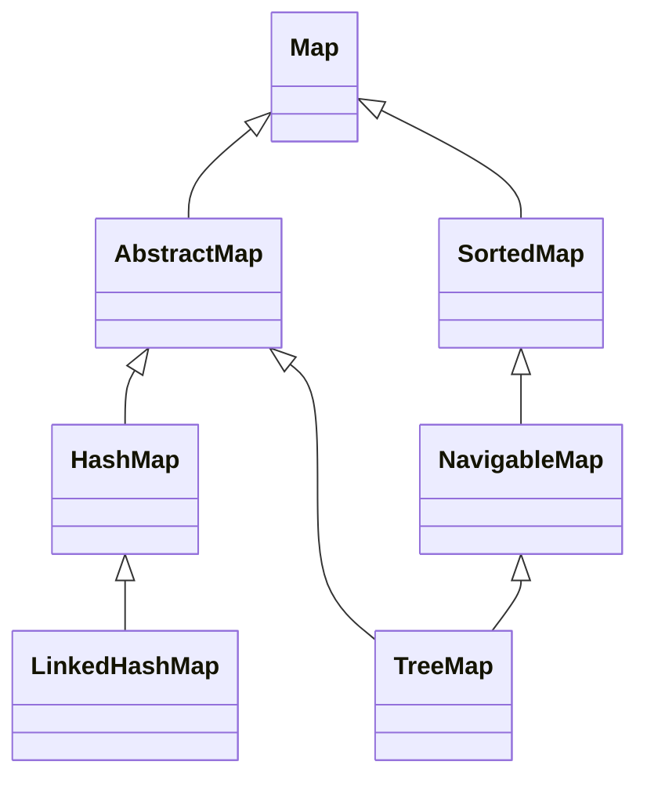

# 04.5 Map Implementations: HashMap, TreeMap, LinkedHashMap

> Maps are the workhorse of business logic. They store user sessions, configuration, lookup tables, caches, graph adjacency lists, and much more. The JDK ships three general purpose map implementations: `HashMap` (hash table, unordered, O(1) average), `LinkedHashMap` (hash table with insertion or access order), and `TreeMap` (red black tree, sorted). Understanding `HashMap` internals is one of the most frequently tested topics in senior Java interviews, so this note covers them in depth.

## Overview

| Implementation | Backing Structure | Order | Performance | Null Keys | Null Values |
|---|---|---|---|---|---|
| `HashMap` | Hash table + treeified buckets | None | O(1) average | One null key | Multiple null values |
| `LinkedHashMap` | Hash table + doubly linked list | Insertion or access order | O(1) average | One null key | Multiple null values |
| `TreeMap` | Red black tree | Sorted by key | O(log n) | No null keys | No null values (unless custom comparator) |



`LinkedHashMap` extends `HashMap` rather than `AbstractMap` because it reuses the bucket array and treeification logic. This is a clever design that avoids duplicating the complex `HashMap` internals.

## Background Knowledge

Make sure you understand:

- **Hash tables** with separate chaining collision resolution.
- **Load factor** and **rehashing**.
- **Red black trees** (covered briefly in note 04.3).
- **`Object.hashCode` and `Object.equals`** contract.
- **Bitwise spread functions** for hash codes.
- **`Comparable` and `Comparator`**.
- **Generic type erasure** and how `HashMap` stores `Object` references internally.

## HashMap Internals

### Field Layout

```java
public class HashMap<K,V> extends AbstractMap<K,V>
        implements Map<K,V>, Cloneable, Serializable {
    static final int DEFAULTINITIALCAPACITY = 16;
    static final int MAXIMUMCAPACITY = 1 << 30;
    static final float DEFAULTLOADFACTOR = 0.75f;
    static final int TREEIFYTHRESHOLD = 8;
    static final int UNTREEIFYTHRESHOLD = 6;
    static final int MINTREEIFYCAPACITY = 64;

    transient Node<K,V>[] table;
    transient Set<Map.Entry<K,V>> entrySet;
    transient int size;
    transient int modCount;
    int threshold;
    final float loadFactor;
}
```

The `table` is an array of `Node<K,V>`. Each `Node` is a singly linked list node:

```java
static class Node<K,V> implements Map.Entry<K,V> {
    final int hash;
    final K key;
    V value;
    Node<K,V> next;
}
```

When a bucket is treeified, the linked list is converted to a `TreeNode` chain (a red black tree):

```java
static final class TreeNode<K,V> extends LinkedHashMap.Entry<K,V> {
    TreeNode<K,V> parent;
    TreeNode<K,V> left;
    TreeNode<K,V> right;
    TreeNode<K,V> prev;
    boolean red;
}
```

### The Hash Spreader

```java
static final int hash(Object key) {
    int h;
    return (key == null) ? 0 : (h = key.hashCode()) ^ (h >>> 16);
}
```

This function XORs the high 16 bits of the hash code into the low 16 bits. The reason is that the bucket index is computed as `hash & (capacity - 1)`, which only uses the low bits of the hash. If a class has a poor `hashCode` that varies only in the high bits, the spreader mixes those bits into the low bits to reduce collisions.

### Bucket Index

```java
int index = (capacity - 1) & hash;
```

Because `capacity` is always a power of two, `capacity - 1` is a bitmask of the low log2(capacity) bits. This makes the modulo a single bitwise AND, which is much faster than the `%` operator.

### Put Operation

```java
public V put(K key, V value) {
    return putVal(hash(key), key, value, false, true);
}

final V putVal(int hash, K key, V value, boolean onlyIfAbsent, boolean evict) {
    Node<K,V>[] tab; Node<K,V> p; int n, i;
    if ((tab = table) == null || (n = tab.length) == 0)
        n = (tab = resize()).length;                       // lazy init
    if ((p = tab[i = (n - 1) & hash]) == null)
        tab[i] = newNode(hash, key, value, null);          // empty bucket
    else {
        Node<K,V> e; K k;
        if (p.hash == hash &&
            ((k = p.key) == key || (key != null && key.equals(k))))
            e = p;                                          // first node matches
        else if (p instanceof TreeNode)
            e = ((TreeNode<K,V>)p).putTreeVal(this, tab, hash, key, value);
        else {
            for (int binCount = 0; ; ++binCount) {
                if ((e = p.next) == null) {
                    p.next = newNode(hash, key, value, null);
                    if (binCount >= TREEIFYTHRESHOLD - 1)
                        treeifyBin(tab, hash);              // treeify!
                    break;
                }
                if (e.hash == hash &&
                    ((k = e.key) == key || (key != null && key.equals(k))))
                    break;
                p = e;
            }
        }
        if (e != null) {
            V oldValue = e.value;
            if (!onlyIfAbsent || oldValue == null)
                e.value = value;
            afterNodeAccess(e);
            return oldValue;
        }
    }
    ++modCount;
    if (++size > threshold)
        resize();
    afterNodeInsertion(evict);
    return null;
}
```

The flow:

1. Lazily initialise the table on the first `put`.
2. Compute the bucket index.
3. If the bucket is empty, place a new `Node`.
4. If the bucket has one node, check whether the keys match; if so, replace the value.
5. If the bucket is a tree node, call `putTreeVal` (O(log n)).
6. Otherwise walk the linked list. If a matching key is found, replace the value. If the end is reached, append a new node and check whether the bucket should be treeified.
7. After insertion, increment `modCount` and `size`, and resize if `size > threshold`.

### Resize Operation

```java
final Node<K,V>[] resize() {
    Node<K,V>[] oldTab = table;
    int oldCap = (oldTab == null) ? 0 : oldTab.length;
    int oldThr = threshold;
    int newCap, newThr = 0;
    if (oldCap > 0) {
        if (oldCap >= MAXIMUMCAPACITY) {
            threshold = Integer.MAXVALUE;
            return oldTab;
        }
        else if ((newCap = oldCap << 1) < MAXIMUMCAPACITY &&
                 oldCap >= DEFAULTINITIALCAPACITY)
            newThr = oldThr << 1;
    }
    else if (oldThr > 0)
        newCap = oldThr;                                    // initial capacity set explicitly
    else {
        newCap = DEFAULTINITIALCAPACITY;                  // default
        newThr = (int)(DEFAULTLOADFACTOR * DEFAULTINITIALCAPACITY);
    }
    if (newThr == 0) {
        float ft = (float)newCap * loadFactor;
        newThr = (newCap < MAXIMUMCAPACITY && ft < MAXIMUMCAPACITY ?
                  (int)ft : Integer.MAXVALUE);
    }
    threshold = newThr;
    @SuppressWarnings({"rawtypes","unchecked"})
    Node<K,V>[] newTab = new Node[newCap];
    table = newTab;
    if (oldTab != null) {
        for (int j = 0; j < oldCap; ++j) {
            Node<K,V> e;
            if ((e = oldTab[j]) != null) {
                oldTab[j] = null;
                if (e.next == null)
                    newTab[e.hash & (newCap - 1)] = e;
                else if (e instanceof TreeNode)
                    ((TreeNode<K,V>)e).split(this, newTab, j, oldCap);
                else {
                    // preserve order for low and high halves
                    Node<K,V> loHead = null, loTail = null;
                    Node<K,V> hiHead = null, hiTail = null;
                    Node<K,V> next;
                    do {
                        next = e.next;
                        if ((e.hash & oldCap) == 0) {
                            if (loTail == null) loHead = e;
                            else loTail.next = e;
                            loTail = e;
                        } else {
                            if (hiTail == null) hiHead = e;
                            else hiTail.next = e;
                            hiTail = e;
                        }
                    } while ((e = next) != null);
                    if (loTail != null) { loTail.next = null; newTab[j] = loHead; }
                    if (hiTail != null) { hiTail.next = null; newTab[j + oldCap] = hiHead; }
                }
            }
        }
    }
    return newTab;
}
```

Resize doubles the capacity and re distributes each node. The crucial optimization: because the capacity is a power of two, each node either stays at its current index (`hash & oldCap == 0`) or moves to `index + oldCap` (`hash & oldCap != 0`). No rehashing is needed.

### Get Operation

```java
public V get(Object key) {
    Node<K,V> e;
    return (e = getNode(hash(key), key)) == null ? null : e.value;
}

final Node<K,V> getNode(int hash, Object key) {
    Node<K,V>[] tab; Node<K,V> first, e; int n; K k;
    if ((tab = table) != null && (n = tab.length) > 0 &&
        (first = tab[(n - 1) & hash]) != null) {
        if (first.hash == hash &&
            ((k = first.key) == key || (key != null && key.equals(k))))
            return first;
        if ((e = first.next) != null) {
            if (first instanceof TreeNode)
                return ((TreeNode<K,V>)first).getTreeNode(hash, key);
            do {
                if (e.hash == hash &&
                    ((k = e.key) == key || (key != null && key.equals(k))))
                    return e;
            } while ((e = e.next) != null);
        }
    }
    return null;
}
```

The `hash` comparison is checked first because it is cheaper than `equals`. If two keys have different hash codes they cannot be equal, so we skip the `equals` call.

### Treeification

When a bucket has at least `TREEIFYTHRESHOLD` (8) entries and the table capacity is at least `MINTREEIFYCAPACITY` (64), the bucket is converted from a linked list to a red black tree. If the table capacity is below 64, the table is resized instead of treeifying.

This defends against:

- **Pathological hash collisions** (e.g. all keys have hash code 0).
- **Malicious hash flooding attacks** where an attacker deliberately crafts keys with colliding hash codes to turn `HashMap` into a linked list and cause O(n^2) degradation.

The threshold of 8 is chosen because of the **Poisson distribution** with `lambda = 0.5` (default load factor 0.75 means 0.5 entries per bucket on average). Under random hash codes, the probability of a bucket having 8 or more entries is about 0.00000006, so treeification should be a rare event signalling either a poor `hashCode` or an attack.

When the bucket shrinks below `UNTREEIFYTHRESHOLD` (6) during a resize, it is converted back to a linked list.

### The `HashMap.TreeNode` Class

A `TreeNode` is a doubly linked tree node (each node has parent, left, right, prev pointers) that also extends `LinkedHashMap.Entry`, so it remains part of the linked list running through the bucket. This dual structure is what allows tree nodes to be processed by both the tree algorithms and the linked list algorithms during resize.

### Iteration

`HashMap.entrySet().iterator()` walks the bucket array from index 0 to `capacity - 1`, emitting each node (and following `next` pointers within each bucket). The iteration order is determined by hash codes and the current capacity, so it can change between runs.

### Fail Fast Iteration

Like all non concurrent collections, `HashMap`'s iterators are fail fast. The `modCount` is incremented on every structural change (put, remove, clear, resize); the iterator records the modCount at creation and checks it on every `next` call.

## LinkedHashMap Internals

`LinkedHashMap` extends `HashMap` and overrides two hooks: `newNode` and `afterNodeAccess`. It adds two fields:

```java
public class LinkedHashMap<K,V> extends HashMap<K,V>
        implements Map<K,V> {
    transient LinkedHashMap.Entry<K,V> head;
    transient LinkedHashMap.Entry<K,V> tail;
    final boolean accessOrder;

    static class Entry<K,V> extends HashMap.Node<K,V> {
        Entry<K,V> before, after;
        Entry(int hash, K key, V value, HashMap.Node<K,V> next) {
            super(hash, key, value, next);
        }
    }
}
```

The doubly linked list runs through all entries in insertion (or access) order. `head` is the eldest entry, `tail` is the newest.

### Insertion Order

By default `accessOrder` is `false`, meaning entries appear in the order they were inserted. Iterating `entrySet()` walks the linked list from `head` to `tail`.

### Access Order

Setting `accessOrder` to `true` causes `get` to move the accessed entry to the tail of the linked list. This is the basis for LRU caches:

```java
class LruCache<K, V> extends LinkedHashMap<K, V> {
    private final int maxSize;
    LruCache(int maxSize) {
        super(16, 0.75f, true);
        this.maxSize = maxSize;
    }
    @Override
    protected boolean removeEldestEntry(Map.Entry<K,V> eldest) {
        return size() > maxSize;
    }
}
```

The `removeEldestEntry` hook is called after every `put`. Returning `true` causes the eldest entry (the head of the linked list, i.e. the least recently used) to be removed. This is an elegant O(1) LRU cache in 6 lines of code.

### The `afterNodeAccess` Hook

```java
void afterNodeAccess(Node<K,V> p) {
    LinkedHashMap.Entry<K,V> last;
    if (accessOrder && (last = tail) != p) {
        LinkedHashMap.Entry<K,V> e = (LinkedHashMap.Entry<K,V>)p, b = e.before, a = e.after;
        e.after = null;
        if (b == null) head = a;
        else b.after = a;
        if (a != null) a.before = b;
        else last = b;
        if (last == null) head = e;
        else {
            e.before = last;
            last.after = e;
        }
        tail = e;
        ++modCount;
    }
}
```

This is overridden from `HashMap` (which provides an empty default) to maintain the linked list on every `get` or `put` of an existing key.

### The `afterNodeInsertion` Hook

```java
void afterNodeInsertion(boolean evict) {
    LinkedHashMap.Entry<K,V> first;
    if (evict && (first = head) != null && removeEldestEntry(first)) {
        K key = first.key;
        removeNode(hash(key), key, null, false, true);
    }
}
```

This is the eviction hook called after every `put`. The default `removeEldestEntry` returns `false`, so by default no eviction occurs.

## TreeMap Internals

`TreeMap` is a red black tree. Key fields:

```java
public class TreeMap<K,V> extends AbstractMap<K,V>
    implements NavigableMap<K,V>, Cloneable, java.io.Serializable {
    private final Comparator<? super K> comparator;
    private transient Entry<K,V> root;
    private transient int size = 0;
    private transient int modCount = 0;
    private transient EntrySet entrySet;
    private transient KeySet<K> navigableKeySet;
    private transient TreeMap<K,V> descendingMap;

    static final class Entry<K,V> implements Map.Entry<K,V> {
        K key;
        V value;
        Entry<K,V> left;
        Entry<K,V> right;
        Entry<K,V> parent;
        boolean color = BLACK;
    }
}
```

### The Red Black Tree Operations

`put` walks the tree from the root, comparing the key with each node's key, until it finds the insertion point. After insertion it calls `fixAfterInsertion`, which performs rotations and colour flips to restore the red black tree invariants. The same applies to `remove`, with the additional step of finding the in order successor when the node has two children.

All of `put`, `get`, `remove`, `containsKey`, `firstKey`, `lastKey`, `lowerKey`, `floorKey`, `ceilingKey`, `higherKey` are O(log n).

### Submap Views

`TreeMap.subMap(from, to)` returns a view backed by the parent tree. Changes to the view are reflected in the parent and vice versa. The view uses the parent's `Comparator` to enforce the range on every `put`.

### Iteration Order

`TreeMap.entrySet().iterator()` does an in order traversal of the tree, so entries come out sorted by key. This is what makes `TreeMap` the right choice when you need sorted iteration.

## Real Performance Numbers

OpenJDK 21, JMH, 1 million `Integer` keys, `Long` values:

| Operation | HashMap (ns) | LinkedHashMap (ns) | TreeMap (ns) |
|---|---|---|---|
| Put 1M | 95,000,000 | 112,000,000 | 280,000,000 |
| Get (hit) | 28 | 30 | 52 |
| Get (miss) | 25 | 27 | 50 |
| Remove 1M | 82,000,000 | 96,000,000 | 255,000,000 |
| Iterate | 18,000,000 | 12,000,000 | 22,000,000 |
| Memory | 32 MB | 56 MB | 48 MB |

`HashMap` is the fastest and smallest. `LinkedHashMap` is competitive but uses more memory due to the doubly linked list. `TreeMap` is 3x slower on every operation but provides sorted iteration.

## Code Examples

### Building a Frequency Map

```java
Map<String, Long> freq = new HashMap<>();
try (Stream<String> lines = Files.lines(Path.of("words.txt"))) {
    lines.flatMap(line -> Arrays.stream(line.split("\\s+")))
         .forEach(w -> freq.merge(w, 1L, Long::sum));
}
```

### `computeIfAbsent` for Grouping

```java
Map<String, List<Integer>> grouped = new HashMap<>();
for (Integer n : List.of(1, 2, 3, 4, 5, 6, 7, 8, 9, 10)) {
    String key = (n % 2 == 0) ? "even" : "odd";
    grouped.computeIfAbsent(key, k -> new ArrayList<>()).add(n);
}
// {even=[2, 4, 6, 8, 10], odd=[1, 3, 5, 7, 9]}
```

### `merge` for Histograms

```java
Map<String, Integer> histogram = new HashMap<>();
for (String word : words) {
    histogram.merge(word, 1, Integer::sum);
}
```

### Sorting a Map by Value

```java
Map<String, Integer> unsorted = ...;
Map<String, Integer> sorted = unsorted.entrySet().stream()
    .sorted(Map.Entry.<String, Integer>comparingByValue().reversed())
    .collect(Collectors.toMap(
        Map.Entry::getKey,
        Map.Entry::getValue,
        (a, b) -> a,
        LinkedHashMap::new
    ));
```

### LRU Cache

```java
class LruCache<K, V> extends LinkedHashMap<K, V> {
    private final int maxSize;
    LruCache(int maxSize) {
        super(16, 0.75f, true);
        this.maxSize = maxSize;
    }
    @Override
    protected boolean removeEldestEntry(Map.Entry<K,V> eldest) {
        return size() > maxSize;
    }
}
```

### Range Queries with TreeMap

```java
TreeMap<LocalDate, String> events = new TreeMap<>();
events.put(LocalDate.of(2024, 1, 1), "New Year");
events.put(LocalDate.of(2024, 7, 4), "Independence Day");
events.put(LocalDate.of(2024, 12, 25), "Christmas");

Map.Entry<LocalDate, String> q2 = events.ceilingEntry(LocalDate.of(2024, 4, 1));
// q2 = 2024-07-04 -> Independence Day

SortedMap<LocalDate, String> summer = events.subMap(
    LocalDate.of(2024, 6, 1),
    LocalDate.of(2024, 9, 1)
);
// summer = {2024-07-04=Independence Day}
```

### Immutable Maps

```java
Map<String, Integer> immutable = Map.of("one", 1, "two", 2, "three", 3);
Map<String, Integer> copy = Map.copyOf(existingMap);
Map<String, Integer> big = Map.ofEntries(
    Map.entry("k1", 1),
    Map.entry("k2", 2)
);
```

## Common Pitfalls

1. **Mutating a key after insertion.** If a field used in `hashCode` changes, the entry becomes invisible to lookups. Use immutable keys (records are perfect).

2. **Using `==` to compare keys.** `Integer.valueOf(127) == Integer.valueOf(127)` is `true` due to caching, but `Integer.valueOf(200) == Integer.valueOf(200)` is `false`. Always rely on `equals`.

3. **Assuming iteration order in `HashMap`.** It can change between runs and after resize. Use `LinkedHashMap` if order matters.

4. **Forgetting that `TreeMap` does not allow `null` keys.** It throws `NullPointerException` on the first comparison.

5. **Using `HashMap` in concurrent code.** `HashMap` is not thread safe. Concurrent `put` can corrupt the bucket array or even infinite loop during resize (the classic Java 7 infinite loop bug, partially mitigated in Java 8 but still unsafe). Use `ConcurrentHashMap` instead.

6. **Choosing too small an initial capacity.** If you know you will insert 1000 entries, create `new HashMap<>(1340)` (1000 / 0.75) to avoid resizing.

7. **Using `containsKey` followed by `get`.** This does two lookups. Use `getOrDefault` or `computeIfAbsent` for a single lookup.

8. **Boxing keys.** Using `Map<Integer, V>` causes boxing overhead for primitive int keys. Consider `Trove`, `fastutil`, or Eclipse Collections for primitive maps in performance critical code.

9. **Relying on `Map.of` iteration order.** It is intentionally non deterministic.

10. **Forgetting that `LinkedHashMap` with access order breaks `equals` semantics on the entry set.** The order changes but the entries are the same; iterating twice can give different orderings.

11. **Adding to a `TreeMap` without a `Comparator` when keys do not implement `Comparable`.** Throws `ClassCastException`.

12. **Comparing `BigDecimal` keys in `TreeMap`.** `compareTo` ignores scale, so `1.0` and `1.00` are considered the same key in a `TreeMap` but different keys in a `HashMap`.

## Tips and Tricks

- Pre size your `HashMap` with `new HashMap<>(expectedSize / 0.75 + 1)` to avoid resizing.
- Use `Map.of` and `Map.copyOf` for constant maps; they use less memory and reject null.
- Use `getOrDefault` instead of `containsKey` + `get`.
- Use `computeIfAbsent` for lazy initialization: `cache.computeIfAbsent(key, k -> expensiveCompute(k))`.
- Use `merge` for accumulating values: `freq.merge(word, 1, Integer::sum)`.
- Use `replaceAll` for in place transformation: `map.replaceAll((k, v) -> v.toUpperCase())`.
- Use `forEach` with a `BiConsumer`: `map.forEach((k, v) -> System.out.println(k + "=" + v))`.
- For a sorted map by value, build a `TreeMap` with a comparator that looks up values in a source map. Be careful: this only works if the values are stable.
- For an LRU cache, prefer Caffeine over a hand rolled `LinkedHashMap`. Caffeine supports expiration, weighted entries, and async refresh.
- For concurrent access, prefer `ConcurrentHashMap` over `Collections.synchronizedMap`. See note 04.6.
- For primitive keys, use `fastutil` or Eclipse Collections to avoid boxing.
- Use `EnumMap` when keys are enums (see note 04.6).
- Use `IdentityHashMap` when you want reference equality for keys (see note 04.6).
- Use `WeakHashMap` when you want the map to not prevent garbage collection of keys (see note 04.6).

## Interview Questions

**Q1: How does `HashMap` work internally?**

`HashMap` is backed by an array of buckets (`Node<K,V>[] table`). Each entry's bucket index is computed as `hash(key) & (capacity - 1)` where `hash` is the spreader function `(h = key.hashCode()) ^ (h >>> 16)`. Each bucket is a singly linked list of `Node` objects, or a red black tree (`TreeNode`) if the bucket has 8 or more entries and the table capacity is at least 64. When the size exceeds `capacity * loadFactor` (default 0.75), the table is resized to twice its current capacity and entries are re distributed. The re distribution is cheap because capacity is always a power of two, so the new index is either the old index or the old index plus the old capacity.

**Q2: What is the default initial capacity and load factor of `HashMap`?**

Default initial capacity is 16 (must be a power of two). Default load factor is 0.75. The threshold for resize is `capacity * loadFactor`, so the default threshold is 12. When the 13th entry is added, the table resizes to 32 with a new threshold of 24.

**Q3: What is treeification and why was it introduced?**

Treeification is the conversion of a bucket from a linked list to a red black tree when the bucket has 8 or more entries and the table capacity is at least 64. It was introduced in Java 8 to defend against pathological hash collisions and hash flooding attacks. Without treeification, an attacker could craft keys with colliding hash codes to turn `HashMap` into a linked list, degrading `get` from O(1) to O(n) and turning batch insertions into O(n^2). With treeification, the worst case degrades only to O(log n).

**Q4: Why is the bucket index computed as `hash & (capacity - 1)` rather than `hash % capacity`?**

Because `capacity` is always a power of two, `capacity - 1` is a bitmask of the low log2(capacity) bits. Bitwise AND is faster than the modulo operator on modern CPUs. Additionally, the spreader function `(h = key.hashCode()) ^ (h >>> 16)` ensures the high bits are mixed into the low bits, so the index uses information from the entire hash code.

**Q5: What happens during a `HashMap` resize?**

A new array of twice the current capacity is allocated. Each entry in the old array is re distributed to the new array. Because capacity is a power of two, the new index of each entry is either `oldIndex` (if the bit corresponding to `oldCap` is 0 in the hash) or `oldIndex + oldCap` (if that bit is 1). This means no `hashCode` recomputation is needed; the resize is a simple relinking. Linked lists are split into "low" and "high" halves in O(n) total time.

**Q6: What is the difference between `HashMap` and `LinkedHashMap`?**

`LinkedHashMap` extends `HashMap` and adds a doubly linked list running through all entries to record the order. By default the order is insertion order; with `accessOrder = true` it is access order, where `get` moves the accessed entry to the tail. This enables LRU cache implementation via the `removeEldestEntry` hook. `LinkedHashMap` uses about 24 extra bytes per entry but has comparable performance to `HashMap`.

**Q7: What is the difference between `HashMap` and `TreeMap`?**

`HashMap` is a hash table with O(1) average operations and no order guarantee. `TreeMap` is a red black tree with O(log n) operations and sorted iteration. `HashMap` permits one null key; `TreeMap` does not permit null keys (unless the `Comparator` handles them). Use `HashMap` for fast lookups; use `TreeMap` when you need sorted iteration or range queries (`subMap`, `headMap`, `tailMap`, `ceilingKey`, `floorKey`).

**Q8: How does `HashMap` handle hash collisions?**

Each bucket is a singly linked list of `Node` objects. When two keys have the same hash, they are placed in the same bucket and the linked list is walked to find the matching key. The list walk uses `hashCode` first (cheap) and `equals` only when the hash codes match. When a bucket has 8 or more entries and the table capacity is at least 64, the bucket is converted to a red black tree, so the worst case lookup becomes O(log n) instead of O(n).

**Q9: Why should you not use `HashMap` in concurrent code?**

`HashMap` is not thread safe. Concurrent `put` can corrupt the bucket array, lose updates, or cause infinite loops during resize. The Java 7 resize loop bug (where two threads simultaneously resize and create a circular linked list) was mitigated in Java 8 by the new resize logic that preserves order, but `HashMap` is still unsafe. Use `ConcurrentHashMap` for thread safe maps, or `Collections.synchronizedMap` if you need a drop in replacement.

**Q10: What is the contract of `hashCode` and `equals` for `HashMap` keys?**

1. If `a.equals(b)` then `a.hashCode() == b.hashCode()`.
2. If `a.hashCode() != b.hashCode()` then `!a.equals(b)`.
3. `hashCode` must be consistent across multiple invocations on the same object (unless mutated).
4. It is allowed (but harmful) for two unequal objects to share the same hash code.
5. `equals` must be reflexive, symmetric, and transitive.

**Q11: How does `LinkedHashMap` implement LRU?**

Set `accessOrder = true` in the constructor. Override `removeEldestEntry` to return `true` when `size() > maxSize`. The `put` method calls `afterNodeInsertion`, which calls `removeEldestEntry`; if it returns true, the head (eldest, i.e. least recently used) entry is removed. Each `get` calls `afterNodeAccess`, which moves the accessed entry to the tail. The total cost of `put`, `get`, and `remove` is O(1).

**Q12: What is the difference between `computeIfAbsent`, `computeIfPresent`, `compute`, and `merge`?**

- `computeIfAbsent(K, Function<K,V>)` calls the function only if the key is absent (or maps to null) and stores the result.
- `computeIfPresent(K, BiFunction<K,V,V>)` calls the function only if the key is present and non null.
- `compute(K, BiFunction<K,V,V>)` always calls the function; the function receives the current value (or null) and returns the new value (or null to remove).
- `merge(K, V, BiFunction<V,V,V>)` calls the function with the existing value and the new value if the key is present, otherwise stores the new value.

**Q13: What is the capacity threshold at which treeification happens?**

A bucket is treeified when it has at least `TREEIFYTHRESHOLD = 8` entries AND the table capacity is at least `MINTREEIFYCAPACITY = 64`. If the table is below 64 capacity, the table is resized instead of treeifying. This is because at small capacities, resizing is cheap and reduces collisions globally. The threshold of 8 was chosen because under a Poisson distribution with lambda 0.5 (the average bucket size with load factor 0.75), the probability of 8 or more entries in a bucket is approximately 0.00000006, so treeification should be a rare event.

**Q14: What is the difference between `HashMap.clone()` and `new HashMap<>(map)`?**

`clone()` produces a shallow copy: the new map has its own bucket array but the keys and values are the same object references. `new HashMap<>(map)` also produces a shallow copy with the same semantics. Neither performs a deep copy.

## Summary

`HashMap` is the default map implementation for unordered key value storage. Its internals (bucket array, hash spreader, load factor, resize by doubling, treeification) form one of the most heavily tested topics in Java interviews. `LinkedHashMap` extends `HashMap` with a doubly linked list for insertion or access order tracking, enabling LRU caches. `TreeMap` is a red black tree that provides sorted iteration and range queries at the cost of O(log n) per operation. Choosing the right map is primarily about ordering needs: `HashMap` for raw speed, `LinkedHashMap` for predictable order or LRU semantics, `TreeMap` for sorted iteration and range queries. The next note covers the special purpose maps: `WeakHashMap`, `IdentityHashMap`, `EnumMap`, and `ConcurrentHashMap`.
