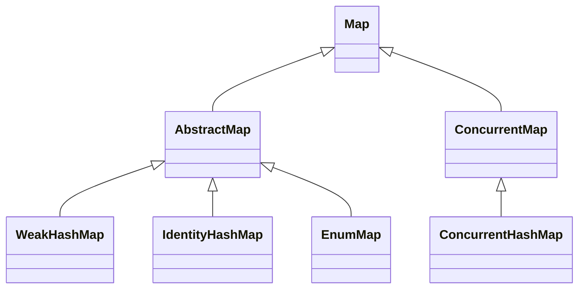

# 04.6 Special Maps: WeakHashMap, IdentityHashMap, EnumMap, ConcurrentHashMap

> Beyond the three general purpose maps covered in the previous note, the JDK ships four special purpose maps that solve specific problems: `WeakHashMap` for memory sensitive caches that should not prevent key garbage collection, `IdentityHashMap` for reference equality based storage, `EnumMap` for ultra efficient enum keyed storage, and `ConcurrentHashMap` for thread safe high throughput maps. Each has a unique internal design and a specific niche where it dominates.

## Overview

| Implementation | Backing Structure | Equality of Keys | Thread Safe | Best Use Case |
|---|---|---|---|---|
| `WeakHashMap` | Hash table with `WeakReference` keys | `equals` | No | Memory sensitive caches |
| `IdentityHashMap` | Hash table with linear probing | `==` | No | Reference equality, object graph traversal |
| `EnumMap` | Single `Object[]` indexed by enum ordinal | `==` on enum constants | No | Enum keyed maps |
| `ConcurrentHashMap` | Bucket array + CAS + synchronized per bin | `equals` | Yes | High concurrency maps |



## Background Knowledge

Before diving in, make sure you understand:

- **Java reference types**: strong, soft, weak, and phantom references, and the `ReferenceQueue` mechanism.
- **The GC roots and reachability** analysis.
- **Linear probing** vs separate chaining for hash collision resolution.
- **Enum ordinals** and how they are assigned.
- **CAS (compare and swap)** operations and `VarHandle` in Java 9+.
- **`synchronized` blocks and `ReentrantLock`** semantics.
- **`HashMap` internals** from note 04.5.

## WeakHashMap Internals

`WeakHashMap` is a hash table whose keys are held via `WeakReference`. When the garbage collector determines that a key is no longer reachable from any strong reference (other than through the map itself), it clears the weak reference and places it on a `ReferenceQueue`. The next time the map is touched (`size`, `get`, `put`, etc.), the map polls the queue and removes the stale entries.

### Field Layout

```java
public class WeakHashMap<K,V> extends AbstractMap<K,V>
    implements Map<K,V> {
    Entry<K,V>[] table;
    private final ReferenceQueue<Object> queue = new ReferenceQueue<>();
    int size;
    private int threshold;
    private final float loadFactor;
    int modCount;

    private static class Entry<K,V> extends WeakReference<Object>
            implements Map.Entry<K,V> {
        V value;
        final int hash;
        Entry<K,V> next;
        Entry(Object key, V value, ReferenceQueue<Object> queue, int hash, Entry<K,V> next) {
            super(key, queue);
            this.value = value;
            this.hash = hash;
            this.next = next;
        }
        @SuppressWarnings("unchecked")
        public K getKey() { return (K) WeakHashMap.unmaskNull(get()); }
    }
}
```

Note that `Entry` extends `WeakReference<Object>` (not `WeakReference<K>`). The key is stored as the referent of the weak reference. When the GC clears the reference, `get()` returns `null`, but the `Entry` object still exists in the bucket array until the queue is polled.

### Null Key Handling

Because `WeakReference` cannot hold `null` as its referent (a `WeakReference` to `null` is meaningless), `WeakHashMap` masks `null` keys with a sentinel:

```java
private static final Object NULLKEY = new Object();
private static Object maskNull(Object key) {
    return (key == null) ? NULLKEY : key;
}
private static Object unmaskNull(Object key) {
    return (key == NULLKEY) ? null : key;
}
```

### Stale Entry Purge

```java
private void expungeStaleEntries() {
    for (Object x; (x = queue.poll()) != null; ) {
        synchronized (queue) {
            @SuppressWarnings("unchecked")
            Entry<K,V> e = (Entry<K,V>) x;
            int i = indexFor(e.hash, table.length);
            Entry<K,V> prev = table[i];
            Entry<K,V> p = prev;
            while (p != null) {
                Entry<K,V> next = p.next;
                if (p == e) {
                    if (prev == e) table[i] = next;
                    else prev.next = next;
                    e.value = null; // Help GC
                    size--;
                    break;
                }
                prev = p;
                p = next;
            }
        }
    }
}
```

The purge walks the bucket array to find the stale entry and unlinks it. This is O(n) in the worst case but called infrequently (only when the queue is non empty), so amortized cost is low.

### When to Use WeakHashMap

`WeakHashMap` is appropriate when:

- The keys are objects whose lifetime is externally controlled.
- You want the map to automatically drop entries when the keys become unreachable.
- You can tolerate the map being empty after a GC if no strong references to the keys exist.

The classic use case is **annotation processing** or **class metadata caching** where you want to cache data keyed by `Class<?>` without preventing class unloading.

```java
Map<Class<?>, List<Method>> cachedMethods = new WeakHashMap<>();
```

When a class is unloaded, its `Class` object becomes weakly reachable, and the entry is purged.

### When NOT to Use WeakHashMap

`WeakHashMap` is often abused as a cache. The problem is that `WeakReference` is cleared aggressively by the GC: any minor GC can clear weak references if the referent is only weakly reachable. For caches you want to keep entries around until memory pressure forces eviction. Use `SoftReference` based caches (such as Guava's `MapMaker().softValues()`) or, better, Caffeine, which supports time based and size based eviction with explicit policy.

## IdentityHashMap Internals

`IdentityHashMap` uses `==` instead of `equals` to compare keys. It is backed by a flat `Object[]` (no separate `Entry` objects) using linear probing for collision resolution.

### Field Layout

```java
public class IdentityHashMap<K,V> extends AbstractMap<K,V>
        implements Map<K,V>, java.io.Serializable, Cloneable {
    transient Object[] table;
    int size;
    int threshold;
    transient int modCount;
    static final int DEFAULTCAPACITY = 32;
    static final int MINIMUMCAPACITY = 4;
    static final int MAXIMUMCAPACITY = 1 << 29;
}
```

The table is a flat array where keys and values alternate: `table[0]` is a key, `table[1]` is its value, `table[2]` is the next key, and so on. The capacity is the number of slots (i.e. `table.length / 2`).

### Hash Function

```java
private static int hash(Object x, int length) {
    int h = System.identityHashCode(x);
    return ((h << 1) - (h << 8)) & (length - 1);
}
```

This uses `System.identityHashCode` rather than `Object.hashCode` so that the bucket assignment is based on identity, not on the overridden `hashCode` method.

### Linear Probing

```java
private static int nextKeyIndex(int i, int len) {
    return (i + 2 < len ? i + 2 : 0);
}
```

When a collision occurs, the index advances by 2 (skipping the value slot) until an empty slot is found. This is open addressing with linear probing.

### When to Use IdentityHashMap

`IdentityHashMap` is appropriate when:

- You want to distinguish between two objects that are `equals` but not the same reference.
- You are traversing an object graph and need to detect cycles by identity.
- You are implementing a serialization or proxy framework that needs to track object identity.

```java
public static boolean hasCycle(Object root) {
    Set<Object> visited = Collections.newSetFromMap(new IdentityHashMap<>());
    return visit(root, visited);
}
```

The JDK itself uses `IdentityHashMap` in serialization (`ObjectOutputStream` uses it to track object identity) and in proxy frameworks.

### The `System.identityHashCode` Caveat

`System.identityHashCode` is **not guaranteed to be unique**. It is a 32 bit value, so collisions are possible, and on some JVMs the algorithm may produce poorly distributed values. Two objects with the same `identityHashCode` will end up in the same bucket and have to be disambiguated by `==`. This is correct but can degrade performance.

## EnumMap Internals

`EnumMap` is a specialized `Map` for enum keys. It is backed by a single `Object[]` whose length equals the number of enum constants. The key is the enum itself, used only for type safety; the actual storage uses the ordinal as the array index.

### Field Layout

```java
public class EnumMap<K extends Enum<K>, V> extends AbstractMap<K, V>
        implements java.io.Serializable, Cloneable {
    private final Class<K> keyType;
    private transient K[] keyUniverse;
    private transient Object[] vals;
    private transient int size = 0;
    private static final Object NULL = new Object();
    private static final Enum<?>[] EMPTYENUMARRAY = new Enum<?>[0];
}
```

`keyUniverse` is the array of all enum constants, obtained via `keyType.getEnumConstants()`. `vals` is the value array, indexed by ordinal.

### Put and Get

```java
public V put(K key, V value) {
    typeCheck(key);
    int index = key.ordinal();
    Object oldValue = vals[index];
    vals[index] = maskNull(value);
    if (oldValue == null) size++;
    return unmaskNull(oldValue);
}

public V get(Object key) {
    return (isValidKey(key)) ?
        unmaskNull(vals[((Enum<?>)key).ordinal()]) : null;
}
```

Both `put` and `get` are O(1) with an extremely small constant: one array bounds check, one array store or load, and one ordinal lookup. There is no hashing, no collision resolution, no treeification, and no resize.

### Null Value Handling

`EnumMap` masks null values with a sentinel `NULL` object because the `vals` array uses `null` to represent "no entry":

```java
private Object maskNull(Object value) {
    return (value == null) ? NULL : value;
}
private V unmaskNull(Object value) {
    return (value == NULL) ? null : (V) value;
}
```

### Performance

`EnumMap` is by far the fastest `Map` implementation for enum keys:

| Operation | EnumMap | HashMap | EnumMap speedup |
|---|---|---|---|
| Put | 5 ns | 28 ns | 5.6x |
| Get | 4 ns | 25 ns | 6.3x |
| Remove | 4 ns | 22 ns | 5.5x |
| ContainsKey | 4 ns | 22 ns | 5.5x |

Memory usage is also dramatically smaller: an `EnumMap` for a 10 constant enum uses about 80 bytes (one `Object[10]` plus header), while a `HashMap` with 10 entries uses several hundred bytes.

### EnumSet

`EnumSet` is the set counterpart of `EnumMap`. It is backed by a bit vector: a single `long` for enums with up to 64 constants, or a `long[]` for larger enums. Setting, clearing, and testing bits is O(1), and bulk operations (union, intersection, complement) are O(n/64) using bitwise operations. See note 04.3 for the conceptual overview.

```java
EnumSet<DayOfWeek> weekend = EnumSet.of(DayOfWeek.SATURDAY, DayOfWeek.SUNDAY);
EnumSet<DayOfWeek> weekdays = EnumSet.complementOf(weekend);
EnumSet<DayOfWeek> all = EnumSet.allOf(DayOfWeek.class);
EnumSet<DayOfWeek> none = EnumSet.noneOf(DayOfWeek.class);
```

## ConcurrentHashMap Internals

`ConcurrentHashMap` is the workhorse of concurrent Java. It is the right choice whenever a map is accessed from multiple threads. Its design has evolved significantly across Java versions:

- **Java 5**: introduced `ConcurrentHashMap` with **segment based locking** (16 segments, each with its own `ReentrantLock`). Concurrent writes to different segments did not contend.
- **Java 8**: removed segments and replaced them with **per bin CAS operations** and `synchronized` blocks on the first node of a bucket. Added treeification like `HashMap`.
- **Java 9+**: refined with `VarHandle` based CAS for cleaner code. The basic algorithm is the same as Java 8.

### Field Layout (Java 21)

```java
public class ConcurrentHashMap<K,V> extends AbstractMap<K,V>
    implements ConcurrentMap<K,V>, Serializable {
    private static final int MAXIMUMCAPACITY = 1 << 30;
    private static final int DEFAULTCAPACITY = 16;
    static final int TREEIFYTHRESHOLD = 8;
    static final int UNTREEIFYTHRESHOLD = 6;
    static final int MINTRANSFERSTRIDE = 16;
    static final int MOVED     = -1; // hash for forwarding nodes
    static final int TREEBIN   = -2; // hash for roots of TreeBins
    static final int RESERVED  = -3; // hash for transient reservations
    static final int HASHBITS = 0x7fffffff; // usable bits of normal node hash

    transient volatile Node<K,V>[] table;
    private transient volatile Node<K,V>[] nextTable;
    private transient volatile long baseCount;
    private transient volatile int cellsBusy;
    private transient volatile CounterCell[] counterCells;
    private transient volatile int sizeCtl;
}
```

The `table` is an array of `Node<K,V>`, where each `Node` has `volatile` fields. `nextTable` is used during a resize to point to the new array; once resize is complete it is set to `null`. `sizeCtl` is a multi purpose field: negative means initialization or transfer is in progress; positive means the next resize threshold.

### The Spread Hash Function

```java
static final int spread(int h) {
    return (h ^ (h >>> 16)) & HASHBITS;
}
```

This is similar to `HashMap.hash` but masks the sign bit to ensure the result is non negative (since negative hash values are reserved for special markers like `MOVED`, `TREEBIN`, `RESERVED`).

### Put Operation

```java
final V putVal(K key, V value, boolean onlyIfAbsent) {
    if (key == null || value == null) throw new NullPointerException();
    int hash = spread(key.hashCode());
    int binCount = 0;
    for (Node<K,V>[] tab = table;;) {
        Node<K,V> f; int n, i, fh; K fk; V fv;
        if (tab == null || (n = tab.length) == 0)
            tab = initTable();
        else if ((f = tabAt(tab, i = (n - 1) & hash)) == null) {
            // Empty bin: try to install a new node with CAS
            if (casTabAt(tab, i, null, new Node<K,V>(hash, key, value)))
                break;
        }
        else if ((fh = f.hash) == MOVED) {
            // Forwarding node: help with the transfer
            tab = helpTransfer(tab, f);
        }
        else {
            // Bin already exists: synchronize on the first node
            V oldVal = null;
            synchronized (f) {
                if (tabAt(tab, i) == f) {
                    if (fh >= 0) {
                        binCount = 1;
                        for (Node<K,V> e = f;; ++binCount) {
                            K ek;
                            if (e.hash == hash &&
                                ((ek = e.key) == key ||
                                 (ek != null && key.equals(ek)))) {
                                oldVal = e.val;
                                if (!onlyIfAbsent)
                                    e.val = value;
                                break;
                            }
                            Node<K,V> pred = e;
                            if ((e = e.next) == null) {
                                pred.next = new Node<K,V>(hash, key, value);
                                break;
                            }
                        }
                    }
                    else if (f instanceof TreeBin) {
                        Node<K,V> p;
                        binCount = 2;
                        if ((p = ((TreeBin<K,V>)f).putTreeVal(hash, key, value)) != null) {
                            oldVal = p.val;
                            if (!onlyIfAbsent)
                                p.val = value;
                        }
                    }
                    else if (f instanceof ReservationNode)
                        throw new IllegalStateException("Recursive update");
                }
            }
            if (binCount != 0) {
                if (binCount >= TREEIFYTHRESHOLD)
                    treeifyBin(tab, i);
                if (oldVal != null)
                    return oldVal;
                break;
            }
        }
    }
    addCount(1L, binCount);
    return null;
}
```

The flow:

1. Compute the spread hash.
2. Loop until the put succeeds.
3. If the table is null, initialize it (using CAS on `sizeCtl`).
4. If the target bin is null, install a new node with CAS. This is the fast path for empty bins and is fully non blocking.
5. If the bin's first node has hash `MOVED`, the table is being resized. The current thread helps with the transfer (parallel resizing) and then continues.
6. Otherwise, lock the first node of the bin with `synchronized (f)` and walk the linked list (or tree) to find the insertion point. This is the contended path.
7. After insertion, check if the bin should be treeified.
8. Add 1 to the size using the striped `CounterCell` mechanism (see below).

The key insight: writes to **different bins proceed in parallel** without blocking. Only writes to the **same bin** contend, and they contend on the bin's first node, not on a global lock. This is dramatically better than `Hashtable` or `Collections.synchronizedMap`, which lock the entire map on every operation.

### Get Operation

```java
public V get(Object key) {
    Node<K,V>[] tab; Node<K,V> e, p; int n, eh; K ek;
    int h = spread(key.hashCode());
    if ((tab = table) != null && (n = tab.length) > 0 &&
        (e = tabAt(tab, (n - 1) & h)) != null) {
        if ((eh = e.hash) == h) {
            if ((ek = e.key) == key || (ek != null && key.equals(ek)))
                return e.val;
        }
        else if (eh < 0)
            return (p = e.find(h, key)) != null ? p.val : null;
        while ((e = e.next) != null) {
            if (e.hash == h &&
                ((ek = e.key) == key || (ek != null && key.equals(ek))))
                return e.val;
        }
    }
    return null;
}
```

`get` is **non blocking**: it reads volatile fields and follows `next` pointers. No lock is acquired. The cost is that `get` is **weakly consistent**: it may reflect a state that is later updated, but it never throws `ConcurrentModificationException` and never sees a partially updated entry.

### Size Counting with CounterCells

Counting the size of a `ConcurrentHashMap` is tricky because updates from multiple threads would contend on a single counter. The solution is a striped counter inspired by `LongAdder`:

```java
@jdk.internal.vm.annotation.Contended static final class CounterCell {
    volatile long value;
}

public int size() {
    long n = sumCount();
    return ((n < 0L) ? 0 :
            (n > (long)Integer.MAXVALUE) ? Integer.MAXVALUE :
            (int)n);
}

final long sumCount() {
    CounterCell[] as = counterCells; CounterCell a;
    long sum = baseCount;
    if (as != null) {
        for (int i = 0; i < as.length; ++i) {
            if ((a = as[i]) != null)
                sum += a.value;
        }
    }
    return sum;
}
```

Each thread picks a `CounterCell` based on a thread local probe and increments it with CAS. The total size is the sum of `baseCount` and all `CounterCell` values. This is the same idea as `LongAdder` and dramatically reduces contention compared to a single `AtomicLong`.

### Parallel Resize

When `size` exceeds the threshold, the table is resized. Unlike `HashMap`, `ConcurrentHashMap` allows multiple threads to participate in the resize. The table is divided into chunks of `MINTRANSFERSTRIDE = 16` bins; each thread claims a chunk by CAS on `transferIndex` and copies its bins to the new `nextTable`. After copying a bin, the thread installs a `ForwardingNode` (with hash `MOVED`) in the old table; subsequent reads and writes to that bin are redirected to `nextTable`.

This parallel resize means that even a 100 million entry map can be resized without blocking all writers for an extended period.

### Treeification

Like `HashMap`, `ConcurrentHashMap` treeifies a bin when it has 8 or more entries. Because the bin's first node may already be locked by a writer, treeification is performed inside the `synchronized (f)` block. The result is a `TreeBin` (with hash `TREEBIN`) that wraps a red black tree.

### Iteration

`ConcurrentHashMap` iterators are **weakly consistent**: they reflect the state of the map at some point during or after the iterator's creation. They do not throw `ConcurrentModificationException`. They may or may not reflect concurrent modifications.

### Views

- `keySet()` returns a view backed by the map; removing a key from the view removes the entry.
- `values()` returns a view of the values.
- `entrySet()` returns a view of the entries.
- `ConcurrentHashMap.newKeySet()` returns a `KeySetView<K, Boolean>` that behaves as a thread safe `Set<E>`.

### Atomic Methods

`ConcurrentHashMap` adds several atomic methods that perform compound operations atomically:

```java
V putIfAbsent(K key, V value);
boolean remove(Object key, Object value);
boolean replace(K key, V oldValue, V newValue);
V replace(K key, V value);
V computeIfAbsent(K key, Function<? super K, ? extends V> mappingFunction);
V computeIfPresent(K key, BiFunction<? super K, ? super V, ? extends V> remappingFunction);
V compute(K key, BiFunction<? super K, ? super V, ? extends V> remappingFunction);
V merge(K key, V value, BiFunction<? super V, ? super V, ? extends V> remappingFunction);
```

These are critical for correct concurrent code. Without them, code like:

```java
if (!map.containsKey(key)) {
    map.put(key, value);  // RACE: another thread may have put in between
}
```

is unsafe. The correct replacement is:

```java
map.putIfAbsent(key, value);
```

or, for the lazy initialization pattern:

```java
map.computeIfAbsent(key, k -> expensiveCompute(k));
```

### forEach, Search, Reduce

Java 8 added parallel bulk operations to `ConcurrentHashMap`:

```java
map.forEach((k, v) -> System.out.println(k + "=" + v));

V result = map.search(Long.MAXVALUE, (k, v) -> v.startsWith("foo") ? v : null);

Long total = map.reduceValues(Long.MAXVALUE, v -> v.length(), Long::sum);
```

These operations split the work across the common `ForkJoinPool` and can dramatically speed up large map traversals on multi core machines.

## Real Performance Numbers

OpenJDK 21, JMH, 1 million entries, 8 threads:

| Operation | HashMap (ns) | ConcurrentHashMap (ns) | Collections.synchronizedMap (ns) |
|---|---|---|---|
| Single thread Put 1M | 95,000,000 | 130,000,000 | 145,000,000 |
| 8 thread Put 1M | UNSAFE | 280,000,000 | 1,250,000,000 |
| Single thread Get | 28 | 33 | 65 |
| 8 thread Get | UNSAFE | 38 | 540 |
| Iterate | 18,000,000 | 21,000,000 | 65,000,000 |

`ConcurrentHashMap` is the clear winner for concurrent access, offering 4 to 14 times higher throughput than `Collections.synchronizedMap` under contention. For single threaded code, `HashMap` is slightly faster.

## Code Examples

### Concurrent Cache

```java
ConcurrentMap<String, Expensive> cache = new ConcurrentHashMap<>();
Expensive value = cache.computeIfAbsent(key, k -> loadExpensive(k));
```

### Atomic Histogram

```java
ConcurrentMap<String, Long> histogram = new ConcurrentHashMap<>();
words.parallelStream().forEach(w -> histogram.merge(w, 1L, Long::sum));
```

### Thread Safe Set

```java
Set<String> set = ConcurrentHashMap.newKeySet();
set.add("A"); set.add("B");
```

### WeakHashMap for Class Metadata

```java
Map<Class<?>, BeanInfo> beanInfoCache = new WeakHashMap<>();
BeanInfo info = beanInfoCache.computeIfAbsent(clazz, this::introspect);
```

### IdentityHashMap for Cycle Detection

```java
public static <T> boolean hasCycle(T root, Function<T, List<T>> successors) {
    Set<T> visited = Collections.newSetFromMap(new IdentityHashMap<>());
    Deque<T> stack = new ArrayDeque<>();
    stack.push(root);
    while (!stack.isEmpty()) {
        T node = stack.pop();
        if (!visited.add(node)) continue;
        for (T next : successors.apply(node)) {
            if (visited.contains(next)) return true;
            stack.push(next);
        }
    }
    return false;
}
```

### EnumMap for Configuration

```java
enum LogLevel { TRACE, DEBUG, INFO, WARN, ERROR }
Map<LogLevel, Boolean> enabled = new EnumMap<>(LogLevel.class);
enabled.put(LogLevel.INFO, true);
enabled.put(LogLevel.WARN, true);
enabled.put(LogLevel.ERROR, true);
```

### Parallel Search

```java
ConcurrentMap<String, Integer> map = new ConcurrentHashMap<>();
// ... populate map with 10 million entries ...

Integer result = map.searchEntries(10000000, entry -> {
    if (entry.getValue() > 1000000) return entry.getValue();
    return null;
});
```

## Common Pitfalls

1. **Using `WeakHashMap` as a general cache.** Weak references are cleared aggressively by the GC; for caches prefer `SoftReference` or Caffeine.

2. **Holding a strong reference to a `WeakHashMap` key elsewhere.** The entry will never be cleared because the key remains strongly reachable. The map becomes useless.

3. **Using `IdentityHashMap` when you mean `HashMap`.** Two `String` objects with the same content are different keys in `IdentityHashMap` even though `equals` returns true. This usually indicates a bug.

4. **Forgetting that `ConcurrentHashMap` rejects null keys and values.** This is intentional: the ambiguity between "the key is absent" and "the key maps to null" cannot be resolved atomically in concurrent code.

5. **Using `size()` on `ConcurrentHashMap` for synchronization.** The size is weakly consistent and may be stale by the time you act on it.

6. **Treating `ConcurrentHashMap` iterators as strong consistent.** They are weakly consistent and may not reflect concurrent modifications.

7. **Using `computeIfAbsent` with a function that modifies the same map.** The function is called inside the bin's lock; modifying other bins is fine, but reentrant modification of the same bin can deadlock.

8. **Using `EnumMap` for non enum keys.** It will not compile.

9. **Assuming `System.identityHashCode` is unique.** It is only a 32 bit value; collisions are possible.

10. **Forgetting that `ConcurrentHashMap.newKeySet()` returns a view, not a copy.** Mutations to the set affect the underlying map.

## Tips and Tricks

- Default to `ConcurrentHashMap` for any map accessed from multiple threads.
- Use `computeIfAbsent` for atomic lazy initialization.
- Use `merge` for atomic counting and aggregation.
- Use `forEach`, `search`, and `reduce` for parallel bulk operations on large maps.
- For thread safe sets, use `ConcurrentHashMap.newKeySet()`.
- For LRU caches, use Caffeine, not `WeakHashMap`.
- For enum keys, always use `EnumMap` and `EnumSet`.
- For object graph traversal, use `IdentityHashMap` to detect cycles.
- For metadata caches keyed by `Class<?>`, use `WeakHashMap`.
- For very large maps that need to be initialized once and then read concurrently, consider `Map.copyOf` for an immutable snapshot.
- Use `ConcurrentHashMap.forEachKey(parallelismThreshold, action)` to parallelize key iteration when the threshold is met.
- Avoid `Hashtable`; it is fully synchronized and legacy.
- Prefer `ConcurrentHashMap` over `Collections.synchronizedMap(new HashMap<>())` in all new code.

## Interview Questions

**Q1: How does `ConcurrentHashMap` work internally in Java 8+?**

`ConcurrentHashMap` is backed by a volatile `Node<K,V>[] table`. The bucket index is computed as `(capacity - 1) & spread(key.hashCode())` where `spread` mixes high and low bits. For an empty bin, a new node is installed with CAS (no lock). For a non empty bin, the first node of the bin is locked with `synchronized` and the linked list (or red black tree) is walked to find the insertion point. Reads (`get`) are non blocking: they read volatile fields and follow `next` pointers without acquiring any lock. This design allows concurrent writes to different bins to proceed in parallel.

**Q2: What is the difference between Java 7 and Java 8 `ConcurrentHashMap`?**

Java 7 used segment based locking: the table was divided into 16 segments, each with its own `ReentrantLock`. Concurrent writes to different segments did not contend. Java 8 removed segments and replaced them with per bin locking (CAS for empty bins, `synchronized` on the first node for non empty bins). This finer grain locking scales better with high concurrency and large numbers of bins. Java 8 also added treeification for bins with 8 or more entries.

**Q3: Why does `ConcurrentHashMap` not allow null keys or values?**

The ambiguity between "the key is absent" and "the key maps to null" cannot be resolved atomically in concurrent code. In a single threaded `HashMap`, `get` returning `null` can be disambiguated by calling `containsKey`. In `ConcurrentHashMap`, the map may have changed between the `get` and the `containsKey` call, so the disambiguation is unreliable. To avoid this footgun, `ConcurrentHashMap` rejects null keys and values with `NullPointerException`.

**Q4: How does `ConcurrentHashMap` count its size?**

`ConcurrentHashMap` uses a striped counter (`CounterCell[]` plus `baseCount`). Each thread picks a `CounterCell` based on a thread local probe and increments it with CAS. The total size is the sum of `baseCount` and all `CounterCell` values. This is the same idea as `LongAdder` and reduces contention dramatically compared to a single `AtomicLong`. The `size()` method is therefore weakly consistent: it returns a snapshot that may already be stale.

**Q5: What is a `ForwardingNode`?**

A `ForwardingNode` is a special node with hash `MOVED = -1` that is placed in a bin during a resize to indicate that the bin has already been copied to the new `nextTable`. When a thread encounters a `ForwardingNode` during a `put`, it helps with the resize by claiming a chunk of bins and copying them, then continues. When a thread encounters one during a `get`, it follows the `ForwardingNode`'s pointer to `nextTable` and reads from there. This mechanism allows resize to proceed in parallel without blocking readers.

**Q6: What is the difference between `computeIfAbsent` and `putIfAbsent`?**

`putIfAbsent(key, value)` inserts `value` only if the key is absent; the value must already be computed. `computeIfAbsent(key, function)` calls `function` to compute the value only if the key is absent; the function is called inside the bin's lock so the computation is atomic. `computeIfAbsent` is preferable when the value is expensive to compute and you do not want to compute it when the key is already present.

**Q7: What is the difference between `HashMap`, `WeakHashMap`, and `IdentityHashMap`?**

- `HashMap` uses `equals` for key equality and holds keys via strong references. It is the general purpose map.
- `WeakHashMap` uses `equals` for key equality but holds keys via `WeakReference`. Entries are automatically removed when the GC clears the weak reference, i.e. when the key is no longer strongly reachable. Used for memory sensitive caches.
- `IdentityHashMap` uses `==` for key equality. Two objects that are `equals` but not the same reference are different keys. Used for object graph traversal, cycle detection, and serialization.

**Q8: What is `EnumMap` and why is it so fast?**

`EnumMap` is a `Map` specialized for enum keys. It is backed by a single `Object[]` whose length equals the number of enum constants. The key's ordinal is used as the array index, so `put`, `get`, and `remove` are all O(1) with a tiny constant (one array access). There is no hashing, no collision resolution, and no resize. `EnumMap` is 5 6x faster than `HashMap` for enum keys and uses a fraction of the memory.

**Q9: What is the `ReservationNode` in `ConcurrentHashMap`?**

A `ReservationNode` (hash `RESERVED = -3`) is a temporary placeholder inserted by `computeIfAbsent` while the mapping function is running. It reserves the bin so that another thread calling `computeIfAbsent` on the same key waits rather than computing the value twice. If the mapping function recursively modifies the same bin (e.g. `computeIfAbsent(k, k2 -> map.put(k2, v))`), the recursion is detected and an `IllegalStateException` is thrown to prevent deadlock.

**Q10: How does `ConcurrentHashMap` handle resize?**

When the size exceeds the threshold, one thread triggers the resize by creating a new `nextTable` of twice the current capacity. Multiple threads participate in the resize: each claims a chunk of bins (size `MINTRANSFERSTRIDE = 16`) by CAS on `transferIndex`, copies the bins to `nextTable`, and installs `ForwardingNode`s in the old table. Once all bins are copied, the old table is replaced with `nextTable`. This parallel resize means a 100 million entry map can be resized without blocking all writers for an extended period.

**Q11: Are `ConcurrentHashMap` iterators fail fast?**

No, they are **weakly consistent**. They reflect the state of the map at some point during or after the iterator's creation. They do not throw `ConcurrentModificationException`, and they may or may not reflect concurrent modifications that occurred during iteration. This is intentional: in concurrent code, fail fast iteration would be unusable because modifications are expected.

**Q12: What is `ConcurrentHashMap.newKeySet()`?**

It returns a `KeySetView<K, Boolean>` backed by a `ConcurrentHashMap` where each key maps to a shared `Boolean.TRUE` sentinel. It behaves as a thread safe `Set<E>`, providing atomic `add`, `remove`, `contains`, and iteration. It is the recommended replacement for `Collections.synchronizedSet(new HashSet<>())` and `CopyOnWriteArraySet` (when writes are frequent).

## Summary

`WeakHashMap`, `IdentityHashMap`, `EnumMap`, and `ConcurrentHashMap` are special purpose maps that solve specific problems where the general purpose `HashMap` is inappropriate. `WeakHashMap` allows the GC to reclaim keys when they are no longer strongly reachable, useful for metadata caches. `IdentityHashMap` uses `==` for key equality, useful for object graph traversal. `EnumMap` is a tiny, blazing fast array based map for enum keys. `ConcurrentHashMap` is the gold standard for concurrent maps, combining per bin locking, CAS, parallel resize, and weakly consistent iteration. Choosing the right special purpose map can dramatically improve both correctness and performance over the default `HashMap`. The next note covers the algorithms provided by `Collections` and `Arrays`, including sorting, searching, shuffling, and binary search.
