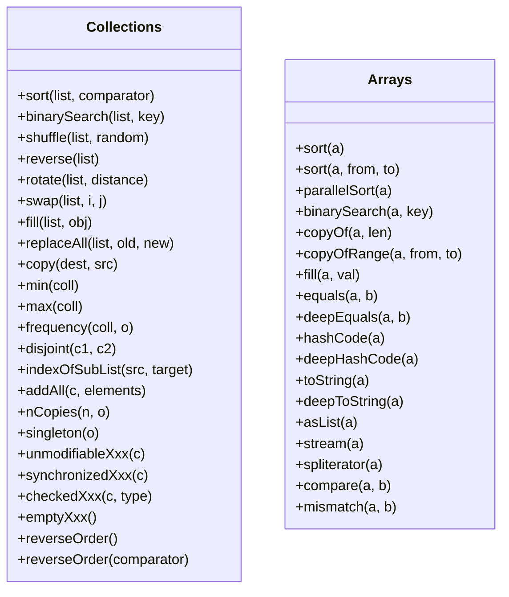
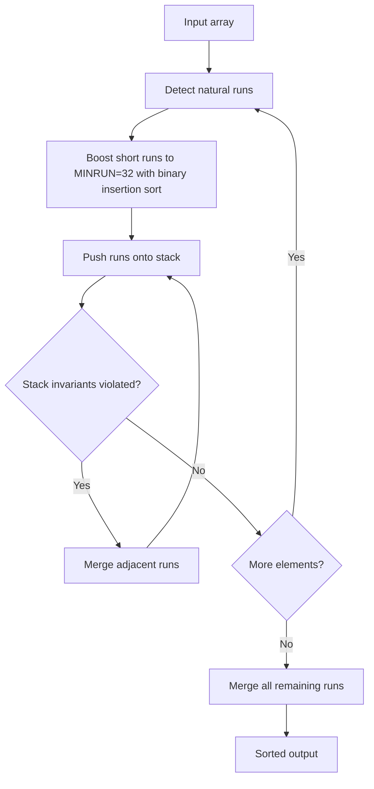

# 04.7 Sorting, Searching, and Algorithms

> The Java Collections Framework ships with two utility classes `Collections` and `Arrays` that provide a rich library of algorithms: sorting, binary search, shuffling, reversing, rotating, frequency counting, disjoint testing, min, max, swap, fill, replaceAll, addAll, nCopies, and more. This note covers the algorithms, the underlying sort implementations (TimSort, Dual Pivot Quicksort, ParallelSort), and the design philosophy of the framework's algorithm layer.

## Overview

The framework exposes algorithms as **static methods on utility classes** rather than as instance methods on collections. This is a deliberate design choice: it keeps the collection interfaces small and lets you add your own algorithms without modifying the JDK.



## Background Knowledge

Before reading further, ensure you are familiar with:

- **Comparison based sorting algorithms**: insertion sort, merge sort, quicksort, heapsort.
- **The O(n log n) lower bound** for comparison based sorting.
- **Stability** in sorting: a stable sort preserves the relative order of equal elements.
- **Binary search** and its O(log n) precondition (the array must be sorted).
- **The Java Memory Model** and how `Arrays.parallelSort` uses `ForkJoinPool`.
- **`Comparator`** as a strategy object for ordering.
- **The `List` interface** from note 04.1.

## The Sort Algorithms

### TimSort (used by `Collections.sort` and `Arrays.sort(Object[])`)

TimSort is a hybrid of merge sort and insertion sort, designed by Tim Peters for Python in 2002 and adopted by Java in Java 7. It is stable and has O(n log n) worst case and O(n) best case complexity.

The key ideas:

1. **Run detection**: scan the array for naturally ordered subsequences ("runs") of length at least 32. If a run is descending, reverse it in place.
2. **Run boosting**: if a natural run is shorter than 32, use binary insertion sort to extend it to 32 elements.
3. **Run merging**: maintain a stack of runs and merge adjacent runs when the stack invariants are violated (ensuring balanced merges).
4. **Galloping mode**: during merge, if many elements from one run are taken in succession, switch to galloping (exponential search) to find the merge point faster.



### Dual Pivot Quicksort (used by `Arrays.sort(int[])` and other primitive arrays)

Vladimir Yaroslavskiy's Dual Pivot Quicksort, introduced in Java 7, partitions the array around two pivots into three regions: less than pivot1, between pivot1 and pivot2, and greater than pivot2. For small subarrays it falls back to insertion sort, and for highly structured data it falls back to counting sort.

The algorithm is **not stable** for primitive arrays, which is fine because primitives have no identity beyond their value.

### ParallelSort (used by `Arrays.parallelSort`)

Introduced in Java 8, `Arrays.parallelSort` splits the array into subarrays of at least `1 << 13` (8192) elements, sorts each subarray in parallel using `ForkJoinPool.commonPool`, then merges them. For arrays smaller than the threshold, it falls back to a sequential sort.

### Sorting `List` vs `Array`

`Collections.sort(list)` works on any `List`:

```java
List<Integer> nums = new ArrayList<>(List.of(5, 2, 8, 1, 9, 3));
Collections.sort(nums);                              // natural order
nums.sort(Comparator.reverseOrder());                // descending
nums.sort(Comparator.comparingInt(Integer::intValue).reversed());
```

For a `RandomAccess` list (like `ArrayList`), `Collections.sort` dumps the list into an array, sorts the array with TimSort, and writes the result back. For a non `RandomAccess` list (like `LinkedList`), it dumps into an array, sorts, and writes back. Either way the algorithm is O(n log n) and stable.

Java 8 added `List.sort(Comparator)` as a default method that delegates to `Collections.sort`.

## The `Comparator` DSL

Modern Java `Comparator` is a fluent DSL:

```java
Comparator<Person> byAge = Comparator.comparingInt(Person::age);
Comparator<Person> byNameThenAge = Comparator
    .comparing(Person::lastName)
    .thenComparing(Person::firstName)
    .thenComparingInt(Person::age);
Comparator<Person> nullsFirst = Comparator.nullsFirst(byAge);
Comparator<Person> reversed = byAge.reversed();
Comparator<Person> reverseNatural = Comparator.reverseOrder();
```

Common static factory methods:

- `Comparator.naturalOrder()`
- `Comparator.reverseOrder()`
- `Comparator.nullsFirst(Comparator)`
- `Comparator.nullsLast(Comparator)`
- `Comparator.comparing(Function)`
- `Comparator.comparingInt(ToIntFunction)`
- `Comparator.comparingLong(ToLongFunction)`
- `Comparator.comparingDouble(ToDoubleFunction)`

Instance methods:

- `reversed()`
- `thenComparing(Comparator)`
- `thenComparing(Function)`
- `thenComparingInt(ToIntFunction)`

## Binary Search

`Collections.binarySearch(list, key)` requires the list to be sorted. It returns:

- The index of the key, if found.
- `-(insertionPoint) - 1` if not found, where `insertionPoint` is the index where the key would be inserted to keep the list sorted.

```java
List<Integer> sorted = List.of(1, 3, 5, 7, 9, 11);
int idx = Collections.binarySearch(sorted, 6);
// idx = -4, because insertionPoint = 3, so -(3) - 1 = -4
```

This unusual encoding has two properties:

1. The return value is always non negative if the key was found.
2. The insertion point can be recovered as `-(idx + 1)`.

`Arrays.binarySearch` has the same contract for arrays.

### Preconditions

Binary search requires the input to be sorted according to the same `Comparator` used by the search. If the input is not sorted, the result is undefined (the algorithm may return any value, including incorrect indices).

For `RandomAccess` lists, `Collections.binarySearch` uses index based access. For non `RandomAccess` lists, it uses a `ListIterator` to walk to the midpoint, which is O(n) per step; total complexity becomes O(n log n) instead of O(log n). Always prefer `ArrayList` for binary searchable data.

## Shuffle, Reverse, Rotate

### Fisher Yates Shuffle

```java
public static void shuffle(List<?> list, Random rnd) {
    int size = list.size();
    if (size < SHUFFLETHRESHOLD || list instanceof RandomAccess) {
        for (int i = size; i > 1; i--)
            swap(list, i - 1, rnd.nextInt(i));
    } else {
        Object[] arr = list.toArray();
        for (int i = size; i > 1; i--)
            swap(arr, i - 1, rnd.nextInt(i));
        ListIterator it = list.listIterator();
        for (Object e : arr) {
            it.next();
            it.set(e);
        }
    }
}
```

The Fisher Yates algorithm runs in O(n) and produces a uniformly random permutation. For non `RandomAccess` lists, it dumps the list to an array, shuffles, and writes back, avoiding O(n) per swap.

Java 17 added `Collections.shuffle(list, randomGenerator)` accepting any `RandomGenerator` from `java.util.random`.

### Reverse

```java
public static void reverse(List<?> list) {
    int size = list.size();
    if (size < REVERSETHRESHOLD || list instanceof RandomAccess) {
        for (int i = 0, mid = size >> 1, j = size - 1; i < mid; i++, j--)
            swap(list, i, j);
    } else {
        ListIterator fwd = list.listIterator();
        ListIterator rev = list.listIterator(size);
        for (int i = 0, mid = list.size() >> 1; i < mid; i++) {
            Object tmp = fwd.next();
            fwd.set(rev.previous());
            rev.set(tmp);
        }
    }
}
```

O(n) for `RandomAccess` lists, O(n) for non `RandomAccess` lists via two iterators.

### Rotate

```java
public static void rotate(List<?> list, int distance) {
    if (list instanceof RandomAccess || list.size() < ROTATETHRESHOLD)
        rotate1(list, distance);
    else
        rotate2(list, distance);
}
```

`rotate` shifts all elements by `distance` positions, wrapping around. The classic three reversal trick is used internally:

```java
reverse(list.subList(0, size - distance));
reverse(list.subList(size - distance, size));
reverse(list);
```

This is O(n).

## Min, Max, Frequency, Disjoint

```java
public static <T> T min(Collection<? extends T> coll, Comparator<? super T> comp);
public static <T> T max(Collection<? extends T> coll, Comparator<? super T> comp);
public static int frequency(Collection<?> c, Object o);
public static boolean disjoint(Collection<?> c1, Collection<?> c2);
```

- `min` and `max` are O(n), iterating the collection once.
- `frequency` is O(n) for a non `Set`, O(1) for a `Set` (because `contains` is O(1)).
- `disjoint` is O(n + m) if one collection is a `Set` and the other is iterated; otherwise O(n * m).

## Unmodifiable, Synchronized, Checked Wrappers

`Collections` provides three families of wrapper factories:

### Unmodifiable Wrappers

```java
List<String> unmod = Collections.unmodifiableList(new ArrayList<>(List.of("A", "B")));
unmod.add("C"); // throws UnsupportedOperationException
```

These wrap an existing collection and throw on any mutator method. The underlying collection is still mutable; changes to it are visible through the wrapper.

### Synchronized Wrappers

```java
List<String> sync = Collections.synchronizedList(new ArrayList<>());
```

Each method is `synchronized` on the wrapper itself. Iteration must still be externally synchronized:

```java
synchronized (sync) {
    for (String s : sync) {
        System.out.println(s);
    }
}
```

Synchronized wrappers are legacy; prefer `CopyOnWriteArrayList` or `ConcurrentHashMap` for new code.

### Checked Wrappers

```java
List<String> checked = Collections.checkedList(new ArrayList<>(), String.class);
List raw = checked;
raw.add(42); // throws ClassCastException
```

Checked wrappers add runtime type checking to a generic collection. They are useful when a generic collection is exposed to non generic code (legacy APIs, reflection, serialization) and you want to detect type violations at the point of insertion rather than at the point of use.

## Empty, Singleton, nCopies

```java
List<Object> empty = Collections.emptyList();
Set<Object> emptySet = Collections.emptySet();
Map<Object, Object> emptyMap = Collections.emptyMap();
Set<String> one = Collections.singleton("A");
List<String> three = Collections.nCopies(3, "X");
```

These factories return immutable, memory efficient views. `emptyList`, `emptySet`, and `emptyMap` return a shared singleton instance. `singleton` returns a single element set, list, or map. `nCopies(n, o)` returns an immutable list of `n` copies of `o`, backed by a single reference, so memory is O(1) regardless of `n`.

## Arrays Utility

### asList

```java
String[] arr = {"A", "B", "C"};
List<String> list = Arrays.asList(arr);
list.set(0, "X"); // arr[0] is now "X"
list.add("Y");    // throws UnsupportedOperationException
```

`Arrays.asList` returns a fixed size view backed by the array. `set` is allowed but `add` and `remove` are not.

### copyOf and copyOfRange

```java
int[] a = {1, 2, 3, 4, 5};
int[] b = Arrays.copyOf(a, 3);              // [1, 2, 3]
int[] c = Arrays.copyOf(a, 7);              // [1, 2, 3, 4, 5, 0, 0]
int[] d = Arrays.copyOfRange(a, 1, 4);      // [2, 3, 4]
String[] e = Arrays.copyOf(arr, 2, String[].class);
```

`copyOf` truncates or pads with the default value (0 for numeric primitives, false for boolean, null for objects). `copyOfRange` copies a half open range `[from, to)`.

### fill

```java
int[] a = new int[10];
Arrays.fill(a, 42);
Arrays.fill(a, 2, 5, 99); // fill indices 2, 3, 4 with 99
```

### equals and deepEquals

```java
int[] a = {1, 2, 3};
int[] b = {1, 2, 3};
Arrays.equals(a, b);       // true
Object[] nested1 = {a};
Object[] nested2 = {b};
Arrays.equals(nested1, nested2);      // false
Arrays.deepEquals(nested1, nested2);  // true
```

`deepEquals` recurses into nested arrays.

### mismatch

Java 9 added `Arrays.mismatch`:

```java
int[] a = {1, 2, 3, 4, 5};
int[] b = {1, 2, 9, 4, 5};
int idx = Arrays.mismatch(a, b); // 2
```

Returns the index of the first mismatching element, or -1 if the arrays are equal.

### compare

Java 9 added `Arrays.compare` for lexicographic comparison of arrays:

```java
int[] a = {1, 2, 3};
int[] b = {1, 2, 4};
int r = Arrays.compare(a, b); // negative, because a < b
```

## Sorting Real Numbers

```java
double[] arr = {3.14, 1.0, Double.NaN, -0.0, 0.0, 2.7};
Arrays.sort(arr);
// Result: [-0.0, 0.0, 1.0, 2.7, 3.14, NaN]
```

Java's sort places `NaN` at the end and treats `-0.0` as less than `+0.0` for consistency with `Double.compare`. This is the same convention used by `Comparator.naturalOrder()` on boxed `Double`.

## Sorting Strings

```java
String[] names = {"banana", "Apple", "cherry", "apple"};
Arrays.sort(names);                                    // [Apple, apple, banana, cherry]
Arrays.sort(names, String.CASEINSENSITIVEORDER);     // [Apple, apple, banana, cherry]
Arrays.sort(names, Comparator.reverseOrder());         // [cherry, banana, apple, Apple]
```

The default `String` comparator uses lexicographic ordering by UTF 16 code unit, which means uppercase letters sort before lowercase. For locale aware sorting use `Collator`:

```java
Collator collator = Collator.getInstance(Locale.GERMAN);
collator.setStrength(Collator.PRIMARY);
Arrays.sort(names, collator);
```

## Sorting with Streams

```java
List<Person> sorted = people.stream()
    .sorted(Comparator.comparing(Person::lastName).thenComparing(Person::firstName))
    .toList();

List<Person> top10 = people.stream()
    .sorted(Comparator.comparingDouble(Person::salary).reversed())
    .limit(10)
    .toList();
```

The stream `sorted` operation is stable and uses TimSort under the hood.

## Sorting Primitives

```java
int[] nums = {5, 2, 8, 1, 9, 3};
Arrays.sort(nums);            // dual pivot quicksort
Arrays.parallelSort(nums);    // parallel sort
```

For large primitive arrays (millions of elements), `parallelSort` is significantly faster on multi core machines. The crossover point is around 8192 elements.

## Sorting Comparator Chains

```java
List<Employee> emps = ...;

// Sort by department ascending, then by salary descending, then by name ascending
emps.sort(Comparator.comparing(Employee::department)
                    .thenComparing(Employee::salary, Comparator.reverseOrder())
                    .thenComparing(Employee::name));
```

The `thenComparing` chain is evaluated left to right. Each subsequent comparator is applied only if the previous one returned 0 (i.e. the elements are equal under that comparator).

## Common Pitfalls

1. **Binary searching an unsorted list.** The result is undefined.

2. **Binary searching with a different `Comparator` than was used for sorting.** The result is undefined.

3. **Expecting `Arrays.sort(int[])` to be stable.** It is not stable; the algorithm is dual pivot quicksort. Use `Arrays.sort(Integer[])` for stability.

4. **Using `Collections.sort` on a `LinkedList`.** It works (via dump to array, sort, write back) but defeats the purpose of using a linked list. Use an `ArrayList`.

5. **Mutating a `Comparator` after sort.** The `Comparator` should be stateless; if it depends on mutable state, the sort result can be inconsistent.

6. **Comparing `BigDecimal` with `Comparator.naturalOrder()`.** `BigDecimal.equals` considers scale, so `1.0` and `1.00` are different. `BigDecimal.compareTo` does not consider scale, so they are equal. Sorting with `Comparator.naturalOrder()` uses `compareTo`, but a `HashSet` uses `equals`, so the two disagree.

7. **Forgetting that `Arrays.asList` is fixed size.** Use `new ArrayList<>(Arrays.asList(...))` for a mutable copy.

8. **Forgetting to synchronize on a synchronized wrapper during iteration.** The wrapper synchronizes each method call, but iteration across multiple calls is not atomic.

9. **Assuming `Collections.shuffle` produces a perfectly uniform distribution.** It uses `Random.nextInt(int)` which has a slight bias; for cryptographic use, use `SecureRandom` and a more careful shuffle.

10. **Using `Collections.sort` in a tight loop.** If you sort the same list repeatedly, consider keeping it sorted with insertion sort at the right position, or use a `TreeSet` / `PriorityQueue`.

## Tips and Tricks

- For small lists (< 47 elements), insertion sort is faster than TimSort due to lower overhead.
- For very large lists on multi core machines, dump to an array and use `Arrays.parallelSort`.
- Use `List.sort(comparator)` instead of `Collections.sort(list, comparator)` for readability.
- Use `Comparator.comparing(...).thenComparing(...)` for multi field comparisons.
- Use `Comparator.nullsFirst` or `nullsLast` to handle nulls in sorted collections.
- Use `Collections.frequency` for counting occurrences.
- Use `Collections.disjoint` to check if two collections have no common elements.
- Use `Collections.singleton` for one element immutable collections.
- Use `Collections.nCopies` for immutable repeated element lists.
- Use `Arrays.copyOf` and `Arrays.copyOfRange` for array slicing.
- Use `Arrays.mismatch` and `Arrays.compare` (Java 9+) for array comparison.
- Use `Arrays.stream(arr)` to create a stream from an array.
- Use `Stream.sorted()` for functional sorting without mutating the source.
- Use `Collectors.groupingBy(..., Collectors.counting())` for histograms.
- Use `Collectors.toMap` with a merge function for converting a list to a map.

## Interview Questions

**Q1: What sorting algorithm does `Collections.sort` use?**

TimSort, since Java 7. TimSort is a hybrid of merge sort and insertion sort. It detects natural runs in the input, boosts short runs to a minimum length of 32 using binary insertion sort, then merges runs in a balanced way using a stack. It is stable, has O(n log n) worst case, O(n) best case, and performs well on partially sorted data.

**Q2: What sorting algorithm does `Arrays.sort(int[])` use?**

Dual Pivot Quicksort, since Java 7. It is not stable. For small subarrays it falls back to insertion sort, and for some structured data it falls back to counting sort. For object arrays, `Arrays.sort(Object[])` uses TimSort.

**Q3: What is `Arrays.parallelSort`?**

It splits the array into subarrays of at least 8192 elements, sorts each subarray in parallel using `ForkJoinPool.commonPool`, then merges them. For arrays smaller than the threshold, it falls back to a sequential sort. It is significantly faster than sequential sort for large arrays on multi core machines.

**Q4: What does `Collections.binarySearch` return if the key is not found?**

`-(insertionPoint) - 1`, where `insertionPoint` is the index where the key would be inserted to keep the list sorted. The encoding ensures that a non negative return value always means the key was found, and the insertion point can be recovered as `-(idx + 1)`.

**Q5: What is the time complexity of `Collections.binarySearch` on a `LinkedList`?**

O(n log n) instead of O(log n), because `LinkedList.get(i)` is O(n). The `binarySearch` implementation uses `ListIterator` to walk to the midpoint, but each step still takes O(n). For binary searchable data, always use an `ArrayList` (which is `RandomAccess`).

**Q6: What is the difference between `Arrays.sort` and `Arrays.parallelSort`?**

`Arrays.sort` is sequential. `Arrays.parallelSort` splits the array into subarrays and sorts them in parallel using `ForkJoinPool.commonPool`, then merges them. `parallelSort` is faster for large arrays on multi core machines but has higher overhead and is slower for small arrays. The crossover point is around 8192 elements.

**Q7: Is `Collections.sort` stable?**

Yes. `Collections.sort` uses TimSort, which is stable. This means that two equal elements retain their original relative order after sorting.

**Q8: Is `Arrays.sort(int[])` stable?**

No. It uses Dual Pivot Quicksort, which is not stable. For primitives, stability is not meaningful because primitives have no identity beyond their value.

**Q9: How does Fisher Yates shuffle work?**

Iterate from the end of the array to the second element. At each position `i`, generate a random index `j` in `[0, i]` and swap elements `i` and `j`. The result is a uniformly random permutation in O(n) time.

**Q10: What is the difference between `Comparator.thenComparing` and chaining comparisons manually?**

`Comparator.thenComparing(other)` returns a new comparator that, if the first comparator returns 0, applies the second comparator. This is equivalent to manual chaining:

```java
(a, b) -> {
    int r = first.compare(a, b);
    return r != 0 ? r : second.compare(a, b);
}
```

The DSL is more readable and less error prone.

**Q11: What does `Collections.unmodifiableList` do?**

It returns a wrapper around an existing list that throws `UnsupportedOperationException` on any mutator method (`add`, `remove`, `set`, `clear`). The underlying list is still mutable; changes to it are visible through the wrapper. For a truly immutable list, use `List.copyOf` or `List.of`.

**Q12: What is `Collections.synchronizedList`?**

It returns a wrapper around an existing list where each method is `synchronized` on the wrapper. Iteration must still be externally synchronized by synchronizing on the wrapper itself:

```java
synchronized (syncList) {
    for (String s : syncList) { ... }
}
```

`ConcurrentHashMap` and `CopyOnWriteArrayList` are generally better choices for new concurrent code.

**Q13: What is `Collections.checkedList`?**

It returns a wrapper that adds runtime type checking to a generic list. When `add` is called, the wrapper checks that the element is an instance of the declared type and throws `ClassCastException` otherwise. This is useful when a generic collection is exposed to non generic code (e.g. legacy APIs or reflection) and you want to detect type violations at the point of insertion.

**Q14: How does `Arrays.binarySearch` handle duplicates?**

It returns the index of any matching element, not necessarily the first. There is no guarantee which duplicate is returned. If you need the first or last matching element, use `Collections.binarySearch` and then walk left or right while the adjacent element matches.

**Q15: What is the time complexity of `Collections.rotate`?**

O(n). It uses the three reversal trick: reverse the first part, reverse the second part, then reverse the whole. Each reversal is O(n), so the total is O(n).

## Deep Dive: TimSort Internals

TimSort is the most carefully engineered sort algorithm in widespread production use. Its performance on real world data (which is often partially sorted) is significantly better than naive merge sort or quicksort.

### Run Detection

TimSort scans the input for naturally ordered subsequences ("runs"). A run is a sequence of elements that are either non decreasing or strictly decreasing. Strictly decreasing runs are reversed in place. This makes TimSort O(n) on already sorted input: it detects one big run and exits.

### Run Boosting

If a natural run is shorter than `MIN RUN = 32`, TimSort extends it to 32 elements using binary insertion sort. Binary insertion sort is O(n^2) in the worst case but O(n log n) for the binary search part; for 32 elements it is fast and cache friendly.

The choice of `MIN RUN = 32` is a careful balance:

- Smaller values reduce the cost of insertion sort but increase the number of runs to merge.
- Larger values reduce the number of runs but make insertion sort dominate.

The optimal value is empirically around 32 to 64 on modern hardware.

### The Run Stack

TimSort maintains a stack of pending runs. After detecting each run, it pushes it onto the stack and checks three invariants:

1. `stack[top - 2] > stack[top - 1] + stack[top]`
2. `stack[top - 1] > stack[top]`

If any invariant is violated, TimSort merges the smaller of `stack[top - 2]` and `stack[top]` with `stack[top - 1]`. These invariants ensure that the merge tree is balanced, giving O(n log n) worst case complexity.

### Galloping Mode

During a merge, TimSort normally alternates between the two runs one element at a time. If it detects that many elements from one run are being taken in succession (the "one run is winning" pattern), it switches to galloping mode: it does an exponential search to find the merge point of the next element from the other run, then a binary search to find the exact position.

Galloping mode is O(log n) per element instead of O(1), but it can take many elements at once, so it is faster when one run is much smaller than the other in the merged region.

### The Java 7 TimSort Bug

In 2015, researchers proved that the run stack invariants in Java's TimSort (and Android's, and Python's) did not actually guarantee O(n log n) worst case complexity. The theoretical worst case was O(n^1.5). The bug was subtle: the invariants could be violated for very large inputs (specifically, inputs larger than 2^49 elements for the Java implementation). The Java team fixed this by adding a check that throws `IllegalArgumentException` when the input is too large for the invariants to hold. In practice this never triggers because real inputs are far smaller than 2^49.

## Deep Dive: Dual Pivot Quicksort

Vladimir Yaroslavskiy's Dual Pivot Quicksort, introduced in Java 7, is the algorithm behind `Arrays.sort(int[])` and the other primitive array sorts. It is significantly faster than the classic single pivot quicksort on modern hardware, primarily because it does fewer comparisons and swaps per element.

### The Algorithm

1. Pick two pivots: `p1 = a[left]` and `p2 = a[right]`. If `p1 > p2`, swap them.
2. Partition the array into three regions:
   - `a[k] < p1`
   - `p1 <= a[k] < p2`
   - `a[k] >= p2`
3. Recursively sort the three regions.

The two pivots create three partitions instead of two, which means each recursive call does more work but reduces the depth of recursion. Empirically, this is a net win.

### Optimisations

- For small subarrays (less than 47 elements), insertion sort is used.
- For highly structured data (e.g. arrays that are mostly sorted), a counting sort variant is used.
- The pivot selection is sophisticated: it samples five elements and picks two pivots that split the array roughly into thirds.

### Why It Is Not Stable

Dual Pivot Quicksort is not stable because elements can move long distances during partitioning. For primitives this is fine (they have no identity beyond their value). For objects, where stability matters, TimSort is used instead.

## Deep Dive: Binary Search Edge Cases

Binary search looks simple but is notoriously easy to get wrong. The JDK implementation handles several edge cases correctly that handwritten implementations often miss.

### Overflow in Midpoint Calculation

The naive midpoint `(low + high) / 2` overflows when `low + high` exceeds `Integer.MAX VALUE`. The JDK uses `(low + high) >>> 1` which is safe because unsigned right shift handles the overflow correctly.

### Off by One

The loop condition is `low <= high`, not `low < high`. This ensures that the search finds the key when it is at the boundary.

### Insertion Point Encoding

If the key is not found, the method returns `-(insertionPoint + 1)` rather than `-insertionPoint`. The reason is that `insertionPoint` can be 0 (when the key is smaller than all elements), and `-0 == 0`, which would be indistinguishable from "found at index 0". The `+1` ensures the return value is always negative when the key is not found.

### Equality Without Total Order

If two elements compare as 0 with the `Comparator` but are not `equals`, binary search may return either. This is fine for primitives but can be surprising for objects (e.g. comparing `BigDecimal` by `compareTo` and expecting `equals` semantics).

## Deep Dive: Comparator Composition

The `Comparator` DSL allows arbitrarily complex comparisons to be built from simple parts.

### The `thenComparing` Chain

```java
Comparator<Employee> byDept = Comparator.comparing(Employee::department);
Comparator<Employee> bySalaryDesc = Comparator.comparingDouble(Employee::salary).reversed();
Comparator<Employee> byName = Comparator.comparing(Employee::name);

Comparator<Employee> full = byDept.thenComparing(bySalaryDesc).thenComparing(byName);
```

The chain is evaluated left to right. Each subsequent comparator is applied only if the previous one returned 0. This is equivalent to the SQL `ORDER BY department, salary DESC, name`.

### Null Handling

`Comparator.nullsFirst(inner)` creates a comparator that treats `null` as less than any non null value. `Comparator.nullsLast(inner)` treats `null` as greater. The inner comparator is used to compare non null values.

```java
Comparator<String> safe = Comparator.nullsFirst(Comparator.naturalOrder());
List<String> withNulls = Arrays.asList("B", null, "A", null, "C");
withNulls.sort(safe);
// [null, null, A, B, C]
```

### Custom Comparators for Streams

```java
List<Person> topEarners = people.stream()
    .sorted(Comparator.comparing(Person::salary).reversed())
    .limit(10)
    .toList();
```

This is concise, correct, and as fast as the equivalent `Collections.sort` because it uses TimSort under the hood.

## Summary

The `Collections` and `Arrays` utility classes provide a rich library of algorithms for sorting, searching, shuffling, reversing, rotating, filling, and copying. The most important algorithm is `Collections.sort`, which uses TimSort, a stable hybrid of merge sort and insertion sort with O(n log n) worst case and O(n) best case. For primitive arrays, `Arrays.sort` uses Dual Pivot Quicksort, which is faster but not stable. For large arrays, `Arrays.parallelSort` uses parallel sorting with the `ForkJoinPool`. The `Comparator` DSL provides a fluent way to define multi field comparisons. The next note covers the performance characteristics and Big O analysis of every collection implementation in detail.
